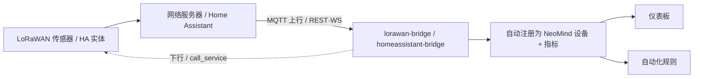

## 1. 方案概述

| 桥接 | 数据源 | 模式 | 典型设备 |
|---|---|---|---|
| **lorawan-bridge** | LoRaWAN 网络服务器（ChirpStack v3/v4、TTN）| MQTT 订阅上行 + API 下行 | 温湿度、土壤、水位、GPS 定位等无线传感器 |
| **homeassistant-bridge** | Home Assistant | REST 轮询 或 WebSocket 实时 | 灯、开关、传感器、空调等 3000+ HA 集成实体 |

**数据流向**：



sidebar_label: "LoRaWAN + Home Assistant"

## 2. 物料清单（BOM）

| 物料 | 规格 | 用途 | 必需 |
|------|------|------|------|
| **NeoMind 平台** | v0.9.0+ | 扩展宿主 | ✅ |
| **lorawan-bridge / homeassistant-bridge** | — | 按场景选 | ✅ |
| **LoRaWAN 网络服务器** | ChirpStack v3/v4 或 TTN（lorawan 用）| 设备接入中台 | LoRaWAN |
| **Home Assistant 实例** | 可网络访问 + 长效令牌（HA 用）| 实体来源 | HA |
| **传感器 / 智能设备** | LoRaWAN 节点 / HA 集成设备 | 数据源 | ✅ |

---

## 3. 安装扩展

两个桥接都从扩展 Marketplace 安装（市场版本 2.7.x）：

1. 打开 NeoMind 的 **扩展** 页 → **Marketplace** 标签，搜索 `lorawan-bridge`，点 **Install**；
2. 同样搜索并安装 `homeassistant-bridge`；
3. 安装完成后进入扩展详情页，确认状态为 **Running**。

CLI 等价操作：

```bash
neomind extension market-install lorawan-bridge
neomind extension market-install homeassistant-bridge
neomind extension status lorawan-bridge    # 安装后确认健康状态
```

> 本文后续所有命令（`connect` / `set_decoder` / `call_service` 等）在**扩展详情页的 Commands 标签**中发起，或通过 HTTP API 调用：`POST /api/extensions/:id/command`，请求体 `{"command": "...", "args": { ... }}`。

---

## 4. LoRaWAN 接入（lorawan-bridge）

支持 ChirpStack v3、ChirpStack v4、TTN 三种网络服务器；内置 Cayenne LPP 解码器（含 GPS 坐标）与自定义二进制解码；从 MQTT 上行消息自动发现设备；支持下行队列（FPort 1–223）与 RSSI/SNR 信号质量监测；MQTT 断线自动重连并恢复订阅。

### 4.1 前置准备（网络服务器侧）

连接扩展之前，先确认网络服务器侧就绪：

| 项目 | 要求 | 核对方式 |
|------|------|----------|
| MQTT broker | ChirpStack 的 MQTT 集成已启用，NeoMind 所在设备可访问 broker（明文 1883 / TLS 8883）| 在 NeoMind 主机上 `nc -vz <broker-ip> 1883` |
| 应用（Application）| 已创建应用并记下**应用 ID**（ChirpStack 为数字 ID，TTN 为应用名）| ChirpStack 控制台 Applications 页 |
| LoRa 节点 | 设备已在应用下完成入网（OTAA/ABP），能正常上报 | ChirpStack 设备页有最近 uplink 事件 |
| 下行 API | 想用下行时，准备好网络服务器的 API 地址与凭据（见 4.5）| — |

> TTN 用户：broker 地址形如 `mqtts://eu1.cloud.thethings.network:8883`，MQTT 用户名为 `{app_id}@{tenant_id}` 格式。

### 4.2 连接网络服务器（connect）

在 lorawan-bridge 扩展详情页执行 `connect`：

```json
{
  "ns_type": "chirpstack_v4",
  "broker_url": "mqtt://192.168.1.10:1883",
  "username": "...",
  "password": "...",
  "application_id": "1",
  "default_decoder": "cayenne"
}
```

**connect 参数表**：

| 参数 | 类型 | 必填 | 说明 |
|------|------|------|------|
| `ns_type` | string | ✅ | 网络服务器类型：`chirpstack`（v3）/ `chirpstack_v4` / `ttn` |
| `broker_url` | string | ✅ | MQTT broker 地址；`mqtt://` / `tcp://` 明文（默认 1883），`ssl://` / `mqtts://` 走 TLS（默认 8883）|
| `username` | string | — | MQTT 用户名 |
| `password` | string | — | MQTT 密码；**下行时兼作 API 凭据**（ChirpStack v4 / TTN 存 API Key，见 4.5）|
| `application_id` | string | ✅ | ChirpStack 应用 ID 或 TTN 应用 ID |
| `tenant_id` | string | — | TTN 租户 ID，缺省 `ttn` |
| `ns_api_url` | string | 下行必需 | 网络服务器 API 地址（如 `https://chirpstack.example.com`），仅下发指令时需要 |
| `default_decoder` | string | — | 新发现设备的默认解码器：`cayenne`（默认）或 `custom` |

连接成功后，扩展按网络服务器类型订阅对应上行 topic：

| 网络服务器 | 上行 topic | 说明 |
|---|---|---|
| ChirpStack v3 / v4 | `application/{id}/device/+/event/up` | v3 顶层 `devEui`，v4 嵌套 `deviceInfo.devEui` |
| TTN | `v3/{app_id}@{tenant_id}/devices/{dev_id}/up` | 仅 QoS 0（TTN MQTT 限制），优先取 `uplink_message.decoded_payload` |

扩展以 QoS 0 订阅；每条上行消息自动注册 / 更新设备。FPort 0 的消息是 MAC 命令，会被忽略。

> 📷 待补截图｜connect 配置 · 建议路径 `…/neomind/lorawan-ha/01-lorawan-connect.png`

### 4.3 验证

按顺序核对三个检查点：

1. **设备出现在 Devices 页**：设备 ID 形如 `lorawan-{dev_eui}`（如 `lorawan-0102030405060708`），名称为 `LoRa Device {dev_eui}`；或用 `list_devices` / `get_device(dev_eui)` 查看；
2. **指标名符合预期**：解码字段直接作为指标（Cayenne 为 `temperature` / `humidity` / `barometric_pressure` / `illuminance` / `latitude` / `longitude` / `altitude` 等，带单位）；TTN 预解码 payload 的键名会被规范化（含 `temp` → `temperature`，含 `hum` → `humidity` 等）；
3. **信号质量指标在更新**：每台设备带 `rssi`（dBm，越接近 0 越好）、`snr`（dB）、`f_cnt`（帧计数递增）、`last_seen`，有电池的设备还有 `battery`。

也可以用 `get_status` 查看 MQTT 连接状态与设备数，`messages_received` / `decode_errors` 指标可判断上行链路与解码健康度。

> 📷 待补截图｜设备与指标 · 建议路径 `…/neomind/lorawan-ha/03-lorawan-device.png`

### 4.4 解码

**Cayenne LPP**（默认）：标准解码，支持的传感器类型：

| Cayenne 类型 | 输出指标 | 单位 | 换算 |
|---|---|---|---|
| 温度（0x67）| `temperature` | °C | ×0.1 |
| 湿度（0x68）| `humidity` | % | ×0.5 |
| 气压（0x73）| `barometric_pressure` | hPa | ×0.1 |
| 光照（0x65）| `illuminance` | lux | 原值 |
| 模拟输入（0x02）| `analog_in` | V | ×0.01 |
| 数字输入 / 输出（0x00 / 0x01）| `digital_input` / `digital_output` | — | 原值 |
| GPS（0x06）| `latitude` / `longitude` / `altitude` | ° / ° / m | ×0.0001 / ×0.0001 / ×0.01 |

未知类型码会被跳过（按标准长度跳过对应字节），不影响其余字段解码。

**custom**：厂商私有二进制协议用 `set_decoder` 按设备定义字段映射：

| 参数 | 类型 | 必填 | 说明 |
|------|------|------|------|
| `dev_eui` | string | ✅ | 目标设备 EUI |
| `decoder_type` | string | ✅ | `cayenne` 或 `custom` |
| `fields` | array | custom 时 | 字段定义数组，见下 |

`fields` 数组元素结构（示例——一台「温度 + 土壤湿度」传感器，payload 前两字节温度、后两字节湿度）：

```json
{
  "dev_eui": "0102030405060708",
  "decoder_type": "custom",
  "fields": [
    { "name": "temperature", "offset": 0, "length": 2, "type": "int16", "scale": 0.1, "unit": "°C" },
    { "name": "soil_moisture", "offset": 2, "length": 2, "type": "uint16", "scale": 0.1, "unit": "%" }
  ]
}
```

| 字段键 | 说明 |
|---|---|
| `offset` / `length` | 字段在 payload 中的字节偏移与长度 |
| `name` | 指标名（即设备页看到的指标）|
| `type` | 数据类型：`uint8` / `uint16` / `int16` / `uint32` / `int32` |
| `scale` | 缩放系数（原始值 × scale = 实际值）|
| `unit` | 单位，仅用于展示 |

按设备生效：已有 `custom` 解码器的设备，即使 `default_decoder` 是 `cayenne` 也仍走自定义映射。

### 4.5 下行指令（send_downlink）

`send_downlink` 通过网络服务器 API 把十六进制 payload 压入设备下行队列：

```json
{ "dev_eui": "0102030405060708", "f_port": 10, "payload_hex": "01FF", "confirmed": false }
```

| 参数 | 类型 | 必填 | 说明 |
|------|------|------|------|
| `dev_eui` | string | ✅ | 目标设备 EUI（TTN 用 `device_id` 寻址）|
| `f_port` | integer | ✅ | 端口 **1–223**（0 被保留，224+ 为协议保留段）|
| `payload_hex` | string | ✅ | 十六进制 payload（自动转 base64 提交）|
| `confirmed` | boolean | — | 是否要求确认下行，默认 `false` |

三种网络服务器的下行实现由扩展自动适配，前提是 `connect` 时填了 `ns_api_url`，且凭据就绪：

| 网络服务器 | 下行 API | 认证 |
|---|---|---|
| ChirpStack v3 | `POST {ns_api_url}/api/devices/{dev_eui}/queue`（`deviceQueueItem`）| Basic（connect 的 username / password）|
| ChirpStack v4 | 同上路径，body 为 `queueItem`（snake_case 字段）| `Grpc-Metadata-Authorization: Bearer {API Key}`（API Key 即 connect 时的 `password`）|
| TTN | `POST {ns_api_url}/api/v3/as/applications/{app_id}/devices/{device_id}/down/push` | `Authorization: Bearer {API Key}`（即 connect 时的 `password`）|

未配置 `ns_api_url` 时下发会直接报错 `NS API URL not configured`。

---

## 5. Home Assistant 接入（homeassistant-bridge）

通过 REST（轮询）或 WebSocket（实时事件）连接 HA，自动发现实体并注册为 NeoMind 设备，支持按实体类型过滤与服务调用控制。

### 5.1 前置：生成长效访问令牌

在 HA **Profile → 安全 → 长效访问令牌（Long-Lived Access Tokens）** 创建一个令牌并复制（只显示一次）。确认 NeoMind 所在设备能访问 HA 的 HTTP 端口（默认 8123）。

### 5.2 连接（connect）

```json
{ "url": "http://192.168.1.20:8123", "token": "eyJ...", "mode": "websocket" }
```

| 参数 | 类型 | 必填 | 说明 |
|------|------|------|------|
| `url` | string | ✅ | HA 地址，含端口（如 `http://192.168.1.20:8123`）|
| `token` | string | ✅ | 长效访问令牌 |
| `mode` | string | — | `rest`（默认）或 `websocket` |
| `poll_interval_ms` | integer | — | REST 轮询间隔，默认 5000ms |

两种模式对比：

| 对比项 | REST 模式 | WebSocket 模式 |
|---|---|---|
| 数据方式 | 按 `poll_interval_ms` 周期轮询状态 | 事件流订阅，状态变化即时推送 |
| 实时性 | 取决于轮询间隔 | 实时 |
| 区域（Area）发现 | 不支持 | 支持（`get_areas`）|
| 断线行为 | 轮询报错计数（`poll_errors`）| 指数退避自动重连（上限 30s，认证成功后重置）|
| 适用场景 | 基础监控、低频查询 | 联动控制、状态卡片（**推荐**）|

> 📷 待补截图｜HA 连接 · 建议路径 `…/neomind/lorawan-ha/02-ha-connect.png`

### 5.3 验证

1. **实体注册为设备**：HA 实体以 `ha_{entity_id}` 为设备 ID 注册（`.` / `-` 替换为 `_`，如 `light.living_room` → `ha_light_living_room`），带 `state` / `value` / `unit` / `battery` 等指标；
2. **数量核对**：`get_status` 返回连接状态与实体数（`entity_count`），与 HA 中可见实体数量级一致；`list_entities` 可按类型筛选查看；
3. **区域分组**（WebSocket 模式）：`get_areas` 返回 HA 区域列表，可在 NeoMind 设备视图中按区域归类。

> 📷 待补截图｜HA 实体设备 · 建议路径 `…/neomind/lorawan-ha/04-ha-entities.png`

### 5.4 实体过滤（set_filters）

实体多时用 `set_filters` 只跟踪关注的类型：

| 参数 | 类型 | 必填 | 说明 |
|------|------|------|------|
| `entity_types` | string 数组 | ✅ | 要跟踪的实体 domain，如 `["light", "switch", "sensor", "binary_sensor", "climate"]` |

```json
{ "entity_types": ["light", "switch", "climate"] }
```

过滤后仅匹配 domain 的实体注册为设备；之后用 `refresh` 可强制刷新全部实体状态。`configure` 也能改 `poll_interval_ms` 与过滤器。

### 5.5 控制（call_service）

`call_service` 直接调用 HA 服务：

```json
{ "service": "light.turn_on", "entity_id": "light.living_room", "service_data": { "brightness": 200 } }
```

| 参数 | 类型 | 必填 | 说明 |
|------|------|------|------|
| `service` | string | ✅ | HA 服务名（`domain.service`）|
| `entity_id` | string | ✅ | 目标实体 |
| `service_data` | object | — | 服务参数（亮度、色温、温度等）|

常用服务对照：

| 服务 | 用途 | service_data 示例 |
|---|---|---|
| `light.turn_on` / `light.turn_off` / `light.toggle` | 灯开关 / 切换 | `{ "brightness": 200 }`、`{ "color_temp": 350 }` |
| `switch.turn_on` / `switch.turn_off` / `switch.toggle` | 开关量控制 | — |
| `climate.set_temperature` | 空调调温 | `{ "temperature": 24 }` |

---

## 6. 联动示例

两个桥接的设备 / 指标在规则引擎里可以直接互相联动（数据源格式 `device:{设备ID}:{指标}`，动作 `execute` 支持 `target_type: "extension"` 直接调用扩展命令）。

### 6.1 LoRaWAN 土壤湿度 → HA 灌溉

LoRa 土壤传感器（4.4 节自定义解码出 `soil_moisture`）湿度低于 30% 持续 60 秒时，经 homeassistant-bridge 打开灌溉阀门并发通知：

```json
{
  "name": "土壤湿度低自动灌溉",
  "trigger": { "trigger_type": "data_change" },
  "condition": {
    "condition_type": "comparison",
    "source": "device:lorawan-0102030405060708:soil_moisture",
    "operator": "less_than",
    "threshold": 30
  },
  "actions": [
    { "type": "notify", "message": "土壤湿度 {value}% 过低，已开阀灌溉", "severity": "warning" },
    { "type": "execute", "target": "homeassistant-bridge", "target_type": "extension", "command": "call_service",
      "params": { "service": "switch.turn_on", "entity_id": "switch.garden_valve" } }
  ],
  "for_duration": 60,
  "cooldown": 600
}
```

### 6.2 HA 人感 → LoRaWAN 下行开阀

HA 人体传感器 `binary_sensor.garden_motion` 检测到人（`state` 变为 `on`）时，经 lorawan-bridge 向室外阀门控制器下发开阀指令：

```json
{
  "name": "人感到达开阀",
  "trigger": { "trigger_type": "data_change" },
  "condition": {
    "condition_type": "comparison",
    "source": "device:ha_binary_sensor_garden_motion:state",
    "operator": "regex",
    "threshold_value": "^on$"
  },
  "actions": [
    { "type": "execute", "target": "lorawan-bridge", "target_type": "extension", "command": "send_downlink",
      "params": { "dev_eui": "0102030405060708", "f_port": 10, "payload_hex": "01FF", "confirmed": false } }
  ],
  "cooldown": 300
}
```

> 规则中的设备 ID / 指标名以实际注册为准（在 Devices 页确认）；下行 payload 需符合节点固件约定的格式。

---

## 7. 下游使用

两个桥接产出的指标与设备，用法与其他接入一致：

- **仪表板**：LoRaWAN 传感器曲线、HA 灯/空调状态卡片。
- **自动化规则**：土壤湿度低触发灌溉、人感联动开灯（[自动化规则](../user-guide/7-automation-rules.md)），跨桥接联动见上文第 5 节。
- **AI Chat**：「菜地土壤湿度多少」「把客厅灯调到 50%」自然语言查询与控制。

---

## 8. 故障排查

| 现象 | 可能原因 | 解决 |
|------|----------|------|
| ChirpStack 订阅成功但收不到上行 | `application_id` 与 ChirpStack 应用不符；broker 地址 / 账密错误 | 核对应用 ID（数字）；`get_status` 看 `connected`；用 MQTT 客户端确认 `application/{id}/device/+/event/up` 上确有消息 |
| TTN 收不到上行 | TTN MQTT 仅支持 QoS 0；`tenant_id` 不对；broker 应为 `mqtts://…:8883` | 核对 `{app_id}@{tenant_id}` 用户名与 `tenant_id`（缺省 `ttn`）；换成 TTS 集群对应域名与 TLS 端口 |
| 解码乱码 / 数值离谱 | 设备并非 Cayenne 格式；`set_decoder` 的 `offset` / `length` / `type` / `scale` 配错 | 用 `get_device` 看原始 payload，逐字段核对偏移与字节序后重设 `set_decoder`；下行报 `NS API URL not configured` 则是 `connect` 时漏填 `ns_api_url` |
| HA 报 401 / 认证失败 | 长效令牌过期或复制不完整 | HA Profile 重新生成令牌，重新 `connect` |
| WebSocket 模式反复重连 | `url` 写错（漏端口、误用 https）或令牌无效导致认证失败 | 修正 `url`（如 `http://192.168.1.20:8123`）与 `token`；认证成功后退避间隔自动重置 |
| HA 实体没出现在设备列表 | 被 `set_filters` 的 `entity_types` 过滤掉 | 把该实体的 domain 加入过滤列表，再执行 `refresh` |

---

## 9. 附录

### 相关文档

- [扩展管理](../user-guide/9-extensions.md)
- [自动化规则](../user-guide/7-automation-rules.md)
- [AI Chat](../user-guide/5-ai-chat.md)
- [工业协议接入（Modbus/OPC-UA/BACnet）](./8-industrial-protocols.md)
- lorawan-bridge / homeassistant-bridge 扩展 README

---

*最后更新: 2026-09-08*
