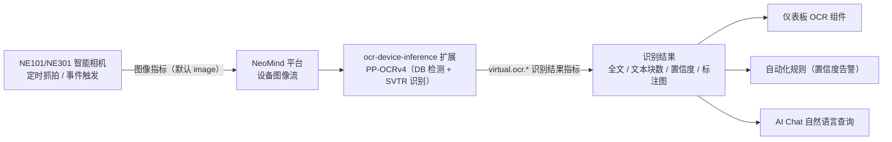

# OCR Solution

> 用 **OCR 扩展（`ocr-device-inference`）** 把 NE101/NE301 采集的图像自动变成可检索的文字——绑定图像流后每帧自动识别，结果进仪表板、自动化规则与 AI Chat。

---

## 1. 方案概述

NeoMind 的 **OCR 扩展（`ocr-device-inference`）** 可对设备采集的图像进行通用文字识别：扩展基于 **PP-OCRv4** 模型（DB 文本检测 + SVTR 文本识别，支持中英文切换），绑定设备图像流后对每一帧图像自动提取文字内容，并在仪表板中展示。识别结果还可通过 **AI Chat** 以自然语言方式查询。

**典型应用场景**：

| 场景 | 说明 |
|------|------|
| 铭牌读取 | 识别设备铭牌上的型号、序列号、参数等信息 |
| 标签识别 | 读取产品标签、条码旁的文字说明 |
| 文档数字化 | 将纸质文档、告示牌等内容转为可检索的文字 |
| 仪表读数 | 识别数字仪表盘上的读数（如电表、水表） |

**数据流向**：



| 环节 | 说明 |
|------|------|
| 图像采集 | NE101/NE301 通过定时抓拍或事件触发获取图像 |
| OCR 识别 | OCR 扩展自动对图像进行文字提取（检测 + 识别，可绘制文本框、支持 ROI 区域过滤）|
| 结果展示 | 仪表板实时展示识别结果，支持查看历史记录 |
| AI Chat 查询 | 通过自然语言查询已识别的文字内容 |

---

## 2. 物料清单（BOM）

| 物料 | 型号/规格 | 数量 | 用途 | 必需 |
|------|----------|------|------|------|
| **智能相机** | NE101 或 NE301 | 1+ | 图像采集 | ✅ |
| **NeoMind 平台** | v0.9.0+ | 1 | 边缘 AI 管理 | [下载](https://github.com/camthink-ai/NeoMind/releases/latest) ✅ |
| **OCR 扩展** | ocr-device-inference 2.7.x | 1 | 文字识别推理 | ✅ |

> 推理硬件自动适配：macOS 走 CoreML，Linux 有 NVIDIA GPU 时走 CUDA，其余回退 CPU，无需手动配置。

---

## 3. 前置准备

### 3.1 NeoMind 安装与配置

请先完成 NeoMind 的安装、注册和基本配置，详细步骤请参考 [NeoMind 快速入门](../user-guide/1-install-setup.md)。

### 3.2 设备接入

将 NE101 或 NE301 注册到 NeoMind 平台：

1. 在 NeoMind 中进入 **设备管理** 页面
2. 点击 **添加设备**，选择对应的设备类型（NE101 或 NE301）
3. 确认设备信息（设备 ID 与 Topic 由平台自动生成，也可自定义）
4. 保存并等待设备上线


> 详细的设备接入步骤请参考 [NeoMind 快速入门 - 设备管理](../user-guide/3-onboard-device.md)。

### 3.3 验证设备上线

- **Devices 页**出现新添加的设备（如 `ne301-new`），状态为在线。
- 设备详情中确认存在**图像指标**——OCR 绑定默认使用名为 `image` 的图像指标，请确认设备抓拍时该指标持续更新。
- 记下设备 ID，后续绑定与指标引用（DataSourceId 形如 `device:<设备ID>:<指标名>`）都会用到。

---

## 4. 安装 OCR 扩展

OCR 扩展发布在官方扩展市场，当前版本为 **2.7.x**（本文以 2.7.8 为例）。

### 4.1 通过扩展市场安装（推荐）

**步骤 1**：进入 **Extensions（扩展）** 管理页面，点击工具栏的 **扩展市场**（地球图标），在搜索框输入 `ocr-device-inference` 找到扩展


**步骤 2**：点击 **Install**，NeoMind 自动选择与当前平台 / ABI 匹配的 `.nep` 包并下载安装


**步骤 3**：安装完成后扩展自动出现在扩展列表中并启动，确认状态为已启用（Running）


> 此外，扩展市场还提供两个更新的 OCR 扩展：**`paddle-ocr-v6`**（PP-OCRv6 本地 ONNX 推理，多档模型）与 **`paddle-ocr-vl`**（高精度多语言识别、表格与关键信息抽取）。复杂版面/表格场景建议改用后者，见 [NE101 摄像头 OCR 应用案例](./4-camera-ocr.md) 与 [PaddleOCR-VL 用例](./5-paddle-ocr-vl.md)。

### 4.2 CLI 安装（可选）

```bash
neomind extension market-list                     # 查看市场可用扩展
neomind extension market-install ocr-device-inference   # 从市场安装（默认最新版）
neomind extension market-install ocr-device-inference --version 2.7.8
```

### 4.3 验证安装状态

- 扩展列表卡片与扩展详情页顶部状态应为 **Running**（绿色圆点）。
- 点击扩展卡片进入 **扩展详情页**，确认存在 总览 / 配置 / 命令（Commands）/ 指标（Metrics）/ 日志（Logs）标签。
- 切到 **指标（Metrics）** 标签，应能看到扩展级指标 `bound_devices`、`total_inferences`、`total_text_blocks`、`total_errors` 开始上报（初始为 0）。

> 命令调用入口说明：OCR 绑定与管理既可以在仪表板 OCR 组件中完成（见 [5.2](#52-添加-ocr-面板并绑定设备)），也可以通过扩展命令完成——扩展详情页 **命令（Commands）** 标签填参数执行，或 REST API `POST /api/extensions/:id/command`，请求体 `{"command":"...","args":{...}}`。

---

## 5. 仪表板配置与设备绑定

### 5.1 创建仪表板

进入 **Dashboard（仪表板）** 管理页面，点击 **创建仪表板**。

### 5.2 添加 OCR 面板并绑定设备

在仪表板编辑模式点击 **Add Component**，在 **Extensions** 页签选择 **OCR** 组件（由 `ocr-device-inference` 扩展提供），并绑定目标设备：

<div style={{display: 'flex', gap: '8px'}}>
  
  
</div>

绑定完成后，OCR 面板将自动接收并处理该设备采集的图像：


用户可在 Dashboard 页面添加其他所需的组件，提供更多的数据和内容展示。

OCR 组件同时支持**上传单张图片即时识别**与管理设备绑定，可在组件配置中开启 `drawBoxes`（绘制文本框）与 `showPreview`（结果预览）。

### 5.3 命令方式绑定与管理（可选）

除仪表板组件外，也可在扩展详情页 **命令（Commands）** 标签执行 `bind_device` 绑定（或经 REST 调用）：

```json
{
  "command": "bind_device",
  "args": {
    "device_id": "ne301-new",
    "image_metric": "image",
    "draw_boxes": true,
    "language": "chinese"
  }
}
```

| 命令 | 关键参数 | 说明 |
|------|----------|------|
| `bind_device` | `device_id`、`image_metric`（默认 `image`）、`draw_boxes`（默认 `true`）、`language`（`chinese` / `english`）| 绑定设备，图像更新即自动 OCR |
| `unbind_device` | `device_id` | 解除绑定 |
| `toggle_binding` | `device_id`、`active` | 启用 / 暂停已有绑定 |
| `get_bindings` | — | 查看所有绑定及状态 |
| `update_roi` | `device_id`、`roi_regions`、`roi_overlap_threshold`（默认 `0.5`）| 设置 ROI 多边形区域，只识别区域内文字（顶点为 0.0–1.0 归一化坐标）|
| `recognize_image` | `image`（base64）、`language` | 对单张 base64 图片做一次性 OCR |
| `get_status` | — | 查看扩展状态与统计 |

REST 调用示例（绑定设备）：

```bash
curl -X POST -H "X-API-Key: $NEOMIND_API_KEY" \
     -H "Content-Type: application/json" \
     -d '{"command":"bind_device","args":{"device_id":"ne301-new","image_metric":"image","draw_boxes":true,"language":"chinese"}}' \
     http://localhost:9375/api/extensions/ocr-device-inference/command
```

### 5.4 验证绑定

- 扩展详情页 **指标** 标签：`bound_devices` ≥ 1；设备抓拍后 `total_inferences` 持续增长、`total_errors` 不增长。
- 扩展详情页 **命令** 标签执行 `get_bindings`，确认绑定为 active 状态。
- 每次识别都会向设备写入 `virtual.ocr.*` 结果指标，DataSourceId 形如：
  - `device:ne301-new:virtual.ocr.full_text`（识别全文）
  - `device:ne301-new:virtual.ocr.count`（文本块数量）
  - `device:ne301-new:virtual.ocr.confidence`（平均置信度 0.0–1.0）
  - `device:ne301-new:virtual.ocr.annotated_image`（绘制文本框后的标注图）

---

## 6. 触发测试与查看结果

### 6.1 触发抓拍测试

设备绑定后，可通过手动触发抓拍来验证 OCR 识别效果。设备采集到图像后，OCR 扩展会自动进行文字识别。

### 6.2 查看识别结果

在仪表板的 OCR 面板中可以查看实时识别结果，包括原始图像和提取的文字内容：


### 6.3 查看历史识别记录

在设备详情中可以查看所有历史 OCR 识别记录，包括每次识别的原始图片和提取结果：

> 📷 待补截图｜设备详情 · 历史 OCR 识别记录列表 · 建议路径 `…/neomind/ocr-solution/device-history.png`

<div style={{display: 'flex', gap: '8px'}}>
  
  
</div>

---

## 7. AI Chat 查询

OCR 识别结果存储后，可以在 **AI Chat** 中通过自然语言查询已识别的文字内容。例如：

```
Hello, what's the OCR result of my device ne301-new? Reply in English.
```


> **提示**：AI Chat 功能需要配置 LLM 后端（如 Ollama），配置方法请参考 [NeoMind 快速入门](../user-guide/1-install-setup.md) 或 [配置 LLM 后端](../user-guide/2-configure-llm.md)。

---

## 8. 下游使用

OCR 识别结果以 `device:<设备ID>:<指标名>` 格式进入平台，仪表板、规则、AI Chat 引用时都用这一格式：

| 结果 | 指标名 | DataSourceId 示例 |
|------|--------|-------------------|
| 识别全文 | `virtual.ocr.full_text` | `device:ne301-new:virtual.ocr.full_text` |
| 文本块数量 | `virtual.ocr.count` | `device:ne301-new:virtual.ocr.count` |
| 平均置信度 | `virtual.ocr.confidence` | `device:ne301-new:virtual.ocr.confidence` |
| 标注图 | `virtual.ocr.annotated_image` | `device:ne301-new:virtual.ocr.annotated_image` |

- **仪表板**：把上述 DataSourceId 绑定到文本卡 / 数值卡 / 图片卡，实时展示识别全文、文本块数与置信度（见 [使用仪表板](../user-guide/4-use-dashboard.md)）。
- **自动化规则**：例如「识别置信度过低时提醒人工复核」——对 `virtual.ocr.confidence` 设阈值（[自动化规则](../user-guide/7-automation-rules.md)）。规则 JSON 示例：

```json
{
  "name": "OCR 识别置信度过低告警",
  "trigger": { "trigger_type": "data_change" },
  "condition": {
    "condition_type": "comparison",
    "source": "device:ne301-new:virtual.ocr.confidence",
    "operator": "less_than",
    "threshold": 0.6
  },
  "actions": [
    { "type": "notify", "message": "电表读数识别置信度过低（{value}），请人工复核", "severity": "warning" }
  ]
}
```

- **AI Chat**：自然语言查询，如「最近一小时 ne301-new 识别出了什么文字」。

---

## 9. 典型场景

| 场景 | 推荐配置 | 做法 |
|------|----------|------|
| **仪表读数**（电表 / 水表）| ROI 聚焦表盘 + `chinese` | `update_roi` 设置仅覆盖读数区域的多边形（0–1 归一化坐标），过滤表盘外文字，降低误识别；对 `virtual.ocr.confidence` 配置低置信度告警，及时人工复核 |
| **铭牌 / 标签识别** | `draw_boxes: true` | 开启文本框绘制，在标注图上核对识别区域；用手动抓拍 + `recognize_image` 先单张调通再绑定自动识别 |
| **文档数字化** | 分辨率优先 | 提高抓拍分辨率与对焦，文字过小会导致漏检；文档语种与 `language` 参数保持一致（当前支持 `chinese` / `english`）|
| **复杂版面 / 表格 / 多语种** | 改用 paddle 系扩展 | `ocr-device-inference` 面向通用文字行识别；表格还原与关键信息抽取建议改用 [PaddleOCR-VL](./5-paddle-ocr-vl.md)，摄像头端到端流水线见 [NE101 摄像头 OCR 应用案例](./4-camera-ocr.md) |

---

## 10. 故障排查

先用三件套定位：扩展详情页 **日志** 标签看进程输出、**指标** 标签看 `total_errors` 是否增长、**命令** 标签执行 `get_bindings` / `get_status` 看绑定与统计。常见故障：

| 故障现象 | 可能原因 | 解决方案 |
|----------|----------|----------|
| 绑定后 `total_inferences` 不增长，无识别结果 | `image_metric` 与设备实际图像指标名不一致；绑定处于 inactive 状态 | 确认设备图像指标名（默认 `image`）与 `bind_device` 参数一致；`get_bindings` 查看状态，用 `toggle_binding`（`active: true`）恢复 |
| `virtual.ocr.count` 为 0，识别不到文字 | 图像分辨率过低、文字过小或模糊；`language` 与文字语种不符（默认 `chinese`，仅支持中 / 英）| 提高抓拍分辨率与光照；把 `language` 切换为与场景一致的语种；先用 `recognize_image` 对单张清晰图验证，排除设备抓拍质量问题 |
| 识别框偏移、把无关文字也识别进来 | 全图识别混入背景文字；`draw_boxes` 标注框与期望区域不符 | 用 `update_roi` 设置只覆盖目标区域的多边形（顶点 0.0–1.0 归一化坐标），并按需调整 `roi_overlap_threshold`（默认 0.5，越大要求文字块与 ROI 重叠越多）|
| `total_errors` 持续增长，推理失败 | PP-OCRv4 模型文件（`det_mv3_db.onnx` / `rec_svtr.onnx` / `rec_en.onnx`）缺失或损坏；ONNX Runtime 异常 | 查看 **日志** 标签的具体报错；重新安装扩展或按扩展 README 重新下载模型；首次推理需加载模型，属正常慢 |
| 中英文混排识别乱码 / 漏字 | 扩展按单一语种识别（`chinese` 或 `english` 二选一）| 以主要语种选择 `language`；中英混排、多语种或表格场景建议改用 `paddle-ocr-v6` / `paddle-ocr-vl`（见 [4.1](#41-通过扩展市场安装推荐) 说明）|
| `virtual.ocr.confidence` 长期偏低 | 图像模糊、反光、拍摄角度倾斜 | 改善抓拍条件（对焦、补光、正对拍摄）；用 ROI 聚焦关键文字区域；配合 [8. 下游使用](#8-下游使用) 的低置信度告警规则兜底 |

---

## 11. 附录

### 相关文档

- [扩展管理](../user-guide/9-extensions.md)
- [使用仪表板](../user-guide/4-use-dashboard.md)
- [AI Chat](../user-guide/5-ai-chat.md)
- [配置 LLM 后端](../user-guide/2-configure-llm.md)
- [人脸识别方案](./3-face-recognition.md)（同为图像 AI 扩展，可与 OCR 组合使用）
- [NE101 摄像头 OCR 应用案例](./4-camera-ocr.md)
- [PaddleOCR-VL 文档理解](./5-paddle-ocr-vl.md)
- [NE101 Quick Start](../../2-neoeyes-ne101-series/1-quick-start.md)
- [NE301 Quick Start](../../5-neoeyes-ne301-series/1-quick-start.md)
- ocr-device-inference 扩展 README

---

*最后更新: 2026-09-08*
