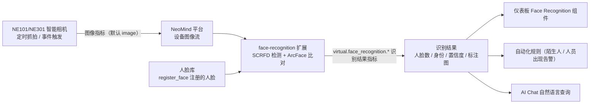

# Face Recognition Solution

> 用 **Face Recognition 扩展（`face-recognition`）** 把 NE101/NE301 采集的图像自动变成身份识别结果——SCRFD 检测人脸、ArcFace 比对人脸库，结果进仪表板、自动化规则与 AI Chat。

---

## 1. 方案概述

NeoMind 的 **Face Recognition 扩展** 可对设备采集的图像进行人脸检测与身份识别：采用 **SCRFD** 模型检测人脸，**ArcFace** 提取 512 维人脸特征向量与人脸库比对完成身份识别。绑定设备图像流后，设备每次抓拍都会自动检测与识别，并在仪表板中实时展示结果，也可通过 **AI Chat** 以自然语言方式查询。

**典型应用场景**：

| 场景 | 说明 |
|------|------|
| 门禁管理 | 识别进出人员身份，实现智能门禁控制 |
| 考勤打卡 | 自动识别员工面部特征，记录考勤信息 |
| 访客登记 | 对比访客与已注册人员，区分陌生人与已知人员 |
| 安全监控 | 在监控画面中实时检测和识别人员身份 |

**数据流向**：



| 环节 | 说明 |
|------|------|
| 图像采集 | NE101/NE301 通过定时抓拍或事件触发获取图像 |
| 人脸检测与识别 | 扩展自动检测人脸（SCRFD），提取特征与人脸库比对（ArcFace），未匹配人员标记为 `unknown` |
| 结果展示 | 仪表板实时展示人脸框、身份标签与置信度，支持查看历史记录 |
| AI Chat 查询 | 通过自然语言查询历史识别记录与统计 |

---

## 2. 物料清单（BOM）

| 物料 | 型号/规格 | 数量 | 用途 | 必需 |
|------|----------|------|------|------|
| **智能相机** | NE101 或 NE301 | 1+ | 图像采集 | ✅ |
| **NeoMind 平台** | v0.9.0+ | 1 | 边缘 AI 管理 | [下载](https://github.com/camthink-ai/NeoMind/releases/latest) ✅ |
| **Face Recognition 扩展** | face-recognition 2.7.x | 1 | 人脸检测与身份识别 | ✅ |
| **本地 LLM** | Ollama | 1 | AI Chat 后端 | 可选 |

---

## 3. 前置准备

### 3.1 NeoMind 安装与配置

请先完成 NeoMind 的安装、注册和基本配置，详细步骤请参考 [NeoMind 快速入门](../user-guide/1-install-setup.md)。

### 3.2 设备接入

将 NE101 或 NE301 注册到 NeoMind 平台：

1. 在 NeoMind 中进入 **设备管理** 页面
2. 点击 **添加设备**，选择对应的设备类型（NE101 或 NE301）
3. 确认设备信息（设备 ID 与 Topic 由平台自动生成，也可自定义）
4. 保存并等待设备上线

> 详细的设备接入步骤请参考 [NeoMind 快速入门 - 设备管理](../user-guide/3-onboard-device.md)。

### 3.3 验证设备上线

- **Devices 页**出现新添加的设备（如 `ne101-gate`），状态为在线。
- 设备详情中确认存在**图像指标**——人脸识别绑定默认使用名为 `image` 的图像指标，请确认设备抓拍时该指标持续更新。
- 记下设备 ID，后续绑定与指标引用（DataSourceId 形如 `device:<设备ID>:<指标名>`）都会用到。

---

## 4. 安装 Face Recognition 扩展

扩展发布在官方扩展市场，当前版本为 **2.7.x**（本文以 2.7.8 为例）。

### 4.1 通过扩展市场安装（推荐）

**步骤 1**：进入 **Extensions（扩展）** 管理页面，点击工具栏的 **扩展市场**（地球图标），在搜索框输入 `face-recognition` 找到扩展


**步骤 2**：点击进入扩展详情页，查看扩展说明后点击 **Install**，NeoMind 自动下载安装。安装完成后扩展自动出现在扩展列表中并启动，确认状态为已启用（Running）


### 4.2 CLI 安装（可选）

```bash
neomind extension market-list                     # 查看市场可用扩展
neomind extension market-install face-recognition # 从市场安装（默认最新版）
neomind extension market-install face-recognition --version 2.7.8
```

### 4.3 验证安装状态

- 扩展列表卡片与扩展详情页顶部状态应为 **Running**（绿色圆点）。
- 点击扩展卡片进入 **扩展详情页**，确认存在 总览 / 配置 / 命令（Commands）/ 指标（Metrics）/ 日志（Logs）标签。
- 切到 **指标（Metrics）** 标签，应能看到扩展级指标 `bound_devices`、`total_inferences`、`total_recognized`、`total_unknown` 开始上报（初始为 0）。

> SCRFD（`det_10g.onnx`）与 ArcFace 模型随扩展分发，并在**首次推理时懒加载**——安装后第一帧识别会稍慢，属正常现象。

---

## 5. 仪表板配置与使用

### 5.1 创建仪表板并添加 Face Recognition 组件

进入 **Dashboard（仪表板）** 管理页面，点击 **创建仪表板**，然后点击 **Add Component**，在 **Extensions** 页签选择 **Face Recognition** 组件（由 `face-recognition` 扩展提供）：


### 5.2 绑定设备

在 Face Recognition 组件中绑定目标设备（NE101 或 NE301），图像指标使用设备实际的图像指标名（默认 `image`）。绑定完成后组件将自动接收并处理该设备采集的图像：


> 📷 待补截图｜Face Recognition 组件绑定设备界面 · 建议路径 `…/neomind/face-recognition/dashboard-3b.png`

也可在扩展详情页 **命令（Commands）** 标签执行 `bind_device` 绑定（或经 REST `POST /api/extensions/:id/command` 调用），参数 `device_id` + `metric_name`（默认 `image`）：

```json
{ "command": "bind_device", "args": { "device_id": "ne101-gate", "metric_name": "image" } }
```

绑定管理命令：`get_bindings` 查看所有绑定及状态、`toggle_binding`（`device_id` + `active`）启用/暂停、`unbind_device` 解除绑定。

### 5.3 注册人脸

在使用身份识别功能前，需要先注册人脸到人脸库中。在 Face Recognition 组件中点击 **注册人脸**，上传人员面部照片并填写对应的身份信息：


> 注册的人脸照片建议正面清晰、光线充足，以提高识别准确率。

也可通过 `register_face` 命令注册（参数 `name` + `image`，`image` 为 base64 编码照片），并用 `list_faces` 查看人脸库、`delete_face`（参数 `face_id`）删除。人脸库持久化保存，扩展重启后无需重新注册。

### 5.4 测试识别效果

人脸注册完成后，设备采集到图像时，扩展会自动进行人脸检测和身份识别。在仪表板中可以查看实时识别结果：


识别结果包括：

| 信息 | 说明 |
|------|------|
| 人脸框 | 图像中标注检测到的人脸位置 |
| 身份标签 | 已识别人员显示对应的身份信息；未匹配人员显示 `unknown` |
| 置信度 | 识别结果的置信度分数 |

识别阈值与容量可通过 `configure` 命令在运行时调整（`get_config` 查看当前配置）：

```json
{ "command": "configure", "args": { "config": { "recognition_threshold": 0.45, "max_faces": 10 } } }
```

| 配置项 | 默认值 | 说明 |
|--------|--------|------|
| `recognition_threshold` | `0.45` | 身份比对相似度阈值，越高越严格（误认少但漏认多），越低越宽松 |
| `max_faces` | `10` | 单帧最多处理的人脸数量 |
| `confidence_threshold` | `0.5` | 人脸检测置信度阈值 |

### 5.5 查看历史识别记录

在设备详情中可以查看所有历史人脸识别记录，包括每次识别的原始图片和识别结果：


<div style={{display: 'flex', gap: '8px'}}>
  
  
</div>

### 5.6 验证

- 扩展详情页 **指标** 标签：`bound_devices` ≥ 1；人员出现在画面中时 `total_inferences` 持续增长，识别命中时 `total_recognized` 增长、陌生人出现时 `total_unknown` 增长。
- 扩展详情页 **命令** 标签执行 `get_bindings`，确认绑定为 active 状态；`list_faces` 确认人脸已入库。
- 每次识别都会向设备写入 `virtual.face_recognition.*` 结果指标，DataSourceId 形如：
  - `device:ne101-gate:virtual.face_recognition.face_count`（检测到的人脸数量）
  - `device:ne101-gate:virtual.face_recognition.face_names`（身份列表，逗号分隔，未匹配为 `unknown`）
  - `device:ne101-gate:virtual.face_recognition.confidence`（平均置信度）
  - `device:ne101-gate:virtual.face_recognition.annotated_image`（绘制人脸框后的标注图）

---

## 6. AI Chat 查询

人脸识别结果存储后，可以在 **AI Chat** 中通过自然语言查询已识别的人脸数据。例如：

```
hello, please analyse the history data and result of 'face recognition', reply in english
```


> **提示**：AI Chat 功能需要配置 LLM 后端（如 Ollama），配置方法请参考 [NeoMind 快速入门](../user-guide/1-install-setup.md) 或 [配置 LLM 后端](../user-guide/2-configure-llm.md)。

---

## 7. 下游使用

人脸识别结果以 `device:<设备ID>:<指标名>` 格式进入平台，仪表板、规则、AI Chat 引用时都用这一格式：

| 结果 | 指标名 | DataSourceId 示例 |
|------|--------|-------------------|
| 人脸数量 | `virtual.face_recognition.face_count` | `device:ne101-gate:virtual.face_recognition.face_count` |
| 身份列表 | `virtual.face_recognition.face_names` | `device:ne101-gate:virtual.face_recognition.face_names` |
| 平均置信度 | `virtual.face_recognition.confidence` | `device:ne101-gate:virtual.face_recognition.confidence` |
| 标注图 | `virtual.face_recognition.annotated_image` | `device:ne101-gate:virtual.face_recognition.annotated_image` |

- **仪表板**：把上述 DataSourceId 绑定到文本卡 / 数值卡 / 图片卡，实时展示在场人员、身份与标注画面（见 [使用仪表板](../user-guide/4-use-dashboard.md)）。
- **自动化规则**：例如「门口检测到人员出现即通知」——对 `virtual.face_recognition.face_count` 设阈值（[自动化规则](../user-guide/7-automation-rules.md)）。规则 JSON 示例：

```json
{
  "name": "周界人员出现告警",
  "trigger": { "trigger_type": "data_change" },
  "condition": {
    "condition_type": "comparison",
    "source": "device:ne101-gate:virtual.face_recognition.face_count",
    "operator": "greater_than",
    "threshold": 0
  },
  "actions": [
    { "type": "notify", "message": "门口相机检测到 {value} 张人脸，请留意", "severity": "warning" }
  ]
}
```

- **AI Chat**：自然语言查询，如「今天门口相机识别到了谁」「最近一小时有多少陌生人经过」。

---

## 8. 典型场景

| 场景 | 推荐配置 | 做法 |
|------|----------|------|
| **门禁 / 周界监控** | 阈值从严 + 告警规则 | 注册常驻人员后，把 `recognition_threshold` 保持在默认 0.45 或略高，减少误放行；对 `face_count` 配置「大于 0 即通知」规则，陌生人以 `unknown` 出现在 `face_names` 中便于追查 |
| **考勤打卡** | 固定机位 + 单人脸 | 相机正对打卡位，画面中通常只有一张脸；按 `face_names` 出现的员工身份记录考勤，配合 AI Chat 做「今天谁打过卡」统计 |
| **访客登记** | 白名单比对 | 只注册内部员工；访客出现时身份为 `unknown`，以此区分访客与已知人员并触发接待流程 |
| **人群监控**（如门店、车间）| 调大容量 | 单帧人脸较多时用 `configure` 把 `max_faces` 调大（默认 10）；关注 `total_recognized` / `total_unknown` 统计趋势而非单帧结果 |

---

## 9. 故障排查

先用三件套定位：扩展详情页 **日志** 标签看进程输出、**指标** 标签看 `total_inferences` / `total_recognized` / `total_unknown` 计数、**命令** 标签执行 `get_bindings` / `list_faces` / `get_config` 看绑定、人脸库与配置。常见故障：

| 故障现象 | 可能原因 | 解决方案 |
|----------|----------|----------|
| `register_face` 注册失败或注册后识别不出 | 上传照片中无人脸、照片模糊或非正面；照片光线过暗 | 更换正面、清晰、光线充足的照片重新注册；注册后用 `list_faces` 确认已入库 |
| 已注册人员被识别为 `unknown` | `recognition_threshold` 过高；现场角度 / 距离与注册照差异大 | 用 `get_config` 查看阈值，适当调低 `recognition_threshold`（默认 0.45）；用与现场相近角度的照片重新注册 |
| 陌生人被误识别为已注册人员 | `recognition_threshold` 过低，比对过于宽松 | 适当调高 `recognition_threshold`；补充更多角度的注册照，提升区分度 |
| 多人同框时部分人脸漏检 | `max_faces` 达到上限（默认 10）；`confidence_threshold` 过高漏检 | `configure` 调大 `max_faces`；必要时调低检测阈值 `confidence_threshold`（默认 0.5）|
| 绑定后 `total_inferences` 不增长，无任何识别 | `metric_name` 与设备实际图像指标名不一致；绑定处于 inactive 状态 | 确认设备图像指标名（默认 `image`）与绑定参数一致；`get_bindings` 查看状态，用 `toggle_binding`（`active: true`）恢复 |
| 安装后首次识别很慢或超时 | SCRFD / ArcFace 模型在**首次推理时懒加载** | 属正常现象，等待首帧完成即可；后续推理恢复速度，可观察 `total_inferences` 确认在持续工作 |

---

## 10. 附录

### 相关文档

- [扩展管理](../user-guide/9-extensions.md)
- [使用仪表板](../user-guide/4-use-dashboard.md)
- [AI Chat](../user-guide/5-ai-chat.md)
- [配置 LLM 后端](../user-guide/2-configure-llm.md)
- [NeoMind 快速入门](../user-guide/1-install-setup.md)
- [OCR 文字识别方案](./2-ocr-text-extraction.md)（同为图像 AI 扩展，可组合使用）
- [目标检测应用案例](./1-object-detection.md)
- [NE101 Quick Start](../../2-neoeyes-ne101-series/1-quick-start.md)
- [NE301 Quick Start](../../5-neoeyes-ne301-series/1-quick-start.md)
- face-recognition 扩展 README

---

*最后更新: 2026-09-08*
