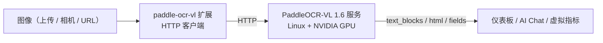

# PaddleOCR-VL Document Understanding

> 基于 VLM 的文档理解扩展——高精度 OCR、表格识别、关键信息抽取（KIE），擅长复杂版面与票据表单。需要 GPU 服务器。

---

## 1. 方案概述

paddle-ocr-vl 是一个 **HTTP 桥接扩展**：扩展本身是轻量客户端（约 MB 级），真正的 PaddleOCR-VL 1.6 模型跑在一台独立的 Python 推理服务上（推荐 Linux + NVIDIA GPU）。这种拆分让扩展跨平台，重推理放到 GPU。

它提供四条命令：

| 能力 | 命令 | 输出 | 适用 |
|---|---|---|---|
| 高精度多语种 OCR | `recognize` | `text_blocks` + `full_text` | 复杂版面、多语种混排 |
| 表格识别 | `recognize_table` | HTML 表格 | 财务报表、检测报告中的表格 |
| 关键信息抽取（KIE） | `extract_keys` | 结构化字段 `fields` | 发票 / 票据 / 表单字段化 |
| 服务探活 | `health` | `status` / `model_loaded` / `load_error` | 部署后连通性与模型加载检查 |

**数据流向**：



> 与 [paddle-ocr-v6](./4-camera-ocr.md) 的核心区别：v6 是本地 ONNX、纯文字提取、边缘可跑；paddle-ocr-vl 是远端 VLM、能理解版面 / 表格 / 语义、需 GPU 服务。选型见第 7 节。

---

## 2. 物料清单（BOM）

| 物料 | 规格 | 用途 | 必需 |
|------|------|------|------|
| **NeoMind 平台** | v0.9.0+ | 扩展宿主 | ✅ |
| **paddle-ocr-vl 扩展** | v2.7.7+ | HTTP 桥接 | ✅ |
| **GPU 推理服务器** | Linux + NVIDIA GPU（CUDA 12.6） | 运行 PaddleOCR-VL Python 服务 | ✅ |
| **本地 LLM** | Ollama 等 | AI Chat 后端 | 可选 |

> 推理服务后端支持：Linux x86_64（CUDA，生产推荐）、Linux ARM64（Jetson + JetPack）、Windows（CUDA）；macOS 仅 CPU——Apple Silicon 较慢、Intel 不实用。扩展本体为纯 Rust + HTTP 客户端，全部平台均可安装。

---

## 3. 前置准备：部署推理服务

在 GPU 服务器的扩展源码 `server/` 目录下：

```bash
cd extensions/paddle-ocr-vl/server

python -m venv .venv_paddleocr && source .venv_paddleocr/bin/activate

# GPU（CUDA 12.6）
pip install paddlepaddle-gpu==3.2.1 -i https://www.paddlepaddle.org.cn/packages/stable/cu126/
# 或 CPU：pip install paddlepaddle==3.2.1

pip install -r requirements.txt
./download_models.sh     # 预下载 1–2GB 模型权重到 ~/.paddlex（可选；首次推理也会自动下载）

python3 server.py        # → http://0.0.0.0:8000
# 可用 HOST / PORT / PADDLE_DEVICE 环境变量覆盖
```

> **GPU 服务器注意**：服务端 `PADDLE_DEVICE` 默认为 `cpu`，GPU 机器需显式以 `PADDLE_DEVICE=gpu python3 server.py` 启动，否则 VLM 回落到 CPU 推理（极慢）。

> 没有 GPU、或想先验证接线，可跑 **mock 服务**：它实现与真实服务完全相同的 HTTP 接口，返回固定示例响应，只依赖 `fastapi` + `uvicorn`，一台普通笔记本就能跑：

```bash
cd extensions/paddle-ocr-vl/server
pip install fastapi uvicorn
python3 mock_server.py     # → http://127.0.0.1:8000
```

mock 服务对 KIE 请求返回如下固定示例（`/health` 恒为 `{"status": "ok", "version": "1.6-mock", "model_loaded": true}`）：

```json
{
  "fields": {
    "invoice_no": "INV-2026-0001",
    "date": "2026-07-06",
    "total": "$86.50",
    "vendor": "Acme Corp",
    "customer": "NeoMind"
  },
  "processing_time_ms": 30.0
}
```

mock 只用于打通「扩展 → 服务 → 卡片渲染」链路，不能评估识别精度；验证通过后把 `endpoint` 指向真实服务地址即可（扩展默认 `endpoint` 就指向 `127.0.0.1:8000`，本机联调时无需修改）。

服务就绪后，在扩展详情页执行 `health` 命令：返回 `status: ok` 即服务在线。`model_loaded` 在**首次推理后**才变为 `true`（`/health` 探活不会主动加载模型）；若返回 `status: degraded`，看响应里的 `load_error` 字段定位加载失败原因。

> 📷 待补截图｜health 检查 · 建议路径 `…/neomind/paddle-ocr-vl/01-health.png`

---

## 4. 安装与配置扩展

进入 **Extensions** 页面，从扩展市场安装 **paddle-ocr-vl**（安装方式见[扩展管理](../user-guide/9-extensions.md)）；在 **Configuration** 里把 `endpoint` 指向推理服务地址（如 `http://<GPU服务器IP>:8000`）。

| 配置项 | 类型 | 默认值 | 范围 / 选项 | 说明 |
|--------|------|--------|-------------|------|
| `endpoint` | String | `http://127.0.0.1:8000` | http(s) URL | PaddleOCR-VL 服务地址（末尾多余 `/` 自动去除）|
| `language` | String | `ch` | `ch` / `en` / `japan` / `korean` / `german` / `french` | OCR 语言提示 |
| `use_doc_orientation_classify` | Boolean | `false` | `true` / `false` | 识别前做方向分类并自动旋转 |
| `use_doc_unwarping` | Boolean | `false` | `true` / `false` | 去扭曲（拍摄 / 弯曲文档）|
| `timeout_ms` | Integer | `30000` | 1000–120000 | HTTP 超时（ms）；超出范围的值会被忽略并保持默认 |

> `recognize` 命令的 `language` / `use_doc_orientation_classify` / `use_doc_unwarping` 参数可按次覆盖上述配置；未传时回落到配置值。命令级 `language` 另支持 `multilingual`（多语种混排）。

> 扩展自身上报 5 个指标（详情页 **指标** 标签）：`request_count`、`success_count`、`failure_count`、`last_latency_ms`、`last_recognized_block_count`（后两项在首次成功请求后才开始上报）。排查故障时先看 `failure_count` 是否增长。

> 📷 待补截图｜安装并配置 endpoint · 建议路径 `…/neomind/paddle-ocr-vl/02-install-config.png`

---

## 5. 使用方式

### 5.1 在 Dashboard 用卡片测试（PaddleOcrCard）

扩展自带前端组件 **PaddleOcrCard**——在 [仪表板](../user-guide/4-use-dashboard.md) 添加该卡片即可图形化测试，无需手填命令参数：

1. 上传一张图片（拖拽或点击，支持 PNG/JPG/WEBP）。
2. 切换模式：**Text**（`recognize`）/ **Table**（`recognize_table`）/ **Keys**（`extract_keys`）。
3. 在设置里选语言，按需开启「自动旋转」「去变形」（适合拍摄歪斜的文档）。
4. 执行后：Text 模式在图上叠加彩色文字块并列出文本（可切「分块 / 纯文本」视图）；Table 模式直接渲染 HTML 表格；Keys 模式列出抽取的键值对。

> 底层调用的就是扩展命令，卡片只封装了上传、参数与结果可视化。

> 📷 待补截图｜Dashboard PaddleOcrCard 测试 · 建议路径 `…/neomind/paddle-ocr-vl/03-dashboard-card.png`

### 5.2 接入 NE101 摄像头组件

在 [NE101 摄像头组件](./4-camera-ocr.md) 里把 `processingExtensionId` 选为 **`paddle-ocr-vl`**，模板 `text_detection` → 调 `recognize`。适合相机拍摄的海报、铭牌、屏幕等需要高质量 OCR 的场景，返回的 `text_blocks` 与组件的叠加渲染兼容。

### 5.3 通过 AI Chat

直接对 [AI Chat](../user-guide/5-ai-chat.md) 说「用 paddle-ocr-vl 把这张发票的发票号、日期、金额抽出来」，LLM 会自动调用命令并解读结果。

### 5.4 通过命令 / REST API 调用

所有命令可在扩展详情页 **命令（Commands）** 标签填参执行，或走 REST API（`POST /api/extensions/:id/command`，请求体 `{"command":"...","args":{...}}`）。例如用 URL 代替 Base64 传图做 KIE：

```bash
curl -X POST -H "X-API-Key: $NEOMIND_API_KEY" \
     -H "Content-Type: application/json" \
     -d '{"command":"extract_keys","args":{"image_url":"http://192.168.1.20/img/receipt.jpg","schema":{"fields":["invoice_no","date","total"]}}}' \
     http://localhost:9375/api/extensions/paddle-ocr-vl/command
```

> 图片二选一：`image_base64`（Base64 字节，推荐）或 `image_url`（由推理服务端拉取）。`recognize` / `recognize_table` / `extract_keys` 均要求二者必填其一，否则返回参数错误。

一次完整的多语种 OCR 调用（`recognize`，命令级参数覆盖配置默认值）：

```bash
curl -X POST -H "X-API-Key: $NEOMIND_API_KEY" \
     -H "Content-Type: application/json" \
     -d '{"command":"recognize","args":{"image_base64":"/9j/4AAQSkZJRg…","image_width":1920,"image_height":1080,"language":"ch","use_doc_orientation_classify":true,"use_doc_unwarping":true}}' \
     http://localhost:9375/api/extensions/paddle-ocr-vl/command
```

返回的 `text_blocks` 每个元素对应一个文字块，`bbox` 为 0–1 归一化坐标（与 NE101 摄像头组件的叠加渲染兼容）：

```json
{
  "text_blocks": [
    { "text": "发票号码 INVOICE NO.", "confidence": 0.985,
      "bbox": { "x": 0.05, "y": 0.10, "width": 0.30, "height": 0.04 } },
    { "text": "INV-2026-0001", "confidence": 0.972,
      "bbox": { "x": 0.68, "y": 0.10, "width": 0.24, "height": 0.04 } }
  ],
  "full_text": "发票号码 INVOICE NO.\nINV-2026-0001",
  "processing_time_ms": 423.5,
  "language": "ch"
}
```

**直接调用推理服务的 HTTP 接口**（跳过扩展，用于服务侧独立排障或第三方系统集成）。服务监听 `0.0.0.0:8000`，接口与扩展命令一一对应：`POST /ocr` ↔ `recognize`、`POST /table` ↔ `recognize_table`、`POST /kie` ↔ `extract_keys`、`GET /health` ↔ `health`。请求体即 `args` 内容本身，例如：

```bash
curl -X POST http://<GPU服务器IP>:8000/ocr \
     -H "Content-Type: application/json" \
     -d '{"image_base64":"/9j/4AAQSkZJRg…","language":"ch","use_doc_orientation_classify":false,"use_doc_unwarping":false}'
```

```json
{
  "results": [
    { "rec_text": "Hello", "rec_score": 0.982,
      "dt_polynomial": [[96.0, 108.0], [1056.0, 108.0], [1056.0, 194.4], [96.0, 194.4]] }
  ],
  "full_text": "Hello",
  "processing_time_ms": 420.5,
  "image_width": 1920,
  "image_height": 1080
}
```

注意服务原始返回与扩展命令返回的两处差异：服务端是 `results`（`rec_text` / `rec_score` / 四点多边形 `dt_polynomial`，像素坐标），扩展已归一化为 `text_blocks`（`text` / `confidence` / 矩形 `bbox`）并补齐 `language` 字段。`POST /kie` 的服务端请求体为 `{"image_base64":"…","schema":{"fields":["invoice_no","date","total"]}}`，返回 `{"fields":{…},"processing_time_ms":…}`，与命令返回一致。

---

## 6. 典型场景

### 6.1 发票 / 票据结构化抽取（KIE）

用 `extract_keys` + schema 把票据字段化（图片二选一，这里用 base64）：

```json
{
  "command": "extract_keys",
  "args": {
    "image_base64": "<发票照片的 base64 字节>",
    "schema": { "fields": ["invoice_no", "date", "total", "seller"] }
  }
}
```

返回形如：

```json
{
  "fields": {
    "markdown": "…整页解析出的 Markdown 文本…",
    "invoice_no": "<requires LLM post-processing>",
    "date": "<requires LLM post-processing>",
    "total": "<requires LLM post-processing>",
    "seller": "<requires LLM post-processing>"
  },
  "processing_time_ms": 812.4
}
```

> **注意**：PaddleOCR-VL 是文档解析模型而非专用 KIE 模型，服务端按 best-effort 处理——整页内容放在 `fields.markdown`，schema 声明的字段以占位符返回。真实字段抽取需在其上叠一层 LLM：用 [AI Chat](../user-guide/5-ai-chat.md) 把 `markdown` 内容按 schema 抽成 JSON，再经 [数据推送](../user-guide/7c-data-push.md) 写入数据库 / ERP。用 `mock_server.py` 联调时返回的则是固定示例值（如 `invoice_no: INV-2026-0001`），可用于打通链路。

> 📷 待补截图｜发票 KIE 结果 · 建议路径 `…/neomind/paddle-ocr-vl/04-invoice-kie.png`

### 6.2 表格识别

财务报表、检测报告、规格表里的表格，用 `recognize_table` 转成 HTML：

```json
{ "command": "recognize_table", "args": { "image_base64": "<base64-bytes>" } }
```

返回形如：

```json
{
  "html": "<table border='1' cellspacing='0' cellpadding='4'><thead><tr><th>Item</th><th>Qty</th><th>Price</th></tr></thead><tbody><tr><td>Widget</td><td>3</td><td>$12.50</td></tr><tr><td>Total</td><td>4</td><td>$86.50</td></tr></tbody></table>",
  "processing_time_ms": 1730.25
}
```

服务端返回版面中**最大的一张表**的 HTML。在 [仪表板](../user-guide/4-use-dashboard.md) 用 HTML / Markdown 组件渲染，即可还原带合并结构的表格。

> 📷 待补截图｜表格识别 → HTML · 建议路径 `…/neomind/paddle-ocr-vl/05-table.png`

### 6.3 文档数字化（复杂版面 / 拍摄扭曲文档）

多栏、图文混排的纸质文档，或手机拍摄的弯曲 / 倾斜页面，用 `recognize` 一步转成可检索文本（拍摄歪斜的文档建议同时开启方向分类与去扭曲）：

```json
{
  "command": "recognize",
  "args": {
    "image_base64": "<base64-bytes>",
    "image_width": 1920,
    "image_height": 1080,
    "language": "ch",
    "use_doc_orientation_classify": true,
    "use_doc_unwarping": true
  }
}
```

返回形如：

```json
{
  "text_blocks": [
    { "text": "Hello", "confidence": 0.97,
      "bbox": { "x": 0.05, "y": 0.20, "width": 0.50, "height": 0.60 } }
  ],
  "full_text": "Hello\nWorld",
  "processing_time_ms": 420,
  "language": "ch"
}
```

开启 `use_doc_unwarping` 与 `use_doc_orientation_classify` 后，服务先矫正方向与扭曲再解析，能明显提升多栏、图文混排等复杂版面的准确率。`bbox` 为 0–1 归一化坐标（传入 `image_width` / `image_height` 可提高归一化精度）；`full_text` 即全文纯文本，可直接入库做全文检索或喂给 LLM 做摘要问答。

---

## 7. 选型：paddle-ocr-vl vs paddle-ocr-v6

| 维度 | paddle-ocr-v6 | paddle-ocr-vl |
|------|---------------|---------------|
| 模型 | PP-OCRv6（ONNX，本地） | PaddleOCR-VL 1.6（VLM，远端 GPU）|
| 能力 | 纯文字提取 | 文字 + 表格 + KIE + 版面理解 |
| 部署 | 自包含，边缘可跑 | 需 GPU 推理服务 |
| 延迟 | 毫秒级 | 秒级 |
| 适合 | 简单印刷体、读数、离线 | 复杂版面、表格、票据结构化、拍摄文档 |

> 纯边缘、完全没有 GPU 服务器的部署：选 `ocr-device-inference`（本地 SVTR ONNX，几十 MB，CPU 友好），见 [通用 OCR 方案](./2-ocr-text-extraction.md)；本地多档模型的文字提取选 [paddle-ocr-v6](./4-camera-ocr.md)；表格 / KIE / 复杂版面才上本文的 paddle-ocr-vl。

---

## 8. 故障排查

先用三件套定位：扩展详情页 **日志** 标签看进程输出、**指标** 标签看 `failure_count` / `last_latency_ms`、执行 `health` 命令看服务状态（固定 5s 超时，返回 `status` / `model_loaded` / `load_error`）。常见故障：

| 故障现象 | 可能原因 | 解决方案 |
|----------|----------|----------|
| 首次推理卡住或报模型下载失败 | 首次推理需从 Paddle 官方模型源下载 ~1–2GB 权重到 `~/.paddlex`，内网 / 限网服务器访问不到 | 在有外网的环境先执行 `./download_models.sh` 预热，再把 `~/.paddlex` 缓存目录拷贝到服务器；加载失败时 `/health` 返回 `status: degraded` 并带 `load_error`，按报错处理 |
| 推理极慢、GPU 占用为 0 | `PADDLE_DEVICE` 未设置（默认 `cpu`）；或装成了 CPU 版 `paddlepaddle` 而非 `paddlepaddle-gpu==3.2.1`（cu126 源）；CUDA 版本与 wheel 不匹配 | 以 `PADDLE_DEVICE=gpu` 启动服务；按第 3 节命令从 cu126 源重装 GPU 版 PaddlePaddle；启动日志里 pipeline 加载耗时（CPU 约 10–30s/次）可作为判断依据 |
| 命令报 `Request failed` / 超时（大图、首次调用） | VLM 推理为秒级、首次加载 pipeline 约 10–30s，默认 `timeout_ms=30000` 不够用 | 调大 `timeout_ms`（范围 1000–120000；越界值会被忽略并保持默认）；`health` 命令固定 5s 超时，不受该配置影响 |
| `health` 失败：Health check failed / 服务不可达 | `endpoint` 配错、防火墙拦截 8000 端口、或改过 `HOST` / `PORT` 未同步 | 先在 GPU 服务器本机 `curl http://127.0.0.1:8000/health`，再从 NeoMind 主机 `curl http://<GPU服务器IP>:8000/health` 分段定位；服务默认监听 `0.0.0.0:8000`，改过端口时同步改 `endpoint`；`failure_count` 持续增长是典型信号 |
| 无 GPU，想先验证扩展 / 卡片接线 | 完整 VLM 需要 GPU / 大内存环境 | 跑 `python3 mock_server.py`（只需 `pip install fastapi uvicorn`），扩展默认 `endpoint` 即指向 `127.0.0.1:8000`；mock 返回固定 OCR / 表格 / KIE 响应（`/health` 恒为 `model_loaded: true`，版本号 `1.6-mock`），只用于验证链路，不能评估精度 |
| 识别语言 / 版面质量不佳 | `language` 只是提示信息（对 VLM 起参考作用）；拍摄歪斜 / 弯曲文档未开矫正；切换预处理组合后首次调用需重新加载模型 | 中英混排保持默认 `ch`，多语种用命令级 `language: multilingual`；歪斜 / 弯曲文档开启 `use_doc_orientation_classify` 与 `use_doc_unwarping` 再识别；服务端按「旋转 + 去扭曲」组合各缓存一条 pipeline（最多 2 条、FIFO 淘汰），首次切换组合会重新加载 ~1–2GB 模型，属正常现象 |

---

## 9. 附录

### 相关文档

- [NE101 摄像头 AI 视觉（paddle-ocr-v6）](./4-camera-ocr.md)
- [通用 OCR 方案](./2-ocr-text-extraction.md)
- [扩展管理](../user-guide/9-extensions.md)
- [仪表板](../user-guide/4-use-dashboard.md)
- [AI Chat](../user-guide/5-ai-chat.md)
- [数据推送](../user-guide/7c-data-push.md)

---

*最后更新: 2026-09-08*
