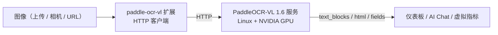

# PaddleOCR-VL Document Understanding

> 基于 VLM 的文档理解扩展——高精度 OCR、表格识别、关键信息抽取（KIE），擅长复杂版面与票据表单。需要 GPU 服务器。

---

## 1. 方案概述

paddle-ocr-vl 是一个 **HTTP 桥接扩展**：扩展本身是轻量客户端（约 MB 级），真正的 PaddleOCR-VL 1.6 模型跑在一台独立的 Python 推理服务上（推荐 Linux + NVIDIA GPU）。这种拆分让扩展跨平台，重推理放到 GPU。

它提供三类能力，对应三个命令：

| 能力 | 命令 | 输出 | 适用 |
|---|---|---|---|
| 高精度多语种 OCR | `recognize` | `text_blocks` + `full_text` | 复杂版面、多语种混排 |
| 表格识别 | `recognize_table` | HTML 表格 | 财务报表、检测报告中的表格 |
| 关键信息抽取（KIE） | `extract_keys` | 结构化字段 `fields` | 发票 / 票据 / 表单字段化 |

**数据流向**：



> 与 [paddle-ocr-v6](./4-camera-ocr.md) 的核心区别：v6 是本地 ONNX、纯文字提取、边缘可跑；paddle-ocr-vl 是远端 VLM、能理解版面 / 表格 / 语义、需 GPU 服务。选型见第 7 节。

---

## 2. 物料清单（BOM）

| 物料 | 规格 | 用途 | 必需 |
|------|------|------|------|
| **NeoMind 平台** | v0.9.0+ | 扩展宿主 | ✅ |
| **paddle-ocr-vl 扩展** | v2.7.7+ | HTTP 桥接 | ✅ |
| **GPU 推理服务器** | Linux + NVIDIA GPU（CUDA 12.6） | 运行 PaddleOCR-VL Python 服务 | ✅ |
| **本地 LLM** | Ollama 等 | AI Chat 后端 | 可选 |

---

## 3. 前置准备：部署推理服务

在 GPU 服务器的扩展源码 `server/` 目录下：

```bash
cd extensions/paddle-ocr-vl/server

python -m venv .venv_paddleocr && source .venv_paddleocr/bin/activate

# GPU（CUDA 12.6）
pip install paddlepaddle-gpu==3.2.1 -i https://www.paddlepaddle.org.cn/packages/stable/cu126/
# 或 CPU：pip install paddlepaddle==3.2.1

pip install -r requirements.txt
./download_models.sh     # 预下载 1–2GB 模型权重（可选；首次推理也会自动下载）

python3 server.py        # → http://0.0.0.0:8000
# 可用 HOST / PORT / PADDLE_DEVICE 环境变量覆盖
```

> 没有 GPU、或想先验证接线，可跑 `python3 mock_server.py`（返回固定响应）。

服务就绪后，在扩展详情页执行 `health` 命令，应返回 `status: ok, model_loaded: true`。

> 📷 待补截图｜health 检查 · 建议路径 `…/neomind/paddle-ocr-vl/01-health.png`

---

## 4. 安装与配置扩展

进入 **Extensions** 页面，从扩展市场安装 **paddle-ocr-vl**；在 **Configuration** 里把 `endpoint` 指向推理服务地址（如 `http://<GPU服务器IP>:8000`）。

| 配置项 | 默认 | 说明 |
|--------|------|------|
| `endpoint` | `http://127.0.0.1:8000` | PaddleOCR-VL 服务地址 |
| `language` | `ch` | `ch` / `en` / `japan` / `korean` / `german` / `french` |
| `use_doc_orientation_classify` | `false` | 自动旋转矫正 |
| `use_doc_unwarping` | `false` | 去扭曲（拍摄 / 弯曲文档）|
| `timeout_ms` | `30000` | HTTP 超时（1s–120s）|

> 📷 待补截图｜安装并配置 endpoint · 建议路径 `…/neomind/paddle-ocr-vl/02-install-config.png`

---

## 5. 使用方式

### 5.1 在 Dashboard 用卡片测试（PaddleOcrCard）

扩展自带前端组件 **PaddleOcrCard**——在 Dashboard 添加该卡片即可图形化测试，无需手填命令参数：

1. 上传一张图片（拖拽或点击，支持 PNG/JPG/WEBP）。
2. 切换模式：**Text**（`recognize`）/ **Table**（`recognize_table`）/ **Keys**（`extract_keys`）。
3. 在设置里选语言，按需开启「自动旋转」「去变形」（适合拍摄歪斜的文档）。
4. 执行后：Text 模式在图上叠加彩色文字块并列出文本（可切「分块 / 纯文本」视图）；Table 模式直接渲染 HTML 表格；Keys 模式列出抽取的键值对。

> 底层调用的就是扩展命令，卡片只封装了上传、参数与结果可视化。

> 📷 待补截图｜Dashboard PaddleOcrCard 测试 · 建议路径 `…/neomind/paddle-ocr-vl/03-dashboard-card.png`

### 5.2 接入 NE101 摄像头组件

在 [NE101 摄像头组件](./4-camera-ocr.md) 里把 `processingExtensionId` 选为 **`paddle-ocr-vl`**，模板 `text_detection` → 调 `recognize`。适合相机拍摄的海报、铭牌、屏幕等需要高质量 OCR 的场景，返回的 `text_blocks` 与组件的叠加渲染兼容。

### 5.3 通过 AI Chat

直接对 [AI Chat](../user-guide/5-ai-chat.md) 说「用 paddle-ocr-vl 把这张发票的发票号、日期、金额抽出来」，LLM 会自动调用命令并解读结果。

---

## 6. 典型场景

### 6.1 发票 / 票据结构化抽取（KIE）

用 `extract_keys` + schema 把票据字段化：

```json
{ "image_base64": "...", "schema": { "fields": ["invoice_no", "date", "total", "seller"] } }
```

返回形如：

```json
{ "fields": { "invoice_no": "INV-2024-001", "date": "2024-07-13", "total": "1250.00", "seller": "..." } }
```

可直接写入数据库或经 [数据推送](../user-guide/7c-data-push.md) 送往 ERP。

> 📷 待补截图｜发票 KIE 结果 · 建议路径 `…/neomind/paddle-ocr-vl/04-invoice-kie.png`

### 6.2 表格识别

`recognize_table` 返回 HTML 表格，适合财务报表、检测报告、规格表，可在仪表板用 Markdown / HTML 组件渲染。

> 📷 待补截图｜表格识别 → HTML · 建议路径 `…/neomind/paddle-ocr-vl/05-table.png`

### 6.3 复杂版面 / 拍摄扭曲文档

开启 `use_doc_unwarping` 与 `use_doc_orientation_classify`，对手机拍摄的弯曲 / 倾斜文档先矫正再识别，能明显提升多栏、图文混排等复杂版面的准确率。

---

## 7. 选型：paddle-ocr-vl vs paddle-ocr-v6

| 维度 | paddle-ocr-v6 | paddle-ocr-vl |
|------|---------------|---------------|
| 模型 | PP-OCRv6（ONNX，本地） | PaddleOCR-VL 1.6（VLM，远端 GPU）|
| 能力 | 纯文字提取 | 文字 + 表格 + KIE + 版面理解 |
| 部署 | 自包含，边缘可跑 | 需 GPU 推理服务 |
| 延迟 | 毫秒级 | 秒级 |
| 适合 | 简单印刷体、读数、离线 | 复杂版面、表格、票据结构化、拍摄文档 |

---

## 8. 附录

### 相关文档

- [NE101 摄像头 AI 视觉（paddle-ocr-v6）](./4-camera-ocr.md)
- [通用 OCR 方案](./2-ocr-text-extraction.md)
- [扩展管理](../user-guide/9-extensions.md)
- [AI Chat](../user-guide/5-ai-chat.md)
- [数据推送](../user-guide/7c-data-push.md)

---

*最后更新: 2026-07-13*
