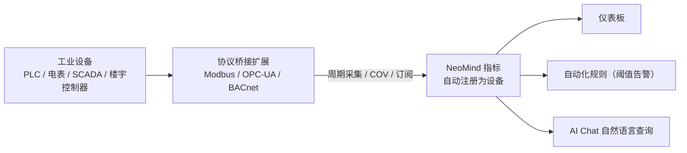

# Industrial Protocol Integration (Modbus / OPC-UA / BACnet)

> 用三个协议桥接扩展接入工业设备——**Modbus**、**OPC-UA**、**BACnet**，共享「连接 → 采集 → 注册为设备 → 进仪表板」同一模式。

---

## 1. 方案概述

工业设备协议繁杂，NeoMind 用三个独立桥接扩展分别对接，每个扩展把对应协议的点位自动变成 NeoMind 设备指标，屏蔽协议差异。

| 协议 | 扩展 | 典型设备 | 发现方式 | 数据模型 |
|---|---|---|---|---|
| **Modbus** | modbus-bridge | PLC、电表、温湿度传感器、变频器 | 手动配置（IP/串口 + 寄存器表）| 寄存器（Holding/Input/Coils/Discrete）|
| **OPC-UA** | opcua-bridge | SCADA、MES、工业网关、OPC-UA 服务器 | 浏览地址空间，节点自动注册为设备 | 节点（NodeID，任意类型）|
| **BACnet** | bacnet-bridge | 暖通空调、消防、门禁、楼宇控制器 | Who-Is/I-Am 广播发现 | 对象（analog/binary/multi-state）|

**数据流向**（三者一致）：



---

## 2. 物料清单（BOM）

| 物料 | 规格 | 用途 | 必需 |
|------|------|------|------|
| **NeoMind 平台** | v0.9.0+ | 扩展宿主 | ✅ |
| **协议桥接扩展** | modbus-bridge / opcua-bridge / bacnet-bridge（按设备选） | 协议接入 | ✅ |
| **工业设备** | 支持 Modbus / OPC-UA / BACnet 的 PLC、仪表、服务器、控制器 | 数据源 | ✅ |
| **网络可达** | NeoMind 与设备在同一网段或可路由 | 通信 | ✅ |

> 网络补充要求：Modbus RTU 设备经串口接入运行 NeoMind 的主机；BACnet/IP 发现依赖 UDP 47808 广播（见 [7.1](#71-扩展级配置参数)）。

---

## 3. 安装扩展

三个桥接扩展均发布在官方扩展市场，当前版本为 2.7.x（本文以 2.7.7 为例）。按需安装其中一个或多个，互不依赖。

### 3.1 通过扩展市场安装（推荐）

1. 进入左侧导航 **Extensions** 页签。
2. 点击工具栏的 **扩展市场**（地球图标），打开官方扩展市场对话框。
3. 在搜索框输入扩展名——`modbus-bridge`、`opcua-bridge` 或 `bacnet-bridge`。
4. 点击对应条目的 **Install**，NeoMind 自动选择与当前平台 / ABI 匹配的 `.nep` 包，下载并安装。
5. 安装完成后扩展自动出现在扩展列表中并启动。

### 3.2 CLI 安装（可选）

```bash
neomind extension market-list                        # 查看市场可用扩展
neomind extension market-install modbus-bridge       # 从市场安装（默认最新版）
neomind extension market-install opcua-bridge --version 2.7.7
neomind extension market-install bacnet-bridge
```

### 3.3 验证安装状态

- 扩展列表卡片与扩展详情页顶部状态应为 **Running**（绿色圆点）。
- 点击扩展卡片进入 **扩展详情页**，确认存在 总览 / 配置 / 命令（Commands）/ 指标（Metrics）/ 日志（Logs）标签。
- 切到 **指标（Metrics）** 标签，应能看到扩展级指标开始上报（如 `connected_devices`、`total_poll_errors`）。

> 命令调用入口说明：三个桥接的所有操作（添加设备、浏览、读写、订阅）都通过扩展命令完成。调用方式有两种——扩展详情页 **命令（Commands）** 标签填参数执行；或 REST API `POST /api/extensions/:id/command`，请求体 `{"command":"...","args":{...}}`。`neomind extension` CLI 不提供命令调用子命令。下文各协议的调用示例两种方式通用。

---

## 4. 怎么选协议

| 你的设备 | 选哪个 |
|---|---|
| 电表、水表、温湿度、变频器、小型 PLC | **Modbus**（最常见、最轻）|
| SCADA / MES / 工业网关 / 提供 OPC-UA 服务器的设备 | **OPC-UA**（带安全与浏览）|
| 暖通空调、新风、消防、门禁、楼宇控制器 | **BACnet**（楼宇自动化标准）|

> 若设备同时支持多种协议，优先 OPC-UA（安全、自描述、可浏览）。

---

## 5. Modbus 接入（modbus-bridge）

> **协议与桥的工作方式**：Modbus 是工业界最通用的主从协议——主机（NeoMind）按**从站地址**（slave_id）读写设备内部的 16 位寄存器：保持寄存器 `holding`（FC03 读 / FC06、FC16 写）、输入寄存器 `input`（FC04）、线圈 `coil`（FC01 读 / FC05、FC15 写）、离散输入 `discrete_input`（FC02）。寄存器本身没有单位和小数点，真正的工程量（电压、温度、能耗）要靠寄存器表里的 `type` / `scale` / `word_order` 解码而来（见 5.4 节）。
>
> modbus-bridge 的工作模型是**轮询**：`add_device` 之后，每台设备独享一个轮询线程，按 `poll_interval_ms` 的节奏把寄存器表里的点位逐个读出、解码、写入该设备名下的指标；连接长期保持，失败自动重连并累计 `poll_errors`。所以它是"主机周期采样"模型——数据新鲜度取决于轮询间隔，设备不会主动上报。

支持 Modbus TCP 与 RTU（串口），多设备独立轮询，寄存器带类型解码（`int16` / `uint32` / `float32` 等）与缩放。设备添加后自动注册为 NeoMind 设备（类型 `modbus_device`），寄存器值持续写入设备指标。

### 5.1 扩展级配置参数

在扩展详情页 **配置** 标签查看 / 修改：

| 参数 | 类型 | 默认值 | 范围 | 说明 |
|------|------|--------|------|------|
| `defaultPollInterval` | Integer | `5000` | 100–60000 | 默认轮询间隔（ms），未单独指定时生效 |
| `defaultTimeout` | Integer | `3000` | 100–30000 | 默认连接超时（ms） |

### 5.2 添加设备 + 寄存器表

1. 打开 modbus-bridge 扩展详情页 → **命令（Commands）** 标签 → 选择 `add_device`。
2. 在 `device` 参数中填入设备配置 JSON（一条命令添加一个设备）。寄存器地址为 **0 基**：PLC 手册里的 holding register 40001 对应 `address: 0`：

```json
{
  "device_id": "power_meter_1",
  "name": "1 号电表",
  "mode": "tcp",
  "ip": "192.168.1.50",
  "port": 502,
  "slave_id": 1,
  "poll_interval_ms": 1000,
  "timeout_ms": 3000,
  "registers": [
    { "name": "voltage", "address": 0,  "count": 2, "type": "float32", "register_type": "holding", "scale": 0.1, "unit": "V" },
    { "name": "energy",  "address": 10, "count": 2, "type": "uint32",  "register_type": "holding", "unit": "kWh" }
  ]
}
```

3. 执行成功返回：

```json
{ "success": true, "device_id": "power_meter_1", "message": "Device added and polling started" }
```

扩展立即开始第一轮轮询，并把设备注册到平台（设备类型 `modbus_device`）。对同一 `device_id` 重复执行 `add_device` 会替换旧配置并重启轮询，不会产生重复设备。
4. **RTU 设备**：`mode` 改为 `"rtu"`，去掉 `ip` / `port`，改填 `serial_port`（如 `/dev/ttyUSB0`）与 `baud_rate`（默认 9600），`slave_id` 与波特率必须与设备一致。

**设备配置字段（`device` JSON）：**

| 字段 | 类型 | 必填 | 默认值 | 说明 |
|------|------|------|--------|------|
| `device_id` | string | ✅ | — | 设备标识，同时用作平台设备 ID |
| `name` | string | 可选 | `device_id` | 显示名称 |
| `mode` | string | ✅ | — | `tcp` / `rtu` |
| `ip` | string | TCP 必填 | — | 设备 IP 地址 |
| `port` | integer | 可选 | `502` | Modbus TCP 端口 |
| `serial_port` | string | RTU 必填 | — | 串口路径（如 `/dev/ttyUSB0`）|
| `baud_rate` | integer | 可选 | `9600` | RTU 波特率 |
| `slave_id` | integer | ✅ | — | 从站地址（1–247）|
| `poll_interval_ms` | integer | 可选 | `5000` | 轮询间隔（ms）|
| `timeout_ms` | integer | 可选 | `3000` | 连接超时（ms）|
| `registers` | array | 可选 | — | 寄存器映射（见下表）|

**寄存器字段（`registers[]` 每项）：**

| 字段 | 类型 | 必填 | 默认值 | 说明 |
|------|------|------|--------|------|
| `name` | string | ✅ | — | 寄存器名，即设备指标名 |
| `address` | integer | ✅ | — | 0 基起始地址 |
| `count` | integer | 可选 | `1` | 读取寄存器数量；`uint32` / `int32` / `float32` 占 2 个寄存器，须填 2 |
| `type` | string | ✅ | — | 解码类型：`uint16` / `int16` / `uint32` / `int32` / `float32` / `bool` |
| `register_type` | string | 可选 | `holding` | `holding`(FC03) / `input`(FC04) / `coil`(FC01) / `discrete_input`(FC02) |
| `scale` | number | 可选 | `0` | 原始值 × `scale`（0 表示不缩放），如 raw 245 × 0.1 → 24.5 °C |
| `unit` | string | 可选 | — | 单位 |
| `word_order` | string | 可选 | `big` | 双寄存器类型字序：`big`（高字在前，Modbus 标准）/ `little`（部分 PLC）|

> 协议上限：`holding` / `input` 单次最多读 125 个寄存器，`coil` / `discrete_input` 最多 2000。超出会被跳过并写日志。

> 📷 待补截图｜add_device 配置 · 建议路径 `…/neomind/industrial-protocols/01-modbus-add.png`

### 5.3 验证（完整走一遍：从添加到指标）

按 5.2 添加 `power_meter_1` 后，一轮完整的验证时间线：

1. **首个轮询周期后**（`poll_interval_ms: 1000` 时约 1 秒）：**Devices 页**出现 `power_meter_1`（Modbus Device），下挂 `connected` / `poll_errors` / `last_poll_ms` 与各寄存器指标（`voltage`、`energy`）。
2. 执行 `get_device_data`（参数 `{"device_id": "power_meter_1"}`）核对解码值：

```json
{
  "success": true,
  "device_id": "power_meter_1",
  "connected": true,
  "poll_errors": 0,
  "last_poll_ms": 12,
  "registers": [
    { "name": "voltage", "value": 220.15,   "unit": "V",   "raw": [17673, 38912] },
    { "name": "energy",  "value": 100000.0, "unit": "kWh", "raw": [1, 34464] }
  ]
}
```

**值的来历**：`voltage` 线上读到两个字 `0x4509`、`0x9800` → 按 float32 解码为 2201.5 → 乘 `scale: 0.1` = **220.15 V**；`energy` 读到 `0x0001`、`0x86A0` → 按 uint32 拼接为 100000（未设 `scale`，不缩放）→ **100000 kWh**。`raw` 数组是原始 16 位寄存器字（十进制显示），排查解码问题时拿它与设备寄存器手册逐字对照。

3. 执行 `list_devices` 看设备与轮询健康度：

```json
{
  "success": true,
  "count": 1,
  "devices": [
    { "device_id": "power_meter_1", "name": "1 号电表", "mode": "tcp", "connected": true,
      "register_count": 2, "poll_interval_ms": 1000, "poll_errors": 0, "last_poll_ms": 12 }
  ]
}
```

4. 扩展详情页 **指标** 标签：`connected_devices` ≥ 1，`total_poll_errors` 不再增长。
5. 指标进入平台后的 DataSourceId 形如 `device:power_meter_1:voltage`、`device:power_meter_1:energy`，可直接绑定仪表板或规则。

### 5.4 数据解码：寄存器字 → 工程值

线上传输的永远是 16 位无符号字；`type` 决定把 1–2 个字怎么解释，`word_order` 决定双寄存器类型的拼接顺序，`scale` 在解码之后做一次乘法：

1. **单寄存器类型**（`count: 1`）：`uint16` 直接取值；`int16` 按补码解释（例：线上读到 `0xFF9C` = 65436 → 解释为 −100，配 `scale: 0.1` 得 −10.0 °C，负温冷库场景）；`bool` 非 0 即 1。
2. **双寄存器类型**（`uint32` / `int32` / `float32`，`count` 必须 = 2）：两个字拼成 32 位再解释。以 5.3 的电压寄存器为例，读到 `0x4509`、`0x9800`：
   - `word_order: big`（默认，Modbus 标准，高字在前）：`(0x4509 << 16) | 0x9800 = 0x45099800` → IEEE 754 浮点数 **2201.5** → × `scale 0.1` → **220.15 V**；
   - `word_order: little`（部分 PLC 低字在前）：`(0x9800 << 16) | 0x4509 = 0x98004509` → 解码出 −1.66×10⁻²⁴ 一类的乱值。
   - `energy` 的 uint32 同理：`0x0001`、`0x86A0` → big 拼接 `0x000186A0` = 100000 kWh；若设备实际是 little 而你按 big 读，会得到 `0x86A00001` ≈ 2.55×10⁹ 的天文数字。

   **读数离谱（巨大 / 极小负数）时，首先怀疑 `word_order` 与 `count`。**
3. **scale**：`解码值 × scale`，`scale: 0`（默认）表示不缩放。常见换算：温度 raw 245 × 0.1 → 24.5 °C；电压 raw 2301 × 0.001 → 2.301 V。乘法在类型解码之后进行，float32 同样可以再乘 scale。

### 5.5 读写控制

- 读：`read_registers(device_id, address, count)`（按需读，`register_type` 可选 `holding`（默认）/ `input`，单次最多 125 个寄存器）。
- 写：`write_register(device_id, address, value)`、`write_registers(...values[])`、`write_coil(device_id, address, value)`、`write_coils(...values[])`——远程合闸、设设定值。
- 运维：`update_polling` 改轮询间隔、`set_register_map` 更新寄存器表（替换后重启轮询）、`remove_device` 移除设备并从平台注销。

**读保持寄存器**——调用参数：

```json
{ "device_id": "power_meter_1", "address": 0, "count": 2 }
```

返回：

```json
{ "success": true, "device_id": "power_meter_1", "address": 0, "register_type": "holding", "count": 2, "data": [17673, 38912] }
```

> ⚠️ `read_registers` 返回的 `data` 是**原始 16 位字**，不做类型解码与缩放（解码只发生在轮询周期里）。要看工程值用 `get_device_data` 的 `value` 或设备指标；`data` 用于与寄存器手册对照。

**写单个保持寄存器**——调用参数：

```json
{ "device_id": "power_meter_1", "address": 100, "value": 250 }
```

返回：

```json
{ "success": true, "device_id": "power_meter_1", "address": 100, "value": 250, "message": "Register written successfully" }
```

写操作限额：`write_register` 的 `value` 范围 0–65535；`write_registers` 单次最多 123 个值；`write_coil` 的 `value` 传字符串 `"true"` / `"false"`；`write_coils` 传布尔数组，单次最多 1968 个。

在 **命令** 标签直接填参执行，或 REST 调用写单个保持寄存器：

```bash
curl -X POST -H "X-API-Key: $NEOMIND_API_KEY" \
     -H "Content-Type: application/json" \
     -d '{"command":"write_register","args":{"device_id":"power_meter_1","address":100,"value":250}}' \
     http://localhost:9375/api/extensions/modbus-bridge/command
```

---

## 6. OPC-UA 接入（opcua-bridge）

> **协议与桥的工作方式**：OPC-UA 是工业自动化的信息交互标准，与 Modbus 最大的不同是**自描述**——服务器把数据组织成一棵地址空间树，每个节点有 NodeID、浏览名、数据类型，客户端可以像文件系统一样浏览发现点位，而不是手工抄寄存器表；同时在传输层提供签名 / 加密与账密认证。
>
> opcua-bridge 的工作模型是**订阅**：`connect` 建立会话 → `browse` 浏览地址空间（节点进入本地缓存并自动注册为 NeoMind 设备）→ `subscribe` 对关心的节点建立数据变更订阅。订阅生效后，节点值一有变化（按 `interval_ms` 采样），桥就把新值落到对应设备的指标上——无需轮询全部点位，也不会产生聊天 / 通知中心消息，更新以**指标**形式出现在 Devices 页与仪表板。

连接任意 OPC-UA 服务器（`opc.tcp://`），支持安全模式 `none` / `sign` / `sign_and_encrypt` 与账密认证，断线自动重连。**浏览到的节点会自动注册为 NeoMind 设备（类型 `opcua_node`）并持续发布指标**，无需手动逐点配置。

### 6.1 扩展级配置参数

| 参数 | 类型 | 默认值 | 范围 | 说明 |
|------|------|--------|------|------|
| `sessionTimeout` | Integer | `30000` | 1000–300000 | OPC-UA 会话超时（ms）|
| `autoReconnect` | String | `"true"` | `true` / `false` | 断线后自动重连 |

### 6.2 连接服务器（含安全模式选择）

1. 打开 opcua-bridge 扩展详情页 → **命令** 标签 → 执行 `connect`：

```json
{ "server_url": "opc.tcp://192.168.1.60:4840", "security_mode": "sign_and_encrypt", "username": "op", "password": "***" }
```

连接成功后，**服务器本身也会注册为一台设备**（类型 `opcua_server`，ID 由 URL 消毒而来：`:` `/` `.` 替换为 `_`，如 `opcua-server-opc_tcp___192_168_1_60_4840`），承载连接级指标；断线后按 `autoReconnect` 自动重连。

2. 安全模式怎么选（必须与服务器端策略**完全一致**，不一致会被服务器拒绝会话）：

| `security_mode` | 报文保护 | 适用场景 | 前提条件 |
|---|---|---|---|
| `none`（默认）| 明文、无签名 | 隔离 / 受控的测试网段、演示环境 | 无 |
| `sign` | 签名（防篡改），内容仍明文 | 可信内网、只要求完整性 | 客户端证书需被服务器信任 |
| `sign_and_encrypt` | 签名 + 加密 | 生产环境、跨网段传输 | 服务器信任的客户端证书 + 账密 |

> 证书与账密按服务器端安全策略准备：`sign` / `sign_and_encrypt` 需要向 OPC-UA 服务器管理员申请并信任客户端证书；`username` / `password` 为服务器用户管理中创建的账号。能选 `sign_and_encrypt` 就不要停在 `sign`；仅当服务器只开放 `None` 策略时才用 `none`（常见于厂商调试默认配置，评估后建议在服务器上开启安全策略）。

### 6.3 浏览地址空间与自动注册

执行 `browse`：`node_id` 默认从根 `i=84` 起步（Objects 文件夹是 `i=85`，推荐从这层开始浏览业务点位），`max_depth` 默认 1 层、最大 10 层。返回 JSON 形状：

```json
{
  "success": true,
  "browse_from": "i=85",
  "max_depth": 1,
  "nodes": [
    { "node_id": "ns=2;s=Temperature", "browse_name": "Temperature", "display_name": "Temperature Sensor", "node_class": "Variable", "data_type": "Float" },
    { "node_id": "ns=2;s=Pressure",    "browse_name": "Pressure",    "display_name": "Pressure Sensor",    "node_class": "Variable", "data_type": "Float" }
  ]
}
```

- 每个节点含 `node_id` / `browse_name` / `display_name` / `node_class`（`Object` / `Variable` 等），变量节点还带 `data_type`。
- 浏览到的节点**同时**进入本地节点缓存（`list_nodes` / `get_node` 可查）并自动注册为 NeoMind 设备——这就是"免逐点配置"的来源。注册命名规则：节点 ID 中的 `=` `;` `:` 与空格替换为 `_`，加 `opcua-` 前缀：

| 节点 NodeID | 生成的设备 ID | 指标 DataSourceId |
|---|---|---|
| `i=2258` | `opcua-i_2258` | `device:opcua-i_2258:value` |
| `ns=2;s=Temperature` | `opcua-ns_2_s_Temperature` | `device:opcua-ns_2_s_Temperature:value` |

节点 ID 为标准 OPC-UA 记法：`i=2258`（数值）或 `ns=2;s=Temperature`（命名空间字符串）。

> 📷 待补截图｜browse 地址空间 · 建议路径 `…/neomind/industrial-protocols/02-opcua-browse.png`

### 6.4 订阅数据变化

执行 `subscribe`：`node_ids` 接受 JSON 数组或逗号分隔字符串，`interval_ms` 默认 1000（范围 50–60000）。

```json
{ "node_ids": ["ns=2;s=Temperature", "ns=2;s=Pressure"], "interval_ms": 500 }
```

返回：

```json
{ "success": true, "subscription_id": "sub-9f3c1a2e-…", "node_ids": ["ns=2;s=Temperature", "ns=2;s=Pressure"], "interval_ms": 500 }
```

对同一组节点重复 `subscribe` 不会建重复订阅，返回"Subscription already exists for these nodes"。

**订阅推送长什么样**——是指标更新，不是消息：节点值变化时，桥把新值连同 `quality`（品质，如 `Good`）与 `source_timestamp`（服务器源时间戳）写入节点缓存，并按指标周期对该节点设备执行一次指标写入（`device_metrics_write`）：

```json
{ "device_id": "opcua-ns_2_s_Temperature", "metric": "value", "value": 43.0, "timestamp": 1760000000000 }
```

也就是说，你在 Devices 页 / 仪表板看到的是 `device:opcua-ns_2_s_Temperature:value` 这条指标曲线的新数据点；自动化规则照常对它触发。通知中心不会收到任何"OPC-UA 消息"。

### 6.5 验证

- 执行 `get_status`：

```json
{ "success": true, "connected": true, "nodes_count": 12, "subscriptions_count": 2, "total_commands": 9 }
```

- 扩展详情页 **指标** 标签：`connected` = 1，`nodes_count` 随浏览增长，`subscriptions_count` 等于活跃订阅数。
- **Devices 页**出现 `opcua-<节点ID>` 设备；每个节点设备下有 `value` / `quality` / `source_timestamp` 三个指标。
- 指标 DataSourceId 形如 `device:opcua-ns_2_s_Temperature:value`。
- 命令 `read`（参数 `node_ids`）返回节点当前值，可立即核对采集是否正确。

### 6.6 读 / 写控制

**批量读当前值**——`read(node_ids)` 返回：

```json
{
  "success": true,
  "results": [
    { "node_id": "ns=2;s=Temperature", "value": 42.5, "quality": "Good" },
    { "node_id": "ns=2;s=Pressure",    "value": 101.3, "quality": "Good" }
  ]
}
```

> `read` 返回的是节点缓存中的最新值（由 browse / subscribe 更新），优先用订阅保持数据新鲜。

**写节点值**：`write(node_id, value, data_type)`——`value` 为字符串，`data_type` 可选（如 `Float`、`Int32`）显式指定类型。

> ⚠️ **当前开源版本（2.7.x）中 `write` 为保护性实现**：命令直接返回错误、不向服务器写入——避免桥接层对工业服务器误写。需要对 OPC-UA 点位做写控制时，请通过设备自带的上位机 / SCADA 操作。读与订阅不受影响。

- 退订 / 断开：`unsubscribe(node_ids)`（`node_ids` 格式同 `subscribe`）、`disconnect`（清空节点缓存与订阅）。
- 辅助命令：`list_nodes` / `get_node(node_id)` 查看缓存节点详情（含 `value` / `quality` / `source_timestamp`），`list_subscriptions` 列出全部活跃订阅（`subscription_id` / `node_ids` / `interval_ms` / `active`）。

REST 调用示例（读两个节点）：

```bash
curl -X POST -H "X-API-Key: $NEOMIND_API_KEY" \
     -H "Content-Type: application/json" \
     -d '{"command":"read","args":{"node_ids":["i=2258","ns=2;s=Temperature"]}}' \
     http://localhost:9375/api/extensions/opcua-bridge/command
```

---

## 7. BACnet 接入（bacnet-bridge）

> **协议与桥的工作方式**：BACnet 是楼宇自动化标准协议（暖通空调、新风、照明、消防、门禁）。它的数据模型是**对象**：每台设备由设备实例号（device instance，0–4194303）标识，下面挂着若干对象（如 `analog_input:1`、`binary_output:1`），每个对象带属性——最常用的是 `present_value`（现值，属性号 85）。控制写入不直接改现值，而是写入对象内部的 **16 层优先级数组**（数值越小优先级越高，见 7.4 节）。
>
> bacnet-bridge 在 UDP 47808 上同时跑两类后台任务：一个**监听线程**负责接收 I-Am 应答与 COV 通知，以及每台已添加设备一个**轮询线程**周期读取点位现值。变化慢的点位用轮询足够；要求秒级响应的点位用 COV 订阅——值一变化设备就推送，比轮询更实时也更省流量。

BACnet/IP over UDP（默认 47808），支持 Who-Is/I-Am 广播发现、读属性、写控制、COV 订阅。发现 / 添加的设备自动注册为 NeoMind 设备（类型 `bacnet_device`，ID 为 `bacnet_<device_id>`）。

### 7.1 扩展级配置参数

| 参数 | 类型 | 默认值 | 范围 | 说明 |
|------|------|--------|------|------|
| `bindAddress` | String | `0.0.0.0` | — | BACnet/IP 本地绑定 IP |
| `bindPort` | Integer | `47808` | 1–65535 | BACnet/IP UDP 端口 |
| `defaultTimeoutMs` | Integer | `3000` | 100–30000 | 默认请求超时（ms）|
| `pollIntervalMs` | Integer | `10000` | 1000–60000 | 默认轮询间隔（ms）|

> **部署要求**：Who-Is/I-Am 是 UDP 广播。要求网络允许收发 UDP 47808（含广播）；广播不跨路由，NeoMind 与 BACnet 设备应在同一二层网络，或经支持广播转发的网络互联。

### 7.2 发现设备 + 添加轮询点位

1. 打开 bacnet-bridge 扩展详情页 → **命令** 标签 → 执行 `discover`（可选 `low_id` / `high_id` 限定设备实例号范围，默认 0–4194303；`timeout_ms` 默认 3000 为等待窗口）。扩展向 `255.255.255.255:47808` 发 Who-Is 广播，收集窗口内的 I-Am 响应（最多 500 台）。返回 JSON：

```json
{
  "success": true,
  "count": 2,
  "devices": [
    { "device_id": 100, "ip": "192.168.1.100", "port": 47808, "vendor_id": 5,   "max_apdu": 1476 },
    { "device_id": 201, "ip": "192.168.1.101", "port": 47808, "vendor_id": 15,  "max_apdu": 480 }
  ]
}
```

字段含义：`device_id` 是 BACnet 设备实例号（设备自身配置、全网唯一）；`vendor_id` 是 ASHRAE 分配的厂商编号（数字，可用于识别设备品牌）；`max_apdu` 是设备单包上限。**注意：发现 ≠ 注册**——发现结果进入内部设备表（`list_devices` 可见、`connected: true`），但只有 `add_device` 添加的设备才会注册进 NeoMind 平台并产出指标。

2. 执行 `list_devices` 查看发现的设备，`get_device` / `list_objects` 查看某设备的对象列表（analog / binary / multi-state 的 input / output / value，每项含 `object_type` / `instance` / `present_value` / `units` / `cov_subscribed`）。
3. 执行 `add_device` 手动登记设备并开始周期轮询选中点位（`device` 参数）：

```json
{
  "device_id": 100,
  "ip": "192.168.1.100",
  "port": 47808,
  "name": "HVAC Controller",
  "poll_interval_ms": 5000,
  "objects": [
    { "object_type": "analog_input",  "instance": 1, "name": "Temperature", "units": "degC" },
    { "object_type": "analog_input",  "instance": 2, "name": "Humidity", "units": "%" },
    { "object_type": "binary_output", "instance": 1, "name": "Fan Status" }
  ]
}
```

返回 `{"success": true, "device_id": 100, "ip": "192.168.1.100", "port": 47808, "message": "Device added and polling started"}`——设备以 `bacnet_100` 注册进平台，轮询线程按 `poll_interval_ms` 周期读取每个对象的 `present_value` 写入指标。

> 📷 待补截图｜Who-Is 发现 · 建议路径 `…/neomind/industrial-protocols/03-bacnet-discover.png`

### 7.3 验证

- 执行 `get_status` 看全局状态：

```json
{
  "success": true,
  "status": {
    "total_devices": 1, "connected_devices": 1,
    "total_cov_subscriptions": 0, "active_cov_subscriptions": 0,
    "listener_running": true, "bind_port": 47808
  }
}
```

- 扩展详情页 **指标** 标签：`connected_devices` ≥ 1；发起 COV 订阅后 `cov_subscriptions` 增长。
- **Devices 页**出现 `bacnet_100`（BACnet Device）。每个轮询对象的现值以 `<object_type>_<instance>` 命名为设备指标（如 `analog_input_1`、`binary_output_1`），另有 `connected` / `objects_count` / `last_seen`。
- 指标 DataSourceId 形如 `device:bacnet_100:analog_input_1`。
- 命令 `list_objects` 可核对现值是否刷新、`cov_subscribed` 是否置位。

### 7.4 读属性 / 订阅 COV / 写控制

> 前提：目标设备的实例号必须已在内部设备表中（执行过 `discover` 或 `add_device`），否则命令报 `Device not found: …`。

**读属性**——`read_property` 调用参数（`object_type` 默认 `analog_input`；`property_id` 默认 85，常用值：85 = present_value、77 = object_name、28 = description、117 = units）：

```json
{ "device_id": 100, "object_type": "analog_input", "instance": 1, "property_id": 85 }
```

返回：

```json
{ "success": true, "device_id": 100, "object_type": "analog_input", "instance": 1, "property_id": 85, "value": 23.5 }
```

`value` 类型随属性而定：现值为数值（binary 对象为 `true` / `false`，multi-state 为状态号），`object_name`（77）等文本属性为字符串。设备拒绝读取时返回 `BACnet error: class=…, code=…`。一次请求读多个属性用 `read_property_multiple`（`properties` 缺省为 `[85]`）：

```json
{ "device_id": 100, "objects": [
  { "object_type": "analog_input", "instance": 1, "properties": [85, 77] },
  { "object_type": "analog_input", "instance": 2 }
] }
```

返回：

```json
{ "success": true, "device_id": 100, "count": 3, "values": [
  { "object_type": "analog_input", "instance": 1, "property_id": 85, "value": 23.5 },
  { "object_type": "analog_input", "instance": 1, "property_id": 77, "value": "Room Temp" },
  { "object_type": "analog_input", "instance": 2, "property_id": 85, "value": 41.2 }
] }
```

**订阅 COV**——`subscribe_cov(device_id, object_type, instance)`，`lifetime` 默认 0（无限期，秒），`confirmed` 默认 `true`（要求设备确认送达）：

```json
{ "device_id": 100, "object_type": "analog_input", "instance": 1 }
```

返回：

```json
{ "success": true, "subscriber_id": 1, "device_id": 100, "object_type": "analog_input", "instance": 1, "lifetime": 0, "confirmed": true, "message": "COV subscription active" }
```

**COV 订阅后收到什么**——同样是指标更新，不是消息：点位变化时设备主动推来一条 COV 通知（订阅号 + 对象标识 + 属性值列表），桥的后台监听线程解析后把该点 `present_value` 更新进内部对象缓存并标记 `cov_subscribed = true`；随后它作为 `device:bacnet_100:analog_input_1` 指标正常上报——Devices 页 / 仪表板看到现值刷新，规则引擎照常触发。用 `list_objects` 能看到该对象 `present_value` 已更新、`cov_subscribed: true`，`get_status` 的 `active_cov_subscriptions` 计入此订阅。退订必须用 `subscribe_cov` 返回的 `subscriber_id` 调 `unsubscribe_cov`。

**写控制**——`write_property(device_id, object_type, instance, value, priority)`。**只有 output / value 对象可写**（`analog_output`、`binary_value` 等；input 只读）。`value` 一律传字符串，桥按序推断类型：`"true"` / `"false"` → 布尔（binary 对象用）；纯整数 → 无符号整数；带小数点 → 实数；其余 → 字符串。analog output / value 的整数写入值会按 ASHRAE 135-2020 强制转为 REAL 类型。

**priority 与优先级数组语义**：写入不是直接改 `present_value`，而是写进对象内部的 16 层优先级数组（1 最高、16 最低），`present_value` 恒等于最高优先级的非空层。常用层级惯例：

| 层级 | 惯例用途 |
|---|---|
| 1 | 生命安全（最高，勿占用）|
| 8 | 手动操作 / 运维写入（本扩展示例采用）|
| 16 | 最低（BACnet 缺省层，调度 / 默认写入）|

2–15 按站点约定分配。`priority` **不传**时请求不带优先级字段，设备按第 16 层（缺省层）写入；显式传 8 则写入第 8 层。实例：向 `analog_value:5` 写设定温度 21.0——
- `{..., "value": "21.0", "priority": 8}` → 第 8 层 = 21.0，若更高层为空则 `present_value` 变为 21.0；
- `{..., "value": "21.0"}`（缺省）→ 第 16 层 = 21.0；**若此前有人以 priority 8 写过 19.0 且未释放，`present_value` 仍是 19.0**——写命令返回成功但现值不动，是 BACnet 最经典的坑。

REST 调用示例（启停风机，binary 对象用 `"true"` / `"false"`）：

```bash
curl -X POST -H "X-API-Key: $NEOMIND_API_KEY" \
     -H "Content-Type: application/json" \
     -d '{"command":"write_property","args":{"device_id":100,"object_type":"binary_output","instance":1,"value":"true","priority":8}}' \
     http://localhost:9375/api/extensions/bacnet-bridge/command
```

---

## 8. 下游使用

三个桥接产出的指标用法完全一致。

**统一数据源 ID（DataSourceId）**：所有指标都以 `device:<设备ID>:<指标名>` 进入平台，仪表板、规则、AI Chat 引用时都用这一格式：

| 桥接 | 设备 ID | 指标名 | DataSourceId |
|------|---------|--------|--------------|
| modbus-bridge | `power_meter_1` | `voltage` | `device:power_meter_1:voltage` |
| opcua-bridge | `opcua-ns_2_s_Temperature` | `value` | `device:opcua-ns_2_s_Temperature:value` |
| bacnet-bridge | `bacnet_100` | `analog_input_1` | `device:bacnet_100:analog_input_1` |

- **仪表板**：绑定上述 DataSourceId 到数值卡 / 折线图，实时监控电压、温度、能耗、空调状态等。
- **自动化规则**：对任意 DataSourceId 设阈值触发告警或写控制（[自动化规则](../user-guide/7-automation-rules.md)）。例如「电表电压超限告警」规则 JSON：

```json
{
  "name": "电表电压超限告警",
  "trigger": { "trigger_type": "data_change" },
  "condition": {
    "condition_type": "comparison",
    "source": "device:power_meter_1:voltage",
    "operator": "greater_than",
    "threshold": 250
  },
  "actions": [
    { "type": "notify", "message": "1 号电表电压 {value}V 超过 250V", "severity": "critical" }
  ]
}
```

- **AI Chat**：自然语言查询，如「最近 24 小时 1 号电表的电压趋势」「3 号空调现在什么状态」。

### 8.1 端到端小场景：从电表到告警通知

把 5.3 的电表一路接到告警通知，全链路如下（每个值都有出处）：

1. **接入**：按 5.2 `add_device` 添加 `power_meter_1`，其中 `voltage` = holding 0–1、`float32`、`scale: 0.1`。
2. **采集确认**：首个轮询周期后 `get_device_data` 显示 `voltage = 220.15`（raw `[17673, 38912]` = `0x4509 0x9800` → 2201.5 × 0.1），平台出现指标 `device:power_meter_1:voltage`，每 1 秒新增一个数据点。
3. **建规则**：自动化规则页新建上方那条规则 JSON。字段与数据的对应关系：
   - `trigger.trigger_type: data_change`——`voltage` 每次上报新值（每秒）都触发一次条件评估；
   - `condition.source: device:power_meter_1:voltage`——设备 ID `power_meter_1`（add_device 的 `device_id`）+ 指标名 `voltage`（寄存器表里的 `name`）拼出的 DataSourceId；
   - `condition.operator / threshold`——把该指标最新值与 250 比较（本例业务安全阈值）；
   - `actions[0].message` 中的 `{value}` 占位符在触发时替换为实际值。
4. **触发**：某次电压飙升到 253.4 V → 253.4 > 250 成立 → 以 `severity: critical` 发出通知，消息渲染为「1 号电表电压 253.4V 超过 250V」进入通知中心，并可经数据推送渠道（如 webhook）外发；电压回落到 250 以下后不再触发，指标曲线与通知记录可在平台回查。

> 📷 待补截图｜工业指标仪表板 · 建议路径 `…/neomind/industrial-protocols/04-dashboard.png`

---

## 9. 故障排查

先用三件套定位：扩展详情页 **日志** 标签看进程输出、**指标** 标签看错误计数、对应命令（`list_devices` / `get_status`）看设备状态。常见故障：

| 故障现象 | 可能原因 | 解决方案 |
|----------|----------|----------|
| Modbus 设备 `connected: false`，`total_poll_errors` 持续增长 | IP / 端口不通；`slave_id` 错误（1–247）；`timeout_ms` 过小；RTU 串口路径或波特率与设备不符 | 先在主机上 `ping` / `telnet ip port` 验证连通；核对从站地址；调大 `timeout_ms`（默认 3000）；RTU 核对 `serial_port` 与 `baud_rate`。扩展会自动重连，恢复后 `connected` 自动变 `true` |
| `read_registers` 读到的 float32 / uint32 值异常 | 双寄存器类型 `count` 不足（需 2），或 `word_order` 与设备不一致 | `uint32` / `int32` / `float32` 的 `count` 填 2；PLC 字序为低字在前时把 `word_order` 改为 `little`（默认 `big`）|
| `read_registers` 返回的 `data` 是 `[17673, 38912]` 一类数组而非 220.15 这样的工程值 | `read_registers` 按协议返回**原始 16 位寄存器字**，解码与缩放只发生在轮询周期 | 工程值看 `get_device_data` 的 `value` 或设备指标；`data` / `raw` 留作与寄存器手册对照排错 |
| OPC-UA `connect` 失败或频繁断开（安全模式拒绝、会话失效）| `security_mode` 与服务器安全策略不匹配；`sign` / `sign_and_encrypt` 缺少证书或账密；`sessionTimeout` 过短 | `security_mode`（`none` / `sign` / `sign_and_encrypt`）与服务器端策略一致；提供正确账密或证书；调大 `sessionTimeout`（默认 30000 ms）；保持 `autoReconnect = true` |
| OPC-UA `write` 返回错误、值未写入 | 当前 2.7.x 开源构建中 `write` 为保护性拒绝（防误写工业服务器）| 属预期行为；改用设备自带上位机 / SCADA 执行写操作，读与订阅不受影响 |
| OPC-UA 订阅后收不到数据 | `interval_ms` 超出 50–60000；节点值本身无变化；订阅未建立成功 | 检查 `subscriptions_count` 指标与 `list_subscriptions`；把 `interval_ms` 调回范围内；先用 `read` 确认节点可读 |
| BACnet `discover` 返回空 | 防火墙拦截 UDP 47808；跨网段广播不可达；`bindAddress` 绑定错误 | 放行 UDP 47808 收发（含广播）；NeoMind 与设备放同一二层网络（广播不跨路由）；`bindAddress` 保持 `0.0.0.0`；必要时抓包确认 Who-Is 发出、I-Am 收到 |
| BACnet `read_property` / `write_property` 报 `Device not found: …` | 目标设备实例号不在内部设备表中（从未 discover 或 add_device）| 先 `discover`（或对已知 IP `add_device`），再执行读写 |
| BACnet `write_property` 返回成功但 `present_value` 不变 | 写入的优先级层被更高优先级层占用（如第 8 层有旧值，而本次写入缺省落到第 16 层）| 提高写入 `priority`（数值更小、优先级更高，默认建议 8）；或先释放占用层的旧值 |
| BACnet `subscribe_cov` 后无通知 | 点位不支持 COV 或值未变化；退订后未重订 | 不支持 COV 的点位改用 `add_device` 周期轮询兜底；退订须用 `subscribe_cov` 返回的 `subscriber_id`，重订后核对 `get_status` 的 `active_cov_subscriptions` |

---

## 10. 附录

### 相关文档

- [扩展管理](../user-guide/9-extensions.md)
- [自动化规则](../user-guide/7-automation-rules.md)
- [数据推送](../user-guide/7c-data-push.md)
- [AI Chat](../user-guide/5-ai-chat.md)
- [LoRaWAN + Home Assistant 接入](./10-lorawan-homeassistant.md)
- modbus-bridge / opcua-bridge / bacnet-bridge 扩展 README

---

*最后更新: 2026-09-09*
