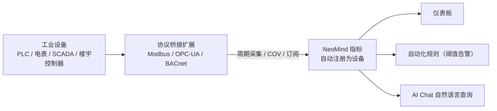

# Industrial Protocol Integration (Modbus / OPC-UA / BACnet)

> 用三个协议桥接扩展接入工业设备——**Modbus**、**OPC-UA**、**BACnet**，共享「连接 → 采集 → 注册为设备 → 进仪表板」同一模式。

---

## 1. 方案概述

工业设备协议繁杂，NeoMind 用三个独立桥接扩展分别对接，每个扩展把对应协议的点位自动变成 NeoMind 设备指标，屏蔽协议差异。

| 协议 | 扩展 | 典型设备 | 发现方式 | 数据模型 |
|---|---|---|---|---|
| **Modbus** | modbus-bridge | PLC、电表、温湿度传感器、变频器 | 手动配置（IP/串口 + 寄存器表）| 寄存器（Holding/Input/Coils/Discrete）|
| **OPC-UA** | opcua-bridge | SCADA、MES、工业网关、OPC-UA 服务器 | 浏览地址空间，节点自动注册为设备 | 节点（NodeID，任意类型）|
| **BACnet** | bacnet-bridge | 暖通空调、消防、门禁、楼宇控制器 | Who-Is/I-Am 广播发现 | 对象（analog/binary/multi-state）|

**数据流向**（三者一致）：



---

## 2. 物料清单（BOM）

| 物料 | 规格 | 用途 | 必需 |
|------|------|------|------|
| **NeoMind 平台** | v0.9.0+ | 扩展宿主 | ✅ |
| **协议桥接扩展** | modbus-bridge / opcua-bridge / bacnet-bridge（按设备选） | 协议接入 | ✅ |
| **工业设备** | 支持 Modbus / OPC-UA / BACnet 的 PLC、仪表、服务器、控制器 | 数据源 | ✅ |
| **网络可达** | NeoMind 与设备在同一网段或可路由 | 通信 | ✅ |

> 网络补充要求：Modbus RTU 设备经串口接入运行 NeoMind 的主机；BACnet/IP 发现依赖 UDP 47808 广播（见 [7.1](#71-扩展级配置参数)）。

---

## 3. 安装扩展

三个桥接扩展均发布在官方扩展市场，当前版本为 2.7.x（本文以 2.7.7 为例）。按需安装其中一个或多个，互不依赖。

### 3.1 通过扩展市场安装（推荐）

1. 进入左侧导航 **Extensions** 页签。
2. 点击工具栏的 **扩展市场**（地球图标），打开官方扩展市场对话框。
3. 在搜索框输入扩展名——`modbus-bridge`、`opcua-bridge` 或 `bacnet-bridge`。
4. 点击对应条目的 **Install**，NeoMind 自动选择与当前平台 / ABI 匹配的 `.nep` 包，下载并安装。
5. 安装完成后扩展自动出现在扩展列表中并启动。

### 3.2 CLI 安装（可选）

```bash
neomind extension market-list                        # 查看市场可用扩展
neomind extension market-install modbus-bridge       # 从市场安装（默认最新版）
neomind extension market-install opcua-bridge --version 2.7.7
neomind extension market-install bacnet-bridge
```

### 3.3 验证安装状态

- 扩展列表卡片与扩展详情页顶部状态应为 **Running**（绿色圆点）。
- 点击扩展卡片进入 **扩展详情页**，确认存在 总览 / 配置 / 命令（Commands）/ 指标（Metrics）/ 日志（Logs）标签。
- 切到 **指标（Metrics）** 标签，应能看到扩展级指标开始上报（如 `connected_devices`、`total_poll_errors`）。

> 命令调用入口说明：三个桥接的所有操作（添加设备、浏览、读写、订阅）都通过扩展命令完成。调用方式有两种——扩展详情页 **命令（Commands）** 标签填参数执行；或 REST API `POST /api/extensions/:id/command`，请求体 `{"command":"...","args":{...}}`。`neomind extension` CLI 不提供命令调用子命令。下文各协议的调用示例两种方式通用。

---

## 4. 怎么选协议

| 你的设备 | 选哪个 |
|---|---|
| 电表、水表、温湿度、变频器、小型 PLC | **Modbus**（最常见、最轻）|
| SCADA / MES / 工业网关 / 提供 OPC-UA 服务器的设备 | **OPC-UA**（带安全与浏览）|
| 暖通空调、新风、消防、门禁、楼宇控制器 | **BACnet**（楼宇自动化标准）|

> 若设备同时支持多种协议，优先 OPC-UA（安全、自描述、可浏览）。

---

## 5. Modbus 接入（modbus-bridge）

支持 Modbus TCP 与 RTU（串口），多设备独立轮询，寄存器带类型解码（`int16` / `uint32` / `float32` 等）与缩放。设备添加后自动注册为 NeoMind 设备（类型 `modbus_device`），寄存器值持续写入设备指标。

### 5.1 扩展级配置参数

在扩展详情页 **配置** 标签查看 / 修改：

| 参数 | 类型 | 默认值 | 范围 | 说明 |
|------|------|--------|------|------|
| `defaultPollInterval` | Integer | `5000` | 100–60000 | 默认轮询间隔（ms），未单独指定时生效 |
| `defaultTimeout` | Integer | `3000` | 100–30000 | 默认连接超时（ms） |

### 5.2 添加设备 + 寄存器表

1. 打开 modbus-bridge 扩展详情页 → **命令（Commands）** 标签 → 选择 `add_device`。
2. 在 `device` 参数中填入设备配置 JSON（一条命令添加一个设备）。寄存器地址为 **0 基**：PLC 手册里的 holding register 40001 对应 `address: 0`：

```json
{
  "device_id": "power_meter_1",
  "name": "1 号电表",
  "mode": "tcp",
  "ip": "192.168.1.50",
  "port": 502,
  "slave_id": 1,
  "poll_interval_ms": 1000,
  "timeout_ms": 3000,
  "registers": [
    { "name": "voltage", "address": 0,  "count": 2, "type": "float32", "register_type": "holding", "scale": 0.1, "unit": "V" },
    { "name": "energy",  "address": 10, "count": 2, "type": "uint32",  "register_type": "holding", "unit": "kWh" }
  ]
}
```

3. 执行成功返回 `{"success": true, "device_id": "power_meter_1"}`，扩展立即按 `poll_interval_ms` 开始轮询，并把设备注册到平台。
4. **RTU 设备**：`mode` 改为 `"rtu"`，去掉 `ip` / `port`，改填 `serial_port`（如 `/dev/ttyUSB0`）与 `baud_rate`（默认 9600），`slave_id` 与波特率必须与设备一致。

**设备配置字段（`device` JSON）：**

| 字段 | 类型 | 必填 | 默认值 | 说明 |
|------|------|------|--------|------|
| `device_id` | string | ✅ | — | 设备标识，同时用作平台设备 ID |
| `name` | string | 可选 | `device_id` | 显示名称 |
| `mode` | string | ✅ | — | `tcp` / `rtu` |
| `ip` | string | TCP 必填 | — | 设备 IP 地址 |
| `port` | integer | 可选 | `502` | Modbus TCP 端口 |
| `serial_port` | string | RTU 必填 | — | 串口路径（如 `/dev/ttyUSB0`）|
| `baud_rate` | integer | 可选 | `9600` | RTU 波特率 |
| `slave_id` | integer | ✅ | — | 从站地址（1–247）|
| `poll_interval_ms` | integer | 可选 | `5000` | 轮询间隔（ms）|
| `timeout_ms` | integer | 可选 | `3000` | 连接超时（ms）|
| `registers` | array | 可选 | — | 寄存器映射（见下表）|

**寄存器字段（`registers[]` 每项）：**

| 字段 | 类型 | 必填 | 默认值 | 说明 |
|------|------|------|--------|------|
| `name` | string | ✅ | — | 寄存器名，即设备指标名 |
| `address` | integer | ✅ | — | 0 基起始地址 |
| `count` | integer | 可选 | `1` | 读取寄存器数量；`uint32` / `int32` / `float32` 占 2 个寄存器，须填 2 |
| `type` | string | ✅ | — | 解码类型：`uint16` / `int16` / `uint32` / `int32` / `float32` / `bool` |
| `register_type` | string | 可选 | `holding` | `holding`(FC03) / `input`(FC04) / `coil`(FC01) / `discrete_input`(FC02) |
| `scale` | number | 可选 | `0` | 原始值 × `scale`（0 表示不缩放），如 raw 245 × 0.1 → 24.5 °C |
| `unit` | string | 可选 | — | 单位 |
| `word_order` | string | 可选 | `big` | 双寄存器类型字序：`big`（高字在前，Modbus 标准）/ `little`（部分 PLC）|

> 协议上限：`holding` / `input` 单次最多读 125 个寄存器，`coil` / `discrete_input` 最多 2000。超出会被跳过并写日志。

> 📷 待补截图｜add_device 配置 · 建议路径 `…/neomind/industrial-protocols/01-modbus-add.png`

### 5.3 验证

- **Devices 页**出现 `power_meter_1`（Modbus Device），下挂 `connected` / `poll_errors` / `last_poll_ms` 与各寄存器指标（`voltage`、`energy`）。
- 扩展详情页 **指标** 标签：`connected_devices` ≥ 1，`total_poll_errors` 不再增长。
- 命令 `get_device_data`（参数 `device_id`）返回各寄存器最新值；`list_devices` 显示 `connected: true`。
- 指标进入平台后的 DataSourceId 形如 `device:power_meter_1:voltage`、`device:power_meter_1:energy`。

### 5.4 读写控制

- 读：`read_registers(device_id, address, count)`（按需读 holding，单次最多 125 个寄存器）。
- 写：`write_register(device_id, address, value)`、`write_registers(...values[])`、`write_coil(device_id, address, value)`、`write_coils(...values[])`——远程合闸、设设定值。
- 运维：`update_polling` 改轮询间隔、`set_register_map` 更新寄存器表、`remove_device` 移除设备并从平台注销。

在 **命令** 标签直接填参执行，或 REST 调用写单个保持寄存器：

```bash
curl -X POST -H "X-API-Key: $NEOMIND_API_KEY" \
     -H "Content-Type: application/json" \
     -d '{"command":"write_register","args":{"device_id":"power_meter_1","address":100,"value":250}}' \
     http://localhost:9375/api/extensions/modbus-bridge/command
```

---

## 6. OPC-UA 接入（opcua-bridge）

连接任意 OPC-UA 服务器（`opc.tcp://`），支持安全模式 `none` / `sign` / `sign_and_encrypt` 与账密认证，断线自动重连。**浏览到的节点会自动注册为 NeoMind 设备（类型 `opcua_node`）并持续发布指标**，无需手动逐点配置。

### 6.1 扩展级配置参数

| 参数 | 类型 | 默认值 | 范围 | 说明 |
|------|------|--------|------|------|
| `sessionTimeout` | Integer | `30000` | 1000–300000 | OPC-UA 会话超时（ms）|
| `autoReconnect` | String | `"true"` | `true` / `false` | 断线后自动重连 |

### 6.2 连接 + 浏览 + 订阅

1. 打开 opcua-bridge 扩展详情页 → **命令** 标签 → 执行 `connect`：

```json
{ "server_url": "opc.tcp://192.168.1.60:4840", "security_mode": "sign_and_encrypt", "username": "op", "password": "***" }
```

2. 执行 `browse` 浏览地址空间：`node_id` 默认从根 `i=84`（Objects 为 `i=85`），`max_depth` 默认 1 层、最大 10 层。浏览到的节点自动注册为设备。
3. 执行 `subscribe` 订阅数据变化：`node_ids` 接受 JSON 数组（`["i=2258", "ns=2;s=Temp"]`）或逗号分隔字符串，`interval_ms` 默认 1000（范围 50–60000）。值变化即推送指标。
4. 用 `get_status` / `list_nodes` / `list_subscriptions` 随时检查连接、缓存与订阅状态。

节点 ID 为标准 OPC-UA 记法：`i=2258`（数值）或 `ns=2;s=Temperature`（命名空间字符串）。

> 📷 待补截图｜browse 地址空间 · 建议路径 `…/neomind/industrial-protocols/02-opcua-browse.png`

### 6.3 验证

- 扩展详情页 **指标** 标签：`connected` = 1，`nodes_count` 随浏览增长，`subscriptions_count` 等于活跃订阅数。
- **Devices 页**出现 `opcua-<节点ID>` 设备——节点 ID 中的 `=` `;` `:` 与空格会被替换为 `_`，如 `ns=2;s=Temperature` → `opcua-ns_2_s_Temperature`；每个节点设备下有 `value` / `quality` / `source_timestamp` 三个指标。
- 指标 DataSourceId 形如 `device:opcua-ns_2_s_Temperature:value`。
- 命令 `read`（参数 `node_ids`）返回节点当前值，可立即核对采集是否正确。

### 6.4 读 / 写控制

- 读：`read(node_ids)` 批量读当前值。
- 写：`write(node_id, value, data_type)`——`value` 为字符串，`data_type` 可选（如 `Float`、`Int32`）显式指定类型。
- 退订 / 断开：`unsubscribe(node_ids)`、`disconnect`。

REST 调用示例（读两个节点）：

```bash
curl -X POST -H "X-API-Key: $NEOMIND_API_KEY" \
     -H "Content-Type: application/json" \
     -d '{"command":"read","args":{"node_ids":["i=2258","ns=2;s=Temperature"]}}' \
     http://localhost:9375/api/extensions/opcua-bridge/command
```

---

## 7. BACnet 接入（bacnet-bridge）

BACnet/IP over UDP（默认 47808），支持 Who-Is/I-Am 广播发现、读属性、写控制、COV 订阅。发现 / 添加的设备自动注册为 NeoMind 设备（类型 `bacnet_device`，ID 为 `bacnet_<device_id>`）。

### 7.1 扩展级配置参数

| 参数 | 类型 | 默认值 | 范围 | 说明 |
|------|------|--------|------|------|
| `bindAddress` | String | `0.0.0.0` | — | BACnet/IP 本地绑定 IP |
| `bindPort` | Integer | `47808` | 1–65535 | BACnet/IP UDP 端口 |
| `defaultTimeoutMs` | Integer | `3000` | 100–30000 | 默认请求超时（ms）|
| `pollIntervalMs` | Integer | `10000` | 1000–60000 | 默认轮询间隔（ms）|

> **部署要求**：Who-Is/I-Am 是 UDP 广播。要求网络允许收发 UDP 47808（含广播）；广播不跨路由，NeoMind 与 BACnet 设备应在同一二层网络，或经支持广播转发的网络互联。

### 7.2 发现设备 + 添加轮询点位

1. 打开 bacnet-bridge 扩展详情页 → **命令** 标签 → 执行 `discover`（可选 `low_id` / `high_id` 限定设备实例号范围，默认 0–4194303；`timeout_ms` 默认 3000 为等待窗口）。扩展发 Who-Is 广播，收集 I-Am 响应（最多 500 台）。
2. 执行 `list_devices` 查看发现的设备，`get_device` / `list_objects` 查看某设备的对象列表（analog / binary / multi-state 的 input / output / value）。
3. 执行 `add_device` 手动登记设备并开始周期轮询选中点位（`device` 参数）：

```json
{
  "device_id": 100,
  "ip": "192.168.1.100",
  "port": 47808,
  "name": "HVAC Controller",
  "poll_interval_ms": 5000,
  "objects": [
    { "object_type": "analog_input",  "instance": 1, "name": "Temperature", "units": "degC" },
    { "object_type": "analog_input",  "instance": 2, "name": "Humidity", "units": "%" },
    { "object_type": "binary_output", "instance": 1, "name": "Fan Status" }
  ]
}
```

> 📷 待补截图｜Who-Is 发现 · 建议路径 `…/neomind/industrial-protocols/03-bacnet-discover.png`

### 7.3 验证

- 扩展详情页 **指标** 标签：`connected_devices` ≥ 1；发起 COV 订阅后 `cov_subscriptions` 增长。
- **Devices 页**出现 `bacnet_100`（BACnet Device）。每个轮询对象的现值以 `<object_type>_<instance>` 命名为设备指标（如 `analog_input_1`、`binary_output_1`），另有 `connected` / `objects_count` / `last_seen`。
- 指标 DataSourceId 形如 `device:bacnet_100:analog_input_1`。
- 命令 `get_status` 返回设备与 COV 订阅总览，可核对发现与订阅是否生效。

### 7.4 读属性 / 订阅 COV / 写控制

- 读：`read_property(device_id, object_type, instance, property_id)`。`object_type` 默认 `analog_input`；`property_id` 默认 85（85 = present_value，77 = object_name，28 = description，117 = units）。批量用 `read_property_multiple`（`objects` 数组，每项 `{object_type, instance, properties}`）。
- 订阅：`subscribe_cov(device_id, object_type, instance)`——点位变化即推送（COV），比轮询更实时、更省流量。`lifetime` 默认 0（无限期），`confirmed` 默认 `true`；返回的 `subscriber_id` 用于 `unsubscribe_cov` 退订。
- 写：`write_property(device_id, object_type, instance, value, priority)`。**只有 output / value 对象可写**（`analog_output`、`binary_value` 等，input 只读）；`priority` 默认 8，范围 1–16，遵循 ASHRAE 优先级数组（数值越小优先级越高）；analog output / value 的写入值按 ASHRAE 135-2020 强制为 REAL 类型。

REST 调用示例（写风机启停）：

```bash
curl -X POST -H "X-API-Key: $NEOMIND_API_KEY" \
     -H "Content-Type: application/json" \
     -d '{"command":"write_property","args":{"device_id":100,"object_type":"binary_output","instance":1,"value":"active","priority":8}}' \
     http://localhost:9375/api/extensions/bacnet-bridge/command
```

---

## 8. 下游使用

三个桥接产出的指标用法完全一致。

**统一数据源 ID（DataSourceId）**：所有指标都以 `device:<设备ID>:<指标名>` 进入平台，仪表板、规则、AI Chat 引用时都用这一格式：

| 桥接 | 设备 ID | 指标名 | DataSourceId |
|------|---------|--------|--------------|
| modbus-bridge | `power_meter_1` | `voltage` | `device:power_meter_1:voltage` |
| opcua-bridge | `opcua-ns_2_s_Temperature` | `value` | `device:opcua-ns_2_s_Temperature:value` |
| bacnet-bridge | `bacnet_100` | `analog_input_1` | `device:bacnet_100:analog_input_1` |

- **仪表板**：绑定上述 DataSourceId 到数值卡 / 折线图，实时监控电压、温度、能耗、空调状态等。
- **自动化规则**：对任意 DataSourceId 设阈值触发告警或写控制（[自动化规则](../user-guide/7-automation-rules.md)）。例如「电表电压超限告警」规则 JSON：

```json
{
  "name": "电表电压超限告警",
  "trigger": { "trigger_type": "data_change" },
  "condition": {
    "condition_type": "comparison",
    "source": "device:power_meter_1:voltage",
    "operator": "greater_than",
    "threshold": 250
  },
  "actions": [
    { "type": "notify", "message": "1 号电表电压 {value}V 超过 250V", "severity": "critical" }
  ]
}
```

- **AI Chat**：自然语言查询，如「最近 24 小时 1 号电表的电压趋势」「3 号空调现在什么状态」。

> 📷 待补截图｜工业指标仪表板 · 建议路径 `…/neomind/industrial-protocols/04-dashboard.png`

---

## 9. 故障排查

先用三件套定位：扩展详情页 **日志** 标签看进程输出、**指标** 标签看错误计数、对应命令（`list_devices` / `get_status`）看设备状态。常见故障：

| 故障现象 | 可能原因 | 解决方案 |
|----------|----------|----------|
| Modbus 设备 `connected: false`，`total_poll_errors` 持续增长 | IP / 端口不通；`slave_id` 错误（1–247）；`timeout_ms` 过小；RTU 串口路径或波特率与设备不符 | 先在主机上 `ping` / `telnet ip port` 验证连通；核对从站地址；调大 `timeout_ms`（默认 3000）；RTU 核对 `serial_port` 与 `baud_rate`。扩展会自动重连，恢复后 `connected` 自动变 `true` |
| `read_registers` 读到的 float32 / uint32 值异常 | 双寄存器类型 `count` 不足（需 2），或 `word_order` 与设备不一致 | `uint32` / `int32` / `float32` 的 `count` 填 2；PLC 字序为低字在前时把 `word_order` 改为 `little`（默认 `big`）|
| OPC-UA `connect` 失败或频繁断开（安全模式拒绝、会话失效）| `security_mode` 与服务器安全策略不匹配；`sign` / `sign_and_encrypt` 缺少证书或账密；`sessionTimeout` 过短 | `security_mode`（`none` / `sign` / `sign_and_encrypt`）与服务器端策略一致；提供正确账密或证书；调大 `sessionTimeout`（默认 30000 ms）；保持 `autoReconnect = true` |
| OPC-UA 订阅后收不到数据 | `interval_ms` 超出 50–60000；节点值本身无变化；订阅未建立成功 | 检查 `subscriptions_count` 指标与 `list_subscriptions`；把 `interval_ms` 调回范围内；先用 `read` 确认节点可读 |
| BACnet `discover` 返回空 | 防火墙拦截 UDP 47808；跨网段广播不可达；`bindAddress` 绑定错误 | 放行 UDP 47808 收发（含广播）；NeoMind 与设备放同一二层网络（广播不跨路由）；`bindAddress` 保持 `0.0.0.0`；必要时抓包确认 Who-Is 发出、I-Am 收到 |
| BACnet `subscribe_cov` 后无通知，或 `write_property` 失败 | 点位不支持 COV 或值未变化；写目标是 input 对象（只读）；priority 被更高优先级占用 | 不支持 COV 的点位改用 `add_device` 周期轮询兜底；只写 output / value 对象（`analog_output`、`binary_value` 等）；换 `priority`（1–16，默认 8）；退订须用 `subscribe_cov` 返回的 `subscriber_id` |

---

## 10. 附录

### 相关文档

- [扩展管理](../user-guide/9-extensions.md)
- [自动化规则](../user-guide/7-automation-rules.md)
- [数据推送](../user-guide/7c-data-push.md)
- [AI Chat](../user-guide/5-ai-chat.md)
- [LoRaWAN + Home Assistant 接入](./10-lorawan-homeassistant.md)
- modbus-bridge / opcua-bridge / bacnet-bridge 扩展 README

---

*最后更新: 2026-09-08*
