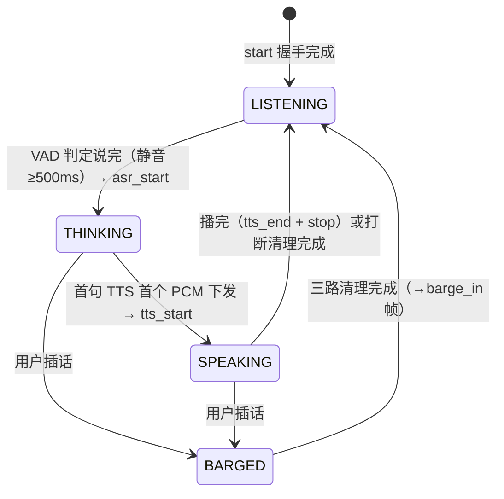

# Voice Assistant & Speech Capabilities

> NeoMind 的语音能力——**voice-assistant** 实时助手 + 可互换的 ASR / TTS 扩展，覆盖语音助手、语音输入、播报与音色克隆。

:::warning voice-assistant 为 PoC
voice-assistant 当前为 **PoC（概念验证）** 版本，回复合逻辑仍是 echo（原样回显），后续将切换为 NeoMind Agent 调用。ASR / TTS 扩展本身已是可用版本。
:::

---

## 1. 方案概述

NeoMind 的语音能力由一个编排扩展和若干能力扩展组成：

| 角色 | 扩展 | 能力 |
|---|---|---|
| 语音助手编排 | **voice-assistant**（PoC）| 实时 pipeline：VAD → ASR → 回显（将切 Agent）→ TTS |
| 语音识别（ASR） | sensevoice-asr | SenseVoice-Small，5 语种（中英日韩粤），CPU ONNX |
| 文字转语音（TTS） | cosyvoice-3 / voice-edge-tts / moss-tts-nano | 三者接口相同（`/tts/stream` NDJSON），可互换 |

**voice-assistant 数据流**：


ASR 与 TTS 既能被 voice-assistant 编排，也能单独调用（语音输入、语音播报）。本文按"**为什么 → 怎么做 → 真实请求/响应 → 怎么确认 → 常见坑**"展开每条能力，协议报文与返回结构均摘自扩展源码（`voice-assistant/service/ws_protocol.py`、`server.py`、`orchestrator.py` 等），没有抽象化改写。

---

## 2. 物料清单（BOM）

| 物料 | 规格 | 用途 | 必需 |
|------|------|------|------|
| **NeoMind 平台** | v0.9.0+ | 扩展宿主 | ✅ |
| **voice-assistant**（语音助手）或 sensevoice-asr / TTS 扩展 | — | 按场景选 | ✅ |
| **LLM 端点** | NeoMind 内置（ws://127.0.0.1:9375）| 语音助手回复合成 | 语音助手 |
| **麦克风 / 扬声器** | 浏览器或主机音频 | 录音 / 播放 | 语音助手 |
| **GPU（可选）** | NVIDIA | cosyvoice-3 高质量 TTS | 可选 |

---

## 3. 安装扩展

按场景从 **Extensions（扩展）** 页的扩展市场安装对应扩展（market 2.7.x 均可）：

| 场景 | 需安装的扩展 | 额外准备 |
|------|------------|----------|
| 实时语音助手（完整听说链路）| **voice-assistant** | Python 编排服务（见 [4.1](#41-部署-python-编排服务)）|
| 仅语音输入 / 录音转写 | **sensevoice-asr** | ASR Python 推理服务（见 [5.1](#51-部署推理服务)）|
| 仅语音播报 / 音色克隆 | **moss-tts-nano** / **cosyvoice-3** / **voice-edge-tts** 三选一 | 对应 TTS Python 推理服务（见 [6.5](#65-部署与配置)）|

安装步骤：

1. 进入 **Extensions** 页，打开扩展市场，搜索扩展名（如 `voice-assistant`）并安装；
2. 安装完成后回到扩展列表，确认该扩展状态为 **Running**；
3. 这些扩展的 Rust 部分装好即用，但**各自的 Python 推理 / 编排服务是独立进程**，需要按后文步骤单独启动——扩展通过 HTTP / WebSocket 访问它们（默认端口：编排服务 9384、sensevoice-asr 9383、moss-tts-nano 9382、cosyvoice-3 9385、voice-edge-tts 9386）。

> 安装与管理扩展的通用操作见 [扩展管理](../user-guide/9-extensions.md)。

---

## 4. 语音助手（voice-assistant）

**为什么这样设计**：实时语音对话的难点不在单个模型，而在衔接——什么时候算"说完了"？机器开口时怎么避免被自己的声音打断？用户插话时如何立刻闭嘴？voice-assistant 把这些全部收进一个 Python 编排服务：浏览器只负责采集与播放 PCM，VAD 断句、ASR、LLM、TTS、回声抑制、打断清理都在编排服务里完成，卡片与编排服务之间只跑一条极简的 WebSocket 协议（二进制 = 音频，文本 = JSON 控制帧）。

### 4.1 部署 Python 编排服务

默认 **all-in-one 模式**（`default` profile）：SenseVoice ASR + ZipVoice TTS 在 Python 编排服务内进程运行，无需单独起 ASR/TTS 服务；只需 NeoMind LLM 端点可达。

```bash
cd extensions/voice-assistant/service
python -m venv .venv
.venv/bin/pip install -r requirements.txt   # 约 700MB ONNX Runtime 依赖
./start.sh
```

首次启动下载约 400MB 模型权重到 `~/.cache/sherpa-onnx/`：

| 模型 | 体积 | 用途 |
|------|------|------|
| `sherpa-onnx-sense-voice-zh-en-ja-ko-yue-2024-07-17` | ~230MB | ASR |
| `sherpa-onnx-zipvoice-distill-int8-zh-en-emilia` | ~170MB | TTS 编码器/解码器 |
| `vocos_24khz.onnx` | ~22MB | TTS vocoder |

后续启动从缓存加载（约 2–3 秒）。zero-shot TTS 的默认提示音频已随包内置（`service/assets/default_prompt.{wav,txt}`），`voice='中文女'` 开箱即用。

NeoMind API Token 可用环境变量 `export NEOMIND_TOKEN=nmk_xxx` 设置，也可在卡片配置对话框里填写（推荐——对话框会在每次会话开始前推送给编排服务）。

编排服务常用环境变量：

| 变量 | 默认值 | 说明 |
|------|--------|------|
| `VOICE_ASSISTANT_PROFILE` | `neomind-capability`（start.sh 默认）| 初始 profile。`default` = 内置 SenseVoice + ZipVoice + NeoMind WS LLM 全家桶；`neomind-capability` = LLM 经宿主 ChatStream 能力调用（扩展侧免 token）|
| `VOICE_ASSISTANT_VAD_BACKEND` | `silero` | VAD 后端：`silero` / `energy` / `fsmn`（噪声环境建议 `fsmn`）|
| `VOICE_ASSISTANT_HOST` / `VOICE_ASSISTANT_PORT` | `127.0.0.1` / `9384` | 编排服务监听地址 |
| `SENSEVOICE_ASR_MODEL_DIR` | `~/.cache/sherpa-onnx` | ASR 模型缓存目录 |
| `VOICE_EDGE_TTS_MODEL_DIR` | `~/.cache/sherpa-onnx` | TTS 模型 + vocoder 缓存目录 |
| `NEOMIND_TOKEN` | （按 profile 需要）| NeoMind LLM API Token，也可经卡片配置下发 |

扩展侧环境变量：`VOICE_ASSISTANT_ORCHESTRATOR_URL`（默认 `ws://127.0.0.1:9384/ws`），指定 Rust 扩展桥接的编排服务 WS 地址。

> 其余可选 profile：`edge-arm`（RK3588 / Jetson + 本地 ollama）、`noisy-env`（高噪环境提高 VAD 阈值）、`headset`（近场耳机）、`kokoro-qwen3` 等，见扩展 README。

### 4.2 卡片配置参数（VoiceAssistantCard）

在 Dashboard 添加 **voice-assistant** 扩展的 **VoiceAssistantCard** 卡片后，配置对话框暴露以下字段（会话开始前经 HTTP `POST /config` 推送给编排服务，改完下一次开麦即生效，无需重启服务）：

| 字段 | 类型 / 取值 | 说明 |
|------|------------|------|
| `wsUrl` | string，默认 `http://127.0.0.1:9384` | 编排服务地址（http:// 或 ws://、带不带 `/ws` 均可，自动归一化）|
| `profile` | 下拉 | 运行时切换 profile，触发后端重载（进程内模型约 1–3 秒）|
| `neoMindToken` | string（密码框）| NeoMind API Token，仅存于编排服务进程内存 |
| `language` | `auto` / `zh` / `en` / `ja` / `ko` / `yue` | ASR 语言提示，即时生效 |
| `voice` | string（如 `中文女`）| TTS 音色，即时生效 |
| `showTranscripts` | boolean | 是否显示实时字幕 / 对话 |
| `showMetrics` | boolean | 是否显示延迟面板 |
| `directMode` | boolean | **Direct Python WS Mode** 复选框。默认关：前端连宿主 `/api/extensions/voice-assistant/stream` 端点，LLM 经宿主 ChatStream 能力调用（免 token）；开启后直连 `ws://127.0.0.1:9384/ws`，由编排服务持 token 调 LLM。切换后需关闭重开卡片 |

> 两种模式的取舍：默认 stream 模式下宿主能看到每次 LLM 调用（审计 / 治理），token 不出宿主进程；direct 模式用于单独调试 Python 编排服务。两种模式下卡片与编排服务之间的**帧格式完全一致**，下文协议对两种模式同样适用。

### 4.3 会话状态机：一次对话的生命周期

编排服务内部维护一台显式状态机（`orchestrator.py` 的 `StateMachine`），卡片上的状态徽标 / Orb 动画就是它的镜像。理解状态迁移，就理解了"卡片现在为什么是这个颜色"：



| 状态 | 卡片显示 | 进入条件（触发帧）| 编排服务在做什么 |
|------|---------|------------------|-----------------|
| **IDLE / STANDBY** | STANDBY | WS 连接建立、`ready` 收到 | 会话空闲，VAD 持续监听麦克风 |
| **LISTENING** | LISTENING | 开麦即进入；打断清理后回到这里 | 麦克风 PCM 流式喂给 VAD，等待完整语句 |
| **THINKING** | THINKING | VAD 判定语句结束，ASR 开始（下行 `asr_start`）| 整段 PCM → ASR 转写 → LLM 流式生成；卡片在收到 `asr_start` 时立即变 THINKING，不用等转写结果 |
| **SPEAKING** | SPEAKING | 首句合成的第一个 PCM 块下发（下行 `tts_start`）| 边生成边播：LLM 后续句子与 TTS 播放并行（bi-streaming）|
| **BARGED** | （瞬时，用户无感）| THINKING / SPEAKING 期间检测到用户语音 | 并行执行三路清理：① 通知浏览器停止播放（`barge_in` 帧，前端约 8ms 淡出）② 取消在途 LLM 请求 ③ 清空待合成句队列；可选补一句"好的"类应答音，随后回 LISTENING |

两个细节值得知道：

- **免提模式的断句节奏**由 `vad_silence_ms`（默认 500ms）决定——说完停顿约半秒才判定结束进入 THINKING，这是正常现象而非卡顿；
- **THINKING / SPEAKING 期间 VAD 阈值被临时抬高约 30 倍**，防止扬声器回声触发"自打断"。代价是打断需要用正常音量说话，气声 / 极轻声可能无法触发 barge-in。

### 4.4 WebSocket 消息协议（卡片 ↔ 编排服务）

协议的单一事实来源是 `service/ws_protocol.py` + `server.py` 模块头注释。要点：**二进制帧 = 16kHz 单声道 int16 LE PCM**（上行是麦克风音频，下行是待播放音频），**文本帧 = 一行 JSON**，每行都有 `type` 字段。

**上行（卡片/扩展 → 编排服务，`ws://127.0.0.1:9384/ws?session_id=…`）：**

| 帧 | JSON 形状 | 说明 |
|----|-----------|------|
| `start` | `{"type":"start","session_id":"va-7f3a","sample_rate":16000}` | 连接后发一次，触发握手 |
| `ping` | `{"type":"ping"}` | 健康探针，回 `pong` |
| `stop` | `{"type":"stop"}` | 客户端主动结束当前轮（等同打断）|
| 二进制 | （原始 int16 LE PCM）| 麦克风音频，按 ~32ms 块持续上行 |

**下行（编排服务 → 卡片/扩展）：**

| 帧 | JSON 形状 | 说明 |
|----|-----------|------|
| `ready` | `{"type":"ready","session_id":"va-7f3a","asr_url":"(in-proc)","tts_url":"(in-proc)","voice":"中文女","vad_silence_ms":500,"vad_min_speech_ms":300,"vad_energy_threshold":0.015}` | `start` 的应答，携带生效的 VAD 参数与音色 |
| `pong` | `{"type":"pong"}` | `ping` 的应答 |
| `greeting` | `{"type":"greeting","text":"你好，我在。"}` | 会话开始播报的欢迎语（其后紧跟一段二进制欢迎语 PCM；不伴随 tts_start/tts_end）|
| `asr_start` | `{"type":"asr_start","bytes":96000}` | VAD 断句完成，N 字节 PCM 进入 ASR；卡片据此立刻转 THINKING |
| `partial_transcript` | `{"type":"partial_transcript","text":"查一下三号仓"}` | 流式 ASR 的实时部分转写（字幕覆盖显示；`transcript` 到达后清空）|
| `transcript` | `{"type":"transcript","text":"查一下三号仓库的温度。","language":"auto","elapsed_ms":183.4}` | 最终转写：文本 + 语言提示 + ASR 耗时 |
| `llm_sentence` | `{"type":"llm_sentence","seq":0,"text":"好的，三号仓库当前温度 26.5 摄氏度。"}` | 每完成一句 LLM 句子推一帧，用于渐进字幕；可忽略不影响播放 |
| `skip` | `{"type":"skip","reason":"empty_transcript"}` | 本轮跳过，不调 LLM/TTS。reason 还有 `noise_transcript`（噪声幻觉过滤）、`empty_llm_output`、`empty_tts_output` |
| `tts_start` | `{"type":"tts_start","text":"(voice reply)","mode":"full_synthesize"}` | 首个 TTS PCM 下发前发出；卡片据此转 SPEAKING |
| `tts_end` | `{"type":"tts_end","total_ms":742.6,"tts_first_chunk_ms":88.0,"asr_ms":183.4}` | 一轮播报结束，携带延迟指标（见 4.5）|
| `stop` | `{"type":"stop"}` | 一轮对话正常结束的收尾帧 |
| `barge_in` | `{"type":"barge_in"}` | 打断控制帧：浏览器立即清空播放队列（约 8ms 淡出）|
| `error` | `{"type":"error","phase":"asr","message":"…"}` | 阶段级错误；phase 取 `asr` / `tts` / `pipeline` 等，握手失败时为无 phase 的 `{"type":"error","message":"…"}` |
| 二进制 | （原始 int16 LE PCM）| 待播放音频（TTS 输出已降混/重采样到 16kHz 单声道）|

> `neomind-capability` profile（默认）下还有一组 `chat_chunk` / `chat_stream_started` / `chat_stream_end` / `chat_stream_error` 帧——那是宿主 ChatStream 能力产生的 LLM 事件，经同一条 WS 进入编排服务后由 LLM 后端消费，客户端无需处理。

**一轮完整对话的帧序（示例值，实测数量级）：**

```text
→ {"type":"start","session_id":"va-7f3a","sample_rate":16000}
← {"type":"ready","session_id":"va-7f3a","asr_url":"(in-proc)","tts_url":"(in-proc)",
   "voice":"中文女","vad_silence_ms":500,"vad_min_speech_ms":300,"vad_energy_threshold":0.015}
← {"type":"greeting","text":"你好，我在。"}      ← 紧跟一帧二进制欢迎语 PCM
   （用户开始说话，麦克风 PCM 二进制帧持续上行）
← {"type":"asr_start","bytes":96000}            ← 说完（静音≥500ms），3 秒音频 ≈ 96000 字节
← {"type":"partial_transcript","text":"查一下三号仓"}
← {"type":"transcript","text":"查一下三号仓库的温度。","language":"auto","elapsed_ms":183.4}
← {"type":"llm_sentence","seq":0,"text":"好的，三号仓库当前温度 26.5 摄氏度。"}
← {"type":"tts_start","text":"(voice reply)","mode":"full_synthesize"}
← （二进制 PCM 帧连续下发，扬声器开始出声）
← {"type":"tts_end","total_ms":742.6,"tts_first_chunk_ms":88.0,"asr_ms":183.4}
← {"type":"stop"}                               ← 本轮结束，回到 LISTENING 继续听
```

**打断（barge-in）帧序：** SPEAKING 期间用户开口 → VAD 检出语音 → 编排服务先并行执行三路清理，再下行 `{"type":"barge_in"}`（前端淡出停播），随后回到 LISTENING——用户无需等上一轮播完。若 `stop` 由客户端主动发出（如再点一次麦克风），编排服务执行同样的清理流程。

### 4.5 延迟面板：数字是怎么来的

卡片头部的 ASR / LLM / TTS / Total 四个数字来自 `tts_end` 帧，各列与字段的对应关系：

| 面板列 | `tts_end` 字段 | 含义 | PoC 实测参考 |
|--------|---------------|------|-------------|
| **ASR** | `asr_ms` | VAD 断句完成 → 转写完成 | 10 秒录音约 155ms（RTF 0.014）|
| **LLM** | `llm_first_sentence_ms` | LLM 流开始 → 第一句完整句子产出（新版本携带；缺省时该列不显示）| 约 106–172ms |
| **TTS** | `tts_first_chunk_ms` | TTS 开始 → 首个 PCM 块下发 | 约 88ms（moss 首块实测均值 71ms）|
| **Total** | `total_ms` | 本轮起点 → 播报结束 | 随回复长度线性增长 |

用户真正关心的"说完到听到首段音频"，PoC 实测约 **195–200ms**（ASR 完成 → 首句字幕 106ms + 首句 → 首块音频 89ms）。能做到这么低，靠的是 **bi-streaming**：LLM 生产者与 TTS 消费者经一个有界队列（容量 4）并发——第一句 LLM 句子一产出就立刻送去 TTS，后续句子的生成与前面句子的播放重叠进行。首音频延迟从"全部 LLM + 全部 TTS 之和"压缩为"首句 LLM + 首句 TTS 首块"。端到端基准（`measure_bi_stream_e2e.py`）实测 ASR 完成 → 首音频平均 163ms、最差 202ms。

### 4.6 使用步骤

1. 确认编排服务已启动：`curl http://127.0.0.1:9384/config` 应返回当前配置与可用 profile 列表；
2. 在 Dashboard 添加 **VoiceAssistantCard**；
3. 打开卡片配置对话框：核对 `wsUrl`，按需选择 `language`、`voice`（直连模式需填 `neoMindToken`），保存；
4. 点麦克风按钮并在浏览器提示中**允许麦克风权限**，Orb 进入 LISTENING；
5. 说话——默认**免提模式**持续监听，VAD 自动断句；也支持**按住说话**（push-to-talk）。转写实时出现在字幕区，随后 Orb 依次经过 THINKING → SPEAKING，回复合成语音播报；
6. 播报中直接开口即可**打断**（barge-in）：播放淡出停止，回到 LISTENING 继续听；
7. 再点一次麦克风按钮结束会话。

> 📷 待补截图｜语音助手卡片 · 建议路径 `…/neomind/voice/01-assistant-card.png`

### 4.7 怎么确认

逐项核对（结合 4.4 帧序理解每条对应的协议帧）：

- [ ] 卡片底部显示 **Connected**；
- [ ] 点麦克风后状态徽标从 STANDBY 变为 **LISTENING**，Orb 随说话幅度起伏；
- [ ] 说一句话后字幕区先出现用户转写，Orb 转 **THINKING** → **SPEAKING** 并播报回显（当前 PoC 为"你说的是：…"）；
- [ ] 头部延迟面板出现 **ASR / LLM / TTS / Total** 数字——PoC 实测从 ASR 完成到听到首段音频约 200ms；
- [ ] 播报中插话能立即打断（barge-in）。

**常见坑**：

- 切换 `directMode` 后画面不变——必须**关闭并重开卡片**才按新模式重连；
- 免提模式下"幻影转写"或播报被自己声音打断——扬声器回声漏进麦克风，见 §8 的 AEC 条目；
- 轻声插话打不断——THINKING/SPEAKING 期间 VAD 阈值抬高约 30 倍防自打断，用正常音量说话即可；
- 一直卡 THINKING——多为页面 JWT 过期或能力事件未路由，刷新页面重连；
- 说完立刻闭嘴会被截断尾字——VAD 需 500ms 静音才断句，属于设计行为，可用 `VOICE_ASSISTANT_VAD_SILENCE_MS` 调整。

---

## 5. 语音转文字（sensevoice-asr）

**为什么单独提供**：不是所有场景都需要"对话"。工单口述、录音转写、给 Agent 的语音入口，只需要"一段音频 → 一段文字"这一个确定性动作。sensevoice-asr 就是这个动作：SenseVoice-Small（234M 参数 INT8，`sherpa-onnx` ONNX CPU 后端），支持中、英、日、韩、粤 5 语种，CPU 上实时率（RTF）约 0.017——10 秒录音零点几秒出结果，不需要 GPU。

### 5.1 部署推理服务

```bash
cd extensions/sensevoice-asr/service
pip install -r requirements.txt
./start.sh        # 监听 http://127.0.0.1:9383
```

首次运行下载约 230MB ONNX 权重到 `~/.cache/sherpa-onnx/`。冒烟验证（两个只读端点的真实响应）：

```bash
curl http://127.0.0.1:9383/health
# {"status":"ok"}          ← 权重加载完成；加载中返回 {"status":"loading"}

curl http://127.0.0.1:9383/languages
# {"languages":["auto","zh","en","ja","ko","yue"]}
```

服务端环境变量：`SENSEVOICE_ASR_SERVICE_URL`（扩展侧服务地址，默认 `http://127.0.0.1:9383`）、`SENSEVOICE_ASR_LANGUAGE`（默认语言提示，`auto`）、`SENSEVOICE_ASR_MODEL_DIR`（权重目录）、`SENSEVOICE_ASR_CPU_THREADS`（ONNX Runtime 线程数，默认 2）。

### 5.2 命令与参数

扩展共 4 个命令：

| 命令 | 说明 | 典型用途 |
|------|------|----------|
| `transcribe` | 文件路径或 base64 WAV → 返回文字 | 语音输入、转写界面 |
| `transcribe_file` | 仅按本地路径转写（便捷封装）| 预录制音频流水线 |
| `health` | 探测 Python 服务可达性 | 监控 |
| `languages` | 列出支持的语种提示 | UI 下拉框 |

**`transcribe` 参数**：

| 参数 | 类型 | 必填 | 说明 |
|------|------|------|------|
| `audio_path` | string | 二选一 | **宿主机**本地音频路径（wav/mp3/m4a/flac），与 `audio_base64` 互斥 |
| `audio_base64` | string | 二选一 | base64 编码的 **16-bit PCM WAV** 字节（如浏览器录音），与 `audio_path` 互斥 |
| `language` | string | 否 | 语种提示：`auto`（默认，混合语可用）/ `zh` / `en` / `ja` / `ko` / `yue` |
| `use_itn` | boolean | 否 | 逆文本正则化（口语数字转写为阿拉伯数字等），默认 `true` |

**`transcribe_file` 参数**：`path`（string，必填，宿主机本地音频路径）、`language`（同上）。

`health` 与 `languages` 的返回：`{"ok":true,"service_url":"http://127.0.0.1:9383"}`、`{"languages":["auto","zh","en","ja","ko","yue"]}`。

### 5.3 完整转写示例（transcribe）

**输入**：`/tmp/meeting-clip.wav`——16kHz / 16-bit / 单声道 WAV，时长 5.2 秒，内容为普通话"今天下午三点开产线例会，三号仓温度正常。"（其余采样率 / 声道会自动重采样、降混；`audio_path` 走 soundfile 解码，mp3/m4a/flac 均可）。

**调用方式一**：扩展详情页 **Commands** 标签展开 `transcribe`，填 `audio_path=/tmp/meeting-clip.wav`、`language=auto`，执行。

**调用方式二**：REST API（供 AI Agent / 自动化规则调用；**没有** `neomind extension invoke` 这类 CLI）：

```bash
curl -X POST -H "X-API-Key: $NEOMIND_API_KEY" \
     -H "Content-Type: application/json" \
     -d '{"command":"transcribe","args":{"audio_path":"/tmp/meeting-clip.wav","language":"auto"}}' \
     http://localhost:9375/api/extensions/sensevoice-asr/command
```

**响应**（扩展把推理服务 `/asr` 的 JSON 原样返回；数值为**示例**，随机器与音频而异）：

```json
{
  "text": "今天下午3点开产线例会，三号仓温度正常。",
  "language": "auto",
  "elapsed_seconds": 0.11,
  "duration_seconds": 5.2,
  "rtf": 0.021
}
```

| 字段 | 含义 | 备注 |
|------|------|------|
| `text` | 转写文本 | 注意"三点"被 ITN（`use_itn: true` 默认开）转成了"3点" |
| `language` | 回显请求的语种提示 | 传 `auto` 就返回 `"auto"`，不是检测出的语种 |
| `elapsed_seconds` | 纯推理耗时 | 不含音频解码 |
| `duration_seconds` | 音频时长（重采样到 16kHz 后）| |
| `rtf` | 实时率 = elapsed / duration | 越小越快；M2 / 2 线程实测约 0.017，即 10 秒录音约 0.2 秒完成 |

推理服务同一响应还携带 `X-Elapsed-Seconds` / `X-Duration-Seconds` / `X-RTF` 三个 HTTP 头（扩展据此更新 `rtf` 指标）。浏览器录音场景把 `audio_path` 换成 `audio_base64`（WAV 字节直接 base64）即可，其余不变。

> 📷 待补截图｜transcribe 命令 · 建议路径 `…/neomind/voice/02-asr.png`

**怎么确认**：`health` 返回 `ok:true` → 执行 5.3 示例 → `text` 与录音内容一致、`rtf` 小于 0.1。

**常见坑**：

- `audio_path` 是**运行扩展宿主的机器**上的路径，不是你浏览器所在电脑的路径；远程 / 浏览器场景一律用 `audio_base64`；
- `audio_base64` 只接受 **16-bit PCM WAV**（`sampwidth=2`），其他位宽直接报错；mp3/m4a/flac 请走 `audio_path`；
- SenseVoice 是离线（整段）模型：超长录音耗时随时长线性增长（RTF 恒定），流式场景请用 voice-assistant 的 VAD 断句把长音频切成句；
- 环境噪声可能产生单字符 / 短英文"幻觉转写"——voice-assistant 内置噪声过滤（`skip: noise_transcript`），单独调用时建议业务侧按最短长度过滤；
- 想保留"三点"这样的汉字数字，传 `use_itn: false`。

---

## 6. 文字转语音（TTS，三选一）

**为什么三个扩展一个接口**：TTS 的需求随硬件千差万别——GPU 服务器要质量，Mac / ARM 边缘盒要能跑，全平台 CPU 要多语种。NeoMind 把三个后端做成**同一条命令、同一个 `/tts/stream` NDJSON 协议**，应用代码（含 voice-assistant）零改动，换一个环境变量即换引擎。

### 6.1 选型

三个 TTS 扩展共用 `/tts/stream` NDJSON 接口，voice-assistant 改一个环境变量即可换后端。按部署平台和质量选：

| 维度 | moss-tts-nano | cosyvoice-3 | voice-edge-tts |
|---|---|---|---|
| 平台 | CPU 全平台 | 需 CUDA（Linux / Jetson；Mac 仅 MPS 兜底、速度不可用）| **Mac CPU / Linux ARM CPU** |
| 中文质量 | 一般 | 优秀 | 良好 |
| 音色克隆 | 支持（MOSS）| 支持（zero-shot，需 `prompt_text`）| 支持（zero-shot）|
| 体积 | ~200MB | ~1GB（首次下载约 2GB）| ~150MB |
| 语种 | 20+ | 中英 | 中英 |
| 内置音色 | 18 个（Junhao、Ava、Saki 等）| 7 个（中文女/中文男/英文女/英文男/日语男/粤语女/韩国女）| 中文女（可换参考音频定制）|
| 输出 | 48kHz 立体声 | 24kHz 单声道 | 24kHz 单声道 |

> 选型：要最高质量且有 GPU → cosyvoice-3；Mac/ARM 边缘设备 → voice-edge-tts；要多语种 + 克隆 + 全平台 CPU → moss-tts-nano。

### 6.2 统一命令与参数

三者命令一致：

| 命令 | 说明 |
|------|------|
| `speak` | 合成并直接在**主机音频设备**播放（流式：边合成边播）|
| `synthesize` | 合成返回 base64 WAV（不播放）|
| `stop_speaking` | 立即停止当前播放并清空缓冲 |
| `list_voices` | 列出服务端可用音色 |
| `health` | 探测 Python 服务 |

**`speak` / `synthesize` 参数**：

| 参数 | 类型 | 必填 | 说明 |
|------|------|------|------|
| `text` | string | ✅ | 要合成的文本 |
| `voice` | string | 否 | 内置音色名，覆盖各扩展的默认音色（MOSS 默认 `Junhao`，cosyvoice/edge 默认 `中文女`）|
| `prompt_audio_path` | string | 否 | 参考音频 wav 路径，用于音色克隆，设置后覆盖 `voice` |
| `prompt_text` | string | 仅 cosyvoice-3 | 参考音频的转写文本，zero-shot 克隆必需 |
| `sample_mode` | string | 否 | `greedy`（确定性输出，Agent 播报推荐）/ `fixed` / `full`（各扩展默认值不同，MOSS 服务端默认 `fixed`）|
| `blocking` | boolean | 仅 `speak` | 默认 `true`（播完才返回）；`false` 后台播放、立即返回 |

### 6.3 完整示例：speak 与 synthesize

**示例一：`speak` 后台播报**（自动化规则 / Agent 最常用——立即返回，不阻塞规则执行）：

```bash
curl -X POST -H "X-API-Key: $NEOMIND_API_KEY" \
     -H "Content-Type: application/json" \
     -d '{"command":"speak","args":{"text":"警告：3 号仓温度 31.2 摄氏度，已超限。","voice":"中文女","blocking":false}}' \
     http://localhost:9375/api/extensions/moss-tts-nano/command
```

返回（后台播放；数值为**示例**）：

```json
{ "played": true, "finished": false, "background": true, "frames": 23, "samples": 168960 }
```

`blocking: true`（默认）时改为播完才返回：`{ "played": true, "finished": true, "frames": 23, "samples": 168960, "duration_ms": 1760 }`。扩展内部走 `/tts/stream` 边收 PCM 块边推给 rodio 音频线程，所以首声不等整句合成完。

**示例二：`synthesize` 拿 WAV 自己处理**（写文件、进 Web 前端、接 PA 广播系统等）：

```bash
curl -X POST -H "X-API-Key: $NEOMIND_API_KEY" \
     -H "Content-Type: application/json" \
     -d '{"command":"synthesize","args":{"text":"今天巡检完成，共 12 台设备，全部正常。","voice":"Junhao"}}' \
     http://localhost:9375/api/extensions/moss-tts-nano/command
```

返回（`audio_base64` 已截断；数值为**示例**）：

```json
{
  "audio_base64": "UklGRigAAABXQVZFZm10IBIAAAABAAEARKwAAIhYAQACABAAZGF0YQQAAAAAAA==...",
  "format": "wav",
  "sample_rate": 48000,
  "duration_ms": 1834,
  "size_bytes": 351232
}
```

`sample_rate` / 声道随后端不同：cosyvoice-3 与 voice-edge-tts 为 24000 单声道，moss-tts-nano 为 48000 立体声——下游解码时注意。

**辅助命令返回**：`stop_speaking` → `{"stopped":true}`；`list_voices` → `{"voices":["Junhao","Ava","Saki",…]}`（实际列表随后端）；`health` → `{"ok":true,"service_url":"http://127.0.0.1:9382"}`。

### 6.4 `/tts/stream` NDJSON 事件序

`POST /tts/stream` 是三个后端共同的流式接口（也是 voice-assistant 编排服务消费的路径）。请求体即 `speak`/`synthesize` 的同名字段（`text` 必填，`voice` / `prompt_audio_path` / `sample_mode` 等可选）。响应是 NDJSON 流——**每行一个 JSON 事件，行内字段**：

```text
{"seq": 0, "data": "<base64 int16 LE PCM>", "sample_rate": 48000, "channels": 2, "is_pause": false}
{"seq": 1, "data": "<base64 ...>", "sample_rate": 48000, "channels": 2, "is_pause": false}
{"seq": 2, "data": "<base64 ...>", "sample_rate": 48000, "channels": 2, "is_pause": true}    ← 克隆多段文本时的句间静音块
...                                                                                          
{"seq": N, "data": "<base64 ...>", ..., "is_pause": false}                                   ← 最后一行
（连接关闭 = 合成结束；没有额外的 done/finish 帧）
```

事件序要点（源自 `moss-tts-nano/service/server.py` / `cosyvoice-3/service/server.py`）：

1. `seq` 从 0 单调递增；`data` 是无 WAV 头的裸 int16 LE PCM，按 `sample_rate` / `channels` 解释；
2. `is_pause: true` 的行是**静音填充**（克隆长文本分段时的句间停顿），播放器照常写队列即可；
3. 出错时流内终止：最后一行变为 `{"error": "..."}`，随后连接关闭——客户端按行解析时务必检查 `error` 键；
4. **首包很快**：MOSS 采用逐帧流式解码（自适应批大小 1→2→4→8），首块实测平均 71ms、最差 73ms（对比整段合成要等 10 秒+）；cosyvoice-3 目标首包 <200ms、30 字句子合成 <500ms。

### 6.5 部署与配置

#### moss-tts-nano（CPU 全平台）

（CPU 全平台，0.1B，48kHz 立体声，20+ 语种）：需先克隆上游 [MOSS-TTS-Nano](https://github.com/OpenMOSS/MOSS-TTS-Nano) 仓库并 `pip install -e .`（pynini 建议用 conda 装），首次运行下载 ~200MB ONNX 权重：

```bash
cd extensions/moss-tts-nano/service
MOSS_TTS_NANO_REPO=~/MOSS-TTS-Nano ./start.sh    # 监听 http://127.0.0.1:9382
```

关键配置：`MOSS_TTS_SERVICE_URL`（默认 `http://127.0.0.1:9382`）、`MOSS_TTS_VOICE`（默认 `Junhao`）、`MOSS_TTS_NANO_REPO`、`MOSS_TTS_MODEL_DIR`、`MOSS_TTS_CPU_THREADS`（默认 4）。也提供 Docker 镜像（挂载模型目录、`-p 9382:9382`）。

#### cosyvoice-3（GPU 高质量）

（0.5B，24kHz，质量最高）：Python 3.10+，首次运行从 ModelScope 下载约 2GB 模型到 `~/.cache/modelscope/`（约 5–10 分钟），目标首包不超过 200ms、30 字句子合成不超过 500ms：

```bash
cd extensions/cosyvoice-3/service
pip install -r requirements.txt
./start.sh        # 监听 http://127.0.0.1:9385
```

关键配置：`COSYVOICE_SERVICE_URL`（默认 `http://127.0.0.1:9385`）、`COSYVOICE_VOICE`（默认 `中文女`）、`COSYVOICE_MODEL_DIR`（ModelScope ID 或本地路径）、`COSYVOICE_HOST` / `COSYVOICE_PORT`、`PYTORCH_ENABLE_MPS_FALLBACK=1`。Linux / Jetson 生产环境建议 Docker + `--gpus all`。

#### voice-edge-tts（Mac / ARM 边缘）

（sherpa-onnx ZipVoice，~150MB，Mac/ARM CPU 友好）：

```bash
cd extensions/voice-edge-tts/service
pip install -r requirements.txt
./start.sh        # 监听 http://127.0.0.1:9386，首次下载 ~150MB 到 ~/.cache/sherpa-onnx
curl http://127.0.0.1:9386/health
# {"status":"ok","sample_rate":24000,"voices":["中文女"]}
```

关键配置：`VOICE_EDGE_TTS_HOST` / `VOICE_EDGE_TTS_PORT`（默认 9386）、`VOICE_EDGE_TTS_CPU_THREADS`（默认 2）、`VOICE_EDGE_TTS_MODEL_DIR`。定制音色：替换 `service/assets/default_prompt.wav` 与同名 `.txt`（**转写必须与音频一致**，建议 5–10 秒干净 16kHz 单声道人声）。

**主机音频要求**（`speak` 播放路径，经 rodio/cpal）：macOS CoreAudio 开箱即用；Linux 需 ALSA（构建时 `libasound2-dev`、运行时 `libasound2`），且主机需有可用音频输出设备、不被其他进程独占；Windows WASAPI 开箱即用。无音频后端的平台上 `speak` 会报错，可改用 `synthesize` 拿 WAV 自行播放。

**接入 voice-assistant**：改一个环境变量即可切换 TTS 后端（`VOICE_ASSISTANT_TTS_URL` 优先于 `MOSS_TTS_URL`）：

```bash
export MOSS_TTS_URL=http://127.0.0.1:9385          # 例：切到 cosyvoice-3
# 或 export VOICE_ASSISTANT_TTS_URL=http://127.0.0.1:9386   # 切到 voice-edge-tts
export VOICE_ASSISTANT_VOICE=中文女
```

**怎么确认**：`curl /health` 返回 `status:"ok"` → `list_voices` 能列出音色 → 跑 6.3 示例一，主机音箱出声且立即返回 → 跑示例二，`duration_ms` 与文本长度量级吻合。

**常见坑**：

- `speak` 报音频设备错误 / 无声——主机无可用输出设备、被独占或 Linux 缺 ALSA，改 `synthesize` 自行播放即可绕开；
- moss 的流式接口**同时只服务一个请求**（单请求串行），并发播报需业务侧排队；
- cosyvoice-3 在 Mac 上仅 MPS/CPU 兜底（RTF ~2.5×），不是"慢一点"而是不可用，别硬调；
- 克隆时 `prompt_text` 与参考音频内容不一致 → 克隆音色明显劣化；参考音频务必 5–10 秒干净 16kHz 单声道人声；
- `sample_mode` 不传时 MOSS 服务端默认 `fixed`（非确定性）；Agent 播报要每次一致，显式传 `greedy`。

> 📷 待补截图｜TTS speak / stream 调用 · 建议路径 `…/neomind/voice/03-tts.png`

---

## 7. 典型场景

### 7.1 实时语音助手

voice-assistant 端到端对话（PoC，后续接 Agent 做设备控制 / 信息查询）。免提模式适合展厅接待 / 信息亭；嘈杂产线建议 `noisy-env` profile 或按住说话。

流程：

1. `cd extensions/voice-assistant/service && ./start.sh` 启动编排服务（9384），`curl http://127.0.0.1:9384/config` 确认就绪；
2. Extensions 页安装 **voice-assistant**，确认 Running；
3. Dashboard 添加 **VoiceAssistantCard**，配置 `wsUrl` / `language` / `voice`，保存；
4. 点麦克风授权 → 卡片经 `start`/`ready` 握手进入 LISTENING（可直接听到 greeting 欢迎语）；
5. 说话 → VAD 断句 → `asr_start`/`transcript` → `llm_sentence` → `tts_start` + PCM 播报 → `tts_end`/`stop`（完整帧序见 4.4）；
6. 播报中直接开口验证 barge-in；
7. 看延迟面板数字是否在 4.5 的参考范围内。

### 7.2 语音输入转 Agent

sensevoice-asr 把语音转文字，喂给 [AI Agent](../user-guide/6-ai-agent.md) 或 AI Chat 执行——如现场口述工单。

流程：

1. Extensions 装 **sensevoice-asr**，`./start.sh` 起推理服务（9383），`curl /health` 确认 `{"status":"ok"}`；
2. 前端（或采集脚本）用浏览器 MediaRecorder 采集录音，封装为 16-bit WAV 并 base64 编码；
3. 调扩展命令：`POST /api/extensions/sensevoice-asr/command`，body `{"command":"transcribe","args":{"audio_base64":"…","language":"auto"}}`；
4. 从响应取 `text`（建议按业务最短长度过滤噪声转写）；
5. 把 `text` 作为输入交给 AI Agent（Agent 应用 / 自动化规则触发）生成工单，全程无键盘参与。

### 7.3 语音播报（规则联动）

TTS 把告警、读数、Agent 回复合成语音播报，用于展厅、产线广播、无障碍。[自动化规则](../user-guide/7-automation-rules.md) 支持调用扩展命令，可在规则动作里调用 TTS 的 `speak`。

流程：

1. 按平台装 TTS 三选一并起服务（如 moss 9382），`curl /health` + `list_voices` 确认可用；
2. 在自动化规则中创建触发条件（如"3 号仓温度 > 30℃"）；
3. 规则动作选"调用扩展命令"，目标 `moss-tts-nano`（或所选 TTS），命令 `speak`，参数 `{"text":"警告：3 号仓温度超限","blocking":false}`——`blocking:false` 让规则立即返回、播报后台进行；
4. 手动触发一次规则验证：主机音箱出声、规则执行记录无阻塞；
5. 长期运行建议显式传 `sample_mode:"greedy"`，保证同一告警每次播报一致。

### 7.4 音色克隆

用 moss-tts / cosyvoice / voice-edge 的 zero-shot 克隆定制音色——展厅讲解员、品牌语音等。

流程：

1. 准备参考音频：目标人声 5–10 秒、干净、16kHz 单声道 wav（如 `/tmp/ref.wav`）；cosyvoice-3 还需其**一字不差**的转写文本；
2. 调 `speak` 时传 `prompt_audio_path`（覆盖 `voice`）：`POST /api/extensions/cosyvoice-3/command`，body `{"command":"speak","args":{"text":"欢迎来到展厅。","prompt_audio_path":"/tmp/ref.wav","prompt_text":"参考音频的转写文本。","blocking":false}}`（moss / voice-edge 免 `prompt_text`）；
3. 试听确认音色相似度；不满意换更干净的参考音频重试；
4. 要把音色固化成默认（voice-edge 专属）：直接替换 `service/assets/default_prompt.wav` 与同名 `.txt`，重启服务后所有不传 `prompt_audio_path` 的调用都用该音色；
5. 批量预生成播报可用 `synthesize` 拿 WAV 落盘，避免每次实时合成。

---

## 8. 故障排查

| 现象 | 原因 | 解决 |
|------|------|------|
| 点麦克风即报 "Microphone access denied"，Orb 转 ERROR | 浏览器 / 客户端拒绝了麦克风权限 | 在浏览器地址栏权限设置里允许麦克风；macOS 桌面客户端还需在系统设置 → 隐私与安全性 → 麦克风中授权 |
| 卡片报 "WebSocket connection failed" / "Stream connection failed"，状态 ERROR | Python 编排服务未启动或地址不对 | 在部署机上 `./start.sh` 启动编排服务，`curl http://127.0.0.1:9384/config` 验证；核对卡片 `wsUrl` |
| 编排服务首次启动很慢或失败 | 首次需下载约 400MB 模型权重（FSMN VAD 还会拉取 ~500KB 模型）| 检查网络 / 代理；权重可手动下载后放入 `~/.cache/sherpa-onnx/`，重启即从缓存加载 |
| `transcribe` / `speak` 报服务不可达，`health` 返回 `ok:false` | 对应 Python 推理服务没起 | 按各节启动服务并 `curl /health`：sensevoice 9383 / moss 9382 / cosyvoice 9385 / voice-edge 9386 |
| cosyvoice-3 合成极慢或不可用 | 无 NVIDIA GPU：Mac 仅 MPS/CPU 兜底（RTF ~2.5×，不可用），cosyvoice 面向 Linux + CUDA | 换 voice-edge-tts（Mac/ARM CPU）或 moss-tts-nano（CPU 全平台）；GPU 服务器用 Docker `--gpus all` 部署 |
| `speak` 无声或报音频设备错误 | 主机无可用音频输出设备、被独占，或 Linux 缺 ALSA 库 | 确认主机扬声器可用、无其他进程独占；Linux 安装 `libasound2`；或改用 `synthesize` 返回 WAV 自行播放 |
| 免提模式下没说话也出现"幻影转写"、播报被自己的声音打断 | 扬声器声音漏进麦克风触发 VAD（回声）| 默认 `echo_window` AEC 已抑制大部分；仍误触发可改按住说话，或配置 `webrtc` AEC（`pip install webrtc-audio-processing`）|
| stream 模式下 401 / 连接被拒或一直卡在 THINKING | 页面 JWT 过期或能力事件未路由 | 刷新页面重新获取 token；仍卡住检查编排服务日志与扩展日志 |

---

## 9. 附录

### 相关文档

- [扩展管理](../user-guide/9-extensions.md)
- [AI Agent](../user-guide/6-ai-agent.md)
- [AI Chat](../user-guide/5-ai-chat.md)
- [配置 LLM 后端](../user-guide/2-configure-llm.md)
- voice-assistant / sensevoice-asr / cosyvoice-3 / voice-edge-tts / moss-tts-nano 扩展 README

---

*最后更新: 2026-09-09*
