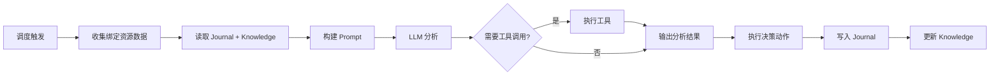

# AI Agent 自主智能体

AI Agent 是 NeoMind 的**自主执行模式**——你设定目标和触发条件，Agent 按计划或事件自动运行，收集数据、调用 LLM 分析、执行动作。它与 [AI Chat](./5-ai-chat.md) 在触发方式、上下文和适用场景上的详细对比，见 AI Chat 文档中的 [Chat vs Agent](./5-ai-chat.md#chat-vs-agent两种模式) 对照表。

## 前置条件

- 已配置 [LLM 后端](./2-configure-llm.md)（Agent 需要调用 LLM）
- 已接入[设备](./3-onboard-device.md)（Agent 需要数据源）

## 界面概览

点击左侧导航的 **Agents**（机器人图标）进入 Agent 管理页面：


页面以**卡片网格**展示所有 Agent，每张卡片显示：

| 信息 | 说明 |
|------|------|
| **Agent 名称** | 你设置的名称（如「温度巡检」「能耗日报」） |
| **状态徽章** | Active（激活）/ Paused（暂停）/ Executing（执行中）/ Error（错误） |
| **调度方式** | Cron 表达式 / Interval / Event |
| **上次执行** | 最近一次执行的时间与结果 |

页面顶部有四个页签：**Agents**（智能体列表）、**Memory**（系统记忆）、**Skills**（技能管理）、**Tools**（工具管理）。

:::note Skills（技能）
为 Agent 提供场景化操作指南的知识文件（内置技能只读，用户技能可在页签内增删改）。Agent 执行时按描述自动匹配相关技能（BM25 词法排序），也可在执行中用 `skill` 工具按需搜索和加载（`skill(action="search"/"load")`）。
:::

## 创建 Agent

点击右上角的 **Create AI Agent** 按钮，打开全屏编辑器：


编辑器分为左右两栏，以下是各配置项说明：

### 1. 名称与 Prompt（左侧）

- **Name（名称）**：1–100 字符，便于识别（如「能耗巡检」「设备健康监测」）
- **Description（描述）**：可选，简短说明 Agent 用途
- **User Prompt（用户提示词）**：告诉 Agent 要做什么。1–10000 字符。

示例 prompt：

> 检查所有温湿度传感器的最新数据。如果任何传感器温度超过 35°C，通过飞书通知运维组，并在仪表板上记录告警。如果所有设备正常，简短汇报即可。

### 2. 执行模式（右侧）

| 模式 | 说明 | 适用场景 |
|------|------|---------|
| **Focused（聚焦模式）** | 绑定指定资源，Agent 在定义范围内工作，单次分析，token 高效 | 监控、告警、数据分析 |
| **Free（自由模式）** | 不绑定资源，LLM 自由探索，可调用全部工具，多轮推理 | 复杂自动化、设备控制、探索性任务 |

**Focused 模式**需要绑定资源（设备指标 / 扩展指标 / 设备 / 扩展工具），Agent 只收集和分析绑定范围内的数据。Scope 校验会拒绝超出绑定范围的指令。

**Free 模式**无需绑定资源，LLM 拥有全部工具（device / rule / message / extension / shell 等），可做多轮工具调用（默认上限 30 轮，5 分钟超时）。

### 3. 调度方式（右侧）


Agent 按调度方式自动触发执行：

| 调度类型 | 说明 | 配置 |
|---------|------|------|
| **Cron（定时表达式）** | 按 cron 表达式触发 | `schedule_type: "cron"`, `cron_expression: "0 0 * * * *"` |
| **Interval（固定间隔）** | 每隔 N 秒执行 | `schedule_type: "interval"`, `interval_seconds: 300` |
| **Event（事件触发）** | 设备数据变化 / 告警时触发 | `schedule_type: "event"` |

:::note
Agent 的 Cron 使用 **6 字段格式**（含秒）：`秒 分 时 日 月 周`，语法与 [自动化规则](./7-automation-rules.md) 的触发器一致。
:::

**事件触发**：当设备推送新数据或系统产生告警时自动执行。适合实时响应场景（如异常检测后立即分析）。事件触发有 60 秒去重窗口，防止事件风暴。

### 4. LLM 后端

每个 Agent 可绑定独立的 LLM 后端。与 Chat 模型解耦——切换 Chat 模型不会影响 Agent 配置。建议：
- **简单监控**：本地小模型（`qwen3.5:4b`），降低延迟和成本
- **复杂分析**：大模型（`qwen3.5:32b` / 云端模型），提高推理质量

填写完成后点击底部的 **Save** 保存 Agent。

### 完整示例：创建「温度巡检 Agent」

把上面的字段串起来——假设需求是「每小时检查一次所有温度传感器，超过 35°C 通知运维」。逐字段填写：

| 字段 | 填写值 | 说明 |
|------|--------|------|
| **Name** | `温度巡检` | 1–100 字符，必填 |
| **Description** | `每小时巡检温度传感器，超温自动通知` | 可选，≤500 字符 |
| **User Prompt** | 见下方 | 1–10000 字符，必填 |
| **Execution Mode** | `Focused` | 只在绑定的传感器范围内工作，省 token、不会误控别的设备 |
| **Resources** | 绑定 2 台温度传感器的 `temperature` 指标 | Focused 模式必须至少绑定 1 个资源，否则保存会被拒绝 |
| **Schedule** | `Cron`，表达式 `0 0 * * * *` | 6 字段格式（含秒），即每小时整点 |
| **LLM Backend** | `qwen3.5:4b`（或更强模型） | 简单巡检用本地小模型即可 |

User Prompt 示例（可直接复制修改）：

```text
你是温度巡检员。读取绑定的所有温度传感器的最新读数：
1. 全部低于 35°C：用一句话汇报「巡检正常，当前最高温度 XX°C」；
2. 任一超过 35°C：发送告警消息（标题含设备名和当前温度），
   并在回复中说明已发送；
3. 如果 journal 显示上一轮已对同一设备发过相同告警，不要重复发送。
```

点 **Save** 后 Agent 立即出现在列表中，状态为 **Active**，并开始按 cron 调度。

#### 用 API 创建同样的 Agent

Web UI 的每个字段都对应 `POST /api/agents` 请求体里的一个字段。与上面等价的请求：

```bash
curl -X POST http://localhost:9375/api/agents \
  -H "Authorization: Bearer <JWT>" \
  -H "Content-Type: application/json" \
  -d '{
    "name": "温度巡检",
    "description": "每小时巡检温度传感器，超温自动通知",
    "user_prompt": "读取绑定的所有温度传感器的最新读数，超过 35°C 发送告警，正常则简短汇报。",
    "execution_mode": "focused",
    "resources": [
      { "resource_id": "device:sensor-01:temperature", "resource_type": "metric", "name": "一号机房温度" },
      { "resource_id": "device:sensor-02:temperature", "resource_type": "metric", "name": "二号机房温度" }
    ],
    "schedule": { "schedule_type": "cron", "cron_expression": "0 0 * * * *" },
    "llm_backend_id": "default"
  }'
```

成功响应（`id` 用于后续查询与触发）：

```json
{
  "success": true,
  "data": { "id": "8f3a…", "name": "温度巡检", "status": "active" }
}
```

请求体关键约束（与 Web UI 校验一致）：

| 字段 | 约束 |
|------|------|
| `name` | 必填，1–100 字符 |
| `user_prompt` | 必填，1–10000 字符 |
| `description` | 可选，≤500 字符 |
| `system_prompt` | 可选，≤4000 字符，覆盖默认身份设定 |
| `execution_mode` | `focused` / `free`；`focused` 必须带至少一个 `resources` |
| `schedule.schedule_type` | `interval` / `cron` / `event`；`interval` 需 `interval_seconds` ≥ 10（`0` 表示纯手动）；`cron` 需合法的 6 字段 `cron_expression` |
| `resources[].resource_type` | `device` / `metric` / `command` / `extension_metric` / `extension_tool` / `data_stream` |
| `max_chain_depth` | 1–30，默认 3（Focused+ 模式的工具调用轮数上限） |

## 手动执行一次并查看结果

不用等 cron 到点——保存后立刻可以验证 Agent 是否按预期工作：

**第 1 步 · 触发执行**：点击详情页右上角 **Execute Now**，或调用 API：

```bash
curl -X POST http://localhost:9375/api/agents/<agent_id>/execute \
  -H "Authorization: Bearer <JWT>" \
  -H "Content-Type: application/json" \
  -d '{ "trigger_type": "manual", "input": "执行一次巡检" }'
```

**第 2 步 · 轮询执行状态**：执行通常需要几十秒（收集数据 → LLM 分析 → 动作）。列表页状态徽章会实时变化（Executing → Active），也可以轮询 API：

```bash
curl http://localhost:9375/api/agents/<agent_id>/executions
```

返回的执行记录字段（示意）：

```json
{
  "executions": [{
    "id": "exec-9c1f…",
    "agent_id": "8f3a…",
    "timestamp": "2026-09-09T14:00:00Z",
    "trigger_type": "manual",
    "status": "Completed",
    "duration_ms": 21340
  }]
}
```

`status` 取值：`Running` / `Completed` / `Failed` / `Partial`（部分动作失败）。`Failed` 时看 `error` 字段。

**第 3 步 · 读取执行详情（决策过程）**：把执行 `id` 拼进详情接口，可以看到 Agent 的完整推理链——收集了哪些数据、每一步推理、做了什么决策、最终结论：

```bash
curl http://localhost:9375/api/agents/<agent_id>/executions/<execution_id>
```

详情按 `decision_process`（`situation_analysis` → `data_collected` → `reasoning_steps` → `decisions` → `conclusion`）和 `result`（`actions_executed`、`notifications_sent`、`summary`）两块组织，是排查「Agent 为什么没告警 / 为什么重复告警」的第一现场。Web UI 中点击执行历史里的某条记录，看到的就是这份内容。

**第 4 步 · 看 journal 落了什么**：执行完成后，记忆系统会追加一条 journal 记录（详情页 **Memory** 面板可见）。一条 journal 条目的结构：

```json
{
  "timestamp": 1788930400,
  "execution_id": "exec-9c1f…",
  "outcome": "巡检正常：2 个传感器温度 26.4°C / 27.1°C，均低于 35°C 阈值，无需告警",
  "action_taken": "读取 sensor-01 最新温度; 读取 sensor-02 最新温度; 汇报巡检结果",
  "success": true,
  "stop_reason": "completed"
}
```

- `outcome` 是 LLM 结论摘要（截断到 300 字符）
- `action_taken` 是执行过的动作串联（最多记 5 条，每条截断到 150 字符）
- journal 按 FIFO 只保留最近 N 条；Agent 每次执行前会读取这些记录，所以示例 prompt 里的「上轮已发过告警就不要重复发」才能真正生效

## Agent 详情

点击任意 Agent 卡片，打开详情面板：


详情面板包含多个区域：

| 区域 | 说明 |
|------|------|
| **顶部操作栏** | Edit（编辑）、Execute Now（立即执行）按钮 |
| **概览** | Agent 基本信息、绑定资源、调度配置、LLM 后端 |
| **执行历史** | 按时间排列的执行记录列表，含成功/失败状态、执行时长 |
| **记忆系统** | Journal 日志和 Knowledge 知识文件 |
| **用户消息** | 给 Agent 的留言反馈 |

详情页右上角的 **Execute Now** 可以立即触发一次执行，无需等待定时调度。

## Agent 记忆系统

Agent 有独立的记忆系统，跨执行周期积累经验：

### Journal（执行日志）

每次执行写入一条 journal 条目，记录：
- 执行时间与触发方式
- 收集的数据摘要
- LLM 分析结论
- 执行的动作（`action_taken`）
- 成功 / 失败状态

一条完整条目的字段示例见上文[手动执行一次并查看结果 — 第 4 步](#手动执行一次并查看结果)。Agent 下次执行时读取最近 N 条 journal，学习历史模式（避免重复失败动作、调整阈值、跳过已发送的告警）。

### Knowledge Files（知识文件）

Agent 的持久知识，Markdown 格式，存储在 `data/memory/agents/<agent_id>/` 目录下（最多 20 个文件）。**创建 Agent 时**会自动初始化一个 **task-understanding.md**（任务理解）文件，把你在表单里填的内容固化成 Agent 的自我认知。一个「温度巡检」Agent 创建后，这个文件的实际内容如下：

```markdown
# Task Understanding

## Identity & Role
You are an intelligent IoT agent named '温度巡检' monitoring edge devices.

## Mission
读取绑定的所有温度传感器的最新读数，超过 35°C 发送告警，正常则简短汇报。

## Bound Resources
- 一号机房温度 (device:sensor-01:temperature)
- 二号机房温度 (device:sensor-02:temperature)

## Schedule
Cron: 0 0 * * * *

## Status
- Execution mode: Focused
- Created: 2026-09-09 14:00 UTC

## Memory Commands
- Read this file: `memory(action='read', target='custom:task-understanding')`
- Update this file: `memory(action='add', target='custom:task-understanding', ...)`

## Notes
This file was auto-created when the agent was created.
```

四个核心部分与创建表单一一对应：**Identity & Role**（身份，来自 System Prompt，未填则用默认模板）、**Mission**（来自 User Prompt）、**Bound Resources**（绑定的资源）、**Schedule**（执行计划）。你可以手动编辑它来微调 Agent 行为（Agent 详情 → Memory 面板），Agent 也会在执行中把发现的阈值、设备特性等**追加**进去——比如运行几轮后你可能看到它自己补了「sensor-02 夏季午后普遍比 sensor-01 高 2°C」这样的经验。内容会按 Agent 绑定的 LLM 上下文长度限制注入每次执行的提示词。

### User Messages（用户反馈）

你可以给 Agent 留言（在 Agent 详情页 → User Messages），Agent 下次执行时会读取。用于纠正 Agent 行为或提供额外上下文。自动保留最近 50 条。

## 执行流程



> 工具调用可多轮循环（G → E），直到 LLM 不再需要工具或达到 30 轮上限。

## 状态管理

Agent 卡片上的状态徽章实时反映当前状态：

| 状态 | 说明 | 颜色 |
|------|------|------|
| **Active** | Agent 激活中，按计划自动执行 | 绿色 |
| **Executing** | Agent 正在执行（实时 WebSocket 推送） | 蓝色 / 动画 |
| **Paused** | Agent 已暂停，不会自动触发（可手动执行） | 灰色 |
| **Error** | 上次执行失败，检查日志排查原因 | 红色 |
| **Completed** | 手动任务完成后的就绪状态，可再次手动执行 | 绿色 |

暂停 / 激活通过卡片上的开关按钮切换，会同步到调度器——暂停即取消调度，激活即恢复调度。

### 实时执行状态

Agent 执行时，卡片会实时显示「正在思考...」的内容（通过 WebSocket 推送），让你了解 LLM 当前正在做什么（如「正在查询设备数据」「正在分析温度趋势」）。

### 手动执行

不想等定时触发？点击 Agent 卡片或详情页的 **Execute Now** 立即执行一次。

## 典型场景

### 场景 1：每小时温度巡检（Focused + Cron）

- **模式**：Focused
- **资源**：绑定 3 个温度传感器指标
- **调度**：Cron `0 0 * * * *`（每小时）
- **Prompt**：检查所有温度传感器最新读数。超过 35°C 发飞书通知，超过 45°C 发 Telegram + 邮件。

### 场景 2：事件驱动的异常诊断（Free + Event）

- **模式**：Free
- **资源**：无需绑定（自由探索）
- **调度**：Event（设备数据变化触发）
- **Prompt**：分析刚到的数据是否异常。如果异常，查询相关设备历史数据，判断是否需要告警或自动修复。可调用 shell 工具检查系统状态。

### 场景 3：每日能耗报告（Focused + Cron）

- **模式**：Focused
- **资源**：绑定能耗指标
- **调度**：Cron `0 0 8 * * *`（每天 8 点）
- **Prompt**：汇总昨日 24 小时的能耗数据，计算峰值和平均值，与上周同期对比，生成日报并发送到运维邮箱。

## CLI 管理

```bash
# 列出所有 Agent
neomind agent list

# 查看 Agent 详情
neomind agent get <agent_id>

# 激活 / 暂停
neomind agent control <agent_id> active
neomind agent control <agent_id> paused

# 手动触发执行（附带输入提示）
neomind agent invoke <agent_id> "检查所有传感器最新读数"
```

## 并发与超时

- **全局并发**：最多 10 个 Agent 同时执行
- **单 LLM 后端并发**：每个后端最多 2 个并发请求
- **全局超时**：每次执行最多 5 分钟（300 秒）
- **工具超时**：Shell 30 秒（最长 600 秒），Web 请求 15 秒，扩展 300 秒

如果并发已满，调度器会跳过本次执行（下次 tick 重试）。

## 提示词技巧

- **明确输出期望**：「生成一段 200 字以内的摘要」比「分析数据」更可控
- **给条件分支**：「如果温度 > 35 发飞书；如果 > 45 同时发 Telegram 和邮件」
- **引用设备名**：「检查 sensor-01 到 sensor-03」比「检查所有传感器」更精确
- **利用记忆**：Agent 会读 journal，所以可以写「如果上次已发过相同告警，不要重复发送」

## 与其他模块联动

| 模块 | 说明 |
|------|------|
| [自动化规则](./7-automation-rules.md) | 规则的 `TRIGGER_AGENT` 动作可触发 Agent |
| [通知](./8-notifications.md) | Agent 分析后决定是否发通知 |
| [设备](./3-onboard-device.md) | Focused 模式绑定设备指标 |
| [AI Chat](./5-ai-chat.md) | 两种 AI 运行形态，互为补充 |

## 移动端


移动端自动切换为单列卡片列表，支持查看状态、手动执行、切换暂停/激活。

## 常见坑

- **Focused 保存被拒**：`Focused` 模式必须至少绑定一个资源（设备 / 指标 / 扩展工具），空资源创建会返回 `Focused mode requires at least one resource binding`。只是想让它自由探索就用 `Free`
- **Cron 表达式不生效**：Agent 用 **6 字段** cron（`秒 分 时 日 月 周`）。把平时习惯的 5 字段表达式 `0 9 * * *` 直接贴进来，语义会整体错位（变成「每周一的每分钟」这类）——补上秒位写成 `0 0 9 * * *`
- **间隔太小被拒**：`interval_seconds` 最小 10 秒；填 `0` 表示「纯手动」（On-Demand），永不自动调度，只能 Execute Now 触发
- **改了 User Prompt 但行为没变**：检查 task-understanding.md——它固化了创建时的任务描述，Agent 执行中又会往里追加经验。行为基准以该文件 + User Prompt 共同决定，必要时手动编辑 Memory 面板中的该文件
- **「它怎么忘了上周的事」**：journal 是 FIFO 滚动的，只保留最近 N 条。需要 Agent 长期记住的规则请写进 User Prompt、task-understanding.md 或 User Messages，不要指望 journal
- **执行没等完就下结论**：单次执行最长 5 分钟；状态是 Executing 时耐心等 WebSocket 推送或轮询 executions 接口，别在 Running 时就判断失败

## 下一步

- **[自动化规则](./7-automation-rules.md)** — 用 JSON 规则做确定性触发，Agent 做模糊判断，两者互补
- **[通知](./8-notifications.md)** — Agent 分析后需要通知运维人员？先配置通知渠道
- **[扩展](./9-extensions.md)** — Agent 可以调用已安装扩展的命令（YOLO 检测、OCR 等）

---

*最后更新: 2026-09-09*
