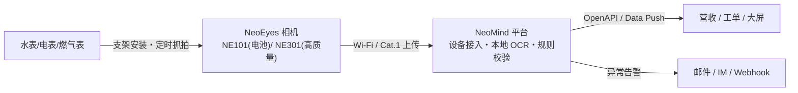

# 方案概述

水表/电表/燃气表自动抄读(AMI 替代方案):CamThink 低功耗相机定时抓拍表盘,NeoMind 平台**本地 OCR** 识别读数,经规则校验后推送到营收/运维系统,替代人工上门抄表。

## 场景与痛点

- 表计分散(楼道、泵房、井下、野外),人工抄表人力成本高、周期长
- 旧表无法换装带通信的智能表,或换表成本远超预算
- 拍照留档 + 人工录入存在抄错、漏抄,纠纷时缺少依据

## 方案架构

全链路推理在 NeoMind 主机**本地完成**(paddle-ocr-v6 `tiny` 档随扩展内置,无需 GPU、无需外网),读数与抓拍原图都保留,可追溯。

## 软硬件清单(BOM)

| 组件 | 选型 | 数量 | 说明 |
|---|---|---|---|
| 相机 | NeoEyes NE101 | 每表 1 台 | 电池供电,默认低功耗配置每日 5 拍、Wi-Fi 模式续航 2.4~6.2 年(理论值,[续航实测表](/docs/neoeyes-ne101-series/overview)) |
| 相机(可选) | NeoEyes NE301 | 每表 1 台 | 近距离供电方便、需要更高成像质量或本地推理时选型 |
| 表计支架 | NE101 水表支架(官方配件) | 每表 1 套 | 固定镜头与表盘的相对位置 |
| 平台 | NeoMind | 1 套 | Linux 主机/服务器/NG4500 均可部署 |
| OCR 扩展 | paddle-ocr-v6 | 1 个 | 市场一键安装,内置 tiny 档模型 |

## 效果与指标

- 表盘读数识别准确率可达 **99%**(以 [NE101 官方场景数据](/docs/neoeyes-ne101-series/overview)为参考,实际以现场表型与安装条件为准)
- 单表硬件成本为换装智能表的**分数级**,旧表不动、无停水施工
- 每次读数自动留档抓拍原图,纠纷可回溯

## 下一步

按左侧章节依次阅读:[硬件选型与部署](./hardware-deployment) → [模型与识别](./ai-model) → [平台配置](./platform-configuration) → [业务集成](./business-integration)。
