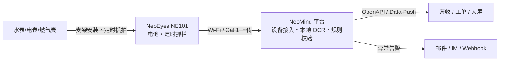

# 方案工程与价值

## 方案介绍

水表/电表/燃气表自动抄读方案:CamThink **NE101 低功耗相机**定时抓拍表盘,NeoMind 平台**本地 OCR** 识别读数,经规则校验后推送业务系统,替代人工上门抄表。

- **这是什么**:相机 + 边缘平台的仪表读数自动识别与数据化方案
- **解决什么**:表计分散、人工抄表成本高、旧表无法换智能表
- **谁会使用**:自来水公司/物业/能源运营商,以及为其做集成的方案商
- **最终效果**:读数自动入库(准确率可达 99%,以现场为准),每次读数留档抓拍原图

## 方案价值

**业务价值**
- 减少人工抄表,降低人力成本
- 提高采集效率与频次(日/周/月可调)
- 支持大规模部署:加表只加相机,平台不变

**技术价值**
- 本地 AI 推理:无需持续云端连接
- 抓拍-识别-校验全链路在本地完成,带宽占用极小
- 数据隐私:视频不出本地,仅输出结构化读数

**部署价值**
- 旧表不动、无停水施工,单表成本为换表的分数级
- 电池供电 + 免布线,无电源表井可装
- 起步配置小(≤10 表:10 台 NE101 + 1 台主机)

## 适用场景

| 场景 | 说明 |
|---|---|
| 住宅小区 | 楼道/表井分散水表,按月结算抄读 |
| 商业楼宇 | 总表/分表能耗计量与对账 |
| 工厂 | 车间水/气表能耗监测,异常发现 |
| 公用事业 | 大范围普查抄表、漏损分析 |

## 方案一览

| 项 | 说明 |
|---|---|
| 解决的问题 | 人工抄表成本高、频次低、易错漏 |
| AI 能力 | 表盘定位 + OCR 数字识别(NeoMind 本地推理) |
| 输入 / 输出 | NE101 定时抓拍图像 → 结构化读数(+原图凭证) |
| 处理位置 | Edge(平台侧本地) |
| 目标用户 | 水务/物业/能源运营商及其集成商 |
| 核心价值 | 无人化抄表 + 全量留痕可回溯 |

