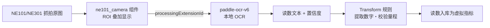

# 模型与识别

本方案推荐**平台侧识别**路线:相机只负责抓拍上传,OCR 在 NeoMind 主机本地运行——无需在端侧训练/维护模型,表型更换时只调 ROI,不动相机固件。

## 识别引擎:paddle-ocr-v6 扩展

- 市场一键安装,`tiny` 档模型随扩展内置:**无需 GPU、无需外网**,`small`/`medium` 档首次切换时才联网下载
- 面向仪表读数(水表/电表/燃气表)、数显仪表、铭牌序列号等场景优化
- 安装与配置的完整走查见 [OCR 用例:摄像头 + OCR 处理流水线](/docs/neomind/use-cases/camera-ocr)(该教程即以**水表读数**为示例场景)

## 识别流程

- **ROI(感兴趣区域)**:在仪表板组件上框选字轮区域,OCR 只识别该区域,抗背景干扰并提速
- **读数校验**:用 Transform 把 OCR 文本解析为数字,并做量程/单调性校验(读数倒退、超量程标记为异常),详见 [数据变换](/docs/neomind/user-guide/7b-data-transforms)

## 端侧推理变体(NE301)

若现场供电/网络受限、或单点表计量大,可改走 **NE301 本地推理**:用 [AI ToolStack](/docs/software/ai-tool-stack/overview) 完成 数据采集 → 标注 → YOLOv8 训练 → 量化,模型包直接刷入 NE301,端侧输出读数/定位,仅回传结构化结果。适合:

- 无稳定上行带宽(只回传数字不回传图)
- 需要分钟级高频识别(不依赖平台算力)

两条路线不互斥:同一项目可"近端 NE301 本地识别 + 远端 NE101 平台识别"混合部署。
