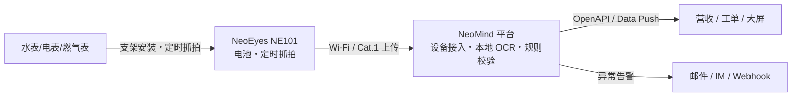

# Solution Components

## 2.1 Hardware

| Component | CamThink Product | Function |
|---|---|---|
| Camera | **NeoEyes NE101**(含官方水表支架) | 表盘定时抓拍,电池供电 |
| Edge Platform Host | NeoMind @ Linux 主机/NG4500 | 接收、OCR 推理、规则与数据出口 |
| Network | Wi-Fi / Cat.1 / Wi-Fi HaLow(模组可选) | 图像回传 |
| Power | 7.2V 高能电池(相机)/ 主机市电 | 供电 |

> 起步配置(≤10 表):每表 1 台 NE101(含支架)+ 1 台运行 NeoMind 的 Linux 主机。

## 2.2 Software

| Component | Function |
|---|---|
| AI Model | 表盘检测 + 数字 OCR(paddle-ocr-v6,tiny 档内置) |
| Inference Engine | NeoMind 扩展运行时(本地 CPU 推理,无需 GPU) |
| AI Platform | NeoMind:设备接入、仪表板、规则、Data Push/OpenAPI |
| ne101_camera 组件 | 抓拍展示 + ROI + AI 处理流水线 |
| MQTT / API | 设备上行与业务下行数据通道 |

## 2.3 Solution Architecture

