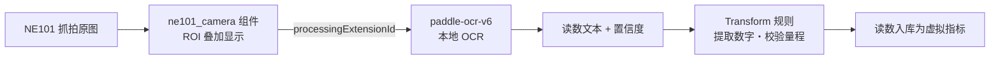

# 方案开发与扩展

## 技术规格

## 4.1 AI Model

| Item | Specification |
|---|---|
| Model | paddle-ocr-v6(检测 + 识别) |
| Task | 表盘数字 OCR(端侧平台推理) |
| Input | 抓拍图像 ROI |
| Output | 读数文本 + 置信度 |
| Framework | PaddleOCR(经 NeoMind 扩展运行) |
| Quantization | 随扩展内置档位(tiny/small/medium) |
| Accelerator | CPU(无需 GPU/NPU) |

## 4.2 AI Pipeline

## 识别流程



- **ROI(感兴趣区域)**:在仪表板组件上框选字轮区域,OCR 只识别该区域,抗背景干扰并提速
- **读数校验**:用 Transform 把 OCR 文本解析为数字,并做量程/单调性校验(读数倒退、超量程标记为异常),详见 [数据变换](/docs/neomind/user-guide/7b-data-transforms)

每一步的职责:ROI 框选抗背景干扰并提速;Transform 负责文本→数字解析与量程/单调性校验,异常读数标记不复用。

## 定制开发

**自定义模型**:更换识别扩展(市场体系)后在流水线 `processingExtensionId` 切换,相机侧零改动。

**自定义数据集**(特殊表型微调):

```text
Collect(抓拍积累) → Annotate → Train → Export → Deploy(扩展更新)
```

训练与量化工具链:[AI ToolStack](/docs/software/ai-tool-stack/overview)。

**流水线扩展**:检测定位表位 → OCR → 校验 → 结构化,各环节可插拔替换/串接。

## 性能优化指引

**AI 优化**:ROI 收紧、置信度阈值 + "连续一致"校验、tiny→small/medium 档位切换。

**系统优化**:抓拍错峰、图像保留策略(抽检样张)。

**部署优化**:大规模分域(200~500 表/主机)、Cat.1 与 Wi-Fi 分通道。

## 常见问题速查

| Problem | Possible Cause | Solution |
|---|---|---|
| 相机不在线 | 电池耗尽/网络变更 | 检查电量指示;重配网络 |
| 平台无图像 | 上行地址/凭证错误 | 核对 Webhook/MQTT 配置 |
| 识别结果为空 | ROI 未框选或过小 | 重设 ROI,覆盖完整字轮区 |
| 读数频繁跳变 | 字轮进位中间态 | 启用"连续一致"校验规则 |
| 置信度普遍偏低 | 光照/反光/污损 | 开补光、清洁表盘、调机位 |
| 业务端未收到数据 | Data Push/网络策略 | 查看 Data Push 状态与重试记录 |

更多平台侧问题见 [NeoMind 故障排查](/docs/neomind/user-guide/troubleshooting)。

## 相关资源

| 资源 | 链接 |
|---|---|
| NE101 产品文档 | [NeoEyes NE101 Series](/docs/neoeyes-ne101-series/overview) |
| NeoMind 平台文档 | [NeoMind Edge AI Platform](/docs/neomind/product-overview/what-is-neomind) |
| OCR 端到端教程 | [OCR 用例:摄像头 + OCR 流水线](/docs/neomind/use-cases/camera-ocr) |
| 模型训练工具链 | [AI ToolStack](/docs/software/ai-tool-stack/overview) |
| 平台 API | [REST API](/docs/neomind/developer-guide/rest-api) |

## 技术支持

需要方案定制、批量部署或技术对接,欢迎联系 CamThink 技术支持团队:

- **社区支持**:[Discord](https://discord.gg/a8NbPGAJw9) / [GitHub Discussions](https://github.com/camthink-ai/community/discussions)
- **商务与技术对接**:[联系我们](https://www.camthink.ai/company/contact-us/)
