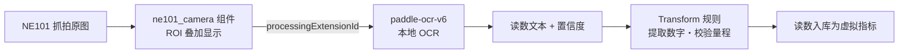

# Technical Details

## 4.1 AI Model

| Item | Specification |
|---|---|
| Model | paddle-ocr-v6(检测 + 识别) |
| Task | 表盘数字 OCR(端侧平台推理) |
| Input | 抓拍图像 ROI |
| Output | 读数文本 + 置信度 |
| Framework | PaddleOCR(经 NeoMind 扩展运行) |
| Quantization | 随扩展内置档位(tiny/small/medium) |
| Accelerator | CPU(无需 GPU/NPU) |

## 4.2 AI Pipeline

## 识别流程

- **ROI(感兴趣区域)**:在仪表板组件上框选字轮区域,OCR 只识别该区域,抗背景干扰并提速
- **读数校验**:用 Transform 把 OCR 文本解析为数字,并做量程/单调性校验(读数倒退、超量程标记为异常),详见 [数据变换](/docs/neomind/user-guide/7b-data-transforms)

每一步的职责:ROI 框选抗背景干扰并提速;Transform 负责文本→数字解析与量程/单调性校验,异常读数标记不复用。

## 4.3 Performance

| Metric | Result |
|---|---|
| Input Resolution | 随相机抓拍(可裁剪 ROI) |
| Latency | 平台侧秒级(非实时流) |
| Accuracy | 可达 99%(NE101 官方场景数据,以现场标定为准) |
| Power(相机) | 见 [NE101 续航表](/docs/neoeyes-ne101-series/overview) |

> 📝 **模板占位**:补充现场实测数据:不同表型/距离/光照下的识别率抽样。
