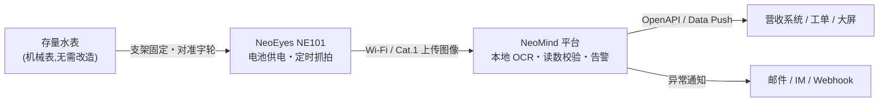

# 水表自动抄读方案

*NeoMind 仪表板:NE101 定时抓拍表盘,OCR 读数、电池状态与历史图像同屏可视*

## 方案背景

水务与物业场景中,大量水表仍是无通信功能的机械表:它们装在楼道、表井、泵房里,位置分散、环境多样。人工上门抄表不仅人力成本高、周期长,还存在抄错、漏抄和"估抄"的问题——用户对账单有异议时,往往连一张现场照片都拿不出来。

换装智能水表当然是一条路,但对存量表计而言,换表意味着停水施工、设备采购和长期运维投入,单表成本往往远超预期。

## 方案介绍

本方案的思路很简单:**不动表,给表配一双"眼睛"。**

在每块水表旁安装一台 CamThink **NeoEyes NE101** 低功耗 AI 相机(官方水表支架固定,镜头正对字轮)。相机按设定的周期自动唤醒、抓拍表盘照片,并通过 Wi-Fi 或 Cat.1 蜂窝网络将图像上传到 **NeoMind 平台**。平台在本地运行 OCR 识别引擎,把表盘读数转换为结构化数据(数值 + 时间戳 + 原图凭证),经规则校验后写入系统,并推送给营收或运维业务系统。

整个识别过程在 NeoMind 所在的服务器上**本地完成**,不需要 GPU,也不依赖外网 AI 服务。每次读数都附带抓拍原图作为凭证——用户对读数有疑问时,一张照片胜过解释。

## 方案组成

| 组成 | 选型 | 说明 |
|---|---|---|
| 抓拍 | **NeoEyes NE101**(每表 1 台,含官方水表支架) | 电池供电免布线;深度休眠 + 定时唤醒,默认日 5 拍、Wi-Fi 模式续航 2.4~6.2 年(理论值) |
| 通信 | Wi-Fi / Cat.1 / Wi-Fi HaLow(模组可换) | 近距离、偏远无网、蜂窝直连三种现场都能覆盖 |
| 平台 | NeoMind(Linux 主机 / 服务器,推荐 **NeoEdge NG4500 AI Box**) | 设备接入、本地 OCR、读数校验、告警与数据出口 |
| 识别 | paddle-ocr-v6 扩展 | 市场一键安装,内置模型,面向仪表读数优化 |

一套最小系统(≤10 块表)= 每表一台 NE101 + 一台运行 NeoMind 的主机。表计规模增长时,只需增加相机,平台不变。

## 方案特点

- **旧表零改造**:不换表、不停水,相机支架式安装,当天可完成
- **电池长期续航**:深度休眠 + 定时唤醒,按抄表周期设置频率,野外无电源表位也可部署
- **识别在本地**:OCR 在 NeoMind 主机运行,读数和图像数据不出场;模型迭代不触碰现场设备
- **全量留痕**:每条读数绑定抓拍原图,抄表争议可随时回溯
- **按需扩展**:从 10 块表到上千块表,平台架构不变

## 适用对象

- 自来水公司 / 水务集团:存量机械表的抄表自动化改造
- 物业公司:小区总表、分表的能耗与用水计量
- 工厂园区:车间水表、燃气表的能耗监测与异常发现
- 方案集成商:为水务客户交付抄表项目的整体方案
