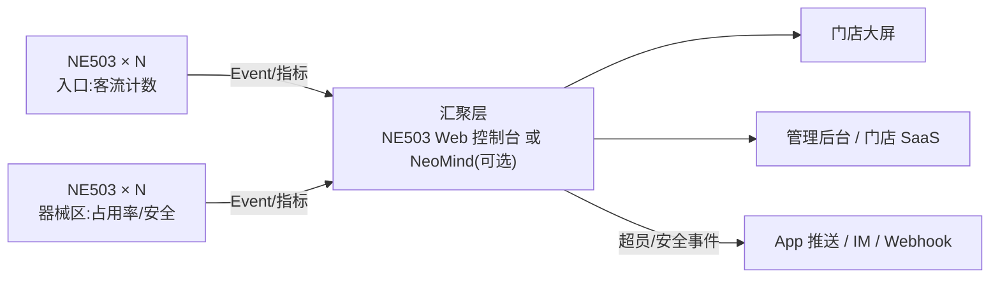

# 方案概述

智慧健身房:实时在场人数、客流趋势、器械区利用率与安全事件一屏可见,超员即时告警。**整套方案只用一款设备——NeoEyes NE503 边缘 AI 相机**,每台在设备内部完成"采集 → 20 TOPS NPU 推理 → 结构化事件输出"的完整闭环,零云端依赖、无需额外算力盒子。

## 场景与痛点

- 高峰排队、超员,前台无法实时掌握在场人数
- 器械采购与团课排期靠感觉,缺少利用率数据
- 摔倒、冲突等安全事件发现晚、响应慢
- 会员对隐私敏感,不能用云端人脸/云视频方案

## 方案架构

每台 NE503 都是自治节点:断网时本机检测与告警不中断,网络恢复后续传;单店 2~8 台起步,连锁扩容只是加设备。

## 采购清单(BOM)

| # | 采购项 | 型号/规格 | 数量 | 用途 |
|---|---|---|---|---|
| 1 | **NE503 AI 相机** | Hailo-15H · 20 TOPS · 4K · IP67 · PoE | 每出入口 1 台 + 每器械区 1~2 台 | 客流计数 / 区域占用 / 安全检测 |
| 2 | 镜头选配 | AF Lens(44.5°)近距定焦 / Motorized Zoom(110°)广域 | 随相机 | 出入口窄视角、器械区广视角 |
| 3 | PoE 交换机 | 802.3AT,端口数 = 相机数 + 1 | 1 台 | 供电 + 组网一线完成 |
| 4 | (可选)平台主机 | NeoMind(任意 Linux 主机/服务器) | 1 套 | 多店汇聚、统一 API 与告警通道;单店可不采购 |
| 5 | (可选)支架/防水配件 | 依安装环境 | 若干 | 吊装/壁装 |

> 起步配置(单店 1 出口 + 2 器械区):**3 台 NE503 + 1 台 PoE 交换机**即可上线核心功能,无需服务器。

## 方案效果

- **开箱即用**:核心应用(人员检测、区域人数统计)来自 [NE503 Verified Apps](/docs/neoeyes-ne503-series/application-guide/verified-apps),官方已验证,**下载部署即可,无需开发**
- 双向客流计数与区域占用率事件周期上报,超员响应为本地秒级
- 视频全程不出相机,仅输出数字与事件,天然满足隐私合规

## 下一步

[硬件选型与部署](./hardware-deployment) → [模型与应用](./ai-model) → [平台配置](./platform-configuration) → [业务集成](./business-integration)。
