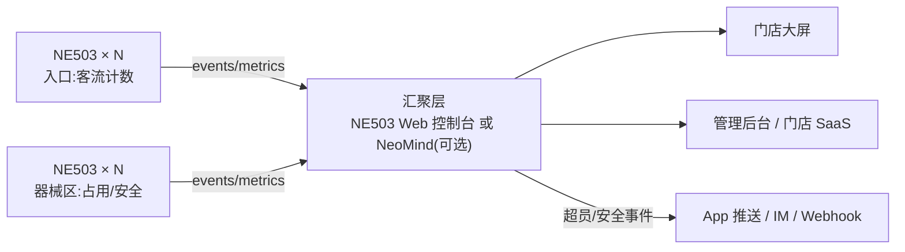

# 方案工程与价值

## 方案介绍

智慧健身房方案:**整套方案只用一款设备——NeoEyes NE503 边缘 AI 相机**(Hailo-15H · 20 TOPS · IP67 · PoE)。每台在设备内完成"采集 → NPU 推理 → 结构化事件输出"闭环:实时在场人数、客流趋势、器械区利用率与安全事件告警,零云端依赖、无需额外算力盒子。

- **这是什么**:基于端到端 AI 相机的门店运营感知方案
- **解决什么**:超员看不见、利用率没数据、安全事件发现晚
- **谁会使用**:连锁/单体健身房运营方、门店 SaaS 服务商
- **最终效果**:大屏实时在场人数、利用率报表、安全事件秒级通知

## 方案价值

**业务价值**:高峰限流有依据,改善会员体验;器械采购与团课排期基于利用率数据;安全事件快速响应,降低经营风险。

**技术价值**:单机端到端(采集→推理→事件全在相机内);零云端依赖,视频不出店,隐私合规友好;20 TOPS 多模型并发,一台覆盖一个区域。

**部署价值**:IP67 + PoE 单线安装;核心应用官方已验证,下载部署零开发;起步 3 台相机 + 1 台 PoE 交换机,无服务器。

## 适用场景

| 场景 | 说明 |
|---|---|
| 健身房/工作室 | 在场人数限流、器械利用率、安全告警 |
| 连锁门店 | 多店统一运营看板与告警 |
| 运动场馆 | 分区域人流热度与滞留发现 |
| 零售(延伸) | 门口客流与区域热度同构复用 |

## 方案一览

| 项 | 说明 |
|---|---|
| 解决的问题 | 超员/利用率/安全事件均无数据支撑 |
| AI 能力 | 人员检测 + 区域占用统计(端侧 NPU) |
| 输入 / 输出 | 各点位 4K 视频流 → 在场/占用率/安全事件(结构化) |
| 处理位置 | Edge(相机内) |
| 目标用户 | 门店运营/连锁管理/SaaS 服务商 |
| 核心价值 | 一款设备闭环,隐私合规的运营数据 |

