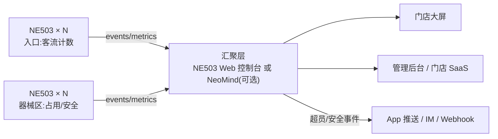

# Solution Components

## 2.1 Hardware

| Component | CamThink Product | Function |
|---|---|---|
| AI Camera(入口) | **NeoEyes NE503**(AF 44.5°) | 客流计数 |
| AI Camera(器械区) | **NeoEyes NE503**(Motorized Zoom 110°) | 区域占用/安全检测 |
| Network | PoE 交换机(802.3AT) | 单线供电组网 |
| Platform Host(可选) | NeoMind @ Linux 主机 | 多店/多机汇聚 |

> 起步配置(1 入口 + 2 器械区):**3 × NE503 + 1 × PoE 交换机**,无需服务器。

## 2.2 Software

| Component | Function |
|---|---|
| AI Model | hailo_yolov8n_384_640(检测) |
| App:Occupancy Monitor | 区域人数统计 + 占用率周期上报(Verified App) |
| App:Person Detection | 人员出现事件 + 告警联动(Verified App) |
| AI Platform | NE503 容器化应用管理 + Web 控制台;(可选)NeoMind 汇聚 |
| Event Bus / Webhook / MQTT | 事件与指标下行通道 |

## 2.3 Solution Architecture

