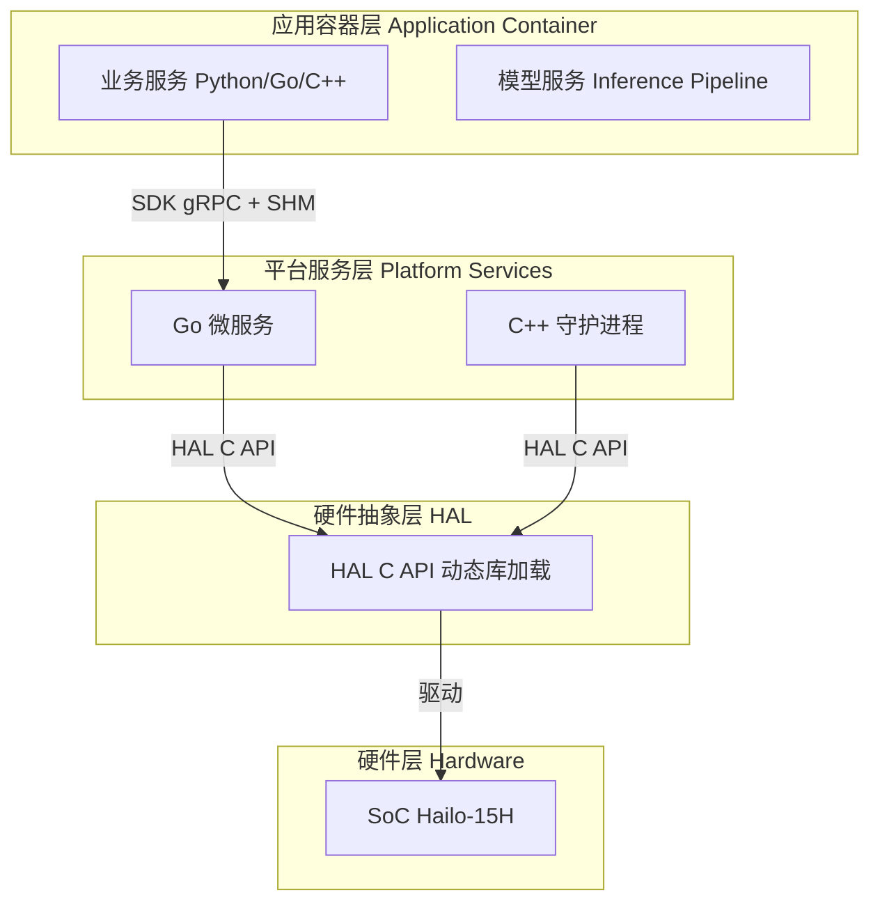
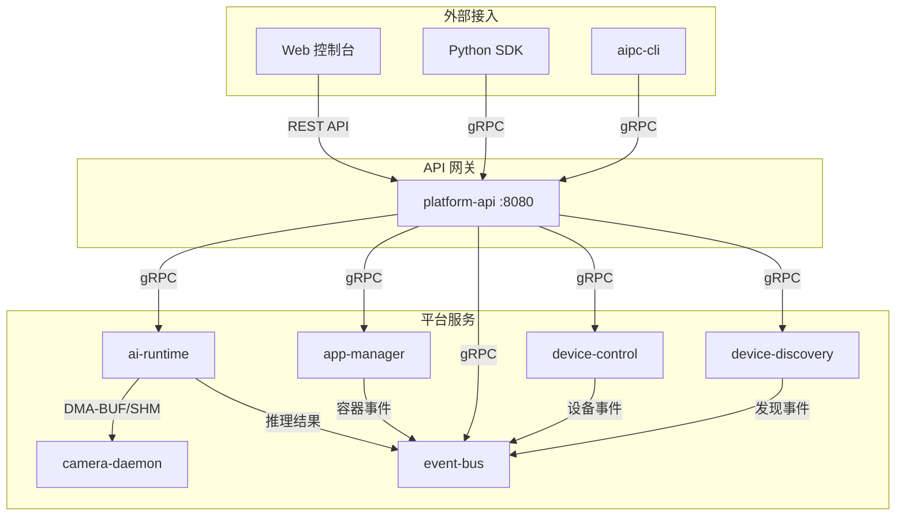
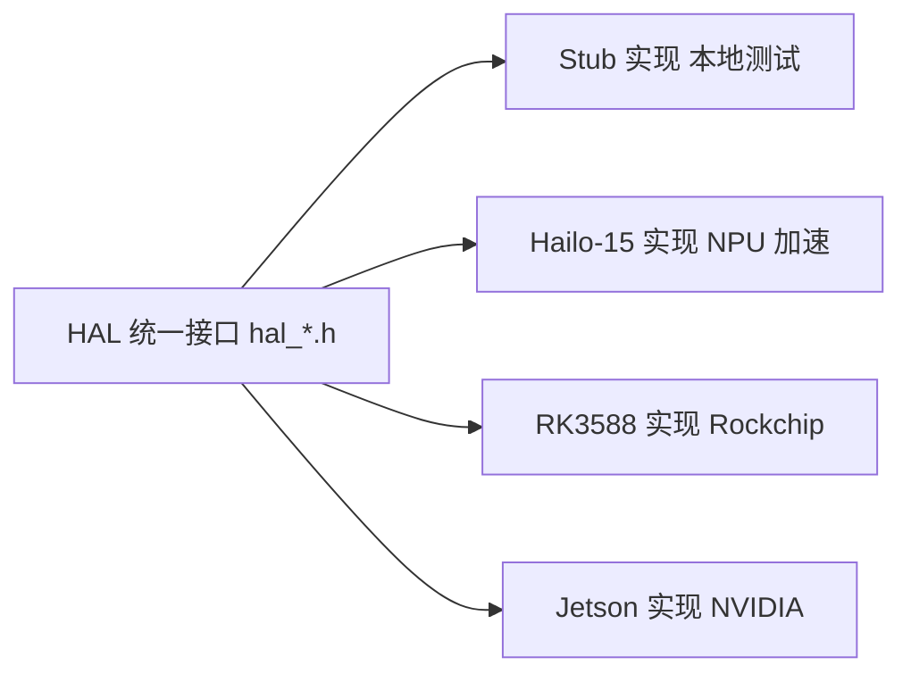
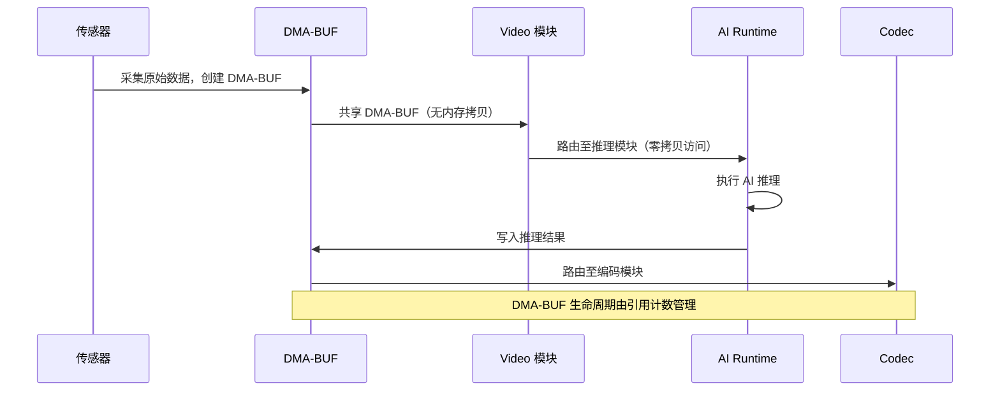

# Platform Architecture

NE503 AIPC（AI IPC）平台是一个面向边缘 AI 计算的完整软件栈，采用四层分层架构设计，支持多 SoC 平台（Hailo-15 / RK3588 / Jetson）通过硬件抽象层实现平滑迁移。本文档详细介绍平台各层架构、核心服务、数据流和安全模型。

## 1. 四层架构总览



| 层级 | 职责 | 技术 |
|:---|:---|:---|
| 应用容器层 | 第三方 AI 应用、模型推理管线 | Python/Go/C++，容器化运行 |
| 平台服务层 | 摄像头管理、AI 推理、容器管理、事件分发、设备控制、API 网关、设备发现 | Go 微服务 + C++ 守护进程 |
| 硬件抽象层 | 统一硬件接口，解耦平台服务与 SoC | C/C++ 函数指针表（Ops），DMA-BUF 零拷贝 |
| 硬件层 | SoC、NPU、ISP、传感器、MCU | Hailo-15H（当前）、RK3588 / Jetson（可扩展） |

---

## 2. 平台服务层

平台服务层包含 7 个微服务，通过 gRPC over Unix Domain Socket 进行内部通信。

### 2.1 服务总览

| 服务 | 语言 | 监听地址 | 职责 |
|:---|:---|:---|:---|
| **ai-runtime** | Go | `unix:///run/aipc/ai-runtime.sock` | AI 模型管理与推理调度，NPU 资源分配，GenAI 流式推理 |
| **app-manager** | Go | `unix:///run/aipc/app-manager.sock` | 容器应用生命周期管理（安装/启动/停止/卸载），基于 containerd |
| **event-bus** | Go | `unix:///run/aipc/event-bus.sock` + TCP `127.0.0.1:50053` | 发布/订阅消息总线，MQTT 风格通配符匹配 |
| **device-control** | Go | `unix:///run/aipc/device-control.sock` | 硬件外设控制（灯光/PTZ/镜头/GPIO），MCU UART 通信 |
| **device-discovery** | Go | `unix:///run/aipc/device-discovery.sock` | 网络设备发现（CT-Disc 协议），设备注册与状态管理 |
| **platform-api** | Go | `:8080` | HTTP/RESTful API 网关，代理所有后端 gRPC 服务 |
| **camera-daemon** | C++ | `camera.sock` + `camera-control.sock` | 视频采集、双通道帧分发（FD/SHM）、编码、RTSP 流媒体 |

### 2.2 服务依赖关系



### 2.3 gRPC API 定义

平台通过 7 个 Protocol Buffers 文件定义所有 gRPC 接口：

| Proto 文件 | 服务 | 核心操作 |
|:---|:---|:---|
| `inference.proto` | AI 推理 | RegisterModel / UnregisterModel / ListModels / GetModelInfo / Infer / StreamInfer / CreateSession / DestroySession / GetStats |
| `app.proto` | 容器管理 | InstallApp / StartApp / StopApp / UninstallApp / ListApps / GetApp / GetAppStats / GetAppLogs |
| `event.proto` | 事件总线 | Publish / PublishBatch / Subscribe / Unsubscribe / ListTopics / GetTopicStats（支持 `*` 通配符） |
| `device.proto` | 设备控制 | SetWhiteLight / SetIrLed / SetIrCut / Pan / Tilt / PTZStop / SavePreset / CallPreset / Zoom / Focus / SetAutofocus / GPIOWrite / GPIORead / GetDeviceStatus / SubscribeEvents |
| `camera.proto` | 摄像头管理 | 视频采集管道、RTSP 流媒体、OSD 叠加 |
| `lens_hal.proto` | 镜头控制 | Zoom / Focus / SetAutofocus（HAL 桥接） |

> `lens_hal.proto` 是 `device.proto` 中镜头控制部分的具体实现协议，二者为同一功能的不同抽象层级。

| `discovery.proto` | 设备发现 | CT-Disc 协议设备发现、注册、状态管理 |

---

## 3. 硬件抽象层（HAL）

HAL 层通过**函数指针表（Ops）** 模式实现运行时动态加载不同平台实现，使上层平台服务无需修改即可适配不同 SoC。

### 3.1 HAL v1 接口

| 头文件 | 核心结构体 | 用途 |
|:---|:---|:---|
| `hal_video.h` | `HalVideoOps` | 视频采集 |
| `hal_ml.h` | `HalMLOps` | AI 推理加速 |
| `hal_codec.h` | `HalCodecOps` | 视频编码（H.264/H.265）+ OSD |
| `hal_io.h` | `HalIOOps` | MCU 外设控制 |
| `hal_buffer.h` | `HalFrameBuffer` | 统一帧缓冲（跨模块共享） |
| `hal_ml_post.h` | `HalMLPostOps` | 推理后处理 |
| `hal_ml_overlay.h` | `HalMLOverlayOps` | AI 结果叠加渲染 |

### 3.2 HAL v1 vs v2

| 特性 | HAL v1（`hal/`） | HAL v2（`hal_v2/`） |
|:---|:---|:---|
| 结构 | 扁平化，按功能文件组织 | 模块化，按组件目录组织 |
| 接口 | 直接函数调用 | 操作表（Ops 结构体） |
| 媒体 | 基础视频采集/编码 | 完整管道（隐私遮罩、数字变焦、防抖） |
| AI | 基础推理 | 推理 + 后处理 + GenAI（LLM/VLM） |
| DSP | 无 | 图像处理、格式转换、隐私遮罩 |
| 构建 | CMake 单目标 | 支持单库/模块化构建 |

HAL v2 核心接口：

| 接口 | 头文件 | 功能 |
|:---|:---|:---|
| 媒体管道 | `hal_media.h` | Profile 切换、动态参数、隐私遮罩、运行时码流增删 |
| AI 推理 | `hal_model.h` | 模型推理与后处理 |
| GenAI | `hal_genai.h` | LLM/VLM 流式生成，自定义停止词和上下文管理 |
| DSP | `hal_dsp.h` | 裁剪、缩放、格式转换、隐私遮罩、防抖 |
| 外设 | `hal_mcu.h` | 通用 MCU 通信接口 |

### 3.3 核心数据结构：HalFrameBuffer

```c
typedef struct {
    uint64_t sequence, timestamp_ns;
    uint32_t width, height;
    HalPixelFormat format;          // NV12, RGB24 等
    HalFrameMemoryType memory_type; // DMA_BUF 或 CPU_MEMORY
    int      dma_fds[3];            // DMA-BUF fd（零拷贝）
    uint8_t *planes[3];             // CPU 指针
    uint32_t strides[3], sizes[3];
    void    *priv;                  // 引用计数 + 平台私有数据
} HalFrameBuffer;
```

`HalFrameBuffer` 支持引用计数（`hal_frame_buffer_ref` / `hal_frame_buffer_release`），视频→AI→编码模块可共享同一 DMA-BUF 而无需内存拷贝。

### 3.4 多平台支持



当前实现：Hailo-15（完整）+ Stub（测试）。RK3588 和 Jetson 通过 HAL 移植指南可扩展支持。

---

## 4. SDK 层

### 4.1 Python SDK 模块

Python SDK（`hailo_ipc_sdk`）提供 8 个核心模块：

| 模块 | 类 | 功能 |
|:---|:---|:---|
| `inference` | `InferenceClient` | AI 推理（单次 / 流式 / 会话管理） |
| `media` | `FdMediaClient` | 零拷贝视频流获取 |
| `events` | `EventClient` | 事件总线发布/订阅 |
| `device` | `DeviceClient` | 设备控制（灯光/PTZ/镜头/GPIO） |
| `app` | `AppClient` | 应用生命周期管理 |
| `plugin` | `PluginDiscovery` / `PluginServer` | 插件发现与服务 |
| `overlay` | `OverlayClient` | AI 结果叠加 |
| `config` | `Config` | 配置管理 |

### 4.2 通信协议

| SDK 模块 | 通信方式 | 说明 |
|:---|:---|:---|
| InferenceClient | gRPC over Unix Socket | 通过 platform-api 代理 |
| FdMediaClient | Shared Memory (SHM) + gRPC | 零拷贝帧传输 |
| EventClient | gRPC over Unix Socket | 支持通配符订阅 |
| DeviceClient | gRPC over Unix Socket | 通过 platform-api 代理 |

### 4.3 快速示例

```python
from hailo_ipc_sdk import InferenceClient, EventClient

# AI 推理
with InferenceClient() as inf:
    result = inf.infer(image, model_id="person_v1")

# 事件发布
events = EventClient()
events.publish("app/alert", {"type": "person_detected"})
```

---

## 5. Web 控制台

Web 控制台基于 React 19 + TypeScript + Vite 构建，提供设备管理、视频监控、AI 模型管理、应用管理、系统监控等功能。

| 技术栈 | 组件 |
|:---|:---|
| 框架 | React 19 + TypeScript |
| 构建 | Vite |
| 状态管理 | Zustand |
| 数据获取 | TanStack Query |
| UI 组件 | shadcn/ui + Radix |
| 测试 | Vitest |

Web 控制台通过 REST API 和 WebSocket 与 platform-api 通信，实时推送 AI 推理结果和设备事件。访问地址：`http://<设备IP>:8080`。

---

## 6. 容器隔离与安全

NE503 采用多层纵深防御架构，核心原则：最小权限、访问路径收敛、显式授权。

### 6.1 安全分层模型

```
┌──────────────────────────────────────────────┐
│          应用容器层                            │
│   Namespaces / Seccomp / Capabilities        │
│   Cgroup / ReadOnly Rootfs                   │
└────────────────┬─────────────────────────────┘
                  │ gRPC over Unix Socket（组权限控制）
┌────────────────┴─────────────────────────────┐
│          平台服务层                            │
│   认证 / 权限收敛 / 审计日志                   │
└────────────────┬─────────────────────────────┘
                  │ HAL C API
┌────────────────┴─────────────────────────────┐
│          硬件层                                │
│   TrustZone / Secure Boot                     │
└──────────────────────────────────────────────┘
```

### 6.2 容器隔离机制

**Linux Namespaces**（5 项默认启用）：

| Namespace | 隔离范围 | 效果 |
|:---|:---|:---|
| PID | 进程 ID | 容器进程无法看到宿主进程 |
| NET | 网络栈 | 默认无网络（`none` 模式） |
| IPC | System V IPC / POSIX 消息队列 | 进程间通信隔离 |
| UTS | 主机名 | 容器拥有独立主机名 |
| MOUNT | 文件系统挂载 | 独立文件系统视图 |

**Capabilities**：默认移除所有危险 Linux 能力：

| 能力 | 说明 |
|:---|:---|
| `CAP_SYS_ADMIN` | 系统管理 |
| `CAP_NET_ADMIN` | 网络管理 |
| `CAP_SYS_MODULE` | 内核模块加载 |
| `CAP_SYS_TIME` | 系统时间修改 |
| `CAP_SYS_BOOT` | 系统重启 |
| `CAP_SYS_RAWIO` | 原始 I/O 端口访问 |
| `CAP_SYS_PTRACE` | 进程追踪 |
| `CAP_SYS_CHROOT` | chroot 切换 |
| `CAP_MKNOD` | 设备节点创建 |

**Seccomp BPF**：通过系统调用白名单限制可用系统调用，默认配置约 200+ 个安全系统调用。被阻止的危险调用包括：

| 类别 | 被阻止的系统调用 |
|:---|:---|
| 文件系统 | `mount` / `umount` / `swapon` / `swapoff` |
| 系统 | `reboot` / `kexec_load` |
| 内核 | `init_module` / `delete_module` |
| 硬件 | `iopl` / `ioperm` |
| 进程 | `ptrace`（部分限制） |
| 密钥 | `keyctl` / `add_key` / `request_key` |

> **实现状态**：Seccomp 配置文件已定义并经过验证，当前代码中实际加载和应用仍在实现中（`implementation pending`）。

**Cgroups 资源限制**：

| 资源 | 默认值 |
|:---|:---|
| CPU | 50% 单核 |
| 内存 | 256MB |
| 进程数 | 128 |

**文件系统**：只读根文件系统 + No New Privileges（禁止提权）+ 仅挂载声明的目录。

### 6.3 访问路径收敛

所有资源访问必须经过平台服务，容器无法直接访问硬件：

| 资源 | 访问路径 |
|:---|:---|
| 视频流 | → camera-daemon SHM |
| AI 推理 | → ai-runtime gRPC |
| 外设控制 | → device-control gRPC |
| 事件消息 | → event-bus gRPC |

Unix Socket 权限通过 Linux 组（AIPC group GID）控制，仅在容器启动时自动注入 Main 容器，Sub 容器无法访问任何 Socket。

### 6.4 声明式权限模型

应用通过 `app.yaml` 的 `permissions` 字段声明所需权限，未声明的权限默认不可访问：

```yaml
permissions:
  video: [cam0_main.raw]           # 视频流访问
  inference:
    models: [person_v1]             # 可用模型
    max_qps: 30
  events:
    publish: [app/myapp/*]          # 可发布主题
    subscribe: [model/*/detections] # 可订阅主题
  device:
    light: true
    ptz: false
  network:
    outbound: [https://api.example.com]
```

### 6.5 网络安全

| 模式 | 说明 |
|:---|:---|
| **Isolated (internal)（默认）** | 无网络访问，仅通过 SDK 与平台服务通信（app.yaml 中 `isolated` / `internal` 对应系统配置 `none` 模式） |
| **Bridge（仅多容器模式）** | 通过 `aipc-br0` 网桥接入，DNS 默认 `8.8.8.8`（可配），出站白名单控制 |
| **Host** | 共享宿主机网络栈，可直接访问外部网络 |

> 单容器应用支持 `isolated` 和 `host` 两种模式；多容器应用支持 `internal`、`bridge` 和 `host` 三种模式。其中 `isolated` 和 `internal` 均对应系统配置层的 `none` 模式（隔离容器网络），命名因历史原因在不同配置层级中有所不同。

Platform API 支持可选的 Bearer Token（JWT）认证，公开端点仅 `/api/login` 和 `/api/v1/system/health`。WebSocket 通过 query parameter 传递 token。

### 6.6 多容器安全边界

| 角色 | 权限 |
|:---|:---|
| **Main 容器** | 获得平台 Socket 访问权限（AIPC group GID），可调用 AI 推理、事件总线等 |
| **Sub 容器** | 完全隔离，无法访问任何平台服务，仅通过共享网络命名空间与 Main 容器内部通信 |

### 6.7 安全配置文件

| 配置文件 | 安全用途 |
|:---|:---|
| `security/seccomp-default.json` | 默认 Seccomp 系统调用白名单 |
| `platform/app-manager.yaml` | 容器安全策略（Capabilities、资源限制） |
| `platform-api.yaml` | API 认证密钥、JWT 配置 |
| `platform/event-bus.yaml` | 主题 ACL 访问控制 |

### 6.8 审计与监控

- 所有 API 调用被记录（操作日志）
- 容器资源使用实时监控（CPU / 内存 / 进程数）
- 事件日志系统分类：操作、安全、告警、系统
- 自动熔断：健康检查失败触发自动重启（backoff 策略）

---

## 7. 关键技术特性

### 7.1 零拷贝优化



核心机制：
- `HalFrameBuffer` 通过 `dma_fds[]` 传递 DMA-BUF 文件描述符，视频→AI→编码全程零拷贝
- 引用计数管理帧生命周期（`hal_frame_buffer_ref` / `hal_frame_buffer_release`）
- AI Runtime 与 Camera Daemon 之间通过 `SCM_RIGHTS` 传递 FD（无需内存拷贝）

### 7.2 gRPC over Unix Socket

所有平台服务间通信使用 gRPC over Unix Domain Socket：

| 特性 | 说明 |
|:---|:---|
| 传输层 | Unix Domain Socket（本地进程间通信） |
| 协议 | gRPC（HTTP/2 framing） |
| 安全性 | Linux 文件系统权限 + 组权限控制 |
| 性能 | 低延迟（绕过 TCP/IP 栈），高吞吐 |

### 7.3 事件驱动架构

Event Bus 采用发布/订阅模式，支持 MQTT 风格通配符匹配：

| 模式 | 说明 | 示例 |
|:---|:---|:---|
| 精确匹配 | 完全匹配主题名 | `app/myapp/status` |
| `*` 单级通配 | 匹配一个层级 | `app/*/status` |
| `**` 多级通配 | 匹配多个层级 | `model/**/detections` |

所有服务产生的推理结果、容器事件、设备事件均通过 Event Bus 分发，第三方应用通过 SDK 的 `EventClient` 订阅感兴趣的主题。

### 7.4 容器化应用平台

- 基于 containerd 运行时，OCI 标准镜像部署
- 多容器支持（Main + Sub），插件化依赖解析
- 健康检查系统（Command / HTTP / TCP，指数退避策略）
- 自动重启（故障时 backoff 策略）

---

## 8. 配置系统

平台使用 YAML 配置文件管理所有服务参数，配置文件位于 `configs/` 目录：

| 配置文件 | 服务 | 核心配置项 |
|:---|:---|:---|
| `platform-api.yaml` | platform-api | 服务器端口、认证密钥、日志级别 |
| `platform/app-manager.yaml` | app-manager | containerd 连接、安全策略、资源限制 |
| `platform/event-bus.yaml` | event-bus | Socket 路径、TCP 监听、主题 ACL |
| `platform/device-control.yaml` | device-control | MCU UART 设备、镜头参数、自动化规则 |
| `platform/camera-daemon.yaml` | camera-daemon | 视频采集、编码参数、RTSP 配置 |
| `platform/discovery.yaml` | device-discovery | CT-Disc 协议参数 |
| `ai/ai-runtime.yaml` | ai-runtime | HAL 库路径、模型仓库、调度器、自动推理管道 |
| `security/seccomp-default.json` | 安全 | 默认 Seccomp 系统调用白名单 |

安装位置：`/opt/aipc/`（二进制 `bin/`、配置 `etc/`）。

---

## 9. 相关文档

- [应用开发指南](../4-application-development/1-app-reference.md) — 如何编写和部署容器应用
- [Python SDK 参考](../4-application-development/2-sdk-reference.md) — SDK API 签名与使用示例
- [RESTful API 参考](../5-system-integration/1-restful-api.md) — HTTP API 端点完整参考
- [AI 推理服务](../6-reference/service-reference/0-ai-runtime.md) — AI Runtime 深度解析
- [容器应用管理](../6-reference/service-reference/1-app-manager.md) — App Manager 深度解析
- [配置文件参考](../6-reference/3-config-reference.md) — 所有配置文件详细参数
