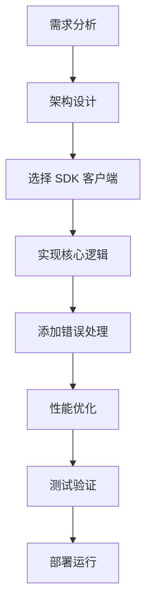

# SDK Examples

本文提供基于 `hailo_ipc_sdk` 的完整应用示例，从最基础的连接测试到复杂的多场景联动，帮助开发者快速掌握 NE503 平台的应用开发模式。SDK API 详情请参阅 [Python SDK Reference](./2-sdk-reference.md)。

## 1. 快速开始

`hello-world` 是最简单的示例，验证 SDK 连接和基础 API 调用是否正常：

```python
# apps/hello-world/main.py
from hailo_ipc_sdk import InferenceClient, DeviceClient, EventClient, Event

def main():
    # 连接各服务客户端
    inference = InferenceClient()
    device = DeviceClient()
    events = EventClient()

    # 获取设备状态
    status = device.get_device_status()
    print(f"Device status: {status}")

    # 列出可用模型
    models = inference.list_models()
    print(f"Available models: {len(models)}")

    # 发布测试事件
    events.publish("hello/world", {"message": "Hello from AIPC!"})

if __name__ == "__main__":
    main()
```

运行后若能正常打印设备状态和模型数量，说明 SDK 环境配置正确。

## 2. SDK 示例架构

SDK 示例采用三层架构设计：

| 层级 | 职责 | 典型客户端 |
|------|------|-----------|
| **基础层** | 客户端连接与基础 API 调用 | `InferenceClient`, `DeviceClient`, `EventClient` |
| **业务层** | 具体业务逻辑实现 | 事件订阅、边界检测、人数统计 |
| **集成层** | 多服务协作与复杂工作流 | 推理 + 设备控制联动、多路视频处理 |

数据流方向遵循 **输入 -> 处理 -> 输出** 的统一模式，支持同步和异步两种处理方式。每个示例都是模块化的，可独立运行也可组合使用。

## 3. 事件订阅与联动

`EventSubscriberApp` 演示如何订阅多个事件主题并执行联动控制：

```python
class EventSubscriberApp:
    def __init__(self):
        self.events = EventClient()
        self.device = DeviceClient()
        self.subscriptions = []
        self.app_id = "event_subscriber"

    def run(self):
        # 订阅多个主题，每个主题绑定独立回调
        topics = [
            ("model/*/detections", self._on_detection),
            ("app/*/alert", self._on_alert),
            ("system/device/**", self._on_system_event),
        ]
        for topic, callback in topics:
            thread = self.events.on_event(topic, callback)
            self.subscriptions.append(thread)

    def _on_detection(self, event: Event):
        """检测到人员时自动开灯"""
        if "person" in str(event.payload).lower():
            self.device.set_white_light(80)

    def _on_alert(self, event: Event):
        """收到告警后发布确认消息"""
        self.events.publish(f"app/{self.app_id}/alert_ack", {
            "original_topic": event.topic,
            "acknowledged": True
        }, persistent=True)
```

**关键点**：主题支持通配符（`*` 单级匹配、`**` 多级匹配），`persistent=True` 确保事件持久化。

运行方式：

```bash
python examples/event_subscriber.py
# 调试模式
python examples/event_subscriber.py --debug
```

预期输出：

```
[security-monitor] Subscribed to: model/*/detections
[security-monitor] Subscribed to: app/*/alert
[detection] Detection event: model/cam0_main/detections
  Payload: {"objects": [{"label": "person", "score": 0.9}]}
[security-monitor] Person detected! Light turned ON
```

## 4. 周界防护系统

`PerimeterGuardApp` 实现人员越界检测与联动告警，核心逻辑包含**边界检测 + 联动控制 + 防抖**三个环节：

```python
class PerimeterGuardApp:
    def __init__(self):
        self.inference = InferenceClient()
        self.events = EventClient()
        self.device = DeviceClient()
        self.app_id = "perimeter_guard"

        # 防护参数
        self.alert_cooldown = 5.0          # 告警冷却时间（秒）
        self.last_alert_time = 0
        self.detection_line = (0.3, 0.7)   # 防护线坐标（归一化）
        self.light_on = False
        self.light_timeout = 10.0          # 灯光超时（秒）

    def run(self):
        for frame_seq, result in self.inference.subscribe(
            stream="cam0_main", model="person_v1", fps=15
        ):
            self._process_frame(frame_seq, result)
            self._update_device_state()

    def _process_frame(self, frame_seq: int, result: InferenceResult):
        persons = result.get_objects_by_label("person")
        # 筛选越界人员
        crossed = [p for p in persons if self._is_crossing_line(p)]

        if crossed and time.time() - self.last_alert_time >= self.alert_cooldown:
            self._trigger_alert(frame_seq, crossed)
            self.last_alert_time = time.time()

    def _is_crossing_line(self, person: DetectedObject) -> bool:
        """判断目标中心点是否越过防护线"""
        cx = person.bbox.x + person.bbox.width / 2
        cy = person.bbox.y + person.bbox.height / 2
        return cx > self.detection_line[0] and cy > self.detection_line[1]

    def _trigger_alert(self, frame_seq: int, persons: list):
        """发布持久化告警事件"""
        self.events.publish(f"app/{self.app_id}/perimeter_alert", {
            "type": "boundary_crossing",
            "frame_sequence": frame_seq,
            "person_count": len(persons),
            "confidence": [p.score for p in persons]
        }, persistent=True)
```

运行方式：

```bash
python examples/perimeter_guard.py
# 自定义防护线坐标
python examples/perimeter_guard.py --detection-line 0.4,0.8
# 自定义灯光超时
python examples/perimeter_guard.py --light-timeout 15
# 调试模式
python examples/perimeter_guard.py --debug --verbose
```

预期输出：

```
[perimeter-guard] Perimeter Guard App initialized
[inference] Frame 100: 1 objects detected
[perimeter-guard] 1 person(s) crossing the boundary
[ALERT] 1 person(s) crossed the boundary!
[perimeter-guard] Light turned ON

After 10 seconds...
[perimeter-guard] Light turned OFF

[inference] Frame 250: 2 objects detected
[perimeter-guard] 2 person(s) crossing the boundary
[ALERT] 2 person(s) crossed the boundary!
```

## 5. 人员检测与统计

`PersonDetectionApp` 实现实时检测、人数统计与异常告警：

```python
class PersonDetectionApp:
    def __init__(self):
        self.inference = InferenceClient()
        self.events = EventClient()
        self.alert_threshold = 5              # 人数告警阈值
        self.current_persons = 0
        self.person_history = []              # 滑动窗口统计
        self.app_id = "person_detection"

    def run(self):
        for frame_seq, result in self.inference.subscribe(
            stream="cam0_main", model="person_detection", fps=30
        ):
            self._process_detection(frame_seq, result)
            self._update_statistics()
            self._check_anomalies()

    def _process_detection(self, frame_seq: int, result: InferenceResult):
        """处理检测结果，发布高置信度人员事件"""
        persons = result.get_objects_by_label("person")
        self.current_persons = len(persons)

        for person in persons:
            if person.score > 0.8:
                self.events.publish(f"app/{self.app_id}/person_detected", {
                    "frame": frame_seq,
                    "id": person.track_id if hasattr(person, 'track_id') else None,
                    "confidence": person.score,
                    "bbox": person.bbox.to_xywh(),
                    "timestamp": time.time()
                })

    def _check_anomalies(self):
        """检测人群聚集等异常行为"""
        if self.current_persons > self.alert_threshold:
            self.events.publish(f"app/{self.app_id}/population_alert", {
                "count": self.current_persons,
                "threshold": self.alert_threshold
            })

    def _update_statistics(self):
        """滑动窗口统计：保留最近 1 分钟数据"""
        self.person_history.append({
            "timestamp": time.time(),
            "count": self.current_persons
        })
        cutoff_time = time.time() - 60
        self.person_history = [
            h for h in self.person_history
            if h["timestamp"] > cutoff_time
        ]
```

**关键逻辑**：
- 仅发布置信度 > 0.8 的高质量检测结果
- 通过 `alert_threshold` 控制异常告警灵敏度
- `person_history` 维护滑动窗口用于趋势分析

运行方式：

```bash
python examples/person_detection.py
# 自定义告警阈值
python examples/person_detection.py --alert-threshold 10
# 禁用可视化叠加
python examples/person_detection.py --no-overlay
# 保存检测数据
python examples/person_detection.py --output logs/detection.json
```

预期输出：

```
[person-detection] Person Detection App initialized
[person-detection] Starting detection...

[person-detection] Frame 150: 2 persons detected
[person-detection] -> Person #1: confidence=0.92, bbox=[100,200,50,80]
[person-detection] -> Person #2: confidence=0.87, bbox=[300,250,60,90]

[person-detection] Frame 200: 5 persons detected
[person-detection] Population alert! Current: 5, Threshold: 5

[person-detection] Statistics:
  - Current persons: 5
  - Average per minute: 12.5
```

## 6. 视频流处理

`VideoProcessorApp` 演示多线程视频处理管线，支持运动检测、目标检测和场景分析：

```python
class VideoProcessorApp:
    def __init__(self):
        self.inference = InferenceClient()
        self.processing_queue = queue.Queue(maxsize=10)

        # 处理开关
        self.enable_motion = True
        self.enable_object_detection = True

    # 注意：以下示例为简化代码，实际应用中需从 frame 序列中获取图像数据
    def run(self):
        # 启动处理线程
        threading.Thread(target=self._process_frames, daemon=True).start()

        # 主线程接收视频流，入队处理
        # 注意：subscribe 返回 (frame_seq, InferenceResult)，不包含原始图像帧。
        # 以下 frame_data 实际类型为 InferenceResult，不可直接传给 OpenCV。
        # 若需获取原始帧，请使用 FdMediaClient.subscribe_raw()。
        for frame_seq, frame_data in self.inference.subscribe(
            stream="cam0_main", model="yolov8n"
        ):
            try:
                self.processing_queue.put_nowait((frame_seq, frame_data))
            except queue.Full:
                pass  # 队列满时丢弃当前帧

    def _process_frames(self):
        """帧处理线程：运动检测 + 目标检测"""
        while True:
            frame_seq, frame_data = self.processing_queue.get()
            start = time.time()

            # 运动检测
            if self.enable_motion:
                motion_score = self._detect_motion(frame_data)
                if motion_score > 0.5:
                    # 标记运动区域
                    pass

            # 目标检测
            if self.enable_object_detection:
                result = self.inference.infer(
                    model_id="object_detection", image=frame_data
                )

            # 每 100 帧输出性能统计
            if frame_seq % 100 == 0:
                elapsed = time.time() - start
                print(f"Frame {frame_seq}: {elapsed:.3f}s")

    def _detect_motion(self, frame_data) -> float:
        """帧差法运动检测，返回运动评分 0~1"""
        gray = cv2.cvtColor(frame_data, cv2.COLOR_BGR2GRAY)
        if hasattr(self, "prev_frame"):
            diff = cv2.absdiff(self.prev_frame, gray)
            score = np.mean(diff) / 255.0
        else:
            score = 0
        self.prev_frame = gray
        return score
```

**关键设计**：
- **生产者-消费者模式**：主线程接收帧并入队，工作线程异步处理
- **背压控制**：`Queue(maxsize=10)` 限制内存占用，满时丢弃而非阻塞
- **帧差法**：轻量级运动检测，无需额外 AI 模型

运行方式：

```bash
python examples/video_processor.py
# 自定义输出流
python examples/video_processor.py --output-stream rtsp://localhost:8554/output
# output stream URL（示例路径，实际使用需根据 RTSP 服务配置调整）
# 仅启用运动检测和目标检测
python examples/video_processor.py --motion-detection --object-detection
# 保存处理结果
python examples/video_processor.py --save processed_videos/
```

预期输出：

```
[video-processor] Video Processor App initialized
[video-processor] Starting processing...

[video-processor] Frame 1000 processed
  - Motion score: 0.23
  - Objects detected: 2
  - Processing time: 0.045s

[video-processor] Frame 1100 processed
  - Motion score: 0.78
  - Objects detected: 3
  - Motion detected! Adding overlay

[video-processor] Performance stats:
  - Total frames: 1500
  - Average FPS: 29.8
  - Avg processing time: 0.042s
```

## 7. 完整应用示例

### object-detection

基于 YOLOv8 的实时目标检测应用：

```python
# apps/object-detection/main.py
from hailo_ipc_sdk import InferenceClient

class ObjectDetectionApp:
    def __init__(self):
        self.inference = InferenceClient()
        self.model_name = "yolov8s"

    def run(self):
        for frame_seq, result in self.inference.subscribe(
            stream="cam0_main", model=self.model_name, fps=15
        ):
            objects = result.objects
            # 注意：subscribe 返回 (frame_seq, result)，不包含图像数据。
            # 若需在图像上绘制检测框，需通过 FdMediaClient 叠加获取对应帧，
            # 或使用 OverlayClient 直接叠加检测结果。以下 frame 变量仅为示例。
            for obj in objects:
                if obj.score > 0.5:
                    # 绘制检测框和标签
                    bbox = obj.bbox
                    cv2.rectangle(frame, (bbox.x, bbox.y),
                        (bbox.x + bbox.width, bbox.y + bbox.height),
                        (0, 255, 0), 2)
                    cv2.putText(frame, f"{obj.label} {obj.score:.2f}",
                        (bbox.x, bbox.y - 10),
                        cv2.FONT_HERSHEY_SIMPLEX, 0.5, (0, 255, 0), 2)
```

### people-counting

基于虚拟线的双向人数统计：

```python
# apps/people-counting/main.py
from hailo_ipc_sdk import InferenceClient
from collections import deque

class PeopleCounter:
    def __init__(self):
        self.inference = InferenceClient()
        self.counting_lines = [(100, 0, 100, 720)]  # 计数线坐标
        self.person_history = deque(maxlen=100)
        self.total_count = 0

    def run(self):
        for frame_seq, result in self.inference.subscribe(
            stream="cam0_main", model="person_detection"
        ):
            self._count_people(frame_seq, result)

    def _count_people(self, frame_seq, result):
        persons = result.get_objects_by_label("person")
        for line in self.counting_lines:
            crossed = sum(
                1 for p in persons if self._crossed_line(p, line)
            )
            if crossed > 0:
                self.total_count += crossed
                print(f"Frame {frame_seq}: +{crossed}, Total: {self.total_count}")
```

## 8. 自定义开发指南

### 开发流程



**选择 SDK 客户端**：根据功能需求选择对应客户端——需要 AI 推理用 `InferenceClient`，需要事件处理用 `EventClient`，需要设备控制用 `DeviceClient`。具体 API 参见 [Python SDK Reference](./2-sdk-reference.md)。

### 最佳实践

#### 错误处理

```python
class RobustApp:
    def __init__(self):
        self.retry_count = 0
        self.max_retries = 3

    def _safe_execute(self, func, *args, **kwargs):
        """安全执行包装器，捕获异常并重试"""
        try:
            return func(*args, **kwargs)
        except Exception as e:
            self.retry_count += 1
            logger.error(f"执行失败: {e}, 重试 {self.retry_count}/{self.max_retries}")
            if self.retry_count >= self.max_retries:
                self._emergency_shutdown()
            return None
```

核心原则：
- 所有异常必须显式捕获和处理
- 瞬态故障使用重试机制
- 记录详细错误上下文
- 实现优雅降级策略

#### 性能优化

- 使用**连接池**管理客户端，避免频繁创建销毁
- **批量请求**减少通信开销
- **缓存**高频访问数据（如权限信息、模型结果）
- 使用**异步 I/O** 提升并发能力

#### 配置管理

- 参数统一通过配置文件管理，不硬编码
- 支持环境变量覆盖（`os.getenv("KEY", default)`）
- 提供配置校验和合理默认值

#### 监控与日志

- 使用结构化日志（`logging` 模块，非 `print`）
- 收集关键指标：帧率、推理延迟、内存占用
- 异常时主动告警而非静默失败

#### 安全

- 验证所有外部输入数据
- 敏感信息（密钥、令牌）通过环境变量注入
- 记录安全审计日志

### 调试技巧

配置详细日志输出，快速定位问题：

```python
import logging
import traceback

logging.basicConfig(
    level=logging.DEBUG,
    format="%(asctime)s - %(name)s - %(levelname)s - %(message)s",
    handlers=[
        logging.FileHandler("app.log"),
        logging.StreamHandler()
    ]
)
logger = logging.getLogger(__name__)

def debug_function(func):
    """调试装饰器：记录函数入参、返回值和异常"""
    def wrapper(*args, **kwargs):
        logger.debug(f"调用 {func.__name__}({args}, {kwargs})")
        try:
            result = func(*args, **kwargs)
            logger.debug(f"{func.__name__} 返回: {result}")
            return result
        except Exception as e:
            logger.error(f"{func.__name__} 异常: {e}")
            logger.error(traceback.format_exc())
            raise
    return wrapper
```

## 9. 相关文档

- [平台架构](./0-platform-architecture.md) -- NE503 软件平台整体架构与服务拓扑
- [应用开发指南](./1-app-development.md) -- 从创建项目到部署的完整开发流程
- [Python SDK Reference](./2-sdk-reference.md) -- SDK 全部模块的 API 详细参考
