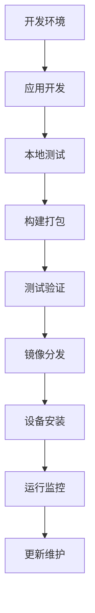

# Application Development

本指南介绍如何在 NE503 AIPC 平台上开发、构建、部署和管理容器应用。从项目创建到设备安装，覆盖完整的应用生命周期。

## 1. 快速开始

以下流程展示从零创建一个 AI 检测应用并部署到设备的完整步骤：

```bash
# 1. 创建项目
mkdir my-app && cd my-app

# 2. 创建应用代码
cat > app.py << 'EOF'
from hailo_ipc_sdk import InferenceClient, EventClient

inference = InferenceClient()
events = EventClient()

for frame, result in inference.subscribe(stream="cam0_main", model="yolov8n", fps=10):
    if result.objects:
        print(f"Detected {len(result.objects)} objects")
        events.publish("app/my_app/detection", {"count": len(result.objects)})
EOF

# 3. 创建应用清单
cat > app.yaml << 'EOF'
apiVersion: v1
kind: Application
metadata:
  id: my_app
  name: My Application
  version: 1.0.0
spec:
  image: aipc/my_app:1.0.0
  resources:
    memory: "256Mi"
  permissions:
    inference:
      models: [yolov8n]
    events:
      publish: [app/my_app/*]
EOF

# 4. 创建 Dockerfile
cat > Dockerfile << 'EOF'
FROM aipc/python-base:1.0
COPY . /app/
CMD ["python", "app.py"]
EOF

# 5. 构建并部署
docker build -t aipc/my_app:1.0.0 .
docker save aipc/my_app:1.0.0 | gzip > my_app.tar.gz
scp app.yaml my_app.tar.gz root@<设备IP>:/tmp/
ssh root@<设备IP> "cd /tmp && gunzip my_app.tar.gz && \
  aipc-cli app install app.yaml my_app.tar && aipc-cli app start my_app"
```

---

## 2. 项目结构

```
my-app/
├── app.yaml          # 必需：应用清单
├── Dockerfile        # 必需：构建定义
├── app.py            # 入口文件
├── requirements.txt  # 可选：Python 依赖
├── config/           # 可选：配置目录
└── tests/            # 可选：测试代码
```

---

## 3. SDK 安装

AIPC SDK 未发布到公共 PyPI，需通过以下方式安装：

| 方式 | Dockerfile 用法 | 适用场景 |
|:---|:---|:---|
| 基础镜像（推荐） | `FROM aipc/python-base:1.0` | SDK 预装，零配置 |
| Wheel 文件 | `COPY hailo_ipc_sdk-*.whl /tmp/`<br />`RUN pip install /tmp/hailo_ipc_sdk-*.whl` | 离线环境 |
| 私有 PyPI | `RUN pip install -i https://pypi.internal/ aipc-sdk` | 企业内部 |

---

## 4. app.yaml 配置规范

应用清单是 AIPC 平台的核心配置文件，定义应用的基本信息、资源需求、权限设置等。

### 4.1 最小配置

```yaml
apiVersion: v1
kind: Application
metadata:
  id: my_app
  name: My Application
  version: 1.0.0
spec:
  image: aipc/my_app:1.0.0
```

### 4.2 完整单容器配置

```yaml
apiVersion: v1
kind: Application

metadata:
  id: my_app                          # 必需：唯一标识（小写字母、数字、下划线）
  name: My Application                # 必需：显示名称
  version: 1.0.0                      # 必需：语义化版本
  description: 应用描述                # 必需：应用描述
  author: Your Name                   # 可选：作者
  email: your@email.com               # 可选：联系邮箱

spec:
  image: aipc/my_app:1.0.0            # 镜像名称和标签

  resources:
    cpu: "50%"                        # CPU 限制（百分比或核数）
    memory: "256Mi"                   # 内存限制（Mi/Gi）

  permissions:
    video:
      - cam0_main.raw                 # 原始视频流（DMA-BUF 共享内存）
      - cam0_main                     # 编码视频流（Unix Socket）
    inference:
      models: [yolov8n, person_v1]    # 可用模型列表
      max_qps: 30                     # 最大 QPS
      max_concurrent: 2               # 最大并发推理数
      allow_register_model: false     # 是否允许注册新模型
    events:
      publish: [app/my_app/*]         # 可发布主题（支持通配符）
      subscribe: [model/*/detections, system/*]
    device:
      light: true                     # 补光灯
      ir_cut: true                    # IR-CUT 滤光片
      ptz: false                      # 云台控制
      lens: false                     # 镜头变焦/对焦
      gpio:
        read: [12, 13]                # 可读 GPIO 引脚
        write: [21, 22]               # 可写 GPIO 引脚
    network:
      mode: isolated                  # 网络模式：isolated（默认）或 host
      # 系统配置层实际值为 none | bridge | host，app.yaml 层映射关系：
      # isolated → none（隔离容器网络），internal → none（多容器隔离），
      # bridge → bridge（NAT 端口映射，仅多容器），host → host（共享主机网络）
      outbound:                       # 出站白名单（isolated 模式）
        - "https://api.example.com"
      inbound:                        # 入站端口（host 模式）
        - 8554

  env:
    - name: LOG_LEVEL
      value: INFO

  volumes:
    - host: /opt/aipc/data/my_app
      container: /app/data
      readonly: false

  security:
    no_new_privileges: true           # 禁止提权（默认 true）
    readonly_rootfs: true             # 只读根文件系统（默认 true）

  autostart: true                     # 开机自启
  restart_policy: on-failure          # always | on-failure | no
  restart_max_retries: 3
  # restart_policy 为基础重启策略，auto_restart 为增强版（含退避和健康检查联动）

  healthcheck:
    enabled: true
    interval: 30s
    timeout: 5s
    retries: 3

  auto_restart:
    enabled: true
    max_retries: 3
    retry_delay_seconds: 10
    backoff_multiplier: 2.0
```

### 4.3 metadata 字段参考

| 字段 | 必需 | 说明 |
|:---|:---|:---|
| `id` | 是 | 唯一标识，小写字母/数字/下划线，创建后不可修改 |
| `name` | 是 | 显示名称 |
| `version` | 是 | 语义化版本（major.minor.patch） |
| `description` | 是 | 应用描述 |
| `author` | 否 | 作者名称 |
| `email` | 否 | 联系邮箱 |

---

## 5. 多容器模式

适用于需要进程隔离的复杂应用。Main 容器拥有平台服务访问权限，Sub 容器在隔离环境中运行。

```yaml
spec:
  containers:
    main:
      image: smart-detection-main:1.0
      role: main                      # 必须声明
      permissions:
        video: [cam0_main.raw]
        inference:
          models: [yolov8n]
      resources:
        cpu: "100%"
        memory: "512Mi"
      ports:
        - containerPort: 8080
          protocol: TCP
      env:
        - name: SUB_DETECTOR_ADDR
          value: "detector:50051"

    detector:
      image: smart-detection-detector:1.0
      role: sub                       # Sub 容器，不能声明 permissions
      resources:
        cpu: "50%"
        memory: "256Mi"
      ports:
        - containerPort: 50051
          protocol: TCP

  networking:
    mode: internal                    # internal | bridge | host
    # internal: 容器间通信模式（默认）
    # bridge: 通过 aipc-br0 网桥接入局域网
    # host: 共享宿主网络栈
    ingress:
      - port: 8080
        target: main:8080
        protocol: HTTP

  lifecycle:
    startup_order: [detector, main]   # 先启动 detector
    shutdown_order: [main, detector]  # 先停止 main

  volumes:
    - host: /opt/aipc/data/smart_detection
      container: /app/data
```

| 角色 | 权限 | 说明 |
|:---|:---|:---|
| **main** | 获得平台 Socket 访问，可声明 permissions | 负责与平台服务交互 |
| **sub** | 完全隔离，不能声明 permissions | 通过共享网络命名空间与 main 通信 |

---

## 6. 插件系统

应用可以声明提供的能力（`plugin.capabilities`）和依赖的其他插件（`plugin_dependencies`）：

```yaml
spec:
  plugin:
    capabilities:
      - id: rtsp-server               # 能力唯一标识
        version: "1.0"
        transport: both               # grpc | event | both
        description: RTSP 流媒体服务
        proto: "rtsp.RtspService"     # gRPC 服务定义
        topics:
          publish:
            - "plugin/rtsp/stream-status"
          subscribe:
            - "system/video-config-changed"

  plugin_dependencies:
    - capability: rtsp-server
      min_version: "1.0"
      required: true
    - capability: object-storage
      min_version: "2.1"
      required: false
```

---

## 7. Dockerfile 最佳实践

### Python（基础镜像）

```dockerfile
FROM aipc/python-base:1.0
WORKDIR /app
COPY . /app/
RUN if [ -f requirements.txt ]; then pip install --no-cache-dir -r requirements.txt; fi
RUN useradd -m -u 1000 appuser && chown -R appuser:appuser /app
USER appuser
CMD ["python", "app.py"]
```

### Python（Wheel 文件，离线环境）

```dockerfile
FROM python:3.9-slim
WORKDIR /app
COPY hailo_ipc_sdk-*.whl /tmp/
RUN pip install --no-cache-dir /tmp/hailo_ipc_sdk-*.whl && rm /tmp/*.whl
COPY . /app/
RUN useradd -m -u 1000 appuser && chown -R appuser:appuser /app
USER appuser
CMD ["python", "app.py"]
```

### Go（多阶段构建）

```dockerfile
FROM golang:1.25-alpine AS builder
WORKDIR /build
COPY go.mod go.sum ./
RUN go mod download
COPY . .
RUN CGO_ENABLED=0 GOOS=linux go build -o /app/main ./cmd/main

FROM alpine:3.18
RUN apk --no-cache add ca-certificates tzdata
COPY --from=builder /app/main /app/main
RUN addgroup -g 1000 appgroup && adduser -u 1000 -G appgroup -s /bin/sh -D appuser
USER appuser
HEALTHCHECK --interval=30s --timeout=5s --start-period=5s --retries=3 \
    CMD /app/main --health-check
ENTRYPOINT ["/app/main"]
```

---

## 8. 构建与部署

### 8.1 应用生命周期



### 8.2 构建镜像

```bash
# 基本构建
docker build -t my-app:1.0.0 .

# 跨架构构建（x86 开发机 → ARM 设备）
docker buildx build --platform linux/arm64 -t my-app:1.0.0 --load .

# 使用代理构建
docker build --build-arg HTTP_PROXY=http://proxy:port \
             --build-arg HTTPS_PROXY=http://proxy:port \
             -t my-app:1.0.0 .
```

### 8.3 导出镜像

```bash
# 导出为 tar
docker save my-app:1.0.0 -o my-app.tar

# 导出并压缩（推荐，gzip 减少约 70% 体积）
docker save my-app:1.0.0 | gzip > my-app.tar.gz

# 验证导出文件
docker load -i my-app.tar && docker images | grep my-app
```

### 8.4 传输到设备

```bash
# SCP（推荐）
scp app.yaml my-app.tar.gz root@<设备IP>:/tmp/

# rsync（适合大文件，支持断点续传）
rsync -avz --progress app.yaml my-app.tar.gz root@<设备IP>:/tmp/
```

### 8.5 安装应用

**CLI 方式：**

```bash
ssh root@<设备IP>
cd /tmp && gunzip my-app.tar.gz
aipc-cli app install app.yaml my-app.tar
aipc-cli app start my_app
```

**Web 控制台方式：**

1. 浏览器访问 `http://<设备IP>:8080`
2. 导航至 **App Management** 页面
3. 点击 **Import** 启动安装向导
4. 选择镜像来源并填写配置
5. 确认安装

---

## 9. 权限配置

AIPC 平台采用细粒度权限控制，应用必须显式声明所需权限，遵循最小权限原则。

### 视频流访问

```yaml
permissions:
  video:
    - cam0_main.raw      # 原始视频流（DMA-BUF 共享内存，零拷贝）
    - cam0_main          # 编码视频流（Unix Domain Socket）
    - cam0_sub           # 子码流
```

### AI 推理

```yaml
permissions:
  inference:
    models: [yolov8n, person_v1]    # 可用模型
    max_qps: 30                      # 最大 QPS
    max_concurrent: 2                # 最大并发数
    allow_register_model: false      # 是否允许注册新模型
```

### 事件总线

```yaml
permissions:
  events:
    publish: [app/my_app/alerts, alerts/*]
    subscribe: [model/*/detections, device/camera/*, system/health]
```

### 设备控制

```yaml
permissions:
  device:
    light: true           # 补光灯
    ir_cut: true          # IR-CUT 滤光片
    ptz: true             # 云台
    lens: true            # 镜头
    gpio:
      read: [12, 13]
      write: [21, 22]
```

### 网络访问

```yaml
permissions:
  network:
    mode: isolated                    # isolated（默认）或 host
    outbound:                         # 仅 isolated 模式
      - "https://api.example.com"
      - "mqtt://broker.example.com:8883"
    inbound:                          # 仅 host 模式
      - 8554
```

### 最小权限实践

```yaml
# 错误：过度授权
permissions:
  inference:
    models: ["*"]
  device:
    gpio:
      read: [0-100]

# 正确：仅声明必要权限
permissions:
  inference:
    models: [person_detection_v1]
    max_qps: 30
  device:
    gpio:
      read: [12]
```

---

## 10. 版本管理

### 版本号规则

采用语义化版本：`MAJOR.MINOR.PATCH`

- **MAJOR**：不兼容的 API 变更
- **MINOR**：向后兼容的功能新增
- **PATCH**：向后兼容的问题修复

预发布标签：`-dev.N`、`-alpha.N`、`-beta.N`、`-rc.N`

### 更新流程

```bash
# 1. 更新版本号
sed -i 's/version: 1.0.0/version: 1.1.0/' app.yaml

# 2. 构建新镜像
docker build -t my-app:1.1.0 .

# 3. 导出并传输
docker save my-app:1.1.0 | gzip > my-app-v1.1.0.tar.gz
scp app.yaml my-app-v1.1.0.tar.gz root@<设备IP>:/tmp/

# 4. 停止旧版本，安装新版本
# 先登录设备
ssh root@<设备IP>

# 在设备上执行以下命令
cd /tmp && gunzip my-app-v1.1.0.tar.gz
aipc-cli app stop my_app
aipc-cli app remove my_app
aipc-cli app install /tmp/app.yaml /tmp/my-app-v1.1.0.tar
aipc-cli app start my_app
```

### 回滚

```bash
aipc-cli app stop my_app
aipc-cli app remove my_app
gunzip my-app.tar.gz.backup
aipc-cli app install app.yaml.backup my-app.tar.backup
aipc-cli app start my_app
```

---

## 11. 测试

### 单元测试

```python
# tests/test_app.py
import unittest
from unittest.mock import Mock, patch

class TestApp(unittest.TestCase):
    def setUp(self):
        self.app = MyApp()

    @patch('app.InferenceClient')
    def test_inference_client(self, mock_client):
        mock_client.return_value.subscribe.return_value = iter([])
        result = self.app.inference_client()
        self.assertIsNotNone(result)

    def test_cleanup(self):
        with patch.object(self.app, 'inference') as mock_inf:
            with patch.object(self.app, 'events') as mock_ev:
                self.app.cleanup()
                mock_inf.close.assert_called_once()
                mock_ev.close.assert_called_once()
```

```bash
pip install pytest pytest-cov pytest-mock
pytest tests/ -v --cov=app --cov-report=html
```

### 集成测试

```bash
# 启动测试容器
docker run --rm --network host -e APP_ID=my_app -e TEST_MODE=1 my-app:1.0.0

# 验证 SDK 可导入
docker run --rm my-app:1.0.0 python -c "import hailo_ipc_sdk; print('OK')"
```

### 性能测试

验证推理延迟和内存增长在可接受范围内：

```python
# tests/test_performance.py
def test_inference_latency():
    times = []
    for _ in range(100):
        start = time.time()
        # 模拟推理
        time.sleep(0.001)
        times.append(time.time() - start)
    assert sum(times) / len(times) < 0.1, "Average latency too high"
    assert max(times) < 0.5, "Maximum latency too high"

def test_memory_usage():
    import psutil
    process = psutil.Process()
    initial = process.memory_info().rss / 1024 / 1024
    for i in range(1000):
        app.process_frame(f"frame_{i}")
    growth = process.memory_info().rss / 1024 / 1024 - initial
    assert growth < 100, f"Excessive memory growth: {growth}MB"
```

### 安全测试

```python
def test_no_hardcoded_secrets():
    import inspect
    source = inspect.getsource(MyApp)
    for pattern in ['API_KEY', 'PASSWORD', 'SECRET', 'TOKEN', 'PRIVATE_KEY']:
        assert pattern not in source, f"Found hardcoded secret pattern: {pattern}"
```

---

## 12. 发布检查清单

### 发布前

- [ ] 代码格式检查通过（`make fmt && make lint`）
- [ ] `app.yaml` 格式验证（`aipc-cli validate app.yaml`）
- [ ] 镜像构建成功且大小合理
- [ ] 单元测试覆盖率 >= 80%
- [ ] 集成测试通过
- [ ] 无硬编码密钥（`grep -r "API_KEY\|PASSWORD\|SECRET" . --exclude-dir=.git`）
- [ ] Dockerfile 安全检查（`hadolint`）
- [ ] 文档和 Changelog 已更新

### 发布中

- [ ] 文件完整性验证（`file my-app.tar.gz`、`yamllint app.yaml`）
- [ ] 安装流程测试通过
- [ ] 回滚准备就绪（备份旧版本文件）

### 发布后

- [ ] 应用状态为 Running（`aipc-cli app list`）
- [ ] 日志无异常（`aipc-cli app logs my_app --tail 20`）
- [ ] 资源使用正常（`aipc-cli app stats my_app`）
- [ ] 健康检查通过（`aipc-cli app stats my_app`）

### 发布失败处理

```bash
# 快速回滚
aipc-cli app stop my_app
aipc-cli app remove my_app
aipc-cli app install app.yaml.backup my-app.tar.gz.backup
aipc-cli app start my_app

# 问题诊断
free -h && df -h
systemctl status containerd app-manager
aipc-cli app logs my_app --all > app.log
```

---

## 13. 故障排查

| 问题 | 排查命令 | 常见原因 |
|:---|:---|:---|
| 应用启动失败 | `aipc-cli app logs <id>`<br />`systemctl status app-manager`<br />`systemctl status containerd` | 镜像导入失败、权限配置错误、资源不足、健康检查失败 |
| 镜像构建失败 | `docker build --build-arg HTTP_PROXY=...` | 网络问题（使用代理）、镜像过大（多阶段构建） |
| 推理结果为空 | `aipc-cli model list` | permissions.inference.models 未包含目标模型 |
| 无法获取视频流 | `aipc-cli stream list` | permissions.video 流名不正确（`.raw` 为原始流，无后缀为编码流） |
| 无法连接外部服务 | `aipc-cli app exec <id> -- curl <url>` | 网络模式为 isolated 且未配置 outbound |
| 镜像导入失败 | `systemctl status containerd`<br />`ctr -n aipc images import <tar>`<br />`file <tar>` | containerd 异常、文件格式损坏 |
| 多容器启动失败 | — | sub 容器不能声明 permissions；确认仅一个 `role: main`；检查 startup_order |

### 调试命令

```bash
aipc-cli app exec my_app -- bash        # 进入容器
aipc-cli app info my_app --verbose      # 详细信息
aipc-cli app info my_app --network      # 查看网络配置
aipc-cli app info my_app --volumes      # 查看挂载点
aipc-cli app logs my_app -f             # 实时查看日志
```

---

## 14. 相关文档

- [平台架构](../3-platform-development/0-platform-architecture.md) — 理解系统设计与数据流
- [Python SDK 参考](./2-sdk-reference.md) — SDK API 签名与数据类型
- [SDK 示例](./3-sdk-examples.md) — 完整应用示例和开发指南
- [CLI 工具](../5-system-integration/3-cli-guide.md) — aipc-cli 完整命令参考
- [容器应用管理](../6-reference/service-reference/1-app-manager.md) — App Manager 深度解析
