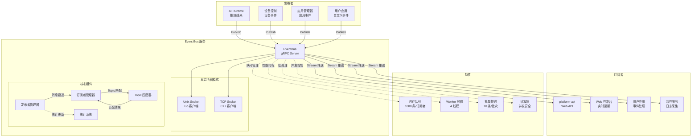
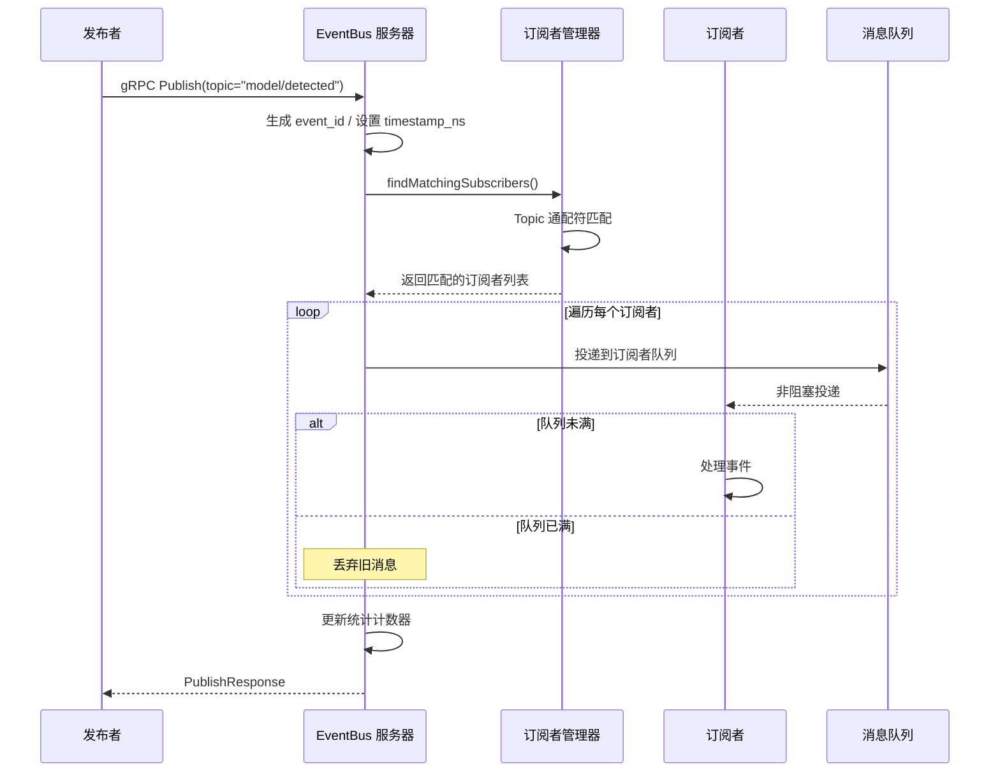
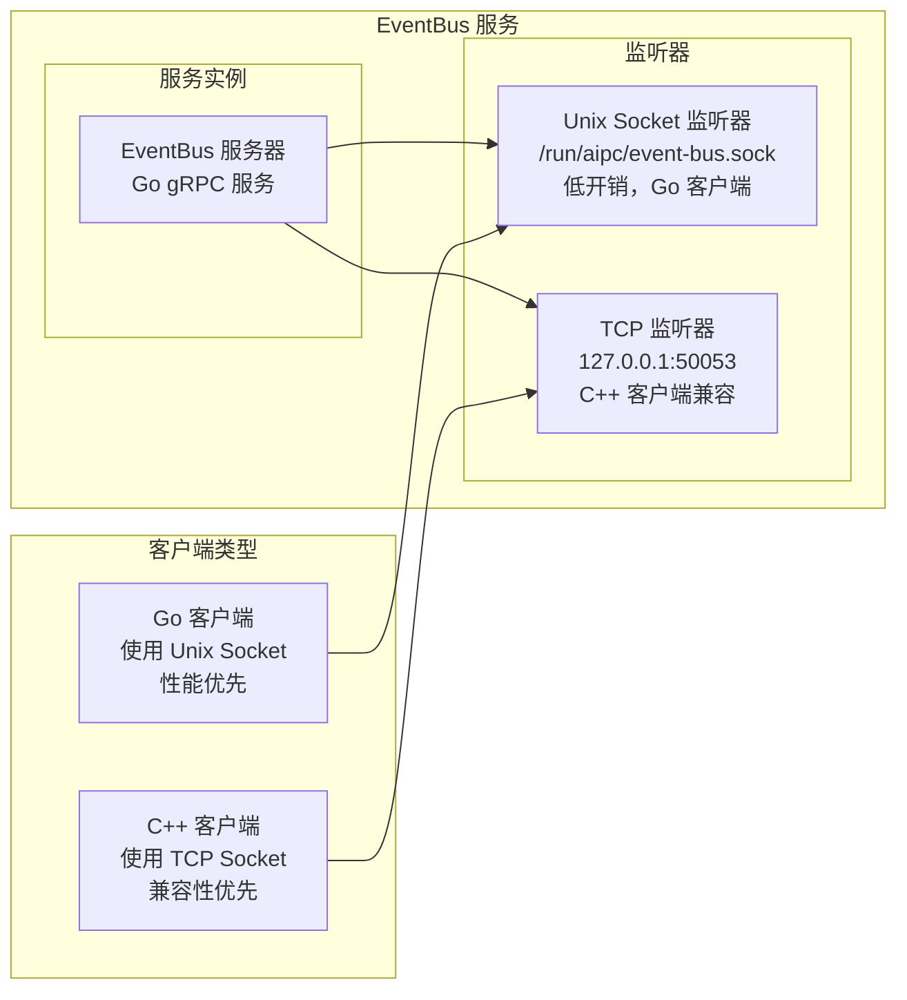
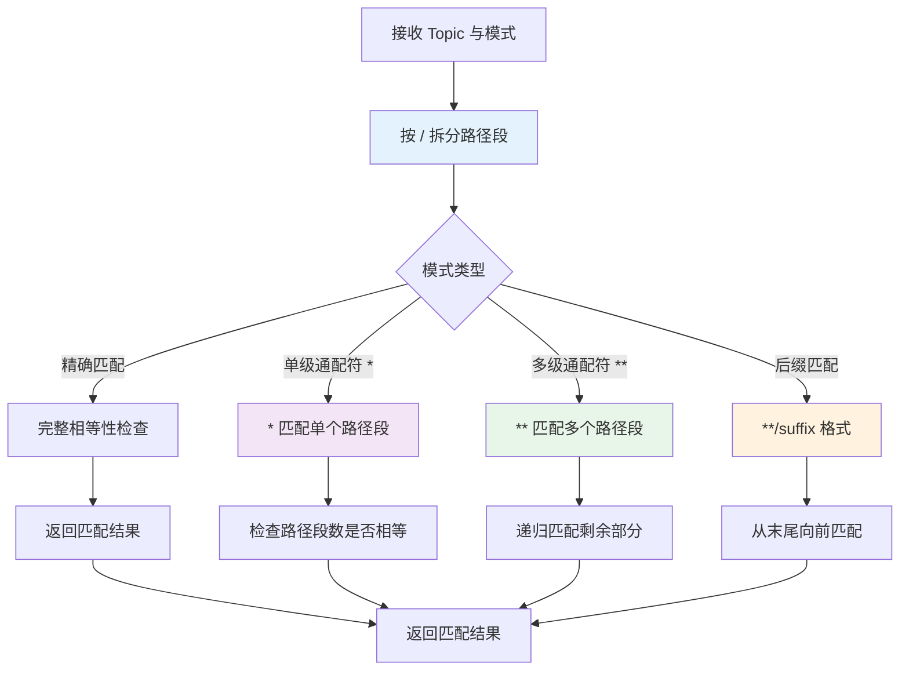
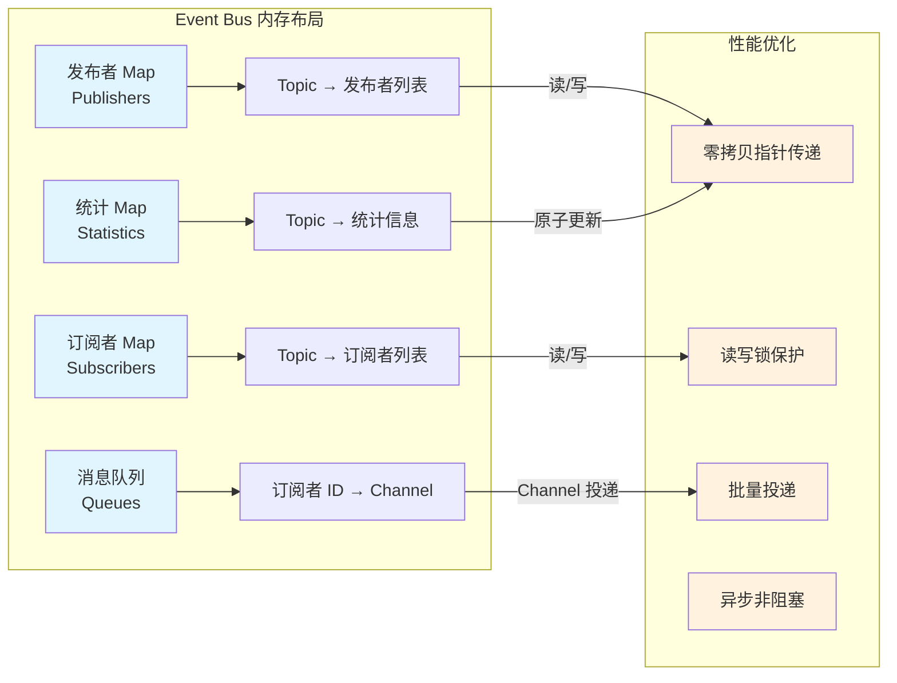

# Event Bus Service

## 概述

`event-bus` 是 NE503 平台的本地 Pub/Sub 消息总线，负责 AI 推理结果分发、应用事件上报和系统事件通知。它支持 MQTT 风格的通配符 Topic 匹配，采用纯内存实现，无需外部依赖。

**技术栈**：Go + gRPC，零磁盘 I/O，纯内存架构。

**核心能力**：

- **MQTT 风格通配符**：支持 `*`（单级）、`**`（多级）及 `**/suffix`（后缀）三种匹配模式
- **双监听器模式**：同时提供 Unix Socket（Go 客户端）和 TCP Socket（C++ 客户端）两种接入方式
- **纯内存队列**：每订阅者 1000 条消息缓冲，异步非阻塞投递
- **批处理优化**：Worker 线程 + 批量投递，单消息发布延迟 < 0.1 ms

## 架构

Event Bus 作为平台级消息中枢，连接 AI Runtime、设备控制、应用管理等多个事件源与订阅者。



## 发布/订阅流程



流程要点：自动生成 event_id → 通配符匹配查找订阅者 → buffered channel 非阻塞投递 → 队列满时丢弃旧消息保护吞吐。

## 双监听器模式

Event Bus 同时启动 Unix Socket 和 TCP Socket 两个 gRPC 监听器，分别优化 Go 客户端和 C++ 客户端的接入体验。



**设计考量**：Unix Socket 本机通信零网络开销，适合 Go 服务间高性能调用；TCP Socket 解决 C++ gRPC 库对 Unix Socket 支持有限的问题。两种监听器共享同一套核心逻辑。

## gRPC API

服务名称：`EventBus`

- Unix Socket：`unix:///run/aipc/event-bus.sock`
- TCP Socket：`127.0.0.1:50053`

### RPC 方法

| RPC | 请求类型 | 响应类型 | 说明 |
|-----|---------|----------|------|
| `Publish` | `PublishRequest` | `PublishResponse` | 发布单条事件 |
| `PublishBatch` | `stream PublishRequest` | `Status` | 批量发布（客户端流式） |
| `Subscribe` | `SubscribeRequest` | `stream Event` | 订阅 Topic（支持通配符，服务端流式） |
| `Unsubscribe` | `SubscribeRequest` | `Status` | 取消订阅 |
| `ListTopics` | `Empty` | `TopicListResponse` | 列出活跃 Topic |
| `GetTopicInfo` | `TopicInfo` | `TopicInfo` | 获取 Topic 详情 |
| `GetStats` | `Empty` | `SystemStats` | 获取系统统计 |
| `GetTopicStats` | `TopicInfo` | `EventStats` | 获取 Topic 统计 |

### 核心消息结构

**Event**（事件消息）：

```protobuf
message Event {
  string topic = 1;           // Topic（如 "model/person_v1/detections"）
  uint64 timestamp_ns = 2;    // 纳秒时间戳
  string source = 3;          // 来源（app_id / 服务名）
  string event_id = 4;        // 事件 ID（自动生成）
  bytes payload = 10;         // 载荷（JSON 或 protobuf）
  string payload_type = 11;   // "json" / "protobuf"
  map<string, string> metadata = 20;
}
```

**SubscribeRequest**（订阅请求）：

```protobuf
message SubscribeRequest {
  string topic = 1;           // 支持通配符
  string subscriber_id = 2;   // 订阅者 ID
  map<string, string> filters = 10;  // 可选过滤器
  uint32 queue_size = 20;     // 队列大小
  bool drop_old = 21;         // 队列满时丢弃旧消息
}
```

**Statistics**（统计信息）：

```protobuf
message EventStats {
  string topic = 1;
  uint64 published_count = 2;   // 已发布数量
  uint64 delivered_count = 3;   // 已投递数量
  uint64 dropped_count = 4;     // 已丢弃数量
  float avg_latency_us = 5;     // 平均延迟（微秒）
}

message SystemStats {
  repeated EventStats topic_stats = 1;
  uint32 total_subscribers = 2;  // 总订阅者数
  uint32 total_topics = 3;       // 总 Topic 数
  uint64 uptime_ms = 4;          // 运行时间（毫秒）
}
```

## Topic 通配符匹配

Event Bus 支持 MQTT 风格的通配符匹配，基于 `/` 分隔的层级式 Topic 路径。

### 匹配模式

| 模式 | 说明 | 示例 |
|------|------|------|
| 精确匹配 | Topic 完全相等 | `app/test/alert` |
| `*` | 匹配单个层级（不跨 `/`） | `app/*/alert` 匹配 `app/test/alert` |
| `**` | 匹配零或多个层级 | `app/**` 匹配 `app/a/b/c` |
| `**/suffix` | 后缀匹配 | `app/**/events` 匹配 `app/a/b/events` |

**匹配规则**：

- `*` 仅匹配一个路径段，不跨越 `/` 分隔符
- `**` 可匹配零到多个路径段，支持递归回溯
- 匹配算法采用逐段递归比较，确保正确处理嵌套通配符

### 匹配示例

| 订阅模式 | Topic | 匹配结果 | 说明 |
|----------|-------|---------|------|
| `model/person_v1/detections` | `model/person_v1/detections` | ✅ | 精确匹配 |
| `model/person_v1/detections` | `model/yolov8/detections` | ❌ | 不匹配 |
| `model/*/detections` | `model/person_v1/detections` | ✅ | `*` 匹配 `person_v1` |
| `model/*/detections` | `model/a/b/detections` | ❌ | `*` 不跨级 |
| `app/**` | `app/test/alert` | ✅ | `**` 匹配 `test/alert` |
| `app/**` | `app/a/b/c` | ✅ | `**` 匹配 `a/b/c` |
| `app/**` | `app` | ✅ | `**` 匹配零段 |
| `model/**/detections` | `model/cam0_main/person_v1/detections` | ✅ | `**` 匹配 `cam0_main/person_v1` |
| `**/alert` | `system/device/error/alert` | ✅ | 后缀匹配 |

### 匹配算法流程



## 纯内存架构

Event Bus 采用纯内存设计，所有数据结构驻留在进程内存中，无外部存储依赖。



**核心设计**：零拷贝指针传递、读写锁并发控制、Buffered Channel 隔离慢消费者、异步发布立即返回、不活跃 Topic 自动回收（默认 3600 秒）。

## 性能特征

| 指标 | 数值 | 说明 |
|------|------|------|
| 单消息发布延迟 | < 0.1 ms | 包含匹配与投递 |
| 最大吞吐量 | 100,000 msg/s | 批量发布模式 |
| 内存占用 | < 50 MB | 包含订阅与统计 |
| 最大 Topic 数 | 1000 | 可配置 |
| 每订阅者队列 | 1000 条 | 可配置 |

## 配置

配置文件路径：`configs/platform/event-bus.yaml`

| 配置项 | 默认值 | 说明 |
|--------|--------|------|
| **service.name** | `event-bus` | 服务名称 |
| **service.listen** | `unix:///run/aipc/event-bus.sock` | Unix Socket 监听地址（Go 客户端） |
| **service.tcp_listen** | `127.0.0.1:50053` | TCP 监听地址（C++ 客户端兼容） |
| **service.log_level** | `info` | 日志级别 |
| **bus.queue_size** | `1000` | 每订阅者队列大小 |
| **bus.max_topics** | `1000` | 最大 Topic 数量 |
| **bus.workers** | `4` | Worker 线程数 |
| **bus.batch_size** | `10` | 批量投递大小 |
| **bus.inactive_topic_ttl** | `3600` | 不活跃 Topic 清理间隔（秒） |
| **routing.priorities** | — | Topic 前缀优先级（`system/` → 10, `alert/` → 8, `model/` → 5, `app/` → 5） |
| **routing.rate_limits** | — | Topic 速率限制（`model/*` → 1000 msg/s, `app/*` → 100 msg/s） |
| **monitoring.stats_enabled** | `true` | 是否启用统计 |
| **monitoring.stats_interval_sec** | `10` | 统计采集间隔（秒） |
| **monitoring.metrics_port** | `9091` | Prometheus 指标端口 |

## 相关文档

- [AI 推理服务](./0-ai-runtime.md) — Event Bus 的主要事件源之一
- [设备控制服务](./3-device-control.md) — 设备事件通过 Event Bus 分发
- [应用管理服务](./1-app-manager.md) — 应用生命周期事件发布至 Event Bus
- [CLI 工具指南](../3-software-platform/4-cli-guide.md) — aipc-cli 命令行工具使用说明
