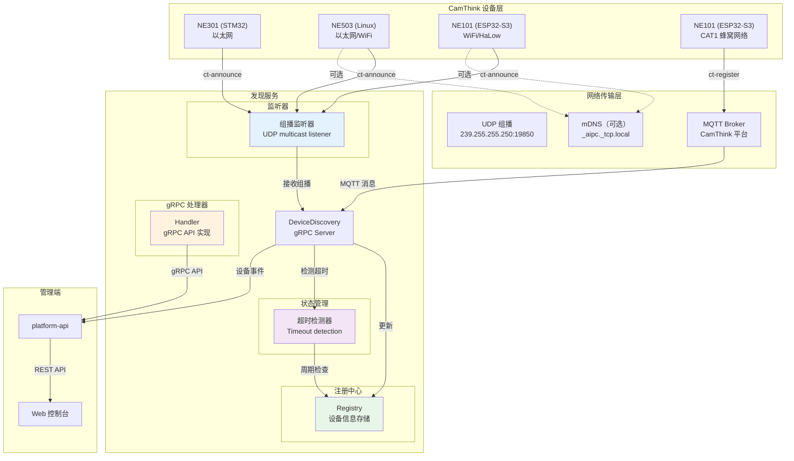
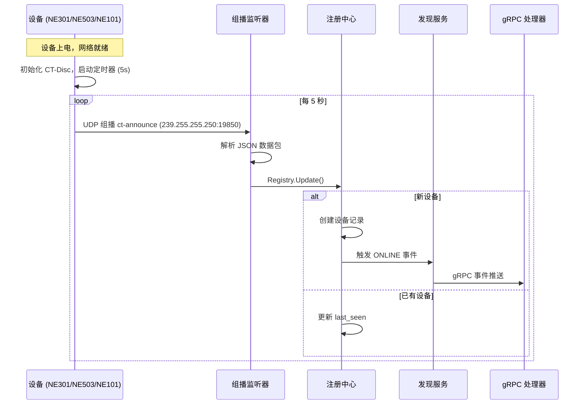
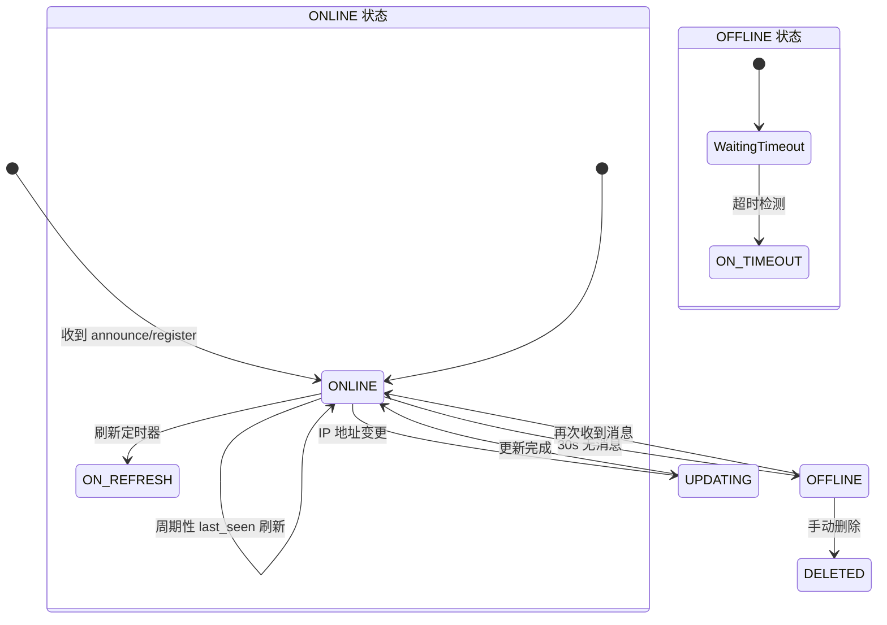
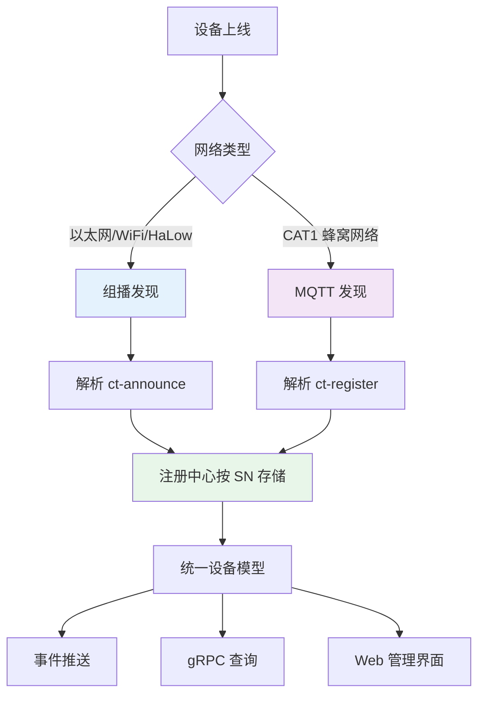
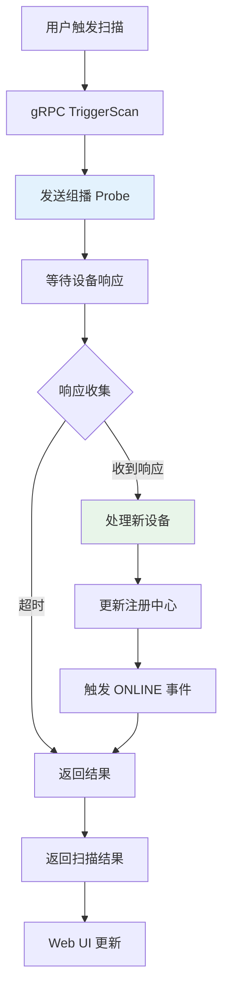
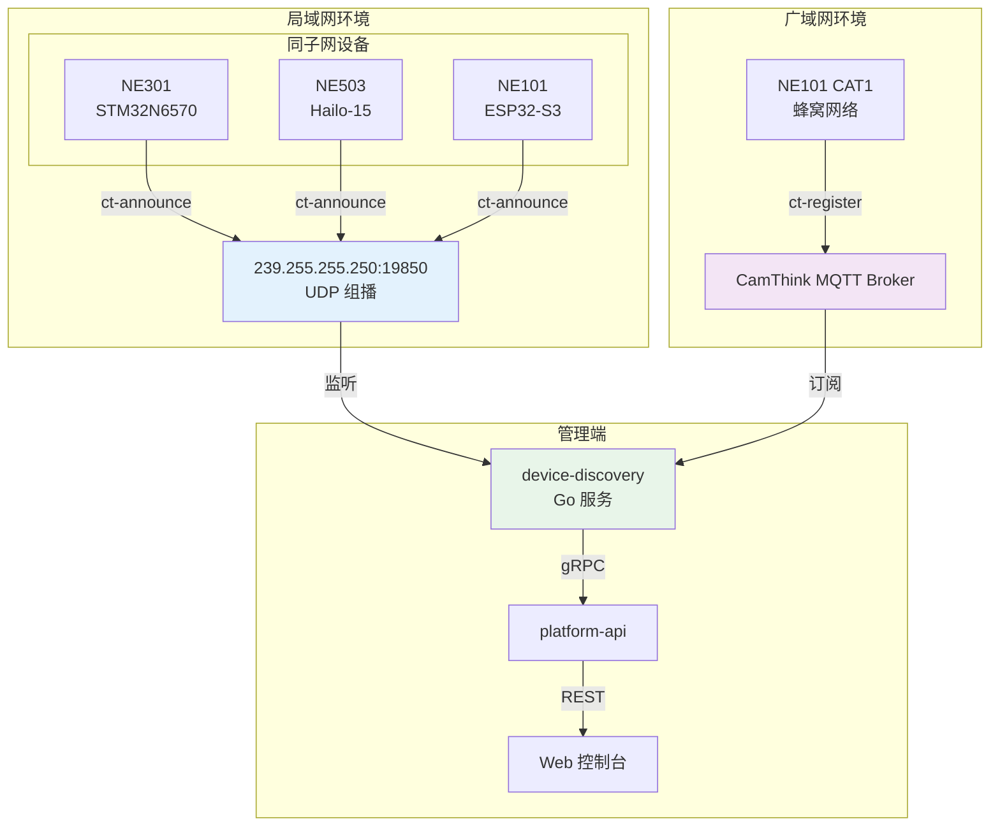

# Device Discovery Service

Device Discovery 是基于 Go + gRPC 的设备发现服务，实现 **CT-Disc**（CamThink Device Discovery & Management）协议，用于局域网和广域网中 CamThink 设备的自动发现与统一管理。

核心能力：**双传输模式**（UDP 组播 + MQTT 按网络类型自动选择）、**统一设备模型**（按 SN 归一化存储）、**实时状态管理**（自动检测上下线）、**管理命令通道**（远程下发指令）。

## 系统架构



## CT-Disc 协议

CT-Disc 定义了设备自动宣告、注册到管理平台并接受管理的完整交互流程。

### 组播发现

设备上电后自动通过 UDP 组播发送 `ct-announce`，Discovery 服务监听并注册。



### 设备状态管理

每个设备在注册中心中维护四种状态，通过超时检测自动转换。



| 状态 | 说明 | 触发条件 |
|------|------|----------|
| **ONLINE** | 设备在线 | 收到 announce/register 消息 |
| **OFFLINE** | 设备离线 | 超过 30s 未收到心跳 |
| **DELETED** | 已删除 | 管理端手动移除 |
| **UPDATING** | 信息更新中 | IP 地址等关键字段变更 |

### 多协议统一管理

无论设备通过 UDP 组播还是 MQTT 接入，均按 SN 归一化存储到注册中心。



## gRPC API

服务名 `aipc.discovery.DiscoveryService`，监听 `unix:///run/aipc/device-discovery.sock`。

### ListDevices {#listdevices}

查询已发现设备列表，支持按产品型号和状态过滤。

```protobuf
rpc ListDevices(ListDevicesRequest) returns (ListDevicesResponse)
```

| 字段 | 类型 | 说明 |
|------|------|------|
| `product` | string | 按产品型号过滤，空串不过滤 |
| `status` | DeviceStatus | 请求：按设备状态过滤 |
| `devices` | DiscoveredDevice[] | 响应：设备列表 |

### GetDevice {#getdevice}

根据序列号查询单个设备详情。

| 字段 | 类型 | 说明 |
|------|------|------|
| `serial_number` | string | 请求：设备序列号 |

返回完整的 DiscoveredDevice 对象（字段同上）。

### TriggerScan {#triggerscan}

主动触发组播探测，发现新接入网络的设备。

```protobuf
rpc TriggerScan(TriggerScanRequest) returns (TriggerScanResponse)
```

| 字段 | 类型 | 说明 |
|------|------|------|
| `timeout_seconds` | int32 | 请求：扫描超时时间 |
| `found_count` | int32 | 响应：发现的设备数量 |
| `new_devices` | DiscoveredDevice[] | 响应：新发现的设备列表 |



### WatchDevices {#watchdevices}

订阅设备事件流（server streaming），实时接收上下线、状态变更事件。

请求参数：仅需建立 gRPC Server Stream 连接，无需额外参数。

**响应字段**：

| 字段 | 类型 | 说明 |
|------|------|------|
| `type` | EventType | `ONLINE` / `OFFLINE` / `UPDATED` |
| `device` | DiscoveredDevice | 设备信息 |

### SendCommand {#sendcommand}

通过 MQTT 通道向指定设备发送管理命令并等待响应。

| 字段 | 类型 | 说明 |
|------|------|------|
| `serial_number` | string | 目标设备序列号 |
| `action` | string | 命令动作 |
| `params` | string | 命令参数（JSON） |
| `timeout_seconds` | int32 | 等待响应超时时间 |

## 传输参数

| 传输方式 | 组播地址/主题 | 端口 | 间隔 | QoS | 最大包 |
|----------|---------------|------|------|-----|--------|
| **UDP 组播** | `239.255.255.250` | `19850` | `5000ms` | - | `512 bytes` |
| **MQTT 注册** | `ct/disc/register` | - | `30000ms` | `0` | - |
| **MQTT 命令** | `ct/cmd/{sn}` | - | - | `1` | - |
| **MQTT 响应** | `ct/resp/{sn}` | - | - | `1` | - |

### JSON 载荷格式

两种传输模式使用相似的 JSON 结构，字段说明如下：

| 字段 | 类型 | 说明 |
|------|------|------|
| `type` | string | `ct-announce`（组播）或 `ct-register`（MQTT） |
| `product` | string | 产品型号，如 `NE503`、`NE101` |
| `sn` | string | 设备序列号 |
| `mac` / `ip` / `fw` / `port` | - | MAC 地址、IP、固件版本、HTTP 端口 |
| `hw` | string | 硬件平台，如 `Hailo-15`、`ESP32-S3` |
| `caps` | string[] | 能力列表：`camera`、`mqtt`、`http`、`cellular` |
| `net` | string | 仅 MQTT：网络类型，如 `cat1` |

**ct-announce 示例**（组播宣告）

```json
{ "type": "ct-announce", "product": "NE503", "sn": "CT503-2026-00001",
  "mac": "AA:BB:CC:DD:EE:FF", "ip": "192.168.1.50", "fw": "v1.0.0",
  "port": 80, "hw": "Hailo-15", "caps": ["camera", "mqtt", "http"] }
```

**ct-register 示例**（MQTT 注册）

```json
{ "type": "ct-register", "product": "NE101", "sn": "CT101-2026-00001",
  "mac": "AA:BB:CC:DD:EE:FF", "ip": "10.0.1.50", "fw": "v1.0.0",
  "port": 80, "hw": "ESP32-S3", "caps": ["camera", "mqtt", "http", "cellular"], "net": "cat1" }
```

## 管理命令

通过 `SendCommand` API 或 MQTT 命令主题下发的标准管理指令。

| action | 说明 | params 示例 | 适用设备 |
|--------|------|-------------|----------|
| `reboot` | 重启设备 | `{}` | 全部 |
| `get_info` | 获取设备详细信息 | `{}` | 全部 |
| `set_config` | 推送配置 | `{"key": "value"}` | 全部 |
| `ota_upgrade` | OTA 固件升级 | `{"url": "..."}` | NE101, NE503 |
| `capture` | 触发拍照 | `{}` | NE101 |
| `set_network` | 修改网络配置 | `{"mode": "static"}` | NE503 |

**命令消息**（`ct/cmd/{sn}`）：`{"id": "cmd-001", "action": "reboot", "params": {}, "timestamp": 1716163200}`

**命令响应**（`ct/resp/{sn}`）：`{"id": "cmd-001", "result": "ok", "data": {}, "timestamp": 1716163201}`

## 网络拓扑



## 配置

配置文件：`configs/platform/discovery.yaml`

```yaml
service:
  name: device-discovery
  listen: unix:///run/aipc/device-discovery.sock
  log_level: info

discovery:
  multicast_addr: 239.255.255.250
  multicast_port: 19850
  announce_interval: 5
  timeout: 30
  interface: ""  # 绑定网卡，空为自动选择
```

## 相关文档

- [AI Runtime](./0-ai-runtime.md) — AI 推理运行时服务
- [Event Bus](./2-event-bus.md) — 事件总线服务
- [快速入门](../1-quick-start.md) — NE503 快速上手指南
