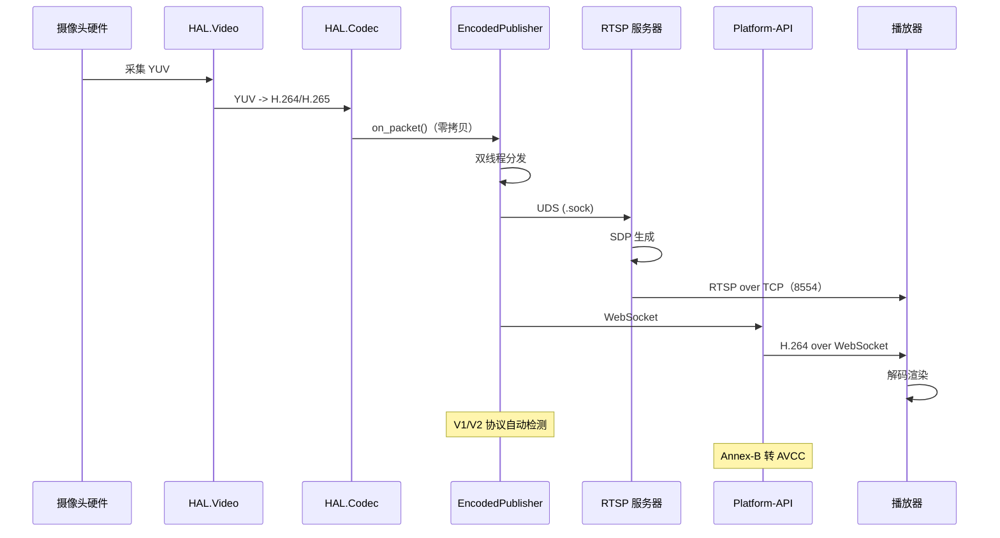
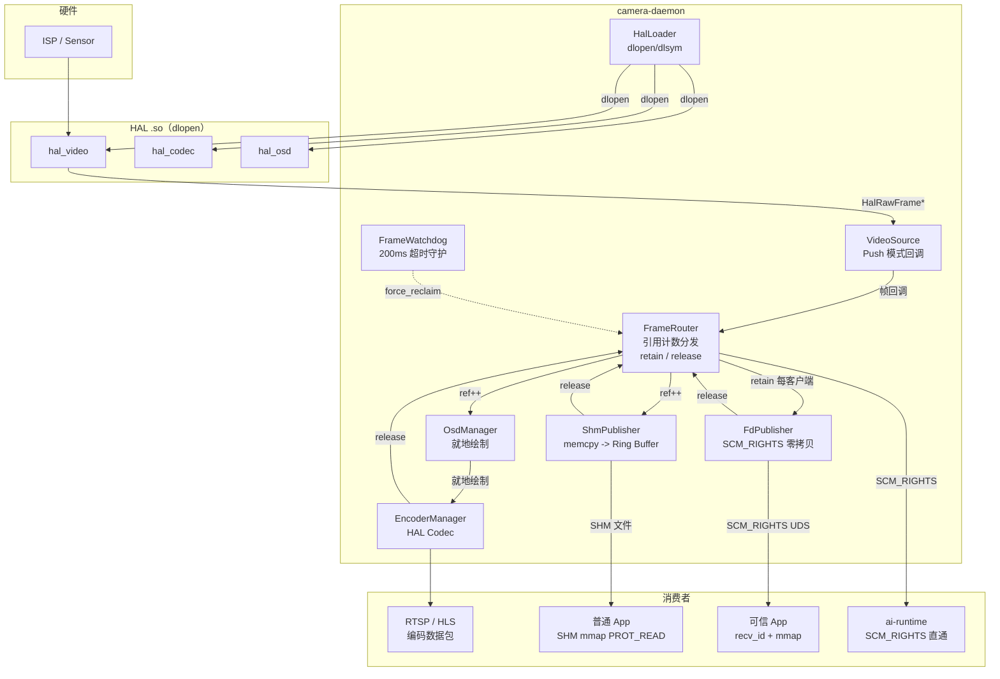
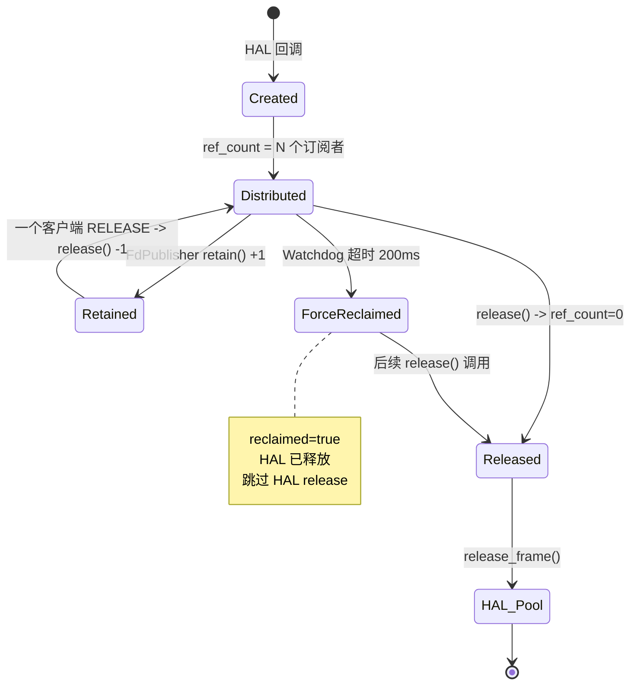
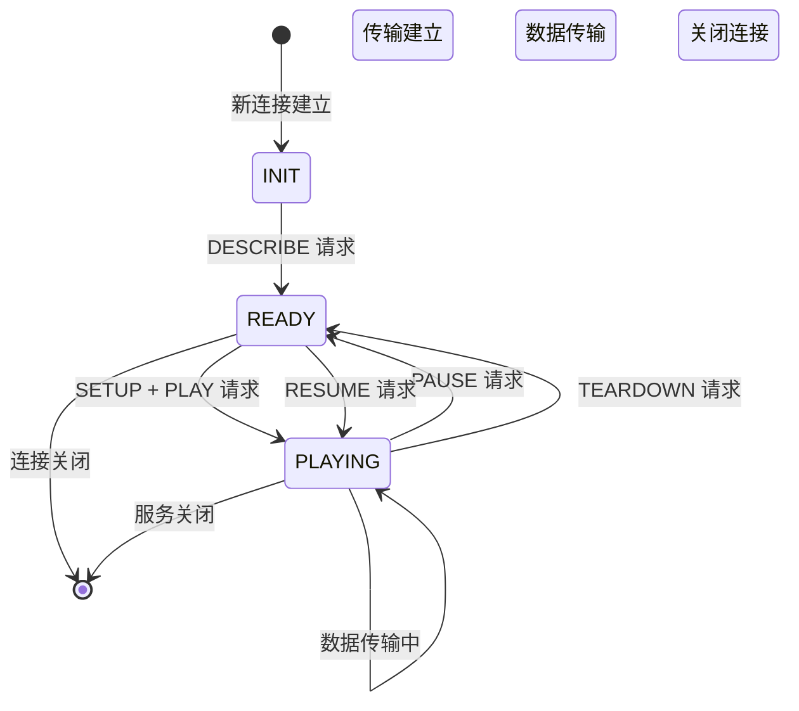
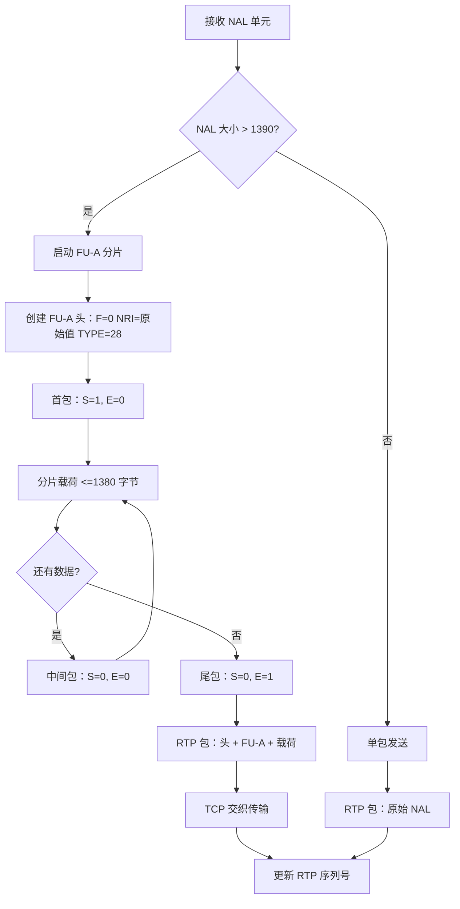
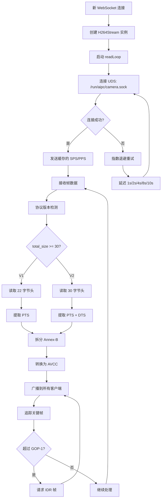
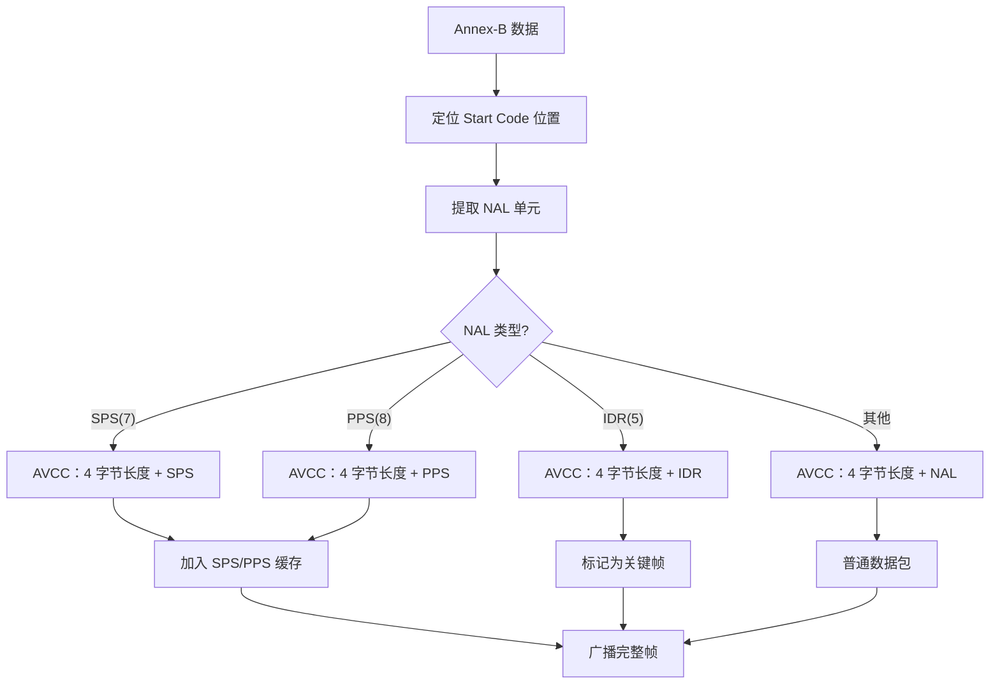
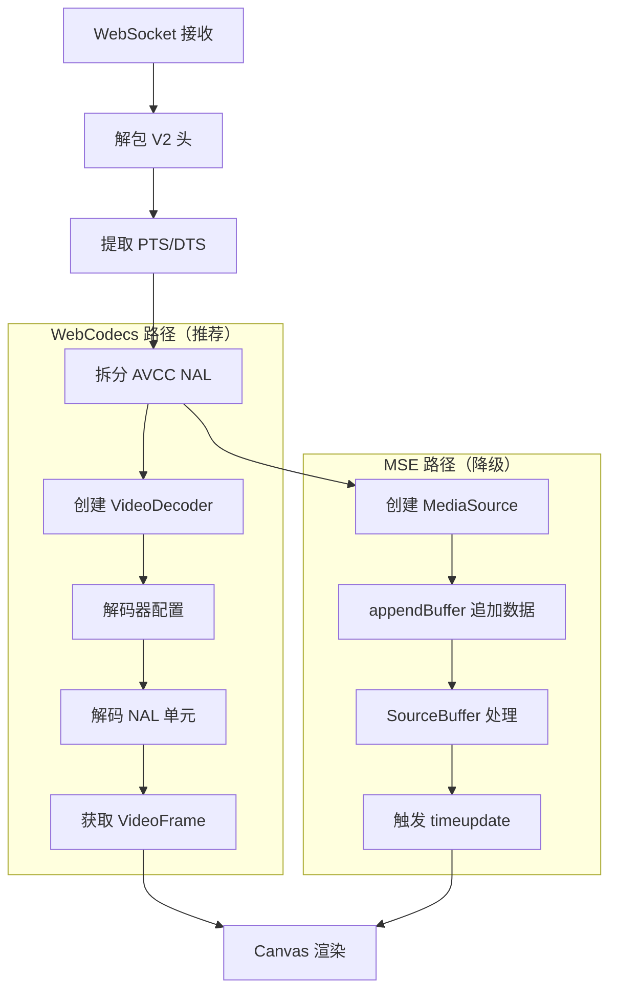

# Media Streaming Service

NE503 实现了从摄像头硬件采集到 Web 前端播放的完整低延迟视频管线，支持 RTSP 协议输出，并通过 Platform API 的 WebSocket 端点提供实时视频流推送。系统采用 DMA-BUF 零拷贝、引用计数帧分发、Unix Domain Socket 通信等技术，端到端延迟 < 100ms。

- **协议** — RTSP 1.0 + RTP/AVP/TCP 交织传输；H.264/H.265 FU-A 分片
- **零拷贝** — DMA-BUF FD 直通 + 引用计数，AI 推理路径无内存拷贝
- **双通道** — FD Passthrough（零拷贝）与 SHM Ring Buffer（单次 memcpy）共存，按 App 权限自动选择
- **多客户端** — 同一流可同时服务 RTSP、WebSocket、AI 推理等多个消费者
- **热更新** — 动态调整编码参数（码率、帧率、GOP），无需重启编码器

## 数据流架构



## Camera Daemon

Camera Daemon 是 NE503 平台的核心 C++ 服务，负责视频采集、帧分发、编码与多通道帧发布，直接操作 HAL 硬件抽象层。

### 整体架构



### 双通道帧分发

App 容器通过两种方式获取视频帧，Daemon 根据 App 权限自动选择。

#### FD Passthrough（零拷贝）— FdPublisher

适用可信 App（manifest 声明 `dma_buf: true`）。通过 `SCM_RIGHTS` 直接传递 DMA-BUF fd，App 使用 `mmap` 访问像素数据，全程零拷贝。每客户端最多同时持有 3 帧（背压保护），Watchdog 200ms 超时强制回收防止 HAL 缓冲区泄漏。

**通信协议（`fd_protocol.h`）：**

| 方向 | 消息 | 说明 |
|------|------|------|
| Client -> Server | `SUBSCRIBE(stream_name)` | 订阅视频流 |
| Server -> Client | `FRAME` + SCM_RIGHTS | 帧元数据 + DMA-BUF fd |
| Client -> Server | `RELEASE(frame_id)` | 归还帧 |
| Client -> Server | `UNSUBSCRIBE` | 取消订阅 |

#### SHM Ring Buffer（单次 memcpy）— ShmPublisher

适用所有 App（无需特殊容器权限）。帧数据 memcpy 到共享内存 Ring Buffer，App 通过 `mmap PROT_READ` 只读访问。内部缓存 DMA-BUF mmap 结果，避免每帧 mmap/munmap 系统调用。性能：640x640 NV12 约 0.1ms，4K 约 2ms。

#### 两种方式对比

| | FD Passthrough | SHM |
|---|---|---|
| 拷贝次数 | 0 | 1 次 memcpy |
| 640x640 延迟 | 约 0.03ms | 约 0.1ms |
| 4K 延迟 | 约 0.03ms | 约 2ms |
| 容器权限 | seccomp: ioctl, SCM_RIGHTS | 无特殊权限 |
| App 崩溃风险 | HAL 缓冲区泄漏（Watchdog 保护） | 无影响 |
| Python 接口 | recv_fd + mmap + np.frombuffer | mmap + np.frombuffer |
| 推荐场景 | AI 推理、高帧率处理 | 通用分析、图像保存 |

### 帧生命周期

#### 引用计数流程



#### Watchdog 强制回收

扫描线程每 50ms 检查未归还帧，超过 200ms 触发 `force_reclaim`：标记 `reclaimed=true` 并立即归还 HAL，但保留 ManagedFrame 对象。后续 `release()` 检查标记跳过 HAL 释放，ref_count 降为 0 时删除对象。

### 模块说明

| 模块 | 源文件 | 职责 |
|------|--------|------|
| **HalLoader** | `hal_loader.h/cpp` | 通过 `dlopen`/`dlsym` 动态加载 HAL 共享库（Video 必需，Codec/OSD 可选） |
| **VideoSource** | `video_source.h/cpp` | 封装 HAL Video 接口，Push 模式帧回调，支持多流（ISP 硬件缩放） |
| **FrameRouter** | `frame_router.h/cpp` | 引用计数帧分发核心，管理 `ManagedFrame` 生命周期（ref_count / reclaimed） |
| **FrameWatchdog** | `frame_watchdog.h/cpp` | 超时强制回收守护，100ms 扫描周期，500ms 超时阈值，300ms 告警阈值 |
| **FdPublisher** | `fd_publisher.h/cpp` | 零拷贝 DMA-BUF FD 发布，SCM_RIGHTS 传输，1 accept + N recv 线程模型 |
| **ShmPublisher** | `shm_publisher.h/cpp` | SHM Ring Buffer 帧发布，DMA-BUF mmap 缓存优化 |
| **OsdManager** | `osd_manager.h/cpp` | 按流管理 OSD 实例，就地像素修改（仅编码路径，不影响 AI 推理流） |
| **EncoderManager** | `encoder_manager.h/cpp` | 管理 HAL Codec 硬件编码器实例，支持运行时参数调整 |

`VideoSource` 关键点：4K 主流 + 640x640 AI 流 + 子流均为 ISP 硬件缩放输出，无软件缩放开销。

> AI 流（640x640）通过 DMA-BUF 直接分发给 AI Runtime，不经过硬件编码器。

## RTSP 服务器

RTSP 服务器实现 RTSP 1.0 + RTP/AVP/TCP 交织传输，支持 H.264/H.265，最多 8 个并发客户端，端口 8554。

### 状态机



### RTP FU-A 分片

当 NAL 单元大于 1390 字节时执行 FU-A 分片：



## 编码流发布

EncodedPublisher 采用双线程架构，将编码回调与网络分发解耦：

```mermaid
flowchart TD
    subgraph "编码回调线程 — 快速入队，非阻塞"
        A["编码回调 on_packet"] --> B[格式检查]
        B --> C[队列检查]
        C --> D{"V1(22B)/V2(30B)?"}
        D --> V1
        D --> V2
        V1 --> E["V1 头：4B 大小 + 1B 编码类型 + 1B 标志 + 8B PTS"]        V2 --> F["V2 头：4B 大小 + 1B 编码类型 + 1B 标志 + 8B PTS + 8B DTS"]
        E --> G[推入队列]
        F --> G
        G --> H[条件通知分发线程]
    end

    subgraph "分发线程 — 独立处理，避免阻塞编码"
        I[等待队列条件] --> J[出队帧数据]
        J --> K[关键帧检测]
        K --> L[UDP/TCP 广播]
        L --> M[统计更新]
    end

    H --> I
    M --> N{更多数据?}
    N-->|是| J
    N-->|否| O[休眠等待]
    O --> I
```

编码器输出 V1（22 字节）或 V2（30 字节）协议头，系统通过 `total_size >= 30` 自动检测版本。V2 头包含：4B 总大小 + 1B 编码类型（0=H264, 1=H265）+ 1B 标志（bit0=关键帧）+ 8B PTS + 8B DTS + 8B 保留。

> V1 头实际结构：4B 大小 + 1B 编码类型 + 1B 标志 + 8B PTS + 8B 保留字段 = 22 字节。

## H.264 WebSocket API

Platform-API 通过 WebSocket 端点 `/api/v1/h264/:stream` 转发 H.264 流，内部通过 UDS 连接 EncodedPublisher。

### 连接处理流程



### Annex-B 转 AVCC

编码器输出为 Annex-B 格式，WebSocket 传输需转换为 AVCC 格式（4 字节长度前缀）：



SPS/PPS 缓存确保新客户端连接时立即收到参数集，分辨率切换时自动刷新。

## 前端播放



- **WebCodecs（推荐）** — `VideoDecoder` 直接解码 NAL 单元，`VideoFrame` 通过 Canvas 渲染，延迟最低。
- **MSE（降级）** — `MediaSource` + `SourceBuffer` 交给浏览器内置解码器，兼容性更好。
- 内置指数退避重连（1s -> 10s），断连自动恢复。

## 性能参数

| 组件 | 参数 | 值 | 说明 |
|------|------|----|------|
| RTSP | epoll 超时 | 500ms | 平衡响应性与资源占用 |
| RTSP | 发送缓冲区 | 4MB | 避免 TCP 阻塞 |
| RTSP | RTP_MTU | 1390 字节 | IP + TCP + RTP + FU-A 开销 |
| RTSP | 最大客户端数 | 8 | 并发连接上限 |
| RTSP | 端到端延迟 | 编码约 20ms + 网络约 30ms + 渲染约 30ms | 目标 < 100ms |
| Publisher | 协议版本 | V1 (22B) / V2 (30B) | 自动检测 |
| Publisher | 队列大小 | 无限制 | 避免丢帧 |
| WebSocket | 自动重连 | 指数退避 1s -> 10s | 最多 5 次递增 |
| WebSocket | 心跳间隔 | 30s | 保活探测 |
| WebSocket | 空闲超时 | 5 分钟 | 无数据自动断开 |

## 配置

```yaml
hal:
  video_library: /opt/aipc/lib/hal/hal-hailo15.so
  codec_library: ""
  osd_library: ""

video:
  device_path: /dev/video0
  streams:
    - { name: main, width: 3840, height: 2160, fps: 30, pool: 8 }
    - { name: ai,   width: 640,  height: 640,  fps: 15, pool: 6 }
    - { name: sub,  width: 640,  height: 480,  fps: 10, pool: 4 }

shm:
  directory: /run/aipc/shm
  buffer_count: 4

fd_publisher:
  sock_path: /run/aipc/camera.sock
  max_clients: 16
  max_outstanding_per_client: 3

watchdog:
  scan_interval_ms: 100
  frame_timeout_ms: 500
  warn_threshold_ms: 300

encoder:
  main:
    codec: h264
    width: 1920
    height: 1080
    bitrate: 4000000
    fps: 30
    gop: 30
    profile: high
    level: 4.1
  sub:
    codec: h264
    width: 1280
    height: 720
    bitrate: 2000000
    fps: 30
    gop: 60
```

> 上述示例中子流采集与编码分辨率不同，实际部署时建议编码分辨率不超过采集分辨率以避免上采样浪费码率。

```yaml
rtsp:
  enabled: true
  port: 8554
  max_clients: 8
  buffer_size: 4194304
  timeout: 500

websocket:
  path: /api/v1/h264
  max_reconnect_delay: 10
  initial_reconnect_delay: 1
  idle_timeout: 300
  ping_interval: 30
```

| 操作 | 热更新 | 全量重配置 |
|------|--------|------------|
| 影响 | 无缝，< 50ms | 重启编码器，约 100ms |
| 参数 | 码率、帧率、GOP | 分辨率、编码格式 |
| 体验 | 无中断 | 短暂黑屏 |

## 相关文档

- [NE503 概览](../0-overview.md) — 产品核心能力与规格总览
- [软件平台](../3-software-platform/0-platform-architecture.md) — 平台架构与容器化应用
- [平台开发](../5-platform-development/0-development-guide.md) — SDK 与开发工具链
