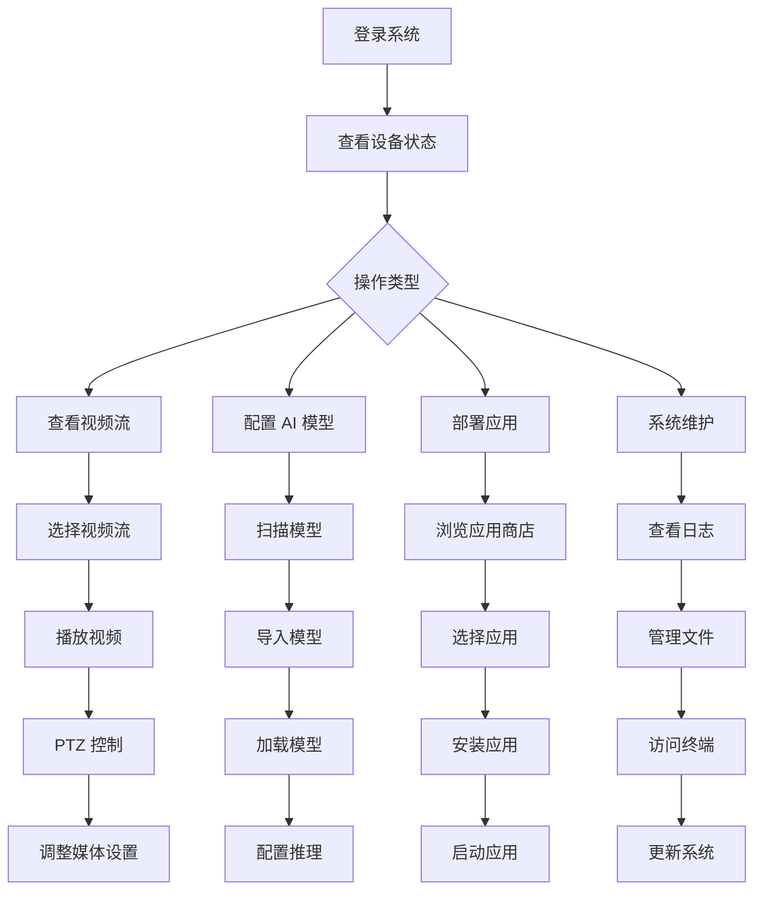
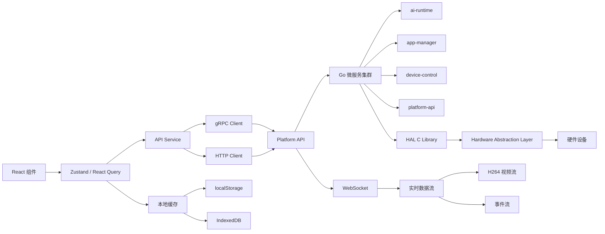
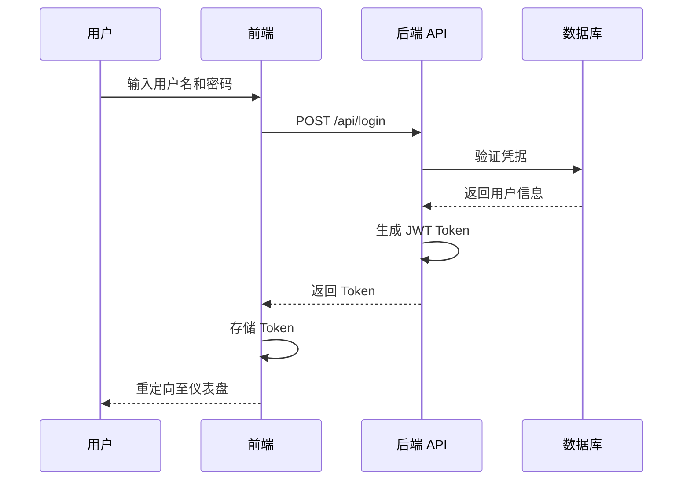
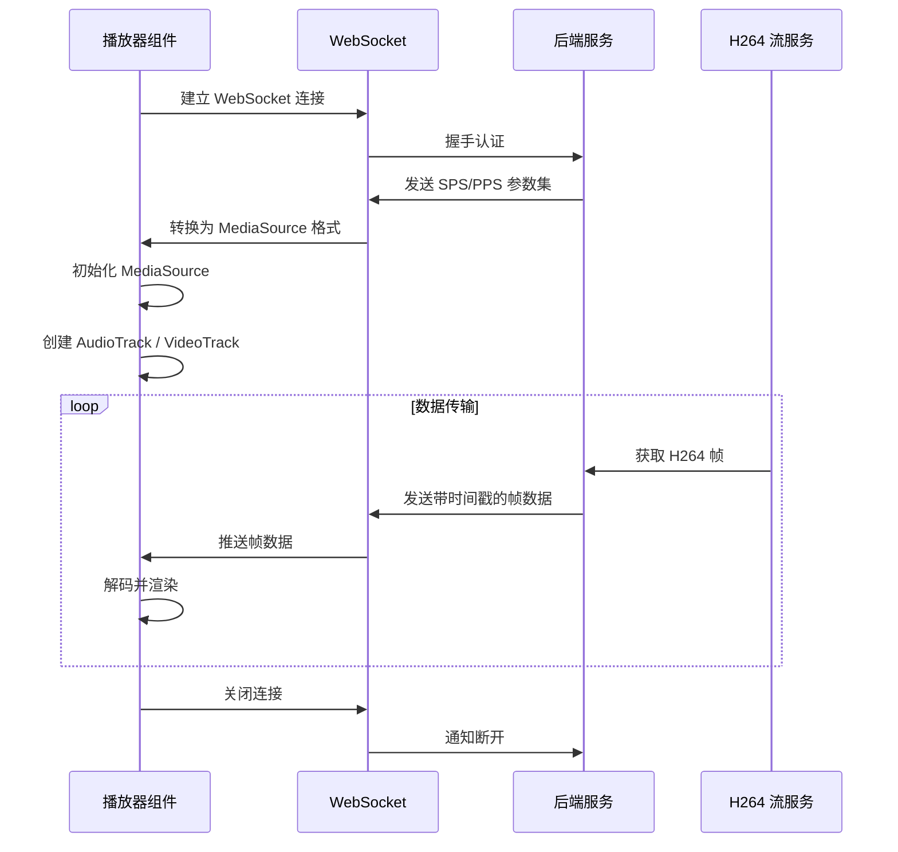
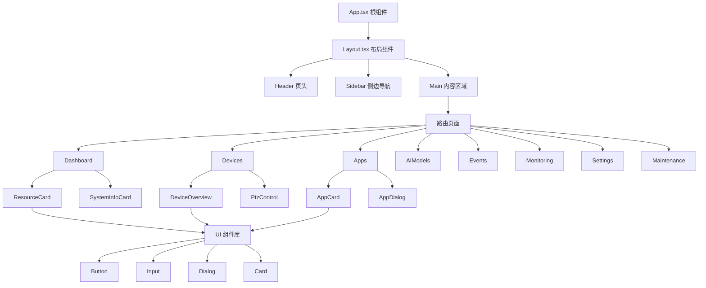

---

# Web Console Service

## 1 概述

Web Console 是 NE503 AI IPC 的 Web 管理界面，提供设备监控与控制、AI 模型管理、容器应用管理、系统监控、事件查看以及远程维护等功能。

技术栈：**React + TypeScript + Vite**，UI 组件基于 shadcn/ui + Tailwind CSS，状态管理采用 Zustand + React Query，视频流通过 WebSocket + Media Source Extensions 实现 H.264 实时播放。

核心功能：

- **设备监控与控制** — 视频流播放、PTZ 控制、GPIO、灯光/镜头调节
- **AI 模型管理** — 模型加载/卸载、推理配置、性能监控
- **容器应用管理** — 应用安装/启停、日志查看、终端访问
- **系统监控** — CPU/NPU/内存/存储实时监控
- **事件系统** — Topic 订阅、事件发布、实时事件流
- **远程维护** — 系统日志、文件管理、Web 终端

## 2 页面导航结构

```mermaid
graph TD
    A[Web Console] --> B[登录页]
    A --> C[仪表盘]
    A --> D[媒体/视频]
    A --> E[设备管理]
    A --> F[应用管理]
    A --> G[AI 模型]
    A --> H[事件查看器]
    A --> I[系统监控]
    A --> J[系统设置]
    A --> K[存储管理]
    A --> L[系统维护]

    C --> C1[系统概览]
    C --> C2[资源卡片]
    C --> C3[设备状态]
    C --> C4[应用统计]
    C --> C5[模型统计]

    D --> D1[主码流]
    D --> D2[子码流]
    D --> D3[第三方流]
    D --> D4[PTZ 控制]
    D --> D5[媒体设置]

    E --> E1[设备概览]
    E --> E2[灯光控制]
    E --> E3[镜头控制]
    E --> E4[PTZ 控制]
    E --> E5[GPIO 控制]

    F --> F1[应用商店]
    F --> F2[已安装应用]
    F --> F3[运行中应用]
    F --> F4[应用详情]
    F --> F5[容器日志]
    F --> F6[终端访问]

    G --> G1[模型列表]
    G --> G2[模型详情]
    G --> G3[模型导入]
    G --> G4[推理配置]

    H --> H1[Topic 订阅]
    H --> H2[发布事件]
    H --> H3[实时流]

    I --> I1[CPU 使用率]
    I --> I2[NPU 使用率]
    I --> I3[内存使用率]
    I --> I4[存储使用率]

    J --> J1[设备信息]
    J --> J2[网络设置]
    J --> J3[时间设置]
    J --> J4[视频设置]
    J --> J5[图像设置]
    J --> J6[音频设置]
    J --> J7[主题设置]

    K --> K1[存储概览]
    K --> K2[空间分析]
    K --> K3[存储清理]

    L --> L1[系统日志]
    L --> L2[文件管理]
    L --> L3[进程管理]
    L --> L4[终端访问]
```



## 3 核心功能模块

### 3.1 仪表盘

系统总览页面，提供设备运行状态的全局视图：

| 卡片 | 内容 |
|------|------|
| **系统概览** | 设备名称、型号、固件版本、MAC 地址、IP 地址、运行时长 |
| **资源监控** | CPU 使用率与核心数、NPU 使用率、内存使用量、存储用量（eMMC） |
| **设备状态** | 在线/离线摄像头数量、设备健康状态指示 |
| **应用统计** | 容器总数、运行数、停止数、应用详情列表 |
| **模型统计** | 已加载模型数量、模型加载时间排名 |

### 3.2 媒体（视频流管理）

多码流视频管理与播放功能：

- **多码流支持** — 主码流（主视频流）、子码流（辅助流）、第三方流
- **视频播放器** — H.264 实时流播放、双击全屏、控制面板切换、流统计信息显示、自动重连
- **PTZ 控制** — 方向键控制、速度调节、预置位管理、焦距/光圈控制
- **媒体设置** — 分辨率、帧率、编码参数配置

### 3.3 设备管理

设备硬件控制与管理：

| 功能 | 说明 |
|------|------|
| **设备概览** | 基本设备信息、硬件状态监控、连接状态指示 |
| **灯光控制** | LED 开关、亮度调节、色温调节 |
| **镜头控制** | 对焦、变焦、光圈调节 |
| **PTZ 控制** | 方向控制（上下左右）、速度预置、绝对位置控制 |
| **GPIO 控制** | 输入/输出状态监控、电平控制、状态切换 |

### 3.4 应用管理

容器应用全生命周期管理：

- **应用商店** — 应用模板浏览、搜索与筛选、导入新应用
- **应用列表** — 卡片/列表视图切换、状态筛选（全部/运行中/已停止/失败）、搜索
- **应用操作** — 安装、启动、停止、重启、卸载
- **高级功能** — 容器日志查看、终端访问、进程管理

### 3.5 AI 模型管理

AI 模型生命周期管理：

- **模型列表** — 卡片/列表视图、搜索、状态筛选（已加载/未加载）
- **模型操作** — 加载模型到 NPU、卸载模型、扫描新模型
- **模型详情** — 模型信息查看、性能指标、资源使用
- **推理配置** — 推理参数设置、性能优化选项、批量处理配置

### 3.6 事件查看器

实时事件监控与处理：

- **Topic 订阅** — 通配符模式支持、订阅状态管理、Topic 浏览
- **事件发布** — 手动事件发布、事件格式配置、测试发布
- **实时流** — 实时事件显示、滚动与暂停、时间戳显示、过滤功能

### 3.7 系统监控

实时系统资源监控：

| 监控项 | 内容 |
|--------|------|
| **CPU** | 使用率历史图表、核心负载分布、温度监控 |
| **NPU** | AI 加速器使用率、推理任务统计、性能计数器 |
| **内存** | 内存使用量、可用内存、缓存使用 |
| **存储** | 磁盘使用量、I/O 性能统计、文件系统状态 |

### 3.8 系统设置

系统配置与管理：

- **设备信息** — 硬件详情、系统信息、网络配置
- **网络设置** — 有线/无线配置、静态 IP、DNS、网络诊断
- **时间设置** — 时区选择、NTP 配置、手动时间设置
- **媒体设置** — 视频编码参数、图像质量、音频配置
- **主题设置** — 明暗主题切换、自定义主题

### 3.9 存储管理

存储空间管理与优化：

- **存储概览** — 容量使用、文件系统类型、分区信息
- **空间分析** — 按类型分类、大文件查找、使用趋势
- **存储清理** — 临时文件清理、日志文件管理、缓存清理

### 3.10 系统维护

高级系统维护功能：

- **系统日志** — 实时日志查看、日志级别过滤、日志导出
- **文件管理** — 文件浏览、上传/下载、权限管理
- **终端访问** — Web 终端、命令执行、输出查看
- **进程管理** — 进程列表、进程控制、资源使用监控

## 4 典型操作流程



## 5 数据流架构



前端通过 Zustand 管理全局状态（认证、主题、系统统计），通过 React Query 处理数据获取与缓存。API Service 层封装了 gRPC 和 HTTP 两种通信方式，分别对接不同的后端微服务。实时数据（视频流、事件流）通过 WebSocket 通道传输。

## 6 API 接口

开发模式下，请求通过 Vite 代理转发；生产环境下直接访问后端 API。

**主要 API 端点**：

| 端点前缀 | 功能 |
|----------|------|
| `/api/v1/auth/*` | 认证（登录、JWT Token 管理） |
| `/api/v1/h264/*` | H.264 视频流 |
| `/api/v1/devices/*` | 设备管理 |
| `/api/v1/apps/*` | 应用管理 |
| `/api/v1/models/*` | 模型管理 |
| `/api/v1/events/*` | 事件处理 |
| `/api/v1/system/*` | 系统监控 |

### 6.1 登录认证流程



认证采用 JWT Token 机制。登录成功后，前端将 Token 存储在本地，后续所有 API 请求通过 Authorization Header 携带 Token 进行身份验证。

### 6.2 WebSocket 视频流传输



视频流传输流程：

1. **连接建立** — 播放器通过 WebSocket 连接后端，完成握手认证
2. **初始化** — 后端发送 SPS/PPS 参数集，前端初始化 MediaSource 和 Track
3. **数据传输** — H264 流服务获取帧数据，通过 WebSocket 按时间戳推送，前端解码渲染
4. **断开清理** — 关闭 WebSocket 连接并通知后端释放资源

:::tip 视频流传输说明
Safari 不支持 WebCodecs，自动降级为 Media Source Extensions 方案，性能可能略有降低。推荐使用 Chrome 88+ 或 Edge 88+ 以获得最佳体验。
:::

## 7 前端架构

### 7.1 技术选型

| 类别 | 技术方案 |
|------|---------|
| 路由 | React Router v6 |
| 状态管理 | Zustand（轻量全局状态）+ React Query（数据获取） |
| UI 组件 | shadcn/ui + Tailwind CSS |
| 国际化 | react-i18next |
| 构建工具 | Vite |
| 测试框架 | Vitest |
| 代码规范 | ESLint + Prettier |

### 7.2 组件层级



### 7.3 状态管理

全局状态通过 Zustand 管理，按职责划分为三个 Store：

| Store | 管理内容 |
|-------|---------|
| **Auth Store** | 登录状态、用户信息、Token 管理 |
| **Theme Store** | 主题设置、语言配置 |
| **System Stats** | CPU/NPU/内存/存储使用率 |

页面级状态（仪表盘数据、设备控制、应用列表、模型列表等）由各页面组件自行管理，通过 React Query 获取和缓存远程数据。

### 7.4 项目目录结构

```
src/
├── components/          # 共享组件
│   ├── ui/            # 基础 UI 组件
│   └── player/        # 播放器组件
├── pages/             # 页面组件
│   ├── dashboard/     # 仪表盘
│   ├── devices/       # 设备管理
│   ├── apps/          # 应用管理
│   ├── ai-models/     # AI 模型
│   ├── events/        # 事件查看器
│   ├── monitoring/    # 系统监控
│   ├── settings/      # 系统设置
│   └── maintenance/   # 系统维护
├── services/          # API 服务封装
├── store/             # Zustand 状态管理
├── lib/               # 工具库
│   └── videoStream/  # 视频流处理
├── hooks/             # 自定义 Hooks
├── styles/            # 样式文件
└── utils/             # 工具函数
```

## 8 开发构建

### 8.1 环境要求

- Node.js：18+ / 20+
- 包管理器：pnpm
- 操作系统：Windows / macOS / Linux

### 8.2 常用命令

```bash
# 安装依赖
pnpm install

# 开发环境启动（http://localhost:5174）
pnpm dev

# 生产构建
pnpm build

# 类型检查
pnpm exec tsc --noEmit

# 测试
pnpm test           # 交互式测试
pnpm test:run       # 单次运行
pnpm test:coverage  # 覆盖率报告

# 代码检查与格式化
pnpm lint           # ESLint 检查
pnpm lint:fix       # 自动修复
pnpm format         # Prettier 格式化
pnpm format:check   # 格式检查
```

## 9 浏览器兼容性

| 特性 | Chrome 88+ | Firefox 78+ | Safari 14+ | Edge 88+ |
|------|-----------|-------------|------------|----------|
| WebCodecs | 支持 | 支持 | **不支持** | 支持 |
| Media Source Extensions | 支持 | 支持 | 支持 | 支持 |
| WebSocket | 支持 | 支持 | 支持 | 支持 |
| Service Worker | 支持 | 支持 | 支持 | 支持 |
| WebAssembly | 支持 | 支持 | 支持 | 支持 |

已知限制：

- **Safari** 不支持 WebCodecs，自动降级为 MSE，性能略低
- **移动端浏览器** 部分功能可能受限，推荐使用桌面浏览器
- **旧版浏览器** 可能需要 Polyfill 支持 ES6+ 特性

## 10 相关文档

- [AI Runtime 服务](./0-ai-runtime.md) — NPU 推理调度与模型生命周期管理
- [Event Bus 服务](./2-event-bus.md) — 事件总线与消息订阅发布
- [Device Control 服务](./3-device-control.md) — 设备硬件控制服务
- [Device Discovery 服务](./4-device-discovery.md) — 设备发现与注册服务
- [Media Streaming 服务](./5-media-streaming.md) — 媒体流传输服务
