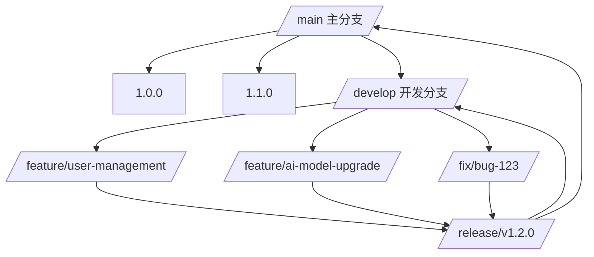
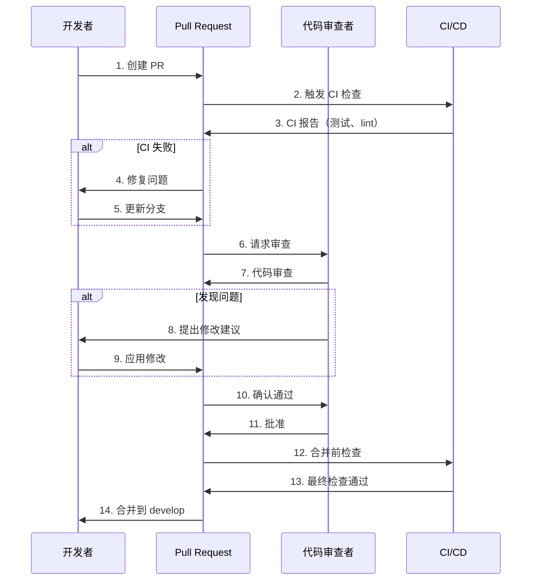

# Platform Contributing Guide

本文档是 NE503 AIPC 平台的完整贡献指南，涵盖从开发环境搭建到版本发布的全流程规范。无论你是首次参与的新贡献者还是核心维护者，都应遵循本指南中的代码风格、Git 工作流、测试要求和审查标准。

## 1 项目概览与技术栈

### 1.1 项目介绍

NE503 AIPC 平台是一个通用边缘 AI 计算平台，为智能 IPC、工业相机和边缘计算盒子提供统一的 AI 驱动设备基础。平台支持多款 SoC（Hailo-15、RK3588、Jetson），通过硬件抽象层实现与硬件无关的 AI 应用部署。

### 1.2 架构总览

```
┌─────────────────────────────────────────────┐
│    应用容器层                                │
│  - 业务服务 (Python/Go/C++)                  │
│  - 模型服务 (推理管线)                        │
└────────────┬────────────────────────────────┘
             │ SDK (gRPC + SHM IPC)
┌────────────┴────────────────────────────────┐
│    平台服务层 (Go + C++)                     │
│  - camera-daemon   - ai-runtime             │
│  - event-bus       - app-manager            │
│  - device-control  - platform-api           │
└────────────┬────────────────────────────────┘
             │ HAL C API
┌────────────┴────────────────────────────────┐
│    硬件抽象层 (C/C++)                        │
│  - hal_video  - hal_ml  - hal_codec  - hal_io│
└─────────────────────────────────────────────┘
```

### 1.3 技术栈

| 层级 | 技术 | 说明 |
|------|------|------|
| **应用层** | Python/Go/C++ | 业务服务与模型推理服务 |
| **平台服务** | Go 1.25+ | 微服务架构，gRPC 通信 |
| **硬件抽象** | C/C++ | 跨平台硬件接口 |
| **容器运行时** | containerd | 应用隔离与运行环境 |
| **Web 控制台** | React + TypeScript | 管理界面 |
| **通信协议** | gRPC + Unix Socket | 高性能 IPC |
| **事件系统** | 自定义 Pub/Sub | 支持通配符主题 |

### 1.4 核心特性

- **容器隔离**：基于 containerd + seccomp + capabilities + namespace
- **零拷贝优化**：视频到 AI 管线使用 DMA-BUF，进程间通信使用 SHM
- **多 SoC 支持**：Hailo-15、RK3588、Jetson 等
- **插件系统**：同时支持 gRPC 和事件驱动通信
- **细粒度权限**：视频、推理、设备、网络的独立访问控制
- **实时监控**：应用状态、资源使用、日志采集

## 2 开发环境搭建

### 2.1 快速开始

```bash
# 1. 克隆仓库
git clone <repo-url>
cd platform

# 2. 安装基础依赖
sudo apt update
sudo apt install -y build-essential git cmake \
    protobuf-compiler python3 python3-pip \
    libgstreamer1.0-dev libgstreamer-plugins-base1.0-dev

# 3. 安装 Go
wget https://go.dev/dl/$(curl -s https://go.dev/VERSION?m=text).linux-amd64.tar.gz
sudo tar -C /usr/local -xzf go*.linux-amd64.tar.gz
export PATH=$PATH:/usr/local/go/bin

# 4. 初始化 Go 模块
go mod download

# 5. 构建项目
make all

# 6. 运行测试
make test

# 7. 启动服务
./scripts/start_mvp.sh
```

### 2.2 Docker 开发环境（推荐，需联系团队获取镜像地址）

使用预配置的 Docker 容器进行开发，避免本地环境差异：

```bash
# 1. 构建开发镜像（管理员操作）
docker/dev/build.sh /opt/poky/4.0.23 <registry>/ne503-dev-env:v1.0
docker push <registry>/ne503-dev-env:v1.0

# 2. 普通用户流程
docker pull <registry>/ne503-dev-env:v1.0
make docker-dev                    # 启动持久化开发容器
make docker-dev-shell              # 进入容器

# 3. 挂载源码进行开发
make docker-dev-mount              # 挂载宿主源码目录
docker exec -it ne503-dev-mount bash
```

> 以上 Docker 相关 Makefile 目标需要项目已配置 Docker 开发环境，具体可用目标请参考项目的 Makefile。

### 2.3 工具链安装

```bash
# Go 工具链
go install google.golang.org/protobuf/cmd/protoc-gen-go@latest
go install google.golang.org/grpc/cmd/protoc-gen-go-grpc@latest
go install golang.org/x/tools/cmd/goimports@latest
go install github.com/golangci/golangci-lint/cmd/golangci-lint@latest

# Python 工具链
pip3 install grpcio grpcio-tools pytest pytest-cov black flake8 isort

# C/C++ 工具链
sudo apt install -y clang-format clang-tidy cmake

# TypeScript 工具链
npm install -g typescript eslint prettier @typescript-eslint/parser
```

### 2.4 IDE 配置

#### VS Code

```json
{
  "go.lintTool": "golangci-lint",
  "go.lintOnSave": "workspace",
  "go.lintOnFormat": true,
  "go.useLanguageServer": true,
  "gopls.env": {
    "GOFLAGS": "-mod=mod"
  },
  "[go]": {
    "editor.formatOnSave": true,
    "editor.codeActionsOnSave": {
      "source.organizeImports": true
    }
  },
  "[python]": {
    "editor.formatOnSave": true,
    "editor.codeActionsOnSave": {
      "source.organizeImports": true
    }
  },
  "editor.formatOnSave": true
}
```

#### GoLand / IntelliJ IDEA

1. 安装 Go 插件
2. 配置 Go SDK 为 1.25+
3. 设置 golangci-lint 为代码检查工具
4. 配置 File Watchers 实现自动格式化

## 3 代码风格指南

### 3.1 Go 代码规范

#### 格式化工具

```bash
# 自动格式化 Go 代码
make fmt

# 或使用 gofmt
gofmt -w .

# 使用 goimports（同时处理 import 排序）
goimports -w .
```

#### 代码原则

```go
// 小接口原则
type Logger interface {
    Log(msg string)
}

// 错误包装
func CreateUser(user User) (*User, error) {
    if user.Email == "" {
        return nil, fmt.Errorf("invalid user: %w", ErrInvalidEmail)
    }
    // ...
}

// 依赖注入
func NewUserService(repo UserRepository, logger Logger) *UserService {
    return &UserService{repo: repo, logger: logger}
}
```

#### 函数设计

```go
// 单一职责
func (s *UserService) Validate(user *User) error {
    // 只做校验
}

// 错误处理
func (s *UserService) Create(user *User) error {
    if err := s.Validate(user); err != nil {
        return fmt.Errorf("validate failed: %w", err)
    }

    // 创建逻辑
    if err := s.repo.Create(user); err != nil {
        return fmt.Errorf("create failed: %w", err)
    }

    return nil
}

// Options 模式
type ServerOption func(*Server)

func WithPort(port int) ServerOption {
    return func(s *Server) { s.port = port }
}

func NewServer(opts ...ServerOption) *Server {
    s := &Server{port: 8080}
    for _, opt := range opts {
        opt(s)
    }
    return s
}
```

### 3.2 C/C++ 代码规范

#### 格式化工具

```bash
# 安装 clang-format
sudo apt install clang-format

# 格式化 C/C++ 代码
find . -name "*.h" -o -name "*.cpp" -o -name "*.c" | xargs clang-format -i
```

#### 代码格式

```cpp
// 头文件包含顺序
#include <vector>    // 标准库
#include <memory>    // C++ 标准库
#include "hal_video.h"  // 项目头文件

// 类定义
class VideoHandler {
public:
    VideoHandler();
    ~VideoHandler();

    int Init(const Config& config);
    void ProcessFrame(const Frame& frame);

private:
    std::unique_ptr<Impl> impl_;
    std::vector<Frame> buffer_;
};

// 函数实现
int VideoHandler::Init(const Config& config) {
    if (!config.IsValid()) {
        return -EINVAL;
    }

    try {
        impl_ = std::make_unique<Impl>(config);
        return 0;
    } catch (const std::exception& e) {
        LOG_ERROR("Init failed: %s", e.what());
        return -1;
    }
}
```

### 3.3 Python 代码规范

#### 格式化工具

```bash
# 安装 black 和 isort
pip install black isort

# 格式化 Python 代码
black .
isort .
```

#### 代码风格

```python
# 类型注解
from typing import List, Optional
import hailo_ipc_sdk as sdk

class App:
    def __init__(self, config: Config) -> None:
        self.inference_client: Optional[sdk.InferenceClient] = None
        self.config = config

    def process_frame(self, frame: sdk.Frame) -> List[sdk.Detection]:
        """处理单帧图像"""
        if not self.inference_client:
            raise RuntimeError("Client not initialized")

        results = self.inference_client.infer("yolov8n", frame)
        return results.objects

    def run(self) -> None:
        """主循环"""
        try:
            while True:
                frame = self.get_frame()
                detections = self.process_frame(frame)
                self.handle_detections(detections)
        except KeyboardInterrupt:
            logger.info("Shutting down...")
```

### 3.4 TypeScript/React 代码规范

#### 格式化工具

```bash
# 在 web/console 目录下
npm run format  # 运行 prettier
npm run lint    # 运行 ESLint
```

#### 组件设计

```tsx
// 组件命名：PascalCase
export function ApplicationList() {
  // 状态管理使用 useState
  const [applications, setApplications] = useState<Application[]>([]);

  // 副作用使用 useEffect
  useEffect(() => {
    fetchApplications();
  }, []);

  // 事件处理使用 useCallback
  const handleInstall = useCallback((manifest: Manifest) => {
    // 实现安装逻辑
  }, []);

  return (
    <div className="application-list">
      {/* 使用语义化标签 */}
      <header className="list-header">
        <h2>应用列表</h2>
      </header>

      {/* 无障碍访问 */}
      <button
        onClick={handleInstall}
        aria-label="安装应用"
      >
        安装
      </button>
    </div>
  );
}
```

### 3.5 跨语言通用规范

#### 文件命名

| 语言 | 命名风格 | 示例 |
|------|---------|------|
| Go | `snake_case.go` | `user_service.go` |
| C/C++ | `snake_case.h`/`.cpp` | `video_handler.h` |
| Python | `snake_case.py` | `app_main.py` |
| TypeScript | `PascalCase.tsx` | `AppList.tsx` |
| 配置文件 | `snake_case.yaml` | `app_manager.yaml` |

#### 注释规范

```go
// 包级注释
// Package appmanager 为 AIPC 平台容器提供应用生命周期管理功能。
package appmanager

// 接口注释
// InferenceClient 处理模型推理请求
type InferenceClient interface {
    // 订阅模型推理结果
    Subscribe(stream string, model string, fps int) <-chan Result

    // 执行单次推理
    Infer(model string, data []byte) (*Result, error)
}
```

## 4 Git 工作流

### 4.1 分支策略



### 4.2 分支类型

| 分支类型 | 命名规则 | 说明 |
|---------|---------|------|
| 主分支 | `main` | 生产代码，始终保持稳定 |
| 开发分支 | `develop` | 所有功能分支的集成分支 |
| 功能分支 | `feature/*` | 新功能开发 |
| 修复分支 | `fix/*` | Bug 修复 |
| 发布分支 | `release/*` | 发布准备 |
| 热修复分支 | `hotfix/*` | 紧急修复 |

### 4.3 提交信息规范

遵循 Conventional Commits 格式：

```bash
# 格式: <type>: <description>
#
# 类型:
# feat:     新功能
# fix:      Bug 修复
# docs:     文档更新
# style:    代码格式化
# refactor: 重构
# perf:     性能优化
# test:     测试相关
# chore:    构建或辅助工具变更

# 示例
feat: add user authentication
fix: resolve memory leak in video handler
docs: update API documentation
style: format Go code with gofmt
refactor: extract common interface for inference
perf: optimize database query
test: add unit tests for app manager
chore: update Makefile dependencies
```

### 4.4 分支操作

#### 创建分支

```bash
# 创建功能分支
git checkout -b feature/user-management develop

# 创建修复分支
git checkout -b fix/bug-123 develop

# 创建发布分支
git checkout -b release/v1.2.0 develop
```

#### 合并分支

```bash
# 1. 确保分支是最新的
git fetch origin
git rebase origin/develop

# 2. 检查代码质量
make fmt
make lint
make test

# 3. 推送分支
git push origin feature/user-management

# 4. 创建 Pull Request
gh pr create --title "feat: add user management" --body "$(cat <<'EOF'
## Summary
实现用户管理功能，包括：
- 用户注册和登录
- 权限管理
- 会话管理

## Test Plan
- [x] 单元测试
- [x] 集成测试
- [x] 手动测试

## Related Issues
Closes #123
EOF
)"
```

### 4.5 Pull Request 流程



### 4.6 Merge Request 模板

```markdown
## Summary
简要描述本次 PR 的目的和主要内容

## Changes
- [ ] 功能 A
- [ ] 功能 B
- [ ] Bug 修复 C
- [ ] 文档更新

## Test Results
- [x] 单元测试通过
- [x] 集成测试通过
- [ ] 端到端测试通过
- [ ] 性能测试通过

## Breaking Changes
如有破坏性变更，请在此描述

## Related Issues
Closes #123
Related to #456
```

## 5 代码审查标准

### 5.1 审查流程

**提交前自检：**

```bash
# 格式化代码
make fmt

# 运行 lint
make lint

# 运行测试
make test

# 检查提交信息
git log --oneline -1
```

**审查内容覆盖：**
- 代码风格与命名规范
- 功能实现的正确性
- 错误处理的完整性
- 性能影响评估
- 安全性考量
- 测试覆盖率

### 5.2 审查检查清单

#### 代码质量

- 函数长度不超过 50 行
- 文件大小不超过 800 行
- 嵌套层级不超过 4 层
- 变量命名有意义
- 必要注释已添加

#### 安全性

- 无硬编码密钥/密码
- 输入已做校验
- 错误信息不泄露敏感数据
- 使用安全的库函数

#### 性能

- 避免 N+1 查询
- 使用合适的数据结构
- 考虑内存使用量

#### 测试

- 新功能有对应的测试
- 测试覆盖率不低于 80%
- 包含边界条件测试

### 5.3 审查工具

```bash
# 运行代码审查
make lint

# Go 代码审查
golangci-lint run --enable=unused

# 安全审查
gosec ./...

# Python 代码审查
flake8 .
black --check .
isort --check-only .

# TypeScript 代码审查
cd web/console && npm run lint
```

### 5.4 审查反馈格式

建议使用以下结构化格式给出反馈：

```
### 总体评价
（对代码整体质量的评估）

### 主要问题
1. **问题类型** (Critical/High/Medium/Low)
   - 具体描述
   - 建议的修复方式

2. **问题类型**
   - 具体描述
   - 建议的修复方式

### 亮点
1. （代码中值得肯定的部分）
```

### 5.5 审查等级定义

| 等级 | 含义 | 操作 |
|------|------|------|
| **Critical** | 安全漏洞或数据丢失风险 | **必须修复**，否则不予合并 |
| **High** | 功能缺陷或显著质量问题 | **应当修复**，谨慎合并 |
| **Medium** | 可维护性问题 | **建议修复**，可选择性合并 |
| **Low** | 优化建议或风格问题 | **可选修复** |

## 6 测试要求

### 6.1 测试类型

| 测试类型 | 覆盖率要求 | 工具 | 说明 |
|---------|-----------|------|------|
| **单元测试** | 80%+ | Go: `go test` | 测试单个函数和组件 |
| **集成测试** | 必须 | `test/integration/` | 测试组件间交互 |
| **端到端测试** | 关键流程 | Playwright | 完整业务流程验证 |

### 6.2 Go 测试规范

#### 测试文件组织

```
platform/
├── user_service.go
├── user_service_test.go      # 单元测试
└── integration/
    ├── user_service_test.go   # 集成测试
    └── mocks/                 # Mock 对象
```

#### 测试示例

```go
// user_service_test.go
package appmanager

import (
    "testing"
    "github.com/stretchr/testify/assert"
)

func TestUserService_CreateUser(t *testing.T) {
    tests := []struct {
        name    string
        user    User
        wantErr bool
    }{
        {
            name: "valid user",
            user: User{
                Email: "test@example.com",
                Name:  "Test User",
            },
            wantErr: false,
        },
        {
            name: "empty email",
            user: User{
                Email: "",
                Name:  "Test User",
            },
            wantErr: true,
        },
    }

    for _, tt := range tests {
        t.Run(tt.name, func(t *testing.T) {
            service := NewUserService(mockRepo)

            err := service.CreateUser(tt.user)

            if tt.wantErr {
                assert.Error(t, err)
                return
            }

            assert.NoError(t, err)
            assert.NotEmpty(t, tt.user.ID)
        })
    }
}
```

#### 性能基准测试

```go
func BenchmarkUserService_CreateUser(b *testing.B) {
    service := NewUserService(mockRepo)
    user := User{
        Email: "test@example.com",
        Name:  "Test User",
    }

    b.ResetTimer()
    for i := 0; i < b.N; i++ {
        _, _ = service.CreateUser(user)
    }
}
```

### 6.3 Python 测试规范

```python
# tests/test_app.py
import unittest
from unittest.mock import Mock, patch
import sys
import os

# 添加应用路径
sys.path.append(os.path.join(os.path.dirname(__file__), '..'))

class TestApp(unittest.TestCase):
    def setUp(self):
        self.app = App()

    def test_init(self):
        """测试应用初始化"""
        self.assertEqual(self.app.config.mode, "production")
        self.assertTrue(self.app.running)

    @patch('app.InferenceClient')
    def test_inference_client(self, mock_client):
        """测试推理客户端"""
        mock_client.return_value.subscribe.return_value = iter([])
        result = self.app.inference_client()
        self.assertIsNotNone(result)

    def test_memory_usage(self):
        """测试内存使用"""
        import psutil
        process = psutil.Process()

        initial_mem = process.memory_info().rss / 1024 / 1024  # MB

        for i in range(1000):
            self.app.process_frame(f"frame_{i}")

        final_mem = process.memory_info().rss / 1024 / 1024  # MB
        mem_growth = final_mem - initial_mem

        self.assertLess(mem_growth, 100, "Excessive memory growth")

if __name__ == '__main__':
    unittest.main()
```

### 6.4 C/C++ 测试规范

```cpp
// user_service_test.cpp
#include <gtest/gtest.h>
#include "user_service.h"

class UserServiceTest : public ::testing::Test {
protected:
    void SetUp() override {
        service_ = std::make_unique<UserService>();
    }

    void TearDown() override {
        service_.reset();
    }

    std::unique_ptr<UserService> service_;
};

TEST_F(UserServiceTest, CreateUserSuccess) {
    User user;
    user.email = "test@example.com";
    user.name = "Test User";

    auto result = service_->CreateUser(user);

    EXPECT_TRUE(result.success);
    EXPECT_FALSE(result.id.empty());
}

TEST_F(UserServiceTest, CreateUserInvalidEmail) {
    User user;
    user.email = "";
    user.name = "Test User";

    auto result = service_->CreateUser(user);

    EXPECT_FALSE(result.success);
    EXPECT_EQ(result.error_code, ErrorCode::InvalidEmail);
}
```

### 6.5 端到端测试（Playwright）

```typescript
// tests/e2e/app-install.spec.ts
import { test, expect } from '@playwright/test';

test.describe('应用安装', () => {
  test('通过 Web 控制台安装应用', async ({ page }) => {
    // 登录
    await page.goto('/login');
    await page.fill('input[name="username"]', 'admin');
    await page.fill('input[name="password"]', 'password');
    await page.click('button[type="submit"]');

    // 导航到应用页面
    await page.goto('/applications');

    // 点击安装按钮
    await page.click('button:has-text("Install App")');

    // 上传文件
    const fileInput = page.locator('input[type="file"]');
    await fileInput.setInputFiles('/tmp/app.yaml');

    // 填写路径
    await page.fill('input[name="manifestPath"]', '/tmp/app.yaml');
    await page.fill('input[name="imagePath"]', '/tmp/my-app.tar');

    // 点击安装
    await page.click('button:has-text("Install")');

    // 等待安装完成
    await expect(page.locator('.status')).toContainText('Installed');
  });
});
```

### 6.6 测试覆盖率

```bash
# Go 测试覆盖率
go test -cover ./...
go test -coverprofile=coverage.out ./...
go tool cover -html=coverage.out -o coverage.html

# Python 测试覆盖率
pytest --cov=app tests/
pytest --cov-report=html tests/

# 检查覆盖率阈值
COVERAGE=$(go test -cover ./... | grep -v "no test files" | awk '{print $4}' | sed 's/%//' | awk '{sum+=$1; count++} END {print sum/count}')
echo "Average coverage: ${COVERAGE}%"
if awk "BEGIN {exit !($COVERAGE < 80)}"; then
    echo "Coverage below 80%"
    exit 1
fi
```

## 7 文档更新要求

### 7.1 文档类型

| 文档类型 | 位置 | 更新时机 |
|---------|------|---------|
| **API 文档** | `docs/api/` | 新增 API、API 变更 |
| **用户手册** | `docs/user/` | 新功能、UI 变更 |
| **开发文档** | `docs/development/` | 开发流程变更 |
| **部署文档** | `docs/deployment/` | 部署方式变更 |
| **代码注释** | 各源码目录 | 新功能、复杂逻辑 |

### 7.2 文档更新规范

#### API 文档格式

```markdown
# 推理服务 API

## 概述
推理服务提供模型注册和推理能力

## RegisterModel
向平台注册新的 AI 模型

### 请求
```protobuf
message RegisterModelRequest {
  string model_id = 1;
  string model_path = 2;
  repeated string input_streams = 3;
  repeated string output_topics = 4;
}
```

### 响应
```protobuf
message RegisterModelResponse {
  bool success = 1;
  string error_message = 2;
}
```

### 示例
```go
client := NewInferenceClient()
req := &pb.RegisterModelRequest{
    ModelId: "yolov8n",
    ModelPath: "/models/yolov8n.hef",
    InputStreams: []string{"cam0_main"},
}
resp, err := client.RegisterModel(ctx, req)
```
```

#### 代码注释规范

```go
// Package appmanager 管理应用生命周期，
// 包括安装、启动、停止和监控。
package appmanager

// AppManager 是应用管理器，
// 负责所有应用的生命周期管理。
type AppManager struct {
    container containerd.Container
    manifest  *manifest.AppManifest
    // 其他字段...
}

// InstallApp 安装一个应用
//
// 参数:
//   - manifestPath: 应用清单文件路径
//   - imagePath: 应用镜像文件路径
//
// 返回:
//   - *App: 已安装的应用实例
//   - error: 错误信息
func (m *AppManager) InstallApp(manifestPath, imagePath string) (*App, error) {
    // 实现逻辑...
}
```

#### Changelog 格式

```markdown
# Changelog

## [1.2.0] - 2024-03-01

### Added
- 新增多容器应用支持
- 新增插件系统
- GPU 加速支持

### Fixed
- 修复内存泄漏问题 (#123)
- 修复健康检查超时 (#125)

### Changed
- Go 版本升级至 1.25
- 优化网络性能

## [1.1.0] - 2024-02-01

### Added
- 新增 REST API 端点
- 支持模型热加载
```

### 7.3 文档检查清单

#### 提交前检查

- 新功能有对应的文档
- API 变更已更新接口文档
- 配置变更已更新配置说明
- 部署文档保持最新
- 代码注释完整

#### 文档质量检查

- 文档内容准确
- 示例代码可运行
- 文档结构清晰
- 有适当的目录导航
- 文档格式一致

## 8 Issue 报告模板

### 8.1 Bug 报告模板

```markdown
## Bug 描述
简要描述发现的问题

## 复现步骤
1. 操作 A
2. 操作 B
3. 问题出现

## 预期行为
描述正确的预期行为

## 实际行为
描述实际发生的情况

## 环境信息
- 平台版本: [填写]
- 操作系统: [填写]
- 硬件型号: [填写]
- 日志文件: [附上相关日志]

## 错误信息
```
错误日志内容
```

## 附加信息
- 补充截图（如有）
- 相关配置文件
- 网络抓包（如与网络相关）
```

### 8.2 功能请求模板

```markdown
## 功能概述
简要描述请求的功能

## 使用场景
描述该功能的使用场景和需求

## 功能需求
- 功能 A
- 功能 B
- 功能 C

## 预期 API/接口
描述期望的 API 设计或接口设计

## 替代方案
如果该功能无法实现，是否有替代方案

## 优先级
- [ ] Critical
- [ ] High
- [ ] Medium
- [ ] Low

## 参考
相关 Issue、讨论或文档链接
```

### 8.3 Issue 报告示例

```markdown
## Bug 描述
应用启动时无法加载配置文件，导致进程崩溃

## 复现步骤
1. 构建应用镜像
2. 导出为 tar 文件
3. 使用 aipc-cli 安装应用
4. 启动应用
5. 应用立即崩溃

## 预期行为
应用应正常启动并加载配置文件

## 实际行为
应用无法启动，进程退出

## 环境信息
- 平台版本: 1.1.0
- 操作系统: Ubuntu 22.04
- 硬件型号: Hailo-15
- 日志文件: [aipc-cli-app.log](https://example.com/log)

## 错误信息
```
2024-03-01 10:00:00 ERROR Failed to load config: /etc/aipc/app.yaml
2024-03-01 10:00:00 ERROR Config validation failed: invalid format
2024-03-01 10:00:00 FATAL Application exited with code 1
```

## 附加信息
- 配置文件权限: -rw-r--r--
- 配置文件内容: [app.yaml](https://example.com/app.yaml)
- 尝试使用默认配置，仍然无法启动
```

## 9 版本发布流程

### 9.1 发布准备

#### 发布前检查

```bash
# 代码质量检查
make fmt
make lint
make test

# 文档更新
git status docs/

# 版本号检查
grep -r "version" */go.mod
grep -r "VERSION" */Makefile

# Changelog 预览
git log --oneline --since="2024-01-01" > changelog-preview.txt
```

#### 创建发布分支

```bash
# 切换到 develop 分支
git checkout develop

# 创建发布分支
git checkout -b release/v1.2.0

# 更新版本号
# 1. 更新 go.mod
sed -i 's/version = "1.1.0"/version = "1.2.0"/' */go.mod

# 2. 更新 Makefile
sed -i 's/VERSION := 1.1.0/VERSION := 1.2.0/' Makefile

# 3. 更新文档中的版本引用
find docs/ -name "*.md" -exec sed -i 's/1\.1\.0/1.2.0/g' {} \;

# 提交变更
git add .
git commit -m "chore: bump version to 1.2.0"
```

#### 构建测试

```bash
# 清理构建目录
make clean

# 构建所有组件
make all

# 运行完整测试套件
make test

# 构建发布包
make pack-release VERSION=1.2.0
```

### 9.2 发布执行

#### 合并到主分支

```bash
# 确保所有变更已提交
git status

# 切换到 main 分支
git checkout main

# 合并发布分支
git merge --no-ff release/v1.2.0 -m "release: v1.2.0"

# 创建标签
git tag -a v1.2.0 -m "Release version 1.2.0"

# 推送到远程
git push origin main
git push origin v1.2.0
```

#### 文档发布

```bash
# 生成 API 文档
make docs-api

# 更新文档
git add docs/
git commit -m "docs: update API documentation for v1.2.0"
git push origin main

# 部署文档到 GitHub Pages
./scripts/deploy-docs.sh
```

#### 更新开发分支

```bash
# 切换到 develop 分支
git checkout develop

# 合并发布分支
git merge --no-ff release/v1.2.0 -m "merge release v1.2.0 into develop"

# 推送
git push origin develop
```

### 9.3 发布后工作

#### 通知相关人员

```bash
# 创建 GitHub Release
gh release create v1.2.0 \
    --title "AIPC Platform v1.2.0" \
    --notes "$(cat CHANGELOG.md)"

# 发送通知
echo "AIPC Platform v1.2.0 released" | mail -s "Release Notification" team@example.com
```

#### 监控发布状态

```bash
# 检查 CI/CD 状态
gh run list --limit 10

# 监控应用状态
./scripts/monitor-release.sh

# 收集用户反馈
./scripts/collect-feedback.sh
```

#### 版本归档

```bash
# 归档发布分支
git checkout release/v1.2.0
git branch -d release/v1.2.0

# 归档旧标签
git tag -d v1.1.0
git push origin --delete v1.1.0

# 备份发布包
mkdir -p releases/v1.2.0
cp build/output/* releases/v1.2.0/
```

### 9.4 紧急发布流程

#### 创建热修复分支

```bash
# 从发布标签创建分支
git checkout v1.1.0
git checkout -b hotfix/bug-999

# 修复问题
# ... 修复代码 ...

# 提交变更
git add .
git commit -m "fix: resolve critical bug #999"

# 测试修复
make test
```

#### 发布热修复

```bash
# 合并到 main 和 develop
git checkout main
git merge --no-ff hotfix/bug-999 -m "hotfix: resolve bug #999"

git checkout develop
git merge --no-ff hotfix/bug-999 -m "merge hotfix bug-999"

# 创建新版本标签
git tag -a v1.1.1 -m "Hotfix release 1.1.1"

# 推送所有变更
git push origin main develop v1.1.1
```

## 相关文档

- [开发指南](./0-development-guide.md) -- 环境搭建、项目结构与开发工作流
- [测试环境搭建](./2-test-environment.md) -- 测试环境配置与使用方法
- [平台架构](../3-software-platform/0-platform-architecture.md) -- 四层架构设计与核心服务详解

### 开发工具

- **Go 语言**: [golang.org](https://golang.org)
- **gRPC**: [grpc.io](https://grpc.io)
- **Docker**: [docs.docker.com](https://docs.docker.com)
- **React**: [react.dev](https://react.dev)

### 社区资源

- **GitHub Issues**: [提交 Issue](https://github.com/aipc/platform/issues)
- **Discussions**: [GitHub Discussions](https://github.com/aipc/platform/discussions)
- **文档**: [AIPC Platform Docs](https://docs.aipc.io)

### 贡献者须知

- [行为准则](https://github.com/aipc/platform/blob/main/CODE_OF_CONDUCT.md)
- [许可证](https://github.com/aipc/platform/blob/main/LICENSE)
- [隐私政策](https://github.com/aipc/platform/blob/main/PRIVACY.md)

## 版本历史

| 版本 | 日期 | 变更 |
|------|------|------|
| 1.0.0 | 2024-01-01 | 初始版本 |
| 1.1.0 | 2024-02-01 | 新增插件系统 |
| 1.2.0 | 2024-03-01 | 改进多容器支持 |

## 许可证

本文档基于 AIPC Platform 文档，遵循 MIT License。详见 [LICENSE](https://github.com/aipc/platform/blob/main/LICENSE)。
