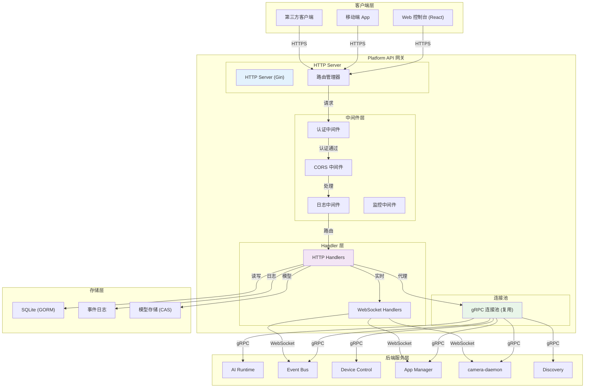

# RESTful API Reference

Platform API 是 NE503 的 HTTP 网关，基于 Go + Gin 框架构建，代理所有后端 gRPC 服务，支持 WebSocket 实时通信（事件流、视频流、终端、容器日志）。技术栈：Go + Gin + gRPC Client + SQLite (GORM)。



请求处理流程：客户端发送 HTTP 请求 → CORS 处理 → 日志记录 → 认证校验 → 路由匹配 → 参数校验 → 权限检查 → 业务逻辑（通过 gRPC 连接池调用后端服务） → 响应包装。网关处理延迟约 1-5ms，后端服务处理约 10-50ms。

---

## 1. 概述

| 项目 | 说明 |
|:---|:---|
| 端点前缀 | `/api/v1` |
| 基础地址 | `http://<设备IP>:8080` |

> 以下各节路径均省略 `/api/v1` 前缀，实际请求时需拼接完整路径，如 `/api/v1/system/info`。
| Swagger UI | `/swagger/` |
| 协议 | HTTP/HTTPS + WebSocket |
| 响应格式 | JSON |

---

## 2. 认证

Platform API 支持 Bearer Token 认证（默认关闭，可在配置中启用）。

**传递方式：**

| 方式 | 格式 | 适用场景 |
|:---|:---|:---|
| HTTP Header | `Authorization: Bearer <token>` | REST API 请求 |
| HTTP Header | `X-API-Key: <token>` | REST API 请求 |
| Query Parameter | `?token=<token>` | WebSocket 连接 |

**公开端点（无需认证）：**

- `/api/login` — 登录（独立于 /api/v1 前缀）
- `/api/v1/system/health` — 健康检查

**认证流程：** 中间件提取 Header 或 Query 参数中的 Token → 查询用户数据库验证有效性 → 检查过期时间 → 放行或返回 `401 Unauthorized`。若请求未携带 Token 且目标非公开端点，同样返回 `401`。

---

## 3. 系统管理

### System

| Method | Path | 说明 |
|:---|:---|:---|
| GET | `/system/info` | 获取平台版本和服务状态 |
| GET | `/system/stats` | 获取系统统计数据 |
| GET | `/system/health` | 健康检查（公开端点，无需认证） |
| POST | `/system/password` | 修改密码 |
| POST | `/system/restart` | 重启系统 |
| GET/POST | `/system/ota/*` | OTA 固件升级 |

### Time Management

| Method | Path | 说明 |
|:---|:---|:---|
| POST | `/system/time/sync-from-client` | 从客户端同步时间 |
| GET/POST | `/system/time/*` | 时间/时区/NTP 配置 |

---

## 4. AI 模型管理

| Method | Path | 说明 |
|:---|:---|:---|
| GET | `/ai/models` | 列出已加载的模型 |
| POST | `/ai/models` | 注册模型 |
| POST | `/ai/models/upload` | 上传模型文件 |
| POST | `/ai/models/scan` | 扫描可用模型 |
| GET/DELETE | `/ai/models/{id}` | 获取/删除模型 |
| POST | `/ai/models/{id}/load` | 加载模型到 NPU |
| POST | `/ai/models/{id}/unload` | 从 NPU 卸载模型 |
| GET | `/ai/stats` | AI 推理统计信息 |
| GET | `/ai/capabilities` | AI 能力列表 |

---

## 5. 事件总线

| Method | Path | 说明 |
|:---|:---|:---|
| GET | `/events/topics` | 列出所有事件主题 |
| POST | `/events/publish` | 发布事件 |
| GET (WS) | `/events/stream` | 事件流（WebSocket 实时推送） |

---

## 6. 设备控制

| Method | Path | 说明 |
|:---|:---|:---|
| GET | `/device/status` | 获取设备状态 |
| POST | `/device/light` | 白光灯控制 |
| POST | `/device/ir-led` | 红外 LED 控制 |
| POST | `/device/ir-cut` | IR-Cut 滤光片控制 |
| POST | `/device/ptz` | 云台（PTZ）控制 |
| POST | `/device/zoom` | 变焦控制 |
| POST | `/device/focus` | 对焦控制 |
| POST | `/device/autofocus` | 自动对焦 |
| GET/PUT/POST | `/device/lens/*` | 镜头操作 |
| POST/GET | `/device/gpio/*` | GPIO 控制 |

---

## 7. 应用管理

| Method | Path | 说明 |
|:---|:---|:---|
| GET | `/apps` | 列出所有应用 |
| POST | `/apps` | 安装应用 |
| POST | `/apps/wizard` | 向导式安装 |
| POST | `/apps/upload-image` | 上传应用镜像 |
| GET | `/apps/{id}` | 获取应用详情 |
| POST | `/apps/{id}/start` | 启动应用 |
| POST | `/apps/{id}/stop` | 停止应用 |
| DELETE | `/apps/{id}` | 卸载应用 |
| GET | `/apps/{id}/stats` | 获取应用统计信息 |
| GET | `/apps/{id}/logs` | 获取应用日志 |

---

## 8. 容器管理

| Method | Path | 说明 |
|:---|:---|:---|
| GET | `/containers` | 列出所有容器 |
| GET | `/containers/{id}` | 获取容器详情 |
| GET | `/containers/{id}/stats` | 获取容器资源统计 |
| GET (WS) | `/containers/{id}/logs/ws` | 容器日志流（WebSocket） |
| GET (WS) | `/containers/{id}/exec/ws` | 容器终端（WebSocket） |
| POST | `/containers/{id}/start` | 启动容器 |
| POST | `/containers/{id}/stop` | 停止容器 |
| DELETE | `/containers/{id}` | 删除容器 |

---

## 9. 媒体配置

| Method | Path | 说明 |
|:---|:---|:---|
| GET | `/media/status` | 获取流媒体状态 |
| GET/POST | `/media/config` | 获取/设置媒体配置 |
| PUT | `/media/encoder` | 热更新编码参数（无需重启） |
| PUT | `/media/rtsp` | 开关 RTSP 流 |
| PUT | `/media/ai-overlay` | AI 检测框叠加 |
| PUT | `/media/osd` | OSD 时间/文字水印配置 |
| GET/POST | `/media/profiles` | 编码配置档管理 |
| POST | `/media/streams/{name}/enable` | 启用指定流 |
| DELETE | `/media/streams/{name}/disable` | 禁用指定流 |

---

## 10. H.264 视频流

| Method | Path | 说明 |
|:---|:---|:---|
| GET (WS) | `/h264/{stream_id}` | H.264 视频流（WebSocket） |

---

## 11. 系统监控

| Method | Path | 说明 |
|:---|:---|:---|
| GET | `/monitor/summary` | 系统资源概览 |
| GET | `/monitor/cpu` | CPU 使用率 |
| GET | `/monitor/memory` | 内存使用率 |
| GET | `/monitor/disk` | 磁盘使用率 |
| GET | `/monitor/network` | 网络流量统计 |

---

## 12. 存储管理

| Method | Path | 说明 |
|:---|:---|:---|
| GET | `/storage/disks` | 列出所有磁盘 |
| POST | `/storage/mount` | 挂载磁盘 |
| POST | `/storage/unmount` | 卸载磁盘 |
| POST | `/storage/format` | 格式化磁盘 |

---

## 13. 文件管理

| Method | Path | 说明 |
|:---|:---|:---|
| GET | `/files` | 列出文件 |
| GET/POST | `/files/content` | 读取/写入文件内容 |
| POST | `/files/upload` | 上传文件 |
| GET | `/files/download` | 下载文件 |
| DELETE | `/files` | 删除文件 |

---

## 14. Web 终端

| Method | Path | 说明 |
|:---|:---|:---|
| GET (WS) | `/terminal/ws` | Web 终端（WebSocket，SSH 交互） |

---

## 15. 网络配置

| Method | Path | 说明 |
|:---|:---|:---|
| GET | `/network/config` | 获取网络配置 |
| POST | `/network/config` | 更新网络配置 |
| GET | `/network/interfaces` | 列出网络接口 |

---

## 16. 日志系统

| Method | Path | 说明 |
|:---|:---|:---|
| GET | `/logs/services` | 获取服务列表 |
| GET | `/logs/content` | 获取日志内容 |
| GET (WS) | `/logs/stream/ws` | 服务日志流（WebSocket） |

---

## 17. WebSocket 接口

所有 WebSocket 端点通过 `?token=<token>` 传递认证 Token。

| 路径 | 用途 | 数据方向 |
|:---|:---|:---|
| `/api/v1/events/stream?token=` | 事件流实时推送 | 服务端 → 客户端 |
| `/api/v1/h264/{stream_id}` | H.264 视频流推送 | 服务端 → 客户端 |
| `/api/v1/containers/{id}/logs/ws` | 容器日志实时流 | 服务端 → 客户端 |
| `/api/v1/containers/{id}/exec/ws` | 容器终端交互 | 双向 |
| `/api/v1/terminal/ws` | Web 终端（SSH） | 双向 |
| `/api/v1/logs/stream/ws` | 服务日志实时流 | 服务端 → 客户端 |

---

## 18. 响应格式

所有 API 响应使用统一的 JSON 格式：

```json
{
  "code": 0,
  "message": "Success",
  "data": { ... }
}
```

| 字段 | 类型 | 说明 |
|:---|:---|:---|
| `code` | int | 状态码，`0` 表示成功，非零表示错误 |
| `message` | string | 状态描述信息 |
| `data` | object | 响应数据，错误时可能为空 |

---

## 19. 服务配置

| 配置项 | 默认值 | 说明 |
|:---|:---|:---|
| `service.http_addr` | `:8080` | HTTP 监听地址 |
| `service.log_level` | `info` | 日志级别 |
| `auth.enabled` | `false` | 是否启用认证 |
| `auth.token_key` | — | Token 签名密钥 |
| `web.enable_cors` | `true` | 是否启用 CORS |
| `stream.encoded_pub_dir` | `/run/aipc/encoded` | H.264 编码帧发布目录 |
| `storage.root_path` | `/opt/aipc` | 平台根目录 |
| `storage.model_blob_path` | `/opt/aipc/models/blobs` | 模型文件存储路径 |

后端 gRPC 服务通过 Unix Domain Socket 连接，Socket 文件位于 `/run/aipc/` 目录下，连接池支持自动重连和资源回收。

---

## 20. 相关文档

- [平台架构](../3-platform-development/0-platform-architecture.md) — NE503 四层架构与服务依赖关系
- [应用开发](../4-application-development/1-app-reference.md) — 基于 Platform API 的应用开发指南
- [SDK 参考](../4-application-development/2-sdk-reference.md) — Python SDK 完整 API 参考
- [CLI 指南](./3-cli-guide.md) — aipc-cli 命令行工具使用指南
