# Troubleshooting Guide

## 1 概述

本手册为 NE503 AIPC 平台提供系统化的故障排查流程和解决方案。平台采用微服务架构，服务间通过 Unix Socket 通信，并遵循特定的启动顺序。遇到问题时，请按以下通用流程操作：

1. 确认问题现象
2. 检查相关日志
3. 参考对应章节
4. 执行建议方案

## 2 通用排查流程

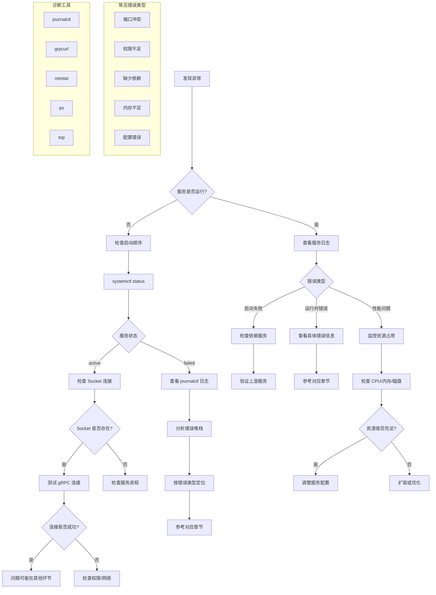
```mermaid
flowchart TD
    A[发现异常] --> B{服务是否运行?}
    B -->|是| C[查看服务日志]
    B -->|否| D[检查启动顺序]

    D --> E[systemctl status]
    E --> F{服务状态}
    F -->|failed| G[查看 journalctl 日志]
    F -->|active| H[检查 Socket 连接]

    C --> I{错误类型}
    I -->|启动失败| J[检查依赖服务]
    I -->|运行时错误| K[查看具体错误信息]
    I -->|性能问题| L[监控资源占用]

    J --> M[验证上游服务]
    K --> N[参考对应章节]
    L --> O[检查 CPU/内存/磁盘]

    H --> P{Socket 是否存在?}
    P -->|是| Q[测试 gRPC 连接]
    P -->|否| R[检查服务进程]

    Q --> S{连接是否成功?}
    S -->|是| T[问题可能在其他环节]
    S -->|否| U[检查权限/网络]

    G --> V[分析错误堆栈]
    V --> W[按错误类型定位]
    W --> X[参考对应章节]

    O --> Y{资源是否充足?}
    Y -->|是| Z[调整服务配置]
    Y -->|否| AA[扩容或优化]

    subgraph "常见错误类型"
        AB[端口冲突]
        AC[权限不足]
        AD[缺少依赖]
        AE[内存不足]
        AF[配置错误]
    end

    subgraph "诊断工具"
        AG[journalctl]
        AH[grpcurl]
        AI[netstat]
        AJ[ps]
        AK[top]
    end
```

## 3 服务启动失败排查

### 3.1 检查 systemd 状态

```bash
# 查看所有 AIPC 服务状态
systemctl status ai-runtime camera-daemon app-manager event-bus device-control platform-api

# 查看指定服务状态
systemctl status ai-runtime.service

# 查看启动失败的服务
systemctl --failed

# 查看服务依赖关系
systemctl list-dependencies platform-api.service
```

### 3.2 检查 Unix Socket 是否存在

```bash
# 查看 /run/aipc 目录
ls -la /run/aipc/

# 查看指定 Socket 是否存在
ls -la /run/aipc/ai-runtime.sock
ls -la /run/aipc/app-manager.sock
ls -la /run/aipc/device-control.sock

# 测试 Socket 连接
nc -U /run/aipc/ai-runtime.sock
```

### 3.3 使用 journalctl 查看日志

```bash
# 实时查看服务日志
journalctl -u ai-runtime -f

# 查看最近 1 小时的日志
journalctl -u camera-daemon --since "1 hour ago"

# 查看包含错误关键词的日志
journalctl -u app-manager | grep -i "error\|failed\|fatal"

# 查看启动失败的详细错误
journalctl -u app-manager -b --no-pager

# 按错误级别过滤
journalctl -u event-bus -p err
journalctl -u device-control -p warning
```

### 3.4 常见启动问题

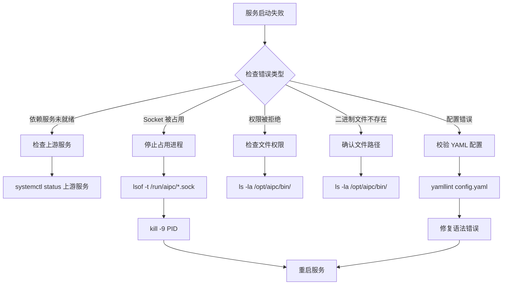
```mermaid
flowchart TD
    A[服务启动失败] --> B{检查错误类型}
    B -->|依赖服务未就绪| C[检查上游服务]
    B -->|Socket 被占用| D[停止占用进程]
    B -->|权限被拒绝| E[检查文件权限]
    B -->|二进制文件不存在| F[确认文件路径]
    B -->|配置错误| G[校验 YAML 配置]

    C --> H[systemctl status 上游服务]
    D --> I[lsof -t /run/aipc/*.sock]
    E --> J[ls -la /opt/aipc/bin/]
    F --> K[ls -la /opt/aipc/bin/]
    G --> L[yamllint config.yaml]

    I --> M[kill -9 PID]
    L --> N[修复语法错误]
    M --> O[重启服务]
    N --> O
```

### 3.5 Socket 连接测试

```bash
# 使用 grpcurl 测试 gRPC 服务
grpcurl -plaintext unix:///run/aipc/ai-runtime.sock list

# 测试服务是否响应
grpcurl -plaintext -d '{}' unix:///run/aipc/ai-runtime.sock aipc.platform.inference.v1.InferenceService/ListModels

# 检查 Socket 权限
ls -ld /run/aipc/
ls -la /run/aipc/*.sock
```

## 4 AI 推理排查

### 4.1 模型加载失败

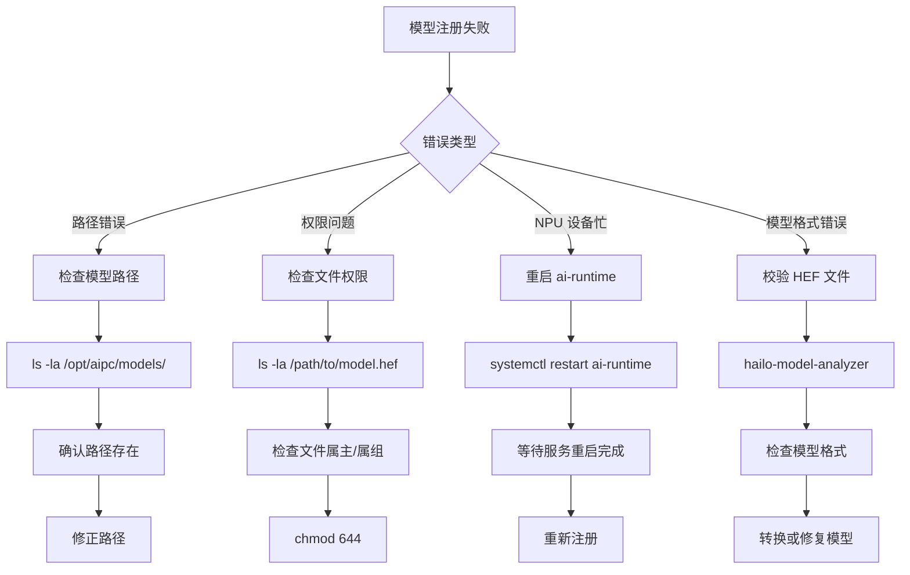
```mermaid
flowchart TD
    A[模型注册失败] --> B{错误类型}
    B -->|路径错误| C[检查模型路径]
    B -->|权限问题| D[检查文件权限]
    B -->|NPU 设备忙| E[重启 ai-runtime]
    B -->|模型格式错误| F[校验 HEF 文件]

    C --> G[ls -la /opt/aipc/models/]
    D --> H[ls -la /path/to/model.hef]
    E --> I[systemctl restart ai-runtime]
    F --> J[hailo-model-analyzer]

    G --> K[确认路径存在]
    H --> L[检查文件属主/属组]
    I --> M[等待服务重启完成]
    J --> N[检查模型格式]

    K --> O[修正路径]
    L --> P[chmod 644]
    M --> Q[重新注册]
    N --> R[转换或修复模型]
```

**诊断命令：**

```bash
# 查看模型注册日志
journalctl -u ai-runtime | grep -i "model"

# 检查 NPU 设备状态
hailortcli scan

# 校验模型文件
ls -la /opt/aipc/models/
file /opt/aipc/models/yolov8n.hef
```

### 4.2 推理超时

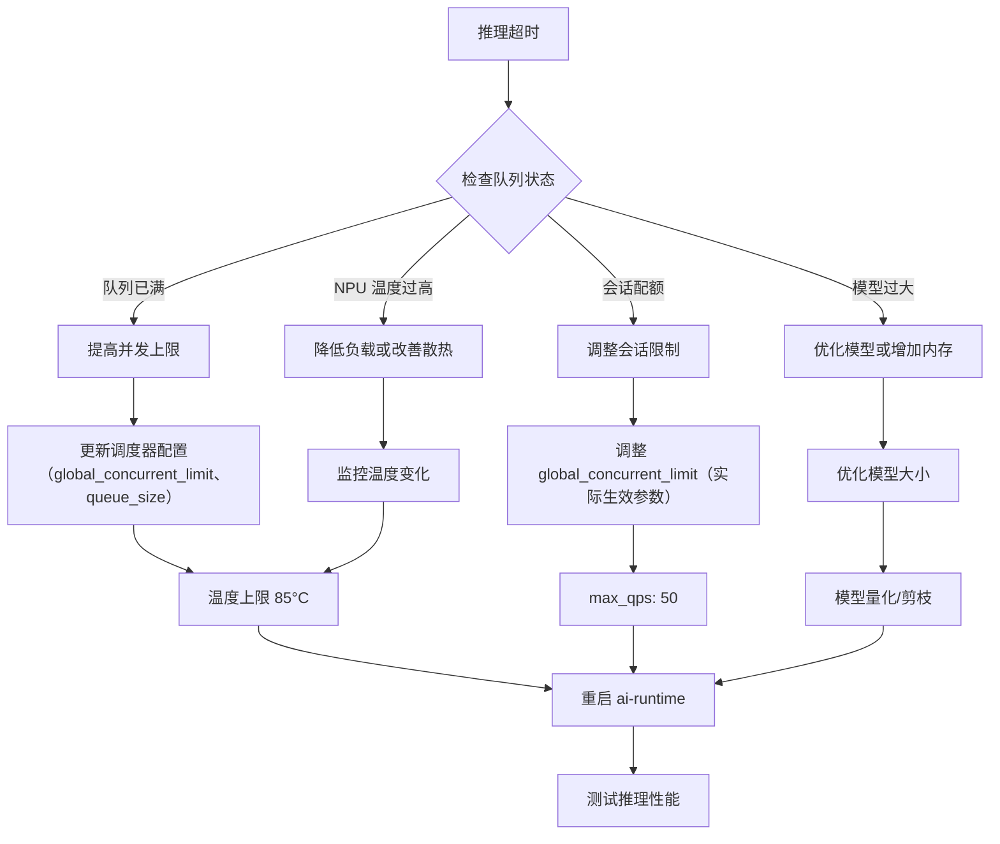
```mermaid
flowchart TD
    A[推理超时] --> B{检查队列状态}
    B -->|队列已满| C[提高并发上限]
    B -->|会话配额| D[调整会话限制]
    B -->|模型过大| E[优化模型或增加内存]
    B -->|NPU 温度过高| F[降低负载或改善散热]

    C --> G["更新调度器配置（global_concurrent_limit、queue_size）"]
    D --> H["调整 global_concurrent_limit（实际生效参数）"]
    E --> I[优化模型大小]
    F --> J[监控温度变化]

    G --> K[global_qps_limit: 200]
    H --> L[max_qps: 50]
    I --> M[模型量化/剪枝]
    J --> K[温度上限 85°C]

    K --> N[重启 ai-runtime]
    L --> N
    M --> N
    N --> O[测试推理性能]
```

**诊断命令：**

```bash
# 查看推理统计信息
grpcurl -plaintext -d '{}' unix:///run/aipc/ai-runtime.sock aipc.platform.inference.v1.InferenceService/GetStats

# 查看已注册模型
grpcurl -plaintext -d '{}' unix:///run/aipc/ai-runtime.sock aipc.platform.inference.v1.InferenceService/ListModels

# 监控系统资源
top -p $(pidof ai-runtime)
```

### 4.3 NPU 过温

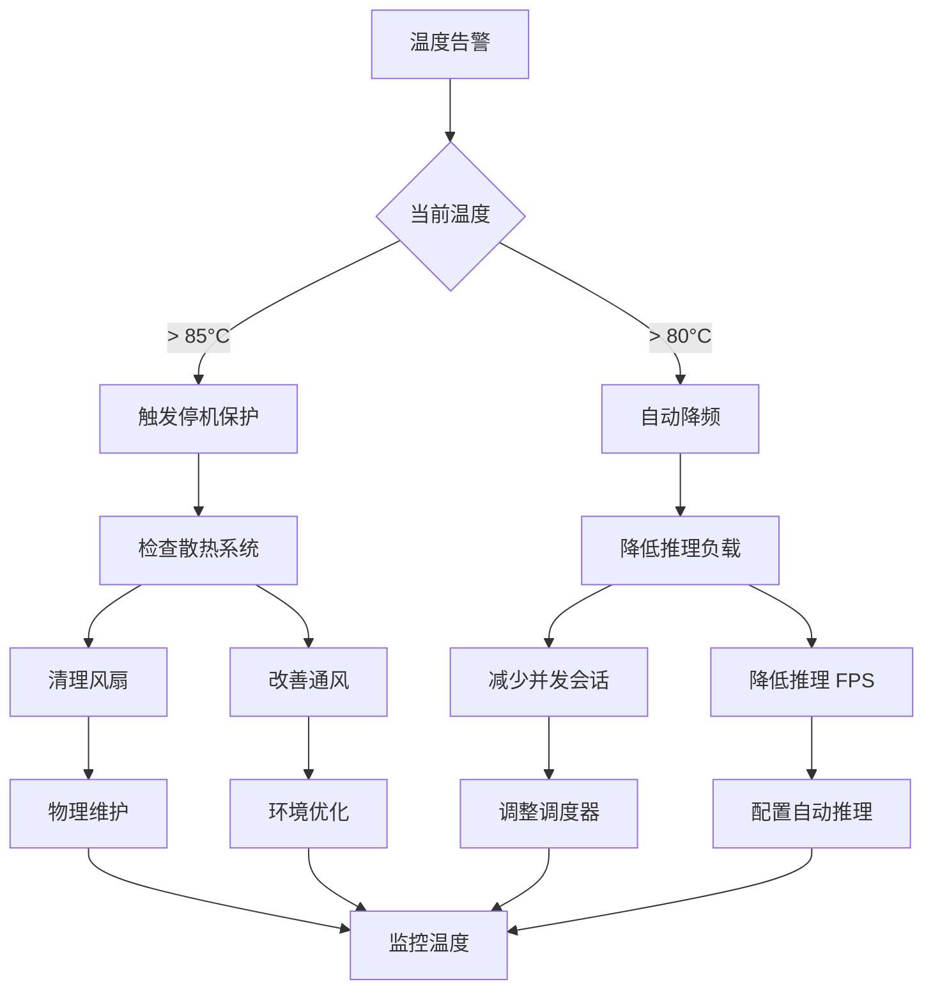
```mermaid
flowchart TD
    A[温度告警] --> B{当前温度}
    B -->|> 85°C| C[触发停机保护]
    B -->|> 80°C| D[自动降频]

    C --> E[检查散热系统]
    D --> F[降低推理负载]

    E --> G[清理风扇]
    E --> H[改善通风]
    F --> I[减少并发会话]
    F --> J[降低推理 FPS]

    G --> K[物理维护]
    H --> L[环境优化]
    I --> M[调整调度器]
    J --> N[配置自动推理]

    K --> O[监控温度]
    L --> O
    M --> O
    N --> O
```

**监控命令：**

```bash
# 检查 NPU 温度
hailortcli scan | grep Temperature

# 查看 ai-runtime 温度日志
journalctl -u ai-runtime | grep -i "temperature"

# 查看性能统计
grpcurl -plaintext -d '{}' unix:///run/aipc/ai-runtime.sock aipc.platform.inference.v1.InferenceService/GetStats
```

### 4.4 会话配额超限

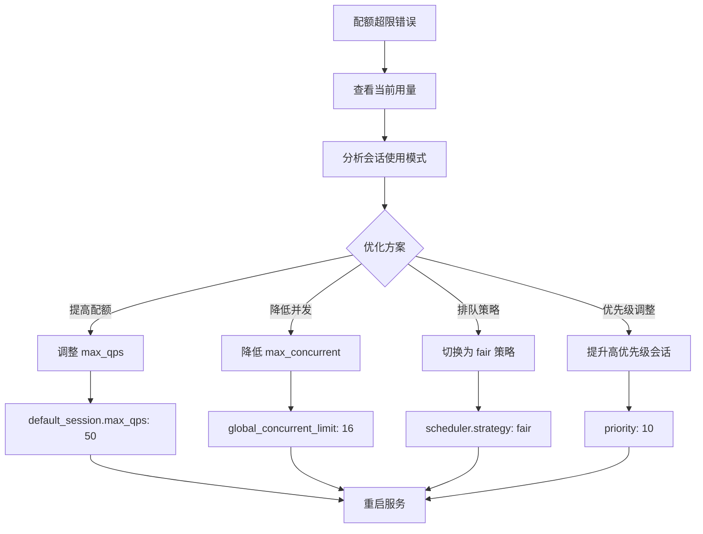
```mermaid
flowchart TD
    A[配额超限错误] --> B[查看当前用量]
    B --> C[分析会话使用模式]
    C --> D{优化方案}

    D -->|提高配额| E[调整 max_qps]
    D -->|降低并发| F[降低 max_concurrent]
    D -->|排队策略| G[切换为 fair 策略]
    D -->|优先级调整| H[提升高优先级会话]

    E --> I[default_session.max_qps: 50]
    F --> J[global_concurrent_limit: 16]
    G --> K[scheduler.strategy: fair]
    H --> L[priority: 10]

    I --> M[重启服务]
    J --> M
    K --> M
    L --> M
```

**诊断命令：**

```bash
# 查看所有会话
grpcurl -plaintext -d '{}' unix:///run/aipc/ai-runtime.sock aipc.platform.inference.v1.InferenceService/ListModels

# 查看配额统计
grpcurl -plaintext -d '{}' unix:///run/aipc/ai-runtime.sock aipc.platform.inference.v1.InferenceService/GetStats

# 查看会话创建日志
journalctl -u ai-runtime | grep -i "session"
```

## 5 视频流排查

### 5.1 RTSP 连接失败

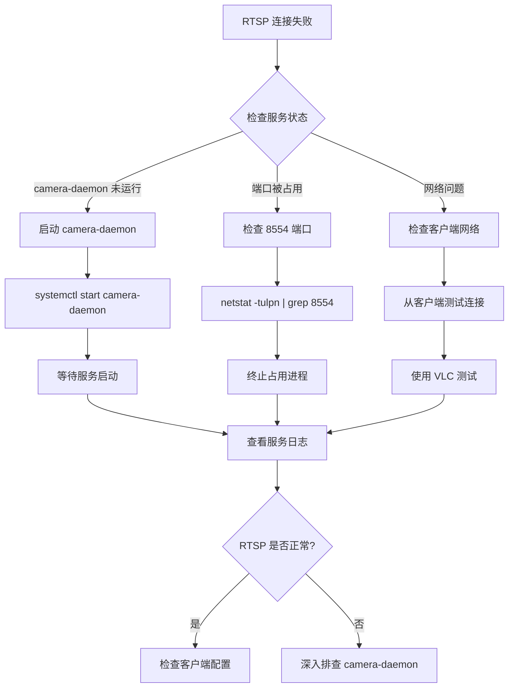
```mermaid
flowchart TD
    A[RTSP 连接失败] --> B{检查服务状态}
    B -->|camera-daemon 未运行| C[启动 camera-daemon]
    B -->|端口被占用| D[检查 8554 端口]
    B -->|网络问题| E[检查客户端网络]

    C --> F[systemctl start camera-daemon]
    D --> G["netstat -tulpn | grep 8554"]
    E --> H[从客户端测试连接]

    F --> I[等待服务启动]
    G --> J[终止占用进程]
    H --> K[使用 VLC 测试]

    I --> L[查看服务日志]
    J --> L
    K --> L

    L --> M{RTSP 是否正常?}
    M -->|是| N[检查客户端配置]
    M -->|否| O[深入排查 camera-daemon]
```

**诊断命令：**

```bash
# 检查 RTSP 服务状态
systemctl status camera-daemon

# 查看 RTSP 日志
journalctl -u camera-daemon -f

# 测试 RTSP 连接
ffmpeg -rtsp_transport tcp -i rtsp://localhost:8554/stream -t 10 -f null -

# 查看端口占用
netstat -tulpn | grep 8554
```

### 5.2 WebSocket 断连

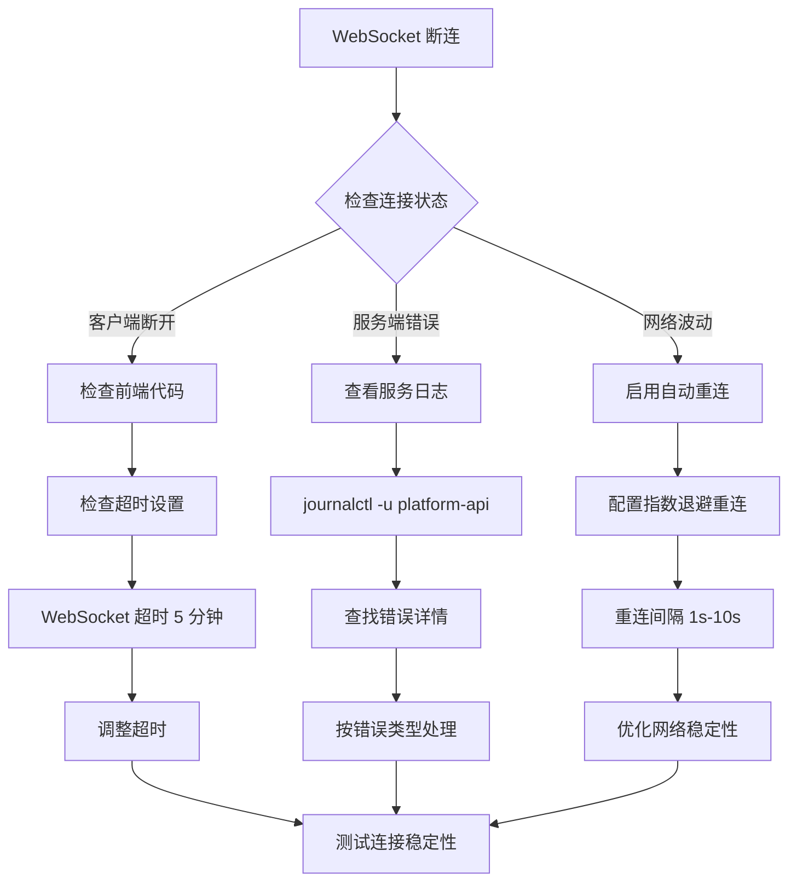
```mermaid
flowchart TD
    A[WebSocket 断连] --> B{检查连接状态}
    B -->|客户端断开| C[检查前端代码]
    B -->|服务端错误| D[查看服务日志]
    B -->|网络波动| E[启用自动重连]

    C --> F[检查超时设置]
    D --> G[journalctl -u platform-api]
    E --> H[配置指数退避重连]

    F --> I[WebSocket 超时 5 分钟]
    G --> J[查找错误详情]
    H --> K[重连间隔 1s-10s]

    I --> L[调整超时]
    J --> M[按错误类型处理]
    K --> N[优化网络稳定性]

    L --> O[测试连接稳定性]
    M --> O
    N --> O
```

**诊断命令：**

```bash
# 查看 WebSocket 连接日志
journalctl -u platform-api | grep -i "websocket\|h264"

# 测试 WebSocket 连接
wscat -c ws://localhost:8080/api/v1/h264/cam1

# 在浏览器开发者工具 Network 面板中检查前端连接状态
```

### 5.3 视频花屏/黑屏

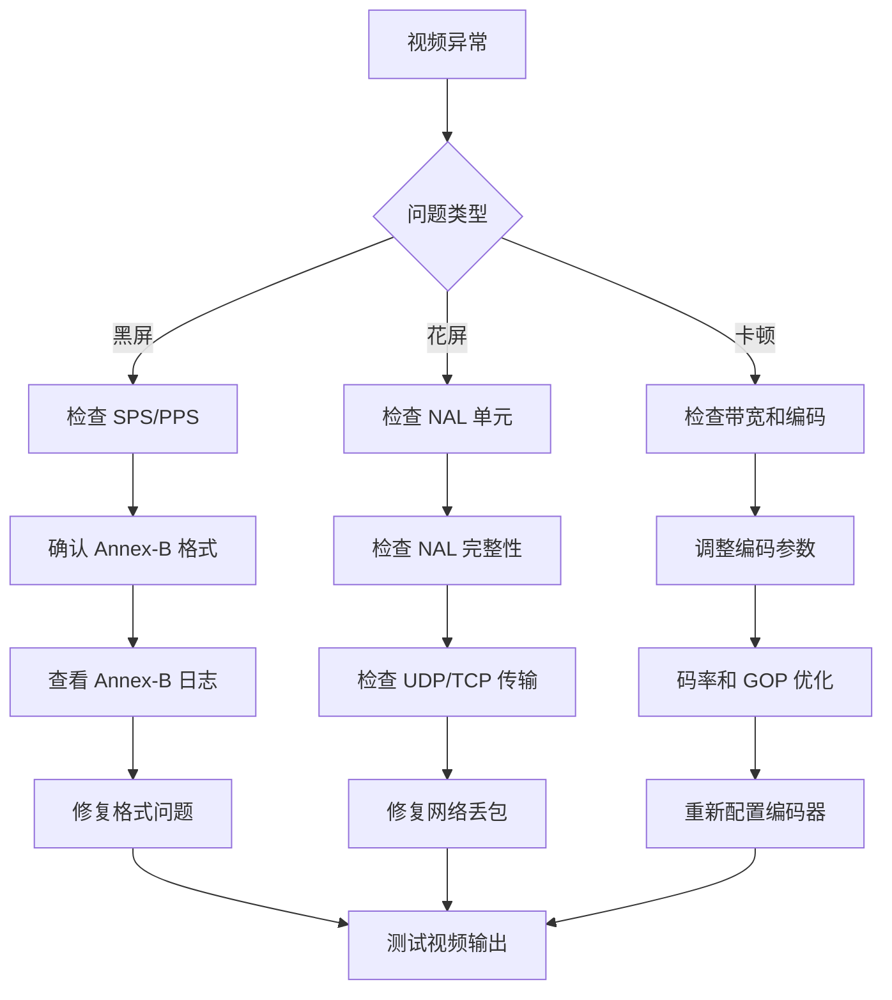
```mermaid
flowchart TD
    A[视频异常] --> B{问题类型}
    B -->|黑屏| C[检查 SPS/PPS]
    B -->|花屏| D[检查 NAL 单元]
    B -->|卡顿| E[检查带宽和编码]

    C --> F[确认 Annex-B 格式]
    D --> G[检查 NAL 完整性]
    E --> H[调整编码参数]

    F --> I[查看 Annex-B 日志]
    G --> J[检查 UDP/TCP 传输]
    H --> K[码率和 GOP 优化]

    I --> L[修复格式问题]
    J --> M[修复网络丢包]
    K --> N[重新配置编码器]

    L --> O[测试视频输出]
    M --> O
    N --> O
```

**诊断命令：**

```bash
# 查看视频流状态
curl http://localhost:8080/api/v1/media/status

# 查看 H.264 流日志
journalctl -u platform-api | grep -i "h264\|nal"

# 分析视频数据包
tcpdump -i lo -s 0 -w rtsp.pcap port 8554
```

## 6 容器应用排查

### 6.1 应用安装失败

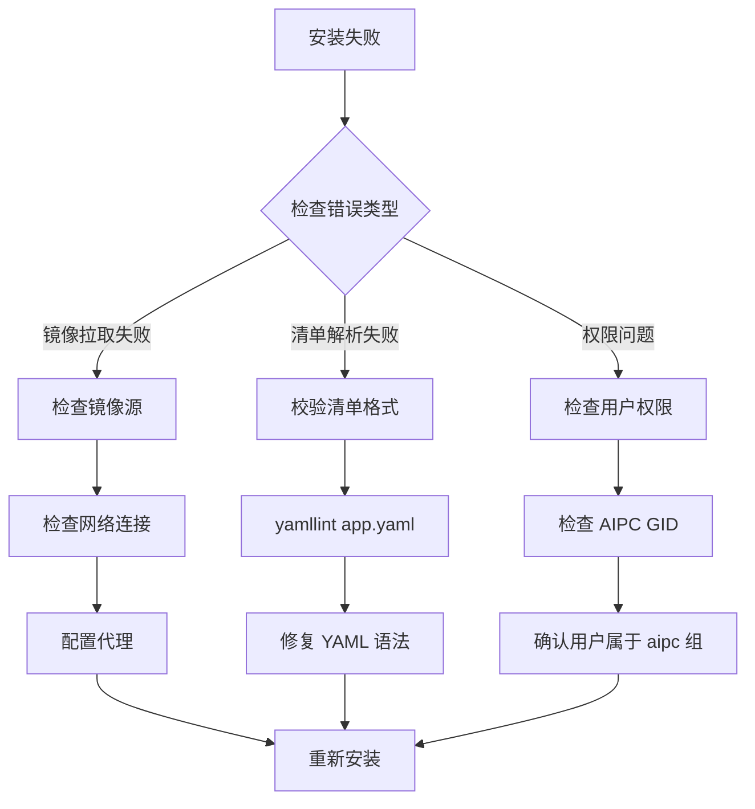
```mermaid
flowchart TD
    A[安装失败] --> B{检查错误类型}
    B -->|镜像拉取失败| C[检查镜像源]
    B -->|清单解析失败| D[校验清单格式]
    B -->|权限问题| E[检查用户权限]

    C --> F[检查网络连接]
    D --> G[yamllint app.yaml]
    E --> H[检查 AIPC GID]

    F --> I[配置代理]
    G --> J[修复 YAML 语法]
    H --> K[确认用户属于 aipc 组]

    I --> L[重新安装]
    J --> L
    K --> L
```

**诊断命令：**

```bash
# 查看安装日志
journalctl -u app-manager -f

# 检查清单格式
aipc-cli app inspect /path/to/app.yaml

# 验证镜像
docker pull registry.example.com/app:latest
```

### 6.2 容器启动失败

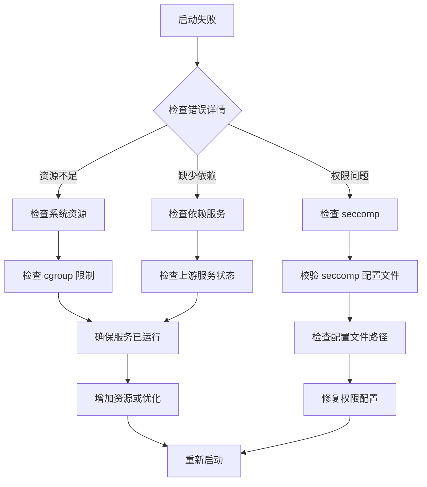
```mermaid
flowchart TD
    A[启动失败] --> B{检查错误详情}
    B -->|资源不足| C[检查系统资源]
    B -->|权限问题| D[检查 seccomp]
    B -->|缺少依赖| E[检查依赖服务]

    C --> F[检查 cgroup 限制]
    D --> G[校验 seccomp 配置文件]
    E --> H[检查上游服务状态]

    F --> I[调整资源配额]
    G --> J[检查配置文件路径]
    H --> I[确保服务已运行]

    I --> K[增加资源或优化]
    J --> L[修复权限配置]
    K --> M[重新启动]
    L --> M
```

**诊断命令：**

```bash
# 查看容器日志
journalctl -u app-manager | grep -i "container"

# 检查系统资源
free -h
df -h
# cgrouptop 非标准命令，可使用 systemd-cgtop 替代
systemd-cgtop

# 检查 containerd 状态
systemctl status containerd
```

### 6.3 健康检查失败

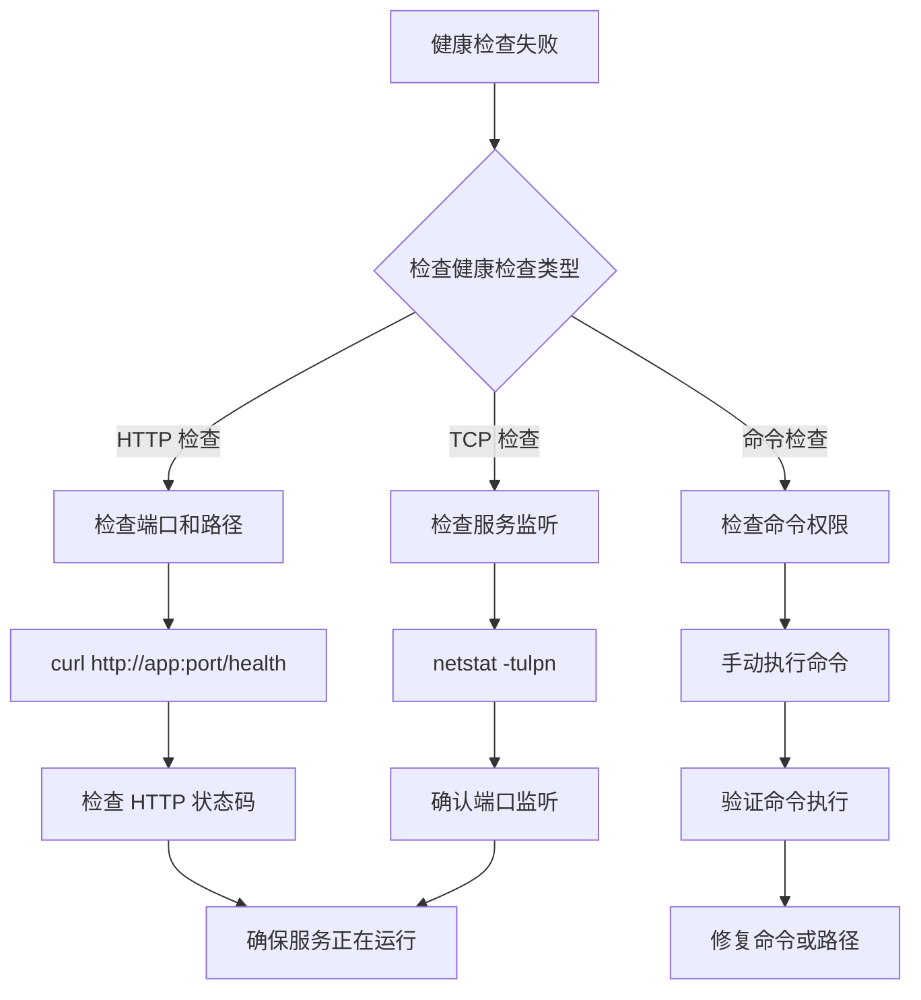
```mermaid
flowchart TD
    A[健康检查失败] --> B{检查健康检查类型}
    B -->|HTTP 检查| C[检查端口和路径]
    B -->|命令检查| D[检查命令权限]
    B -->|TCP 检查| E[检查服务监听]

    C --> F[curl http://app:port/health]
    D --> G[手动执行命令]
    E --> H[netstat -tulpn]

    F --> I[检查 HTTP 状态码]
    G --> J[验证命令执行]
    H --> K[确认端口监听]

    I --> L[修复应用健康端点]
    J --> M[修复命令或路径]
    K --> L[确保服务正在运行]
```

**诊断命令：**

```bash
# 查看健康检查日志
journalctl -u app-manager | grep -i "healthcheck"

# 手动执行健康检查命令
docker exec -it container-id /path/to/healthcheck.sh

# 查看容器状态
aipc-cli app info <app-id>
```

## 7 设备控制排查

### 7.1 PTZ 控制无响应

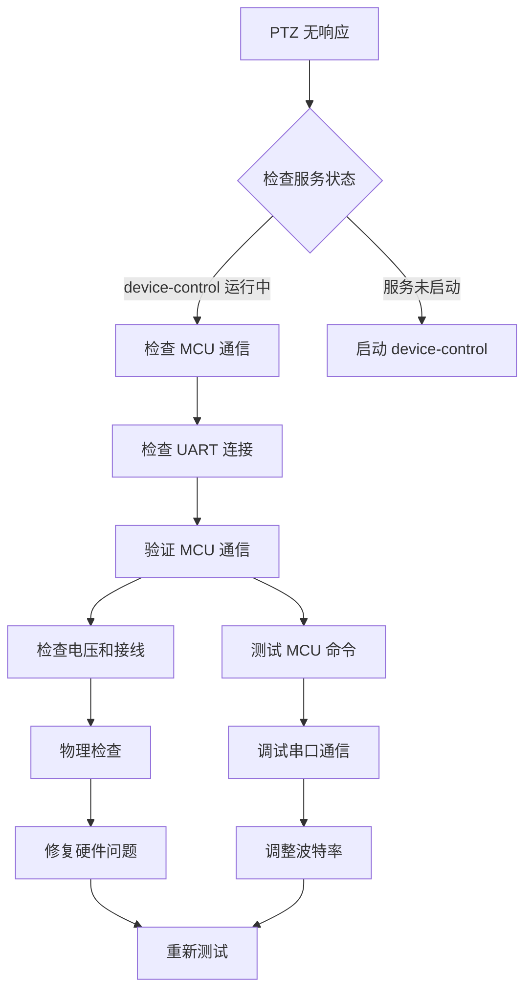
```mermaid
flowchart TD
    A[PTZ 无响应] --> B{检查服务状态}
    B -->|device-control 运行中| C[检查 MCU 通信]
    B -->|服务未启动| D[启动 device-control]

    C --> E[检查 UART 连接]
    E --> F[验证 MCU 通信]

    F --> G[检查电压和接线]
    F --> H[测试 MCU 命令]

    G --> I[物理检查]
    H --> J[调试串口通信]

    I --> K[修复硬件问题]
    J --> L[调整波特率]

    K --> M[重新测试]
    L --> M
```

**诊断命令：**

```bash
# 检查 device-control 状态
systemctl status device-control

# 查看 PTZ 日志
journalctl -u device-control -f

# 测试 UART 通信
ls -la /dev/ttyS*
stty -F /dev/ttyS0 921600

# 测试 PTZ 控制命令
grpcurl -plaintext -d '{"direction": "PAN_LEFT", "speed": 50}' unix:///run/aipc/device-control.sock aipc.platform.device.v1.DeviceControl/Pan
```

### 7.2 镜头控制异常

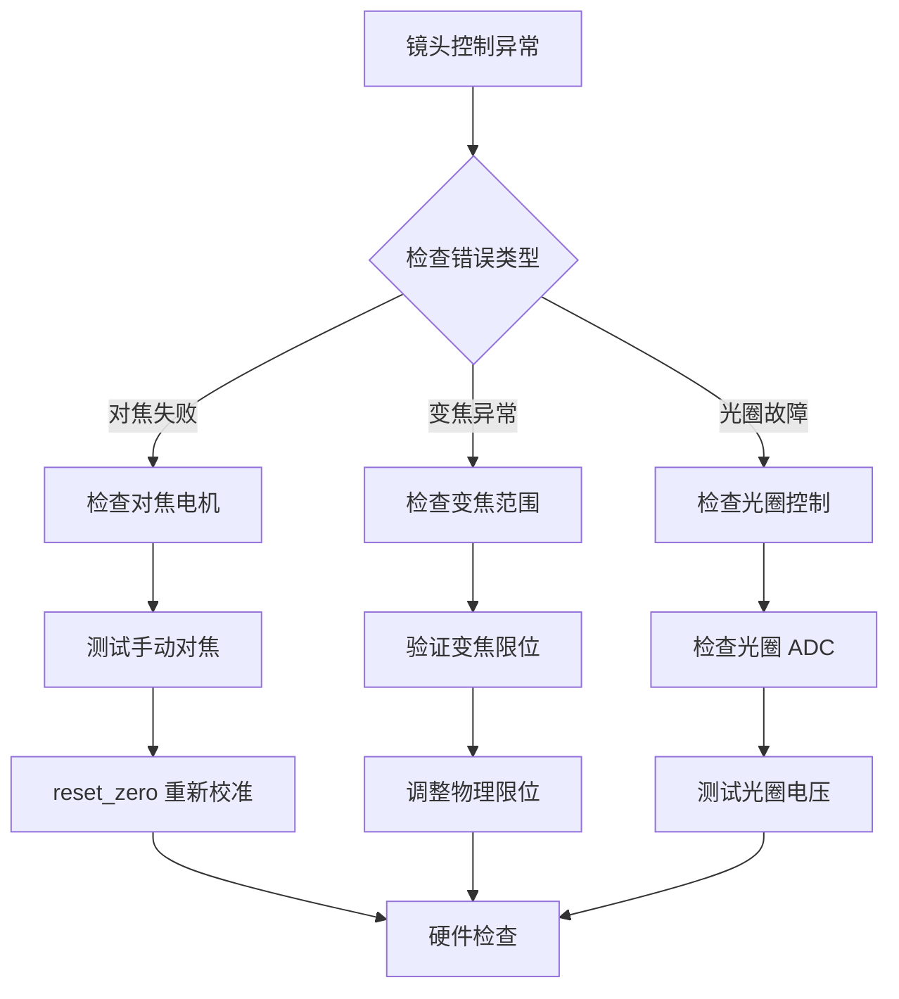
```mermaid
flowchart TD
    A[镜头控制异常] --> B{检查错误类型}
    B -->|对焦失败| C[检查对焦电机]
    B -->|变焦异常| D[检查变焦范围]
    B -->|光圈故障| E[检查光圈控制]

    C --> F[测试手动对焦]
    D --> G[验证变焦限位]
    E --> H[检查光圈 ADC]

    F --> I[reset_zero 重新校准]
    G --> J[调整物理限位]
    H --> K[测试光圈电压]

    I --> L[重新测试对焦]
    J --> L[物理调整]
    K --> L[硬件检查]
```

**诊断命令：**

```bash
# 查看镜头控制日志
journalctl -u device-control | grep -i "lens\|focus\|zoom"

# 查看镜头状态
grpcurl -plaintext -d '{}' unix:///run/aipc/device-control.sock aipc.platform.device.v1.DeviceControl/GetLensStatus

# 测试镜头重置
grpcurl -plaintext -d '{}' unix:///run/aipc/device-control.sock aipc.platform.device.v1.DeviceControl/LensResetZero
```

## 8 事件总线排查

### 8.1 事件发布失败

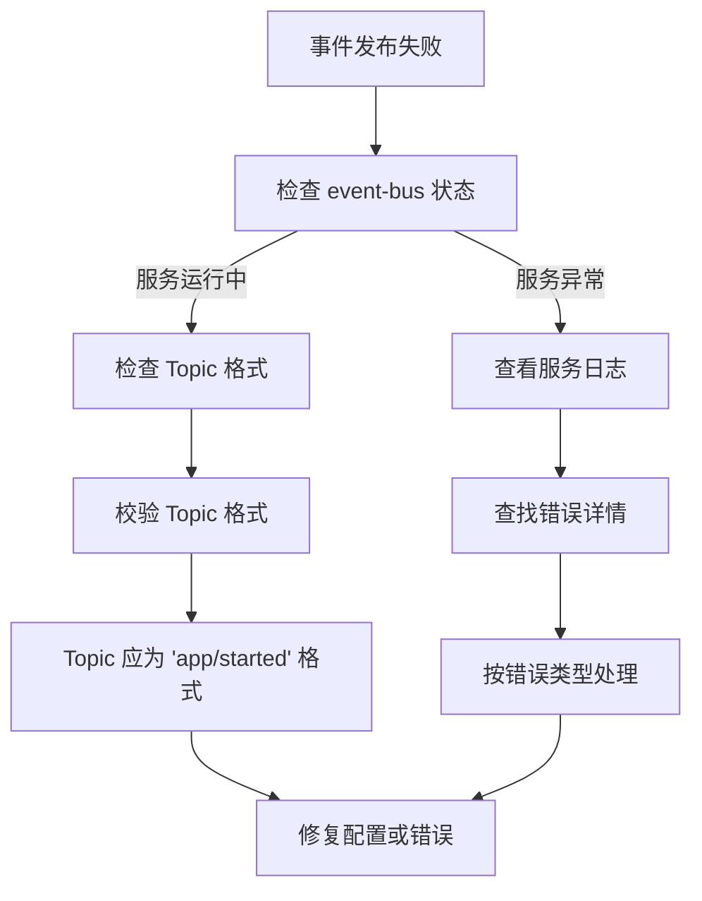
```mermaid
flowchart TD
    A[事件发布失败] --> B[检查 event-bus 状态]
    B -->|服务运行中| C[检查 Topic 格式]
    B -->|服务异常| D[查看服务日志]

    C --> E[校验 Topic 格式]
    D --> F[查找错误详情]

    E --> G["Topic 应为 'app/started' 格式"]
    F --> H[按错误类型处理]

    G --> I[修正 Topic 格式]
    H --> I[修复配置或错误]
```

**诊断命令：**

```bash
# 检查 event-bus 状态
systemctl status event-bus

# 查看事件日志
journalctl -u event-bus -f

# 测试事件发布
aipc-cli event-bus publish test/topic '{"message": "test"}'
```

### 8.2 订阅失败

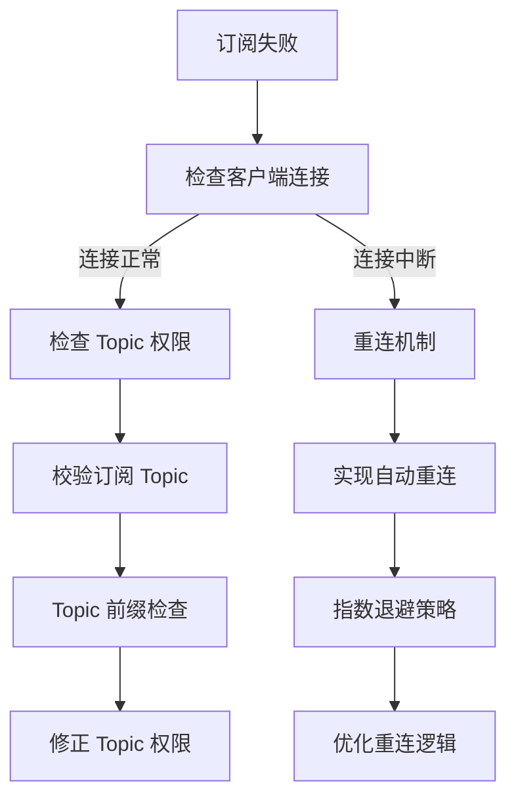
```mermaid
flowchart TD
    A[订阅失败] --> B[检查客户端连接]
    B -->|连接正常| C[检查 Topic 权限]
    B -->|连接中断| D[重连机制]

    C --> E[校验订阅 Topic]
    D --> F[实现自动重连]

    E --> G["Topic 前缀检查"]
    F --> H[指数退避策略]

    G --> I[修正 Topic 权限]
    H --> J[优化重连逻辑]
```

## 9 日志级别调整

### 9.1 临时调整日志级别

```bash
# 临时查看 debug 级别日志（需先在配置文件中将 log_level 设为 debug）
sudo journalctl -u ai-runtime -f

# 查看错误级别及以上的日志
sudo journalctl -u camera-daemon -p err
```

### 9.2 修改配置文件

```yaml
# 在服务配置中调整 log_level
service:
  name: ai-runtime
  listen: unix:///run/aipc/ai-runtime.sock
  log_level: debug  # debug, info, warn, error

# 或使用环境变量
# export LOG_LEVEL=debug
```

### 9.3 日志级别说明

| 级别 | 说明 |
|------|------|
| `debug` | 详细调试信息 |
| `info` | 关键运行状态 |
| `warn` | 非致命警告 |
| `error` | 关键错误 |

### 9.4 日志分析技巧

```bash
# 查看错误率
journalctl -u ai-runtime --since "1 hour ago" | grep -c "error"

# 查看最高频错误
journalctl -u ai-runtime | grep "error" | sort | uniq -c | sort -nr

# 过滤特定错误
journalctl -u ai-runtime | grep -E "(timeout|connection refused|permission denied)"
```

## 10 性能监控

### 10.1 系统资源监控

```bash
# 监控 CPU 占用
top -p $(pgrep -f ai-runtime)

# 监控内存占用
free -h && ps aux | grep ai-runtime

# 监控磁盘 I/O
iostat -x 1 5

# 监控网络
iftop -i eth0
```

### 10.2 服务性能指标

```bash
# AI Runtime 统计
grpcurl -plaintext -d '{}' unix:///run/aipc/ai-runtime.sock aipc.platform.inference.v1.InferenceService/GetStats

# 容器统计
aipc-cli app stats <app-id>

# 设备状态
grpcurl -plaintext -d '{}' unix:///run/aipc/device-control.sock aipc.platform.device.v1.DeviceControl/GetDeviceStatus
```

### 10.3 实时监控脚本

```bash
#!/bin/bash
# 监控脚本示例

while true; do
    echo "=== $(date) ==="
    echo "CPU 使用率:"
    top -bn1 | grep "Cpu(s)" | sed "s/.*, *\([0-9.]*\)%* id.*/\1/" | awk '{print 100 - $1}'
    echo "内存使用率:"
    free | grep Mem | awk '{printf "%.2f%%\n", $3/$2 * 100.0}'
    echo "磁盘使用率:"
    df /opt/aipc | tail -1 | awk '{print $5}'
    echo "NPU 温度:"
    hailortcli scan | grep Temperature | awk '{print $2}'
    sleep 5
done
```

## 11 Web 控制台排查

### 11.1 浏览器兼容性问题

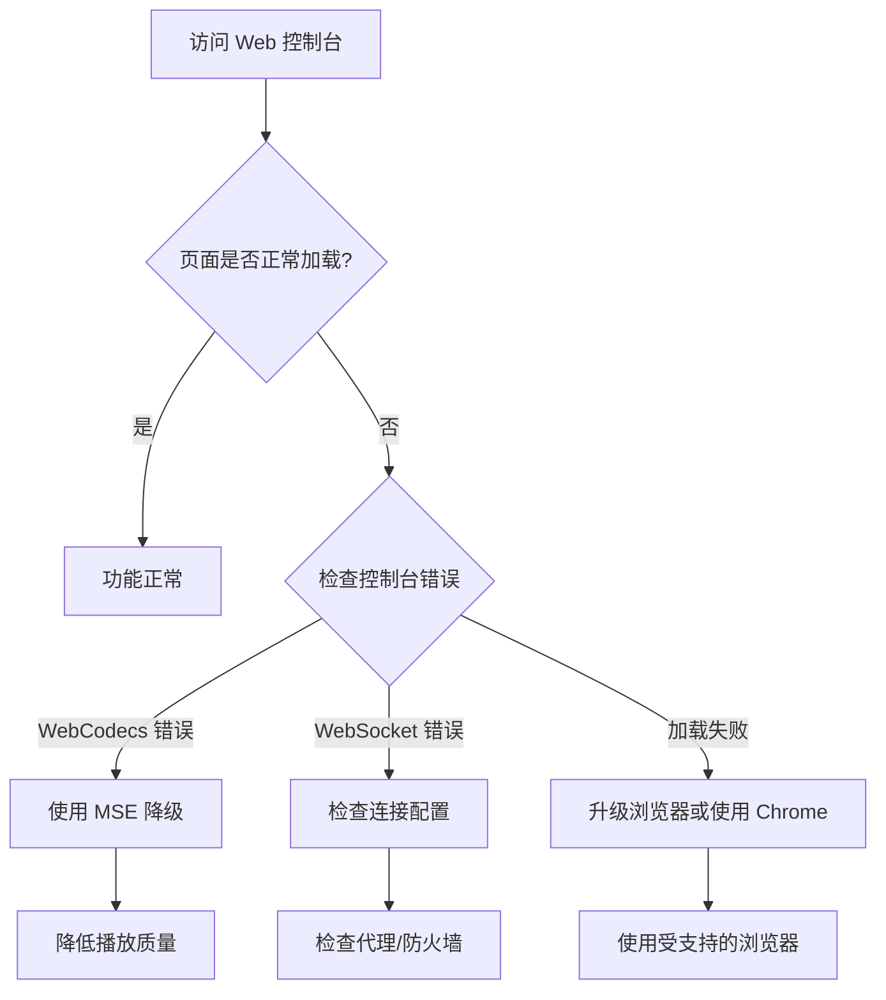
```mermaid
graph TD
    A[访问 Web 控制台] --> B{页面是否正常加载?}
    B -->|是| C[功能正常]
    B -->|否| D{检查控制台错误}
    D -->|WebCodecs 错误| E[使用 MSE 降级]
    D -->|WebSocket 错误| F[检查连接配置]
    D -->|加载失败| G[升级浏览器或使用 Chrome]

    E --> H[降低播放质量]
    F --> I[检查代理/防火墙]
    G --> J[使用受支持的浏览器]
```

**浏览器兼容性矩阵：**

| 浏览器 | 最低版本 | 支持程度 | 已知问题 | 解决方案 |
|--------|---------|----------|---------|---------|
| Chrome | 88+ | 完全支持 | -- | -- |
| Firefox | 78+ | 基本支持 | 不支持 WebCodecs | 使用 MSE 播放 |
| Safari | 14+ | 部分支持 | 不支持 WebCodecs | 降级为 MSE |
| Edge | 88+ | 完全支持 | -- | -- |
| 移动端浏览器 | -- | 有限支持 | 性能问题 | 使用桌面端 |

**WebCodecs 支持检测：**

```javascript
// 在浏览器控制台中运行以下代码检查 WebCodecs 支持
if ('WebCodecs' in window) {
    console.log('WebCodecs 支持 - 使用硬件解码');
} else {
    console.log('WebCodecs 不支持 - 降级为 MSE');
    // 自动切换到 MSE 播放器
    window.location.reload();
}
```

### 11.2 WebSocket 连接排查

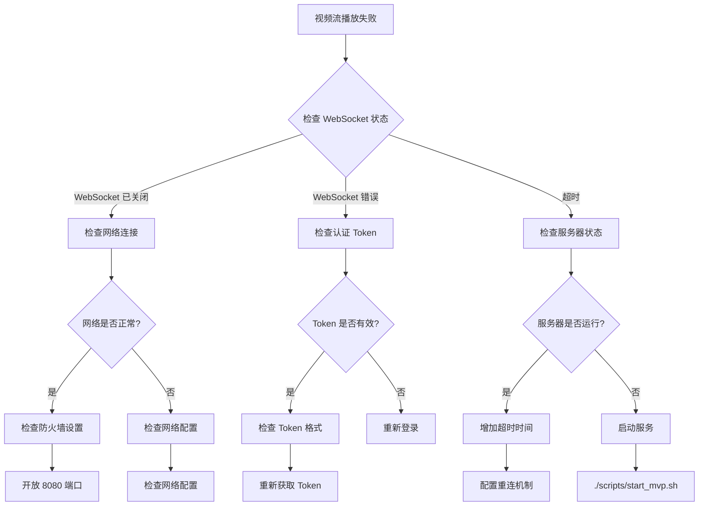
```mermaid
graph TD
    A[视频流播放失败] --> B{检查 WebSocket 状态}
    B -->|WebSocket 已关闭| C[检查网络连接]
    B -->|WebSocket 错误| D[检查认证 Token]
    B -->|超时| E[检查服务器状态]

    C --> C1{网络是否正常?}
    C1 -->|是| F[检查防火墙设置]
    C1 -->|否| G[检查网络配置]

    D --> D1{Token 是否有效?}
    D1 -->|是| H[检查 Token 格式]
    D1 -->|否| I[重新登录]

    E --> E1{服务器是否运行?}
    E1 -->|是| J[增加超时时间]
    E1 -->|否| K[启动服务]

    F --> L[开放 8080 端口]
    G --> M[检查网络配置]
    H --> N[重新获取 Token]
    J --> O[配置重连机制]
    K --> P[./scripts/start_mvp.sh]
```

**WebSocket 常见错误与解决方案：**

| 错误码 | 错误信息 | 可能原因 | 解决方案 |
|-------|---------|---------|---------|
| 1006 | WebSocket closed | 连接异常关闭（未收到关闭帧） | 检查服务器是否正常运行 |
| 1005 | No status code | 连接异常中断 | 检查网络稳定性 |
| 401/403 | Unauthorized | Token 无效或已过期 | 重新登录获取新 Token |
| 500 | Server error | 服务器内部错误 | 检查服务器日志 |

**WebSocket 连接测试：**

```javascript
// 在浏览器控制台中运行
const ws = new WebSocket('ws://localhost:8080/api/v1/h264/main');

ws.onopen = function() {
    console.log('WebSocket 已连接');
    // 发送认证消息
    const token = localStorage.getItem('token');
    if (token) {
        ws.send(JSON.stringify({
            type: 'auth',
            token: token
        }));
    }
};

ws.onmessage = function(event) {
    console.log('收到消息:', event.data);
};

ws.onclose = function(event) {
    console.log('WebSocket 已关闭:', event.code, event.reason);
};

ws.onerror = function(error) {
    console.error('WebSocket 错误:', error);
};
```

### 11.3 视频播放排查

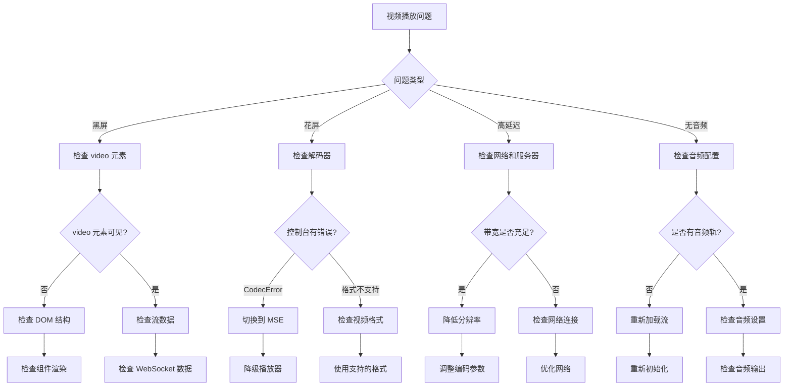
```mermaid
graph TD
    A[视频播放问题] --> B{问题类型}
    B -->|黑屏| C[检查 video 元素]
    B -->|花屏| D[检查解码器]
    B -->|高延迟| E[检查网络和服务器]
    B -->|无音频| F[检查音频配置]

    C --> C1{video 元素可见?}
    C1 -->|否| G[检查 DOM 结构]
    C1 -->|是| H[检查流数据]

    D --> D1{控制台有错误?}
    D1 -->|CodecError| I[切换到 MSE]
    D1 -->|格式不支持| J[检查视频格式]

    E --> E1{带宽是否充足?}
    E1 -->|是| K[降低分辨率]
    E1 -->|否| L[检查网络连接]

    F --> F1{是否有音频轨?}
    F1 -->|否| M[重新加载流]
    F1 -->|是| N[检查音频设置]

    G --> O[检查组件渲染]
    H --> P[检查 WebSocket 数据]
    I --> Q[降级播放器]
    J --> R[使用支持的格式]
    K --> S[调整编码参数]
    L --> T[优化网络]
    M --> U[重新初始化]
    N --> V[检查音频输出]
```

#### 黑屏问题

**现象：** 视频播放器显示黑屏，无画面内容。

**可能原因：**

- WebSocket 连接未建立
- SPS/PPS 未正确接收
- video 元素未正确挂载

**解决方案：**

```javascript
// 检查 video 元素
document.querySelector('video')?.controls = true;
document.querySelector('video')?.play();

// 重新加载视频流
const player = window.videoRendererInstance;
if (player) {
    player.restart();
}
```

#### 花屏/马赛克问题

**现象：** 视频出现马赛克、色块或其他视觉异常。

**可能原因：**

- 网络丢包
- 解码器不支持当前格式
- 帧同步问题

**解决方案：**

```javascript
// 启用降级模式
if (window.navigator.userAgent.indexOf('Safari') > -1) {
    // Safari 使用 MSE 播放器
    const player = new H264Player();
    player.initPlayer(videoElement);
    player.start(videoUrl);
}

// 降低播放质量
const videoElement = document.querySelector('video');
if (videoElement) {
    videoElement.playbackRate = 1.0;
}
```

#### 高延迟问题

**现象：** 视频播放明显滞后于实时画面。

**可能原因：**

- 网络延迟高
- 服务器处理慢
- 缓冲区设置不当

**解决方案：**

```javascript
// 调整播放器参数
const player = window.videoRendererInstance;
if (player) {
    player.setLatencyTarget(200); // 200ms
    player.setBufferLength(0.5);  // 0.5 秒
}

// 检查网络质量
navigator.connection.addEventListener('change', () => {
    console.log('连接类型:', navigator.connection.effectiveType);
    console.log('下行速度:', navigator.connection.downlink);
});
```

### 11.4 API 请求失败排查

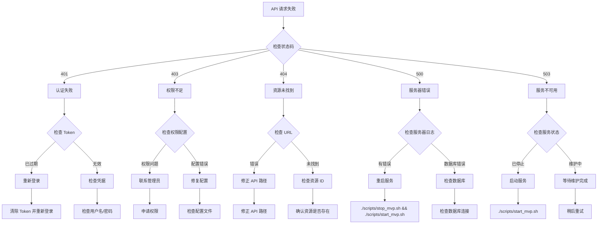
```mermaid
graph TD
    A[API 请求失败] --> B{检查状态码}
    B -->|401| C[认证失败]
    B -->|403| D[权限不足]
    B -->|404| E[资源未找到]
    B -->|500| F[服务器错误]
    B -->|503| G[服务不可用]

    C --> C1{检查 Token}
    C1 -->|已过期| H[重新登录]
    C1 -->|无效| I[检查凭据]

    D --> D1{检查权限配置}
    D1 -->|权限问题| J[联系管理员]
    D1 -->|配置错误| K[修复配置]

    E --> E1{检查 URL}
    E1 -->|错误| L[修正 API 路径]
    E1 -->|未找到| M[检查资源 ID]

    F --> F1{检查服务器日志}
    F1 -->|有错误| N[重启服务]
    F1 -->|数据库错误| O[检查数据库]

    G --> G1{检查服务状态}
    G1 -->|已停止| P[启动服务]
    G1 -->|维护中| Q[等待维护完成]

    H --> R[清除 Token 并重新登录]
    I --> S[检查用户名/密码]
    J --> T[申请权限]
    K --> U[检查配置文件]
    L --> V[修正 API 路径]
    M --> W[确认资源是否存在]
    N --> X[./scripts/stop_mvp.sh && ./scripts/start_mvp.sh]
    O --> Y[检查数据库连接]
    P --> Z[./scripts/start_mvp.sh]
    Q --> RETRY[稍后重试]
```

**常见 API 错误处理：**

**401 Unauthorized：**

```javascript
// 错误响应示例
{
    "success": false,
    "error": "Invalid token",
    "code": 401
}

// 解决方案：清除本地 Token 并重新登录
localStorage.removeItem('token');
localStorage.removeItem('user');
window.location.href = '/login';
```

**403 Forbidden：**

```javascript
// 错误响应示例
{
    "success": false,
    "error": "Permission denied",
    "code": 403
}

// 解决方案：检查用户权限，确认操作是否需要特殊权限，联系管理员
```

**500 Server Error：**

```javascript
// 错误响应示例
{
    "success": false,
    "error": "Internal server error",
    "code": 500
}

// 解决方案：
// 1. 检查服务器日志：tail -f /var/log/aipc/platform-api.log
// 2. 重启服务：./scripts/stop_mvp.sh && ./scripts/start_mvp.sh
// 3. 检查系统资源：top && df -h
```

### 11.5 前端性能排查

```mermaid
graph TD
    A[性能问题] --> B{现象}
    B -->|内存泄漏| C[检查组件卸载]
    B -->|CPU 占用高| D[检查渲染性能]
    B -->|UI 卡顿| E[检查计算密集任务]

    C --> C1{组件是否正确卸载?}
    C1 -->|否| F[修复组件生命周期]
    C1 -->|是| G[检查事件监听器]

    D --> D1{渲染帧率}
    D1 -->|低于 30fps| H[优化组件渲染]
    D1 -->|高于 60fps| I[性能正常]

    E --> E1{任务类型}
    E1 -->|列表渲染| J[使用虚拟滚动]
    E1 -->|数据处理| K[使用 Web Worker]

    F --> L[完善 useEffect 清理函数]
    G --> M[移除未清理的事件]
    H --> N[使用 React.memo]
    J --> O[使用 react-window]
    K --> P[迁移到 Worker 线程]
```

**内存泄漏排查：**

```javascript
// 在浏览器控制台中运行内存测试
// 1. 强制垃圾回收
if (window.gc) {
    window.gc();
}

// 2. 监控内存使用
const memoryUsed = performance.memory?.usedJSHeapSize;
console.log('内存使用:', memoryUsed / 1024 / 1024, 'MB');

// 3. 检查组件卸载 — 排查未清理的订阅
const subscriptions = [];
const originalAdd = subscriptions.push;
subscriptions.push = function(...args) {
    console.log('Adding subscription:', args);
    return originalAdd.apply(this, args);
};
```

**CPU 占用优化：**

```javascript
// 检查渲染性能
const observer = new PerformanceObserver((list) => {
    for (const entry of list.getEntries()) {
        if (entry.name.includes('Paint')) {
            console.log('绘制时间:', entry.duration);
        }
    }
});
observer.observe({ entryTypes: ['paint'] });

// 使用 React DevTools Profiler 分析组件渲染耗时，识别重渲染原因
```

### 11.6 开发环境排查

#### 依赖安装失败

```bash
# 清理缓存并重新安装
rm -rf node_modules
rm -rf .pnpm-store
pnpm install --force

# 检查 Node.js 版本（要求 18+ 或 20+）
node --version
npm --version
```

#### TypeScript 编译错误

```bash
# 强制类型检查
pnpm exec tsc --noEmit --strict

# 检查类型定义
pnpm exec tsc --noEmit --skipLibCheck

# 清理缓存
rm -rf .vite
```

#### 热更新失效

```bash
# 检查 Vite 配置
cat vite.config.ts

# 清理缓存
rm -rf .vite
rm -rf node_modules/.vite

# 检查端口占用
netstat -tulpn | grep :5174
```

**开发环境配置检查流程：**

```mermaid
graph TD
    A[开发环境问题] --> B{检查环境变量}
    B -->|缺失| C[设置环境变量]
    B -->|错误| D[修正配置]

    C --> C1[检查 .env 文件]
    C1 -->|不存在| E[创建 .env 文件]
    C1 -->|已存在| F[检查变量值]

    D --> D1[检查变量类型]
    D1 -->|错误| G[修正类型]
    D1 -->|正确| H[检查代理配置]

    E --> I[添加必需变量]
    F --> J[确认 VITE_API_TARGET]
    G --> K[修改变量格式]
    H --> L[检查 vite.config.ts]

    I --> M[参考 .env.example]
    J --> N[设置为 http://127.0.0.1:8080]
    K --> O[确保为字符串类型]
    L --> P[检查代理配置]
```

### 11.7 Web 控制台日志查看

**浏览器端日志：**

1. 打开浏览器开发者工具（F12）
2. 切换到 Console 标签页
3. 查看错误信息

**服务器端日志：**

```bash
# 查看 Platform API 服务日志
tail -f /var/log/aipc/platform-api.log

# 查看应用管理器日志
tail -f /var/log/aipc/app-manager.log

# 查看设备控制服务日志
tail -f /var/log/aipc/device-control.log

# 查看摄像头守护进程日志
tail -f /var/log/aipc/camera-daemon.log
```

## 12 常用诊断命令速查表

| 场景 | 命令 | 说明 |
|------|------|------|
| 查看服务状态 | `systemctl status ai-runtime camera-daemon app-manager` | 查看核心平台服务状态 |
| 查看服务日志 | `journalctl -u <service-name> -f` | 实时查看服务日志 |
| 测试 gRPC 连接 | `grpcurl -plaintext unix:///run/aipc/service.sock list` | 测试 gRPC 服务可用性 |
| 检查 Socket | `ls -la /run/aipc/` | 查看 Unix Socket 文件 |
| 检查端口占用 | `netstat -tulpn \| grep 8554` | 检查 RTSP 端口占用 |
| 检查系统资源 | `top -p $(pidof service)` | 监控服务资源占用 |
| 查看容器状态 | `aipc-cli app list` | 列出所有容器应用 |
| 测试网络连接 | `curl http://localhost:8080/api/v1/media/status` | 测试 API 端点 |
| 查看模型状态 | `grpcurl -plaintext -d '{}' unix:///run/aipc/ai-runtime.sock aipc.platform.inference.v1.InferenceService/ListModels` | 列出已注册模型 |
| 检查 NPU 状态 | `hailortcli scan` | 查看 Hailo 设备状态 |
| 测试 PTZ 控制 | `grpcurl -plaintext -d '{"direction": "PAN_LEFT", "speed": 50}' unix:///run/aipc/device-control.sock aipc.platform.device.v1.DeviceControl/Pan` | 测试 PTZ 控制 |
| 查看事件日志 | `aipc-cli event-bus logs` | 查看事件总线日志 |
| 查看磁盘占用 | `df -h /opt/aipc` | 检查磁盘空间 |
| 查看内存占用 | `free -h` | 检查系统内存 |

## 13 错误码表

| 错误码 | 错误名称 | 说明 | 解决方案 |
|-------|---------|------|---------|
| 10001 | E_AUTH_FAILED | 认证失败 | 检查用户名/密码 |
| 10002 | E_TOKEN_EXPIRED | Token 已过期 | 重新登录 |
| 20001 | E_DEVICE_NOT_FOUND | 设备未找到 | 检查设备连接 |
| 20002 | E_STREAM_TIMEOUT | 流超时 | 检查网络连接 |
| 30001 | E_APP_NOT_INSTALLED | 应用未安装 | 先安装应用 |
| 30002 | E_APP_RUNNING | 应用正在运行 | 先停止应用 |
| 40001 | E_MODEL_NOT_FOUND | 模型未找到 | 扫描模型目录 |
| 40002 | E_MODEL_LOAD_FAILED | 模型加载失败 | 检查模型格式 |
| 50001 | E_SYSTEM_ERROR | 系统错误 | 检查系统日志 |
| 50002 | E_RESOURCE_BUSY | 资源忙 | 等待资源释放 |

## 14 排查总结

1. **优先检查服务状态** -- 使用 `systemctl status` 确认服务是否运行
2. **查看错误日志** -- 使用 `journalctl` 查看详细错误信息
3. **验证网络连接** -- 检查 Socket 和端口是否正常
4. **检查资源占用** -- 确保系统资源充足
5. **逐模块排查** -- 从底层硬件到上层应用逐步验证
6. **保留完整日志** -- 在故障前后保存充足的日志信息

## 15 Web 控制台排查清单

### 基础检查

- [ ] 网络连接正常（可 ping 设备 IP）
- [ ] 浏览器版本受支持（推荐 Chrome）
- [ ] 登录会话有效
- [ ] Token 未过期
- [ ] 服务器各服务正常运行

### 进阶检查

- [ ] 防火墙允许 8080 端口
- [ ] 系统资源占用正常
- [ ] 磁盘空间充足
- [ ] 硬件设备连接正常
- [ ] 配置文件正确

### 性能优化检查

- [ ] 组件无内存泄漏
- [ ] 渲染性能良好
- [ ] API 请求缓存有效
- [ ] 视频流参数已优化
- [ ] 网络带宽充足

### 联系技术支持

如果以上方法均无法解决问题，请提供以下信息：

1. 问题描述
2. 浏览器版本和操作系统
3. 控制台错误截图
4. 相关日志文件
5. 问题复现步骤

技术支持邮箱：support@aipc.tech

## 相关文档

- [平台架构](../3-software-platform/0-platform-architecture.md)
- [FAQ](./3-faq.md)
- [配置参考](./1-config-reference.md)
- [AI Runtime 服务](../4-service-reference/0-ai-runtime.md)
- [App Manager 服务](../4-service-reference/1-app-manager.md)
