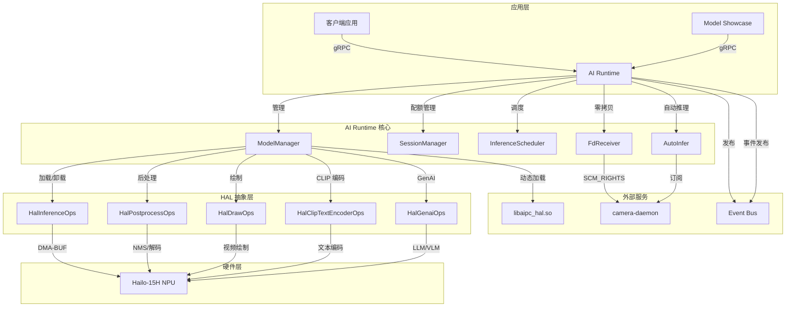
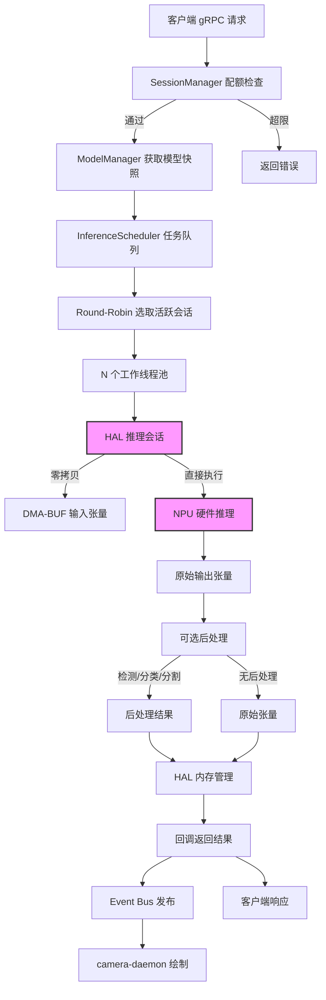
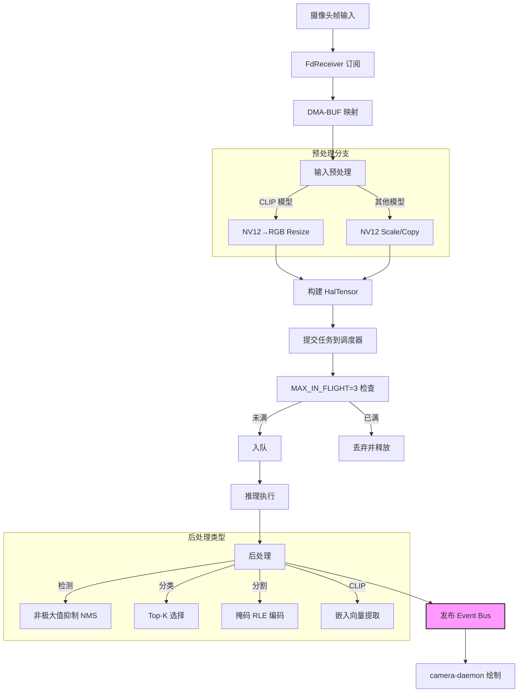
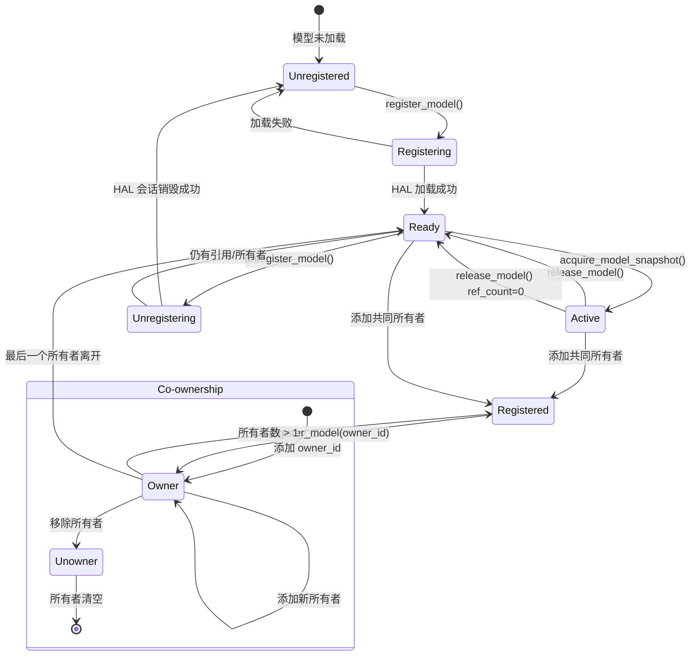
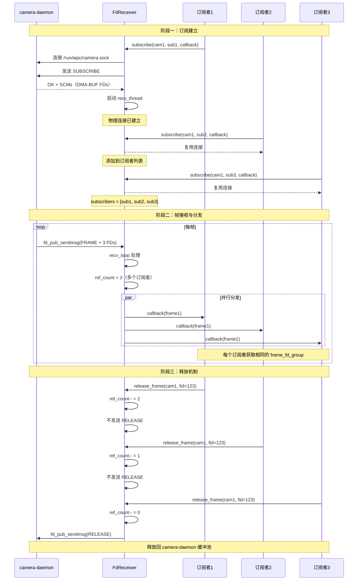

# AI Runtime Service

## 1 概述

AI Runtime 是 NE503 平台上的统一推理服务，负责 NPU 计算调度、模型生命周期管理和推理执行。它支持传统 CV 模型推理以及 GenAI（LLM/VLM）流式生成，是整个 AI 推理管线的核心枢纽。

技术栈：**C++17 + gRPC**，通过 HAL（Hardware Abstraction Layer）动态加载硬件加速库，实现对 Hailo-15H NPU 的透明调用。

核心能力：

- **模型生命周期管理** — 支持多应用共享模型、引用计数与 RAII 自动释放
- **公平调度** — Round-Robin 算法确保多会话公平使用 NPU 资源
- **零拷贝数据通路** — DMA-BUF 文件描述符传递，从摄像头到 NPU 全程无内存拷贝
- **GenAI 流式生成** — 支持 LLM/VLM 文本生成与图像理解

## 2 架构



架构分为四层：应用层通过 gRPC/Unix Socket 接入；AI Runtime 核心层包含五大组件协调推理全流程；HAL 抽象层屏蔽硬件差异，通过动态加载 `libaipc_hal.so` 实现可插拔的硬件加速；硬件层直接与 Hailo-15H NPU 交互。

## 3 核心组件

| 组件 | 职责 | 关键特性 |
|------|------|----------|
| **ModelManager** | 模型加载/卸载、生命周期管理 | 引用计数、Co-ownership、原子快照 |
| **SessionManager** | 会话配额管理（QPS/并发/FPS） | 独立队列、滑动窗口统计 |
| **InferenceScheduler** | 推理任务调度 | Round-Robin 公平调度、工作线程池 |
| **FdReceiver** | DMA-BUF 零拷贝帧接收 | 连接复用、引用计数、组播分发 |
| **AutoInfer** | 自动推理管线 | 帧订阅→推理→后处理→事件发布 |

HAL 层提供五组操作接口：

| HAL 接口 | 功能 | 关键方法 |
|----------|------|----------|
| `HalInferenceOps` | 核心推理 | `create`、`run`、`destroy` |
| `HalPostprocessOps` | 后处理（NMS、解码等） | `create`、`run`、`apply_config_json` |
| `HalDrawOps` | 可视化绘制 | `overlay_detection` 等 |
| `HalClipTextEncoderOps` | CLIP 文本编码 | `create`、`encode`、`destroy` |
| `HalGenaiOps` | GenAI LLM/VLM | `create`、`generate_stream`、`abort_generation` |

## 4 推理管线



推理管线关键流程：

1. **配额校验** — SessionManager 检查 QPS、并发数和 FPS 限制
2. **模型快照** — 通过原子引用获取 ModelSnapshot，确保线程安全
3. **调度执行** — Round-Robin 算法从活跃会话队列中公平选取任务
4. **零拷贝输入** — DMA-BUF 文件描述符直接传入 NPU，无内存拷贝
5. **后处理（可选）** — 检测、分类、分割等类型自动执行相应后处理
6. **结果分发** — 同时通过 Event Bus 发布给 camera-daemon 进行视频叠加绘制

## 5 自动推理管线

AutoInfer 组件实现了从摄像头帧到推理结果发布的全自动管线：



**AutoInfer 特性**：
- **MAX_IN_FLIGHT=3** — 防止摄像头缓冲池耗尽
- **自适应预处理** — 根据模型类型自动转换输入格式
- **流控** — FPS 限速和帧丢弃保护

**Event Bus 推理结果 Topic**：推理结果自动发布到 `inference/{model_id}/{stream_id}` 格式的 Topic，开发者可订阅此 Topic 获取实时推理结果。

## 6 模型生命周期



**模型管理关键特性**：

- **引用计数（Reference Counting）** — `ref_count` 跟踪模型活跃使用数，归零方可卸载
- **共同所有权（Co-ownership）** — 多个应用可共享同一模型，按所有者独立卸载
- **原子快照（Atomic Snapshots）** — `ModelSnapshot` 保证多线程下安全访问模型资源
- **RAII 保护** — `ModelGuard` 在作用域结束时自动释放模型引用，防止资源泄漏

## 7 gRPC API

服务名称：`InferenceService`，监听地址 `unix:///run/aipc/ai-runtime.sock`。

### 模型管理

| RPC | Request | Response | 说明 |
|-----|---------|----------|------|
| `RegisterModel` | `ModelRegisterRequest` | `ModelRegisterResponse` | 注册模型到 NPU |
| `UnregisterModel` | `ModelInfo` | `Status` | 卸载模型 |
| `ListModels` | `Empty` | `ModelListResponse` | 列出已注册模型 |
| `GetModelInfo` | `ModelInfo` | `ModelInfo` | 获取模型详情 |

### 推理

| RPC | Request | Response | 说明 |
|-----|---------|----------|------|
| `Infer` | `InferRequest` | `InferResponse` | 单次推理 |
| `StreamInfer` | `StreamInferRequest` | `stream StreamInferResponse` | 流式推理（实时视频） |

### 会话管理

| RPC | Request | Response | 说明 |
|-----|---------|----------|------|
| `CreateSession` | `SessionConfig` | `SessionCreateResponse` | 创建配额会话 |
| `DestroySession` | `SessionConfig` | `Status` | 销毁会话 |

### 统计与配置

| RPC | Request | Response | 说明 |
|-----|---------|----------|------|
| `GetStats` | `Empty` | `SystemStats` | 获取系统统计 |
| `UpdatePostprocessConfig` | `UpdatePostprocessConfigRequest` | `UpdatePostprocessConfigResponse` | 更新后处理配置 |
| `EncodeText` | `EncodeTextRequest` | `EncodeTextResponse` | CLIP 文本编码 |

### GenAI（LLM/VLM）

| RPC | Request | Response | 说明 |
|-----|---------|----------|------|
| `GenaiCreateSession` | `GenaiCreateSessionRequest` | `GenaiCreateSessionResponse` | 创建 GenAI 会话 |
| `GenaiDestroySession` | `GenaiCreateSessionRequest` | `Status` | 销毁会话（复用 GenaiCreateSessionRequest，因仅需 session_id 字段） |
| `GenaiGenerate` | `GenaiGenerateRequest` | `stream GenaiGenerateResponse` | 流式生成 |
| `GenaiAbort` | `GenaiAbortRequest` | `Status` | 中止生成 |

### 关键消息结构

**张量数据**：

```protobuf
message Tensor {
  repeated int32 shape = 1;
  DataType dtype = 2;     // UINT8/INT8/FLOAT16/FLOAT32 等
  bytes data = 3;
  int32 dma_fd = 4;       // DMA-BUF 零拷贝文件描述符
}
```

**结构化后处理结果**：

```protobuf
message PostResult {
  repeated Detection detections = 1;          // 目标检测
  repeated Classification classifications = 2; // 分类
  repeated LandmarkSet landmarks = 3;         // 关键点
  repeated SegmentationMask masks = 4;        // 分割
  repeated OcrLine ocr_lines = 5;             // OCR
  repeated Embedding embeddings = 6;          // 嵌入向量
  repeated DepthMap depth_maps = 7;           // 深度估计
}
```

**模型注册请求**：

```protobuf
message ModelRegisterRequest {
  string model_path = 1;
  string model_id = 2;
  repeated TensorSpec inputs = 3;
  repeated TensorSpec outputs = 4;
  string model_type = 13;      // detection, landmarks, segmentation, classification
  string model_variant = 14;   // yolov8n, yolov8s 等
  string owner_id = 12;
}
```

> 字段编号 5-11 为历史版本保留位，12-14 为新增字段。

## 8 DMA-BUF 零拷贝



**FdReceiver 关键特性**：

- **连接复用** — 同一 camera-daemon 流的多个订阅者共享物理连接
- **引用计数** — 防止 DMA-BUF 被过早释放，只有所有订阅者释放后才归还缓冲池
- **组播分发** — 所有订阅者接收同一帧数据
- **RAII 管理** — `FdGroup` 自动关闭文件描述符，防止 FD 泄漏

## 9 后处理类型

| 后处理类型 | HAL 枚举 | 模型类型 | 默认参数 |
|-----------|----------|---------|---------|
| 目标检测 | `HAL_POST_TYPE_DETECTION` | detection, yolo | 置信度 0.25，NMS 0.45 |
| 关键点 | `HAL_POST_TYPE_KEYPOINT` | landmarks, keypoint | 置信度 0.25 |
| 分割 | `HAL_POST_TYPE_SEGMENTATION` | segmentation | 置信度 0.25 |
| 分类 | `HAL_POST_TYPE_CLASSIFICATION` | classification | 置信度 0.25，Top-K 5 |
| CLIP | `HAL_POST_TYPE_CLIP` | clip, embedding | 默认配置 |
| OCR 检测 | `HAL_POST_TYPE_OCR_DETECTION` | ocr_detection | 置信度 0.25，NMS 0.45 |
| OCR 识别 | `HAL_POST_TYPE_OCR_RECOGNITION` | ocr_recognition | 默认配置 |
| 深度图 | `HAL_POST_TYPE_DEPTH` | depth, monocular_depth | 默认配置 |

## 10 GenAI 支持

AI Runtime 支持 LLM（大语言模型）和 VLM（视觉语言模型）的流式生成。创建 GenAI 会话时，系统会强制卸载所有已加载的 CV 模型以释放 NPU 资源，并等待 HAL 完成清理后（约 6 秒）再加载 GenAI 模型。

**流式生成流程**：

1. 客户端通过 `GenaiCreateSession` 创建会话
2. 发送 `GenaiGenerate` 请求，携带提示词和生成参数（Temperature、Top-P 等）
3. HAL 通过回调机制逐 Token 生成，每个 Token 立即通过 gRPC Server Stream 返回客户端
4. 遇到结束标记时发送完成信号

支持能力：文本生成、图像理解、多轮对话、LoRA 微调。

## 11 配置

配置文件：`configs/ai/ai-runtime.yaml`

| 配置段 | 关键参数 | 说明 |
|--------|---------|------|
| **service** | `listen` | gRPC 监听地址，默认 `unix:///run/aipc/ai-runtime.sock` |
| **hal** | `library_path`、`device_path` | HAL 动态库路径、NPU 设备路径（`/dev/hailo0`） |
| **models** | `repository_path`、`cache_path`、`preload` | 模型仓库路径、缓存路径、预加载模型列表 |
| **scheduler** | `global_qps_limit`、`strategy`、`timeout_ms` | 全局 QPS 限制、调度策略（priority/fifo/fair）、超时时间 |
| **performance** | `device_mode`、`batch_enabled`、`max_model_cache` | 设备模式（high/normal/low）、批量推理、最大模型缓存数 |
| **monitoring** | `enabled`、`stats_interval_sec`、`temperature_limit_c` | 监控开关、统计间隔、温度保护阈值（85°C 停机保护，80°C 降频） |
| **event_bus** | `enabled`、`endpoint`、`auto_publish_results` | Event Bus 开关、连接地址、自动发布推理结果 |
| **auto_infer** | `enabled`、`pipelines` | 自动推理开关、管线配置（model_id、stream_id、fps） |

**调度策略说明**：

- **fair**（默认）— Round-Robin 公平轮转，确保各会话均衡获得推理机会
- **priority** — 按会话优先级调度，高优先级会话优先执行
- **fifo** — 先进先出，按提交顺序执行

**会话配额配置示例**：

```yaml
scheduler:
  default_session:
    max_qps: 30          # 默认最大 QPS
    max_concurrent: 2    # 默认最大并发推理数
    priority: 5          # 默认优先级（1-10）
```

## 12 监控统计

### 系统统计指标

| 指标 | 说明 |
|------|------|
| **NPU 利用率** | 硬件加速器使用率 |
| **CPU 利用率** | 系统 CPU 使用率 |
| **DSP 利用率** | 数字信号处理器负载 |
| **内存使用** | 总内存和已用量 |
| **推理延迟** | 队列等待 + 推理执行时间 |
| **FPS 统计** | 每会话实际推理帧率 |

## 13 故障排查

| 问题 | 可能原因 | 排查方法 |
|------|---------|---------|
| 模型注册失败 | 模型路径错误、NPU 设备权限不足 | 检查模型文件路径、`/dev/hailo0` 权限 |
| 推理超时 | 队列积压、并发限制过低 | 检查 `global_qps_limit` 和 `max_concurrent` 配置 |
| 零拷贝失败 | camera-daemon 连接异常 | 检查 `/run/aipc/camera.sock` 连接状态 |
| 内存不足 | 模型缓存过多、并发数过高 | 调低 `max_model_cache` 和并发限制 |
| 设备过热 | NPU 负载过高、散热不足 | 检查 `temperature_limit_c` 配置，降低推理负载 |

常用调试命令：

```bash
# 查看服务日志
journalctl -u ai-runtime

# 查看 Hailo 设备状态
hailortcli scan

# 性能分析
perf stat
```

## 14 相关文档

- [平台架构](../../3-platform-development/0-platform-architecture.md) — NE503 软件平台整体架构
- [应用开发指南](../../4-application-development/1-app-reference.md) — AI 应用开发流程
- [SDK 参考](../../4-application-development/2-sdk-reference.md) — Python/CLI SDK 使用说明
- [CLI 工具指南](../../5-system-integration/3-cli-guide.md) — 命令行工具 `aipc-cli` 使用
- [RESTful API](../../5-system-integration/1-restful-api.md) — RESTful API 接口参考
