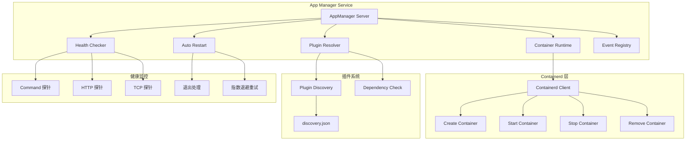
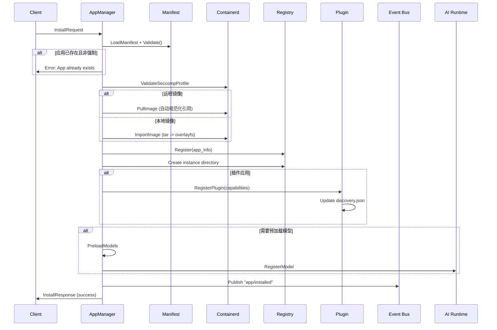
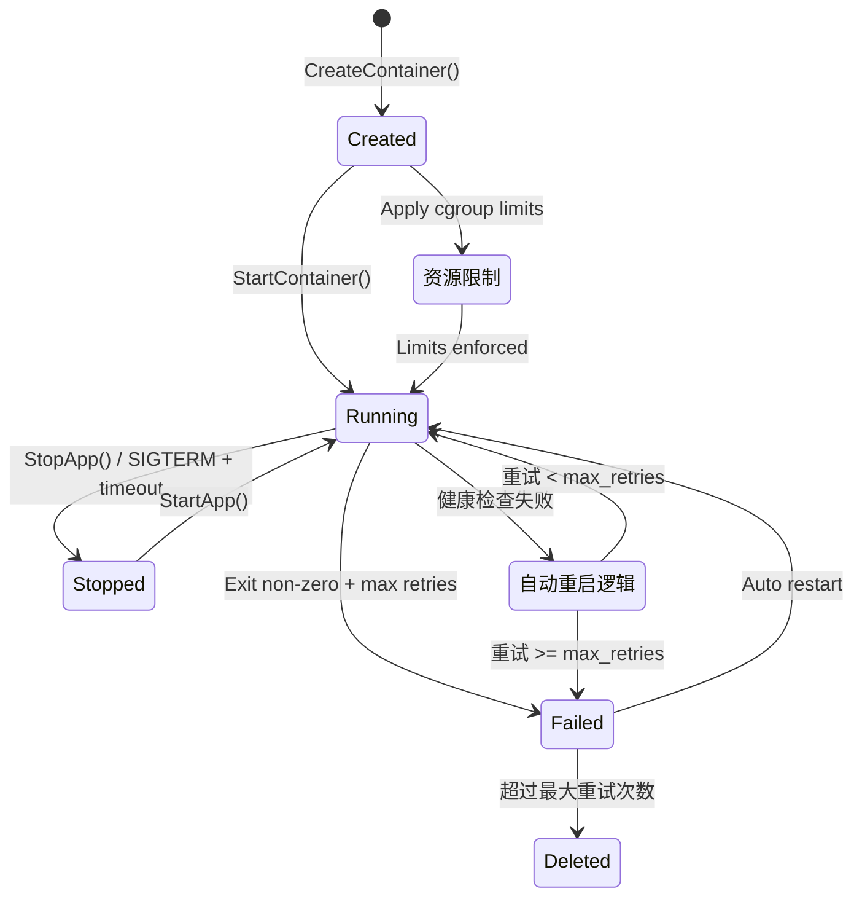
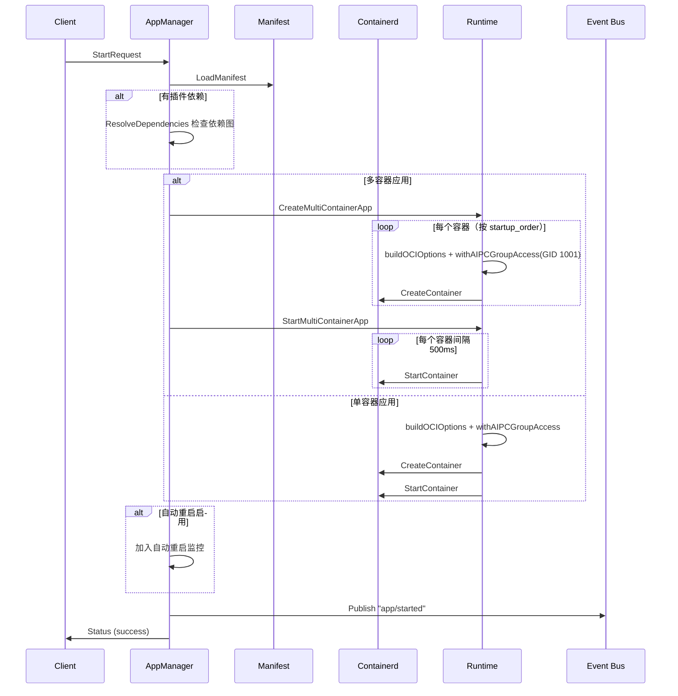
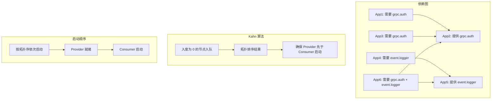
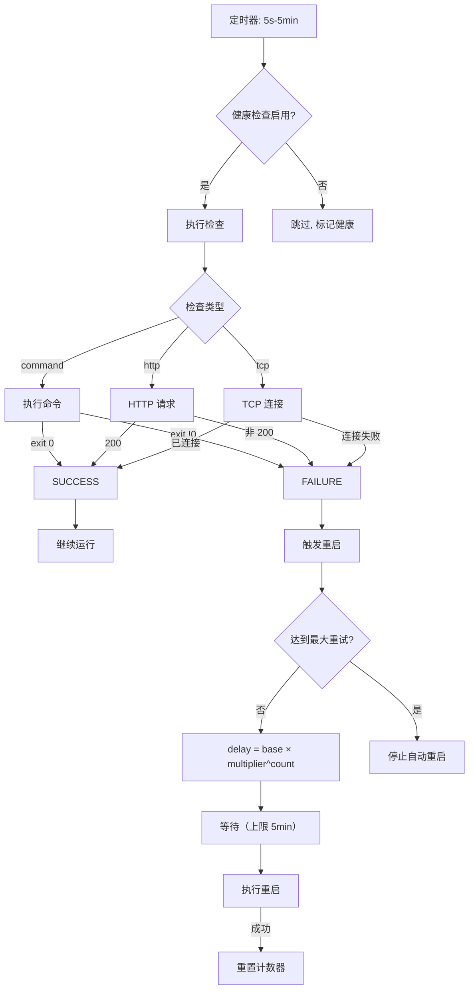

# App Manager Service

## 1 概述

App Manager 是 AIPC 平台核心容器生命周期管理服务，基于 containerd 构建。提供应用安装、启动、停止、卸载和监控的统一 API，支持单容器和多容器（Main/Sub）架构，内置插件系统、健康监控和安全沙箱。

核心能力：

- **容器生命周期管理** — 完整的 CRUD 操作，支持异步安装和批量操作
- **多容器架构** — Main/Sub 模式，支持复杂应用的有序启动和关闭
- **插件系统** — 基于能力的插件发现与 Kahn 算法依赖解析
- **健康监控** — Command/HTTP/TCP 三种探针 + 指数退避自动重启
- **安全沙箱** — Namespace、Capability、Seccomp 三层隔离

## 2 架构



服务监听 `unix:///run/aipc/app-manager.sock`，通过 containerd 管理容器运行时，与 Event Bus、AI Runtime 等服务集成。

## 3 gRPC API

服务名称：`AppManager`，监听地址 `unix:///run/aipc/app-manager.sock`。

### 应用生命周期管理

| RPC | Request | Response | 说明 |
|-----|---------|----------|------|
| `InstallApp` | `InstallRequest` | `InstallResponse` | 安装应用 |
| `AsyncInstallApp` | `AsyncInstallRequest` | `AsyncInstallResponse` | 异步安装 |
| `GetInstallProgress` | `InstallProgressRequest` | `InstallProgressResponse` | 查询安装进度 |
| `StartApp` | `StartRequest` | `Status` | 启动应用 |
| `StopApp` | `StopRequest` | `Status` | 停止应用 |
| `UninstallApp` | `UninstallRequest` | `Status` | 卸载应用 |
| `ListApps` | `Empty` | `AppList` | 列出应用 |
| `GetApp` | `GetAppRequest` | `AppInfo` | 获取应用详情 |
| `GetAppStats` | `GetAppRequest` | `AppStats` | 获取资源统计 |
| `GetAppLogs` | `GetLogsRequest` | `stream LogLine` | 流式读取日志 |
| `BatchOperation` | `BatchRequest` | `BatchResponse` | 批量操作 |

### 容器管理

| RPC | Request | Response | 说明 |
|-----|---------|----------|------|
| `ListContainers` | `ListContainersRequest` | `ContainerList` | 列出容器 |
| `GetContainer` | `GetContainerRequest` | `ContainerDetail` | 容器详情 |
| `GetContainerStats` | `GetContainerRequest` | `ContainerStats` | 容器统计 |
| `GetContainerLogs` | `GetContainerLogsRequest` | `stream LogLine` | 容器日志 |
| `StartContainer` | `ContainerRequest` | `Status` | 启动容器 |
| `StopContainer` | `ContainerRequest` | `Status` | 停止容器 |
| `RestartContainer` | `ContainerRequest` | `Status` | 重启容器 |
| `RemoveContainer` | `RemoveContainerRequest` | `Status` | 删除容器 |

### 镜像与资源管理

| RPC | Request | Response | 说明 |
|-----|---------|----------|------|
| `ListImages` | `Empty` | `ImageList` | 列出镜像 |
| `RemoveImage` | `RemoveImageRequest` | `Status` | 删除镜像 |
| `GetDiskUsage` | `Empty` | `DiskUsageResponse` | 磁盘用量 |
| `PruneResources` | `PruneRequest` | `PruneResponse` | 清理资源 |

### 高级操作

| RPC | Request | Response | 说明 |
|-----|---------|----------|------|
| `InspectApp` | `GetAppRequest` | `InspectResponse` | 检查应用配置 |
| `ExecContainer` | `stream ExecInput` | `stream ExecOutput` | 容器内执行命令 |

## 4 应用安装流程



**关键实现**：

- **镜像处理** — 远程镜像自动规范化引用（如 `nginx:latest` -> `docker.io/library/nginx:latest`），本地镜像通过 Import + Unpack 导入 overlayfs
- **注册表管理** — 使用 GORM + SQLite 存储应用元数据，原子写入确保一致性
- **插件注册** — 解析 `plugin.capabilities`，原子更新 `/run/aipc/plugins/discovery.json`

## 5 容器生命周期



**容器 ID 格式**：
- 主容器：`aipc-{appID}`
- 子容器：`aipc-{appID}-{containerName}`

## 6 多容器架构

多容器应用采用 Main/Sub 模式，支持有序启动：

```yaml
# 多容器应用 Manifest 示例
spec:
  containers:
    api-gateway:
      role: main
      image: myapp/gateway:1.0
      healthcheck:
        type: http
        path: /health
        port: 8080
    worker-1:
      role: sub
      image: myapp/worker:1.0
    processor:
      role: sub
      image: myapp/processor:1.0

  lifecycle:
    startup_order: [worker-1, processor, api-gateway]
    shutdown_order: [api-gateway, processor, worker-1]
```

**Main/Sub 权限差异**：

| 特性 | 主容器 | 子容器 |
|------|--------|--------|
| `/run/aipc` | 挂载 | 不挂载 |
| 设备访问 | 有权限 | 无权限 |
| 网络模式 | 可用 host | 隔离 |
| Capabilities | 基础能力集 | 最小集 |
| 用途 | 平台服务访问 | 业务逻辑执行 |

启动顺序按 `lifecycle.startup_order` 配置执行，每个容器间隔 500ms。若未配置 startup_order，默认按子容器先于主容器的顺序启动。

### 启动应用流程



## 7 插件依赖解析

插件系统使用 Kahn 算法进行拓扑排序，解析依赖关系：



**解析流程**：

1. **构建邻接表** — consumer -> provider 映射
2. **计算入度** — 每个节点的依赖数
3. **初始化队列** — 入度为 0 的节点入队
4. **拓扑排序** — 出队、减邻接入度、新零入度入队
5. **环检测** — 结果长度 < 总节点数则存在循环依赖

**插件发现** — 维护 `/run/aipc/plugins/discovery.json`，记录所有运行中插件的能力、传输方式和 Socket 路径。

**discovery.json 格式示例**：

```json
{
  "version": "1",
  "updated_at": "2024-01-01T00:00:00Z",
  "plugins": {
    "auth-service": {
      "app_id": "auth-service",
      "version": "1.0.0",
      "state": "running",
      "capabilities": [
        {
          "id": "grpc.auth",
          "version": "1.0",
          "transport": "grpc",
          "grpc": {
            "socket_path": "/run/aipc/plugins/auth-service.sock",
            "service": "AuthService"
          }
        }
      ]
      ,
      "updated_at": "2024-01-01T00:00:00Z"
    }
  }
}
```

注意：每个插件条目还包含独立的 `"updated_at"` 字段用于时间戳追踪。

在应用 Manifest 中声明插件能力：

```yaml
plugin:
  capabilities:
    - id: grpc.auth
      version: "1.0"
      transport: grpc
      proto: AuthService
      description: "认证服务"
    - id: event.logger
      version: "1.0"
      transport: event
      topics:
        publish: [app/logs/error, app/logs/info]
        subscribe: [app/events/user]
```

## 8 健康检查与自动重启

支持三种探针类型和指数退避重启策略：



**重启策略参数**：

| 参数 | 默认值 | 说明 |
|------|--------|------|
| 基础延迟 | 5s | 首次重试等待时间 |
| 退避乘数 | 1.5x | 每次重试延迟倍增 |
| 最大重试 | 0（无限） | 0 表示不限次 |
| 延迟上限 | 5min | 最大等待时间 |
| 检查间隔 | 30s | 健康探针执行间隔 |

> **注意**：Manifest 中的 `restart_policy` / `restart_max_retries` 是容器级别的退出重启策略，而 `auto_restart` 是平台级别的健康检查重启策略。两者独立运行，互不影响。

## 9 安全沙箱

### Namespace 隔离

| Namespace | 默认状态 | 说明 |
|-----------|---------|------|
| PID | 启用 | 进程隔离 |
| NET | 启用 | 网络隔离 |
| IPC | 启用 | System V IPC 和 POSIX 消息队列隔离 |
| UTS | 启用 | 主机名隔离 |
| MOUNT | 启用 | 文件系统挂载点隔离 |
| USER | 禁用 | 需要特权 |

### Capability 控制

默认丢弃的危险能力：`CAP_SYS_ADMIN`、`CAP_NET_ADMIN`、`CAP_SYS_MODULE`、`CAP_SYS_TIME`、`CAP_SYS_RAWIO`、`CAP_SYS_PTRACE`、`CAP_SYS_CHROOT`、`CAP_SYS_BOOT`、`CAP_MKNOD`。

### 资源限制（cgroup v2）

通过 cgroup v2 实现资源控制：

| 资源 | 默认限制 | cgroup 路径 |
|------|---------|------------|
| CPU | 50% 单核 | `/sys/fs/cgroup/.../group-aipc-{id}.scope/cpu.max` |
| 内存 | 256Mi | `memory.max` |
| PID | 128 | `pids.max` |

## 10 配置

配置文件路径：`configs/platform/app-manager.yaml`

| 配置段 | 关键参数 | 说明 |
|--------|---------|------|
| **service** | `listen`、`log_level` | gRPC 监听地址（`unix:///run/aipc/app-manager.sock`）、日志级别 |
| **containerd** | `address`、`namespace`、`runtime`、`snapshotter` | containerd 连接配置（`/run/containerd/containerd.sock`、`aipc` 命名空间） |
| **apps** | `registry_path`、`instances_path`、`logs_path` | 应用注册表、实例和日志目录 |
| **security** | `seccomp_profile`、`readonly_rootfs`、`capabilities_drop` | 安全沙箱配置（详见[配置参考](../3-config-reference.md#4-app-manageryaml)） |
| **resources** | `default_cpu_quota`、`default_memory_mb`、`max_total_*` | 默认资源限制和总量上限 |
| **airuntime** | `enabled`、`endpoint` | AI Runtime 集成配置 |
| **eventbus** | `enabled`、`endpoint`、`publish_events` | Event Bus 事件发布配置 |

**事件发布主题**：`app/installed`、`app/started`、`app/stopped`、`app/uninstalled`、`plugin/status`。

## 11 故障排查

| 问题 | 可能原因 | 排查方法 |
|------|---------|---------|
| 容器启动失败 | 镜像损坏、权限不足 | 查看应用日志 `GetAppLogs`，检查 seccomp 配置 |
| 镜像拉取失败 | 网络问题、引用格式错误 | 检查镜像引用格式，尝试本地导入 |
| 资源不足 | cgroup 限制过高、内存溢出 | 调整 `resources` 配置，查看 `GetAppStats` |
| 插件依赖冲突 | 循环依赖、能力未提供 | 检查 `discovery.json`，验证依赖图 |
| 健康检查超时 | 应用内部错误、探针配置不当 | 检查探针类型和参数，查看应用日志 |

常用调试命令：

```bash
# 安装应用
grpcurl -plaintext -d '{
  "manifest_path": "/etc/aipc/apps/my-app.yaml",
  "image_path": "docker.io/myapp/myapp:latest",
  "force": false
}' unix:///run/aipc/app-manager.sock \
  aipc.platform.app.v1.AppManager/InstallApp

# 启动应用
grpcurl -plaintext -d '{"app_id":"my-app"}' \
  unix:///run/aipc/app-manager.sock \
  aipc.platform.app.v1.AppManager/StartApp

# 查看资源统计
grpcurl -plaintext -d '{"app_id":"my-app"}' \
  unix:///run/aipc/app-manager.sock \
  aipc.platform.app.v1.AppManager/GetAppStats

# 批量操作
grpcurl -plaintext -d '{
  "app_ids": ["app1", "app2", "app3"],
  "operation": "start",
  "timeout_seconds": 30
}' unix:///run/aipc/app-manager.sock \
  aipc.platform.app.v1.AppManager/BatchOperation
```

### 单容器 Manifest 完整示例

```yaml
apiVersion: v1
kind: Application
metadata:
  id: my-app
  name: My Application
  version: 1.0.0
  description: A sample application
spec:
  image: nginx:latest
  permissions:
    inference:
      models:
        - yolov8n
      max_qps: 100
    events:
      publish:
        - app/events/data
    device:
      light: true
  resources:
    cpu: "50%"
    memory: "256Mi"
  env:
    - name: ENV
      value: production
  volumes:
    - host: /opt/aipc/configs/nginx.conf
      container: /etc/nginx/nginx.conf
      readonly: true
  autostart: true
  restart_policy: always
  restart_max_retries: 3
  healthcheck:
    enabled: true
    type: http
    path: /health
    port: 8080
    interval: 30s
    timeout_seconds: 5
    retries: 3
  auto_restart:
    enabled: true
    max_retries: 5
    retry_delay_seconds: 5
    backoff_multiplier: 1.5
    health_check_interval_seconds: 30
  security:
    no_new_privileges: true
    readonly_rootfs: true
```

## 12 相关文档

- [平台架构](../../3-platform-development/0-platform-architecture.md) — NE503 软件平台整体架构
- [应用开发指南](../../4-application-development/1-app-reference.md) — 应用开发完整流程
- [AI Runtime 服务](./0-ai-runtime.md) — AI 推理服务参考
- [Event Bus 服务](./2-event-bus.md) — 事件总线服务参考
- [CLI 工具指南](../../5-system-integration/3-cli-guide.md) — aipc-cli 命令行工具
