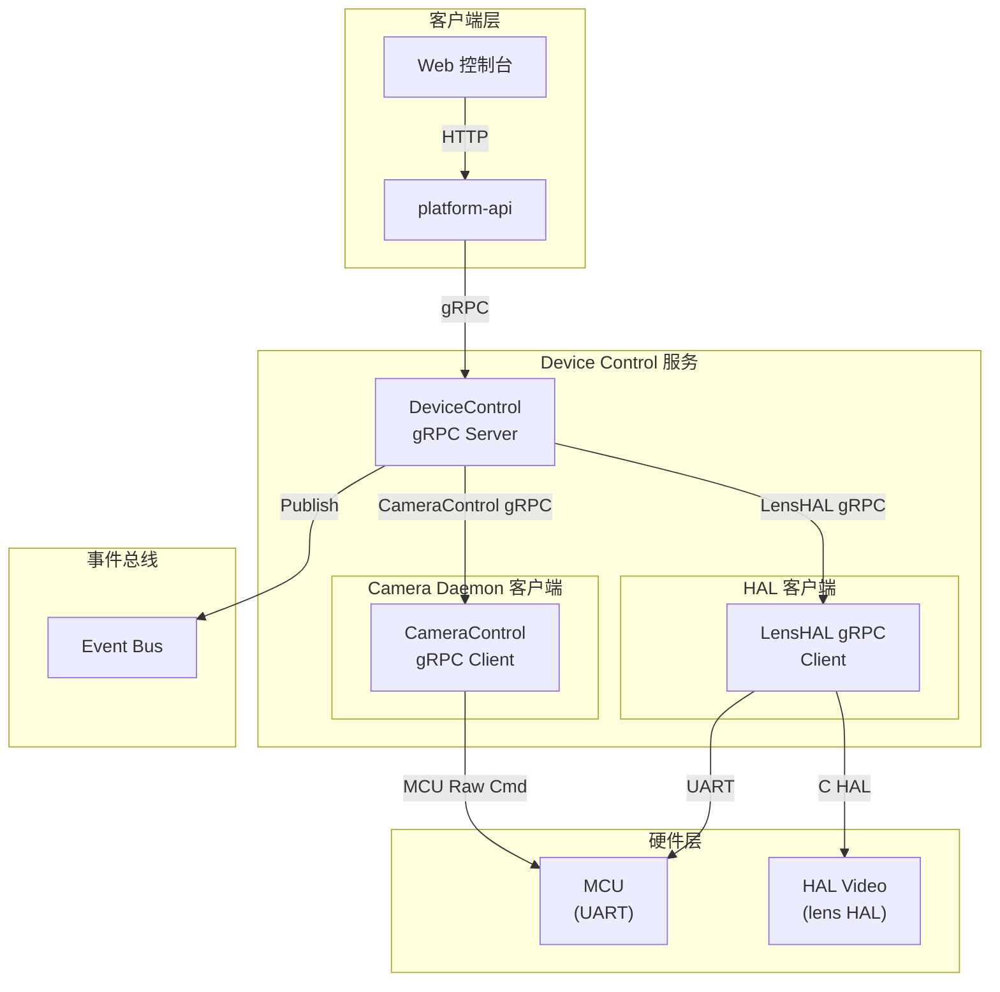
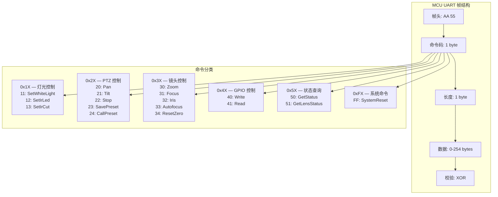
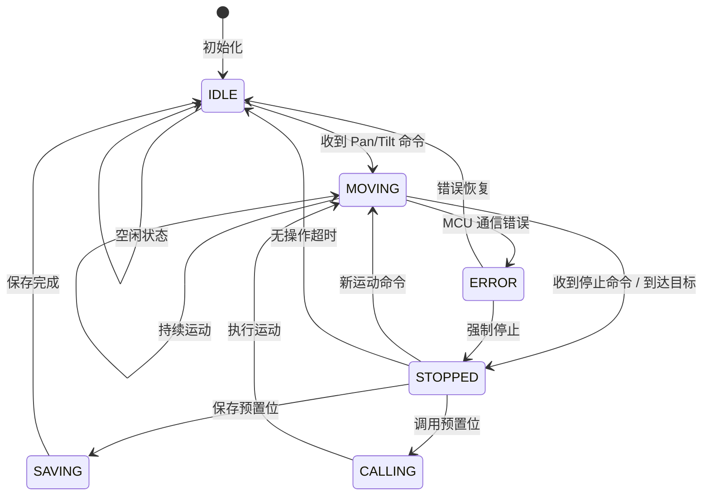
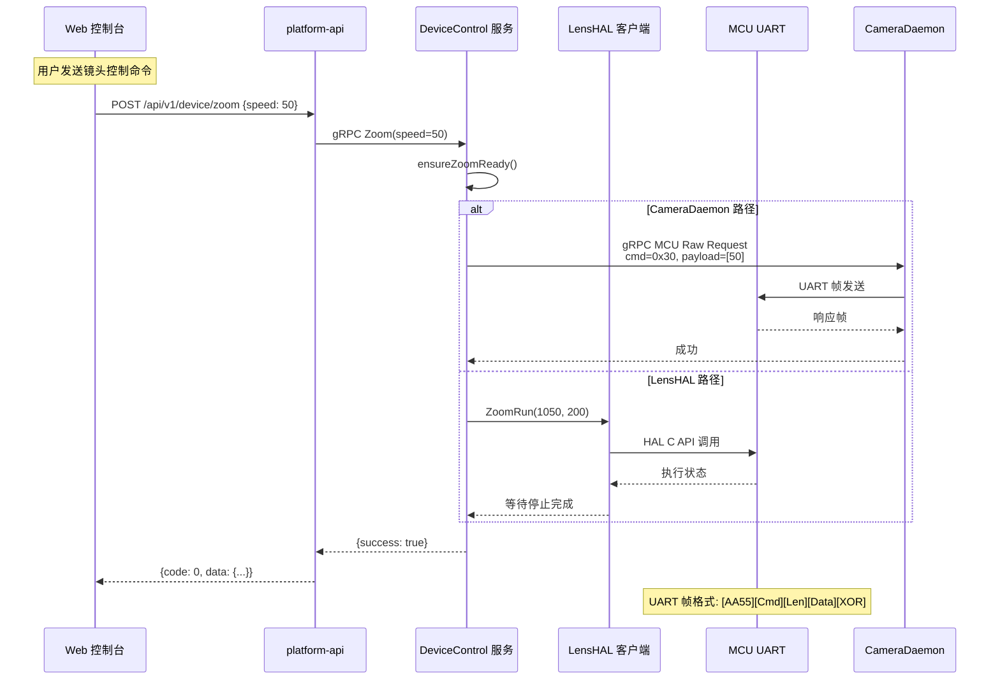
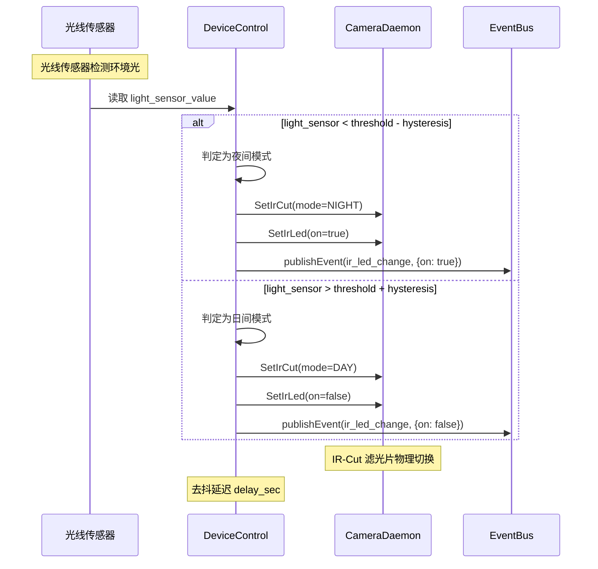

# Device Control Service

Device Control 是 NE503 平台的硬件外设控制服务，通过 MCU（UART）和 HAL 管理灯光、PTZ 云台、镜头、GPIO 等外设，支持 AF0832 镜头的高级控制（自动对焦、AF 窗口、光圈）及实时事件订阅。

技术栈：Go + gRPC + HAL。

## 1. 架构



Device Control 服务监听 `unix:///run/aipc/device-control.sock`，通过两条路径与硬件交互：**CameraDaemon 路径**（MCU Raw Command 经 UART 控制灯光、PTZ、GPIO）和 **LensHAL 路径**（C HAL API 控制镜头 Zoom、Focus、Iris、自动对焦）。

## 2. MCU UART 协议

### 帧格式



| 命令范围 | 类别 | 典型命令 |
|:---|:---|:---|
| `0x1X` | 灯光控制 | SetWhiteLight (0x11)、SetIrLed (0x12)、SetIrCut (0x13) |
| `0x2X` | PTZ 控制 | Pan (0x20)、Tilt (0x21)、Stop (0x22)、SavePreset (0x23)、CallPreset (0x24) |
| `0x3X` | 镜头控制 | Zoom (0x30)、Focus (0x31)、Iris (0x32)、Autofocus (0x33)、ResetZero (0x34) |
| `0x4X` | GPIO 控制 | Write (0x40)、Read (0x41) |
| `0x5X` | 状态查询 | GetStatus (0x50)、GetLensStatus (0x51) |
| `0xFX` | 系统命令 | SystemReset (0xFF) |

---

## 3. gRPC API

服务名：`DeviceControl`，监听 `unix:///run/aipc/device-control.sock`。

### 3.1 灯光控制

| RPC | 请求 | 响应 | 说明 |
|:---|:---|:---|:---|
| `SetWhiteLight` | `LightLevelRequest` | `Status` | 白光亮度（0-100） |
| `SetIrLed` | `LightSwitchRequest` | `Status` | 红外 LED 开关 |
| `SetIrCut` | `IrCutRequest` | `Status` | IR-Cut 滤光片模式 |

```protobuf
message LightLevelRequest { uint32 level = 1; }          // 0-100
message LightSwitchRequest { bool on = 1; }
enum IrCutMode { IRCUT_AUTO = 0; IRCUT_DAY = 1; IRCUT_NIGHT = 2; }
```

### 3.2 PTZ 控制

| RPC | 请求 | 响应 | 说明 |
|:---|:---|:---|:---|
| `Pan` | `PanRequest` | `Status` | 水平旋转 |
| `Tilt` | `TiltRequest` | `Status` | 垂直旋转 |
| `PTZStop` | `PTZStopRequest` | `Status` | 停止运动 |
| `SavePreset` | `PresetRequest` | `Status` | 保存预置位 |
| `CallPreset` | `PresetRequest` | `Status` | 调用预置位 |

```protobuf
enum PanDirection { PAN_STOP = 0; PAN_LEFT = 1; PAN_RIGHT = 2; }
enum TiltDirection { TILT_STOP = 0; TILT_UP = 1; TILT_DOWN = 2; }
message PanRequest { PanDirection direction = 1; uint32 speed = 2; }
message TiltRequest { TiltDirection direction = 1; uint32 speed = 2; }
message PresetRequest { uint32 preset_id = 1; }          // 1-255
```

### 3.3 镜头控制

| RPC | 请求 | 响应 | 说明 |
|:---|:---|:---|:---|
| `Zoom` | `ZoomRequest` | `Status` | 变倍速度控制 |
| `Focus` | `FocusRequest` | `Status` | 对焦速度控制 |
| `SetAutofocus` | `AutofocusRequest` | `Status` | 启用/禁用自动对焦 |
| `SetZoomLevel` | `ZoomLevelRequest` | `Status` | 绝对变倍位置 |
| `SetFocusLevel` | `FocusLevelRequest` | `Status` | 绝对对焦位置 |
| `LensResetZero` | `LensResetRequest` | `Status` | 复位归零 |
| `GetLensStatus` | `Empty` | `LensStatusResponse` | 获取镜头状态 |
| `ControlIris` | `IrisRequest` | `Status` | 光圈速度控制 |
| `SetIrisTarget` | `IrisTargetRequest` | `Status` | 绝对光圈位置 |
| `SetLensLimits` | `LensLimitsRequest` | `Status` | 设置限位 |

```protobuf
message ZoomRequest { int32 speed = 1; }                 // -100 ~ 100
message FocusRequest { int32 speed = 1; }                // -100 ~ 100
message ZoomLevelRequest { float level = 1; }            // 0.0 ~ 1.0
message FocusLevelRequest { float level = 1; }           // 0.0 ~ 1.0
```

### 3.4 AF0832 高级 API

AF0832 镜头提供更精细的控制能力，包括按变倍比与对焦距离定位、AF 窗口配置和 AF 测量值获取。

| RPC | 请求 | 响应 | 说明 |
|:---|:---|:---|:---|
| `LensInit` | `LensInitRequest` | `Status` | 初始化 AF0832 镜头 |
| `LensGotoRatioDistance` | `GotoRatioDistanceRequest` | `Status` | 按变倍比和对焦距离定位 |
| `SetAfWindows` | `SetAfWindowsRequest` | `Status` | 配置 AF 窗口 |
| `GetAfMeasurement` | `Empty` | `AfMeasurementResponse` | 获取 AF 测量值 |

```protobuf
message GotoRatioDistanceRequest {
  float zoom_ratio = 1;        // 1.0 ~ 2.88 光学变倍比
  float focus_distance_m = 2;  // 对焦距离（米）
}

message AfWindow { int32 x = 1; int32 y = 2; int32 w = 3; int32 h = 4; }
message SetAfWindowsRequest {
  bool enabled = 1;
  repeated AfWindow windows = 2;  // 1-3 个窗口
}
```

### 3.5 GPIO

| RPC | 请求 | 响应 | 说明 |
|:---|:---|:---|:---|
| `GPIOWrite` | `GPIOWriteRequest` | `Status` | 写 GPIO |
| `GPIORead` | `GPIOReadRequest` | `GPIOReadResponse` | 读 GPIO |

GPIO 控制流程：接收写请求 → 校验引脚可用性 → 构建 MCU 命令帧 → 通过 CameraDaemon 发送 UART 指令 → 更新 GPIO 状态 → 发布事件到 EventBus。

### 3.6 状态与事件

| RPC | 请求 | 响应 | 说明 |
|:---|:---|:---|:---|
| `GetDeviceStatus` | `Empty` | `DeviceStatus` | 获取完整设备状态 |
| `SubscribeEvents` | `Empty` | `stream DeviceEvent` | 事件流订阅 |

```protobuf
message DeviceStatus {
  float soc_temp_c = 1;
  float mcu_temp_c = 2;
  uint32 light_sensor = 3;
  int32 ptz_pan_pos = 10;
  int32 ptz_tilt_pos = 11;
  uint32 zoom_pos = 20;
  uint32 focus_pos = 21;
  bool autofocus_enabled = 22;
  IrCutMode ircut_mode = 30;
  uint32 white_light_level = 40;
  bool ir_led_on = 41;
  string mcu_version = 50;
}

message DeviceEvent {
  enum EventType {
    GPIO_CHANGE = 0;
    LIGHT_SENSOR_CHANGE = 1;
    TEMPERATURE_ALERT = 2;
    PTZ_MOVE_COMPLETE = 3;
    FOCUS_COMPLETE = 4;
  }
  EventType type = 1;
  uint64 timestamp_ns = 2;
}
```

## 4. PTZ 状态机



## 5. 镜头控制流程



镜头控制通过两条路径实现：CameraDaemon 路径（MCU Raw Command 经 UART 控制）和 LensHAL 路径（C HAL API 控制镜头）。镜头状态包含 NO_CFG → STOPPED → RESET_ZERO → MOTOR_RUNNING 四个阶段，通过 `ensureZoomReady()` 检查就绪，`recoverLensLink()` 在异常时恢复。

## 6. 自动化控制

### 日夜切换



### 自动化功能

| 功能 | 说明 |
|:---|:---|
| 日夜自动切换 | 根据光线传感器自动切换 IR-Cut 和 IR LED，带滞后区间和去抖延迟 |
| 过温保护 | 超过告警温度（默认 75°C）发出警告事件，超过临界温度（默认 85°C）自动降频，温度回落到安全范围后自动恢复 |
| 事件推送 | GPIO 变化、温度告警、PTZ 运动完成、对焦完成等事件推送到 EventBus |

## 7. 配置

配置文件：`configs/platform/device-control.yaml`

| 配置项 | 说明 | 默认值 |
|:---|:---|:---|
| `service.listen` | 监听地址 | `unix:///run/aipc/device-control.sock` |
| `camera_daemon.lens_endpoint` | CameraDaemon 镜头 HAL 地址 | `/run/aipc/camera-control.sock` |
| `mcu.device` / `mcu.baudrate` | 串口设备 / 波特率 | `/dev/ttyS0` / `921600` |
| `mcu.timeout_ms` / `mcu.max_retries` | 超时 / 最大重试 | `1000` / `3` |
| `mcu.heartbeat_interval_sec` | 心跳间隔 | `30` |
| `capabilities.ptz.pan_range` / `tilt_range` | 水平 / 垂直范围 | `[-180,180]` / `[-45,45]` |
| `capabilities.ptz.presets` | 预置位数 | `16` |
| `capabilities.lens.zoom_range` / `focus_range` | 变倍 / 对焦范围 | `[1.0,2.88]` / `[0.1,10.0]` |
| `capabilities.gpio.available_pins` | 可用 GPIO 引脚 | `[12, 13, 21, 22]` |
| `automation.day_night_auto.light_sensor_threshold` | 日夜切换光线阈值 | `300` |
| `automation.day_night_auto.hysteresis` / `delay_sec` | 滞后区间 / 去抖延迟 | `50` / `10` |
| `automation.temperature_protection.warning_temp_c` | 告警温度（°C） | `75` |
| `automation.temperature_protection.critical_temp_c` | 临界温度（°C） | `85` |
| `event_bus.endpoint` | 事件总线地址 | `unix:///run/aipc/event-bus.sock` |

> **注意**：告警阈值可根据实际部署环境调整。

> `preset_id` 的 API 范围为 1-255，但实际可用数量由硬件存储限制决定（默认 16 个）。

## 8. 相关文档

- [平台架构](../../3-platform-development/0-platform-architecture.md) — 四层架构总览及服务间通信
- [RESTful API](../../5-system-integration/1-restful-api.md) — HTTP API 网关转发规则
- [Event Bus](2-event-bus.md) — 事件总线服务参考
- [CLI Guide](../../5-system-integration/3-cli-guide.md) — 命令行设备控制工具
