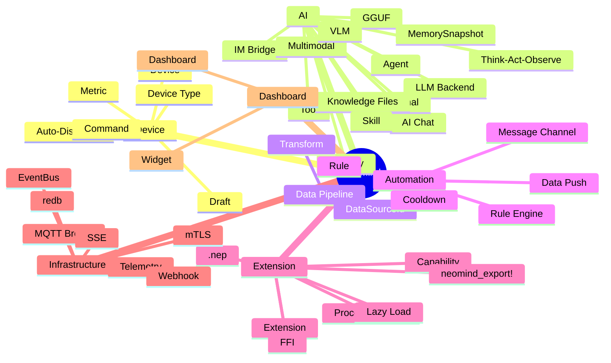
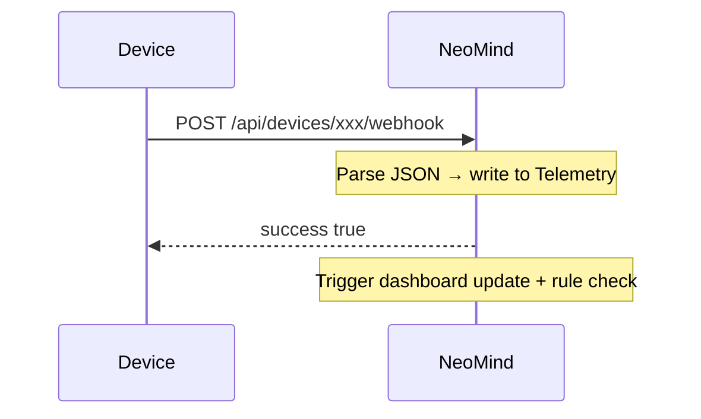

# Glossary

NeoMind introduces many concepts. This page is the central definition for all core terminology. When you encounter a new term for the first time, check here.

> If you want the overall system architecture and data flow (rather than individual terms), jump straight to [Core Concepts](./2-core-concepts.md).

:::tip How to use this glossary

- **First time browsing**: skim the categories below to build a mental model
- **Hit an unfamiliar word**: search the page (`Ctrl/Cmd + F`) directly
- **Want to see how things connect**: jump to the [Concept Relationship Map](#concept-relationship-map) at the end
  :::

---

## Quick Category Overview



---

## Device Related

### Device

A physical or virtual device that has been connected to NeoMind. Each device has a unique ID, a device type, a set of metrics (telemetry points), and commands (control actions).

**Example**: A temperature/humidity sensor whose metrics are `temperature` / `humidity` and whose command is `reboot`.

:::info Three key attributes of a device
1. **Unique ID** — used to reference it in the system (`sensor-01`)
2. **Device Type** — determines which metrics / commands it has
3. **Connection method** — one of MQTT / Webhook / BLE
:::

### Device Type

The "template" for a class of devices, defining which metrics, commands, and connection parameters that kind of device exposes. Device types are defined in JSON and stored in the [NeoMind-DeviceTypes](https://github.com/camthink-ai/NeoMind-DeviceTypes) repository.

When you create a device you pick a type and NeoMind generates the default metric / command schema from it.

**Example** — a temperature & humidity sensor type:

```json
{
  "device_type": "dht22_sensor",
  "name": "Temperature & Humidity Sensor",
  "description": "DHT22-based ambient environment sensor",
  "categories": ["sensor", "environment"],
  "metrics": [
    { "name": "temperature", "display_name": "Temperature", "data_type": "float", "unit": "°C", "min": -40, "max": 80 },
    { "name": "humidity", "display_name": "Humidity", "data_type": "float", "unit": "%", "min": 0, "max": 100 }
  ],
  "commands": [
    { "name": "reboot", "display_name": "Reboot", "description": "Restart the sensor" }
  ]
}
```

:::info Why Device Types matter
Device Type is the **contract** between hardware and the platform. It serves three roles:

1. **Standardizes a device class** — all DHT22 sensors share one type definition, regardless of manufacturer. 100 sensors of the same type all conform to the same metric / command schema.
2. **Gives the AI Agent a device standard** — the Agent reads the metric definitions to understand what data a device produces and what operations it supports. When you ask "what's the temperature?", the Agent knows exactly which metric to query — no need to inspect raw payloads.
3. **Drives downstream configuration** — dashboard widgets, automation rules, and data push configs all reference metrics by name. Those names originate from the Device Type definition.
   :::

### Auto-Discovery

NeoMind's mechanism for identifying unknown devices: when an **unregistered** device publishes data over MQTT (the convention topic) or Webhook, NeoMind parses its type and metrics automatically and places it in the **Pending Devices** list in the Web UI — it never comes online directly.

**Example**: A brand-new sensor publishes `temperature` for the first time; open **Devices → Pending Devices** and its draft card is already there. Approve it and it becomes an official device.

:::tip Relationship to Draft
Auto-discovery is the "process", [Draft](#draft) is the "result" — a discovered unknown device first becomes a draft and waits for admin approval. In test environments you can skip manual approval with `neomind device drafts config --auto-approve true`.
:::

> See [Onboard a Device](../user-guide/3-onboard-device.md).

### Draft

When NeoMind auto-discovers an unknown device via MQTT or Webhook, it does not immediately create a device. Instead it produces a "draft". Only after an admin approves the draft does it become an official device.

:::warning Why not auto-join?
This is a safety mechanism — it prevents unauthorized devices from joining your system automatically. Auto-discovered devices only enter the draft queue; they officially come online only after you confirm them.
:::

**Example**: After a sensor's first report, a draft card appears under Web UI → **Devices → Pending Devices**; run `neomind device drafts approve <DRAFT_ID> --name "Living Room Sensor" --type temp_sensor` to make it official.

> See [Onboard a Device](../user-guide/3-onboard-device.md).

### Metric

A time-series data point produced by a device or extension. Each metric has a name, a data type (Integer / Float / String / Boolean), and an optional unit.

**Examples**:

| Metric name | Data type | Unit | Meaning |
|-------------|-----------|------|---------|
| `temperature` | Float | °C | Temperature |
| `humidity` | Float | % | Humidity |
| `motion` | Boolean | — | Motion detected |
| `image_data` | String | — | Base64-encoded image |

### Command

A control instruction you can send to a device, or an operation you can invoke on an extension. Each command has a name and a parameter schema.

**Examples**: `set_temperature(target: Integer)`, `capture()`, `reboot()`.

### DataSourceId

The unified format NeoMind uses to reference any data point: `{type}:{id}:{field}`

| type | Meaning | Example |
|------|---------|---------|
| `device` | Device telemetry | `device:sensor-01:temperature` |
| `extension` | Extension metric | `extension:weather-forecast:temperature` |
| `agent` | Agent status | `agent:guard:status` |

:::tip This is the format you'll see most often
Dashboard widget data sources, rule trigger conditions, data push targets — all reference data via DataSourceId. Just remember the three-part pattern: `{type}:{id}:{field}`.
:::

---

## AI Related

### LLM Backend

The large language model instance NeoMind connects to. Multiple backends are supported: **Ollama** (local), **OpenAI**, **Anthropic**, **GLM**, **llama.cpp**, etc. You can configure several backends and switch between them per scenario.

<div style={{display: 'flex', gap: '8px', flexWrap: 'wrap', alignItems: 'center', margin: '16px 0'}}>
  <span style={{background: '#e1d5e7', border: '1px solid #9673a6', borderRadius: '20px', padding: '6px 16px', fontSize: '0.9em', fontWeight: 600}}>Agent</span>
  <span style={{fontSize: '1.2em', color: '#999'}}>→</span>
  <span style={{background: '#d5e8d4', border: '1px solid #82b366', borderRadius: '20px', padding: '6px 16px', fontSize: '0.9em'}}>Ollama <em>(local)</em></span>
  <span style={{background: '#d5e8d4', border: '1px solid #82b366', borderRadius: '20px', padding: '6px 16px', fontSize: '0.9em'}}>llama.cpp <em>(local)</em></span>
  <span style={{background: '#dae8fc', border: '1px solid #6c8ebf', borderRadius: '20px', padding: '6px 16px', fontSize: '0.9em'}}>OpenAI</span>
  <span style={{background: '#dae8fc', border: '1px solid #6c8ebf', borderRadius: '20px', padding: '6px 16px', fontSize: '0.9em'}}>Anthropic</span>
  <span style={{background: '#dae8fc', border: '1px solid #6c8ebf', borderRadius: '20px', padding: '6px 16px', fontSize: '0.9em'}}>GLM</span>
</div>

:::info Local vs Cloud
- **Local (Ollama / llama.cpp)**: zero latency, data never leaves the LAN, works offline — but limited by hardware
- **Cloud (OpenAI / Anthropic / GLM)**: more powerful models, but needs network, data goes to cloud, continuous billing
- You can configure several at once and use different backends for different agents
  :::

> See [Configure LLM Backend](../user-guide/2-configure-llm.md).

### GGUF

The single-file model format used by llama.cpp (`.gguf`) — weights, tokenizer, context, and quantization info packed into one file, ready for local inference. NeoMind's built-in model wizard offers an "Import local model" card: drag in a `.gguf` file (streamed upload, no memory footprint) or enter a server path; the platform parses name / context / quantization automatically and stores the file with SHA-256 verification. Imported models participate in switching on equal terms with curated models (context limit 128K).

**Example**: Drag a `model-q4_k_m.gguf` downloaded from Hugging Face into the wizard, and moments later it shows up in the LLM Backend model list — data never leaves the machine.

> See [Configure LLM Backend](../user-guide/2-configure-llm.md).

### Agent

NeoMind's core intelligent unit. An agent receives natural-language input (or runs on a schedule), uses an LLM to understand intent, invokes tools (CLI commands, device controls, extension commands) to take action, and learns from the results.

:::tip Agent ≠ ChatGPT
An agent does more than chat — it **takes action**. When you ask "notify me when temperature exceeds 30", it actually creates a rule, configures a notification channel, and starts monitoring. This is powered by Tool Use.
:::

> See [AI Chat](../user-guide/5-ai-chat.md) and [AI Agent](../user-guide/6-ai-agent.md).

### AI Chat

The **interactive mode** of the agent — the user types a message in the chat, and the AI calls tools in real time and streams the response. Supports image uploads for multimodal analysis. Uses conversation history + MemorySnapshot for context.

**Example**: Type "count the people in this workshop photo" in the chat — the agent calls a vision tool on the spot and streams back the answer.

> See [AI Chat](../user-guide/5-ai-chat.md). To talk to the same agent from Telegram / Feishu, see [IM Bridge](#im-bridge).

### IM Bridge

Chat with the same agent **two-way** from **Telegram / Feishu** (0.9.14+) — send messages, upload images, and receive streaming replies just like the web AI Chat, instead of only receiving alerts.

:::info IM Bridge ≠ notification channels
Telegram / Feishu in [Message Channels](#message-channel) are **one-way alert pushes**; IM Bridge is a **two-way conversation**. The two are independent and can be used together.
:::

**Example**: While on a business trip, send "check the warehouse temperature and humidity" to your agent in Telegram — it queries via tools and replies right in the chat.

> See [AI Chat](../user-guide/5-ai-chat.md).

### Memory

Experience accumulated across executions/sessions, split into two systems by mode:

| Mode | Memory Structure | Storage | Purpose |
|------|-----------------|---------|---------|
| **AI Chat** | Conversation history + MemorySnapshot | `user.md` + `knowledge.md` | Remembers user preferences and key facts across sessions |
| **AI Agent** | Journal + Knowledge Files | redb + Markdown files | Accumulates experience across executions: success/failure, learned patterns, device identity, mission |

**Journal** is a summary of each agent execution (what was done, success/failure, lessons learned). **Knowledge Files** are long-term knowledge (device identity, mission, resources, patrol patterns).

### MemorySnapshot / Journal / Knowledge Files

The concrete storage behind the two memory systems of [Memory](#memory):

| Structure | Mode | What it is |
|-----------|------|------------|
| **MemorySnapshot** | AI Chat | Conversation memory snapshot, persisted to `user.md` (user preferences) and `knowledge.md` (key facts), restored when a new session starts |
| **Journal** | AI Agent | Execution log: one entry appended per execution (trigger, data summary, LLM conclusion, action, success/failure); the next execution reads the recent N entries to learn from history |
| **Knowledge Files** | AI Agent | Long-term knowledge files (Markdown): `identity.md` (identity & duties), `mission.md` (goals & constraints), `resources.md` (bound resources), `schedule.md` (execution plan) — auto-initialized on first execution, editable in the Agent detail → Memory panel |

**Example**: After an agent sends the same alert to one device twice, the Journal holds the failed records — on the next execution it skips already-sent alerts and adjusts the threshold. That is the "read Journal → change behavior" loop.

> See [AI Agent](../user-guide/6-ai-agent.md).

### Think-Act-Observe

The agent's core execution pattern: the LLM analyzes the current state (**Think**) → calls a tool (**Act**) → reads the result (**Observe**) → loops until the task is done or the round limit is reached (default 30 rounds, global timeout 5 minutes).

### Skill

Knowledge files that provide scenario-specific guidance to agents (YAML metadata + Markdown body, stored in `data/skills/`). A Skill defines operational steps, common errors, and best practices for a specific scenario. Agents automatically match relevant Skills by description (built-in skills are read-only; user skills can be added, modified, and removed).

**Example**: When an agent takes on a camera-patrol task, it auto-matches the camera-patrol Skill by description and follows the documented steps to call commands, avoiding common errors already recorded there. You can also pin a specific skill in the agent editor.

> See [AI Agent](../user-guide/6-ai-agent.md).

### Multimodal

An LLM's ability to process image input. Depends on the model — after pulling a vision model (e.g. `qwen3.5:4b-vl` / `llava`) in Ollama or using a cloud vision model (`gpt-4o` / `claude-sonnet-4-6` / `gemini-2.0-flash`), AI Chat supports image uploads for visual analysis.

### VLM (Vision-Language Model)

A multimodal model that understands both images/video and text, producing natural-language descriptions of a scene instead of only structured coordinates. Two places in NeoMind use one: the dashboard's **VLM Vision widget** (image + AI annotations), and the `video-vlm` (real-time video stream semantic understanding, on-board LFM2.5-VL) and `vision-hub` (unified vision pipeline: detection / OCR / face / localization / VLM) extensions.

**Example**: Point the `video-vlm` extension at an RTSP camera and the VLM emits semantic events like "a worker is entering a hazardous area", which can directly trigger rules and notifications.

> See [Use Dashboard](../user-guide/4-use-dashboard.md) and [Extension Management](../user-guide/9-extensions.md).

### Tool

An action an agent can call. NeoMind's agent operates primarily through `neomind` CLI commands to manage devices, rules, dashboards, and so on. The tool system automatically exposes commands from installed extensions to the LLM as well.

```
Agent
  └── neomind CLI
        ├── device management
        ├── rule management
        ├── dashboard management
        └── extension calls
              ├── YOLO detection
              ├── OCR recognition
              └── weather forecast
```

---

## Data Processing Related

### Transform

A JavaScript pipeline that automatically executes after data is written to Telemetry, converting raw metrics into more meaningful derived metrics. Supports three scope levels: **Global** (all devices), **Device Type** (a class of devices), **Device** (a single device).

**Example**: Raw data `{temperature: 25.6, humidity: 60}` → Transform calculates `dew_point: 16.7°C` (dew point) and `comfort: "humid"` (comfort level).

Derived metrics are written to Telemetry in `transform:{output_prefix}:{field}` format, consumed by dashboards, rules, and agents just like raw data.

> See [Core Concepts — Transform](./2-core-concepts.md#transform) and [Automation Rules](../user-guide/7-automation-rules.md).

---

## Automation Related

### Rule

Event-driven automation logic. When a condition is met, the action executes automatically.

NeoMind rules are defined in **JSON**:

```json
{
  "name": "High Temp Alert",
  "trigger": { "trigger_type": "data_change" },
  "condition": { "condition_type": "comparison", "source": "device:sensor-01:temperature", "operator": "greater_than", "threshold": 30 },
  "actions": [ { "type": "notify", "message": "Too hot" } ],
  "cooldown": 60
}
```

A rule has three parts: a **trigger** (when to evaluate), a **condition** (when it's met), and **actions** (what to do when met).

> See [Automation Rules](../user-guide/7-automation-rules.md).

### Cooldown

A suppression window (in seconds) after a rule triggers. During cooldown, the rule will not fire again even if the condition is still met — preventing alert storms. For example, `cooldown: 60` means no repeat trigger for 60 seconds after firing.

### Rule Engine

NeoMind's built-in automation evaluation engine. Evaluates bound rule conditions **immediately** when data is written to Telemetry (zero latency, no polling). On match, it executes actions (notify, execute command, trigger agent).

### Message Channel

The delivery channel used when a rule triggers a notification. There are 9 channels in total — **2 built-in + 7 external**. The two built-ins are **Console** (prints to the server log, for debugging) and **Memory** (writes into the AI agent's long-term memory so agents learn from alerts); they need no configuration and cannot be disabled. The 7 external channels are created by you. All messages also accumulate in the in-app message center (the Messages page).

<div style={{display: 'flex', gap: '8px', flexWrap: 'wrap', alignItems: 'center', margin: '16px 0'}}>
  <span style={{background: '#ffe6cc', border: '1px solid #d79b00', borderRadius: '20px', padding: '6px 16px', fontSize: '0.9em', fontWeight: 600}}>Rule triggers</span>
  <span style={{fontSize: '1.2em', color: '#999'}}>→</span>
  <span style={{background: '#dae8fc', border: '1px solid #6c8ebf', borderRadius: '20px', padding: '6px 16px', fontSize: '0.9em'}}>Webhook</span>
  <span style={{background: '#dae8fc', border: '1px solid #6c8ebf', borderRadius: '20px', padding: '6px 16px', fontSize: '0.9em'}}>Email</span>
  <span style={{background: '#dae8fc', border: '1px solid #6c8ebf', borderRadius: '20px', padding: '6px 16px', fontSize: '0.9em'}}>Telegram</span>
  <span style={{background: '#dae8fc', border: '1px solid #6c8ebf', borderRadius: '20px', padding: '6px 16px', fontSize: '0.9em'}}>WeCom</span>
  <span style={{background: '#dae8fc', border: '1px solid #6c8ebf', borderRadius: '20px', padding: '6px 16px', fontSize: '0.9em'}}>DingTalk</span>
  <span style={{background: '#dae8fc', border: '1px solid #6c8ebf', borderRadius: '20px', padding: '6px 16px', fontSize: '0.9em'}}>Slack</span>
  <span style={{background: '#dae8fc', border: '1px solid #6c8ebf', borderRadius: '20px', padding: '6px 16px', fontSize: '0.9em'}}>Feishu</span>
  <span style={{background: '#e1d5e7', border: '1px solid #9673a6', borderRadius: '20px', padding: '6px 16px', fontSize: '0.9em', fontWeight: 600}}>Console (built-in)</span>
  <span style={{background: '#e1d5e7', border: '1px solid #9673a6', borderRadius: '20px', padding: '6px 16px', fontSize: '0.9em', fontWeight: 600}}>Memory (built-in)</span>
</div>

> See [Notifications](../user-guide/8-notifications.md).

### Data Push

Actively pushing telemetry data to an external system (Webhook or MQTT), as opposed to passive querying. You can configure push frequency, data format, and target address.

:::tip Data Push vs Rule
- **Data Push** — pushes raw data unconditionally ("push temperature to an external system every 10 seconds")
- **Rule** — triggers an action on a condition ("send a notification when temperature exceeds 30")
  :::

**Example**: Push `device:sensor-01:temperature` to your ops platform's HTTP endpoint every 10 seconds, for an external ticketing system to consume.

> See [Data Push](../user-guide/7c-data-push.md).

---

## Extension Related

### Extension

A plugin module loaded into NeoMind via FFI (foreign function interface). Extensions are written in Rust, compiled to a dynamic library (`.dylib` / `.so` / `.dll`), and run in a **separate process**.

Extensions can:
- Provide metrics (data streams)
- Provide commands (callable operations)
- Load ML models (e.g. YOLO object detection)
- Process streaming data (e.g. video frames)

<div style={{display: 'flex', gap: '16px', alignItems: 'center', flexWrap: 'wrap', margin: '16px 0'}}>
  <div style={{background: '#d5e8d4', border: '2px solid #82b366', borderRadius: '8px', padding: '12px 20px', fontWeight: 'bold', color: '#1f4d1f'}}>
    ExtensionRunner<br/><span style={{fontSize: '0.8em', fontWeight: 'normal'}}>(main process)</span>
  </div>
  <div style={{display: 'flex', flexDirection: 'column', gap: '8px'}}>
    <div style={{background: '#f5f5f5', border: '1px dashed #666', borderRadius: '6px', padding: '8px 16px', fontSize: '0.9em'}}>
      YOLO detection <span style={{fontSize: '0.8em', color: '#888'}}>(isolated process · FFI)</span>
    </div>
    <div style={{background: '#f5f5f5', border: '1px dashed #666', borderRadius: '6px', padding: '8px 16px', fontSize: '0.9em'}}>
      OCR recognition <span style={{fontSize: '0.8em', color: '#888'}}>(isolated process · FFI)</span>
    </div>
  </div>
</div>

:::warning Why process isolation matters
Extensions run in separate processes — if the YOLO extension crashes because a model fails to load, **the main service is completely unaffected**. Other extensions are not impacted either. This is a key design for NeoMind's stability.
:::

> See the [Extension SDK](../developer-guide/3-extension-sdk.md).

### Capability

A permission an extension must declare at startup. Any capability not declared is denied. This enforces the **principle of least privilege**. 20 built-in capabilities (including the chat streaming family) cover device read/write, device control, storage queries, event subscriptions, triggers, etc. — full list in the [Extension SDK](../developer-guide/3-extension-sdk.md):

| Category | Capability | Description |
|----------|-----------|-------------|
| Device Data | `device_metrics_read` / `device_metrics_write` | Read/write device metrics (incl. virtual) |
| Device Control | `device_control` | Send commands to devices |
| Storage | `storage_query` / `telemetry_history` / `metrics_aggregate` | Query telemetry history and aggregation |
| Events | `event_publish` / `event_subscribe` | Publish/subscribe system events |
| Triggers | `extension_call` / `agent_trigger` / `rule_trigger` | Call extensions, trigger agents/rules |
| Device Mgmt | `device_register` / `device_unregister` / `device_template_register` | Dynamic device registration |

Also supports `Custom(String)` for custom capabilities.

:::info Security model
A weather extension only needs the `device_metrics_write` capability. If it tries to control a device, NeoMind denies it outright. This way, even if an extension has a bug and gets exploited, the blast radius is limited to its declared permissions.
:::

### FFI (Foreign Function Interface)

The cross-process communication mechanism between extension processes and the main process. All requests and responses use serde JSON serialization — no custom binary protocol, logs are readable, debugging is straightforward. This is the key reason NeoMind chose **process isolation over WASM**: FFI can directly call GPU/ML frameworks, while WASM cannot.

### .nep

The distribution package format for NeoMind extensions. A `.nep` file is a zip archive containing multi-platform binaries + `metadata.json` + optional model files.

When a user clicks install in the Web UI, the runner automatically selects the binary matching the current platform — **no need to worry about whether the target is macOS or Linux, ARM or x86**.

### neomind_export!

A macro provided by the SDK that exports a Rust `impl Extension` as FFI entry points automatically. Extension developers only need to add one line at the end of their code:

```rust
neomind_extension_sdk::neomind_export!(MyExtension);
```

### Process Isolation

Extensions run in a separate process rather than inside the main process. Benefits: an extension crash (panic) cannot bring down the main service; extensions cannot interfere with each other; the capability-based permission boundary is clearer.

### Lazy Load

ML models are not loaded at extension startup. Instead they are loaded into memory on the first command call. Once loaded they stay resident (until the extension process exits), avoiding repeated reloads per inference.

:::tip Why not load at startup?
A YOLOv8n model is about 12 MB and takes 1–2 seconds to load. If the extension loaded it at startup but the user might not use it for hours, that memory is wasted. Lazy loading = **occupy on demand, stay resident once loaded**.
:::

---

## Infrastructure Related

### EventBus

NeoMind's publish/subscribe (pub/sub) backbone, implemented as `neomind-core::event_bus`. Devices, the rule engine, data transforms, dashboards, and notifications never call each other directly — all cross-module communication goes through events; multiple subscribers fire in parallel, and processing within one subscriber is serialized.

| Event source | Event | Subscribers |
|--------------|-------|-------------|
| Device MQTT data | `DeviceDataReceived` | Rule engine, data push, dashboard WS |
| Rule triggered | `RuleTriggered` | Notifications, Agent |
| Agent finished | `AgentExecutionCompleted` | Memory system, notifications |
| Extension metric | `ExtensionMetric` | Storage, dashboard |

**Example**: A single MQTT report lights up the dashboard curve, hits the high-temperature rule, and drives data push at the same time — three kinds of subscribers unaware of each other, all fanned out by the event bus.

> See the "EventBus" section in [Product Architecture](../developer-guide/2-architecture.md).

### MQTT Broker

The message broker built into NeoMind (port `1883`). Devices connect, report telemetry, and receive commands over MQTT.

:::info Zero dependencies
No external broker (such as Mosquitto) needs to be installed — NeoMind ships with a full MQTT implementation. It's ready the moment you start; devices connect directly to `localhost:1883`.
:::

### mTLS (mutual TLS)

A transport-layer security option for MQTT: device and server verify each other's X.509 certificates (CA certificate + client certificate), encrypting traffic against eavesdropping and blocking spoofed devices. NeoMind's built-in broker supports mTLS and CA certificates (TLS connections typically use port `8883`).

**Example**: Production-line devices are flashed with a client certificate before they can connect to the broker — a spoofed device without one is rejected during the TLS handshake and never even reaches the Pending approval step.

> See [Onboard a Device](../user-guide/3-onboard-device.md).

### Telemetry

NeoMind's time-series database, built on redb and stored in `data/telemetry.redb`. All metric values are written here, and the dashboard and rule engine read from it.

**Example**: A sensor reports `temperature` every 10 seconds; once the data lands in telemetry.redb, dashboard curves, rule conditions, and agent queries all read the same copy.

> See [Onboard a Device](../user-guide/3-onboard-device.md).

### redb

The embedded key-value storage engine NeoMind uses (written in Rust). There is no external database dependency; data files land directly on disk in the `data/` directory.

:::info Why not SQLite / PostgreSQL?
redb is a pure Rust implementation that integrates perfectly with NeoMind's Rust stack — **zero external dependencies, zero cross-language overhead, compiled into the same binary**. It is specifically optimized for time-series data (write-heavy, time-range queries).
:::

### Webhook

An HTTP callback mechanism. Devices can report data by sending POST requests to NeoMind's webhook URL without needing MQTT. It is also used to receive event pushes from external systems.



**Example**: A small microcontroller without an MQTT client can report with a single `POST` of JSON to the device webhook URL.

> See the [REST API Reference](../developer-guide/4-rest-api.md).

### SSE (Server-Sent Events)

An HTTP long-connection unidirectional push protocol. NeoMind uses SSE to push real-time device data updates to the Web UI — data is pushed to open dashboards immediately after being written to Telemetry, without frontend polling. AI Chat streaming responses also use SSE.

**Example**: While a dashboard page is open, new telemetry refreshes the curve within milliseconds; AI Chat answers appear word by word — both paths run on SSE.

> See the [REST API Reference](../developer-guide/4-rest-api.md).

---

## Dashboard Related

### Dashboard

A visualization page composed of a set of widgets. You can create multiple dashboards, share them (via public links with expiry times), and they auto-adapt to mobile screens.

### Widget

A single visualization element on a dashboard. Built-in types:

| Type | Shows | Typical use case |
|------|-------|------------------|
| **Value Card** | A single value | Current temperature, humidity |
| **Line Chart** | Time-series trend | 24-hour temperature change |
| **Gauge** | Dial-style reading | CPU usage |
| **Data Table** | Multi-column table | Device list, history |
| **VLM Vision** | Image + AI annotations | Object detection results |
| **Stream Player** | Live video feed | Camera feed |

The above are the common built-in types. For the complete list of widget types, see the [Dashboard guide](../user-guide/4-use-dashboard.md). Custom components provided by extensions and the community component marketplace are also supported.

> See [Use Dashboard](../user-guide/4-use-dashboard.md).

---

## Concept Relationship Map

How do these concepts work together? The diagram below shows the full data flow from device to visualization (after data is written, raw metrics can first be processed by Transform into derived metrics before downstream consumption):

<div style={{overflowX: 'auto', margin: '16px 0'}}>
  <table style={{borderCollapse: 'separate', borderSpacing: '4px', width: '100%', fontSize: '0.9em'}}>
    <thead>
      <tr>
        <th style={{background: '#f8cecc', color: '#6b1a1a', padding: '10px 12px', textAlign: 'center', borderRadius: '8px', border: '1px solid #b85450'}}>Data Sources</th>
        <th style={{background: '#ffe6cc', color: '#6b3d00', padding: '10px 12px', textAlign: 'center', borderRadius: '8px', border: '1px solid #d79b00'}}>Ingestion</th>
        <th style={{background: '#d5e8d4', color: '#1f4d1f', padding: '10px 12px', textAlign: 'center', borderRadius: '8px', border: '2.5px solid #82b366', fontSize: '1.05em'}}>Telemetry Store</th>
        <th style={{background: '#fff2cc', color: '#5c4400', padding: '10px 12px', textAlign: 'center', borderRadius: '8px', border: '1px solid #d6b656'}}>Processing</th>
        <th style={{background: '#dae8fc', color: '#1a3d6b', padding: '10px 12px', textAlign: 'center', borderRadius: '8px', border: '1px solid #6c8ebf'}}>Consumers</th>
        <th style={{background: '#dae8fc', color: '#1a3d6b', padding: '10px 12px', textAlign: 'center', borderRadius: '8px', border: '1px solid #6c8ebf'}}>Outputs</th>
      </tr>
    </thead>
    <tbody>
      <tr>
        <td style={{textAlign: 'center', padding: '10px 8px'}}>
          <strong>Device</strong><br/><span style={{fontSize: '0.85em', color: '#666'}}>Camera · Sensor · Controller</span><br/><hr style={{border: 'none', borderTop: '1px solid #ddd', margin: '8px 0'}}/>
          <strong>Extension</strong><br/><span style={{fontSize: '0.85em', color: '#666'}}>YOLO · OCR · Bridge</span>
        </td>
        <td style={{textAlign: 'center', padding: '10px 8px'}}>
          MQTT <code>:1883</code><br/><br/>Webhook<br/><br/>BLE
        </td>
        <td style={{textAlign: 'center', padding: '10px 8px', fontWeight: 'bold'}}>
          <strong>redb</strong><br/><code style={{fontSize: '0.85em'}}>data/telemetry.redb</code><br/><br/><span style={{fontSize: '0.8em', fontWeight: 'normal', color: '#666'}}>Written once<br/>consumed by many</span>
        </td>
        <td style={{textAlign: 'center', padding: '10px 8px'}}>
          <strong>Transform</strong><br/><span style={{fontSize: '0.85em', color: '#666'}}>JavaScript pipeline<br/>raw → derived metrics<br/><code>transform:*</code></span>
        </td>
        <td style={{textAlign: 'center', padding: '10px 8px'}}>
          <strong>Dashboard</strong> / Widget<br/><br/>Rule Engine<br/><br/>Agent (LLM)
        </td>
        <td style={{textAlign: 'center', padding: '10px 8px'}}>
          Real-time UI<br/><span style={{fontSize: '0.85em', color: '#666'}}>(WebSocket push)</span><br/><br/>Notifications<br/><span style={{fontSize: '0.85em', color: '#666'}}>(9 channels)</span><br/><br/>AI Responses<br/><span style={{fontSize: '0.85em', color: '#666'}}>(natural language)</span>
        </td>
      </tr>
    </tbody>
  </table>
</div>

<div style={{display: 'flex', justifyContent: 'center', gap: '4px', alignItems: 'center', fontSize: '1.5em', color: '#999', margin: '4px 0 16px'}}>
  <span>→</span><span>→</span><span>→</span><span>→</span><span>→</span><span>→</span>
</div>

---

*Last updated: 2026-09-09*
