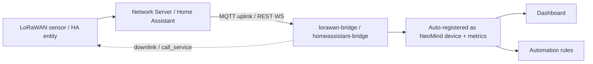

## 1. Solution Overview

| Bridge | Source | Mode | Typical devices |
|---|---|---|---|
| **lorawan-bridge** | LoRaWAN Network Server (ChirpStack v3/v4, TTN) | MQTT uplink + API downlink | Temp/humidity, soil, water-level, GPS wireless sensors |
| **homeassistant-bridge** | Home Assistant | REST polling or WebSocket realtime | Lights, switches, sensors, climate — 3000+ HA entities |

**Data Flow**:



---

## 2. Bill of Materials (BOM)

| Item | Spec | Purpose | Required |
|------|------|------|------|
| **NeoMind platform** | v0.9.0+ | Extension host | ✅ |
| **lorawan-bridge / homeassistant-bridge** | — | Pick per scenario | ✅ |
| **LoRaWAN Network Server** | ChirpStack v3/v4 or TTN (for LoRaWAN) | Device access platform | LoRaWAN |
| **Home Assistant instance** | Network-accessible + long-lived token (for HA) | Entity source | HA |
| **Sensors / smart devices** | LoRaWAN nodes / HA-integrated devices | Data source | ✅ |

---

## 3. Install the Extensions

Both bridges are installed from the extension Marketplace (market version 2.7.x):

1. Open the **Extensions** page in NeoMind → **Marketplace** tab, search for `lorawan-bridge`, and click **Install**;
2. Search for and install `homeassistant-bridge` the same way;
3. After installation, open the extension detail page and confirm the status is **Running**.

CLI equivalent:

```bash
neomind extension market-install lorawan-bridge
neomind extension market-install homeassistant-bridge
neomind extension status lorawan-bridge    # confirm health after install
```

> All commands used below (`connect` / `set_decoder` / `call_service`, etc.) are issued from the **Commands tab on the extension detail page**, or via the HTTP API: `POST /api/extensions/:id/command` with body `{"command": "...", "args": { ... }}`.

---

## 4. LoRaWAN (lorawan-bridge)

Supports ChirpStack v3, ChirpStack v4, and TTN; built-in Cayenne LPP decoder (with GPS coordinates) plus a custom binary decoder; auto-discovers devices from MQTT uplinks; supports downlink queues (FPort 1–223) and RSSI/SNR signal-quality monitoring; MQTT auto-reconnect with subscription recovery.

### 4.1 Prerequisites (Network Server side)

Before connecting the extension, make sure the network server side is ready:

| Item | Requirement | How to verify |
|------|------|----------|
| MQTT broker | ChirpStack MQTT integration enabled; broker reachable from the NeoMind host (plain 1883 / TLS 8883) | `nc -vz <broker-ip> 1883` from the NeoMind host |
| Application | Created, with the **application ID** noted (numeric ID in ChirpStack, application name in TTN) | Applications page in the ChirpStack console |
| LoRa node | Device joined (OTAA/ABP) under the application and reporting normally | Recent uplink events on the ChirpStack device page |
| Downlink API | If you need downlinks, prepare the NS API URL and credentials (see 3.5) | — |

> TTN users: the broker address looks like `mqtts://eu1.cloud.thethings.network:8883`, and the MQTT username follows the `{app_id}@{tenant_id}` pattern.

### 4.2 Connect to a Network Server (connect)

Run `connect` on the lorawan-bridge extension detail page:

```json
{
  "ns_type": "chirpstack_v4",
  "broker_url": "mqtt://192.168.1.10:1883",
  "username": "...",
  "password": "...",
  "application_id": "1",
  "default_decoder": "cayenne"
}
```

**connect parameters**:

| Parameter | Type | Required | Description |
|------|------|------|------|
| `ns_type` | string | ✅ | Network server type: `chirpstack` (v3) / `chirpstack_v4` / `ttn` |
| `broker_url` | string | ✅ | MQTT broker URL; `mqtt://` / `tcp://` plain (default 1883), `ssl://` / `mqtts://` for TLS (default 8883) |
| `username` | string | — | MQTT username |
| `password` | string | — | MQTT password; **doubles as the API credential for downlinks** (stores the API Key for ChirpStack v4 / TTN, see 3.5) |
| `application_id` | string | ✅ | ChirpStack application ID or TTN application ID |
| `tenant_id` | string | — | TTN tenant ID, defaults to `ttn` |
| `ns_api_url` | string | Required for downlink | Network server API URL (e.g. `https://chirpstack.example.com`), only needed to send downlinks |
| `default_decoder` | string | — | Default decoder for newly discovered devices: `cayenne` (default) or `custom` |

After connecting, the extension subscribes to the uplink topic for the selected network server:

| Network Server | Uplink topic | Notes |
|---|---|---|
| ChirpStack v3 / v4 | `application/{id}/device/+/event/up` | v3 top-level `devEui`; v4 nested `deviceInfo.devEui` |
| TTN | `v3/{app_id}@{tenant_id}/devices/{dev_id}/up` | QoS 0 only (TTN MQTT limitation); prefers `uplink_message.decoded_payload` |

The extension subscribes at QoS 0; every uplink message registers / updates the device. Messages on FPort 0 are MAC commands and are ignored.

> 📷 TODO screenshot | connect config · suggested path `…/neomind/lorawan-ha/01-lorawan-connect.png`

### 4.3 Verify

Check these three points in order:

1. **Devices appear on the Devices page**: device IDs look like `lorawan-{dev_eui}` (e.g. `lorawan-0102030405060708`), named `LoRa Device {dev_eui}`; or inspect via `list_devices` / `get_device(dev_eui)`;
2. **Metric names look right**: decoded fields become metrics directly (Cayenne yields `temperature` / `humidity` / `barometric_pressure` / `illuminance` / `latitude` / `longitude` / `altitude`, etc., with units); TTN pre-decoded payload keys are normalized (keys containing `temp` → `temperature`, containing `hum` → `humidity`, etc.);
3. **Signal-quality metrics are updating**: each device carries `rssi` (dBm, closer to 0 is better), `snr` (dB), `f_cnt` (frame counter, increasing), and `last_seen`; battery-powered devices also report `battery`.

You can also use `get_status` to check the MQTT connection state and device count; the `messages_received` / `decode_errors` metrics indicate uplink and decoding health.

> 📷 TODO screenshot | device and metrics · suggested path `…/neomind/lorawan-ha/03-lorawan-device.png`

### 4.4 Decoding

**Cayenne LPP** (default): standard decoder, supported sensor types:

| Cayenne type | Metric | Unit | Conversion |
|---|---|---|---|
| Temperature (0x67) | `temperature` | °C | ×0.1 |
| Humidity (0x68) | `humidity` | % | ×0.5 |
| Barometer (0x73) | `barometric_pressure` | hPa | ×0.1 |
| Illuminance (0x65) | `illuminance` | lux | raw |
| Analog input (0x02) | `analog_in` | V | ×0.01 |
| Digital input / output (0x00 / 0x01) | `digital_input` / `digital_output` | — | raw |
| GPS (0x06) | `latitude` / `longitude` / `altitude` | ° / ° / m | ×0.0001 / ×0.0001 / ×0.01 |

Unknown type codes are skipped (jumping over the standard-length data bytes) without breaking the remaining fields.

**custom**: for vendor-proprietary binary protocols, define per-device field mappings with `set_decoder`:

| Parameter | Type | Required | Description |
|------|------|------|------|
| `dev_eui` | string | ✅ | Target device EUI |
| `decoder_type` | string | ✅ | `cayenne` or `custom` |
| `fields` | array | For custom | Array of field definitions, see below |

Structure of each `fields` element (example — a "temperature + soil moisture" sensor where the first two bytes are temperature and the next two are humidity):

```json
{
  "dev_eui": "0102030405060708",
  "decoder_type": "custom",
  "fields": [
    { "name": "temperature", "offset": 0, "length": 2, "type": "int16", "scale": 0.1, "unit": "°C" },
    { "name": "soil_moisture", "offset": 2, "length": 2, "type": "uint16", "scale": 0.1, "unit": "%" }
  ]
}
```

| Field key | Description |
|---|---|
| `offset` / `length` | Byte offset and length of the field in the payload |
| `name` | Metric name (as shown on the device page) |
| `type` | Data type: `uint8` / `uint16` / `int16` / `uint32` / `int32` |
| `scale` | Scale factor (raw value × scale = actual value) |
| `unit` | Unit, display only |

Applies per device: a device with a `custom` decoder keeps its custom mapping even when `default_decoder` is `cayenne`.

### 4.5 Downlinks (send_downlink)

`send_downlink` pushes a hex payload into a device's downlink queue via the network server API:

```json
{ "dev_eui": "0102030405060708", "f_port": 10, "payload_hex": "01FF", "confirmed": false }
```

| Parameter | Type | Required | Description |
|------|------|------|------|
| `dev_eui` | string | ✅ | Target device EUI (TTN addresses by `device_id`) |
| `f_port` | integer | ✅ | Port **1–223** (0 is reserved, 224+ are protocol-reserved ranges) |
| `payload_hex` | string | ✅ | Hex payload (converted to base64 automatically) |
| `confirmed` | boolean | — | Request confirmed downlink, default `false` |

Downlink implementation is adapted automatically per network server; `ns_api_url` must be set in `connect`, with credentials ready:

| Network Server | Downlink API | Auth |
|---|---|---|
| ChirpStack v3 | `POST {ns_api_url}/api/devices/{dev_eui}/queue` (`deviceQueueItem`) | Basic (connect `username` / `password`) |
| ChirpStack v4 | Same path, body is `queueItem` (snake_case fields) | `Grpc-Metadata-Authorization: Bearer {API Key}` (the API Key is the connect `password`) |
| TTN | `POST {ns_api_url}/api/v3/as/applications/{app_id}/devices/{device_id}/down/push` | `Authorization: Bearer {API Key}` (the connect `password`) |

Sending without `ns_api_url` fails immediately with `NS API URL not configured`.

---

## 5. Home Assistant (homeassistant-bridge)

Connect to HA via REST (polling) or WebSocket (real-time events); auto-discovers entities and registers them as NeoMind devices, with entity-type filtering and service-call control.

### 5.1 Prerequisite: create a long-lived access token

In HA, open **Profile → Security → Long-Lived Access Tokens**, create a token and copy it (shown only once). Make sure the NeoMind host can reach the HA HTTP port (default 8123).

### 5.2 Connect

```json
{ "url": "http://192.168.1.20:8123", "token": "eyJ...", "mode": "websocket" }
```

| Parameter | Type | Required | Description |
|------|------|------|------|
| `url` | string | ✅ | HA URL including port (e.g. `http://192.168.1.20:8123`) |
| `token` | string | ✅ | Long-lived access token |
| `mode` | string | — | `rest` (default) or `websocket` |
| `poll_interval_ms` | integer | — | REST polling interval, default 5000ms |

Mode comparison:

| Aspect | REST mode | WebSocket mode |
|---|---|---|
| Data delivery | Polls states every `poll_interval_ms` | Event-stream subscription, instant state-change push |
| Real-time | Depends on polling interval | Real-time |
| Area discovery | Not supported | Supported (`get_areas`) |
| Disconnect behavior | Poll errors counted (`poll_errors`) | Auto-reconnect with exponential backoff (capped at 30s, resets after successful auth) |
| Best for | Basic monitoring, low-frequency queries | Linkage control, status cards (**recommended**) |

> 📷 TODO screenshot | HA connection · suggested path `…/neomind/lorawan-ha/02-ha-connect.png`

### 5.3 Verify

1. **Entities registered as devices**: HA entities register with device ID `ha_{entity_id}` (`.` / `-` replaced by `_`, e.g. `light.living_room` → `ha_light_living_room`), carrying `state` / `value` / `unit` / `battery` metrics;
2. **Counts line up**: `get_status` returns the connection state and entity count (`entity_count`), consistent with the number of entities visible in HA; `list_entities` can filter by type;
3. **Area grouping** (WebSocket mode): `get_areas` returns the HA area list, so devices can be grouped by area in NeoMind.

> 📷 TODO screenshot | HA entity devices · suggested path `…/neomind/lorawan-ha/04-ha-entities.png`

### 5.4 Entity filtering (set_filters)

With many entities, use `set_filters` to track only the types you care about:

| Parameter | Type | Required | Description |
|------|------|------|------|
| `entity_types` | array of strings | ✅ | Entity domains to track, e.g. `["light", "switch", "sensor", "binary_sensor", "climate"]` |

```json
{ "entity_types": ["light", "switch", "climate"] }
```

After filtering, only entities whose domain matches register as devices; use `refresh` afterwards to force-refresh all entity states. `configure` can also change `poll_interval_ms` and the filters.

### 5.5 Control (call_service)

`call_service` invokes HA services directly:

```json
{ "service": "light.turn_on", "entity_id": "light.living_room", "service_data": { "brightness": 200 } }
```

| Parameter | Type | Required | Description |
|------|------|------|------|
| `service` | string | ✅ | HA service name (`domain.service`) |
| `entity_id` | string | ✅ | Target entity |
| `service_data` | object | — | Service parameters (brightness, color temp, temperature, etc.) |

Common services:

| Service | Purpose | service_data examples |
|---|---|---|
| `light.turn_on` / `light.turn_off` / `light.toggle` | Light on / off / toggle | `{ "brightness": 200 }`, `{ "color_temp": 350 }` |
| `switch.turn_on` / `switch.turn_off` / `switch.toggle` | Switch control | — |
| `climate.set_temperature` | Climate setpoint | `{ "temperature": 24 }` |

---

## 6. Linkage Examples

Devices / metrics from the two bridges can drive each other directly in the rule engine (data source format `device:{device-id}:{metric}`; the `execute` action supports `target_type: "extension"` to invoke extension commands).

### 6.1 LoRaWAN soil moisture → HA irrigation

When a LoRa soil sensor (custom-decoded `soil_moisture` from section 4.4) stays below 30% for 60 seconds, open the irrigation valve via homeassistant-bridge and notify:

```json
{
  "name": "Soil moisture irrigation",
  "trigger": { "trigger_type": "data_change" },
  "condition": {
    "condition_type": "comparison",
    "source": "device:lorawan-0102030405060708:soil_moisture",
    "operator": "less_than",
    "threshold": 30
  },
  "actions": [
    { "type": "notify", "message": "Soil moisture {value}% too low — valve opened", "severity": "warning" },
    { "type": "execute", "target": "homeassistant-bridge", "target_type": "extension", "command": "call_service",
      "params": { "service": "switch.turn_on", "entity_id": "switch.garden_valve" } }
  ],
  "for_duration": 60,
  "cooldown": 600
}
```

### 6.2 HA motion → LoRaWAN downlink opens the valve

When HA motion sensor `binary_sensor.garden_motion` detects a person (`state` becomes `on`), send an open-valve downlink to the outdoor valve controller via lorawan-bridge:

```json
{
  "name": "Motion opens valve",
  "trigger": { "trigger_type": "data_change" },
  "condition": {
    "condition_type": "comparison",
    "source": "device:ha_binary_sensor_garden_motion:state",
    "operator": "regex",
    "threshold_value": "^on$"
  },
  "actions": [
    { "type": "execute", "target": "lorawan-bridge", "target_type": "extension", "command": "send_downlink",
      "params": { "dev_eui": "0102030405060708", "f_port": 10, "payload_hex": "01FF", "confirmed": false } }
  ],
  "cooldown": 300
}
```

> Device IDs / metric names in rules are examples — confirm the actual registered values on the Devices page; downlink payloads must match the format agreed with the node firmware.

---

## 7. Downstream Usage

Metrics and devices from both bridges are consumed like any other integration:

- **Dashboard**: LoRaWAN sensor charts, HA light/climate status cards.
- **Automation rules**: trigger irrigation on low soil moisture, motion-triggered lights ([Automation Rules](../user-guide/7-automation-rules.md)); cross-bridge linkages see section 5 above.
- **AI Chat**: "what's the garden soil moisture?" or "set the living-room light to 50%" — query and control in natural language.

---

## 8. Troubleshooting

| Symptom | Likely cause | Fix |
|------|----------|------|
| Subscribed to ChirpStack but no uplinks arrive | `application_id` does not match the ChirpStack application; wrong broker address / credentials | Verify the numeric application ID; check `connected` via `get_status`; use an MQTT client to confirm messages on `application/{id}/device/+/event/up` |
| TTN uplinks not arriving | TTN MQTT supports QoS 0 only; wrong `tenant_id`; broker should be `mqtts://…:8883` | Verify the `{app_id}@{tenant_id}` username and `tenant_id` (defaults to `ttn`); use the correct cluster domain and TLS port |
| Garbled or wildly wrong decoded values | Device is not Cayenne format; `set_decoder` `offset` / `length` / `type` / `scale` misconfigured | Inspect the raw payload via `get_device`, re-check offsets and byte order, then re-apply `set_decoder`; a `NS API URL not configured` downlink error means `ns_api_url` was missing in `connect` |
| HA returns 401 / auth failure | Long-lived token expired or copied incompletely | Regenerate the token in the HA Profile and `connect` again |
| WebSocket mode keeps reconnecting | Wrong `url` (missing port, or https instead of http) or invalid token failing auth | Correct `url` (e.g. `http://192.168.1.20:8123`) and `token`; the backoff interval resets automatically after successful auth |
| HA entities missing from the device list | Filtered out by `set_filters` `entity_types` | Add the entity's domain to the filter list, then run `refresh` |

---

## 9. Appendix

### Related docs

- [Extension Management](../user-guide/9-extensions.md)
- [Automation Rules](../user-guide/7-automation-rules.md)
- [AI Chat](../user-guide/5-ai-chat.md)
- [Industrial Protocol Integration (Modbus/OPC-UA/BACnet)](./8-industrial-protocols.md)
- lorawan-bridge / homeassistant-bridge extension READMEs

---

*Last updated: 2026-09-08*
