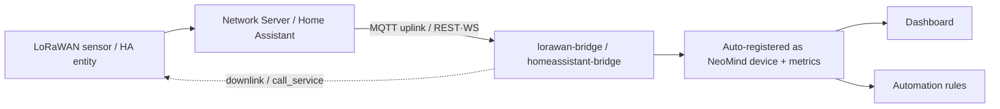

## 1. Solution Overview

| Bridge | Source | Mode | Typical devices |
|---|---|---|---|
| **lorawan-bridge** | LoRaWAN Network Server (ChirpStack v3/v4, TTN) | MQTT uplink + API downlink | Temp/humidity, soil, water-level, GPS wireless sensors |
| **homeassistant-bridge** | Home Assistant | REST polling or WebSocket realtime | Lights, switches, sensors, climate — 3000+ HA entities |

**Data Flow**:



sidebar_label: "LoRaWAN + Home Assistant"

## 2. Bill of Materials (BOM)

| Item | Spec | Purpose | Required |
|------|------|------|------|
| **NeoMind platform** | v0.9.0+ | Extension host | ✅ |
| **lorawan-bridge / homeassistant-bridge** | — | Pick per scenario | ✅ |
| **LoRaWAN Network Server** | ChirpStack v3/v4 or TTN (for LoRaWAN) | Device access platform | LoRaWAN |
| **Home Assistant instance** | Network-accessible + long-lived token (for HA) | Entity source | HA |
| **Sensors / smart devices** | LoRaWAN nodes / HA-integrated devices | Data source | ✅ |

---

## 3. Install the Extensions

Both bridges are standard NeoMind extensions: after installation, everything is configured with commands on the extension detail page — no platform code required. They behave identically from the outside — external entities / devices get registered as NeoMind devices and metrics — so once either one is installed, dashboards, automation rules, and AI Chat work exactly like any other integration.

Both bridges are installed from the extension Marketplace (market version 2.7.x):

1. Open the **Extensions** page in NeoMind → **Marketplace** tab, search for `lorawan-bridge`, and click **Install**;
2. Search for and install `homeassistant-bridge` the same way;
3. After installation, open the extension detail page and confirm the status is **Running**.

CLI equivalent:

```bash
neomind extension market-install lorawan-bridge
neomind extension market-install homeassistant-bridge
neomind extension status lorawan-bridge    # confirm health after install
```

> All commands used below (`connect` / `set_decoder` / `call_service`, etc.) are issued from the **Commands tab on the extension detail page**, or via the HTTP API: `POST /api/extensions/:id/command` with body `{"command": "...", "args": { ... }}`.

---

## 4. LoRaWAN (lorawan-bridge)

The full path of one uplink is: sensor node → LoRa gateway → network server (ChirpStack / TTN) → MQTT broker → lorawan-bridge. The bridge does no radio work and implements no LoRaWAN stack — the network server has already received the radio frames and turned them into JSON events on MQTT; the bridge only subscribes to those events and decodes the binary payload into metrics. Downlinks run the other way: the bridge calls the network server's API to push a command into the device queue. So there are only two things that matter when onboarding: make the network server send and receive properly (4.1), and tell the bridge how to decode payloads (4.4).

Supports ChirpStack v3, ChirpStack v4, and TTN; built-in Cayenne LPP decoder (with GPS coordinates) plus a custom binary decoder; auto-discovers devices from MQTT uplinks; supports downlink queues (FPort 1–223) and RSSI/SNR signal-quality monitoring; MQTT auto-reconnect with subscription recovery.

### 4.1 Prerequisites (Network Server side)

Before connecting the extension, make sure the network server side is ready:

| Item | Requirement | How to verify |
|------|------|----------|
| MQTT broker | ChirpStack MQTT integration enabled; broker reachable from the NeoMind host (plain 1883 / TLS 8883) | `nc -vz <broker-ip> 1883` from the NeoMind host |
| Application | Created, with the **application ID** noted (numeric ID in ChirpStack, application name in TTN) | Applications page in the ChirpStack console |
| LoRa node | Device joined (OTAA/ABP) under the application and reporting normally | Recent uplink events on the ChirpStack device page |
| Downlink API | If you need downlinks, prepare the NS API URL and credentials (see 3.5) | — |

> TTN users: the broker address looks like `mqtts://eu1.cloud.thethings.network:8883`, and the MQTT username follows the `{app_id}@{tenant_id}` pattern.

### 4.2 Connect to a Network Server (connect)

Run `connect` on the lorawan-bridge extension detail page:

```json
{
  "ns_type": "chirpstack_v4",
  "broker_url": "mqtt://192.168.1.10:1883",
  "username": "...",
  "password": "...",
  "application_id": "1",
  "default_decoder": "cayenne"
}
```

**connect parameters**:

| Parameter | Type | Required | Description |
|------|------|------|------|
| `ns_type` | string | ✅ | Network server type: `chirpstack` (v3) / `chirpstack_v4` / `ttn` |
| `broker_url` | string | ✅ | MQTT broker URL; `mqtt://` / `tcp://` plain (default 1883), `ssl://` / `mqtts://` for TLS (default 8883) |
| `username` | string | — | MQTT username |
| `password` | string | — | MQTT password; **doubles as the API credential for downlinks** (stores the API Key for ChirpStack v4 / TTN, see 3.5) |
| `application_id` | string | ✅ | ChirpStack application ID or TTN application ID |
| `tenant_id` | string | — | TTN tenant ID, defaults to `ttn` |
| `ns_api_url` | string | Required for downlink | Network server API URL (e.g. `https://chirpstack.example.com`), only needed to send downlinks |
| `default_decoder` | string | — | Default decoder for newly discovered devices: `cayenne` (default) or `custom` |

After connecting, the extension subscribes to the uplink topic for the selected network server:

| Network Server | Uplink topic | Notes |
|---|---|---|
| ChirpStack v3 / v4 | `application/{id}/device/+/event/up` | v3 top-level `devEui`; v4 nested `deviceInfo.devEui` |
| TTN | `v3/{app_id}@{tenant_id}/devices/{dev_id}/up` | QoS 0 only (TTN MQTT limitation); prefers `uplink_message.decoded_payload` |

The extension subscribes at QoS 0; every uplink message registers / updates the device. Messages on FPort 0 are MAC commands and are ignored.

**Which fields does the bridge actually read?** Here is a real ChirpStack v4 uplink (abridged — only the fields the bridge reads; the real message also carries unrelated fields like `txInfo` and `time`):

<details>
<summary>Real ChirpStack v4 uplink JSON (click to expand)</summary>

```json
{
  "deviceInfo": {
    "devEui": "0102030405060708",
    "deviceName": "garden-soil-01"
  },
  "fCnt": 42,
  "fPort": 2,
  "data": "AGcA6wFoeA==",
  "rxInfo": [{ "rssi": -57, "snr": 8.2 }]
}
```

</details>

| Field | What the bridge does with it |
|---|---|
| `deviceInfo.devEui` | Device identity, creates the `lorawan-{dev_eui}` device (v3 reads the top-level `devEui` instead) |
| `data` | base64 payload, fed to the 4.4 decoder for local decoding |
| `object` | Object already decoded by the network server; **used preferentially when present, skipping local decoding** |
| `fPort` | Application port; 0 means MAC command — the whole message is ignored |
| `fCnt` | Frame counter → the device's `f_cnt` metric |
| `rxInfo[0].rssi` / `.snr` | Signal-quality metrics |
| `object.battery` | Written to the `battery` metric when present (TTN uses `decoded_payload.battery`) |

TTN uplinks are structured differently: `end_device_ids.device_id` serves as the device identity (so a TTN device's NeoMind ID is `lorawan-{device_id}`, not an EUI), and decoding prefers `uplink_message.decoded_payload`, falling back to decoding `frm_payload` locally:

<details>
<summary>Real TTN uplink JSON (click to expand)</summary>

```json
{
  "end_device_ids": { "device_id": "garden-soil-01" },
  "uplink_message": {
    "f_cnt": 42,
    "f_port": 2,
    "frm_payload": "AGcA6wFoeA==",
    "decoded_payload": { "temperature": 23.5, "humidity": 60 },
    "rx_metadata": [{ "rssi": -57, "snr": 8.2 }]
  }
}
```

</details>

> 📷 TODO screenshot | connect config · suggested path `…/neomind/lorawan-ha/01-lorawan-connect.png`

### 4.3 Verify

Check these three points in order:

1. **Devices appear on the Devices page**: device IDs look like `lorawan-{dev_eui}` (e.g. `lorawan-0102030405060708`), named `LoRa Device {dev_eui}`; or inspect via `list_devices` / `get_device(dev_eui)`;
2. **Metric names look right**: decoded fields become metrics directly (Cayenne yields `temperature` / `humidity` / `barometric_pressure` / `illuminance` / `latitude` / `longitude` / `altitude`, etc., with units); TTN pre-decoded payload keys are normalized (keys containing `temp` → `temperature`, containing `hum` → `humidity`, etc.);
3. **Signal-quality metrics are updating**: each device carries `rssi` (dBm, closer to 0 is better), `snr` (dB), `f_cnt` (frame counter, increasing), and `last_seen`; battery-powered devices also report `battery`.

**The full journey of one uplink** — from MQTT message to device-page metrics. Walk through the real message from 4.2 (`data: "AGcA6wFoeA=="`):

1. base64 decode → raw bytes `00 67 00 EB 01 68 78` (7 bytes total);
2. Cayenne decode (step-by-step in 4.4) → `temperature = 23.5 °C` and `humidity = 60 %`;
3. The bridge updates device `lorawan-0102030405060708` and writes the metrics; `get_device` now returns:

```json
{
  "success": true,
  "device": {
    "dev_eui": "0102030405060708",
    "fields": [
      { "name": "temperature", "value": 23.5, "unit": "°C" },
      { "name": "humidity", "value": 60, "unit": "%" }
    ],
    "rssi": -57,
    "snr": 8.2,
    "battery": null,
    "f_cnt": 42,
    "f_port": 2,
    "last_seen": 1788871293512,
    "decoder_type": "cayenne"
  }
}
```

Check your output against this item by item: the `fields` values match the sensor's real environment (compare with a second device or estimate by hand), `f_cnt` increases with every frame, and `last_seen` is a recent timestamp — if all three hold, both the uplink and the decoder are healthy.

You can also use `get_status` to check the MQTT connection state and device count; the `messages_received` / `decode_errors` metrics indicate uplink and decoding health.

> 📷 TODO screenshot | device and metrics · suggested path `…/neomind/lorawan-ha/03-lorawan-device.png`

### 4.4 Decoding

**Cayenne LPP** (default): standard decoder, supported sensor types:

| Cayenne type | Metric | Unit | Conversion |
|---|---|---|---|
| Temperature (0x67) | `temperature` | °C | ×0.1 |
| Humidity (0x68) | `humidity` | % | ×0.5 |
| Barometer (0x73) | `barometric_pressure` | hPa | ×0.1 |
| Illuminance (0x65) | `illuminance` | lux | raw |
| Analog input (0x02) | `analog_in` | V | ×0.01 |
| Digital input / output (0x00 / 0x01) | `digital_input` / `digital_output` | — | raw |
| GPS (0x06) | `latitude` / `longitude` / `altitude` | ° / ° / m | ×0.0001 / ×0.0001 / ×0.01 |

Unknown type codes are skipped (jumping over the standard-length data bytes) without breaking the remaining fields.

**Worked example: decoding a Cayenne message** — payload hex `006700EB016878` (that is `AGcA6wFoeA==` from the real uplink in 4.2). In Cayenne LPP every data point is fixed at `channel (1 byte) + type code (1 byte) + data (fixed length)`, and multi-byte values are big-endian:

| Step | Bytes read | Meaning | Conversion |
|---|---|---|---|
| 1 | `00 67` → `00 EB` | Channel 0, type 0x67 (temperature), raw 0x00EB = 235 | 235 × 0.1 = **23.5 °C** |
| 2 | `01 68` → `78` | Channel 1, type 0x68 (humidity), raw 0x78 = 120 | 120 × 0.5 = **60 %** |

The decoded result becomes the device metrics directly:

```json
[
  { "name": "temperature", "value": 23.5, "unit": "°C" },
  { "name": "humidity", "value": 60, "unit": "%" }
]
```

**custom**: for vendor-proprietary binary protocols, define per-device field mappings with `set_decoder`:

| Parameter | Type | Required | Description |
|------|------|------|------|
| `dev_eui` | string | ✅ | Target device EUI |
| `decoder_type` | string | ✅ | `cayenne` or `custom` |
| `fields` | array | For custom | Array of field definitions, see below |

Structure of each `fields` element (example — a "temperature + soil moisture" sensor where the first two bytes are temperature and the next two are humidity):

```json
{
  "dev_eui": "0102030405060708",
  "decoder_type": "custom",
  "fields": [
    { "name": "temperature", "offset": 0, "length": 2, "type": "int16", "scale": 0.1, "unit": "°C" },
    { "name": "soil_moisture", "offset": 2, "length": 2, "type": "uint16", "scale": 0.1, "unit": "%" }
  ]
}
```

| Field key | Description |
|---|---|
| `offset` / `length` | Byte offset and length of the field in the payload |
| `name` | Metric name (as shown on the device page) |
| `type` | Data type: `uint8` / `uint16` / `int16` / `uint32` / `int32` |
| `scale` | Scale factor (raw value × scale = actual value) |
| `unit` | Unit, display only |

**Worked example: decoding a custom frame** — using the mapping above, the node sends a frame `00E70140` (4 bytes):

| Step | Field | Read | Conversion |
|---|---|---|---|
| 1 | `temperature` | 2 bytes at offset 0, int16 big-endian `0x00E7` = 231 | 231 × 0.1 = **23.1 °C** |
| 2 | `soil_moisture` | 2 bytes at offset 2, uint16 big-endian `0x0140` = 320 | 320 × 0.1 = **32.0 %** |

```json
[
  { "name": "temperature", "value": 23.1, "unit": "°C" },
  { "name": "soil_moisture", "value": 32, "unit": "%" }
]
```

Three common pitfalls with the custom decoder: multi-byte types are always parsed **big-endian** (if the vendor doc declares little-endian, swap the byte order in firmware, or the values will be garbage); fields whose `offset + length` run past the actual payload length are **silently skipped** (no error, and the metric simply never appears — check this first when a metric is always missing); and `scale` set to `0` or omitted means no scaling (raw value passes through).

Applies per device: a device with a `custom` decoder keeps its custom mapping even when `default_decoder` is `cayenne`.

### 4.5 Downlinks (send_downlink)

A downlink command passes through five steps from issue to actual reception:

1. **Issue**: run `send_downlink` from the Commands tab on the extension detail page, or trigger it from an automation rule's `execute` action;
2. **Validate & encode**: the extension checks that `f_port` is within 1–223 (0 is MAC commands, 224+ are protocol-reserved — rejected outright) and converts `payload_hex` to base64;
3. **Queue submission**: the extension calls the network server's REST / gRPC-gateway API according to `ns_type` (real requests for all three servers below), pushing the payload into the device's downlink queue (FPort Downlink Queue);
4. **Network server transmits**: a Class A device can only receive the queued downlink in a **receive window after its next uplink** — "submission succeeded" ≠ "device received it", you must wait for the device's next frame; Class C devices get it almost immediately;
5. **Confirmation**: with `confirmed: true` the device must reply with an ACK; until then the network server retries the queue item.

`send_downlink` pushes a hex payload into a device's downlink queue via the network server API:

```json
{ "dev_eui": "0102030405060708", "f_port": 10, "payload_hex": "01FF", "confirmed": false }
```

| Parameter | Type | Required | Description |
|------|------|------|------|
| `dev_eui` | string | ✅ | Target device EUI (TTN addresses by `device_id`) |
| `f_port` | integer | ✅ | Port **1–223** (0 is reserved, 224+ are protocol-reserved ranges) |
| `payload_hex` | string | ✅ | Hex payload (converted to base64 automatically) |
| `confirmed` | boolean | — | Request confirmed downlink, default `false` |

Using this command as the example (`payload_hex: "01FF"` becomes base64 `Af8=`), here is the actual HTTP request sent to each of the three network servers:

<details>
<summary>Actual ChirpStack v3 request (click to expand)</summary>

```
POST {ns_api_url}/api/devices/0102030405060708/queue
Authorization: Basic {base64(username:password)}

{ "deviceQueueItem": { "confirmedDownlink": false, "fPort": 10, "data": "Af8=" } }
```

</details>

<details>
<summary>Actual ChirpStack v4 request (click to expand)</summary>

```
POST {ns_api_url}/api/devices/0102030405060708/queue
Grpc-Metadata-Authorization: Bearer {API Key}

{ "queueItem": { "confirmed": false, "f_port": 10, "data": "Af8=" } }
```

Note the three v4 differences: the body wrapper key changes from `deviceQueueItem` to `queueItem`; field names become snake_case; and authentication moves from Basic to the `Grpc-Metadata-Authorization` header (the API Key is the value stored as `password` in `connect`).

</details>

<details>
<summary>Actual TTN request (click to expand)</summary>

```
POST {ns_api_url}/api/v3/as/applications/{app_id}/devices/{device_id}/down/push
Authorization: Bearer {API Key}

{ "downlinks": [{ "f_port": 10, "confirmed": false, "frm_payload": "Af8=" }] }
```

TTN addresses devices by `device_id` (not dev_eui).

</details>

Downlink implementation is adapted automatically per network server; `ns_api_url` must be set in `connect`, with credentials ready:

| Network Server | Downlink API | Auth |
|---|---|---|
| ChirpStack v3 | `POST {ns_api_url}/api/devices/{dev_eui}/queue` (`deviceQueueItem`) | Basic (connect `username` / `password`) |
| ChirpStack v4 | Same path, body is `queueItem` (snake_case fields) | `Grpc-Metadata-Authorization: Bearer {API Key}` (the API Key is the connect `password`) |
| TTN | `POST {ns_api_url}/api/v3/as/applications/{app_id}/devices/{device_id}/down/push` | `Authorization: Bearer {API Key}` (the connect `password`) |

Sending without `ns_api_url` fails immediately with `NS API URL not configured`.

---

## 5. Home Assistant (homeassistant-bridge)

Home Assistant is the smart-home hub, and the bridge consumes its API: REST polling is simple and reliable, WebSocket event streaming is real-time. The bridge maps every HA entity to its own NeoMind device, so lights, climate units, and motion sensors live in the same "device + metric" namespace as LoRa sensors — the rule engine and dashboards treat them uniformly.

Connect to HA via REST (polling) or WebSocket (real-time events); auto-discovers entities and registers them as NeoMind devices, with entity-type filtering and service-call control.

### 5.1 Prerequisite: create a long-lived access token

In HA, open **Profile → Security → Long-Lived Access Tokens**, create a token and copy it (shown only once). Make sure the NeoMind host can reach the HA HTTP port (default 8123).

### 5.2 Connect

```json
{ "url": "http://192.168.1.20:8123", "token": "eyJ...", "mode": "websocket" }
```

| Parameter | Type | Required | Description |
|------|------|------|------|
| `url` | string | ✅ | HA URL including port (e.g. `http://192.168.1.20:8123`) |
| `token` | string | ✅ | Long-lived access token |
| `mode` | string | — | `rest` (default) or `websocket` |
| `poll_interval_ms` | integer | — | REST polling interval, default 5000ms |

Mode comparison:

| Aspect | REST mode | WebSocket mode |
|---|---|---|
| Data delivery | Polls states every `poll_interval_ms` | Event-stream subscription, instant state-change push |
| Real-time | Depends on polling interval | Real-time |
| Area discovery | Not supported | Supported (`get_areas`) |
| Disconnect behavior | Poll errors counted (`poll_errors`) | Auto-reconnect with exponential backoff (capped at 30s, resets after successful auth) |
| Best for | Basic monitoring, low-frequency queries | Linkage control, status cards (**recommended**) |

> 📷 TODO screenshot | HA connection · suggested path `…/neomind/lorawan-ha/02-ha-connect.png`

### 5.3 Verify

**What exactly does the bridge register?** Two things:

1. A `ha_entity` **device template** defining the standard metric set: `state` (state string), `friendly_name`, `domain`, `area`, `last_changed`, `value` (numeric state), `unit`, and `battery` (0–100);
2. **One NeoMind device per HA entity** (one entity, one device): device ID `ha_{entity_id}` (`.` / `-` replaced by `_`), device name taken from HA's `friendly_name`. Lights are lights, switches are switches — each its own device — so the rule engine can set conditions and actions on a single entity directly.

On every sync the bridge writes these metrics to each device: `state` (e.g. `on` / `23.5`), `value` (when the state parses as a number, e.g. `23.5`), `unit` (e.g. `°C`), `battery`, `domain`, and `last_changed`; the extension itself also has `ha.connection` / `ha.entities_count` / `ha.total_commands` metrics. Control-relevant key attributes are kept on the entity (visible via `get_state` / `list_entities`): `brightness` (0–255), `color_temp` (mired), `hvac_mode` / `hvac_action`, `current_temperature`, `fan_mode`, `position`, `media_title`, and more.

**What does the data the bridge sees look like?** REST polling fetches `GET /api/states`; each entity state looks like:

<details>
<summary>REST /api/states single entity state (click to expand)</summary>

```json
{
  "entity_id": "sensor.living_room_temperature",
  "state": "23.5",
  "attributes": {
    "friendly_name": "Living Room Temperature",
    "unit_of_measurement": "°C",
    "device_class": "temperature",
    "battery": 85
  },
  "last_changed": "2026-09-08T10:21:33.512+00:00"
}
```

</details>

WebSocket mode additionally subscribes to the `state_changed` event stream; every entity change arrives as a real-time frame:

<details>
<summary>WebSocket state_changed event (click to expand)</summary>

```json
{
  "id": 1,
  "type": "event",
  "event": {
    "event_type": "state_changed",
    "data": {
      "entity_id": "light.living_room",
      "old_state": { "state": "off" },
      "new_state": {
        "entity_id": "light.living_room",
        "state": "on",
        "attributes": {
          "friendly_name": "Living Room Light",
          "brightness": 200,
          "color_temp": 350
        },
        "last_changed": "2026-09-08T10:21:33.512+00:00"
      }
    }
  }
}
```

</details>

The bridge only reads `new_state` from the event to update device metrics (`new_state` being `null` means the entity was removed and is ignored). After a WebSocket disconnect and reconnect, it automatically runs a full REST resync to catch up on state changes missed while offline.

Once connected, check these three points in order:

1. **Entities registered as devices**: HA entities register with device ID `ha_{entity_id}` (`.` / `-` replaced by `_`, e.g. `light.living_room` → `ha_light_living_room`), carrying `state` / `value` / `unit` / `battery` metrics;
2. **Counts line up**: `get_status` returns the connection state and entity count (`entity_count`), consistent with the number of entities visible in HA; `list_entities` can filter by type;
3. **Area grouping** (WebSocket mode): `get_areas` returns the HA area list, so devices can be grouped by area in NeoMind.

> 📷 TODO screenshot | HA entity devices · suggested path `…/neomind/lorawan-ha/04-ha-entities.png`

### 5.4 Entity filtering (set_filters)

With many entities, use `set_filters` to track only the types you care about:

| Parameter | Type | Required | Description |
|------|------|------|------|
| `entity_types` | array of strings | ✅ | Entity domains to track, e.g. `["light", "switch", "sensor", "binary_sensor", "climate"]` |

```json
{ "entity_types": ["light", "switch", "climate"] }
```

After filtering, only entities whose domain matches register as devices; use `refresh` afterwards to force-refresh all entity states. `configure` can also change `poll_interval_ms` and the filters.

### 5.5 Control (call_service)

`call_service` invokes HA services directly:

```json
{ "service": "light.turn_on", "entity_id": "light.living_room", "service_data": { "brightness": 200 } }
```

| Parameter | Type | Required | Description |
|------|------|------|------|
| `service` | string | ✅ | HA service name (`domain.service`) |
| `entity_id` | string | ✅ | Target entity |
| `service_data` | object | — | Service parameters (brightness, color temp, temperature, etc.) |

Common services:

| Service | Purpose | service_data examples |
|---|---|---|
| `light.turn_on` / `light.turn_off` / `light.toggle` | Light on / off / toggle | `{ "brightness": 200 }`, `{ "color_temp": 350 }` |
| `switch.turn_on` / `switch.turn_off` / `switch.toggle` | Switch control | — |
| `climate.set_temperature` | Climate setpoint | `{ "temperature": 24 }` |

**The full hop from command to device**: `call_service` lands on HA's REST endpoint `POST /api/services/{domain}/{service}`, with a body merging `entity_id` and `service_data`. One example each for light, climate, and switch:

| Command you send | What HA receives |
|---|---|
| `light.turn_on`, `entity_id: light.living_room`, `service_data: { "brightness": 200, "color_temp": 350 }` | `POST /api/services/light/turn_on`, body: `{ "entity_id": "light.living_room", "brightness": 200, "color_temp": 350 }` |
| `climate.set_temperature`, `entity_id: climate.living_room_ac`, `service_data: { "temperature": 24 }` | `POST /api/services/climate/set_temperature`, body: `{ "entity_id": "climate.living_room_ac", "temperature": 24 }` |
| `switch.turn_on`, `entity_id: switch.garden_valve` | `POST /api/services/switch/turn_on`, body: `{ "entity_id": "switch.garden_valve" }` |

Parameter semantics follow HA conventions: `brightness` is 0–255 (200 ≈ 78% brightness); `color_temp` is in mired (micro-reciprocal kelvin) — lower values mean a cooler light; `temperature` follows the entity's `temperature_unit` attribute (°C / °F).

How to confirm the command took effect: HA returns the updated states of the affected entities (passed through in the command result's `result` field); then use `get_state` to re-check the entity's `state` and `brightness` attributes. Note: if the `entity_id` does not exist in HA, the service call may succeed without error while the device does nothing — when in doubt about an entity name, run it manually once from the Commands tab first.

---

## 6. Linkage Examples

Devices / metrics from the two bridges can drive each other directly in the rule engine (data source format `device:{device-id}:{metric}`; the `execute` action supports `target_type: "extension"` to invoke extension commands).

### 6.1 LoRaWAN soil moisture → HA irrigation

When a LoRa soil sensor (custom-decoded `soil_moisture` from section 4.4) stays below 30% for 60 seconds, open the irrigation valve via homeassistant-bridge and notify:

```json
{
  "name": "Soil moisture irrigation",
  "trigger": { "trigger_type": "data_change" },
  "condition": {
    "condition_type": "comparison",
    "source": "device:lorawan-0102030405060708:soil_moisture",
    "operator": "less_than",
    "threshold": 30
  },
  "actions": [
    { "type": "notify", "message": "Soil moisture {value}% too low — valve opened", "severity": "warning" },
    { "type": "execute", "target": "homeassistant-bridge", "target_type": "extension", "command": "call_service",
      "params": { "service": "switch.turn_on", "entity_id": "switch.garden_valve" } }
  ],
  "for_duration": 60,
  "cooldown": 600
}
```

**Where each piece is configured, step by step**:

1. **Data source ready** (extension side): 4.2 `connect` to the network server, 4.4 `set_decoder` with the `soil_moisture` mapping → confirm on the Devices page that device `lorawan-0102030405060708` shows a `soil_moisture` metric with plausible values;
2. **Executor ready** (extension side): 5.2 connect to HA → run `list_entities` from the Commands tab (filtered to domain `switch`) and confirm `switch.garden_valve` exists;
3. **Create the rule** (Automation Rules page → new rule):
   - Trigger: data change (`data_change`), data source = device `lorawan-0102030405060708`, metric `soil_moisture`;
   - Condition: comparison (`comparison`), `less_than`, threshold `30`; duration `for_duration: 60` — moisture must stay below 30% **for 60 seconds** to fire, filtering out single-frame jitter;
   - Action 1: notification, `severity: warning`; `{value}` in the message is replaced with the actual moisture;
   - Action 2: execute extension command (`execute`, `target_type: extension`), target extension `homeassistant-bridge`, command `call_service`, params `service: switch.turn_on`, `entity_id: switch.garden_valve`;
   - Cooldown `cooldown: 600`: no re-triggering for 10 minutes, so the valve does not cycle on and off repeatedly;
4. **Verify**: temporarily raise the threshold above the current moisture (or spritz the sensor) → the rule execution history shows one firing → `switch.garden_valve` turns `on` in HA → the notification arrives; during the cooldown the rule will not fire again even if the condition keeps holding.

### 6.2 HA motion → LoRaWAN downlink opens the valve

When HA motion sensor `binary_sensor.garden_motion` detects a person (`state` becomes `on`), send an open-valve downlink to the outdoor valve controller via lorawan-bridge:

```json
{
  "name": "Motion opens valve",
  "trigger": { "trigger_type": "data_change" },
  "condition": {
    "condition_type": "comparison",
    "source": "device:ha_binary_sensor_garden_motion:state",
    "operator": "regex",
    "threshold_value": "^on$"
  },
  "actions": [
    { "type": "execute", "target": "lorawan-bridge", "target_type": "extension", "command": "send_downlink",
      "params": { "dev_eui": "0102030405060708", "f_port": 10, "payload_hex": "01FF", "confirmed": false } }
  ],
  "cooldown": 300
}
```

**Where each piece is configured, step by step**:

1. **Downlink path ready** (extension side): 4.2 `connect` with `ns_api_url` filled in and the API Key stored as `password` (all three downlink APIs in 4.5 depend on these) → first send one manual `send_downlink` from the Commands tab (e.g. `payload_hex: "01FF"`) and confirm the network server accepts it and the command reaches the device;
2. **Data source ready** (extension side): HA's `binary_sensor.garden_motion` is registered as device `ha_binary_sensor_garden_motion` (confirm the ID and the `state` metric on the Devices page);
3. **Confirm the payload convention** (firmware side): `01FF` / f_port 10 is just an example — the actual byte meaning follows the node firmware docs (e.g. byte 1 command code `01` = open valve, byte 2 `FF` = parameter); a wrongly formatted payload is silently ignored by the device;
4. **Create the rule** (Automation Rules page → new rule):
   - Trigger: data change (`data_change`), data source `device:ha_binary_sensor_garden_motion:state`;
   - Condition: regex (`regex`) `^on$` — `state` is the string `on` / `off`, so a numeric comparison (`comparison`) does not apply to boolean states; use a regex to match `on` exactly;
   - Action: execute extension command, target extension `lorawan-bridge`, command `send_downlink`, params `dev_eui` / `f_port: 10` / `payload_hex: "01FF"`;
   - Cooldown `cooldown: 300`: no re-sending for 5 minutes, so repeated walk-bys do not flood the downlink queue;
5. **Verify**: walk up to the sensor to trigger motion → a downlink frame (fPort 10) appears on the ChirpStack device detail Events / Queue page → the device opens the valve. Remember that a Class A node only actually transmits the downlink after its next uplink — allow for that delay when verifying.

> Device IDs / metric names in rules are examples — confirm the actual registered values on the Devices page; downlink payloads must match the format agreed with the node firmware.

---

## 7. Downstream Usage

Metrics and devices from both bridges are consumed like any other integration:

- **Dashboard**: LoRaWAN sensor charts, HA light/climate status cards.
- **Automation rules**: trigger irrigation on low soil moisture, motion-triggered lights ([Automation Rules](../user-guide/7-automation-rules.md)); cross-bridge linkages see section 6 above.
- **AI Chat**: "what's the garden soil moisture?" or "set the living-room light to 50%" — query and control in natural language.

---

## 8. Troubleshooting

| Symptom | Likely cause | Fix |
|------|----------|------|
| Subscribed to ChirpStack but no uplinks arrive | `application_id` does not match the ChirpStack application; wrong broker address / credentials | Verify the numeric application ID; check `connected` via `get_status`; use an MQTT client to confirm messages on `application/{id}/device/+/event/up` |
| TTN uplinks not arriving | TTN MQTT supports QoS 0 only; wrong `tenant_id`; broker should be `mqtts://…:8883` | Verify the `{app_id}@{tenant_id}` username and `tenant_id` (defaults to `ttn`); use the correct cluster domain and TLS port |
| Garbled or wildly wrong decoded values | Device is not Cayenne format; `set_decoder` `offset` / `length` / `type` / `scale` misconfigured | Inspect the raw payload via `get_device`, re-check offsets and byte order, then re-apply `set_decoder`; a `NS API URL not configured` downlink error means `ns_api_url` was missing in `connect` |
| HA returns 401 / auth failure | Long-lived token expired or copied incompletely | Regenerate the token in the HA Profile and `connect` again |
| WebSocket mode keeps reconnecting | Wrong `url` (missing port, or https instead of http) or invalid token failing auth | Correct `url` (e.g. `http://192.168.1.20:8123`) and `token`; the backoff interval resets automatically after successful auth |
| HA entities missing from the device list | Filtered out by `set_filters` `entity_types` | Add the entity's domain to the filter list, then run `refresh` |

---

## 9. Appendix

### Related docs

- [Extension Management](../user-guide/9-extensions.md)
- [Automation Rules](../user-guide/7-automation-rules.md)
- [AI Chat](../user-guide/5-ai-chat.md)
- [Industrial Protocol Integration (Modbus/OPC-UA/BACnet)](./8-industrial-protocols.md)
- lorawan-bridge / homeassistant-bridge extension READMEs

---

*Last updated: 2026-09-09*
