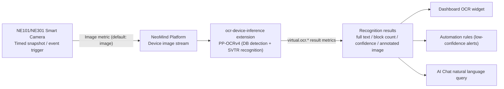

# OCR Solution

> Turn images captured by NE101/NE301 cameras into searchable text with the **OCR extension (`ocr-device-inference`)** — once bound to the image stream, every frame is recognized automatically, and results flow into the dashboard, automation rules, and AI Chat.

---

## 1. Solution Overview

The NeoMind **OCR extension (`ocr-device-inference`)** performs general text recognition on images captured by devices. Built on **PP-OCRv4** models (DB text detection + SVTR text recognition, with Chinese/English switching), the extension binds to a device's image stream and automatically extracts text from every frame, displaying results on the dashboard. Recognition results can also be queried via **AI Chat** using natural language.

**Typical Use Cases**:

| Scenario | Description |
|------|------|
| Nameplate Reading | Identify model, serial number, and parameters on equipment nameplates |
| Label Recognition | Read text descriptions next to product labels and barcodes |
| Document Digitization | Convert paper documents and signage into searchable text |
| Meter Reading | Recognize readings on digital meters (e.g., electricity, water) |

**Data Flow**:



| Stage | Description |
|------|------|
| Image Capture | NE101/NE301 captures images via timed snapshots or event triggers |
| OCR Recognition | The OCR extension automatically extracts text from images (detection + recognition, with bounding-box drawing and ROI filtering) |
| Result Display | Dashboard displays recognition results in real time, with history support |
| AI Chat Query | Query recognized text content using natural language |

---

## 2. Bill of Materials (BOM)

Before starting, confirm you have: a smart camera that can capture images, a NeoMind platform, and the OCR extension — no GPU or extra hardware required.

| Item | Specification | Purpose | Required |
|------|------|------|------|
| **Smart Camera** | NE101 or NE301 | Image capture | ✅ |
| **NeoMind Platform** | v0.9.0+ ([Download](https://github.com/camthink-ai/NeoMind/releases/latest)) | Edge AI management | ✅ |
| **OCR Extension** | ocr-device-inference 2.7.x | Text recognition inference | ✅ |

> Inference hardware is auto-detected: CoreML on macOS, CUDA on Linux with an NVIDIA GPU, CPU fallback otherwise — no manual configuration needed.

---

## 3. Prerequisites

### 3.1 NeoMind Installation and Configuration

Complete the NeoMind installation, registration, and basic configuration first. For detailed steps, refer to [NeoMind Quick Start](../user-guide/1-install-setup.md).

### 3.2 Device Onboarding

Register your NE101 or NE301 to the NeoMind platform:

1. Navigate to the **Device Management** page in NeoMind
2. Click **Add Device** and select the device type (NE101 or NE301)
3. Confirm the device info (device ID and topic are auto-generated, or customize them)
4. Save and wait for the device to come online


> For detailed device onboarding steps, refer to [NeoMind Quick Start - Device Management](../user-guide/3-onboard-device.md).

### 3.3 Verify the Device Is Online

- The **Devices page** shows the newly added device (e.g., `ne301-new`) with an online status.
- In the device details, confirm there is an **image metric** — OCR binding uses the image metric named `image` by default; make sure it keeps updating when the device captures images.
- Note the device ID: you will need it for binding and for metric references (DataSourceId format: `device:<deviceID>:<metric>`).

---

## 4. Install the OCR Extension

The OCR extension is published in the official extension marketplace; the current version is **2.7.x** (this guide uses 2.7.8).

### 4.1 Install from the Extension Marketplace (Recommended)

**Step 1**: Navigate to the **Extensions** management page, click the **Extension Marketplace** icon (globe) in the toolbar, and search for `ocr-device-inference`


**Step 2**: Click **Install** — NeoMind automatically picks the `.nep` package matching your platform / ABI and installs it


**Step 3**: After installation the extension appears in the extension list and starts automatically; confirm its status is Running


> In addition, the extension marketplace offers two newer OCR extensions: **`paddle-ocr-v6`** (PP-OCRv6 native ONNX inference with multi-tier models) and **`paddle-ocr-vl`** (high-accuracy multilingual OCR with table and key-information extraction). For complex layouts / tables, prefer the latter — see the [NE101 Camera OCR use case](./4-camera-ocr.md) and the [PaddleOCR-VL use case](./5-paddle-ocr-vl.md).

### 4.2 CLI Installation (Optional)

```bash
neomind extension market-list                          # List extensions available in the marketplace
neomind extension market-install ocr-device-inference  # Install from the marketplace (latest by default)
neomind extension market-install ocr-device-inference --version 2.7.8
```

### 4.3 Verify the Installation

- The extension card in the list and the top of the extension detail page should show **Running** (green dot).
- Open the **extension detail page** and confirm the Overview / Configuration / Commands / Metrics / Logs tabs exist.
- Switch to the **Metrics** tab: the extension-level metrics `bound_devices`, `total_inferences`, `total_text_blocks`, and `total_errors` should be reporting (initially 0).

> How to invoke commands: OCR binding and management can be done in the dashboard OCR widget (see [5.2](#52-add-ocr-panel-and-bind-device)) or via extension commands — either in the extension detail page **Commands** tab, or via the REST API `POST /api/extensions/:id/command` with body `{"command":"...","args":{...}}`.

---

## 5. Dashboard Configuration and Device Binding

### 5.1 Create a Dashboard

Navigate to the **Dashboard** management page and click **Create Dashboard**.

### 5.2 Add OCR Panel and Bind Device

In the dashboard, click **Add Panel**, select the **OCR** component under the **Extensions** tab (provided by the `ocr-device-inference` extension), and bind the target device:

<div style={{display: 'flex', gap: '8px'}}>
  
  
</div>

Once bound, the OCR panel will automatically receive and process images captured by the device:


You can add other widgets to the Dashboard page for additional data and content display.

The OCR widget also supports **one-shot recognition by uploading an image** and device-binding management. You can enable `drawBoxes` (bounding-box drawing) and `showPreview` (result preview) in the widget configuration.

### 5.3 Command-Based Binding and Management (Optional)

The dashboard widget works well for configuring a single device; if you need to bind multiple devices via scripts / APIs, use the command channel instead. Bind via the `bind_device` command in the extension detail page **Commands** tab (or via REST):

```json
{
  "command": "bind_device",
  "args": {
    "device_id": "ne301-new",
    "image_metric": "image",
    "draw_boxes": true,
    "language": "chinese"
  }
}
```

A successful execution returns:

```json
{ "success": true, "device_id": "ne301-new" }
```

`device_id` is required; omitted parameters fall back to defaults (`image_metric: image`, `draw_boxes: true`, `language: chinese`). Bindings are persisted to the extension configuration and restored automatically after an extension restart — no need to re-bind. A successful bind is only the first step; confirm recognition is actually running per [5.4](#54-verify-the-binding).

| Command | Key Parameters | Description |
|------|----------|------|
| `bind_device` | `device_id`, `image_metric` (default `image`), `draw_boxes` (default `true`), `language` (`chinese` / `english`) | Bind a device; OCR runs automatically on every image update |
| `unbind_device` | `device_id` | Remove a binding |
| `toggle_binding` | `device_id`, `active` | Enable / pause an existing binding |
| `get_bindings` | — | List all bindings and their status |
| `update_roi` | `device_id`, `roi_regions`, `roi_overlap_threshold` (default `0.5`) | Set ROI polygon regions so only text inside them is recognized (vertices in 0.0–1.0 normalized coordinates) |
| `recognize_image` | `image` (base64), `language` | One-shot OCR on a single base64-encoded image |
| `get_status` | — | View extension status and statistics |

REST example (bind a device):

```bash
curl -X POST -H "X-API-Key: $NEOMIND_API_KEY" \
     -H "Content-Type: application/json" \
     -d '{"command":"bind_device","args":{"device_id":"ne301-new","image_metric":"image","draw_boxes":true,"language":"chinese"}}' \
     http://localhost:9375/api/extensions/ocr-device-inference/command
```

### 5.4 Verify the Binding

A `success: true` response from `bind_device` only means the arguments were accepted. The real acceptance criteria are three things: metrics start growing, `get_status` shows an active binding, and result metrics start being written.

- Extension detail page **Metrics** tab: `bound_devices` ≥ 1; after the device captures images, `total_inferences` keeps growing and `total_errors` stays flat.
- Run `get_bindings` in the **Commands** tab and confirm the binding is active; or run `get_status` to get the model state, cumulative statistics, and per-binding status in one call:

```json
{ "command": "get_status", "args": {} }
```

Response (fields can be asserted directly, no transformation needed):

```json
{
  "success": true,
  "data": {
    "model_loaded": true,
    "model_error": null,
    "total_inferences": 128,
    "total_text_blocks": 342,
    "total_errors": 0,
    "bindings_count": 1,
    "bindings": [
      { "device_id": "ne301-new", "active": true, "total_inferences": 128 }
    ]
  }
}
```

How to read it: `model_loaded: false` is normal before the first inference (models load lazily), but if `model_error` also has a value, model loading failed — troubleshoot per section 10. In `bindings`, the target device should show `"active": true` with its `total_inferences` growing as captures come in.

- Each recognition writes `virtual.ocr.*` result metrics to the device, with DataSourceIds such as:
  - `device:ne301-new:virtual.ocr.full_text` (recognized full text)
  - `device:ne301-new:virtual.ocr.count` (text block count)
  - `device:ne301-new:virtual.ocr.confidence` (average confidence, 0.0–1.0)
  - `device:ne301-new:virtual.ocr.annotated_image` (annotated image with bounding boxes)

About the annotated image: when `draw_boxes: true` (the default), the extension draws every recognized text box onto the original image, encodes it as **JPEG**, and writes it to `virtual.ocr.annotated_image` as a `data:image/jpeg;base64,…` data URI. Bind this metric to a dashboard image widget to see boxes follow the text — the most direct way to verify recognition positions and ROI regions.

---

## 6. Trigger Test and View Results

### 6.1 Trigger Capture Test

After binding the device, you can manually trigger a capture to verify OCR recognition. Once the device captures an image, the OCR extension will automatically perform text recognition.

### 6.2 View Recognition Results

In the OCR panel on the dashboard, you can view real-time recognition results, including the original image and extracted text:


### 6.3 View Recognition History

In the device details, you can view all historical OCR recognition records, including the original image and extraction results for each recognition:

> 📷 Screenshot pending | Device details · historical OCR recognition list · suggested path `…/neomind/ocr-solution/device-history.png`

<div style={{display: 'flex', gap: '8px'}}>
  
  
</div>

---

## 7. AI Chat Query

Once OCR recognition results are stored, you can query recognized text content via **AI Chat** using natural language. For example:

```
Hello, what's the OCR result of my device ne301-new? Reply in English.
```


> **Tip**: AI Chat requires an LLM backend (e.g., Ollama). For configuration, refer to [NeoMind Quick Start](../user-guide/1-install-setup.md) or [Configure LLM Backend](../user-guide/2-configure-llm.md).

---

## 8. Downstream Usage

OCR results enter the platform as `device:<deviceID>:<metric>`. Dashboards, rules, and AI Chat all reference this format:

| Result | Metric | DataSourceId Example |
|------|--------|-------------------|
| Full text | `virtual.ocr.full_text` | `device:ne301-new:virtual.ocr.full_text` |
| Text block count | `virtual.ocr.count` | `device:ne301-new:virtual.ocr.count` |
| Average confidence | `virtual.ocr.confidence` | `device:ne301-new:virtual.ocr.confidence` |
| Annotated image | `virtual.ocr.annotated_image` | `device:ne301-new:virtual.ocr.annotated_image` |

- **Dashboard**: Bind the DataSourceIds above to text / value / image cards to display the recognized text, block count, and confidence in real time (see [Using the Dashboard](../user-guide/4-use-dashboard.md)).
- **Automation rules**: For example, "alert for manual review when confidence is too low" — set a threshold on `virtual.ocr.confidence` ([automation rules](../user-guide/7-automation-rules.md)). Example rule JSON:

```json
{
  "name": "OCR low-confidence alert",
  "trigger": { "trigger_type": "data_change" },
  "condition": {
    "condition_type": "comparison",
    "source": "device:ne301-new:virtual.ocr.confidence",
    "operator": "less_than",
    "threshold": 0.6
  },
  "actions": [
    { "type": "notify", "message": "Meter reading confidence too low ({value}), manual review required", "severity": "warning" }
  ]
}
```

- **AI Chat**: Natural language queries, e.g. "What text has ne301-new recognized in the last hour?"

---

## 9. Typical Scenarios

| Scenario | Recommended Configuration | How To |
|------|----------|------|
| **Meter reading** (electricity / water) | ROI over the dial + `chinese` | Use `update_roi` with a polygon covering only the reading area (0–1 normalized coordinates) to filter out background text; add a low-confidence alert rule on `virtual.ocr.confidence` for timely manual review |
| **Nameplate / label recognition** | `draw_boxes: true` | Enable bounding-box drawing and verify recognition regions on the annotated image; validate a single clear image with `recognize_image` before enabling automatic binding |
| **Document digitization** | Resolution first | Increase capture resolution and focus — text that is too small causes misses; keep `language` consistent with the document language (currently `chinese` / `english`) |
| **Complex layouts / tables / multilingual** | Switch to the Paddle family | `ocr-device-inference` targets general text-line recognition; for table reconstruction and key-information extraction use [PaddleOCR-VL](./5-paddle-ocr-vl.md), and for the end-to-end camera pipeline see the [NE101 Camera OCR use case](./4-camera-ocr.md) |

---

## 10. Troubleshooting

Locate issues with the trio: the extension detail page **Logs** tab for process output, the **Metrics** tab to check whether `total_errors` is growing, and the **Commands** tab running `get_bindings` / `get_status` for binding and statistics. Common issues:

| Symptom | Possible Cause | Solution |
|----------|----------|----------|
| `total_inferences` does not grow after binding; no recognition results | `image_metric` does not match the device's actual image metric name; binding is inactive | Confirm the device image metric name (default `image`) matches the `bind_device` parameter; check status with `get_bindings` and re-activate with `toggle_binding` (`active: true`) |
| `virtual.ocr.count` is 0; no text recognized | Image resolution too low, text too small or blurry; `language` does not match the text language (default `chinese`, Chinese/English only) | Improve capture resolution and lighting; switch `language` to match the scene; validate with `recognize_image` on a single clear image first to rule out capture quality issues |
| Bounding boxes are offset, or irrelevant text is recognized | Full-frame recognition picks up background text; `draw_boxes` annotations do not match the expected region | Use `update_roi` to set polygons covering only the target area (vertices 0.0–1.0 normalized), and adjust `roi_overlap_threshold` as needed (default 0.5; higher requires more overlap between the text block and the ROI) |
| `total_errors` keeps growing; inference fails | PP-OCRv4 model files (`det_mv3_db.onnx` / `rec_svtr.onnx` / `rec_en.onnx`) missing or corrupted; ONNX Runtime issue | Check the specific error in the **Logs** tab; reinstall the extension or re-download models per the extension README; the first inference loads models and is expected to be slower |
| Garbled / missing characters in mixed Chinese-English text | The extension recognizes a single language at a time (`chinese` or `english`) | Pick `language` by the dominant language; for mixed scripts, multilingual text, or tables, switch to `paddle-ocr-v6` / `paddle-ocr-vl` (see the note in [4.1](#41-install-from-the-extension-marketplace-recommended)) |
| `virtual.ocr.confidence` stays low | Blurry images, glare, or tilted shooting angle | Improve capture conditions (focus, lighting, shoot head-on); use ROI to focus on key text; add the low-confidence alert rule from [8. Downstream Usage](#8-downstream-usage) as a safety net |

---

## 11. Appendix

### Related Documentation

- [Extension Management](../user-guide/9-extensions.md)
- [Using the Dashboard](../user-guide/4-use-dashboard.md)
- [AI Chat](../user-guide/5-ai-chat.md)
- [Configure LLM Backend](../user-guide/2-configure-llm.md)
- [Face Recognition Solution](./3-face-recognition.md) (also an image-AI extension; can be combined with OCR)
- [NE101 Camera OCR use case](./4-camera-ocr.md)
- [PaddleOCR-VL Document Understanding](./5-paddle-ocr-vl.md)
- [NE101 Quick Start](../../2-neoeyes-ne101-series/1-quick-start.md)
- [NE301 Quick Start](../../5-neoeyes-ne301-series/1-quick-start.md)
- ocr-device-inference extension README

---

*Last updated: 2026-09-08*
