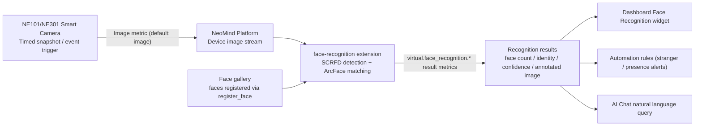

# Face Recognition Solution

> Turn images captured by NE101/NE301 cameras into identity recognition results with the **Face Recognition extension (`face-recognition`)** — SCRFD detects faces, ArcFace matches them against the face gallery, and results flow into the dashboard, automation rules, and AI Chat.

---

## 1. Overview

The **Face Recognition extension** for NeoMind detects faces and identifies individuals from images captured by connected devices: the **SCRFD** model detects faces, and **ArcFace** extracts 512-dimensional face feature vectors that are matched against the face gallery for identity recognition. Once bound to a device's image stream, every snapshot is automatically detected and recognized, with results displayed in real-time on the dashboard and queryable via **AI Chat** using natural language.

**Typical Application Scenarios**:

| Scenario | Description |
|----------|-------------|
| Access Control | Identify personnel entering and leaving, enabling smart access management |
| Attendance Tracking | Automatically recognize employees' facial features and log attendance |
| Visitor Registration | Compare visitors against registered personnel to distinguish known from unknown individuals |
| Security Monitoring | Detect and identify individuals in surveillance footage in real-time |

**Data Flow**:



| Stage | Description |
|------|------|
| Image Capture | NE101/NE301 captures images via timed snapshots or event triggers |
| Face Detection & Recognition | The extension detects faces (SCRFD), extracts features, and matches them against the gallery (ArcFace); unmatched faces are labeled `unknown` |
| Result Display | The dashboard shows face bounding boxes, identity labels, and confidence scores in real time, with history support |
| AI Chat Query | Query historical recognition records and statistics using natural language |

---

## 2. Bill of Materials (BOM)

| Item | Model/Spec | Qty | Purpose | Required |
|------|-----------|-----|---------|----------|
| **Smart Camera** | NE101 or NE301 | 1+ | Image capture | ✅ |
| **NeoMind Platform** | v0.9.0+ | 1 | Edge AI management | [Download](https://github.com/camthink-ai/NeoMind/releases/latest) ✅ |
| **Face Recognition Extension** | face-recognition 2.7.x | 1 | Face detection and identity recognition | ✅ |
| **Local LLM** | Ollama | 1 | AI Chat backend | Optional |

---

## 3. Prerequisites

### 3.1 NeoMind Installation and Configuration

Complete the NeoMind installation, registration, and basic configuration first. For detailed steps, refer to [NeoMind Quick Start](../user-guide/1-install-setup.md).

### 3.2 Device Registration

Register your NE101 or NE301 with the NeoMind platform:

1. Navigate to the **Device Management** page in NeoMind
2. Click **Add Device** and select the device type (NE101 or NE301)
3. Confirm the device info (device ID and topic are auto-generated, or customize them)
4. Save and wait for the device to come online

> For detailed steps, refer to [NeoMind Quick Start - Device Management](../user-guide/3-onboard-device.md).

### 3.3 Verify the Device Is Online

- The **Devices page** shows the newly added device (e.g., `ne101-gate`) with an online status.
- In the device details, confirm there is an **image metric** — face recognition binding uses the image metric named `image` by default; make sure it keeps updating when the device captures images.
- Note the device ID: you will need it for binding and for metric references (DataSourceId format: `device:<deviceID>:<metric>`).

---

## 4. Install the Face Recognition Extension

The extension is published in the official extension marketplace; the current version is **2.7.x** (this guide uses 2.7.8).

### 4.1 Install from the Extension Marketplace (Recommended)

**Step 1**: Go to the **Extensions** management page, click the **Extension Marketplace** icon (globe) in the toolbar, and search for `face-recognition`


**Step 2**: Click to view the extension details, review the description, then click **Install** — NeoMind downloads and installs it automatically. After installation the extension appears in the extension list and starts automatically; confirm its status is Running


### 4.2 CLI Installation (Optional)

```bash
neomind extension market-list                     # List extensions available in the marketplace
neomind extension market-install face-recognition # Install from the marketplace (latest by default)
neomind extension market-install face-recognition --version 2.7.8
```

### 4.3 Verify the Installation

- The extension card in the list and the top of the extension detail page should show **Running** (green dot).
- Open the **extension detail page** and confirm the Overview / Configuration / Commands / Metrics / Logs tabs exist.
- Switch to the **Metrics** tab: the extension-level metrics `bound_devices`, `total_inferences`, `total_recognized`, and `total_unknown` should be reporting (initially 0).

> The SCRFD (`det_10g.onnx`) and ArcFace models ship with the extension and are **lazy-loaded on first inference** — the first recognition after installation is slower, which is expected.

---

## 5. Dashboard Configuration and Usage

### 5.1 Create Dashboard and Add Face Recognition Component

Go to the **Dashboard** management page, click **Create Dashboard**, then click **Add Panel** and select the **Face Recognition** component under the **Extensions** tab (provided by the `face-recognition` extension):


### 5.2 Bind Device

Bind a target device (NE101 or NE301) in the Face Recognition widget; the image metric should match the device's actual image metric name (default `image`). Once bound, the widget will automatically receive and process images captured by the device:


> 📷 Screenshot pending | Face Recognition widget device binding UI · suggested path `…/neomind/face-recognition/dashboard-3b.png`

You can also bind via the `bind_device` command in the extension detail page **Commands** tab (or via REST `POST /api/extensions/:id/command`), with parameters `device_id` + `metric_name` (default `image`):

```json
{ "command": "bind_device", "args": { "device_id": "ne101-gate", "metric_name": "image" } }
```

Binding management commands: `get_bindings` to list all bindings and their status, `toggle_binding` (`device_id` + `active`) to enable/pause, and `unbind_device` to remove a binding.

### 5.3 Register Faces

Before using the identification feature, you need to register faces to the face gallery. In the Face Recognition widget, click **Register Face**, upload a clear frontal photo and fill in the corresponding identity information:


> For best recognition accuracy, use clear, well-lit frontal photos for face registration.

You can also register via the `register_face` command (parameters `name` + `image`, where `image` is a base64-encoded photo), and manage the gallery with `list_faces` and `delete_face` (parameter `face_id`). The face gallery is persisted, so re-registration is not needed after an extension restart.

### 5.4 Test Recognition

Once faces are registered, the extension will automatically detect and identify faces when the device captures images. View real-time recognition results on the dashboard:


Recognition results include:

| Field | Description |
|-------|-------------|
| Face Bounding Box | Marks the detected face location in the image |
| Identity Label | Shows the identified person's identity; unmatched faces are labeled `unknown` |
| Confidence Score | The confidence score of the recognition result |

Recognition thresholds and capacity can be adjusted at runtime via the `configure` command (`get_config` to view the current configuration):

```json
{ "command": "configure", "args": { "config": { "recognition_threshold": 0.45, "max_faces": 10 } } }
```

| Setting | Default | Description |
|--------|--------|------|
| `recognition_threshold` | `0.45` | Similarity threshold for identity matching; higher is stricter (fewer false matches, more misses), lower is looser |
| `max_faces` | `10` | Maximum number of faces processed per frame |
| `confidence_threshold` | `0.5` | Face detection confidence threshold |

### 5.5 View History

View all historical face recognition records in the device details, including the original image and recognition result for each entry:


<div style={{display: 'flex', gap: '8px'}}>
  
  
</div>

### 5.6 Verify

- Extension detail page **Metrics** tab: `bound_devices` ≥ 1; when a person appears in view, `total_inferences` keeps growing; `total_recognized` grows on matches and `total_unknown` grows when strangers appear.
- Run `get_bindings` in the **Commands** tab and confirm the binding is active; run `list_faces` to confirm faces are in the gallery.
- Each recognition writes `virtual.face_recognition.*` result metrics to the device, with DataSourceIds such as:
  - `device:ne101-gate:virtual.face_recognition.face_count` (number of faces detected)
  - `device:ne101-gate:virtual.face_recognition.face_names` (comma-separated identity list; `unknown` for unmatched)
  - `device:ne101-gate:virtual.face_recognition.confidence` (average confidence)
  - `device:ne101-gate:virtual.face_recognition.annotated_image` (annotated image with face bounding boxes)

---

## 6. AI Chat Query

Once recognition results are stored, you can query face data using **AI Chat** with natural language. For example:

```
hello, please analyse the history data and result of 'face recognition', reply in english
```


> **Tip**: AI Chat requires an LLM backend (e.g., Ollama). For configuration, refer to [NeoMind Quick Start](../user-guide/1-install-setup.md) or [Configure LLM Backend](../user-guide/2-configure-llm.md).

---

## 7. Downstream Usage

Face recognition results enter the platform as `device:<deviceID>:<metric>`. Dashboards, rules, and AI Chat all reference this format:

| Result | Metric | DataSourceId Example |
|------|--------|-------------------|
| Face count | `virtual.face_recognition.face_count` | `device:ne101-gate:virtual.face_recognition.face_count` |
| Identity list | `virtual.face_recognition.face_names` | `device:ne101-gate:virtual.face_recognition.face_names` |
| Average confidence | `virtual.face_recognition.confidence` | `device:ne101-gate:virtual.face_recognition.confidence` |
| Annotated image | `virtual.face_recognition.annotated_image` | `device:ne101-gate:virtual.face_recognition.annotated_image` |

- **Dashboard**: Bind the DataSourceIds above to text / value / image cards to display people on site, identities, and annotated frames in real time (see [Using the Dashboard](../user-guide/4-use-dashboard.md)).
- **Automation rules**: For example, "notify as soon as someone appears at the gate" — set a threshold on `virtual.face_recognition.face_count` ([automation rules](../user-guide/7-automation-rules.md)). Example rule JSON:

```json
{
  "name": "Perimeter person-detected alert",
  "trigger": { "trigger_type": "data_change" },
  "condition": {
    "condition_type": "comparison",
    "source": "device:ne101-gate:virtual.face_recognition.face_count",
    "operator": "greater_than",
    "threshold": 0
  },
  "actions": [
    { "type": "notify", "message": "Gate camera detected {value} face(s), please check", "severity": "warning" }
  ]
}
```

- **AI Chat**: Natural language queries, e.g. "Who was recognized by the gate camera today?" or "How many strangers passed by in the last hour?"

---

## 8. Typical Scenarios

| Scenario | Recommended Configuration | How To |
|------|----------|------|
| **Access control / perimeter monitoring** | Strict threshold + alert rules | After registering regular personnel, keep `recognition_threshold` at the default 0.45 or slightly higher to reduce false admissions; add a "greater than 0" rule on `face_count` for instant notification — strangers appear as `unknown` in `face_names` for follow-up |
| **Attendance tracking** | Fixed position + single face | Point the camera straight at the check-in spot where usually only one face is in frame; log attendance by the employee identities appearing in `face_names`, and use AI Chat for "who checked in today" statistics |
| **Visitor registration** | Whitelist matching | Register only internal staff; visitors show up as `unknown`, distinguishing them from known personnel and triggering a reception workflow |
| **Crowd monitoring** (retail, workshop) | Raise capacity | When many faces appear per frame, use `configure` to raise `max_faces` (default 10); watch `total_recognized` / `total_unknown` trends rather than single-frame results |

---

## 9. Troubleshooting

Locate issues with the trio: the extension detail page **Logs** tab for process output, the **Metrics** tab for `total_inferences` / `total_recognized` / `total_unknown` counters, and the **Commands** tab running `get_bindings` / `list_faces` / `get_config` for bindings, gallery, and configuration. Common issues:

| Symptom | Possible Cause | Solution |
|----------|----------|----------|
| `register_face` fails, or a registered person is never recognized | No face in the uploaded photo, or the photo is blurry / not frontal; poor lighting | Re-register with a clear, well-lit frontal photo; run `list_faces` afterwards to confirm it is in the gallery |
| A registered person is recognized as `unknown` | `recognition_threshold` too high; on-site angle / distance differs too much from the registered photo | Check the threshold with `get_config` and lower `recognition_threshold` appropriately (default 0.45); re-register with photos taken from angles similar to the scene |
| A stranger is mistakenly identified as a registered person | `recognition_threshold` too low, matching too loosely | Raise `recognition_threshold` appropriately; add registration photos from more angles to improve discrimination |
| Some faces are missed when several people are in frame | `max_faces` cap reached (default 10); `confidence_threshold` too high causes detection misses | Raise `max_faces` via `configure`; lower the detection threshold `confidence_threshold` if needed (default 0.5) |
| `total_inferences` does not grow after binding; no recognition at all | `metric_name` does not match the device's actual image metric name; binding is inactive | Confirm the device image metric name (default `image`) matches the binding parameter; check status with `get_bindings` and re-activate with `toggle_binding` (`active: true`) |
| First recognition after installation is very slow or times out | SCRFD / ArcFace models are **lazy-loaded on first inference** | Expected behavior — wait for the first frame to finish; later inferences run at normal speed. Watch `total_inferences` to confirm it keeps working |

---

## 10. Appendix

### Related Documentation

- [Extension Management](../user-guide/9-extensions.md)
- [Using the Dashboard](../user-guide/4-use-dashboard.md)
- [AI Chat](../user-guide/5-ai-chat.md)
- [Configure LLM Backend](../user-guide/2-configure-llm.md)
- [NeoMind Quick Start](../user-guide/1-install-setup.md)
- [OCR Text Extraction Solution](./2-ocr-text-extraction.md) (also an image-AI extension; can be combined)
- [Object Detection Use Case](./1-object-detection.md)
- [NE101 Quick Start](../../2-neoeyes-ne101-series/1-quick-start.md)
- [NE301 Quick Start](../../5-neoeyes-ne301-series/1-quick-start.md)
- face-recognition extension README

---

*Last updated: 2026-09-08*
