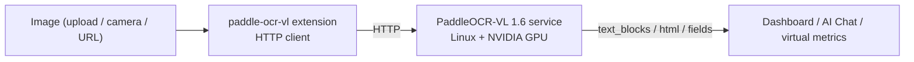

# PaddleOCR-VL Document Understanding

> A VLM document-understanding extension — high-accuracy OCR, table recognition, and KIE for complex layouts and invoices/forms. A GPU server is required.

---

## 1. Solution Overview

paddle-ocr-vl is an **HTTP bridge extension**: the extension itself is a lightweight client (~MB), while the actual PaddleOCR-VL 1.6 model runs in a separate Python inference service (Linux + NVIDIA GPU recommended). This split keeps the extension cross-platform and offloads heavy inference to the GPU.

It provides three capabilities, each with its own command:

| Capability | Command | Output | Use case |
|---|---|---|---|
| High-accuracy multilingual OCR | `recognize` | `text_blocks` + `full_text` | Complex layouts, mixed languages |
| Table recognition | `recognize_table` | HTML table | Financial statements, inspection reports |
| Key information extraction (KIE) | `extract_keys` | structured `fields` | Invoices / receipts / forms |

**Data Flow**:



> The key difference from [paddle-ocr-v6](./4-camera-ocr.md): v6 is local ONNX, plain text extraction, edge-runnable; paddle-ocr-vl is a remote VLM that understands layout / tables / semantics and needs a GPU service. See Section 7 for selection guidance.

---

## 2. Bill of Materials (BOM)

| Item | Spec | Purpose | Required |
|------|------|------|------|
| **NeoMind platform** | v0.9.0+ | Extension host | ✅ |
| **paddle-ocr-vl extension** | v2.7.7+ | HTTP bridge | ✅ |
| **GPU inference server** | Linux + NVIDIA GPU (CUDA 12.6) | Run the PaddleOCR-VL Python service | ✅ |
| **Local LLM** | Ollama, etc. | AI Chat backend | Optional |

---

## 3. Prerequisites: Deploy the Inference Service

On the GPU server, in the extension source `server/` directory:

```bash
cd extensions/paddle-ocr-vl/server

python -m venv .venv_paddleocr && source .venv_paddleocr/bin/activate

# GPU (CUDA 12.6)
pip install paddlepaddle-gpu==3.2.1 -i https://www.paddlepaddle.org.cn/packages/stable/cu126/
# Or CPU: pip install paddlepaddle==3.2.1

pip install -r requirements.txt
./download_models.sh     # pre-download 1–2GB model weights (optional; auto-downloaded on first inference)

python3 server.py        # → http://0.0.0.0:8000
# Override with HOST / PORT / PADDLE_DEVICE env vars
```

> No GPU, or want to verify the wiring first? Run `python3 mock_server.py` (returns canned responses).

Once the service is up, run the `health` command on the extension detail page; it should return `status: ok, model_loaded: true`.

> 📷 TODO screenshot | health check · suggested path `…/neomind/paddle-ocr-vl/01-health.png`

---

## 4. Install and Configure the Extension

Go to the **Extensions** page, install **paddle-ocr-vl** from the marketplace, and in **Configuration** point `endpoint` at the inference service (e.g. `http://<gpu-server-ip>:8000`).

| Parameter | Default | Description |
|--------|------|------|
| `endpoint` | `http://127.0.0.1:8000` | PaddleOCR-VL service URL |
| `language` | `ch` | `ch` / `en` / `japan` / `korean` / `german` / `french` |
| `use_doc_orientation_classify` | `false` | Auto-rotate correction |
| `use_doc_unwarping` | `false` | Dewarp (photographed / curved docs) |
| `timeout_ms` | `30000` | HTTP timeout (1s–120s) |

> 📷 TODO screenshot | Install and configure endpoint · suggested path `…/neomind/paddle-ocr-vl/02-install-config.png`

---

## 5. Usage

### 5.1 Test with the Dashboard card (PaddleOcrCard)

The extension ships a frontend component, **PaddleOcrCard** — add it to the Dashboard to test visually, with no need to fill in raw command args:

1. Upload an image (drag or click; PNG/JPG/WEBP supported).
2. Switch mode: **Text** (`recognize`) / **Table** (`recognize_table`) / **Keys** (`extract_keys`).
3. In settings, pick a language and optionally enable "auto-rotate" / "de-warp" (good for skewed photographed documents).
4. After it runs: Text mode overlays colored text blocks and lists the text (toggle "blocks / plain text" views); Table mode renders an HTML table; Keys mode lists the extracted key-value pairs.

> Under the hood it calls the same extension commands; the card just wraps upload, parameters, and result visualization.

> 📷 TODO screenshot | Dashboard PaddleOcrCard test · suggested path `…/neomind/paddle-ocr-vl/03-dashboard-card.png`

### 5.2 Integrate with the NE101 camera component

In the [NE101 camera component](./4-camera-ocr.md), set `processingExtensionId` to **`paddle-ocr-vl`** with template `text_detection` → calls `recognize`. Suited to camera-captured posters, nameplates, and screens that need high-quality OCR; the returned `text_blocks` is compatible with the component's overlay rendering.

### 5.3 Via AI Chat

Just tell [AI Chat](../user-guide/5-ai-chat.md) "use paddle-ocr-vl to extract the invoice number, date, and total from this invoice" — the LLM calls the command and interprets the result.

---

## 6. Typical Scenarios

### 6.1 Invoice / receipt structured extraction (KIE)

Use `extract_keys` + a schema to turn a receipt into fields:

```json
{ "image_base64": "...", "schema": { "fields": ["invoice_no", "date", "total", "seller"] } }
```

Returns something like:

```json
{ "fields": { "invoice_no": "INV-2024-001", "date": "2024-07-13", "total": "1250.00", "seller": "..." } }
```

Write directly to a database or push to ERP via [Data Push](../user-guide/7c-data-push.md).

> 📷 TODO screenshot | Invoice KIE result · suggested path `…/neomind/paddle-ocr-vl/04-invoice-kie.png`

### 6.2 Table recognition

`recognize_table` returns an HTML table — suited to financial statements, inspection reports, and spec sheets; render it in the dashboard with a Markdown / HTML component.

> 📷 TODO screenshot | Table recognition → HTML · suggested path `…/neomind/paddle-ocr-vl/05-table.png`

### 6.3 Complex layouts / warped photographed documents

Enable `use_doc_unwarping` and `use_doc_orientation_classify` to dewarp and straighten phone-photographed curved / skewed documents before recognition, noticeably improving accuracy on multi-column, image-text mixed layouts.

---

## 7. Selection: paddle-ocr-vl vs paddle-ocr-v6

| Dimension | paddle-ocr-v6 | paddle-ocr-vl |
|------|---------------|---------------|
| Model | PP-OCRv6 (ONNX, local) | PaddleOCR-VL 1.6 (VLM, remote GPU) |
| Capability | Plain text extraction | Text + tables + KIE + layout understanding |
| Deployment | Self-contained, edge-runnable | Requires a GPU inference service |
| Latency | Milliseconds | Seconds |
| Best for | Simple printed text, readings, offline | Complex layouts, tables, invoice structured extraction, photographed docs |

---

## 8. Appendix

### Related docs

- [NE101 Camera AI Vision (paddle-ocr-v6)](./4-camera-ocr.md)
- [General OCR Solution](./2-ocr-text-extraction.md)
- [Extension Management](../user-guide/9-extensions.md)
- [AI Chat](../user-guide/5-ai-chat.md)
- [Data Push](../user-guide/7c-data-push.md)

---

*Last updated: 2026-07-13*
