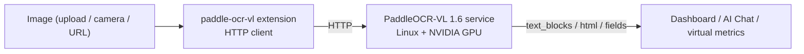

# PaddleOCR-VL Document Understanding

> A VLM document-understanding extension — high-accuracy OCR, table recognition, and KIE for complex layouts and invoices/forms. A GPU server is required.

---

## 1. Solution Overview

paddle-ocr-vl is an **HTTP bridge extension**: the extension itself is a lightweight client (~MB), while the actual PaddleOCR-VL 1.6 model runs in a separate Python inference service (Linux + NVIDIA GPU recommended). This split keeps the extension cross-platform and offloads heavy inference to the GPU.

It provides four commands:

| Capability | Command | Output | Use case |
|---|---|---|---|
| High-accuracy multilingual OCR | `recognize` | `text_blocks` + `full_text` | Complex layouts, mixed languages |
| Table recognition | `recognize_table` | HTML table | Financial statements, inspection reports |
| Key information extraction (KIE) | `extract_keys` | structured `fields` | Invoices / receipts / forms |
| Service probe | `health` | `status` / `model_loaded` / `load_error` | Connectivity and model-load check after deployment |

**Data Flow**:



> The key difference from [paddle-ocr-v6](./4-camera-ocr.md): v6 is local ONNX, plain text extraction, edge-runnable; paddle-ocr-vl is a remote VLM that understands layout / tables / semantics and needs a GPU service. See Section 7 for selection guidance.

---

## 2. Bill of Materials (BOM)

| Item | Spec | Purpose | Required |
|------|------|------|------|
| **NeoMind platform** | v0.9.0+ | Extension host | ✅ |
| **paddle-ocr-vl extension** | v2.7.7+ | HTTP bridge | ✅ |
| **GPU inference server** | Linux + NVIDIA GPU (CUDA 12.6) | Run the PaddleOCR-VL Python service | ✅ |
| **Local LLM** | Ollama, etc. | AI Chat backend | Optional |

> Backend service support: Linux x86_64 (CUDA, recommended for production), Linux ARM64 (Jetson + JetPack), Windows (CUDA); macOS is CPU-only — slow on Apple Silicon, impractical on Intel. The extension itself is a pure Rust HTTP client and installs on all platforms.

---

## 3. Prerequisites: Deploy the Inference Service

On the GPU server, in the extension source `server/` directory:

```bash
cd extensions/paddle-ocr-vl/server

python -m venv .venv_paddleocr && source .venv_paddleocr/bin/activate

# GPU (CUDA 12.6)
pip install paddlepaddle-gpu==3.2.1 -i https://www.paddlepaddle.org.cn/packages/stable/cu126/
# Or CPU: pip install paddlepaddle==3.2.1

pip install -r requirements.txt
./download_models.sh     # pre-download 1–2GB model weights into ~/.paddlex (optional; auto-downloaded on first inference)

python3 server.py        # → http://0.0.0.0:8000
# Override with HOST / PORT / PADDLE_DEVICE env vars
```

> **GPU server note**: the server-side `PADDLE_DEVICE` defaults to `cpu`. On a GPU machine, start the service explicitly with `PADDLE_DEVICE=gpu python3 server.py`, otherwise the VLM falls back to CPU inference (very slow).

> No GPU, or want to verify the wiring first? Run `python3 mock_server.py` (returns canned responses; only needs `pip install fastapi uvicorn`).

Once the service is up, run the `health` command on the extension detail page: `status: ok` means the service is online. `model_loaded` only becomes `true` **after the first inference** (the `/health` probe does not load the model on demand); if it returns `status: degraded`, check the `load_error` field in the response to find the load failure cause.

> 📷 TODO screenshot | health check · suggested path `…/neomind/paddle-ocr-vl/01-health.png`

---

## 4. Install and Configure the Extension

Go to the **Extensions** page, install **paddle-ocr-vl** from the marketplace (see [Extension Management](../user-guide/9-extensions.md) for installation options), and in **Configuration** point `endpoint` at the inference service (e.g. `http://<gpu-server-ip>:8000`).

| Parameter | Type | Default | Range / Options | Description |
|--------|------|--------|-------------|------|
| `endpoint` | String | `http://127.0.0.1:8000` | http(s) URL | PaddleOCR-VL service URL (trailing `/` is trimmed automatically) |
| `language` | String | `ch` | `ch` / `en` / `japan` / `korean` / `german` / `french` | OCR language hint |
| `use_doc_orientation_classify` | Boolean | `false` | `true` / `false` | Run orientation classification and auto-rotate before OCR |
| `use_doc_unwarping` | Boolean | `false` | `true` / `false` | Dewarp (photographed / curved docs) |
| `timeout_ms` | Integer | `30000` | 1000–120000 | HTTP timeout (ms); out-of-range values are ignored and the default is kept |

> The `language` / `use_doc_orientation_classify` / `use_doc_unwarping` parameters of the `recognize` command can override the configuration per request; when omitted, the configured values apply. At the command level, `language` additionally supports `multilingual` (mixed scripts).

> The extension reports 5 metrics of its own (detail page **Metrics** tab): `request_count`, `success_count`, `failure_count`, `last_latency_ms`, `last_recognized_block_count` (the last two only start reporting after the first successful request). When troubleshooting, first check whether `failure_count` is growing.

> 📷 TODO screenshot | Install and configure endpoint · suggested path `…/neomind/paddle-ocr-vl/02-install-config.png`

---

## 5. Usage

### 5.1 Test with the Dashboard card (PaddleOcrCard)

The extension ships a frontend component, **PaddleOcrCard** — add it to a [dashboard](../user-guide/4-use-dashboard.md) to test visually, with no need to fill in raw command args:

1. Upload an image (drag or click; PNG/JPG/WEBP supported).
2. Switch mode: **Text** (`recognize`) / **Table** (`recognize_table`) / **Keys** (`extract_keys`).
3. In settings, pick a language and optionally enable "auto-rotate" / "de-warp" (good for skewed photographed documents).
4. After it runs: Text mode overlays colored text blocks and lists the text (toggle "blocks / plain text" views); Table mode renders an HTML table; Keys mode lists the extracted key-value pairs.

> Under the hood it calls the same extension commands; the card just wraps upload, parameters, and result visualization.

> 📷 TODO screenshot | Dashboard PaddleOcrCard test · suggested path `…/neomind/paddle-ocr-vl/03-dashboard-card.png`

### 5.2 Integrate with the NE101 camera component

In the [NE101 camera component](./4-camera-ocr.md), set `processingExtensionId` to **`paddle-ocr-vl`** with template `text_detection` → calls `recognize`. Suited to camera-captured posters, nameplates, and screens that need high-quality OCR; the returned `text_blocks` is compatible with the component's overlay rendering.

### 5.3 Via AI Chat

Just tell [AI Chat](../user-guide/5-ai-chat.md) "use paddle-ocr-vl to extract the invoice number, date, and total from this invoice" — the LLM calls the command and interprets the result.

### 5.4 Via commands / REST API

All commands can be run with parameters on the extension detail page **Commands** tab, or via the REST API (`POST /api/extensions/:id/command`, body `{"command":"...","args":{...}}`). For example, pass an image URL instead of Base64 for KIE:

```bash
curl -X POST -H "X-API-Key: $NEOMIND_API_KEY" \
     -H "Content-Type: application/json" \
     -d '{"command":"extract_keys","args":{"image_url":"http://192.168.1.20/img/receipt.jpg","schema":{"fields":["invoice_no","date","total"]}}}' \
     http://localhost:9375/api/extensions/paddle-ocr-vl/command
```

> Image is either-or: `image_base64` (Base64 bytes, preferred) or `image_url` (fetched by the inference service). `recognize` / `recognize_table` / `extract_keys` all require exactly one of the two, otherwise a parameter error is returned.

---

## 6. Typical Scenarios

### 6.1 Invoice / receipt structured extraction (KIE)

Use `extract_keys` + a schema to turn a receipt into fields:

```json
{ "image_base64": "...", "schema": { "fields": ["invoice_no", "date", "total", "seller"] } }
```

Returns something like:

```json
{
  "fields": {
    "markdown": "…full-page Markdown parsed from the document…",
    "invoice_no": "<requires LLM post-processing>",
    "date": "<requires LLM post-processing>",
    "total": "<requires LLM post-processing>",
    "seller": "<requires LLM post-processing>"
  },
  "processing_time_ms": 812.4
}
```

> **Note**: PaddleOCR-VL is a document parser, not a dedicated KIE model, and the service handles KIE on a best-effort basis — the full page content goes into `fields.markdown`, and the fields declared in the schema are returned as placeholders. Real field extraction requires an LLM on top: use [AI Chat](../user-guide/5-ai-chat.md) to extract the `markdown` content into JSON per the schema, then write it to a database / ERP via [Data Push](../user-guide/7c-data-push.md). When testing against `mock_server.py`, fixed sample values are returned instead (e.g. `invoice_no: INV-2026-0001`), which is enough to verify the wiring.

> 📷 TODO screenshot | Invoice KIE result · suggested path `…/neomind/paddle-ocr-vl/04-invoice-kie.png`

### 6.2 Table recognition

For tables in financial statements, inspection reports, and spec sheets, use `recognize_table` to convert them into HTML:

```json
{ "image_base64": "<base64-bytes>" }
```

Returns something like:

```json
{
  "html": "<table border='1' cellspacing='0' cellpadding='4'><thead><tr><th>Item</th><th>Qty</th><th>Price</th></tr></thead><tbody><tr><td>Widget</td><td>3</td><td>$12.50</td></tr><tr><td>Total</td><td>4</td><td>$86.50</td></tr></tbody></table>",
  "processing_time_ms": 1730.25
}
```

The service returns the HTML of the **largest table** found in the layout. Render it in a [dashboard](../user-guide/4-use-dashboard.md) with an HTML / Markdown component to reproduce the merged-cell structure.

> 📷 TODO screenshot | Table recognition → HTML · suggested path `…/neomind/paddle-ocr-vl/05-table.png`

### 6.3 Document digitization (complex layouts / warped photographed documents)

For multi-column, image-text mixed paper documents, or curved / skewed pages photographed by phone, use `recognize` to turn them into searchable text in one step:

```json
{
  "image_base64": "<base64-bytes>",
  "image_width": 1920,
  "image_height": 1080,
  "language": "ch",
  "use_doc_orientation_classify": true,
  "use_doc_unwarping": true
}
```

Returns something like:

```json
{
  "text_blocks": [
    { "text": "Hello", "confidence": 0.97,
      "bbox": { "x": 0.05, "y": 0.20, "width": 0.50, "height": 0.60 } }
  ],
  "full_text": "Hello\nWorld",
  "processing_time_ms": 420,
  "language": "ch"
}
```

With `use_doc_unwarping` and `use_doc_orientation_classify` enabled, the service straightens orientation and warping before parsing, noticeably improving accuracy on multi-column, image-text mixed layouts. `bbox` uses normalized 0–1 coordinates (passing `image_width` / `image_height` improves normalization accuracy); `full_text` is the plain-text document content, ready to be stored for full-text search or fed to an LLM for summarization and Q&A.

---

## 7. Selection: paddle-ocr-vl vs paddle-ocr-v6

| Dimension | paddle-ocr-v6 | paddle-ocr-vl |
|------|---------------|---------------|
| Model | PP-OCRv6 (ONNX, local) | PaddleOCR-VL 1.6 (VLM, remote GPU) |
| Capability | Plain text extraction | Text + tables + KIE + layout understanding |
| Deployment | Self-contained, edge-runnable | Requires a GPU inference service |
| Latency | Milliseconds | Seconds |
| Best for | Simple printed text, readings, offline | Complex layouts, tables, invoice structured extraction, photographed docs |

> Pure-edge deployments with no GPU server at all: pick `ocr-device-inference` (local SVTR ONNX, tens of MB, CPU-friendly), see the [General OCR Solution](./2-ocr-text-extraction.md); for local multi-tier plain text extraction pick [paddle-ocr-v6](./4-camera-ocr.md); only tables / KIE / complex layouts call for the paddle-ocr-vl covered here.

---

## 8. Troubleshooting

Start with the trio: the extension detail page **Logs** tab for process output, the **Metrics** tab for `failure_count` / `last_latency_ms`, and the `health` command for service status (fixed 5s timeout, returns `status` / `model_loaded` / `load_error`). Common issues:

| Symptom | Possible cause | Solution |
|----------|----------|----------|
| First inference hangs or reports a model download failure | The first inference downloads ~1–2GB of weights from the official Paddle model source into `~/.paddlex`; air-gapped / restricted networks cannot reach it | Pre-warm with `./download_models.sh` on an Internet-connected machine, then copy the `~/.paddlex` cache directory to the server; on load failure `/health` returns `status: degraded` with a `load_error` field — handle it per the error message |
| Extremely slow inference, zero GPU utilization | `PADDLE_DEVICE` not set (defaults to `cpu`); or the CPU `paddlepaddle` wheel was installed instead of `paddlepaddle-gpu==3.2.1` (cu126 index); CUDA version mismatches the wheel | Start the service with `PADDLE_DEVICE=gpu`; reinstall the GPU build of PaddlePaddle from the cu126 index per Section 3; the pipeline load time in the startup log (about 10–30s per load on CPU) is a good indicator |
| Command fails with `Request failed` / timeout (large images, first call) | VLM inference takes seconds and the first pipeline load takes about 10–30s; the default `timeout_ms=30000` is not enough | Raise `timeout_ms` (range 1000–120000; out-of-range values are ignored and the default kept); the `health` command always uses a fixed 5s timeout and is unaffected by this setting |
| `health` fails: Health check failed / service unreachable | Wrong `endpoint`, firewall blocking port 8000, or `HOST` / `PORT` were changed without updating the config | First `curl http://127.0.0.1:8000/health` on the GPU server itself, then `curl http://<gpu-server-ip>:8000/health` from the NeoMind host to isolate the segment; the service listens on `0.0.0.0:8000` by default — if the port was changed, update `endpoint` accordingly; a steadily growing `failure_count` is the typical signal |
| No GPU available, want to verify extension / card wiring first | The full VLM needs a GPU / large-memory environment | Run `python3 mock_server.py` (only needs `pip install fastapi uvicorn`); the extension's default `endpoint` already points at `127.0.0.1:8000`. The mock returns canned OCR / table / KIE responses (`/health` always reports `model_loaded: true`, version `1.6-mock`) — use it to verify the wiring only, not to evaluate accuracy |
| Poor recognition quality for language / layout | `language` is only a hint (informational for the VLM); skewed / curved photographed documents were not corrected; after toggling a preprocessing combo, the first call reloads the model | Keep the default `ch` for mixed Chinese-English, or pass `language: multilingual` at the command level for multi-script pages; enable `use_doc_orientation_classify` and `use_doc_unwarping` for skewed / curved documents; the server caches one pipeline per (rotate + dewarp) combo (at most 2, FIFO eviction) — the first call after switching combos reloads the ~1–2GB model, which is normal |

---

## 9. Appendix

### Related docs

- [NE101 Camera AI Vision (paddle-ocr-v6)](./4-camera-ocr.md)
- [General OCR Solution](./2-ocr-text-extraction.md)
- [Extension Management](../user-guide/9-extensions.md)
- [Dashboard](../user-guide/4-use-dashboard.md)
- [AI Chat](../user-guide/5-ai-chat.md)
- [Data Push](../user-guide/7c-data-push.md)

---

*Last updated: 2026-09-08*
