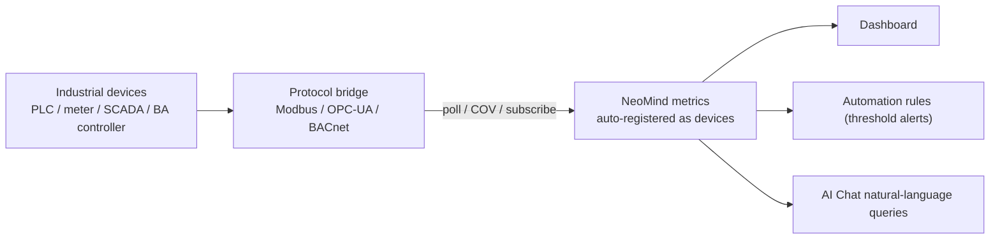

# Industrial Protocol Integration (Modbus / OPC-UA / BACnet)

> Three protocol-bridge extensions for industrial devices — **Modbus**, **OPC-UA**, **BACnet** — sharing one pattern: connect → collect → register as device → feed dashboards.

---

## 1. Solution Overview

Industrial devices speak many protocols; NeoMind uses three independent bridge extensions, each turning its protocol's points into NeoMind device metrics and hiding protocol differences.

| Protocol | Extension | Typical devices | Discovery | Data model |
|---|---|---|---|---|
| **Modbus** | modbus-bridge | PLCs, power meters, temp/humidity sensors, VFDs | Manual (IP/serial + register map) | Registers (Holding/Input/Coils/Discrete) |
| **OPC-UA** | opcua-bridge | SCADA, MES, industrial gateways, OPC-UA servers | Browse address space; nodes auto-register | Nodes (NodeID, any type) |
| **BACnet** | bacnet-bridge | HVAC, fire, access, building controllers | Who-Is/I-Am broadcast | Objects (analog/binary/multi-state) |

**Data Flow** (identical across all three):



---

## 2. Bill of Materials (BOM)

| Item | Spec | Purpose | Required |
|------|------|------|------|
| **NeoMind platform** | v0.9.0+ | Extension host | ✅ |
| **Protocol bridge** | modbus-bridge / opcua-bridge / bacnet-bridge (per device) | Protocol access | ✅ |
| **Industrial devices** | Modbus / OPC-UA / BACnet-capable PLCs, meters, servers, controllers | Data source | ✅ |
| **Network reachable** | NeoMind and devices on the same segment or routable | Communication | ✅ |

> Additional network requirements: Modbus RTU devices connect through a serial port on the host running NeoMind; BACnet/IP discovery relies on UDP 47808 broadcast (see [7.1](#71-extension-level-configuration)).

---

## 3. Install the Extensions

All three bridges are published on the official extension marketplace; the current version is 2.7.x (this guide uses 2.7.7). Install one or more as needed — they are independent of each other.

### 3.1 Install from the Marketplace (Recommended)

1. Open the **Extensions** tab in the left navigation.
2. Click the **Extension Marketplace** button (globe icon) in the toolbar.
3. Search for the extension name — `modbus-bridge`, `opcua-bridge`, or `bacnet-bridge`.
4. Click **Install** on the matching entry; NeoMind automatically picks the `.nep` package matching your platform / ABI, downloads, and installs it.
5. After installation the extension appears in the extension list and starts automatically.

### 3.2 CLI Install (Optional)

```bash
neomind extension market-list                        # Browse marketplace extensions
neomind extension market-install modbus-bridge       # Install from marketplace (latest by default)
neomind extension market-install opcua-bridge --version 2.7.7
neomind extension market-install bacnet-bridge
```

### 3.3 Verify the Installation

- The extension card and the header of the extension detail page should show **Running** (green dot).
- Click the extension card to open the **extension detail page** and confirm the Overview / Config / Commands / Metrics / Logs tabs exist.
- Switch to the **Metrics** tab and confirm extension-level metrics are being reported (e.g. `connected_devices`, `total_poll_errors`).

> How to invoke commands: every operation of the three bridges (adding devices, browsing, read/write, subscribing) is an extension command. Two ways to invoke — fill in parameters on the **Commands** tab of the extension detail page; or call the REST API `POST /api/extensions/:id/command` with body `{"command":"...","args":{...}}`. The `neomind extension` CLI has no command-invocation subcommand. The examples below work with both.

---

## 4. Which Protocol to Choose

| Your device | Choose |
|---|---|
| Power/water meter, temp/humidity, VFD, small PLC | **Modbus** (most common, lightest) |
| SCADA / MES / industrial gateway / device exposing an OPC-UA server | **OPC-UA** (secure, self-describing, browsable) |
| HVAC, fresh air, fire, access, building controller | **BACnet** (building-automation standard) |

> If a device supports several, prefer OPC-UA (security + self-description + browsing).

---

## 5. Modbus (modbus-bridge)

> **The protocol and how the bridge works**: Modbus is the most widely used master/slave protocol in industry — the master (NeoMind) reads and writes the device's raw 16-bit registers by **slave address** (slave_id): holding registers `holding` (FC03 read / FC06, FC16 write), input registers `input` (FC04), coils `coil` (FC01 read / FC05, FC15 write), and discrete inputs `discrete_input` (FC02). Registers carry no unit and no decimal point; real-world quantities (voltage, temperature, energy) come from decoding via `type` / `scale` / `word_order` in the register map (see section 5.4).
>
> modbus-bridge works on a **polling** model: after `add_device`, each device gets its own polling thread that reads every point in the register map at the `poll_interval_ms` cadence, decodes it, and writes it to that device's metrics; the connection is kept alive, with automatic reconnect and a growing `poll_errors` counter on failure. This is periodic master-side sampling — data freshness depends on the polling interval, devices never push on their own.

Supports Modbus TCP and RTU (serial), multi-device independent polling, and register decoding (`int16` / `uint32` / `float32` etc.) with scaling. Added devices are automatically registered as NeoMind devices (type `modbus_device`), and register values are continuously written as device metrics.

### 5.1 Extension-Level Configuration

View / edit on the **Config** tab of the extension detail page:

| Parameter | Type | Default | Range | Description |
|------|------|--------|------|------|
| `defaultPollInterval` | Integer | `5000` | 100–60000 | Default polling interval (ms) when not overridden per device |
| `defaultTimeout` | Integer | `3000` | 100–30000 | Default connection timeout (ms) |

### 5.2 Add a Device + Register Map

1. Open the modbus-bridge extension detail page → **Commands** tab → select `add_device`.
2. Fill the `device` parameter with the device configuration JSON (one command adds one device). Register addresses are **0-based**: holding register 40001 in the PLC manual corresponds to `address: 0`:

```json
{
  "device_id": "power_meter_1",
  "name": "Power Meter 1",
  "mode": "tcp",
  "ip": "192.168.1.50",
  "port": 502,
  "slave_id": 1,
  "poll_interval_ms": 1000,
  "timeout_ms": 3000,
  "registers": [
    { "name": "voltage", "address": 0,  "count": 2, "type": "float32", "register_type": "holding", "scale": 0.1, "unit": "V" },
    { "name": "energy",  "address": 10, "count": 2, "type": "uint32",  "register_type": "holding", "unit": "kWh" }
  ]
}
```

3. On success the command returns:

```json
{ "success": true, "device_id": "power_meter_1", "message": "Device added and polling started" }
```

The extension immediately starts the first polling cycle and registers the device with the platform (device type `modbus_device`). Running `add_device` again with the same `device_id` replaces the old configuration and restarts polling — no duplicate device is created.
4. **RTU devices**: set `mode` to `"rtu"`, drop `ip` / `port`, and provide `serial_port` (e.g. `/dev/ttyUSB0`) and `baud_rate` (default 9600); `slave_id` and baud rate must match the device.

**Device configuration fields (`device` JSON):**

| Field | Type | Required | Default | Description |
|------|------|------|--------|------|
| `device_id` | string | ✅ | — | Device identifier; also used as the platform device ID |
| `name` | string | optional | `device_id` | Display name |
| `mode` | string | ✅ | — | `tcp` / `rtu` |
| `ip` | string | required for TCP | — | Device IP address |
| `port` | integer | optional | `502` | Modbus TCP port |
| `serial_port` | string | required for RTU | — | Serial path (e.g. `/dev/ttyUSB0`) |
| `baud_rate` | integer | optional | `9600` | RTU baud rate |
| `slave_id` | integer | ✅ | — | Slave/unit ID (1–247) |
| `poll_interval_ms` | integer | optional | `5000` | Polling interval (ms) |
| `timeout_ms` | integer | optional | `3000` | Connection timeout (ms) |
| `registers` | array | optional | — | Register map (table below) |

**Register fields (each item of `registers[]`):**

| Field | Type | Required | Default | Description |
|------|------|------|--------|------|
| `name` | string | ✅ | — | Register name; becomes the device metric name |
| `address` | integer | ✅ | — | 0-based start address |
| `count` | integer | optional | `1` | Number of registers to read; `uint32` / `int32` / `float32` span 2 registers, so use 2 |
| `type` | string | ✅ | — | Decode type: `uint16` / `int16` / `uint32` / `int32` / `float32` / `bool` |
| `register_type` | string | optional | `holding` | `holding` (FC03) / `input` (FC04) / `coil` (FC01) / `discrete_input` (FC02) |
| `scale` | number | optional | `0` | Raw value × `scale` (0 = no scaling), e.g. raw 245 × 0.1 → 24.5 °C |
| `unit` | string | optional | — | Unit |
| `word_order` | string | optional | `big` | Word order for two-register types: `big` (hi word first, Modbus standard) / `little` (some PLCs) |

> Protocol limits: a single read fetches at most 125 registers for `holding` / `input` and 2000 for `coil` / `discrete_input`. Entries exceeding the limit are skipped and logged.

> 📷 TODO screenshot | add_device config · suggested path `…/neomind/industrial-protocols/01-modbus-add.png`

### 5.3 Verification (End to End: From Adding to Metrics)

After adding `power_meter_1` per 5.2, a complete verification timeline:

1. **After the first polling cycle** (about 1 second with `poll_interval_ms: 1000`): the **Devices page** shows `power_meter_1` (Modbus Device) carrying `connected` / `poll_errors` / `last_poll_ms` plus one metric per register (`voltage`, `energy`).
2. Run `get_device_data` (arg `{"device_id": "power_meter_1"}`) to check the decoded values:

```json
{
  "success": true,
  "device_id": "power_meter_1",
  "connected": true,
  "poll_errors": 0,
  "last_poll_ms": 12,
  "registers": [
    { "name": "voltage", "value": 220.15,   "unit": "V",   "raw": [17673, 38912] },
    { "name": "energy",  "value": 100000.0, "unit": "kWh", "raw": [1, 34464] }
  ]
}
```

**Where the values come from**: for `voltage` the wire carried two words `0x4509` and `0x9800` → decoded as float32 = 2201.5 → × `scale: 0.1` = **220.15 V**; for `energy` the wire carried `0x0001` and `0x86A0` → joined as uint32 = 100000 (no `scale` set, no scaling) → **100000 kWh**. The `raw` array holds the raw 16-bit register words (shown in decimal) — compare them word by word against the device's register manual when debugging decoding.

3. Run `list_devices` to check device and polling health:

```json
{
  "success": true,
  "count": 1,
  "devices": [
    { "device_id": "power_meter_1", "name": "Power Meter 1", "mode": "tcp", "connected": true,
      "register_count": 2, "poll_interval_ms": 1000, "poll_errors": 0, "last_poll_ms": 12 }
  ]
}
```

4. Extension detail page **Metrics** tab: `connected_devices` ≥ 1 and `total_poll_errors` no longer growing.
5. Metrics enter the platform with DataSourceIds like `device:power_meter_1:voltage` and `device:power_meter_1:energy`, ready to bind to dashboards or rules.

### 5.4 Decoding: Register Words → Engineering Values

The wire only ever carries unsigned 16-bit words; `type` decides how 1–2 words are interpreted, `word_order` decides the join order for two-register types, and `scale` applies one multiplication after decoding:

1. **Single-register types** (`count: 1`): `uint16` is used as-is; `int16` is interpreted as two's complement (e.g. wire value `0xFF9C` = 65436 → interpreted as −100; with `scale: 0.1` that is −10.0 °C, a cold-storage scenario); `bool` maps any non-zero word to 1.
2. **Two-register types** (`uint32` / `int32` / `float32`, `count` must be 2): the two words are joined into 32 bits and then interpreted. Take the voltage register from 5.3, words `0x4509` and `0x9800`:
   - `word_order: big` (default, Modbus standard, hi word first): `(0x4509 << 16) | 0x9800 = 0x45099800` → IEEE 754 float **2201.5** → × `scale 0.1` → **220.15 V**;
   - `word_order: little` (some PLCs put the lo word first): `(0x9800 << 16) | 0x4509 = 0x98004509` → decodes to garbage like −1.66×10⁻²⁴.
   - The uint32 `energy` works the same way: `0x0001`, `0x86A0` → big join `0x000186A0` = 100000 kWh; if the device is actually little and you read it as big, you get `0x86A00001` ≈ 2.55×10⁹ — an astronomically wrong number.

   **When readings look absurd (huge or tiny negative), suspect `word_order` and `count` first.**
3. **scale**: `decoded value × scale`; `scale: 0` (default) means no scaling. Common conversions: temperature raw 245 × 0.1 → 24.5 °C; voltage raw 2301 × 0.001 → 2.301 V. The multiplication happens after type decoding — float32 values can be scaled too.

### 5.5 Read / Write Control

- Read: `read_registers(device_id, address, count)` (on-demand read; `register_type` accepts `holding` (default) / `input`, max 125 registers per call).
- Write: `write_register(device_id, address, value)`, `write_registers(...values[])`, `write_coil(device_id, address, value)`, `write_coils(...values[])` — e.g. remote breaker close or setpoint changes.
- Operations: `update_polling` to change the poll interval, `set_register_map` to update the register map (polling restarts after replacement), `remove_device` to remove a device and unregister it from the platform.

**Read holding registers** — call arguments:

```json
{ "device_id": "power_meter_1", "address": 0, "count": 2 }
```

Return:

```json
{ "success": true, "device_id": "power_meter_1", "address": 0, "register_type": "holding", "count": 2, "data": [17673, 38912] }
```

> ⚠️ The `data` returned by `read_registers` consists of **raw 16-bit words** with no type decoding or scaling (decoding only happens in the polling cycle). For engineering values use the `value` from `get_device_data` or the device metrics; keep `data` for cross-checking against the register manual.

**Write a single holding register** — call arguments:

```json
{ "device_id": "power_meter_1", "address": 100, "value": 250 }
```

Return:

```json
{ "success": true, "device_id": "power_meter_1", "address": 100, "value": 250, "message": "Register written successfully" }
```

Write limits: `write_register` `value` must be 0–65535; `write_registers` accepts at most 123 values per call; `write_coil` `value` takes the strings `"true"` / `"false"`; `write_coils` takes a boolean array, at most 1968 per call.

Fill in parameters on the **Commands** tab, or call the REST API to write a single holding register:

```bash
curl -X POST -H "X-API-Key: $NEOMIND_API_KEY" \
     -H "Content-Type: application/json" \
     -d '{"command":"write_register","args":{"device_id":"power_meter_1","address":100,"value":250}}' \
     http://localhost:9375/api/extensions/modbus-bridge/command
```

---

## 6. OPC-UA (opcua-bridge)

> **The protocol and how the bridge works**: OPC-UA is the information-interchange standard of industrial automation; its biggest difference from Modbus is that it is **self-describing** — the server organizes data into an address-space tree where every node has a NodeID, browse name, and data type, so clients can discover points by browsing like a filesystem instead of transcribing register maps by hand; and it adds signing / encryption plus username/password authentication at the transport layer.
>
> opcua-bridge works on a **subscription** model: `connect` establishes a session → `browse` walks the address space (browsed nodes enter the local cache and auto-register as NeoMind devices) → `subscribe` creates data-change subscriptions for the nodes you care about. Once subscribed, any change in a node value (sampled at `interval_ms`) is landed on that node device's metrics — no need to poll every point, and no chat/notification-center messages are produced; updates appear as **metrics** on the Devices page and dashboards.

Connect to any OPC-UA server (`opc.tcp://`) with security mode `none` / `sign` / `sign_and_encrypt` and optional username/password, with automatic reconnect. **Browsed nodes auto-register as NeoMind devices (type `opcua_node`) and continuously publish metrics** — no per-point configuration needed.

### 6.1 Extension-Level Configuration

| Parameter | Type | Default | Range | Description |
|------|------|--------|------|------|
| `sessionTimeout` | Integer | `30000` | 1000–300000 | OPC-UA session timeout (ms) |
| `autoReconnect` | String | `"true"` | `true` / `false` | Reconnect automatically on connection loss |

### 6.2 Connect (and Choosing a Security Mode)

1. Open the opcua-bridge extension detail page → **Commands** tab → run `connect`:

```json
{ "server_url": "opc.tcp://192.168.1.60:4840", "security_mode": "sign_and_encrypt", "username": "op", "password": "***" }
```

After a successful connect, **the server itself is registered as a device too** (type `opcua_server`; ID is derived from the sanitized URL — `:` `/` `.` replaced with `_`, e.g. `opcua-server-opc_tcp___192_168_1_60_4840`) and carries the connection-level metrics; on disconnect it reconnects automatically per `autoReconnect`.

2. How to pick the security mode (it must match the **server-side policy exactly**, otherwise the server rejects the session):

| `security_mode` | Message protection | When to use | Prerequisites |
|---|---|---|---|
| `none` (default) | Plaintext, unsigned | Isolated / controlled test segments, demos | None |
| `sign` | Signed (tamper-proof), still plaintext | Trusted intranets needing integrity only | Client certificate trusted by the server |
| `sign_and_encrypt` | Signed + encrypted | Production, cross-segment transport | Server-trusted client certificate + credentials |

> Certificates and credentials follow the server's security policy: for `sign` / `sign_and_encrypt` request a client certificate from the OPC-UA server administrator and have it trusted; `username` / `password` are accounts created in the server's user management. Prefer `sign_and_encrypt` whenever possible; only fall back to `none` when the server exclusively offers a None policy (a common vendor debug default — consider enabling a security policy on the server after evaluation).

### 6.3 Browse the Address Space and Auto-Registration

Run `browse`: `node_id` defaults to the root `i=84` (the Objects folder is `i=85` — recommended starting point for business points); `max_depth` defaults to 1 level, up to 10. The return JSON looks like:

```json
{
  "success": true,
  "browse_from": "i=85",
  "max_depth": 1,
  "nodes": [
    { "node_id": "ns=2;s=Temperature", "browse_name": "Temperature", "display_name": "Temperature Sensor", "node_class": "Variable", "data_type": "Float" },
    { "node_id": "ns=2;s=Pressure",    "browse_name": "Pressure",    "display_name": "Pressure Sensor",    "node_class": "Variable", "data_type": "Float" }
  ]
}
```

- Every node carries `node_id` / `browse_name` / `display_name` / `node_class` (`Object` / `Variable` etc.); variable nodes also carry `data_type`.
- Browsed nodes are **simultaneously** placed into the local node cache (queryable via `list_nodes` / `get_node`) and auto-registered as NeoMind devices — this is where "no per-point configuration" comes from. Naming rule: `=`, `;`, `:` and spaces in the node ID are replaced with `_`, prefixed with `opcua-`:

| Node NodeID | Generated device ID | Metric DataSourceId |
|---|---|---|
| `i=2258` | `opcua-i_2258` | `device:opcua-i_2258:value` |
| `ns=2;s=Temperature` | `opcua-ns_2_s_Temperature` | `device:opcua-ns_2_s_Temperature:value` |

Node IDs use standard OPC-UA notation: `i=2258` (numeric) or `ns=2;s=Temperature` (namespaced string).

> 📷 TODO screenshot | browse address space · suggested path `…/neomind/industrial-protocols/02-opcua-browse.png`

### 6.4 Subscribe to Data Changes

Run `subscribe`: `node_ids` accepts a JSON array or a comma-separated string; `interval_ms` defaults to 1000 (range 50–60000).

```json
{ "node_ids": ["ns=2;s=Temperature", "ns=2;s=Pressure"], "interval_ms": 500 }
```

Return:

```json
{ "success": true, "subscription_id": "sub-9f3c1a2e-…", "node_ids": ["ns=2;s=Temperature", "ns=2;s=Pressure"], "interval_ms": 500 }
```

Re-running `subscribe` for the same set of nodes does not create a duplicate — it returns "Subscription already exists for these nodes".

**What a subscription push looks like** — metric updates, not messages: when a node value changes, the bridge stores the new value together with `quality` (e.g. `Good`) and `source_timestamp` (server source timestamp) into the node cache, and once per metric cycle writes the three values to the node device (`device_metrics_write`):

```json
{ "device_id": "opcua-ns_2_s_Temperature", "metric": "value", "value": 43.0, "timestamp": 1760000000000 }
```

In other words, what you see on the Devices page / dashboards is a new data point on the `device:opcua-ns_2_s_Temperature:value` metric; automation rules trigger on it as usual. No "OPC-UA message" ever reaches the notification center.

### 6.5 Verification

- Run `get_status`:

```json
{ "success": true, "connected": true, "nodes_count": 12, "subscriptions_count": 2, "total_commands": 9 }
```

- Extension detail page **Metrics** tab: `connected` = 1, `nodes_count` grows as you browse, `subscriptions_count` equals the number of active subscriptions.
- The **Devices page** shows `opcua-<node-id>` devices; each node device carries three metrics: `value` / `quality` / `source_timestamp`.
- Metrics enter the platform with a DataSourceId like `device:opcua-ns_2_s_Temperature:value`.
- The `read` command (arg `node_ids`) returns current node values so you can immediately verify collection.

### 6.6 Read / Write Control

**Bulk-read current values** — `read(node_ids)` returns:

```json
{
  "success": true,
  "results": [
    { "node_id": "ns=2;s=Temperature", "value": 42.5, "quality": "Good" },
    { "node_id": "ns=2;s=Pressure",    "value": 101.3, "quality": "Good" }
  ]
}
```

> `read` returns the latest value held in the node cache (updated by browse / subscribe) — prefer subscriptions to keep data fresh.

**Write a node value**: `write(node_id, value, data_type)` — `value` is a string; `data_type` is optional (e.g. `Float`, `Int32`) to specify the type explicitly.

> ⚠️ **In the current open-source build (2.7.x), `write` is a protective stub**: the command returns an error and does not write to the server — preventing accidental writes to industrial servers from the bridge layer. For write control on OPC-UA points, use the device's own HMI / SCADA. Reads and subscriptions are unaffected.

- Unsubscribe / disconnect: `unsubscribe(node_ids)` (`node_ids` format same as `subscribe`), `disconnect` (clears the node cache and subscriptions).
- Helper commands: `list_nodes` / `get_node(node_id)` show cached node details (including `value` / `quality` / `source_timestamp`); `list_subscriptions` lists all active subscriptions (`subscription_id` / `node_ids` / `interval_ms` / `active`).

REST example (read two nodes):

```bash
curl -X POST -H "X-API-Key: $NEOMIND_API_KEY" \
     -H "Content-Type: application/json" \
     -d '{"command":"read","args":{"node_ids":["i=2258","ns=2;s=Temperature"]}}' \
     http://localhost:9375/api/extensions/opcua-bridge/command
```

---

## 7. BACnet (bacnet-bridge)

> **The protocol and how the bridge works**: BACnet is the building-automation standard protocol (HVAC, fresh air, lighting, fire, access control). Its data model is **objects**: each device is identified by a device instance number (0–4194303) and carries a set of objects (e.g. `analog_input:1`, `binary_output:1`), each with properties — the most used being `present_value` (property 85). Control writes never touch the present value directly; they write into the object's internal **16-level priority array** (lower number = higher priority, see 7.4).
>
> bacnet-bridge runs two kinds of background tasks on UDP 47808: one **listener thread** that receives I-Am responses and COV notifications, plus one **polling thread** per added device that periodically reads point present values. Polling is enough for slow-changing points; COV subscription is the choice for second-level responsiveness — the device pushes on every change, more real-time and lighter than polling.

BACnet/IP over UDP (default 47808) with Who-Is/I-Am discovery, property reads, control writes, and COV subscriptions. Discovered / added devices auto-register as NeoMind devices (type `bacnet_device`, ID `bacnet_<device_id>`).

### 7.1 Extension-Level Configuration

| Parameter | Type | Default | Range | Description |
|------|------|--------|------|------|
| `bindAddress` | String | `0.0.0.0` | — | Local IP to bind for BACnet/IP |
| `bindPort` | Integer | `47808` | 1–65535 | UDP port for BACnet/IP |
| `defaultTimeoutMs` | Integer | `3000` | 100–30000 | Default request timeout (ms) |
| `pollIntervalMs` | Integer | `10000` | 1000–60000 | Default polling interval (ms) |

> **Deployment requirement**: Who-Is/I-Am uses UDP broadcast. The network must allow sending/receiving UDP 47808 (including broadcast); broadcast does not cross routers, so NeoMind and the BACnet devices should be on the same Layer-2 network, or interconnected via a network that forwards broadcast.

### 7.2 Discover Devices + Add Polled Points

1. Open the bacnet-bridge extension detail page → **Commands** tab → run `discover` (optionally `low_id` / `high_id` to bound the device-instance range, default 0–4194303; `timeout_ms` defaults to 3000 as the wait window). The extension sends a Who-Is broadcast to `255.255.255.255:47808` and collects I-Am responses during the window (up to 500 devices). The return JSON:

```json
{
  "success": true,
  "count": 2,
  "devices": [
    { "device_id": 100, "ip": "192.168.1.100", "port": 47808, "vendor_id": 5,   "max_apdu": 1476 },
    { "device_id": 201, "ip": "192.168.1.101", "port": 47808, "vendor_id": 15,  "max_apdu": 480 }
  ]
}
```

Field meanings: `device_id` is the BACnet device instance number (configured on the device, unique network-wide); `vendor_id` is the ASHRAE-assigned vendor number (numeric — useful for identifying the brand); `max_apdu` is the device's maximum APDU size. **Note: discovery is not registration** — discovered devices enter the internal device table (visible in `list_devices`, `connected: true`), but only devices added via `add_device` are registered into the NeoMind platform and produce metrics.

2. Run `list_devices` to see discovered devices, and `get_device` / `list_objects` to inspect a device's objects (analog / binary / multi-state input / output / value; each item carries `object_type` / `instance` / `present_value` / `units` / `cov_subscribed`).
3. Run `add_device` to register a device manually and start polling selected points (`device` parameter):

```json
{
  "device_id": 100,
  "ip": "192.168.1.100",
  "port": 47808,
  "name": "HVAC Controller",
  "poll_interval_ms": 5000,
  "objects": [
    { "object_type": "analog_input",  "instance": 1, "name": "Temperature", "units": "degC" },
    { "object_type": "analog_input",  "instance": 2, "name": "Humidity", "units": "%" },
    { "object_type": "binary_output", "instance": 1, "name": "Fan Status" }
  ]
}
```

It returns `{"success": true, "device_id": 100, "ip": "192.168.1.100", "port": 47808, "message": "Device added and polling started"}` — the device is registered into the platform as `bacnet_100`, and the polling thread reads each object's `present_value` into metrics every `poll_interval_ms`.

> 📷 TODO screenshot | Who-Is discovery · suggested path `…/neomind/industrial-protocols/03-bacnet-discover.png`

### 7.3 Verification

- Run `get_status` for a global view:

```json
{
  "success": true,
  "status": {
    "total_devices": 1, "connected_devices": 1,
    "total_cov_subscriptions": 0, "active_cov_subscriptions": 0,
    "listener_running": true, "bind_port": 47808
  }
}
```

- Extension detail page **Metrics** tab: `connected_devices` ≥ 1; after COV subscriptions, `cov_subscriptions` grows.
- The **Devices page** shows `bacnet_100` (BACnet Device). Each polled object's present value becomes a device metric named `<object_type>_<instance>` (e.g. `analog_input_1`, `binary_output_1`), alongside `connected` / `objects_count` / `last_seen`.
- Metrics enter the platform with a DataSourceId like `device:bacnet_100:analog_input_1`.
- The `list_objects` command lets you confirm that present values refresh and `cov_subscribed` gets set.

### 7.4 Read Properties / Subscribe COV / Write Control

> Prerequisite: the target device instance must already be in the internal device table (run `discover` or `add_device` first), otherwise the command fails with `Device not found: …`.

**Read a property** — `read_property` call arguments (`object_type` defaults to `analog_input`; `property_id` defaults to 85; common values: 85 = present_value, 77 = object_name, 28 = description, 117 = units):

```json
{ "device_id": 100, "object_type": "analog_input", "instance": 1, "property_id": 85 }
```

Return:

```json
{ "success": true, "device_id": 100, "object_type": "analog_input", "instance": 1, "property_id": 85, "value": 23.5 }
```

The `value` type follows the property: present values are numeric (`true` / `false` for binary objects, a state number for multi-state), while text properties like `object_name` (77) return strings. If the device refuses the read you get `BACnet error: class=…, code=…`. To read several properties in one request use `read_property_multiple` (`properties` defaults to `[85]`):

```json
{ "device_id": 100, "objects": [
  { "object_type": "analog_input", "instance": 1, "properties": [85, 77] },
  { "object_type": "analog_input", "instance": 2 }
] }
```

Return:

```json
{ "success": true, "device_id": 100, "count": 3, "values": [
  { "object_type": "analog_input", "instance": 1, "property_id": 85, "value": 23.5 },
  { "object_type": "analog_input", "instance": 1, "property_id": 77, "value": "Room Temp" },
  { "object_type": "analog_input", "instance": 2, "property_id": 85, "value": 41.2 }
] }
```

**Subscribe to COV** — `subscribe_cov(device_id, object_type, instance)`, `lifetime` defaults to 0 (indefinite, in seconds), `confirmed` defaults to `true` (device must acknowledge each notification):

```json
{ "device_id": 100, "object_type": "analog_input", "instance": 1 }
```

Return:

```json
{ "success": true, "subscriber_id": 1, "device_id": 100, "object_type": "analog_input", "instance": 1, "lifetime": 0, "confirmed": true, "message": "COV subscription active" }
```

**What you receive after a COV subscription** — again metric updates, not messages: when the point changes, the device pushes a COV notification (subscriber ID + object identifier + list of property values); the bridge's background listener parses it, updates the point's `present_value` in the internal object cache, and sets `cov_subscribed = true`; the value then flows to the platform as the `device:bacnet_100:analog_input_1` metric — you see the present value refresh on the Devices page / dashboards and rules trigger as usual. `list_objects` shows the object's refreshed `present_value` and `cov_subscribed: true`, and `get_status` counts it in `active_cov_subscriptions`. To cancel, call `unsubscribe_cov` with the `subscriber_id` returned by `subscribe_cov`.

**Write control** — `write_property(device_id, object_type, instance, value, priority)`. **Only output / value objects are writable** (`analog_output`, `binary_value`, etc.; inputs are read-only). Always pass `value` as a string; the bridge infers the type in order: `"true"` / `"false"` → boolean (use for binary objects); pure integer → unsigned integer; decimal → real; anything else → string. Integer writes to analog output / value are coerced to REAL per ASHRAE 135-2020.

**priority and priority-array semantics**: a write does not set `present_value` directly — it writes one level of the object's 16-level priority array (1 highest, 16 lowest), and `present_value` always equals the highest-priority non-empty level. Common level conventions:

| Level | Conventional use |
|---|---|
| 1 | Life safety (highest — do not use) |
| 8 | Manual operator / maintenance writes (used in this extension's examples) |
| 16 | Lowest (BACnet default level — scheduled / default writes) |

Levels 2–15 follow site conventions. When `priority` is **omitted** the request carries no priority field and the device writes at level 16 (default); passing 8 writes level 8 explicitly. Example: write setpoint 21.0 to `analog_value:5` —
- `{..., "value": "21.0", "priority": 8}` → level 8 = 21.0; if no higher level is occupied, `present_value` becomes 21.0;
- `{..., "value": "21.0"}` (omitted) → level 16 = 21.0; **if someone previously wrote 19.0 at priority 8 and never released it, `present_value` stays 19.0** — the write command succeeds but the present value doesn't move, the most classic BACnet pitfall.

REST example (switch a fan; binary objects take `"true"` / `"false"`):

```bash
curl -X POST -H "X-API-Key: $NEOMIND_API_KEY" \
     -H "Content-Type: application/json" \
     -d '{"command":"write_property","args":{"device_id":100,"object_type":"binary_output","instance":1,"value":"true","priority":8}}' \
     http://localhost:9375/api/extensions/bacnet-bridge/command
```

---

## 8. Downstream Usage

Metrics from all three bridges are consumed identically.

**Unified DataSourceId**: every metric enters the platform as `device:<device-id>:<metric-name>`; dashboards, rules, and AI Chat all reference this format:

| Bridge | Device ID | Metric | DataSourceId |
|------|---------|--------|--------------|
| modbus-bridge | `power_meter_1` | `voltage` | `device:power_meter_1:voltage` |
| opcua-bridge | `opcua-ns_2_s_Temperature` | `value` | `device:opcua-ns_2_s_Temperature:value` |
| bacnet-bridge | `bacnet_100` | `analog_input_1` | `device:bacnet_100:analog_input_1` |

- **Dashboard**: bind the DataSourceIds above to metric cards / line charts to monitor voltage, temperature, energy, HVAC status, etc.
- **Automation rules**: set thresholds on any DataSourceId to trigger alerts or control writes ([Automation Rules](../user-guide/7-automation-rules.md)). Example "power-meter voltage over-limit alert" rule JSON:

```json
{
  "name": "Power meter voltage over-limit alert",
  "trigger": { "trigger_type": "data_change" },
  "condition": {
    "condition_type": "comparison",
    "source": "device:power_meter_1:voltage",
    "operator": "greater_than",
    "threshold": 250
  },
  "actions": [
    { "type": "notify", "message": "Power meter 1 voltage {value}V exceeds 250V", "severity": "critical" }
  ]
}
```

- **AI Chat**: natural-language queries like "voltage trend of meter 1 over the last 24h" or "what's the current status of AC unit 3".

### 8.1 End-to-End Mini Scenario: From the Meter to an Alert Notification

Wire the 5.3 power meter all the way to a notification; every value has a traceable origin:

1. **Connect**: per 5.2, `add_device` adds `power_meter_1` with `voltage` = holding 0–1, `float32`, `scale: 0.1`.
2. **Confirm collection**: after the first polling cycle, `get_device_data` shows `voltage = 220.15` (raw `[17673, 38912]` = `0x4509 0x9800` → 2201.5 × 0.1); the platform now has the `device:power_meter_1:voltage` metric, gaining one data point every second.
3. **Create the rule**: on the automation-rules page create the rule JSON above. How each field maps to data:
   - `trigger.trigger_type: data_change` — every new `voltage` report (every second) triggers one condition evaluation;
   - `condition.source: device:power_meter_1:voltage` — the DataSourceId assembled from device ID `power_meter_1` (the `device_id` in add_device) + metric name `voltage` (the `name` in the register map);
   - `condition.operator / threshold` — compare the metric's latest value against 250 (the business safety limit in this example);
   - the `{value}` placeholder in `actions[0].message` is replaced with the actual value at trigger time.
4. **Trigger**: voltage spikes to 253.4 V → 253.4 > 250 matches → a notification with `severity: critical` is raised, the message renders as "Power meter 1 voltage 253.4V exceeds 250V", lands in the notification center, and can be forwarded through data-push channels (e.g. webhook); once voltage falls back below 250 nothing fires, and the metric curve and notification history remain queryable in the platform.

> 📷 TODO screenshot | Industrial-metrics dashboard · suggested path `…/neomind/industrial-protocols/04-dashboard.png`

---

## 9. Troubleshooting

Start with three tools: the extension detail page's **Logs** tab for process output, the **Metrics** tab for error counters, and the relevant commands (`list_devices` / `get_status`) for device state. Common failures:

| Symptom | Likely cause | Solution |
|----------|----------|----------|
| Modbus device `connected: false`, `total_poll_errors` keeps growing | IP / port unreachable; wrong `slave_id` (1–247); `timeout_ms` too small; RTU serial path or baud rate mismatched | First verify connectivity from the host with `ping` / `telnet ip port`; check the slave address; raise `timeout_ms` (default 3000); for RTU verify `serial_port` and `baud_rate`. The extension reconnects automatically — `connected` returns to `true` once the link recovers |
| float32 / uint32 values read via `read_registers` look wrong | Two-register type has `count` < 2, or `word_order` doesn't match the device | Set `count` to 2 for `uint32` / `int32` / `float32`; if the PLC is low-word-first set `word_order` to `little` (default `big`) |
| `read_registers` returns arrays like `[17673, 38912]` instead of engineering values like 220.15 | `read_registers` returns **raw 16-bit register words** by protocol design; decoding and scaling only happen in the polling cycle | For engineering values use the `value` from `get_device_data` or the device metrics; keep `data` / `raw` for cross-checking against the register manual |
| OPC-UA `connect` fails or drops repeatedly (security-mode rejection, expired session) | `security_mode` mismatched with the server's security policy; `sign` / `sign_and_encrypt` missing certificate or credentials; `sessionTimeout` too short | Match `security_mode` (`none` / `sign` / `sign_and_encrypt`) to the server policy; provide correct credentials or certificates; raise `sessionTimeout` (default 30000 ms); keep `autoReconnect = true` |
| OPC-UA `write` returns an error and the value is not written | In the current 2.7.x open-source build `write` is a protective refusal (prevents accidental writes to industrial servers) | Expected behavior; perform writes from the device's own HMI / SCADA. Reads and subscriptions are unaffected |
| No data after OPC-UA subscribe | `interval_ms` outside 50–60000; the node value simply isn't changing; subscription never established | Check `subscriptions_count` and `list_subscriptions`; bring `interval_ms` back into range; use `read` first to confirm the node is readable |
| BACnet `discover` returns nothing | Firewall blocks UDP 47808; broadcast unreachable across segments; wrong `bindAddress` | Allow UDP 47808 in both directions (including broadcast); keep NeoMind and the devices on the same Layer-2 network (broadcast doesn't route); leave `bindAddress` at `0.0.0.0`; capture packets to confirm Who-Is goes out and I-Am comes back |
| BACnet `read_property` / `write_property` fails with `Device not found: …` | The target device instance is not in the internal device table (never discovered or added) | Run `discover` first (or `add_device` with a known IP), then read/write |
| BACnet `write_property` succeeds but `present_value` doesn't change | The written priority level is outranked by an occupied higher-priority level (e.g. an old value at level 8 while this write defaulted to level 16) | Raise the write `priority` (lower number = higher priority; 8 is the recommended default); or release the stale value occupying the higher level |
| No notifications after BACnet `subscribe_cov` | The point doesn't support COV or its value never changes; it was unsubscribed | Fall back to periodic polling via `add_device` for points without COV support; cancellation requires the `subscriber_id` returned by `subscribe_cov` — after re-subscribing, verify `active_cov_subscriptions` in `get_status` |

---

## 10. Appendix

### Related docs

- [Extension Management](../user-guide/9-extensions.md)
- [Automation Rules](../user-guide/7-automation-rules.md)
- [Data Push](../user-guide/7c-data-push.md)
- [AI Chat](../user-guide/5-ai-chat.md)
- [LoRaWAN + Home Assistant Integration](./10-lorawan-homeassistant.md)
- modbus-bridge / opcua-bridge / bacnet-bridge extension READMEs

---

*Last updated: 2026-09-09*
