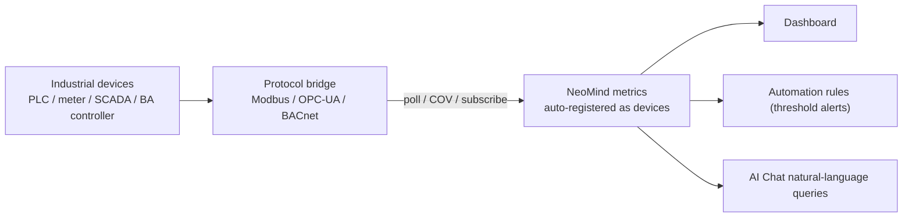

# Industrial Protocol Integration (Modbus / OPC-UA / BACnet)

> Three protocol-bridge extensions for industrial devices — **Modbus**, **OPC-UA**, **BACnet** — sharing one pattern: connect → collect → register as device → feed dashboards.

---

## 1. Solution Overview

Industrial devices speak many protocols; NeoMind uses three independent bridge extensions, each turning its protocol's points into NeoMind device metrics and hiding protocol differences.

| Protocol | Extension | Typical devices | Discovery | Data model |
|---|---|---|---|---|
| **Modbus** | modbus-bridge | PLCs, power meters, temp/humidity sensors, VFDs | Manual (IP/serial + register map) | Registers (Holding/Input/Coils/Discrete) |
| **OPC-UA** | opcua-bridge | SCADA, MES, industrial gateways, OPC-UA servers | Browse address space; nodes auto-register | Nodes (NodeID, any type) |
| **BACnet** | bacnet-bridge | HVAC, fire, access, building controllers | Who-Is/I-Am broadcast | Objects (analog/binary/multi-state) |

**Data Flow** (identical across all three):



---

## 2. Bill of Materials (BOM)

| Item | Spec | Purpose | Required |
|------|------|------|------|
| **NeoMind platform** | v0.9.0+ | Extension host | ✅ |
| **Protocol bridge** | modbus-bridge / opcua-bridge / bacnet-bridge (per device) | Protocol access | ✅ |
| **Industrial devices** | Modbus / OPC-UA / BACnet-capable PLCs, meters, servers, controllers | Data source | ✅ |
| **Network reachable** | NeoMind and devices on the same segment or routable | Communication | ✅ |

> Additional network requirements: Modbus RTU devices connect through a serial port on the host running NeoMind; BACnet/IP discovery relies on UDP 47808 broadcast (see [7.1](#71-extension-level-configuration)).

---

## 3. Install the Extensions

All three bridges are published on the official extension marketplace; the current version is 2.7.x (this guide uses 2.7.7). Install one or more as needed — they are independent of each other.

### 3.1 Install from the Marketplace (Recommended)

1. Open the **Extensions** tab in the left navigation.
2. Click the **Extension Marketplace** button (globe icon) in the toolbar.
3. Search for the extension name — `modbus-bridge`, `opcua-bridge`, or `bacnet-bridge`.
4. Click **Install** on the matching entry; NeoMind automatically picks the `.nep` package matching your platform / ABI, downloads, and installs it.
5. After installation the extension appears in the extension list and starts automatically.

### 3.2 CLI Install (Optional)

```bash
neomind extension market-list                        # Browse marketplace extensions
neomind extension market-install modbus-bridge       # Install from marketplace (latest by default)
neomind extension market-install opcua-bridge --version 2.7.7
neomind extension market-install bacnet-bridge
```

### 3.3 Verify the Installation

- The extension card and the header of the extension detail page should show **Running** (green dot).
- Click the extension card to open the **extension detail page** and confirm the Overview / Config / Commands / Metrics / Logs tabs exist.
- Switch to the **Metrics** tab and confirm extension-level metrics are being reported (e.g. `connected_devices`, `total_poll_errors`).

> How to invoke commands: every operation of the three bridges (adding devices, browsing, read/write, subscribing) is an extension command. Two ways to invoke — fill in parameters on the **Commands** tab of the extension detail page; or call the REST API `POST /api/extensions/:id/command` with body `{"command":"...","args":{...}}`. The `neomind extension` CLI has no command-invocation subcommand. The examples below work with both.

---

## 4. Which Protocol to Choose

| Your device | Choose |
|---|---|
| Power/water meter, temp/humidity, VFD, small PLC | **Modbus** (most common, lightest) |
| SCADA / MES / industrial gateway / device exposing an OPC-UA server | **OPC-UA** (secure, self-describing, browsable) |
| HVAC, fresh air, fire, access, building controller | **BACnet** (building-automation standard) |

> If a device supports several, prefer OPC-UA (security + self-description + browsing).

---

## 5. Modbus (modbus-bridge)

Supports Modbus TCP and RTU (serial), multi-device independent polling, and register decoding (`int16` / `uint32` / `float32` etc.) with scaling. Added devices are automatically registered as NeoMind devices (type `modbus_device`), and register values are continuously written as device metrics.

### 5.1 Extension-Level Configuration

View / edit on the **Config** tab of the extension detail page:

| Parameter | Type | Default | Range | Description |
|------|------|--------|------|------|
| `defaultPollInterval` | Integer | `5000` | 100–60000 | Default polling interval (ms) when not overridden per device |
| `defaultTimeout` | Integer | `3000` | 100–30000 | Default connection timeout (ms) |

### 5.2 Add a Device + Register Map

1. Open the modbus-bridge extension detail page → **Commands** tab → select `add_device`.
2. Fill the `device` parameter with the device configuration JSON (one command adds one device). Register addresses are **0-based**: holding register 40001 in the PLC manual corresponds to `address: 0`:

```json
{
  "device_id": "power_meter_1",
  "name": "Power Meter 1",
  "mode": "tcp",
  "ip": "192.168.1.50",
  "port": 502,
  "slave_id": 1,
  "poll_interval_ms": 1000,
  "timeout_ms": 3000,
  "registers": [
    { "name": "voltage", "address": 0,  "count": 2, "type": "float32", "register_type": "holding", "scale": 0.1, "unit": "V" },
    { "name": "energy",  "address": 10, "count": 2, "type": "uint32",  "register_type": "holding", "unit": "kWh" }
  ]
}
```

3. On success the command returns `{"success": true, "device_id": "power_meter_1"}`; the extension immediately starts polling at `poll_interval_ms` and registers the device with the platform.
4. **RTU devices**: set `mode` to `"rtu"`, drop `ip` / `port`, and provide `serial_port` (e.g. `/dev/ttyUSB0`) and `baud_rate` (default 9600); `slave_id` and baud rate must match the device.

**Device configuration fields (`device` JSON):**

| Field | Type | Required | Default | Description |
|------|------|------|--------|------|
| `device_id` | string | ✅ | — | Device identifier; also used as the platform device ID |
| `name` | string | optional | `device_id` | Display name |
| `mode` | string | ✅ | — | `tcp` / `rtu` |
| `ip` | string | required for TCP | — | Device IP address |
| `port` | integer | optional | `502` | Modbus TCP port |
| `serial_port` | string | required for RTU | — | Serial path (e.g. `/dev/ttyUSB0`) |
| `baud_rate` | integer | optional | `9600` | RTU baud rate |
| `slave_id` | integer | ✅ | — | Slave/unit ID (1–247) |
| `poll_interval_ms` | integer | optional | `5000` | Polling interval (ms) |
| `timeout_ms` | integer | optional | `3000` | Connection timeout (ms) |
| `registers` | array | optional | — | Register map (table below) |

**Register fields (each item of `registers[]`):**

| Field | Type | Required | Default | Description |
|------|------|------|--------|------|
| `name` | string | ✅ | — | Register name; becomes the device metric name |
| `address` | integer | ✅ | — | 0-based start address |
| `count` | integer | optional | `1` | Number of registers to read; `uint32` / `int32` / `float32` span 2 registers, so use 2 |
| `type` | string | ✅ | — | Decode type: `uint16` / `int16` / `uint32` / `int32` / `float32` / `bool` |
| `register_type` | string | optional | `holding` | `holding` (FC03) / `input` (FC04) / `coil` (FC01) / `discrete_input` (FC02) |
| `scale` | number | optional | `0` | Raw value × `scale` (0 = no scaling), e.g. raw 245 × 0.1 → 24.5 °C |
| `unit` | string | optional | — | Unit |
| `word_order` | string | optional | `big` | Word order for two-register types: `big` (hi word first, Modbus standard) / `little` (some PLCs) |

> Protocol limits: a single read fetches at most 125 registers for `holding` / `input` and 2000 for `coil` / `discrete_input`. Entries exceeding the limit are skipped and logged.

> 📷 TODO screenshot | add_device config · suggested path `…/neomind/industrial-protocols/01-modbus-add.png`

### 5.3 Verification

- The **Devices page** shows `power_meter_1` (Modbus Device) carrying `connected` / `poll_errors` / `last_poll_ms` plus one metric per register (`voltage`, `energy`).
- Extension detail page **Metrics** tab: `connected_devices` ≥ 1 and `total_poll_errors` no longer growing.
- The `get_device_data` command (arg `device_id`) returns the latest value of every register; `list_devices` shows `connected: true`.
- Metrics enter the platform with DataSourceIds like `device:power_meter_1:voltage` and `device:power_meter_1:energy`.

### 5.4 Read / Write Control

- Read: `read_registers(device_id, address, count)` (on-demand holding read, max 125 registers per call).
- Write: `write_register(device_id, address, value)`, `write_registers(...values[])`, `write_coil(device_id, address, value)`, `write_coils(...values[])` — e.g. remote breaker close or setpoint changes.
- Operations: `update_polling` to change the poll interval, `set_register_map` to update the register map, `remove_device` to remove a device and unregister it from the platform.

Fill in parameters on the **Commands** tab, or call the REST API to write a single holding register:

```bash
curl -X POST -H "X-API-Key: $NEOMIND_API_KEY" \
     -H "Content-Type: application/json" \
     -d '{"command":"write_register","args":{"device_id":"power_meter_1","address":100,"value":250}}' \
     http://localhost:9375/api/extensions/modbus-bridge/command
```

---

## 6. OPC-UA (opcua-bridge)

Connect to any OPC-UA server (`opc.tcp://`) with security mode `none` / `sign` / `sign_and_encrypt` and optional username/password, with automatic reconnect. **Browsed nodes auto-register as NeoMind devices (type `opcua_node`) and continuously publish metrics** — no per-point configuration needed.

### 6.1 Extension-Level Configuration

| Parameter | Type | Default | Range | Description |
|------|------|--------|------|------|
| `sessionTimeout` | Integer | `30000` | 1000–300000 | OPC-UA session timeout (ms) |
| `autoReconnect` | String | `"true"` | `true` / `false` | Reconnect automatically on connection loss |

### 6.2 Connect + Browse + Subscribe

1. Open the opcua-bridge extension detail page → **Commands** tab → run `connect`:

```json
{ "server_url": "opc.tcp://192.168.1.60:4840", "security_mode": "sign_and_encrypt", "username": "op", "password": "***" }
```

2. Run `browse` to walk the address space: `node_id` defaults to the root `i=84` (Objects is `i=85`); `max_depth` defaults to 1 level, up to 10. Browsed nodes auto-register as devices.
3. Run `subscribe` for data-change notifications: `node_ids` accepts a JSON array (`["i=2258", "ns=2;s=Temp"]`) or a comma-separated string; `interval_ms` defaults to 1000 (range 50–60000). Value changes push metrics immediately.
4. Use `get_status` / `list_nodes` / `list_subscriptions` to inspect connection, cache, and subscription state at any time.

Node IDs use standard OPC-UA notation: `i=2258` (numeric) or `ns=2;s=Temperature` (namespaced string).

> 📷 TODO screenshot | browse address space · suggested path `…/neomind/industrial-protocols/02-opcua-browse.png`

### 6.3 Verification

- Extension detail page **Metrics** tab: `connected` = 1, `nodes_count` grows as you browse, `subscriptions_count` equals the number of active subscriptions.
- The **Devices page** shows `opcua-<node-id>` devices — `=`, `;`, `:` and spaces in the node ID are replaced with `_`, e.g. `ns=2;s=Temperature` → `opcua-ns_2_s_Temperature`; each node device carries three metrics: `value` / `quality` / `source_timestamp`.
- Metrics enter the platform with a DataSourceId like `device:opcua-ns_2_s_Temperature:value`.
- The `read` command (arg `node_ids`) returns current node values so you can immediately verify collection.

### 6.4 Read / Write Control

- Read: `read(node_ids)` reads current values in bulk.
- Write: `write(node_id, value, data_type)` — `value` is a string; `data_type` is optional (e.g. `Float`, `Int32`) to specify the type explicitly.
- Unsubscribe / disconnect: `unsubscribe(node_ids)`, `disconnect`.

REST example (read two nodes):

```bash
curl -X POST -H "X-API-Key: $NEOMIND_API_KEY" \
     -H "Content-Type: application/json" \
     -d '{"command":"read","args":{"node_ids":["i=2258","ns=2;s=Temperature"]}}' \
     http://localhost:9375/api/extensions/opcua-bridge/command
```

---

## 7. BACnet (bacnet-bridge)

BACnet/IP over UDP (default 47808) with Who-Is/I-Am discovery, property reads, control writes, and COV subscriptions. Discovered / added devices auto-register as NeoMind devices (type `bacnet_device`, ID `bacnet_<device_id>`).

### 7.1 Extension-Level Configuration

| Parameter | Type | Default | Range | Description |
|------|------|--------|------|------|
| `bindAddress` | String | `0.0.0.0` | — | Local IP to bind for BACnet/IP |
| `bindPort` | Integer | `47808` | 1–65535 | UDP port for BACnet/IP |
| `defaultTimeoutMs` | Integer | `3000` | 100–30000 | Default request timeout (ms) |
| `pollIntervalMs` | Integer | `10000` | 1000–60000 | Default polling interval (ms) |

> **Deployment requirement**: Who-Is/I-Am uses UDP broadcast. The network must allow sending/receiving UDP 47808 (including broadcast); broadcast does not cross routers, so NeoMind and the BACnet devices should be on the same Layer-2 network, or interconnected via a network that forwards broadcast.

### 7.2 Discover Devices + Add Polled Points

1. Open the bacnet-bridge extension detail page → **Commands** tab → run `discover` (optionally `low_id` / `high_id` to bound the device-instance range, default 0–4194303; `timeout_ms` defaults to 3000 as the wait window). The extension sends a Who-Is broadcast and collects I-Am responses (up to 500 devices).
2. Run `list_devices` to see discovered devices, and `get_device` / `list_objects` to inspect a device's objects (analog / binary / multi-state input / output / value).
3. Run `add_device` to register a device manually and start polling selected points (`device` parameter):

```json
{
  "device_id": 100,
  "ip": "192.168.1.100",
  "port": 47808,
  "name": "HVAC Controller",
  "poll_interval_ms": 5000,
  "objects": [
    { "object_type": "analog_input",  "instance": 1, "name": "Temperature", "units": "degC" },
    { "object_type": "analog_input",  "instance": 2, "name": "Humidity", "units": "%" },
    { "object_type": "binary_output", "instance": 1, "name": "Fan Status" }
  ]
}
```

> 📷 TODO screenshot | Who-Is discovery · suggested path `…/neomind/industrial-protocols/03-bacnet-discover.png`

### 7.3 Verification

- Extension detail page **Metrics** tab: `connected_devices` ≥ 1; after COV subscriptions, `cov_subscriptions` grows.
- The **Devices page** shows `bacnet_100` (BACnet Device). Each polled object's present value becomes a device metric named `<object_type>_<instance>` (e.g. `analog_input_1`, `binary_output_1`), alongside `connected` / `objects_count` / `last_seen`.
- Metrics enter the platform with a DataSourceId like `device:bacnet_100:analog_input_1`.
- The `get_status` command returns an overview of devices and COV subscriptions to confirm discovery and subscriptions.

### 7.4 Read Properties / Subscribe COV / Write Control

- Read: `read_property(device_id, object_type, instance, property_id)`. `object_type` defaults to `analog_input`; `property_id` defaults to 85 (85 = present_value, 77 = object_name, 28 = description, 117 = units). Use `read_property_multiple` for batch reads (`objects` array, each item `{object_type, instance, properties}`).
- Subscribe: `subscribe_cov(device_id, object_type, instance)` — pushed on point change (COV), more real-time and lighter than polling. `lifetime` defaults to 0 (indefinite), `confirmed` defaults to `true`; the returned `subscriber_id` is used by `unsubscribe_cov` to cancel.
- Write: `write_property(device_id, object_type, instance, value, priority)`. **Only output / value objects are writable** (`analog_output`, `binary_value`, etc.; inputs are read-only); `priority` defaults to 8 with range 1–16 following the ASHRAE priority array (lower value = higher priority); writes to analog output / value are coerced to REAL per ASHRAE 135-2020.

REST example (switch a fan):

```bash
curl -X POST -H "X-API-Key: $NEOMIND_API_KEY" \
     -H "Content-Type: application/json" \
     -d '{"command":"write_property","args":{"device_id":100,"object_type":"binary_output","instance":1,"value":"active","priority":8}}' \
     http://localhost:9375/api/extensions/bacnet-bridge/command
```

---

## 8. Downstream Usage

Metrics from all three bridges are consumed identically.

**Unified DataSourceId**: every metric enters the platform as `device:<device-id>:<metric-name>`; dashboards, rules, and AI Chat all reference this format:

| Bridge | Device ID | Metric | DataSourceId |
|------|---------|--------|--------------|
| modbus-bridge | `power_meter_1` | `voltage` | `device:power_meter_1:voltage` |
| opcua-bridge | `opcua-ns_2_s_Temperature` | `value` | `device:opcua-ns_2_s_Temperature:value` |
| bacnet-bridge | `bacnet_100` | `analog_input_1` | `device:bacnet_100:analog_input_1` |

- **Dashboard**: bind the DataSourceIds above to metric cards / line charts to monitor voltage, temperature, energy, HVAC status, etc.
- **Automation rules**: set thresholds on any DataSourceId to trigger alerts or control writes ([Automation Rules](../user-guide/7-automation-rules.md)). Example "power-meter voltage over-limit alert" rule JSON:

```json
{
  "name": "Power meter voltage over-limit alert",
  "trigger": { "trigger_type": "data_change" },
  "condition": {
    "condition_type": "comparison",
    "source": "device:power_meter_1:voltage",
    "operator": "greater_than",
    "threshold": 250
  },
  "actions": [
    { "type": "notify", "message": "Power meter 1 voltage {value}V exceeds 250V", "severity": "critical" }
  ]
}
```

- **AI Chat**: natural-language queries like "voltage trend of meter 1 over the last 24h" or "what's the current status of AC unit 3".

> 📷 TODO screenshot | Industrial-metrics dashboard · suggested path `…/neomind/industrial-protocols/04-dashboard.png`

---

## 9. Troubleshooting

Start with three tools: the extension detail page's **Logs** tab for process output, the **Metrics** tab for error counters, and the relevant commands (`list_devices` / `get_status`) for device state. Common failures:

| Symptom | Likely cause | Solution |
|----------|----------|----------|
| Modbus device `connected: false`, `total_poll_errors` keeps growing | IP / port unreachable; wrong `slave_id` (1–247); `timeout_ms` too small; RTU serial path or baud rate mismatched | First verify connectivity from the host with `ping` / `telnet ip port`; check the slave address; raise `timeout_ms` (default 3000); for RTU verify `serial_port` and `baud_rate`. The extension reconnects automatically — `connected` returns to `true` once the link recovers |
| float32 / uint32 values read via `read_registers` look wrong | Two-register type has `count` < 2, or `word_order` doesn't match the device | Set `count` to 2 for `uint32` / `int32` / `float32`; if the PLC is low-word-first set `word_order` to `little` (default `big`) |
| OPC-UA `connect` fails or drops repeatedly (security-mode rejection, expired session) | `security_mode` mismatched with the server's security policy; `sign` / `sign_and_encrypt` missing certificate or credentials; `sessionTimeout` too short | Match `security_mode` (`none` / `sign` / `sign_and_encrypt`) to the server policy; provide correct credentials or certificates; raise `sessionTimeout` (default 30000 ms); keep `autoReconnect = true` |
| No data after OPC-UA subscribe | `interval_ms` outside 50–60000; the node value simply isn't changing; subscription never established | Check `subscriptions_count` and `list_subscriptions`; bring `interval_ms` back into range; use `read` first to confirm the node is readable |
| BACnet `discover` returns nothing | Firewall blocks UDP 47808; broadcast unreachable across segments; wrong `bindAddress` | Allow UDP 47808 in both directions (including broadcast); keep NeoMind and the devices on the same Layer-2 network (broadcast doesn't route); leave `bindAddress` at `0.0.0.0`; capture packets to confirm Who-Is goes out and I-Am comes back |
| No notifications after BACnet `subscribe_cov`, or `write_property` fails | Point doesn't support COV or its value never changes; write targets an input object (read-only); priority held by a higher-priority writer | Fall back to periodic polling via `add_device` for points without COV support; write only output / value objects (`analog_output`, `binary_value`, etc.); use a different `priority` (1–16, default 8); cancellation requires the `subscriber_id` returned by `subscribe_cov` |

---

## 10. Appendix

### Related docs

- [Extension Management](../user-guide/9-extensions.md)
- [Automation Rules](../user-guide/7-automation-rules.md)
- [Data Push](../user-guide/7c-data-push.md)
- [AI Chat](../user-guide/5-ai-chat.md)
- [LoRaWAN + Home Assistant Integration](./10-lorawan-homeassistant.md)
- modbus-bridge / opcua-bridge / bacnet-bridge extension READMEs

---

*Last updated: 2026-09-08*
