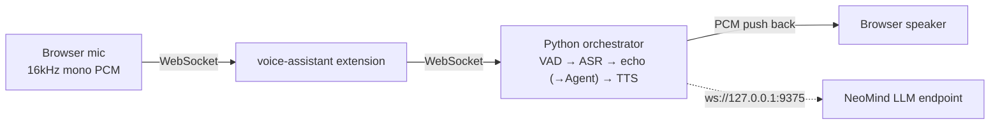
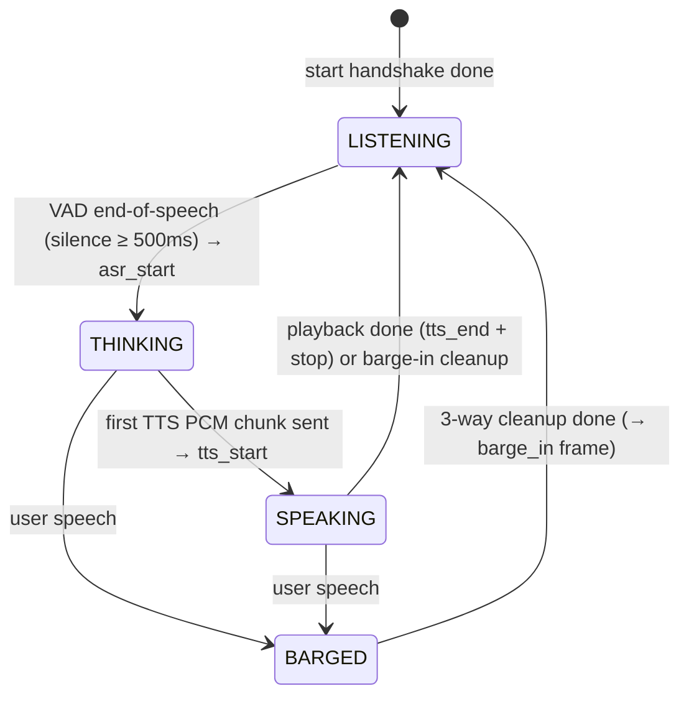

# Voice Assistant & Speech Capabilities

> NeoMind's speech capabilities — a **voice-assistant** real-time assistant plus interchangeable ASR / TTS extensions, covering voice assistant, voice input, broadcast, and cloning.

:::warning voice-assistant is a PoC
voice-assistant is currently a **PoC (proof of concept)**: the reply stage still echoes input verbatim and will later switch to a NeoMind Agent call. The ASR / TTS extensions themselves are usable today.
:::

---

## 1. Solution Overview

NeoMind's speech stack is one orchestrator extension plus several capability extensions:

| Role | Extension | Capability |
|---|---|---|
| Voice-assistant orchestration | **voice-assistant** (PoC) | Real-time pipeline: VAD → ASR → echo (→Agent later) → TTS |
| Speech recognition (ASR) | sensevoice-asr | SenseVoice-Small, 5 languages (zh/en/ja/ko/yue), CPU ONNX |
| Text-to-speech (TTS) | cosyvoice-3 / voice-edge-tts / moss-tts-nano | Same interface (`/tts/stream` NDJSON), interchangeable |

**voice-assistant data flow**:



ASR and TTS can be orchestrated by voice-assistant or called standalone (voice input, voice broadcast). This page develops each capability along "**why → how → real request/response → verification → pitfalls**"; the protocol frames and return payloads are taken verbatim from the extension sources (`voice-assistant/service/ws_protocol.py`, `server.py`, `orchestrator.py`, etc.), not idealized.

---

## 2. Bill of Materials (BOM)

| Item | Spec | Purpose | Required |
|------|------|------|------|
| **NeoMind platform** | v0.9.0+ | Extension host | ✅ |
| **voice-assistant** (assistant) or sensevoice-asr / a TTS extension | — | Pick per scenario | ✅ |
| **LLM endpoint** | NeoMind built-in (ws://127.0.0.1:9375) | Assistant reply composition | Assistant |
| **Mic / speaker** | Browser or host audio | Record / play | Assistant |
| **GPU (optional)** | NVIDIA | cosyvoice-3 high-quality TTS | Optional |

---

## 3. Install the Extensions

Install the extension that matches your scenario from the extension marketplace on the **Extensions** page (market 2.7.x works for all):

| Scenario | Extensions to install | Extra preparation |
|------|------------|----------|
| Real-time voice assistant (full listen & speak loop) | **voice-assistant** | Python orchestrator service (see [4.1](#41-deploy-the-python-orchestrator-service)) |
| Voice input / recording transcription only | **sensevoice-asr** | ASR Python inference service (see [5.1](#51-deploy-the-inference-service)) |
| Voice broadcast / cloning only | One of **moss-tts-nano** / **cosyvoice-3** / **voice-edge-tts** | Matching TTS Python inference service (see [6.5](#65-deployment-and-configuration)) |

Steps:

1. Open the **Extensions** page, open the extension marketplace, search for the extension name (e.g. `voice-assistant`) and install it;
2. Back in the extension list, confirm the extension status is **Running**;
3. The Rust part of these extensions works once installed, but each one's **Python inference / orchestration service is a separate process** that must be started following the steps below — the extension reaches it over HTTP / WebSocket (default ports: orchestrator 9384, sensevoice-asr 9383, moss-tts-nano 9382, cosyvoice-3 9385, voice-edge-tts 9386).

> For general extension installation and management see [Extension Management](../user-guide/9-extensions.md).

---

## 4. Voice Assistant (voice-assistant)

**Why it is designed this way**: the hard part of real-time voice conversation is not any single model but the glue — when does "the user finished speaking"? How do you avoid the machine being interrupted by its own voice? When the user barges in, how does playback stop instantly? voice-assistant puts all of this into one Python orchestrator: the browser only captures and plays PCM, while VAD segmentation, ASR, LLM, TTS, echo suppression, and interruption cleanup all live in the orchestrator. Between the card and the orchestrator runs a deliberately minimal WebSocket protocol (binary = audio, text = JSON control frames).

### 4.1 Deploy the Python orchestrator service

Defaults to the **all-in-one mode** (`default` profile): SenseVoice ASR + ZipVoice TTS run in-process inside the Python orchestrator, so no separate ASR/TTS services are needed; only the NeoMind LLM endpoint must be reachable.

```bash
cd extensions/voice-assistant/service
python -m venv .venv
.venv/bin/pip install -r requirements.txt   # ~700MB of ONNX Runtime deps
./start.sh
```

The first start downloads ~400MB of model weights to `~/.cache/sherpa-onnx/`:

| Model | Size | Purpose |
|------|------|------|
| `sherpa-onnx-sense-voice-zh-en-ja-ko-yue-2024-07-17` | ~230MB | ASR |
| `sherpa-onnx-zipvoice-distill-int8-zh-en-emilia` | ~170MB | TTS encoder/decoder |
| `vocos_24khz.onnx` | ~22MB | TTS vocoder |

Subsequent runs load from cache (~2–3 s startup). The zero-shot TTS default prompt audio ships with the package (`service/assets/default_prompt.{wav,txt}`), so `voice='中文女'` works out of the box.

Set the NeoMind API token via `export NEOMIND_TOKEN=nmk_xxx`, or enter it in the card config dialog (recommended — the dialog pushes it to the orchestrator before each session starts).

Common orchestrator environment variables:

| Variable | Default | Description |
|------|--------|------|
| `VOICE_ASSISTANT_PROFILE` | `neomind-capability` (start.sh default) | Initial profile. `default` = built-in SenseVoice + ZipVoice + NeoMind WS LLM all-in-one stack; `neomind-capability` = LLM called via the host ChatStream capability (token-free on the extension side) |
| `VOICE_ASSISTANT_VAD_BACKEND` | `silero` | VAD backend: `silero` / `energy` / `fsmn` (pick `fsmn` for noisy environments) |
| `VOICE_ASSISTANT_HOST` / `VOICE_ASSISTANT_PORT` | `127.0.0.1` / `9384` | Orchestrator listen address |
| `SENSEVOICE_ASR_MODEL_DIR` | `~/.cache/sherpa-onnx` | ASR model cache dir |
| `VOICE_EDGE_TTS_MODEL_DIR` | `~/.cache/sherpa-onnx` | TTS model + vocoder cache dir |
| `NEOMIND_TOKEN` | (profile-dependent) | NeoMind LLM API token; can also be pushed from the card config |

Extension-side env var: `VOICE_ASSISTANT_ORCHESTRATOR_URL` (default `ws://127.0.0.1:9384/ws`) — the orchestrator WS URL the Rust extension bridges to.

> Other optional profiles: `edge-arm` (RK3588 / Jetson + local ollama), `noisy-env` (raises the VAD threshold for loud environments), `headset` (near-field mic), `kokoro-qwen3`, etc. See the extension README.

### 4.2 Card config parameters (VoiceAssistantCard)

After adding the **VoiceAssistantCard** of the **voice-assistant** extension to the Dashboard, the config dialog exposes these fields (pushed to the orchestrator via HTTP `POST /config` before each session, so changes take effect on the next mic toggle without restarting the service):

| Field | Type / values | Description |
|------|------------|------|
| `wsUrl` | string, default `http://127.0.0.1:9384` | Orchestrator base URL (http:// or ws://, with or without `/ws` — normalized automatically) |
| `profile` | dropdown | Switch profile at runtime; triggers a backend reload (~1–3 s for in-process models) |
| `neoMindToken` | string (password) | NeoMind API token, kept only in orchestrator process memory |
| `language` | `auto` / `zh` / `en` / `ja` / `ko` / `yue` | ASR language hint; instant |
| `voice` | string (e.g. `中文女`) | TTS voice; instant |
| `showTranscripts` | boolean | Toggle live captions / conversation display |
| `showMetrics` | boolean | Toggle the latency panel |
| `directMode` | boolean | **Direct Python WS Mode** checkbox. Off (default): the frontend connects to the host's `/api/extensions/voice-assistant/stream` endpoint and LLM calls go through the host ChatStream capability (token-free). On: connects directly to `ws://127.0.0.1:9384/ws` and the orchestrator holds the token for LLM calls. Switching requires closing and reopening the card |

> Trade-off: in the default stream mode the host sees every LLM call (audit / governance) and the token never leaves the host process; direct mode is for debugging the Python orchestrator in isolation. The **frame format between card and orchestrator is identical** in both modes, so the protocol below applies to either.

### 4.3 The session state machine: life cycle of a conversation

The orchestrator keeps an explicit state machine (`StateMachine` in `orchestrator.py`); the card's status pill / orb animation mirrors it. Once you understand the transitions, you understand "why the card is this color right now":



| State | Card shows | Entry condition (trigger frame) | What the orchestrator is doing |
|------|---------|------------------|-----------------|
| **IDLE / STANDBY** | STANDBY | WS connected, `ready` received | Session idle, VAD watching the mic |
| **LISTENING** | LISTENING | Entered on mic open; returned to after interruption cleanup | Mic PCM streamed into the VAD, waiting for a complete utterance |
| **THINKING** | THINKING | VAD declares the utterance over, ASR starts (downlink `asr_start`) | Whole segment → ASR transcript → LLM streaming; the card flips to THINKING on `asr_start` immediately, without waiting for the transcript |
| **SPEAKING** | SPEAKING | First PCM chunk of the first synthesized sentence sent (downlink `tts_start`) | Generating and playing in parallel: later LLM sentences overlap with TTS playback (bi-streaming) |
| **BARGED** | (transient, invisible to the user) | User speech detected during THINKING / SPEAKING | Three cleanups in parallel: ① tell the browser to stop playback (`barge_in` frame, ~8ms fade-out) ② cancel the in-flight LLM request ③ drain the pending-sentence queue; optionally plays a short "okay" ack, then back to LISTENING |

Two details worth knowing:

- **Hands-free turn-taking rhythm** is set by `vad_silence_ms` (default 500ms) — after you stop talking, ~half a second of silence is required before THINKING starts. That is by design, not a stall;
- **During THINKING / SPEAKING the VAD threshold is raised ~30×** so speaker echo cannot trigger self-interruption. The cost: barging in requires normal speaking volume — whispers / very soft speech may not trigger barge-in.

### 4.4 WebSocket message protocol (card ↔ orchestrator)

The single source of truth is `service/ws_protocol.py` plus the module docstring of `server.py`. Key points: **binary frames = 16kHz mono int16 LE PCM** (uplink = mic audio, downlink = audio to play), **text frames = one line of JSON**, every frame carrying a `type` field.

**Uplink (card/extension → orchestrator, `ws://127.0.0.1:9384/ws?session_id=…`):**

| Frame | JSON shape | Description |
|----|-----------|------|
| `start` | `{"type":"start","session_id":"va-7f3a","sample_rate":16000}` | Sent once after connecting; triggers the handshake |
| `ping` | `{"type":"ping"}` | Health probe; answered with `pong` |
| `stop` | `{"type":"stop"}` | Client-initiated end of the current turn (equivalent to interruption) |
| binary | (raw int16 LE PCM) | Mic audio, streamed up in ~32ms chunks |

**Downlink (orchestrator → card/extension):**

| Frame | JSON shape | Description |
|----|-----------|------|
| `ready` | `{"type":"ready","session_id":"va-7f3a","asr_url":"(in-proc)","tts_url":"(in-proc)","voice":"中文女","vad_silence_ms":500,"vad_min_speech_ms":300,"vad_energy_threshold":0.015}` | Answer to `start`, carrying the effective VAD parameters and voice |
| `pong` | `{"type":"pong"}` | Answer to `ping` |
| `greeting` | `{"type":"greeting","text":"你好，我在。"}` | Welcome clip played at session start (followed by one binary greeting PCM frame; no tts_start/tts_end around it) |
| `asr_start` | `{"type":"asr_start","bytes":96000}` | VAD segmentation done, N bytes of PCM entered ASR; the card flips to THINKING on this frame |
| `partial_transcript` | `{"type":"partial_transcript","text":"查一下三号仓"}` | Live partial transcript from streaming ASR (overwrites the subtitle; cleared once `transcript` arrives) |
| `transcript` | `{"type":"transcript","text":"查一下三号仓库的温度。","language":"auto","elapsed_ms":183.4}` | Final transcript: text + language hint + ASR elapsed time |
| `llm_sentence` | `{"type":"llm_sentence","seq":0,"text":"好的，三号仓库当前温度 26.5 摄氏度。"}` | One frame per completed LLM sentence, for progressive subtitles; safe to ignore — playback is unaffected |
| `skip` | `{"type":"skip","reason":"empty_transcript"}` | Turn skipped, no LLM/TTS call. Other reasons: `noise_transcript` (noise-hallucination filter), `empty_llm_output`, `empty_tts_output` |
| `tts_start` | `{"type":"tts_start","text":"(voice reply)","mode":"full_synthesize"}` | Sent right before the first TTS PCM; the card flips to SPEAKING on this frame |
| `tts_end` | `{"type":"tts_end","total_ms":742.6,"tts_first_chunk_ms":88.0,"asr_ms":183.4}` | Turn playback finished, carries latency metrics (see 4.5) |
| `stop` | `{"type":"stop"}` | Terminal frame of a normally completed turn |
| `barge_in` | `{"type":"barge_in"}` | Interruption control frame: the browser clears its playback queue immediately (~8ms fade-out) |
| `error` | `{"type":"error","phase":"asr","message":"…"}` | Stage-level error; phase is `asr` / `tts` / `pipeline` etc. Handshake failures emit a phase-less `{"type":"error","message":"…"}` |
| binary | (raw int16 LE PCM) | Audio to play (TTS output down-mixed / resampled to 16kHz mono) |

> Under the `neomind-capability` profile (default) there is also a set of `chat_chunk` / `chat_stream_started` / `chat_stream_end` / `chat_stream_error` frames — LLM events produced by the host ChatStream capability, which enter the orchestrator over the same WS and are consumed by the LLM backend; clients need not handle them.

**Frame sequence of one full turn (example values, realistic magnitudes):**

```text
→ {"type":"start","session_id":"va-7f3a","sample_rate":16000}
← {"type":"ready","session_id":"va-7f3a","asr_url":"(in-proc)","tts_url":"(in-proc)",
   "voice":"中文女","vad_silence_ms":500,"vad_min_speech_ms":300,"vad_energy_threshold":0.015}
← {"type":"greeting","text":"你好，我在。"}      ← followed by one binary greeting PCM frame
   (user starts speaking; mic PCM binary frames stream up continuously)
← {"type":"asr_start","bytes":96000}            ← speech ended (silence ≥500ms); 3s of audio ≈ 96000 bytes
← {"type":"partial_transcript","text":"查一下三号仓"}
← {"type":"transcript","text":"查一下三号仓库的温度。","language":"auto","elapsed_ms":183.4}
← {"type":"llm_sentence","seq":0,"text":"好的，三号仓库当前温度 26.5 摄氏度。"}
← {"type":"tts_start","text":"(voice reply)","mode":"full_synthesize"}
← (binary PCM frames stream down; the speaker starts playing)
← {"type":"tts_end","total_ms":742.6,"tts_first_chunk_ms":88.0,"asr_ms":183.4}
← {"type":"stop"}                               ← turn over, back to LISTENING
```

**Interruption (barge-in) sequence:** while SPEAKING, the user speaks → VAD detects speech → the orchestrator first runs the three cleanups in parallel, then sends `{"type":"barge_in"}` downlink (the front end fades playback out) and returns to LISTENING — the user never waits for the previous reply to finish. If `stop` is sent by the client instead (tapping the mic again), the orchestrator runs the same cleanup path.

### 4.5 Reading the latency panel

The ASR / LLM / TTS / Total numbers in the card header come from the `tts_end` frame. Column-to-field mapping:

| Panel column | `tts_end` field | Meaning | PoC reference |
|--------|---------------|------|-------------|
| **ASR** | `asr_ms` | VAD segmentation done → transcript done | ~155ms for 10s of audio (RTF 0.014) |
| **LLM** | `llm_first_sentence_ms` | LLM stream start → first complete sentence (carried on newer builds; the column is hidden when absent) | ~106–172ms |
| **TTS** | `tts_first_chunk_ms` | TTS start → first PCM chunk sent | ~88ms (moss first-chunk measured avg 71ms) |
| **Total** | `total_ms` | Turn start → playback end | Grows linearly with reply length |

What the user actually perceives — "finished speaking to first audible audio" — measured **~195–200ms** in the PoC (ASR done → first reply sentence 106ms + first sentence → first audio chunk 89ms). The enabler is **bi-streaming**: the LLM producer and the TTS consumer run concurrently through a bounded queue (capacity 4) — as soon as the first LLM sentence completes it goes straight to TTS, overlapping generation of later sentences with playback of earlier ones. First-audio latency collapses from "sum(all LLM) + sum(all TTS)" to "first-sentence LLM + first-sentence TTS first chunk". The end-to-end harness (`measure_bi_stream_e2e.py`) measured ASR-done → first audio at 163ms average, 202ms worst case.

### 4.6 Usage steps

1. Make sure the orchestrator is up: `curl http://127.0.0.1:9384/config` should return the current config and available profiles;
2. Add the **VoiceAssistantCard** on the Dashboard;
3. Open the card config dialog: verify `wsUrl`, pick `language` / `voice` as needed (direct mode also needs `neoMindToken`), and save;
4. Tap the mic button and **allow microphone access** in the browser prompt — the orb enters LISTENING;
5. Speak — by default **hands-free mode** keeps listening and VAD segments utterances automatically; **push-to-talk** is also supported. The transcript appears live in the caption area, then the orb moves through THINKING → SPEAKING as the reply is spoken aloud;
6. To **barge in**, just speak during playback: audio fades out and the card returns to LISTENING;
7. Tap the mic button again to end the session.

> 📷 TODO screenshot | Voice assistant card · suggested path `…/neomind/voice/01-assistant-card.png`

### 4.7 Verification

Check each item (map each to its protocol frame via 4.4):

- [ ] The card footer shows **Connected**;
- [ ] After tapping the mic the status pill goes from STANDBY to **LISTENING** and the orb reacts to your voice;
- [ ] After one utterance the caption area shows the user transcript first, then the orb moves to **THINKING** → **SPEAKING** and plays the echo reply (currently "你说的是：…" while in PoC);
- [ ] The header latency panel shows **ASR / LLM / TTS / Total** numbers — PoC measurements put ASR-done-to-first-audio at ~200 ms;
- [ ] Speaking during playback interrupts immediately (barge-in).

**Pitfalls**:

- After switching `directMode` nothing changes — you must **close and reopen the card** so it reconnects in the new mode;
- Phantom transcripts in hands-free mode, or playback interrupted by your own voice — speaker echo leaking into the mic; see the AEC entry in §8;
- Soft speech fails to barge in — the VAD threshold is raised ~30× during THINKING/SPEAKING to prevent self-interruption; speak at normal volume;
- Stuck on THINKING forever — usually an expired page JWT or unrouted capability events; reload the page to reconnect;
- Trailing syllables get clipped if you stop abruptly — the VAD needs 500ms of silence to close the utterance; by design, tunable via `VOICE_ASSISTANT_VAD_SILENCE_MS`.

---

## 5. Speech to Text (sensevoice-asr)

**Why a standalone extension**: not every scenario needs a conversation. Dictated work orders, recording transcription, a voice entrance for an Agent — all just need one deterministic action: "audio in → text out". sensevoice-asr is exactly that: SenseVoice-Small (234M params INT8, `sherpa-onnx` ONNX CPU backend), 5 languages (Chinese, English, Japanese, Korean, Cantonese), RTF ~0.017 on CPU — a 10-second clip transcribes in a fraction of a second, no GPU needed.

### 5.1 Deploy the inference service

```bash
cd extensions/sensevoice-asr/service
pip install -r requirements.txt
./start.sh        # listens on http://127.0.0.1:9383
```

The first run downloads ~230MB of ONNX weights to `~/.cache/sherpa-onnx/`. Smoke test (real responses of the two read-only endpoints):

```bash
curl http://127.0.0.1:9383/health
# {"status":"ok"}          ← weights loaded; while loading returns {"status":"loading"}

curl http://127.0.0.1:9383/languages
# {"languages":["auto","zh","en","ja","ko","yue"]}
```

Service environment variables: `SENSEVOICE_ASR_SERVICE_URL` (extension-side service URL, default `http://127.0.0.1:9383`), `SENSEVOICE_ASR_LANGUAGE` (default language hint, `auto`), `SENSEVOICE_ASR_MODEL_DIR` (weights dir), `SENSEVOICE_ASR_CPU_THREADS` (ONNX Runtime threads, default 2).

### 5.2 Commands and parameters

The extension exposes 4 commands:

| Command | Description | Typical use |
|------|------|----------|
| `transcribe` | File path or base64 WAV → returns text | Voice input, transcription UIs |
| `transcribe_file` | Transcribe a local file by path (convenience wrapper) | Pre-recorded audio pipelines |
| `health` | Probe the Python service | Monitoring |
| `languages` | List supported language hints | UI dropdowns |

**`transcribe` parameters**:

| Parameter | Type | Required | Description |
|------|------|------|------|
| `audio_path` | string | one of two | **Host-machine** local audio path (wav/mp3/m4a/flac); mutually exclusive with `audio_base64` |
| `audio_base64` | string | one of two | Base64-encoded **16-bit PCM WAV** bytes (e.g. a browser recording); mutually exclusive with `audio_path` |
| `language` | string | no | Language hint: `auto` (default, works for mixed language) / `zh` / `en` / `ja` / `ko` / `yue` |
| `use_itn` | boolean | no | Inverse text normalization (spoken numbers → digits etc.), default `true` |

**`transcribe_file` parameters**: `path` (string, required, host-machine local audio path), `language` (as above).

`health` and `languages` return: `{"ok":true,"service_url":"http://127.0.0.1:9383"}` and `{"languages":["auto","zh","en","ja","ko","yue"]}`.

### 5.3 A complete transcription example (transcribe)

**Input**: `/tmp/meeting-clip.wav` — a 16kHz / 16-bit / mono WAV, 5.2 seconds long, containing Mandarin speech "今天下午三点开产线例会，三号仓温度正常。" (other sample rates / channel counts are resampled and down-mixed automatically; `audio_path` decodes via soundfile, so mp3/m4a/flac all work).

**Option 1**: expand `transcribe` on the extension detail page's **Commands** tab, fill in `audio_path=/tmp/meeting-clip.wav` and `language=auto`, then execute.

**Option 2**: the REST API (callable by AI Agents / automation rules; there is **no** `neomind extension invoke` style CLI):

```bash
curl -X POST -H "X-API-Key: $NEOMIND_API_KEY" \
     -H "Content-Type: application/json" \
     -d '{"command":"transcribe","args":{"audio_path":"/tmp/meeting-clip.wav","language":"auto"}}' \
     http://localhost:9375/api/extensions/sensevoice-asr/command
```

**Response** (the extension returns the inference service's `/asr` JSON verbatim; numbers are **examples** and vary by machine and audio):

```json
{
  "text": "今天下午3点开产线例会，三号仓温度正常。",
  "language": "auto",
  "elapsed_seconds": 0.11,
  "duration_seconds": 5.2,
  "rtf": 0.021
}
```

| Field | Meaning | Notes |
|------|------|------|
| `text` | Transcribed text | Note "三点" became "3点" via ITN (`use_itn: true` by default) |
| `language` | Echoes the requested language hint | Pass `auto`, get `"auto"` back — not the detected language |
| `elapsed_seconds` | Pure inference time | Excludes audio decoding |
| `duration_seconds` | Audio length (after resampling to 16kHz) | |
| `rtf` | Real-time factor = elapsed / duration | Lower is faster; ~0.017 measured on M2 / 2 threads, i.e. a 10-second clip takes ~0.2s |

The same inference response also carries the `X-Elapsed-Seconds` / `X-Duration-Seconds` / `X-RTF` HTTP headers (the extension uses them to update its `rtf` metric). For browser recordings swap `audio_path` for `audio_base64` (raw WAV bytes base64-encoded); everything else is unchanged.

> 📷 TODO screenshot | transcribe command · suggested path `…/neomind/voice/02-asr.png`

**Verification**: `health` returns `ok:true` → run the 5.3 example → `text` matches the recording and `rtf` is below 0.1.

**Pitfalls**:

- `audio_path` is a path **on the host running the extension**, not on the machine your browser runs on; for remote / browser scenarios always use `audio_base64`;
- `audio_base64` only accepts **16-bit PCM WAV** (`sampwidth=2`); other bit widths error out — route mp3/m4a/flac through `audio_path`;
- SenseVoice is an offline (whole-utterance) model: very long recordings scale linearly in time (constant RTF); for streaming use voice-assistant's VAD segmentation to cut long audio into utterances;
- Ambient noise can produce single-character / short-English "hallucination transcripts" — voice-assistant has a built-in noise filter (`skip: noise_transcript`); when calling standalone, filter by a business-side minimum length;
- To keep spoken-number words like "三点" as written Chinese, pass `use_itn: false`.

---

## 6. Text to Speech (TTS — pick one)

**Why three extensions with one interface**: TTS needs vary wildly by hardware — GPU servers want quality, Mac / ARM edge boxes want anything that runs, all-platform CPU wants multilingual. NeoMind wraps three backends behind **the same commands and the same `/tts/stream` NDJSON protocol**, so application code (including voice-assistant) changes zero lines — one env var swaps the engine.

### 6.1 Selection

The three TTS extensions share the `/tts/stream` NDJSON interface; voice-assistant swaps backends by changing one env var. Pick by platform and quality:

| Dimension | moss-tts-nano | cosyvoice-3 | voice-edge-tts |
|---|---|---|---|
| Platform | CPU, all platforms | Needs CUDA (Linux / Jetson; Mac only MPS fallback, unusably slow) | **Mac CPU / Linux ARM CPU** |
| Chinese quality | Fair | Excellent | Good |
| Voice cloning | Yes (MOSS) | Yes (zero-shot, needs `prompt_text`) | Yes (zero-shot) |
| Footprint | ~200MB | ~1GB (~2GB first download) | ~150MB |
| Languages | 20+ | zh/en | zh/en |
| Built-in voices | 18 (Junhao, Ava, Saki, ...) | 7 (中文女/中文男/英文女/英文男/日语男/粤语女/韩国女) | 中文女 (customizable via reference audio) |
| Output | 48kHz stereo | 24kHz mono | 24kHz mono |

> Selection: highest quality with a GPU → cosyvoice-3; Mac/ARM edge devices → voice-edge-tts; multilingual + cloning + cross-platform CPU → moss-tts-nano.

### 6.2 Shared commands and parameters

All three expose the same commands:

| Command | Description |
|------|------|
| `speak` | Synthesize and play directly on the **host audio device** (streaming: plays while synthesizing) |
| `synthesize` | Synthesize and return base64 WAV (no playback) |
| `stop_speaking` | Stop current playback immediately and clear the buffer |
| `list_voices` | List voices available on the service |
| `health` | Probe the Python service |

**`speak` / `synthesize` parameters**:

| Parameter | Type | Required | Description |
|------|------|------|------|
| `text` | string | ✅ | Text to synthesize |
| `voice` | string | no | Built-in voice preset, overrides each extension's default (MOSS default `Junhao`, cosyvoice/edge default `中文女`) |
| `prompt_audio_path` | string | no | Reference audio wav path for voice cloning; overrides `voice` |
| `prompt_text` | string | cosyvoice-3 only | Transcript of the reference audio; required for zero-shot cloning |
| `sample_mode` | string | no | `greedy` (deterministic output — recommended for agent broadcasts) / `fixed` / `full` (defaults differ per extension; the MOSS service defaults to `fixed`) |
| `blocking` | boolean | `speak` only | Default `true` (returns after playback finishes); `false` plays in the background and returns immediately |

### 6.3 Complete examples: speak and synthesize

**Example 1: `speak` in the background** (the most common choice for automation rules / agents — returns immediately, doesn't block the rule):

```bash
curl -X POST -H "X-API-Key: $NEOMIND_API_KEY" \
     -H "Content-Type: application/json" \
     -d '{"command":"speak","args":{"text":"警告：3 号仓温度 31.2 摄氏度，已超限。","voice":"中文女","blocking":false}}' \
     http://localhost:9375/api/extensions/moss-tts-nano/command
```

Return (background playback; numbers are **examples**):

```json
{ "played": true, "finished": false, "background": true, "frames": 23, "samples": 168960 }
```

With `blocking: true` (the default) it returns only after playback finishes: `{ "played": true, "finished": true, "frames": 23, "samples": 168960, "duration_ms": 1760 }`. Internally the extension streams `/tts/stream` and pushes PCM chunks to a rodio audio thread as they arrive, so the first sound is not delayed until the whole sentence is synthesized.

**Example 2: `synthesize` to get the WAV and handle it yourself** (write to file, feed a web front end, hook into a PA system, etc.):

```bash
curl -X POST -H "X-API-Key: $NEOMIND_API_KEY" \
     -H "Content-Type: application/json" \
     -d '{"command":"synthesize","args":{"text":"今天巡检完成，共 12 台设备，全部正常。","voice":"Junhao"}}' \
     http://localhost:9375/api/extensions/moss-tts-nano/command
```

Return (`audio_base64` truncated; numbers are **examples**):

```json
{
  "audio_base64": "UklGRigAAABXQVZFZm10IBIAAAABAAEARKwAAIhYAQACABAAZGF0YQQAAAAAAA==...",
  "format": "wav",
  "sample_rate": 48000,
  "duration_ms": 1834,
  "size_bytes": 351232
}
```

`sample_rate` / channels differ per backend: cosyvoice-3 and voice-edge-tts are 24000 mono, moss-tts-nano is 48000 stereo — mind this when decoding downstream.

**Helper command returns**: `stop_speaking` → `{"stopped":true}`; `list_voices` → `{"voices":["Junhao","Ava","Saki",…]}` (actual list depends on the backend); `health` → `{"ok":true,"service_url":"http://127.0.0.1:9382"}`.

### 6.4 The `/tts/stream` NDJSON event sequence

`POST /tts/stream` is the shared streaming endpoint of all three backends (and the path the voice-assistant orchestrator consumes). The request body takes the same fields as `speak`/`synthesize` (`text` required; `voice` / `prompt_audio_path` / `sample_mode` etc. optional). The response is an NDJSON stream — **one JSON event per line**:

```text
{"seq": 0, "data": "<base64 int16 LE PCM>", "sample_rate": 48000, "channels": 2, "is_pause": false}
{"seq": 1, "data": "<base64 ...>", "sample_rate": 48000, "channels": 2, "is_pause": false}
{"seq": 2, "data": "<base64 ...>", "sample_rate": 48000, "channels": 2, "is_pause": true}    ← inter-sentence silence when cloning multi-segment text
...
{"seq": N, "data": "<base64 ...>", ..., "is_pause": false}                                   ← last line
(connection close = synthesis finished; there is no extra done/finish frame)
```

Event-sequence facts (from `moss-tts-nano/service/server.py` / `cosyvoice-3/service/server.py`):

1. `seq` increases monotonically from 0; `data` is headerless raw int16 LE PCM, interpreted according to `sample_rate` / `channels`;
2. Lines with `is_pause: true` are **silence fillers** (inter-sentence pauses when cloning long text split into segments); players can push them into the queue as usual;
3. On error the stream terminates in-band: the last line becomes `{"error": "..."}` followed by connection close — line parsers must check for the `error` key;
4. **The first chunk arrives fast**: MOSS decodes frame-by-frame with an adaptive batch size (1→2→4→8), measured first chunk avg 71ms, worst 73ms (vs 10s+ for whole-utterance synthesis); cosyvoice-3 targets <200ms first chunk and <500ms per 30-character sentence.

### 6.5 Deployment and configuration

#### moss-tts-nano (CPU, all platforms)

(CPU on all platforms, 0.1B, 48kHz stereo, 20+ languages): clone the upstream [MOSS-TTS-Nano](https://github.com/OpenMOSS/MOSS-TTS-Nano) repo first and `pip install -e .` (conda recommended for pynini); the first run downloads ~200MB of ONNX weights:

```bash
cd extensions/moss-tts-nano/service
MOSS_TTS_NANO_REPO=~/MOSS-TTS-Nano ./start.sh    # listens on http://127.0.0.1:9382
```

Key config: `MOSS_TTS_SERVICE_URL` (default `http://127.0.0.1:9382`), `MOSS_TTS_VOICE` (default `Junhao`), `MOSS_TTS_NANO_REPO`, `MOSS_TTS_MODEL_DIR`, `MOSS_TTS_CPU_THREADS` (default 4). A Docker image is also provided (mount the model dir, `-p 9382:9382`).

#### cosyvoice-3 (GPU, highest quality)

(0.5B, 24kHz, highest quality): Python 3.10+; the first run downloads ~2GB from ModelScope into `~/.cache/modelscope/` (5–10 min); targets a first chunk under 200 ms and under 500 ms per 30-character sentence:

```bash
cd extensions/cosyvoice-3/service
pip install -r requirements.txt
./start.sh        # listens on http://127.0.0.1:9385
```

Key config: `COSYVOICE_SERVICE_URL` (default `http://127.0.0.1:9385`), `COSYVOICE_VOICE` (default `中文女`), `COSYVOICE_MODEL_DIR` (ModelScope ID or local path), `COSYVOICE_HOST` / `COSYVOICE_PORT`, `PYTORCH_ENABLE_MPS_FALLBACK=1`. For Linux / Jetson production prefer Docker + `--gpus all`.

#### voice-edge-tts (Mac / ARM edge)

(sherpa-onnx ZipVoice, ~150MB, Mac/ARM CPU friendly):

```bash
cd extensions/voice-edge-tts/service
pip install -r requirements.txt
./start.sh        # listens on http://127.0.0.1:9386; first run downloads ~150MB to ~/.cache/sherpa-onnx
curl http://127.0.0.1:9386/health
# {"status":"ok","sample_rate":24000,"voices":["中文女"]}
```

Key config: `VOICE_EDGE_TTS_HOST` / `VOICE_EDGE_TTS_PORT` (default 9386), `VOICE_EDGE_TTS_CPU_THREADS` (default 2), `VOICE_EDGE_TTS_MODEL_DIR`. Custom voice: replace `service/assets/default_prompt.wav` and the matching `.txt` (**the transcript must match the audio**; a clean 5–10 s 16kHz mono clip of the target voice is recommended).

**Host audio requirements** (`speak` playback path, via rodio/cpal): macOS CoreAudio works out of the box; Linux needs ALSA (`libasound2-dev` at build time, `libasound2` at runtime) plus a usable, non-exclusive audio output device; Windows WASAPI works out of the box. On platforms without an audio backend `speak` returns an error — use `synthesize` to get WAV bytes and play them yourself.

**Wiring up voice-assistant**: switch the TTS backend by changing one env var (`VOICE_ASSISTANT_TTS_URL` takes precedence over `MOSS_TTS_URL`):

```bash
export MOSS_TTS_URL=http://127.0.0.1:9385          # e.g. switch to cosyvoice-3
# or export VOICE_ASSISTANT_TTS_URL=http://127.0.0.1:9386   # switch to voice-edge-tts
export VOICE_ASSISTANT_VOICE=中文女
```

**Verification**: `curl /health` returns `status:"ok"` → `list_voices` lists voices → run example 1 of 6.3: the host speaker plays and the call returns immediately → run example 2: `duration_ms` matches the text length in magnitude.

**Pitfalls**:

- `speak` errors with an audio-device problem / plays nothing — no usable output device, it is exclusively held, or Linux lacks ALSA; switch to `synthesize` and play it yourself to bypass;
- moss's streaming endpoint serves **one request at a time** (single-request serial); queue concurrent broadcasts on the business side;
- cosyvoice-3 on a Mac is only the MPS/CPU fallback (RTF ~2.5×) — not "a bit slower" but unusable; don't force it;
- Mismatched `prompt_text` vs reference audio clearly degrades the cloned voice; keep the reference a clean 5–10s 16kHz mono clip;
- With `sample_mode` omitted, the MOSS service defaults to `fixed` (non-deterministic); pass `greedy` explicitly when broadcasts must be identical every time.

> 📷 TODO screenshot | TTS speak / stream invocation · suggested path `…/neomind/voice/03-tts.png`

---

## 7. Typical Scenarios

### 7.1 Real-time voice assistant

End-to-end conversation via voice-assistant (PoC; later wired to Agent for device control / queries). Hands-free mode suits showrooms and kiosks; for noisy production floors prefer the `noisy-env` profile or push-to-talk.

Flow:

1. `cd extensions/voice-assistant/service && ./start.sh` to start the orchestrator (9384); `curl http://127.0.0.1:9384/config` to confirm readiness;
2. Install **voice-assistant** from the Extensions page; confirm Running;
3. Add **VoiceAssistantCard** on the Dashboard; configure `wsUrl` / `language` / `voice` and save;
4. Tap the mic and authorize → the card shakes hands via `start`/`ready` and enters LISTENING (you may hear the greeting clip);
5. Speak → VAD segmentation → `asr_start`/`transcript` → `llm_sentence` → `tts_start` + PCM playback → `tts_end`/`stop` (full frame sequence in 4.4);
6. Speak during playback to verify barge-in;
7. Check the latency panel numbers against the reference ranges in 4.5.

### 7.2 Voice input to Agent

sensevoice-asr turns speech into text for an [AI Agent](../user-guide/6-ai-agent.md) or AI Chat to act on — e.g. on-site work orders by voice.

Flow:

1. Install **sensevoice-asr**; `./start.sh` the inference service (9383); `curl /health` and expect `{"status":"ok"}`;
2. The front end (or a capture script) records via the browser's MediaRecorder, wraps it as 16-bit WAV and base64-encodes it;
3. Call the extension command: `POST /api/extensions/sensevoice-asr/command` with body `{"command":"transcribe","args":{"audio_base64":"…","language":"auto"}}`;
4. Take `text` from the response (filter noise transcripts with a business-side minimum length);
5. Feed `text` into the AI Agent (agent app / automation-rule trigger) to create the ticket — no keyboard involved.

### 7.3 Voice broadcast (rule integration)

TTS synthesizes alerts, readings, or Agent replies into speech — for showrooms, factory floors, accessibility. [Automation rules](../user-guide/7-automation-rules.md) can invoke extension commands, so a rule action can call TTS `speak`.

Flow:

1. Install one of the three TTS extensions per platform and start its service (e.g. moss on 9382); confirm with `curl /health` + `list_voices`;
2. Create an automation rule with a trigger (e.g. "warehouse 3 temperature > 30°C");
3. Set the rule action to "invoke extension command", target `moss-tts-nano` (or your chosen TTS), command `speak`, args `{"text":"警告：3 号仓温度超限","blocking":false}` — `blocking:false` lets the rule return immediately while playback continues in the background;
4. Trigger the rule manually once to verify: the host speaker plays and the rule execution log shows no blocking;
5. For long-running operation pass `sample_mode:"greedy"` explicitly so the same alert always sounds identical.

### 7.4 Voice cloning

Zero-shot clone a custom voice with moss-tts / cosyvoice / voice-edge — showroom guides, brand voices, etc.

Flow:

1. Prepare a reference clip: 5–10s of clean 16kHz mono speech of the target voice (e.g. `/tmp/ref.wav`); cosyvoice-3 also needs its **exact** transcript;
2. Pass `prompt_audio_path` on `speak` (overrides `voice`): `POST /api/extensions/cosyvoice-3/command` with body `{"command":"speak","args":{"text":"欢迎来到展厅。","prompt_audio_path":"/tmp/ref.wav","prompt_text":"参考音频的转写文本。","blocking":false}}` (moss / voice-edge skip `prompt_text`);
3. Listen and judge similarity; if it disappoints, retry with a cleaner reference clip;
4. To make the voice the permanent default (voice-edge only): replace `service/assets/default_prompt.wav` and the matching `.txt`, restart the service, and every call without `prompt_audio_path` uses that voice;
5. For batch pre-generation of announcements use `synthesize` to write WAVs to disk instead of synthesizing live every time.

---

## 8. Troubleshooting

| Symptom | Cause | Fix |
|------|------|------|
| "Microphone access denied" as soon as the mic is tapped; orb goes ERROR | Browser / client denied microphone permission | Allow the microphone in the browser's address-bar permission settings; macOS desktop clients also need authorization under System Settings → Privacy & Security → Microphone |
| Card shows "WebSocket connection failed" / "Stream connection failed"; state ERROR | Python orchestrator not running or wrong address | Start the orchestrator with `./start.sh` on the deploy host, verify with `curl http://127.0.0.1:9384/config`; check the card's `wsUrl` |
| Orchestrator very slow or failing on first start | First start downloads ~400MB of model weights (FSMN VAD pulls another ~500KB model) | Check network / proxy; weights can be downloaded manually into `~/.cache/sherpa-onnx/`, after which restarts load from cache |
| `transcribe` / `speak` report the service unreachable; `health` returns `ok:false` | The matching Python inference service is not running | Start the service per its section and `curl /health`: sensevoice 9383 / moss 9382 / cosyvoice 9385 / voice-edge 9386 |
| cosyvoice-3 synthesis extremely slow or unusable | No NVIDIA GPU: Mac only has MPS/CPU fallback (RTF ~2.5×, unusable); cosyvoice targets Linux + CUDA | Switch to voice-edge-tts (Mac/ARM CPU) or moss-tts-nano (CPU, all platforms); on GPU servers deploy via Docker `--gpus all` |
| `speak` is silent or raises an audio-device error | No usable/exclusive-locked host audio output, or ALSA missing on Linux | Verify the host speaker works and is not held by another process; install `libasound2` on Linux; or use `synthesize` to get WAV and play it yourself |
| Phantom transcripts when nobody speaks, or playback interrupted by the user's own voice in hands-free mode | Speaker audio leaking into the mic triggers the VAD (echo) | The default `echo_window` AEC suppresses most of it; if it still misfires, switch to push-to-talk or configure `webrtc` AEC (`pip install webrtc-audio-processing`) |
| 401 / refused connections in stream mode, or stuck on THINKING forever | Page JWT expired, or capability events not routed | Reload the page to refresh the token; if still stuck, check the orchestrator and extension logs |

---

## 9. Appendix

### Related docs

- [Extension Management](../user-guide/9-extensions.md)
- [AI Agent](../user-guide/6-ai-agent.md)
- [AI Chat](../user-guide/5-ai-chat.md)
- [Configure the LLM backend](../user-guide/2-configure-llm.md)
- voice-assistant / sensevoice-asr / cosyvoice-3 / voice-edge-tts / moss-tts-nano extension READMEs

---

*Last updated: 2026-09-09*
