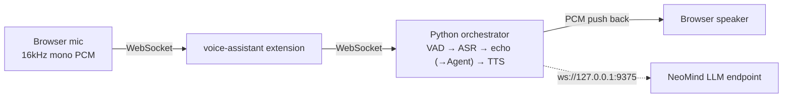

# Voice Assistant & Speech Capabilities

> NeoMind's speech capabilities — a **voice-assistant** real-time assistant plus interchangeable ASR / TTS extensions, covering voice assistant, voice input, broadcast, and cloning.

> ⚠️ voice-assistant is currently a **PoC (proof of concept)**: the reply stage still echoes input verbatim and will later switch to a NeoMind Agent call. The ASR / TTS extensions themselves are usable today.

---

## 1. Solution Overview

NeoMind's speech stack is one orchestrator extension plus several capability extensions:

| Role | Extension | Capability |
|---|---|---|
| Voice-assistant orchestration | **voice-assistant** (PoC) | Real-time pipeline: VAD → ASR → echo (→Agent later) → TTS |
| Speech recognition (ASR) | sensevoice-asr | SenseVoice-Small, 5 languages (zh/en/ja/ko/yue), CPU ONNX |
| Text-to-speech (TTS) | cosyvoice-3 / voice-edge-tts / moss-tts-nano | Same interface (`/tts/stream` NDJSON), interchangeable |

**voice-assistant data flow**:



ASR and TTS can be orchestrated by voice-assistant or called standalone (voice input, voice broadcast).

---

## 2. Bill of Materials (BOM)

| Item | Spec | Purpose | Required |
|------|------|------|------|
| **NeoMind platform** | v0.9.0+ | Extension host | ✅ |
| **voice-assistant** (assistant) or sensevoice-asr / a TTS extension | — | Pick per scenario | ✅ |
| **LLM endpoint** | NeoMind built-in (ws://127.0.0.1:9375) | Assistant reply composition | Assistant |
| **Mic / speaker** | Browser or host audio | Record / play | Assistant |
| **GPU (optional)** | NVIDIA | cosyvoice-3 high-quality TTS | Optional |

---

## 3. Install the Extensions

Install the extension that matches your scenario from the extension marketplace on the **Extensions** page (market 2.7.x works for all):

| Scenario | Extensions to install | Extra preparation |
|------|------------|----------|
| Real-time voice assistant (full listen & speak loop) | **voice-assistant** | Python orchestrator service (see [4.1](#41-deploy-the-python-orchestrator-service)) |
| Voice input / recording transcription only | **sensevoice-asr** | ASR Python inference service (see [5.1](#51-deploy-the-inference-service)) |
| Voice broadcast / cloning only | One of **moss-tts-nano** / **cosyvoice-3** / **voice-edge-tts** | Matching TTS Python inference service (see [6.3](#63-deployment-and-configuration)) |

Steps:

1. Open the **Extensions** page, open the extension marketplace, search for the extension name (e.g. `voice-assistant`) and install it;
2. Back in the extension list, confirm the extension status is **Running**;
3. The Rust part of these extensions works once installed, but each one's **Python inference / orchestration service is a separate process** that must be started following the steps below — the extension reaches it over HTTP / WebSocket (default ports: orchestrator 9384, sensevoice-asr 9383, moss-tts-nano 9382, cosyvoice-3 9385, voice-edge-tts 9386).

> For general extension installation and management see [Extension Management](../user-guide/9-extensions.md).

---

## 4. Voice Assistant (voice-assistant)

### 4.1 Deploy the Python orchestrator service

Defaults to the **all-in-one mode** (`default` profile): SenseVoice ASR + ZipVoice TTS run in-process inside the Python orchestrator, so no separate ASR/TTS services are needed; only the NeoMind LLM endpoint must be reachable.

```bash
cd extensions/voice-assistant/service
python -m venv .venv
.venv/bin/pip install -r requirements.txt   # ~700MB of ONNX Runtime deps
./start.sh
```

The first start downloads ~400MB of model weights to `~/.cache/sherpa-onnx/`:

| Model | Size | Purpose |
|------|------|------|
| `sherpa-onnx-sense-voice-zh-en-ja-ko-yue-2024-07-17` | ~230MB | ASR |
| `sherpa-onnx-zipvoice-distill-int8-zh-en-emilia` | ~170MB | TTS encoder/decoder |
| `vocos_24khz.onnx` | ~22MB | TTS vocoder |

Subsequent runs load from cache (~2–3 s startup). The zero-shot TTS default prompt audio ships with the package (`service/assets/default_prompt.{wav,txt}`), so `voice='中文女'` works out of the box.

Set the NeoMind API token via `export NEOMIND_TOKEN=nmk_xxx`, or enter it in the card config dialog (recommended — the dialog pushes it to the orchestrator before each session starts).

Common orchestrator environment variables:

| Variable | Default | Description |
|------|--------|------|
| `VOICE_ASSISTANT_PROFILE` | `neomind-capability` (start.sh default) | Initial profile. `default` = built-in SenseVoice + ZipVoice + NeoMind WS LLM all-in-one stack; `neomind-capability` = LLM called via the host ChatStream capability (token-free on the extension side) |
| `VOICE_ASSISTANT_VAD_BACKEND` | `silero` | VAD backend: `silero` / `energy` / `fsmn` (pick `fsmn` for noisy environments) |
| `VOICE_ASSISTANT_HOST` / `VOICE_ASSISTANT_PORT` | `127.0.0.1` / `9384` | Orchestrator listen address |
| `SENSEVOICE_ASR_MODEL_DIR` | `~/.cache/sherpa-onnx` | ASR model cache dir |
| `VOICE_EDGE_TTS_MODEL_DIR` | `~/.cache/sherpa-onnx` | TTS model + vocoder cache dir |
| `NEOMIND_TOKEN` | (profile-dependent) | NeoMind LLM API token; can also be pushed from the card config |

Extension-side env var: `VOICE_ASSISTANT_ORCHESTRATOR_URL` (default `ws://127.0.0.1:9384/ws`) — the orchestrator WS URL the Rust extension bridges to.

> Other optional profiles: `edge-arm` (RK3588 / Jetson + local ollama), `noisy-env` (raises the VAD threshold for loud environments), `headset` (near-field mic), `kokoro-qwen3`, etc. See the extension README.

### 4.2 Card config parameters (VoiceAssistantCard)

After adding the **VoiceAssistantCard** of the **voice-assistant** extension to the Dashboard, the config dialog exposes these fields (pushed to the orchestrator via HTTP `POST /config` before each session, so changes take effect on the next mic toggle without restarting the service):

| Field | Type / values | Description |
|------|------------|------|
| `wsUrl` | string, default `http://127.0.0.1:9384` | Orchestrator base URL (http:// or ws://, with or without `/ws` — normalized automatically) |
| `profile` | dropdown | Switch profile at runtime; triggers a backend reload (~1–3 s for in-process models) |
| `neoMindToken` | string (password) | NeoMind API token, kept only in orchestrator process memory |
| `language` | `auto` / `zh` / `en` / `ja` / `ko` / `yue` | ASR language hint; instant |
| `voice` | string (e.g. `中文女`) | TTS voice; instant |
| `showTranscripts` | boolean | Toggle live captions / conversation display |
| `showMetrics` | boolean | Toggle the latency panel |
| `directMode` | boolean | **Direct Python WS Mode** checkbox. Off (default): the frontend connects to the host's `/api/extensions/voice-assistant/stream` endpoint and LLM calls go through the host ChatStream capability (token-free). On: connects directly to `ws://127.0.0.1:9384/ws` and the orchestrator holds the token for LLM calls. Switching requires closing and reopening the card |

> Trade-off: in the default stream mode the host sees every LLM call (audit / governance) and the token never leaves the host process; direct mode is for debugging the Python orchestrator in isolation.

### 4.3 Usage steps

1. Make sure the orchestrator is up: `curl http://127.0.0.1:9384/config` should return the current config and available profiles;
2. Add the **VoiceAssistantCard** on the Dashboard;
3. Open the card config dialog: verify `wsUrl`, pick `language` / `voice` as needed (direct mode also needs `neoMindToken`), and save;
4. Tap the mic button and **allow microphone access** in the browser prompt — the orb enters LISTENING;
5. Speak — by default **hands-free mode** keeps listening and VAD segments utterances automatically; **push-to-talk** is also supported. The transcript appears live in the caption area, then the orb moves through THINKING → SPEAKING as the reply is spoken aloud;
6. To **barge in**, just speak during playback: audio fades out and the card returns to LISTENING;
7. Tap the mic button again to end the session.

> 📷 TODO screenshot | Voice assistant card · suggested path `…/neomind/voice/01-assistant-card.png`

### 4.4 Verification

Check each item:

- [ ] The card footer shows **Connected**;
- [ ] After tapping the mic the status pill goes from STANDBY to **LISTENING** and the orb reacts to your voice;
- [ ] After one utterance the caption area shows the user transcript first, then the orb moves to **THINKING** → **SPEAKING** and plays the echo reply (currently "你说的是：…" while in PoC);
- [ ] The header latency panel shows **ASR / LLM / TTS / Total** numbers — PoC measurements put ASR-done-to-first-audio at ~200 ms;
- [ ] Speaking during playback interrupts immediately (barge-in).

> Currently PoC: the echo stage is not yet wired to a NeoMind Agent; the ASR/TTS chain works and can validate the end-to-end voice path now.

---

## 5. Speech to Text (sensevoice-asr)

SenseVoice-Small (234M params INT8, `sherpa-onnx` ONNX CPU backend) supports Chinese, English, Japanese, Korean, and Cantonese. Use it standalone for voice-to-Agent input, recording transcription, and similar tasks.

### 5.1 Deploy the inference service

```bash
cd extensions/sensevoice-asr/service
pip install -r requirements.txt
./start.sh        # listens on http://127.0.0.1:9383
```

The first run downloads ~230MB of ONNX weights to `~/.cache/sherpa-onnx/`. Smoke test:

```bash
curl http://127.0.0.1:9383/health
```

Service environment variables: `SENSEVOICE_ASR_SERVICE_URL` (extension-side service URL, default `http://127.0.0.1:9383`), `SENSEVOICE_ASR_LANGUAGE` (default language hint, `auto`), `SENSEVOICE_ASR_MODEL_DIR` (weights dir), `SENSEVOICE_ASR_CPU_THREADS` (ONNX Runtime threads, default 2).

### 5.2 Commands and parameters

The extension exposes 4 commands:

| Command | Description | Typical use |
|------|------|----------|
| `transcribe` | File path or base64 WAV → returns text | Voice input, transcription UIs |
| `transcribe_file` | Transcribe a local file by path (convenience wrapper) | Pre-recorded audio pipelines |
| `health` | Probe the Python service | Monitoring |
| `languages` | List supported language hints | UI dropdowns |

**`transcribe` parameters**:

| Parameter | Type | Required | Description |
|------|------|------|------|
| `audio_path` | string | one of two | Local audio path (wav/mp3/m4a/flac); mutually exclusive with `audio_base64` |
| `audio_base64` | string | one of two | Base64-encoded WAV bytes (e.g. a browser recording); mutually exclusive with `audio_path` |
| `language` | string | no | Language hint: `auto` (default, works for mixed language) / `zh` / `en` / `ja` / `ko` / `yue` |
| `use_itn` | boolean | no | Inverse text normalization (spoken numbers → digits etc.), default `true` |

**`transcribe_file` parameters**: `path` (string, required, local audio path), `language` (as above).

### 5.3 Invocation example

Expand `transcribe` on the extension detail page's **Commands** tab, fill the form and execute; it is also callable over the REST API by AI Agents / automation rules (there is **no** `neomind extension invoke` style CLI):

```bash
curl -X POST -H "X-API-Key: $NEOMIND_API_KEY" \
     -H "Content-Type: application/json" \
     -d '{"command":"transcribe","args":{"audio_path":"/tmp/recording.wav","language":"auto"}}' \
     http://localhost:9375/api/extensions/sensevoice-asr/command
```

Expected output shape:

```json
{ "text": "你好，今天天气怎么样？", "language": "auto",
  "elapsed_seconds": 0.21, "duration_seconds": 12.5, "rtf": 0.017 }
```

`rtf` (real-time factor) is ~0.017 (measured on M2 / 2 threads): a 10-second clip transcribes in ~0.2 s.

> 📷 TODO screenshot | transcribe command · suggested path `…/neomind/voice/02-asr.png`

---

## 6. Text to Speech (TTS — pick one)

### 6.1 Selection

The three TTS extensions share the `/tts/stream` NDJSON interface; voice-assistant swaps backends by changing one env var. Pick by platform and quality:

| Dimension | moss-tts-nano | cosyvoice-3 | voice-edge-tts |
|---|---|---|---|
| Platform | CPU, all platforms | Needs CUDA (Linux / Jetson; Mac only MPS fallback, unusably slow) | **Mac CPU / Linux ARM CPU** |
| Chinese quality | Fair | Excellent | Good |
| Voice cloning | Yes (MOSS) | Yes (zero-shot, needs `prompt_text`) | Yes (zero-shot) |
| Footprint | ~200MB | ~1GB (~2GB first download) | ~150MB |
| Languages | 20+ | zh/en | zh/en |
| Built-in voices | 18 (Junhao, Ava, Saki, ...) | 7 (中文女/中文男/英文女/英文男/日语男/粤语女/韩国女) | 中文女 (customizable via reference audio) |

> Selection: highest quality with a GPU → cosyvoice-3; Mac/ARM edge devices → voice-edge-tts; multilingual + cloning + cross-platform CPU → moss-tts-nano.

### 6.2 Shared commands and the `/tts/stream` contract

All three expose the same commands:

| Command | Description |
|------|------|
| `speak` | Synthesize and play directly on the **host audio device** |
| `synthesize` | Synthesize and return base64 WAV (no playback) |
| `stop_speaking` | Stop current playback immediately and clear the buffer |
| `list_voices` | List voices available on the service |
| `health` | Probe the Python service |

**`speak` / `synthesize` parameters**:

| Parameter | Type | Required | Description |
|------|------|------|------|
| `text` | string | ✅ | Text to synthesize |
| `voice` | string | no | Built-in voice preset, overrides each extension's default (MOSS default `Junhao`, cosyvoice/edge default `中文女`) |
| `prompt_audio_path` | string | no | Reference audio wav path for voice cloning; overrides `voice` |
| `prompt_text` | string | cosyvoice-3 only | Transcript of the reference audio; required for zero-shot cloning |
| `sample_mode` | string | no | `greedy` (default, deterministic output — recommended for agent broadcasts) / `fixed` / `full` |
| `blocking` | boolean | `speak` only | Default `true` (returns after playback finishes); `false` plays in the background and returns immediately |

`synthesize` return shape: `{ "audio_base64": "...", "format": "wav", "sample_rate": 48000, "duration_ms": 1834, "size_bytes": 351232 }` (`sample_rate` varies by backend: cosyvoice-3 / voice-edge-tts are 24000, moss-tts-nano is 48000 stereo).

The `/tts/stream` NDJSON contract (identical across the three; the orchestrator parses the PCM stream line by line):

```
POST /tts/stream
Body: {"text": "...", "voice": "...", ...}
Response (one line per PCM chunk):
  {"seq": 0, "data": "<base64 int16 LE PCM>", "sample_rate": 24000, "channels": 1, "is_pause": false}
```

### 6.3 Deployment and configuration

**moss-tts-nano** (CPU on all platforms, 0.1B, 48kHz stereo, 20+ languages): clone the upstream [MOSS-TTS-Nano](https://github.com/OpenMOSS/MOSS-TTS-Nano) repo first and `pip install -e .` (conda recommended for pynini); the first run downloads ~200MB of ONNX weights:

```bash
cd extensions/moss-tts-nano/service
MOSS_TTS_NANO_REPO=~/MOSS-TTS-Nano ./start.sh    # listens on http://127.0.0.1:9382
```

Key config: `MOSS_TTS_SERVICE_URL` (default `http://127.0.0.1:9382`), `MOSS_TTS_VOICE` (default `Junhao`), `MOSS_TTS_NANO_REPO`, `MOSS_TTS_MODEL_DIR`, `MOSS_TTS_CPU_THREADS` (default 4). A Docker image is also provided (mount the model dir, `-p 9382:9382`).

**cosyvoice-3** (0.5B, 24kHz, highest quality): Python 3.10+; the first run downloads ~2GB from ModelScope into `~/.cache/modelscope/` (5–10 min); targets a first chunk under 200 ms and under 500 ms per 30-character sentence:

```bash
cd extensions/cosyvoice-3/service
pip install -r requirements.txt
./start.sh        # listens on http://127.0.0.1:9385
```

Key config: `COSYVOICE_SERVICE_URL` (default `http://127.0.0.1:9385`), `COSYVOICE_VOICE` (default `中文女`), `COSYVOICE_MODEL_DIR` (ModelScope ID or local path), `COSYVOICE_HOST` / `COSYVOICE_PORT`, `PYTORCH_ENABLE_MPS_FALLBACK=1`. For Linux / Jetson production prefer Docker + `--gpus all`.

**voice-edge-tts** (sherpa-onnx ZipVoice, ~150MB, Mac/ARM CPU friendly):

```bash
cd extensions/voice-edge-tts/service
pip install -r requirements.txt
./start.sh        # listens on http://127.0.0.1:9386; first run downloads ~150MB to ~/.cache/sherpa-onnx
curl http://127.0.0.1:9386/health
# {"status":"ok","sample_rate":24000,"voices":["中文女"]}
```

Key config: `VOICE_EDGE_TTS_HOST` / `VOICE_EDGE_TTS_PORT` (default 9386), `VOICE_EDGE_TTS_CPU_THREADS` (default 2), `VOICE_EDGE_TTS_MODEL_DIR`. Custom voice: replace `service/assets/default_prompt.wav` and the matching `.txt` (**the transcript must match the audio**; a clean 5–10 s 16kHz mono clip of the target voice is recommended).

**Host audio requirements** (`speak` playback path, via rodio/cpal): macOS CoreAudio works out of the box; Linux needs ALSA (`libasound2-dev` at build time, `libasound2` at runtime) plus a usable, non-exclusive audio output device; Windows WASAPI works out of the box. On platforms without an audio backend `speak` returns an error — use `synthesize` to get WAV bytes and play them yourself.

**Wiring up voice-assistant**: switch the TTS backend by changing one env var (`VOICE_ASSISTANT_TTS_URL` takes precedence over `MOSS_TTS_URL`):

```bash
export MOSS_TTS_URL=http://127.0.0.1:9385          # e.g. switch to cosyvoice-3
# or export VOICE_ASSISTANT_TTS_URL=http://127.0.0.1:9386   # switch to voice-edge-tts
export VOICE_ASSISTANT_VOICE=中文女
```

---

## 7. Typical Scenarios

- **Real-time voice assistant**: end-to-end conversation via voice-assistant (PoC; later wired to Agent for device control / queries). Hands-free mode suits showrooms and kiosks; for noisy production floors prefer the `noisy-env` profile or push-to-talk.
- **Voice input to Agent**: sensevoice-asr turns speech into text for an [AI Agent](../user-guide/6-ai-agent.md) or AI Chat to act on — e.g. on-site work orders by voice: browser recording → `transcribe(audio_base64=…)` → text into the Agent to create the ticket.
- **Voice broadcast**: TTS synthesizes alerts, readings, or Agent replies into speech — for showrooms, factory floors, accessibility. **Rule integration**: [automation rules](../user-guide/7-automation-rules.md) can invoke extension commands, so a rule action can call TTS `speak` (with `blocking: false` for background playback) — e.g. a temperature-limit rule fires → `speak {"text":"警告：3 号仓温度超限","blocking":false}` announced on the edge host's speakers.
- **Voice cloning**: zero-shot clone a custom voice with moss-tts / cosyvoice / voice-edge — prepare a reference wav of the target voice (cosyvoice also needs its transcript as `prompt_text`) and pass `prompt_audio_path` to `speak` to broadcast in that voice; voice-edge can instead replace the bundled default prompt audio to make the voice permanent.

---

## 8. Troubleshooting

| Symptom | Cause | Fix |
|------|------|------|
| "Microphone access denied" as soon as the mic is tapped; orb goes ERROR | Browser / client denied microphone permission | Allow the microphone in the browser's address-bar permission settings; macOS desktop clients also need authorization under System Settings → Privacy & Security → Microphone |
| Card shows "WebSocket connection failed" / "Stream connection failed"; state ERROR | Python orchestrator not running or wrong address | Start the orchestrator with `./start.sh` on the deploy host, verify with `curl http://127.0.0.1:9384/config`; check the card's `wsUrl` |
| Orchestrator very slow or failing on first start | First start downloads ~400MB of model weights (FSMN VAD pulls another ~500KB model) | Check network / proxy; weights can be downloaded manually into `~/.cache/sherpa-onnx/`, after which restarts load from cache |
| `transcribe` / `speak` report the service unreachable; `health` returns `ok:false` | The matching Python inference service is not running | Start the service per its section and `curl /health`: sensevoice 9383 / moss 9382 / cosyvoice 9385 / voice-edge 9386 |
| cosyvoice-3 synthesis extremely slow or unusable | No NVIDIA GPU: Mac only has MPS/CPU fallback (RTF ~2.5×, unusable); cosyvoice targets Linux + CUDA | Switch to voice-edge-tts (Mac/ARM CPU) or moss-tts-nano (CPU, all platforms); on GPU servers deploy via Docker `--gpus all` |
| `speak` is silent or raises an audio-device error | No usable/exclusive-locked host audio output, or ALSA missing on Linux | Verify the host speaker works and is not held by another process; install `libasound2` on Linux; or use `synthesize` to get WAV and play it yourself |
| Phantom transcripts when nobody speaks, or playback interrupted by the user's own voice in hands-free mode | Speaker audio leaking into the mic triggers the VAD (echo) | The default `echo_window` AEC suppresses most of it; if it still misfires, switch to push-to-talk or configure `webrtc` AEC (`pip install webrtc-audio-processing`) |
| 401 / refused connections in stream mode, or stuck on THINKING forever | Page JWT expired, or capability events not routed | Reload the page to refresh the token; if still stuck, check the orchestrator and extension logs |

---

## 9. Appendix

### Related docs

- [Extension Management](../user-guide/9-extensions.md)
- [AI Agent](../user-guide/6-ai-agent.md)
- [AI Chat](../user-guide/5-ai-chat.md)
- [Configure the LLM backend](../user-guide/2-configure-llm.md)
- voice-assistant / sensevoice-asr / cosyvoice-3 / voice-edge-tts / moss-tts-nano extension READMEs

---

*Last updated: 2026-09-08*
