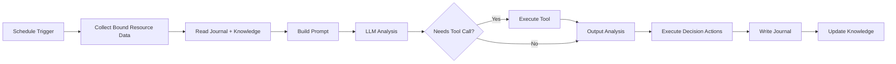

# AI Agent

AI Agent is NeoMind's **autonomous execution mode** — you set goals and triggers, and the Agent runs automatically on schedule or event, collecting data, calling LLM for analysis, and executing actions. For a detailed comparison with [AI Chat](./5-ai-chat.md) (trigger, context, use cases), see the [Chat vs Agent](./5-ai-chat.md#chat-vs-agent-two-modes) table in the AI Chat doc.

## Prerequisites

- An [LLM backend](./2-configure-llm.md) configured (Agents call LLM)
- [Devices](./3-onboard-device.md) onboarded (Agents need data sources)

## Interface Overview

Click **Agents** (bot icon) in the left nav to open the Agent management page:


The page displays all agents in a **card grid**, each card showing:

| Info | Description |
|------|-------------|
| **Agent Name** | The name you set (e.g. "Temperature Patrol", "Energy Report") |
| **Status Badge** | Active / Paused / Executing / Error |
| **Schedule** | Cron expression / Interval / Event |
| **Last Run** | Time and result of the most recent execution |

The page has four tabs at the top: **Agents** (agent list), **Memory** (system memory), **Skills** (skill management), and **Tools** (tool management).

:::note Skills
Knowledge files that provide Agents with scenario-specific operational guidance (built-in skills are read-only; user skills can be created, edited, and deleted in the tab). During execution, an Agent automatically matches relevant skills by description (BM25 lexical ranking), and can also search and load them on demand via the `skill` tool (`skill(action="search"/"load")`).
:::

## Creating an Agent

Click the **Create AI Agent** button in the top right to open the full-screen editor:


The editor is split into left and right columns. Here's what each field means:

### 1. Name & Prompt (Left)

- **Name**: 1–100 characters, easy to identify (e.g. "Energy Patrol", "Device Health Monitor")
- **Description**: Optional, brief summary of the agent's purpose
- **User Prompt**: Tell the Agent what to do. 1–10000 characters.

Example prompt:

> Check the latest readings from all temperature and humidity sensors. If any sensor reports temperature above 35C, notify the ops team via Slack and log an alert on the dashboard. If all devices are normal, give a brief summary.

### 2. Execution Mode (Right)

| Mode | Description | Best For |
|------|-------------|----------|
| **Focused** | Binds specific resources; Agent works within defined scope, single-pass analysis, token-efficient | Monitoring, alerts, data analysis |
| **Free** | No resource binding; LLM freely explores with all tools, multi-round reasoning | Complex automation, device control, exploratory tasks |

**Focused mode** requires bound resources (device metrics / extension metrics / devices / extension tools). The Agent only collects and analyzes data within the bound scope. Scope validation rejects commands outside bound resources.

**Free mode** needs no resource binding. The LLM has access to all tools (device / rule / message / extension / shell, etc.) and can do multi-round tool calls (default max 30 rounds, 5-minute timeout).

### 3. Schedule Type (Right)


Agents trigger automatically based on their schedule:

| Schedule | Description | Config |
|----------|-------------|--------|
| **Cron** | Triggers on cron expression | `schedule_type: "cron"`, `cron_expression: "0 0 * * * *"` |
| **Interval** | Executes every N seconds | `schedule_type: "interval"`, `interval_seconds: 300` |
| **Event** | Triggers on device data change / alert | `schedule_type: "event"` |

:::note
Agent Cron expressions use the **6-field format** (with seconds): `sec min hour day month weekday` — the same syntax as the triggers in [Automation Rules](./7-automation-rules.md).
:::

**Event trigger**: Executes automatically when devices push new data or the system generates alerts. Ideal for real-time response scenarios (e.g. immediate analysis after anomaly detection). Event triggers have a 60-second dedup window to prevent event storms.

### 4. LLM Backend

Each Agent can bind an independent LLM backend. Decoupled from the Chat model — switching Chat models doesn't affect Agent configuration. Recommendations:
- **Simple monitoring**: Local small model (`qwen3.5:4b`), lower latency and cost
- **Complex analysis**: Large model (`qwen3.5:32b` / cloud model), better reasoning quality

Click **Save** at the bottom to save the Agent.

### Worked Example: Creating the "Temperature Patrol" Agent

Let's tie the fields together with a concrete goal: "check all temperature sensors once an hour; notify ops above 35°C". Fill in each field:

| Field | Value | Notes |
|-------|-------|-------|
| **Name** | `Temperature Patrol` | 1–100 characters, required |
| **Description** | `Hourly temperature patrol with automatic over-temperature alerts` | Optional, ≤500 characters |
| **User Prompt** | See below | 1–10000 characters, required |
| **Execution Mode** | `Focused` | Works only within the bound sensors — saves tokens and can't touch other devices |
| **Resources** | Bind the `temperature` metric of 2 temperature sensors | Focused mode requires at least one bound resource, otherwise saving is rejected |
| **Schedule** | `Cron`, expression `0 0 * * * *` | 6-field format (with seconds) — every hour on the hour |
| **LLM Backend** | `qwen3.5:4b` (or a stronger model) | A local small model is fine for simple patrols |

User Prompt example (copy and adapt):

```text
You are a temperature patrol officer. Read the latest values of all bound temperature sensors:
1. All below 35°C: report in one sentence — "Patrol OK, max temperature XX°C";
2. Any above 35°C: send an alert message (title includes device name and current
   temperature) and state in your reply that the alert was sent;
3. If the journal shows the same alert was already sent for the same device in the
   previous round, do not send it again.
```

After clicking **Save**, the Agent appears in the list immediately with status **Active** and starts following the cron schedule.

#### Creating the Same Agent via the API

Every Web UI field maps to a field in the `POST /api/agents` request body. The request equivalent to the table above:

```bash
curl -X POST http://localhost:9375/api/agents \
  -H "Authorization: Bearer <JWT>" \
  -H "Content-Type: application/json" \
  -d '{
    "name": "Temperature Patrol",
    "description": "Hourly temperature patrol with automatic over-temperature alerts",
    "user_prompt": "Read the latest values of all bound temperature sensors; send an alert above 35°C, otherwise report briefly.",
    "execution_mode": "focused",
    "resources": [
      { "resource_id": "device:sensor-01:temperature", "resource_type": "metric", "name": "Machine Room 1 Temperature" },
      { "resource_id": "device:sensor-02:temperature", "resource_type": "metric", "name": "Machine Room 2 Temperature" }
    ],
    "schedule": { "schedule_type": "cron", "cron_expression": "0 0 * * * *" },
    "llm_backend_id": "default"
  }'
```

Successful response (`id` is used for later queries and triggers):

```json
{
  "success": true,
  "data": { "id": "8f3a…", "name": "Temperature Patrol", "status": "active" }
}
```

Key request body constraints (identical to the Web UI validation):

| Field | Constraint |
|-------|-----------|
| `name` | Required, 1–100 characters |
| `user_prompt` | Required, 1–10000 characters |
| `description` | Optional, ≤500 characters |
| `system_prompt` | Optional, ≤4000 characters, overrides the default identity |
| `execution_mode` | `focused` / `free`; `focused` requires at least one `resources` entry |
| `schedule.schedule_type` | `interval` / `cron` / `event`; `interval` needs `interval_seconds` ≥ 10 (`0` = fully manual); `cron` needs a valid 6-field `cron_expression` |
| `resources[].resource_type` | `device` / `metric` / `command` / `extension_metric` / `extension_tool` / `data_stream` |
| `max_chain_depth` | 1–30, default 3 (tool-call round cap for Focused+ mode) |

## Running It Once and Reading the Results

No need to wait for the cron tick — verify the Agent works as expected right after saving:

**Step 1 · Trigger an execution**: click **Execute Now** at the top right of the detail page, or call the API:

```bash
curl -X POST http://localhost:9375/api/agents/<agent_id>/execute \
  -H "Authorization: Bearer <JWT>" \
  -H "Content-Type: application/json" \
  -d '{ "trigger_type": "manual", "input": "Run one patrol" }'
```

**Step 2 · Poll the execution status**: an execution usually takes tens of seconds (collect data → LLM analysis → actions). The status badge changes in real time (Executing → Active); you can also poll the API:

```bash
curl http://localhost:9375/api/agents/<agent_id>/executions
```

Fields of an execution record (illustrative):

```json
{
  "executions": [{
    "id": "exec-9c1f…",
    "agent_id": "8f3a…",
    "timestamp": "2026-09-09T14:00:00Z",
    "trigger_type": "manual",
    "status": "Completed",
    "duration_ms": 21340
  }]
}
```

`status` values: `Running` / `Completed` / `Failed` / `Partial` (some actions failed). On `Failed`, check the `error` field.

**Step 3 · Read the execution detail (decision process)**: append the execution `id` to the detail endpoint to see the Agent's full reasoning chain — which data was collected, each reasoning step, every decision, and the final conclusion:

```bash
curl http://localhost:9375/api/agents/<agent_id>/executions/<execution_id>
```

The detail is organized in two blocks: `decision_process` (`situation_analysis` → `data_collected` → `reasoning_steps` → `decisions` → `conclusion`) and `result` (`actions_executed`, `notifications_sent`, `summary`). This is the primary place to debug "why didn't the Agent alert" / "why did it alert twice". In the Web UI, clicking an entry in the execution history shows exactly this content.

**Step 4 · See what the journal recorded**: after the execution finishes, the memory system appends a journal entry (visible in the detail page's **Memory** panel). The structure of a journal entry:

```json
{
  "timestamp": 1788930400,
  "execution_id": "exec-9c1f…",
  "outcome": "Patrol OK: 2 sensors at 26.4°C / 27.1°C, below the 35°C threshold, no alert needed",
  "action_taken": "Read latest temperature of sensor-01; Read latest temperature of sensor-02; Report patrol result",
  "success": true,
  "stop_reason": "completed"
}
```

- `outcome` is the LLM's conclusion summary (truncated to 300 characters)
- `action_taken` is the list of executed actions (max 5 entries, each truncated to 150 characters)
- The journal is FIFO with only the most recent N entries kept; the Agent reads these before each execution — which is what makes "don't repeat the alert from last round" in the example prompt actually work.

## Agent Detail

Click any Agent card to open the detail panel:


The detail panel contains multiple sections:

| Section | Description |
|---------|-------------|
| **Top Action Bar** | Edit and Execute Now buttons |
| **Overview** | Agent basic info, bound resources, schedule config, LLM backend |
| **Execution History** | Chronological execution records with success/failure status and duration |
| **Memory** | Journal logs and Knowledge files |
| **User Messages** | Feedback messages left for the Agent |

The **Execute Now** button in the top right triggers an immediate execution without waiting for the schedule.

## Agent Memory System

Agents have an independent memory system that accumulates experience across execution cycles:

### Journal (Execution Log)

Each execution writes a journal entry recording:
- Execution time and trigger type
- Collected data summary
- LLM analysis conclusion
- Actions taken (`action_taken`)
- Success / failure status

For a full example of one entry's fields, see [Running It Once and Reading the Results — Step 4](#running-it-once-and-reading-the-results). On the next execution, the Agent reads recent journal entries to learn from historical patterns (avoid repeating failed actions, adjust thresholds, skip already-sent alerts).

### Knowledge Files

The Agent's persistent knowledge in Markdown format, stored under `data/memory/agents/<agent_id>/` (up to 20 files). **When the Agent is created**, a **task-understanding.md** file is automatically initialized, solidifying what you entered in the form into the Agent's self-image. For a "Temperature Patrol" agent, the actual content looks like this:

```markdown
# Task Understanding

## Identity & Role
You are an intelligent IoT agent named 'Temperature Patrol' monitoring edge devices.

## Mission
Read the latest values of all bound temperature sensors; send an alert above 35°C,
otherwise report briefly.

## Bound Resources
- Machine Room 1 Temperature (device:sensor-01:temperature)
- Machine Room 2 Temperature (device:sensor-02:temperature)

## Schedule
Cron: 0 0 * * * *

## Status
- Execution mode: Focused
- Created: 2026-09-09 14:00 UTC

## Memory Commands
- Read this file: `memory(action='read', target='custom:task-understanding')`
- Update this file: `memory(action='add', target='custom:task-understanding', ...)`

## Notes
This file was auto-created when the agent was created.
```

The four core sections map one-to-one onto the creation form: **Identity & Role** (identity, from the System Prompt; a default template is used when unset), **Mission** (from the User Prompt), **Bound Resources** (the bound resources), **Schedule** (the execution plan). You can manually edit the file to fine-tune Agent behavior (Agent detail → Memory panel); the Agent also **appends** discovered thresholds, device quirks, and patterns as it runs — for example, after a few rounds you may find it added "sensor-02 consistently reads ~2°C higher than sensor-01 on summer afternoons". The content is injected into the prompt of every execution, bounded by the context length of the Agent's bound LLM.

### User Messages (Feedback)

You can leave messages for the Agent (Agent detail page → User Messages), which the Agent reads on its next execution. Used to correct Agent behavior or provide additional context. Auto-retains the most recent 50 messages.

## Execution Flow



> Tool calls can loop (G → E) until the LLM no longer needs tools or hits the 30-round limit.

## Status Management

The status badge on each Agent card reflects the current state in real time:

| Status | Description | Color |
|--------|-------------|-------|
| **Active** | Agent is active, auto-executes on schedule | Green |
| **Executing** | Agent is currently running (real-time WebSocket push) | Blue / animated |
| **Paused** | Agent is paused, won't auto-trigger (can be run manually) | Gray |
| **Error** | Last execution failed, check logs to troubleshoot | Red |
| **Completed** | Ready state after a manual task finishes; can be run again | Green |

Pause/activate is toggled via the switch button on the card, which syncs with the scheduler — pausing unschedules, activating reschedules.

### Real-time Execution Status

When an Agent is executing, the card shows a live "Thinking..." indicator (pushed via WebSocket), letting you see what the LLM is currently doing (e.g. "Querying device data", "Analyzing temperature trends").

### Manual Execution

Don't want to wait for the schedule? Click **Execute Now** on the Agent card or detail page to execute immediately.

## Typical Scenarios

### Scenario 1: Hourly Temperature Patrol (Focused + Cron)

- **Mode**: Focused
- **Resources**: Bind 3 temperature sensor metrics
- **Schedule**: Cron `0 0 * * * *` (hourly)
- **Prompt**: Check the latest readings from all temperature sensors. Notify via Slack if above 35C. Send Telegram + email if above 45C.

### Scenario 2: Event-Driven Anomaly Diagnosis (Free + Event)

- **Mode**: Free
- **Resources**: None (free exploration)
- **Schedule**: Event (device data change)
- **Prompt**: Analyze whether the incoming data is anomalous. If abnormal, query related device history, determine if alerting or auto-remediation is needed. May use shell tool to check system status.

### Scenario 3: Daily Energy Report (Focused + Cron)

- **Mode**: Focused
- **Resources**: Bind energy consumption metrics
- **Schedule**: Cron `0 0 8 * * *` (daily 8 AM)
- **Prompt**: Summarize yesterday's 24-hour energy data, calculate peak and average, compare with the same period last week, generate a daily report, and send it to the ops email.

## CLI Management

```bash
# List all agents
neomind agent list

# View agent details
neomind agent get <agent_id>

# Activate / pause
neomind agent control <agent_id> active
neomind agent control <agent_id> paused

# Manually trigger execution (with input hint)
neomind agent invoke <agent_id> "Check all sensor readings"
```

## Concurrency & Timeout

- **Global concurrency**: Max 10 Agents executing simultaneously
- **Per-LLM-backend concurrency**: Max 2 concurrent requests per backend
- **Global timeout**: Max 5 minutes (300 seconds) per execution
- **Tool timeout**: Shell 30s (max 600s), Web fetch 15s, Extensions 300s

If concurrency is full, the scheduler skips the current execution (retries on next tick).

## Prompt Tips

- **Be specific about output**: "Generate a summary under 200 words" is more controllable than "analyze data"
- **Give conditional branches**: "If temp > 35 notify Slack; if > 45 also send Telegram and email"
- **Reference device names**: "Check sensor-01 through sensor-03" is more precise than "check all sensors"
- **Leverage memory**: The Agent reads journals, so you can write "If the same alert was already sent last time, don't repeat it"

## Integration with Other Modules

| Module | Integration |
|--------|-------------|
| [Automation Rules](./7-automation-rules.md) | Rule's `TRIGGER_AGENT` action can trigger Agents |
| [Notifications](./8-notifications.md) | Agent decides whether to send notifications after analysis |
| [Devices](./3-onboard-device.md) | Focused mode binds device metrics |
| [AI Chat](./5-ai-chat.md) | Two AI operation modes, complementary |

## Mobile


On mobile, the interface switches to a single-column card list, supporting status viewing, manual execution, and pause/activate toggling.

## Common Pitfalls

- **Focused save rejected**: `Focused` mode requires at least one bound resource (device / metric / extension tool); creating with no resources returns `Focused mode requires at least one resource binding`. Use `Free` if you just want free exploration.
- **Cron expression not firing**: Agent cron uses the **6-field** format (`sec min hour day month weekday`). Pasting a familiar 5-field expression like `0 9 * * *` shifts every field (e.g. "every minute on Mondays") — add the seconds field: `0 0 9 * * *`.
- **Interval too small gets rejected**: `interval_seconds` must be at least 10; setting `0` means "fully manual" (on-demand) — it never auto-schedules and only runs via Execute Now.
- **Changed the User Prompt but behavior didn't change**: check task-understanding.md — it solidified the task description at creation time, and the Agent keeps appending experience to it. Behavior is driven by that file together with the User Prompt; edit the file in the Memory panel when needed.
- **"Why did it forget last week?"**: the journal is a FIFO ring that keeps only the most recent N entries. Rules the Agent must remember long-term belong in the User Prompt, task-understanding.md, or User Messages — not the journal.
- **Judging too early**: a single execution can take up to 5 minutes. While the status is Executing, wait for the WebSocket updates or poll the executions endpoint instead of assuming failure.

## Next Steps

- **[Automation Rules](./7-automation-rules.md)** — Use JSON rules for deterministic triggers and Agents for fuzzy judgment — they complement each other
- **[Notifications](./8-notifications.md)** — Agent needs to notify ops after analysis? Configure notification channels first
- **[Extensions](./9-extensions.md)** — Agents can call commands from installed extensions (YOLO detection, OCR, etc.)

---

*Last updated: 2026-09-09*
