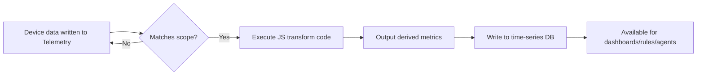

# Data Transforms

Data Transforms let NeoMind automatically process telemetry data **after device data is written to Telemetry** (triggered by the write event, millisecond-scale) — using a JavaScript function to convert raw metrics into derived metrics. For example:

- Celsius → Fahrenheit
- Raw voltage + current → computed power
- Device online state → human-readable status text
- Invoke extension commands to process data (e.g. YOLO detection → extract confidence)

Derived metrics from transforms can be used just like regular device metrics in [dashboards](./4-use-dashboard.md), [rules](./7-automation-rules.md), and [AI Agents](./6-ai-agent.md).

## Rules vs Transforms

| Dimension | Rules | Transforms |
|-----------|-------|-----------|
| Purpose | Condition evaluation → execute actions | Data processing → generate new metrics |
| Output | Notifications / commands / Agent calls | New telemetry metrics (bindable to dashboards/rules) |
| Logic | JSON conditions + actions | JavaScript code |
| Timing | Fires when condition is met | Real-time transform per data point |

## Interface Overview

Switch to the **Transforms** tab in the Automation page:


The page displays all transforms in a table, each row containing:

| Column | Description |
|--------|-------------|
| **Name** | Transform display name |
| **Scope** | Global / Device Type / Device |
| **Created** | When the transform was created |
| **Last Executed** | When it last ran |
| **Status Toggle** | Enable / disable switch |
| **Actions Menu** | Edit, export, delete |

The **Import / Export** button in the top right lets you bulk import/export transform JSON.

## Creating a Transform via Web UI

### Step 1: Open the Transform Builder

In the Transforms tab, click the **Create** button to open the full-screen builder:


The builder uses a **split-pane** layout:

| Area | Description |
|------|-------------|
| **Left · Config Rail** | Name, description, scope, output prefix, complexity |
| **Right · Code Workspace** | JavaScript code editor + variables panel + test strip |

### Step 2: Fill in Basic Info

| Field | Description |
|-------|-------------|
| **Name** | Transform display name |
| **Description** | Optional, explains the transform's purpose |
| **Output Prefix** | Naming prefix for derived metrics. If set to `converted`, output metrics are named `converted.temp_f` |
| **Complexity** | Number 1–5, used for execution ordering (lower complexity executes first) |

### Step 3: Select Scope

Scope determines which devices' data the transform processes:

| Scope | Description | Use Case |
|-------|-------------|----------|
| **Global** | Processes all devices' data | Universal transforms (e.g. unit conversion) |
| **Device Type** | Only processes data from a specified device type | Batch transforms for similar devices |
| **Device** | Only processes a single device's data | Custom transforms for a specific device |

### Step 4: Write the Transform Code


Write the transform function in JavaScript in the code editor. The **`input`** variable holds the input value — single-key metric objects (e.g. `{"temperature": 25}`) are auto-unwrapped to the scalar so it can be used directly; access the full input object via `input_raw`. `return` an object as output:

```javascript
// Celsius to Fahrenheit
return {
  temp_f: input * 9/5 + 32
}
```

**Available variables**:

| Variable | Description |
|----------|-------------|
| `input` | The input data — single-key metric objects (e.g. `{"temperature": 25}`) are auto-unwrapped to the scalar so it can participate in arithmetic directly |
| `input_raw` | The full input data object (no auto-unwrap) |
| `extensions.invoke(ext_id, command, params)` | Invoke an extension command; returns the extension's result |

**`input` auto-unwrap rules** — know exactly what your code receives before writing it; this is the single biggest factor in whether a transform "just works" or errors out:

| Device data shape | Value of `input` | Value of `input_raw` | How to write code |
|-------------------|------------------|----------------------|-------------------|
| Scalar (e.g. `25`) | `25` | `25` | `input * 9/5 + 32` |
| Single-key object `{"temperature": 25}` | `25` (auto-unwrapped) | `{"temperature": 25}` | Use `input * 9/5 + 32` directly; use `input_raw.temperature` when you need the key name |
| Multi-key object `{"temperature": 25, "humidity": 60}` | The object as-is | Same as `input` | `input.temperature * 9/5 + 32` |

:::warning Single-key vs multi-key — code is not interchangeable
The same `input * 9/5 + 32` works with `{"temperature": 25}` (single key, auto-unwrapped) but yields `NaN` with `{"temperature": 25, "humidity": 60}` (multi-key). If a transform must be reused across device types with uncertain input shapes, write defensively: `return { temp_f: (input_raw.temperature ?? input) * 9/5 + 32 }`. Always verify both shapes with the [test strip](#step-5-test-the-transform) before saving.
:::

**Variables panel**: The left panel lets you insert device metrics and extension data sources. After selecting a device type, all its metrics are listed — click to insert into code. You can also select extension commands from the extension panel to generate invocation code.

### Step 5: Test the Transform

The test strip at the bottom of the builder lets you validate the transform with mock data:

1. Enter a mock value in the test input (e.g. `25`)
2. Click **Test**
3. Check the output result

After testing, click **Save** to save the transform.

## How Transforms Work



Derived metrics are registered with the DataSourceId format `transform:<transform_id>:<prefix>.<field>`, e.g. `transform:9a1b2c3d…:converted.temp_f`, and appear grouped under the Transform type in data source pickers. These metrics can be:
- Bound as data sources in dashboards
- Referenced in rule conditions
- Bound in Agent Focused mode

## Transform Examples

### 1. Celsius to Fahrenheit

```javascript
return {
  temp_f: input * 9 / 5 + 32
}
```

Output metric: `converted.temp_f`

### 2. Compute Power (Voltage × Current)

```javascript
// Assume input contains voltage and current
return {
  power: input.voltage * input.current,
  power_kw: (input.voltage * input.current) / 1000
}
```

### 3. Device Status Text

```javascript
return {
  status_text: input === 1 ? "Online" : "Offline",
  is_online: input === 1
}
```

### 4. Invoke Extension to Process Image

```javascript
// Call YOLO extension for object detection
const result = extensions.invoke('yolo-video', 'detect', {
  data: input
})

return {
  detections: result.detections,
  object_count: result.detections.length,
  has_person: result.detections.some(d => d.class === 'person')
}
```

### 5. Call an Extension for External Data (extensions.invoke)

`extensions.invoke(extension_id, command, params)` is not limited to images — any command of any installed extension can be called. For example, use a weather extension to add outdoor context to a temperature reading:

```javascript
// Fetch current weather (extension ID and command name per the Extensions page)
const weather = extensions.invoke('weather.ext', 'get_current', { location: 'Beijing' })

return {
  temp_f: input * 9/5 + 32,
  outdoor_temp: weather.temp_f || 0
}
```

:::note Execution mechanism
Before running your code, the transform engine scans it for `extensions.invoke(...)` calls, executes those extension commands asynchronously **first**, then injects the results into the code context — so the syntax above reads values synchronously, no `await` needed. Missing extensions or failed invocations are recorded in the execution record's `warnings` (see `output.warning_count` in step 3 of the [complete lifecycle example](#complete-lifecycle-example-from-creation-to-dashboard)).
:::

### 6. Numeric Range Classification

```javascript
let level = 'normal'
if (input > 80) level = 'critical'
else if (input > 60) level = 'warning'
else if (input > 40) level = 'notice'

return {
  level: level,
  level_value: { normal: 0, notice: 1, warning: 2, critical: 3 }[level]
}
```

## Complete Lifecycle Example: From Creation to Dashboard

Here is the full journey in one real scenario: a device reports Celsius; we derive a Fahrenheit metric and put it on a dashboard.

**Step 1 · Create the transform via CLI**

```bash
# (Optional) validate the logic first — nothing is persisted
neomind transform test-code \
  --code 'return { temp_f: input * 9/5 + 32 }' \
  --input '{"temperature": 25}'

# Create and enable
neomind transform create \
  --name "Fahrenheit Converter" \
  --scope global \
  --code 'return { temp_f: input * 9/5 + 32 }' \
  --output-prefix converted \
  --enabled true
```

Once created, `neomind transform list` shows it (with ID, scope, output prefix). `--scope` accepts `global` (all devices), `device_type:TH Sensor` (a type), or `device:sensor-01` (a single device).

**Step 2 · Device data arrives; the transform runs automatically**

Nothing to trigger manually — when sensor-01 publishes `{"temperature": 25}`, the transform engine matches the scope, executes the code within milliseconds, and writes the derived metric `converted.temp_f = 77` into the time-series store. The derived metric's full identity is `transform:<transform_id>:converted.temp_f`.

**Step 3 · Confirm the execution**

```bash
neomind transform executions <transform_id> --limit 20
```

A real execution record looks like this (`status: "completed"` means success):

```json
{
  "id": "7c44cb8f-…",
  "automation_id": "f010c73c-…",
  "automation_type": "transform",
  "started_at": 1788930297329,
  "ended_at": 1788930297338,
  "status": "completed",
  "error": null,
  "output": { "metric_count": 1, "warning_count": 0 }
}
```

To see the metric values themselves, feed a test data point through the transform and inspect the output:

```bash
curl -X POST http://localhost:9375/api/automations/transforms/<transform_id>/test \
  -H "Authorization: Bearer <JWT>" -H "Content-Type: application/json" \
  -d '{ "device_id": "sensor-01", "data": {"temperature": 25} }'
```

The `metrics` array in the response is exactly what the transform produces (identical to what gets written to the time-series store when real data arrives):

```json
{
  "success": true,
  "data": {
    "transform_id": "f010c73c-…",
    "metrics": [{
      "device_id": "sensor-01",
      "transform_id": "f010c73c-…",
      "metric": "converted.temp_f",
      "value": 77.0,
      "timestamp": 1788930297,
      "quality": 1.0
    }],
    "count": 1,
    "warnings": []
  }
}
```

**Step 4 · Bind it on a dashboard**

Open the [dashboard](./4-use-dashboard.md) editor, add a widget (Chart / Value) → find the **Transform** group in the data source picker → select `converted.temp_f` (full ID like `transform:f010c73c-…:converted.temp_f`) → save. From then on, every incoming device data point updates the derived metric on the dashboard in real time. Rule conditions can reference the same metric too (e.g. `converted.temp_f > 170` triggers an alert).

## CLI Management

```bash
# Create a transform (Celsius → Fahrenheit; access the input value via `input` in JS)
neomind transform create \
  --name "Fahrenheit Converter" \
  --scope global \
  --code 'return { temp_f: input * 9/5 + 32 }' \
  --output-prefix converted \
  --enabled true

# List all transforms / view details
neomind transform list
neomind transform get <id>

# View recent executions (first stop when "the code ran but produced no output")
neomind transform executions <id> --limit 20

# Enable / disable
neomind transform enable <id>
neomind transform disable <id>

# Delete
neomind transform delete <id>
```

## REST API

```bash
# Create transform
curl -X POST http://localhost:9375/api/automations \
  -H "Content-Type: application/json" \
  -d '{
    "name": "Fahrenheit Converter",
    "description": "Convert Celsius to Fahrenheit",
    "type": "transform",
    "enabled": true,
    "definition": {
      "scope": "global",
      "js_code": "return { temp_f: input * 9/5 + 32 }",
      "output_prefix": "converted",
      "complexity": 2
    }
  }'

# List all transforms
curl http://localhost:9375/api/automations

# Update transform
curl -X PUT http://localhost:9375/api/automations/<id> \
  -H "Content-Type: application/json" \
  -d '{"name": "Updated Name", "definition": {"scope": "global", "js_code": "...", "output_prefix": "converted", "complexity": 2}}'
```

## Import / Export

The **Import / Export** button in the Transforms tab supports bulk management. You can also select **Export** from an individual transform's actions menu to export a single transform.

Export file format: `neomind-transforms-YYYY-MM-DD.json`.

## Integration with Other Modules

| Module | Description |
|--------|-------------|
| [Dashboards](./4-use-dashboard.md) | Transform output metrics can be bound as dashboard widget data sources |
| [Automation Rules](./7-automation-rules.md) | Rule conditions can reference transform output `transform:<prefix>:<field>` metrics |
| [AI Agent](./6-ai-agent.md) | Agent Focused mode can bind transform output metrics |
| [Devices](./3-onboard-device.md) | Transforms process raw telemetry published by devices |
| [Extensions](./9-extensions.md) | Transform code can call `extensions.invoke()` to execute extension commands |

## Best Practices

- **Use Output Prefixes wisely**: Set different prefixes for different transforms (e.g. `converted`, `status`, `aggregated`) to avoid metric name collisions
- **Test before saving**: The builder's Test feature quickly validates code logic without waiting for real data
- **Complexity ordering**: Transforms that depend on other transforms' output should have higher complexity to ensure correct execution order
- **Minimize scope**: Use Device Type instead of Global when possible to reduce unnecessary transform overhead
- **Keep code lightweight**: Transforms execute on every data point — keep code simple (avoid complex loops/recursion)

## Mobile


On mobile, the interface switches to a single-column layout supporting list viewing and status toggling. Edit transforms on desktop (the code editor needs screen space).

## Next Steps

- [Automation Rules](./7-automation-rules.md) — Reference transform-derived metrics in rule conditions
- [Use Dashboards](./4-use-dashboard.md) — Bind derived metrics as dashboard widget data sources
- [Extensions](./9-extensions.md) — Call extension commands from transforms via `extensions.invoke()`

---

*Last updated: 2026-09-09*
