## Overview

The CamThink AI Inference Platform provides intelligent image analysis and processing capabilities. By integrating with IoT devices, it enables real-time image acquisition and automatic inference based on pre-configured AI models. CamThink supports integration with the Beaver-IoT platform, allowing users to efficiently bind devices, select AI models, and monitor inference results.

## How It Works

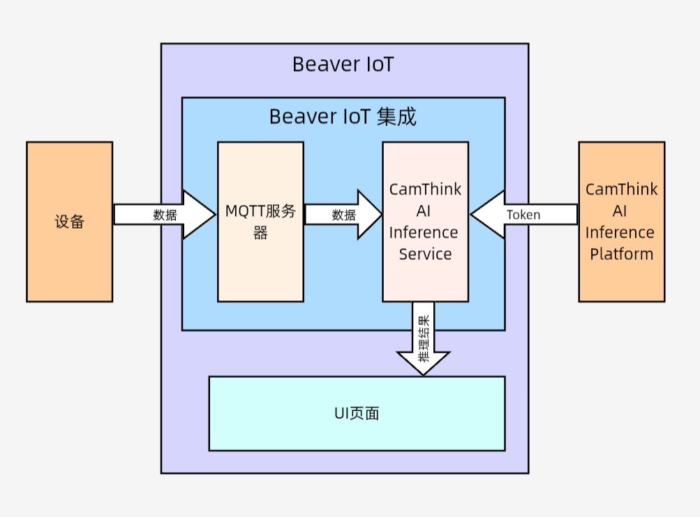

## Core Features Overview

1. **Dashboard**: Provides global monitoring for the operation of AI inference services, helping users quickly understand the system status, resource utilization, and overall model performance. The dashboard consists of three sections: local device information, resource usage, and model operation status.
	* **Local Device Information:**
		* **Contents:** System version (e.g., Ubuntu 22.04), software name, hardware configuration (CPU/GPU models), platform version, and the total number of models and Tokens (currently 29 models and 38 Tokens).
		* **Purpose:** Enables administrators to grasp the platform’s scale (the number of models and Tokens reflects business coverage).
	* **Resource Utilization:**
		* **Contents:** Real-time and historical curves displaying resource usage rates (e.g., current CPU 1.7%, GPU 0%, memory 38%).
		* **Purpose:** Helps identify resource bottlenecks (e.g., CPU spikes during concurrent inference tasks, indicating a need for scaling or scheduling), as well as hardware over-provisioning or lack of GPU acceleration for models, supporting cost optimization.
	* **Model Operation Status:**
		* **Contents:** Pie chart showing the number of published vs. unpublished models (currently 12 published).
		* **Purpose:** Quickly indicates model deployment progress (a large number of unpublished models suggests a need to expedite development or testing); the number of published models directly reflects available inference capabilities (e.g., when adding new quality inspection tasks on a production line, you can check if there are enough deployed models).
	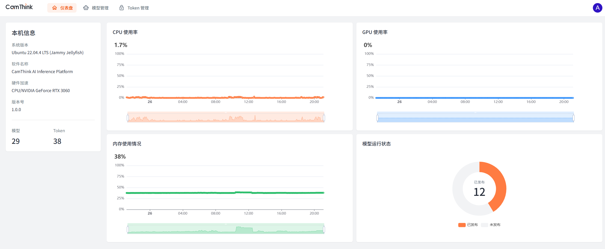
	
2. **Model Management**: Used for managing, maintaining, and updating AI models to ensure stable and efficient support for inference tasks. Functions include adding, deleting, modifying, and publishing models.
	* **Add Model**:
		* Click the '+ Add' button in the upper left corner of the Model Management page to enter the Add Model page.
			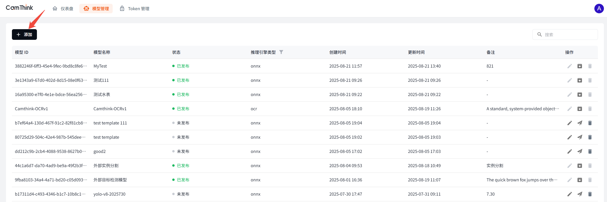
		* On the Add Model page, you can edit the model name (customizable), select the appropriate inference engine from the dropdown menu, upload the model file, modify model parameters, enter remarks (customizable), and click 'Save' in the lower right corner.
			
	* **Delete Model**:
		* Click the trash bin icon in the model action column to delete the model.
			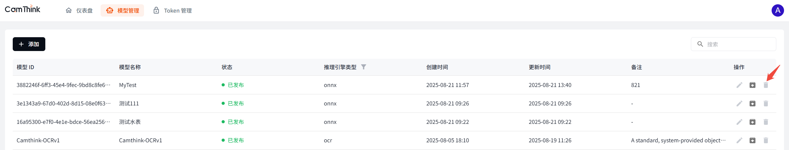
	* **Edit Model** (Note: Only unpublished models can be edited; published models cannot be modified at this time):
		* Click the pencil icon in the model action column to enter the Edit Model page.
			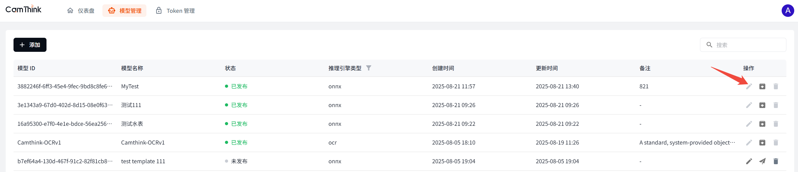
		* On the Edit Model page, make changes as needed. After finishing the edits, click 'Save' in the lower right corner.
			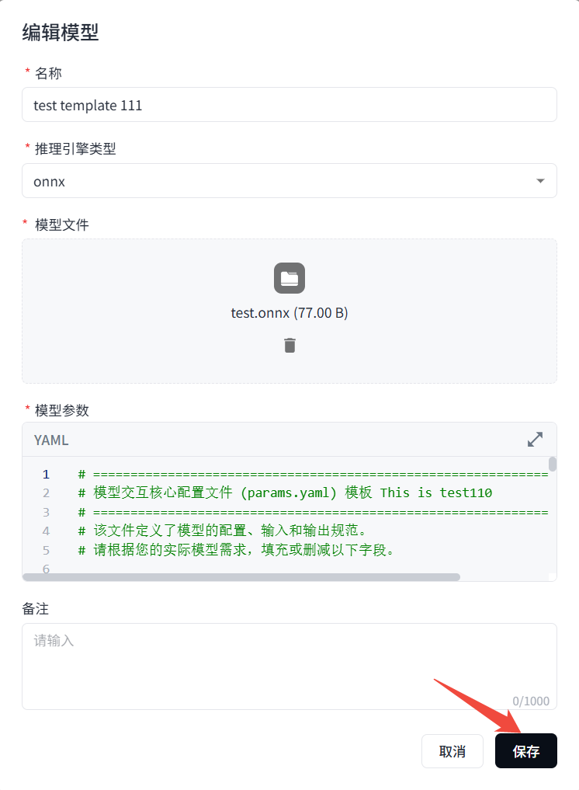
	* **Publish Model**:
		* Click the airplane icon in the model action column to publish the model. Once published, the model cannot be modified.
			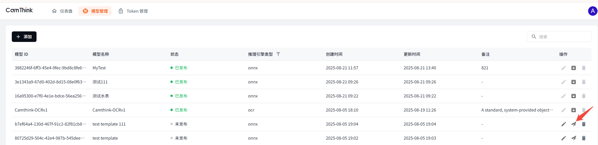
3. **Token Management**: Handles API access control and resource metering, serving three functions: identity authentication, permission binding, and usage metering. Functions include adding, modifying, and deleting tokens.
	* **Identity Authentication**: Uniquely identifies the caller (user/system/device) through a Token, replacing traditional username and password methods to reduce the risk of information leakage.
	* **Permission Binding**: Embeds claims within the Token to define the accessible API scope (for example, allowing access only to the "Water Meter Test Model" API while restricting access to the "Object Detection Model" API).
	* **Measurement Basis**: Associates with quota policies to record and deduct API call counts, enabling a mapping between usage and cost.
	* **Specific Operations:**
		* **Add Token**：
			* Click the 'Add' button at the top left corner of the device page to enter the Add Token page.
				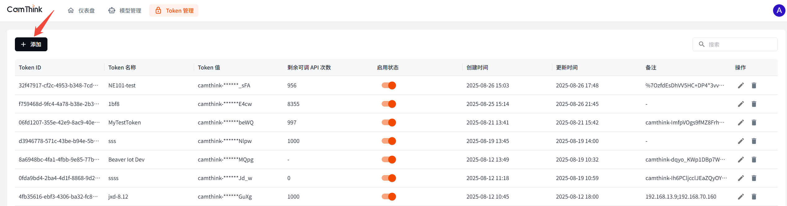
			* Edit the Token details, including: Name (customizable), Model Permissions (select the required model permissions from the dropdown menu as needed), Request Rate Limit (customizable, default is 60), Request Quota Limit (customizable, default is 1000), IP Whitelist (fill in as needed), and Remarks. After editing, click Save.
				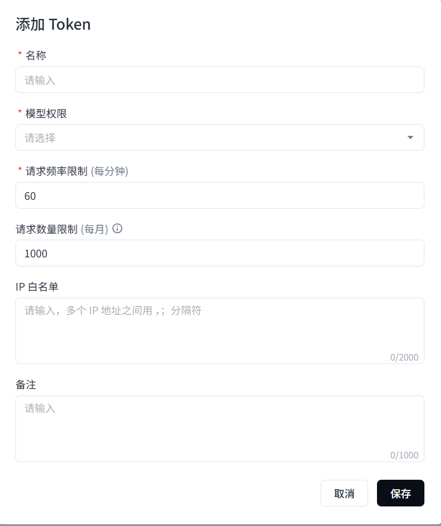
		* **DeleteToken**：
			* Click the trash can icon in the Token operation column to delete the Token.
				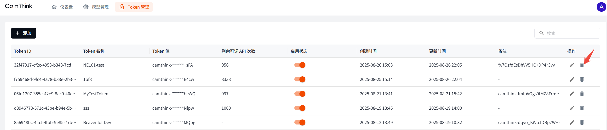
		* **Edit Token**：
			* Click the pencil icon in the Token operation column to enter the Edit Token page.
				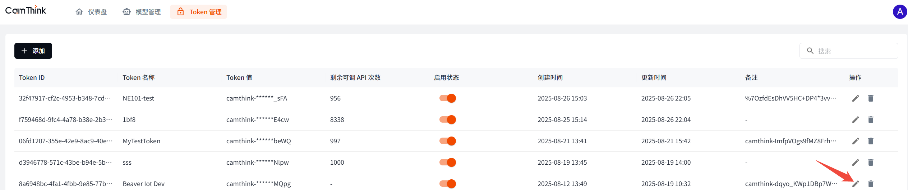
			* Edit the Token details, including: Name (customizable), Model Permissions (select the required model permissions from the dropdown menu as needed), Request Rate Limit (customizable, default is 60), Request Quota Limit (customizable, default is 1000), IP Whitelist (fill in as needed), and Remarks. After editing, click Save.
				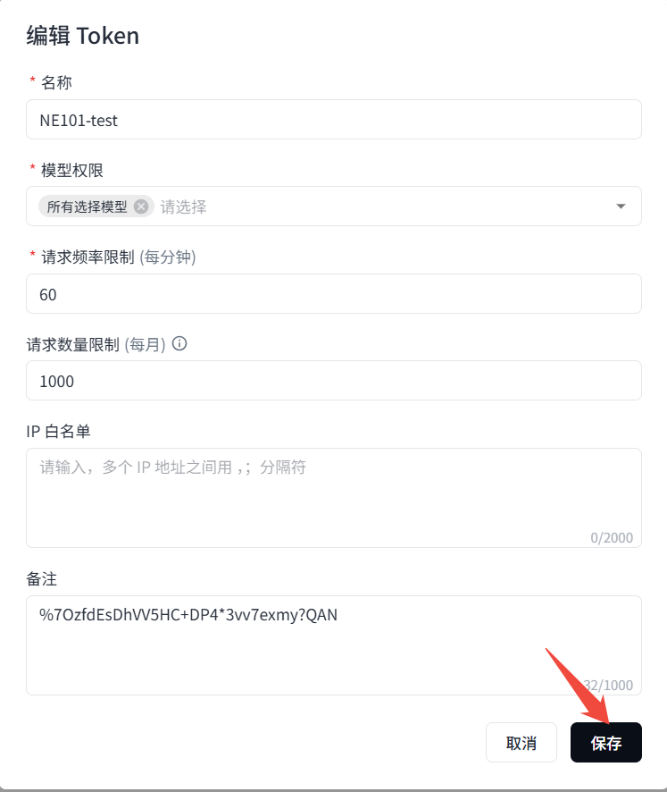
## Application Scenarios 

* Widely applicable in fields such as intelligent security, smart transportation, smart agriculture, and industrial manufacturing.