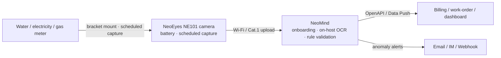

# Solution Overview

Automatic meter reading for water/electricity/gas meters: CamThink low-power cameras capture the dial on schedule, NeoMind runs **on-host OCR** to read the value, rules validate it, and results push to billing/O&M systems — replacing manual door-to-door reads.

## Scenario & Pain Points

- Meters scattered across stairwells, pump rooms, wells and remote sites: manual reading is slow and costly
- Replacing legacy meters with smart ones is disruptive (water outage) and often over budget
- Photo-plus-manual-entry introduces transcription errors and leaves no audit trail

## Architecture

All inference runs **locally on the NeoMind host** (paddle-ocr-v6 ships with a built-in tiny model — no GPU, no internet), and every reading keeps the source snapshot for traceability.

## Bill of Materials (BOM)

| Component | Choice | Qty | Notes |
|---|---|---|---|
| Camera | NeoEyes NE101 | 1/meter | Battery powered; default low-power profile = 5 captures/day, 2.4–6.2 yr Wi-Fi battery life (theoretical, see [NE101 overview](/docs/neoeyes-ne101-series/overview)) |
| Meter bracket | NE101 water-meter bracket (official accessory) | 1/meter | Fixes lens-to-dial geometry |
| Platform | NeoMind | 1 | Any Linux host / server / NG4500 |
| OCR extension | paddle-ocr-v6 | 1 | One-click install from marketplace, tiny model built in |

> Starter kit (≤10 meters): **one NE101 per meter (with bracket) + one Linux host running NeoMind**. Adding meters later only adds cameras.

## Expected Results

- Dial-reading accuracy up to **99%** (per the [NE101 official scenario data](/docs/neoeyes-ne101-series/overview); actual value depends on meter type and installation)
- Per-meter hardware cost is a fraction of smart-meter replacement — no plumbing work
- Every reading archives the source snapshot for dispute resolution

## Next

[Hardware & Deployment](./hardware-deployment) → [AI Model](./ai-model) → [Platform Configuration](./platform-configuration) → [Business Integration](./business-integration).
