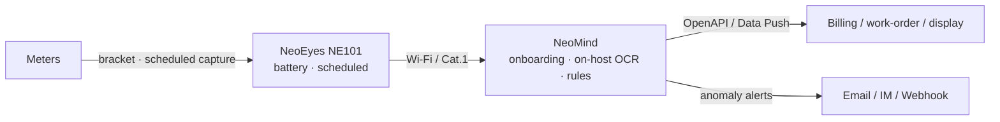

# Solution & Value

## Introduction

Automatic meter reading for water/electricity/gas meters: CamThink **NE101 low-power cameras** capture dials on schedule; NeoMind runs **on-host OCR** and pushes validated readings to business systems — replacing manual reads.

- **What it is**: camera + edge-platform automatic meter-reading solution
- **Problem solved**: scattered meters, costly manual reads, smart-meter retrofit over budget
- **Who uses it**: water utilities, property managers, energy operators and their integrators
- **Outcome**: readings auto-ingested (accuracy up to 99%, site-dependent), every read archived with its snapshot

## Solution Value

**Business**: fewer manual reads; higher collection frequency; scales by adding cameras only.
**Technical**: on-host inference (no continuous cloud); minimal bandwidth; video never leaves the site.
**Deployment**: no meter swap or outage works; battery powered, no wiring; small starter kit.

## Application Scenarios

| Scenario | Description |
|---|---|
| Residential | scattered stairwell/well meters, monthly settlement |
| Commercial Building | master/sub-meter energy accounting |
| Factory | workshop water/gas monitoring, anomaly detection |
| Utility | wide-area survey reads and loss analysis |

## At a Glance

| Item | Description |
|---|---|
| Problem | manual reading: costly, infrequent, error-prone |
| AI Capability | dial localization + digit OCR (on-host) |
| Input / Output | NE101 snapshots → structured reading (+snapshot) |
| Processing | Edge (on host) |
| Target Users | utilities / property / integrators |
| Main Benefit | unattended reading with full audit trail |

