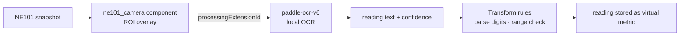

# AI Model

Recommended path: **host-side recognition** — the camera only captures and uploads; OCR runs locally on the NeoMind host. No on-device model maintenance; changing meter type only touches ROI config.

## Engine: paddle-ocr-v6 extension

- One-click install; the `tiny` model is bundled — **no GPU, no internet** (small/medium tiers download once on first switch)
- Optimized for utility meters, digital displays and nameplate serials
- Full walkthrough (water meter as the example scenario): [OCR use case: camera + OCR pipeline](/docs/neomind/use-cases/camera-ocr)

## Pipeline

- **ROI**: frame only the digit-wheel area — faster and robust to background clutter
- **Validation**: Transforms parse OCR text into numbers and check range/monotonicity (backward jumps and out-of-range flagged), see [Data Transforms](/docs/neomind/user-guide/7b-data-transforms)

