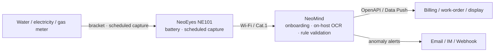

# Solution Components

## 2.1 Hardware

| Component | CamThink Product | Function |
|---|---|---|
| Camera | **NeoEyes NE101** (+ official meter bracket) | Scheduled dial capture, battery powered |
| Edge Platform Host | NeoMind on Linux host / NG4500 | Ingest, OCR, rules, data egress |
| Network | Wi-Fi / Cat.1 / Wi-Fi HaLow module options | Image uplink |
| Power | 7.2V battery (camera) / mains (host) | Power |

> Starter kit (≤10 meters): one NE101 per meter + one Linux host running NeoMind.

## 2.2 Software

| Component | Function |
|---|---|
| AI Model | Dial detection + digit OCR (paddle-ocr-v6, tiny tier built in) |
| Inference Engine | NeoMind extension runtime (local CPU, no GPU) |
| AI Platform | NeoMind: onboarding, dashboards, rules, Data Push/OpenAPI |
| ne101_camera component | Snapshot view + ROI + AI processing pipeline |
| MQTT / API | Device uplink and business downlink |

## 2.3 Solution Architecture

